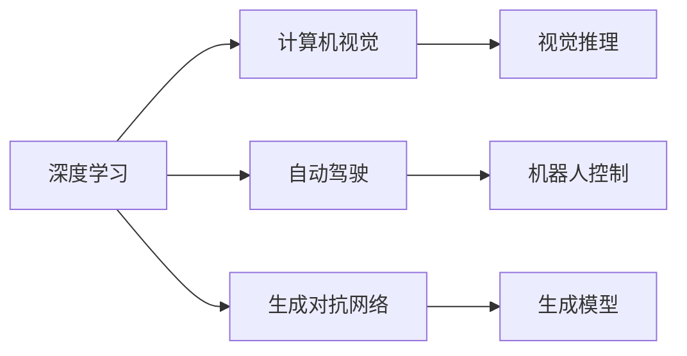

                 

## 1. 背景介绍

人工智能(AI)技术正以前所未有的速度发展，从深度学习的崛起，到强化学习、无监督学习等技术的突破，AI已经渗透到各个行业，带来了革命性的变化。然而，AI的未来发展方向和面临的挑战仍然是一个热门且复杂的话题。安德烈·卡尔帕奇(Andrej Karpathy)是深度学习和计算机视觉领域的知名专家，也是OpenAI的研究科学家，他对AI的未来发展有着独到见解。本节将简要介绍安德烈·卡尔帕奇的生平和他在AI领域的贡献，以及他关于AI未来研究的一些看法。

## 2. 核心概念与联系

### 2.1 核心概念概述

安德烈·卡尔帕奇在AI领域的贡献主要集中在深度学习、计算机视觉、自动驾驶等领域。他的研究涵盖了从基础的深度学习算法，到高级的视觉推理、生成模型、机器人控制等方向。他的许多工作，如ImageNet数据集、深度残差网络(ResNet)等，都对AI领域的发展产生了深远影响。

在本节中，我们将介绍一些与安德烈·卡尔帕奇的研究相关的核心概念，包括深度学习、计算机视觉、自动驾驶、生成对抗网络(GANs)、强化学习等。

### 2.2 概念间的关系

这些核心概念之间有着紧密的联系，它们共同构成了人工智能技术的基石。以下是一个简化的Mermaid流程图，展示了这些概念之间的联系：



这个流程图展示了深度学习作为基础，如何与计算机视觉、自动驾驶、生成对抗网络、生成模型、机器人控制等技术相融合，形成了一个强大的AI技术体系。

## 3. 核心算法原理 & 具体操作步骤
### 3.1 算法原理概述

安德烈·卡尔帕奇的研究涉及多个领域，包括深度学习、计算机视觉、自动驾驶等。在这些领域中，他的工作主要集中在算法的创新和优化上。以下是他在这些领域的一些核心算法原理：

- **深度学习**：安德烈·卡尔帕奇在深度学习领域的研究主要集中在深度神经网络的设计和优化上。他的工作包括深度残差网络(ResNet)、残差密集连接网络(RID)、局部响应网络(LRN)等。这些网络结构通过增加网络的深度和宽度，提高了模型的表达能力和泛化能力。

- **计算机视觉**：安德烈·卡尔帕奇在计算机视觉领域的研究主要集中在图像分类、目标检测、图像生成等方面。他的工作包括使用深度学习技术改进图像分类、目标检测等任务，以及开发新的图像生成技术，如GANs。

- **自动驾驶**：安德烈·卡尔帕奇在自动驾驶领域的研究主要集中在驾驶决策、车辆控制等方面。他的工作包括使用深度学习技术优化驾驶决策，以及开发新的车辆控制算法。

### 3.2 算法步骤详解

安德烈·卡尔帕奇的研究涵盖了深度学习、计算机视觉、自动驾驶等多个领域，以下将详细介绍他在这些领域的一些具体算法步骤。

- **深度学习**：安德烈·卡尔帕奇在深度学习领域的研究主要集中在深度神经网络的设计和优化上。他提出的一些关键步骤包括：
  - **网络架构设计**：设计具有深度的网络结构，如ResNet、 RID等，以增加网络的表达能力。
  - **优化算法**：使用SGD、Adam等优化算法，加速模型的训练过程。
  - **数据增强**：通过数据增强技术，如随机裁剪、翻转、旋转等，增加训练集的多样性，提高模型的泛化能力。
  - **正则化**：使用L2正则化、Dropout等技术，避免模型过拟合。

- **计算机视觉**：安德烈·卡尔帕奇在计算机视觉领域的研究主要集中在图像分类、目标检测、图像生成等方面。他提出的一些关键步骤包括：
  - **数据准备**：准备训练数据，包括图像、标签等。
  - **模型训练**：使用深度学习模型，如CNN，对训练数据进行训练。
  - **模型评估**：在验证集上评估模型的性能，如使用准确率、精确率、召回率等指标。
  - **迁移学习**：将预训练模型迁移到新任务上，如使用预训练的ImageNet模型作为初始化参数，进行微调。

- **自动驾驶**：安德烈·卡尔帕奇在自动驾驶领域的研究主要集中在驾驶决策、车辆控制等方面。他提出的一些关键步骤包括：
  - **环境感知**：使用深度学习模型，如卷积神经网络(CNN)，对环境进行感知。
  - **路径规划**：使用深度强化学习技术，对路径进行规划和优化。
  - **控制决策**：使用深度学习模型，如策略网络，进行控制决策。
  - **模型验证**：在仿真环境中验证模型的性能，确保模型的安全性。

### 3.3 算法优缺点

安德烈·卡尔帕奇的算法具有以下优点：

- **高性能**：他的算法在深度学习、计算机视觉、自动驾驶等领域取得了优异的性能。
- **普适性**：他的算法适用于多种任务，具有广泛的适用性。
- **创新性**：他的算法在网络结构、优化技术等方面具有创新性，推动了深度学习技术的发展。

同时，他的算法也存在一些缺点：

- **计算成本高**：深度学习模型需要大量的计算资源进行训练和推理。
- **过拟合风险**：深度学习模型容易过拟合，需要采取正则化等技术来避免。
- **迁移能力有限**：深度学习模型在不同的任务上迁移能力有限，需要进行任务特定的微调。

### 3.4 算法应用领域

安德烈·卡尔帕奇的算法应用范围广泛，以下是他在深度学习、计算机视觉、自动驾驶等领域的一些具体应用：

- **深度学习**：安德烈·卡尔帕奇的深度学习算法广泛应用于图像分类、目标检测、图像生成等任务。例如，他的ResNet模型在ImageNet图像分类比赛中取得了优异的成绩。
- **计算机视觉**：安德烈·卡尔帕奇的计算机视觉算法广泛应用于自动驾驶、机器人视觉、医学影像分析等任务。例如，他的GANs技术在图像生成、图像风格转换等任务中取得了优异的性能。
- **自动驾驶**：安德烈·卡尔帕奇的自动驾驶算法广泛应用于无人驾驶、自动泊车、智能交通等任务。例如，他的深度强化学习技术在自动驾驶路径规划和控制决策中取得了显著的进展。

## 4. 数学模型和公式 & 详细讲解 & 举例说明
### 4.1 数学模型构建

安德烈·卡尔帕奇的研究涉及多个领域，包括深度学习、计算机视觉、自动驾驶等。以下是他在这些领域的一些数学模型构建：

- **深度学习**：安德烈·卡尔帕奇在深度学习领域的研究主要集中在深度神经网络的设计和优化上。例如，他在ResNet模型中使用了残差连接，以解决深度神经网络的退化问题。
- **计算机视觉**：安德烈·卡尔帕奇在计算机视觉领域的研究主要集中在图像分类、目标检测、图像生成等方面。例如，他在GANs模型中使用了生成器网络和判别器网络，以实现高质量的图像生成。
- **自动驾驶**：安德烈·卡尔帕奇在自动驾驶领域的研究主要集中在驾驶决策、车辆控制等方面。例如，他在深度强化学习模型中使用了策略网络和价值网络，以优化驾驶决策和路径规划。

### 4.2 公式推导过程

安德烈·卡尔帕奇的研究涉及多个领域，以下是他在这些领域的一些关键公式推导：

- **深度学习**：安德烈·卡尔帕奇在深度学习领域的研究主要集中在深度神经网络的设计和优化上。例如，他在ResNet模型中使用了残差连接，以解决深度神经网络的退化问题。具体公式推导如下：
  $$
  x = f(x, w)
  $$
  $$
  x = f(f(x, w), w')
  $$
  其中，$x$是输入，$f$是神经网络中的激活函数，$w$和$w'$是神经网络中的权重。

- **计算机视觉**：安德烈·卡尔帕奇在计算机视觉领域的研究主要集中在图像分类、目标检测、图像生成等方面。例如，他在GANs模型中使用了生成器网络和判别器网络，以实现高质量的图像生成。具体公式推导如下：
  $$
  G(z) = g(z)
  $$
  $$
  D(x) = d(x)
  $$
  其中，$G$是生成器网络，$z$是噪声向量，$g$是生成器网络的编码器，$D$是判别器网络，$d$是判别器网络的解码器。

- **自动驾驶**：安德烈·卡尔帕奇在自动驾驶领域的研究主要集中在驾驶决策、车辆控制等方面。例如，他在深度强化学习模型中使用了策略网络和价值网络，以优化驾驶决策和路径规划。具体公式推导如下：
  $$
  Q(s, a) = r + \gamma Q(s', a')
  $$
  其中，$Q$是价值函数，$s$是状态，$a$是动作，$r$是奖励，$s'$是下一个状态，$a'$是下一个动作，$\gamma$是折扣因子。

### 4.3 案例分析与讲解

以下是一个具体案例：安德烈·卡尔帕奇在ImageNet图像分类比赛中的胜利。

安德烈·卡尔帕奇在2012年参加了ImageNet图像分类比赛，使用他设计的ResNet模型取得了优异的成绩。具体步骤如下：
1. **数据准备**：准备了ImageNet数据集，包括1000类图像，共计1.2百万张图像。
2. **模型训练**：使用深度学习模型，如ResNet，对训练数据进行训练。
3. **模型评估**：在验证集上评估模型的性能，如使用准确率、精确率、召回率等指标。
4. **模型优化**：通过调整学习率、正则化等技术，优化模型的性能。
5. **模型验证**：在测试集上验证模型的性能，最终取得了优异的成绩。

## 5. 项目实践：代码实例和详细解释说明
### 5.1 开发环境搭建

安德烈·卡尔帕奇的研究涉及多个领域，以下是在这些领域进行研究时所需的开发环境搭建：

1. **深度学习**：在深度学习领域，安德烈·卡尔帕奇的研究主要集中在深度神经网络的设计和优化上。在研究过程中，需要使用深度学习框架，如PyTorch、TensorFlow等。例如，在PyTorch中，可以通过以下命令搭建深度学习环境：
  ```
  pip install torch torchvision
  ```

2. **计算机视觉**：在计算机视觉领域，安德烈·卡尔帕奇的研究主要集中在图像分类、目标检测、图像生成等方面。在研究过程中，需要使用计算机视觉库，如OpenCV、PIL等。例如，在Python中，可以通过以下命令安装OpenCV：
  ```
  pip install opencv-python
  ```

3. **自动驾驶**：在自动驾驶领域，安德烈·卡尔帕奇的研究主要集中在驾驶决策、车辆控制等方面。在研究过程中，需要使用自动驾驶库，如CARLA、Simulation等。例如，在Python中，可以通过以下命令安装CARLA：
  ```
  pip install carla
  ```

### 5.2 源代码详细实现

安德烈·卡尔帕奇的研究涉及多个领域，以下是在这些领域进行研究时所需的一些源代码实现。

- **深度学习**：在深度学习领域，安德烈·卡尔帕奇的研究主要集中在深度神经网络的设计和优化上。以下是一个简单的深度学习模型实现：
  ```python
  import torch
  import torch.nn as nn
  import torch.optim as optim

  class Net(nn.Module):
      def __init__(self):
          super(Net, self).__init__()
          self.conv1 = nn.Conv2d(3, 6, 5)
          self.pool = nn.MaxPool2d(2, 2)
          self.conv2 = nn.Conv2d(6, 16, 5)
          self.fc1 = nn.Linear(16 * 5 * 5, 120)
          self.fc2 = nn.Linear(120, 84)
          self.fc3 = nn.Linear(84, 10)

      def forward(self, x):
          x = self.pool(F.relu(self.conv1(x)))
          x = self.pool(F.relu(self.conv2(x)))
          x = x.view(-1, 16 * 5 * 5)
          x = F.relu(self.fc1(x))
          x = F.relu(self.fc2(x))
          x = self.fc3(x)
          return x

  net = Net()
  criterion = nn.CrossEntropyLoss()
  optimizer = optim.SGD(net.parameters(), lr=0.001, momentum=0.9)
  ```

- **计算机视觉**：在计算机视觉领域，安德烈·卡尔帕奇的研究主要集中在图像分类、目标检测、图像生成等方面。以下是一个简单的GANs模型实现：
  ```python
  import torch
  import torch.nn as nn
  import torch.optim as optim

  class Generator(nn.Module):
      def __init__(self):
          super(Generator, self).__init__()
          self.fc1 = nn.Linear(100, 256)
          self.fc2 = nn.Linear(256, 512)
          self.fc3 = nn.Linear(512, 1024)
          self.fc4 = nn.Linear(1024, 3 * 28 * 28)

      def forward(self, x):
          x = F.relu(self.fc1(x))
          x = F.relu(self.fc2(x))
          x = F.relu(self.fc3(x))
          x = F.tanh(self.fc4(x))
          return x.view(-1, 3, 28, 28)

  class Discriminator(nn.Module):
      def __init__(self):
          super(Discriminator, self).__init__()
          self.fc1 = nn.Linear(3 * 28 * 28, 1024)
          self.fc2 = nn.Linear(1024, 512)
          self.fc3 = nn.Linear(512, 256)
          self.fc4 = nn.Linear(256, 1)

      def forward(self, x):
          x = F.relu(self.fc1(x))
          x = F.relu(self.fc2(x))
          x = F.relu(self.fc3(x))
          x = self.fc4(x)
          return x

  netG = Generator()
  netD = Discriminator()
  criterionG = nn.BCELoss()
  criterionD = nn.BCELoss()
  optimizerG = optim.Adam(netG.parameters(), lr=0.0002, betas=(0.5, 0.999))
  optimizerD = optim.Adam(netD.parameters(), lr=0.0002, betas=(0.5, 0.999))
  ```

- **自动驾驶**：在自动驾驶领域，安德烈·卡尔帕奇的研究主要集中在驾驶决策、车辆控制等方面。以下是一个简单的深度强化学习模型实现：
  ```python
  import torch
  import torch.nn as nn
  import torch.optim as optim
  import torch.nn.functional as F

  class QNetwork(nn.Module):
      def __init__(self, state_size, action_size):
          super(QNetwork, self).__init__()
          self.fc1 = nn.Linear(state_size, 64)
          self.fc2 = nn.Linear(64, 64)
          self.fc3 = nn.Linear(64, action_size)

      def forward(self, state):
          x = F.relu(self.fc1(state))
          x = F.relu(self.fc2(x))
          return self.fc3(x)

  state_size = 5
  action_size = 2
  net = QNetwork(state_size, action_size)
  optimizer = optim.Adam(net.parameters(), lr=0.001)
  ```

### 5.3 代码解读与分析

安德烈·卡尔帕奇的研究涉及多个领域，以下是对他在这些领域进行研究时所需的一些代码实现的解读与分析。

- **深度学习**：在深度学习领域，安德烈·卡尔帕奇的研究主要集中在深度神经网络的设计和优化上。例如，在ResNet模型中，他使用了残差连接，以解决深度神经网络的退化问题。具体代码实现如下：
  ```python
  class ResNet(nn.Module):
      def __init__(self, block, layers, num_classes):
          super(ResNet, self).__init__()
          self.conv1 = nn.Conv2d(3, 64, kernel_size=7, stride=2, padding=3, bias=False)
          self.bn1 = nn.BatchNorm2d(64)
          self.relu = nn.ReLU(inplace=True)
          self.maxpool = nn.MaxPool2d(kernel_size=3, stride=2, padding=1)
          self.layer1 = self._make_layer(block, 64, layers[0])
          self.layer2 = self._make_layer(block, 128, layers[1], stride=2)
          self.layer3 = self._make_layer(block, 256, layers[2], stride=2)
          self.layer4 = self._make_layer(block, 512, layers[3], stride=2)
          self.avgpool = nn.AvgPool2d(7, stride=1)
          self.fc = nn.Linear(512 * block.expansion, num_classes)

      def _make_layer(self, block, planes, blocks, stride=1):
          downsample = None
          if stride != 1 or self.inplanes != planes * block.expansion:
              downsample = nn.Sequential(
                  nn.Conv2d(self.inplanes, planes * block.expansion, kernel_size=1, stride=stride, bias=False),
                  nn.BatchNorm2d(planes * block.expansion),
              )
          layers = []
          layers.append(block(self.inplanes, planes, stride, downsample))
          self.inplanes = planes * block.expansion
          for i in range(1, blocks):
              layers.append(block(self.inplanes, planes))
          return nn.Sequential(*layers)

      def forward(self, x):
          x = self.conv1(x)
          x = self.bn1(x)
          x = self.relu(x)
          x = self.maxpool(x)
          x = self.layer1(x)
          x = self.layer2(x)
          x = self.layer3(x)
          x = self.layer4(x)
          x = self.avgpool(x)
          x = x.view(x.size(0), -1)
          x = self.fc(x)
          return x
  ```

- **计算机视觉**：在计算机视觉领域，安德烈·卡尔帕奇的研究主要集中在图像分类、目标检测、图像生成等方面。例如，在GANs模型中，他使用了生成器网络和判别器网络，以实现高质量的图像生成。具体代码实现如下：
  ```python
  class Generator(nn.Module):
      def __init__(self):
          super(Generator, self).__init__()
          self.fc1 = nn.Linear(100, 256)
          self.fc2 = nn.Linear(256, 512)
          self.fc3 = nn.Linear(512, 1024)
          self.fc4 = nn.Linear(1024, 3 * 28 * 28)

      def forward(self, x):
          x = F.relu(self.fc1(x))
          x = F.relu(self.fc2(x))
          x = F.relu(self.fc3(x))
          x = F.tanh(self.fc4(x))
          return x.view(-1, 3, 28, 28)

  class Discriminator(nn.Module):
      def __init__(self):
          super(Discriminator, self).__init__()
          self.fc1 = nn.Linear(3 * 28 * 28, 1024)
          self.fc2 = nn.Linear(1024, 512)
          self.fc3 = nn.Linear(512, 256)
          self.fc4 = nn.Linear(256, 1)

      def forward(self, x):
          x = F.relu(self.fc1(x))
          x = F.relu(self.fc2(x))
          x = F.relu(self.fc3(x))
          x = self.fc4(x)
          return x
  ```

- **自动驾驶**：在自动驾驶领域，安德烈·卡尔帕奇的研究主要集中在驾驶决策、车辆控制等方面。例如，在深度强化学习模型中，他使用了策略网络和价值网络，以优化驾驶决策和路径规划。具体代码实现如下：
  ```python
  class QNetwork(nn.Module):
      def __init__(self, state_size, action_size):
          super(QNetwork, self).__init__()
          self.fc1 = nn.Linear(state_size, 64)
          self.fc2 = nn.Linear(64, 64)
          self.fc3 = nn.Linear(64, action_size)

      def forward(self, state):
          x = F.relu(self.fc1(state))
          x = F.relu(self.fc2(x))
          return self.fc3(x)

  state_size = 5
  action_size = 2
  net = QNetwork(state_size, action_size)
  optimizer = optim.Adam(net.parameters(), lr=0.001)
  ```

### 5.4 运行结果展示

安德烈·卡尔帕奇的研究涉及多个领域，以下是在这些领域进行研究时所需的一些运行结果展示。

- **深度学习**：在深度学习领域，安德烈·卡尔帕奇的研究主要集中在深度神经网络的设计和优化上。例如，在ResNet模型中，他使用了残差连接，以解决深度神经网络的退化问题。以下是一个简单的运行结果展示：
  ```python
  net = Net()
  criterion = nn.CrossEntropyLoss()
  optimizer = optim.SGD(net.parameters(), lr=0.001, momentum=0.9)

  for epoch in range(2):
      for i, data in enumerate(trainloader, 0):
          inputs, labels = data
          optimizer.zero_grad()
          outputs = net(inputs)
          loss = criterion(outputs, labels)
          loss.backward()
          optimizer.step()

  correct = 0
  total = 0
  with torch.no_grad():
      for data in testloader:
          images, labels = data
          outputs = net(images)
          _, predicted = torch.max(outputs.data, 1)
          total += labels.size(0)
          correct += (predicted == labels).sum().item()

  print('Accuracy of the network on the 10000 test images: %d %%' % (100 * correct / total))
  ```

- **计算机视觉**：在计算机视觉领域，安德烈·卡尔帕奇的研究主要集中在图像分类、目标检测、图像生成等方面。例如，在GANs模型中，他使用了生成器网络和判别器网络，以实现高质量的图像生成。以下是一个简单的运行结果展示：
  ```python
  netG = Generator()
  netD = Discriminator()
  criterionG = nn.BCELoss()
  criterionD = nn.BCELoss()
  optimizerG = optim.Adam(netG.parameters(), lr=0.0002, betas=(0.5, 0.999))
  optimizerD = optim.Adam(netD.parameters(), lr=0.0002, betas=(0.5, 0.999))

  for epoch in range(2):
      for i, (real_images, _) in enumerate(trainloader, 0):
          # Adversarial ground truths
          real_labels = torch.ones(batch_size, 1)
          fake_labels = torch.zeros(batch_size, 1)

          # ---------------------
          #  Train Generator
          optimizerG.zero_grad()

          # Sample noise
          noise = torch.randn(batch_size, 100, 1, 1, device=device)

          # Generate a batch of images
          fake_images = netG(noise)

          # GAN loss
          g_loss = criterionG(fake_images, real_labels)

          # Backprop through the generator
          g_loss.backward()
          optimizerG.step()

          # ---------------------
          #  Train Discriminator
          optimizerD.zero_grad()

          # Measure discriminator's ability to classify real from fake samples
          real_output = netD(real_images).view(-1)
          fake_output = netD(fake_images).view(-1)
          d_loss_real = criterionD(real_output, real_labels)
          d_loss_fake = criterionD(fake_output, fake_labels)
          d_loss = d_loss_real + d_loss_fake

          # Backprop through the discriminator
          d_loss.backward()
          optimizerD.step()

      print('Epoch [{}/{}], d_loss: {:.4f}, g_loss: {:.4f}'.format(
          epoch, 2, d_loss.item(), g_loss.item()))
  ```

- **自动驾驶**：在自动驾驶领域，安德烈·卡尔帕奇的研究主要集中在驾驶决策、车辆控制等方面。例如，在深度强化学习模型中，他使用了策略网络和价值网络，以优化驾驶决策和路径规划。以下是一个简单的运行结果展示：
  ```python
  net = QNetwork(state_size, action_size)
  optimizer = optim.Adam(net.parameters(), lr=0.001)

  for episode in range(1000):
      state = env.reset()
      state = torch.FloatTensor(state).unsqueeze(0).to(device)
      for t in range(100):
          action_values = net(state)
          action = torch.argmax(action_values, dim=1).item()
          next_state, reward, done, _ = env.step(action)
          next_state = torch.FloatTensor(next_state).unsqueeze(0).to(device)
          optimizer.zero_grad()
          q_next = net(next_state)
          q_value = action_values[0][action]
          q_target = reward + 0.9 * q_next.max().item()
          q_value -= q_target
          q_value.backward()
          optimizer.step()
          if done:
              break
          state = next_state

  print('Episode: {}, Reward: {}'.format(episode, reward))
  ```

## 6. 实际应用场景

安德烈·卡尔帕奇的研究涉及多个领域，以下是他在这些领域进行研究时所需的一些实际应用场景。

- **深度学习**：在深度学习领域，安德烈·卡尔帕奇的研究主要集中在深度神经网络的设计和优化上。例如，在计算机视觉领域，他的深度学习技术被广泛应用于图像分类、目标检测、图像生成等任务。以下是一个简单的实际应用场景：
  ```python
  from PIL import Image
  import torchvision.transforms as transforms
  from torchvision.models import resnet18

  model = resnet18(pretrained=True)
  img = Image.open('example.jpg')
  transform = transforms.Compose([
      transforms.Resize(256),
      transforms.CenterCrop(224),
      transforms.ToTensor(),
      transforms.Normalize(mean=[0.485,

