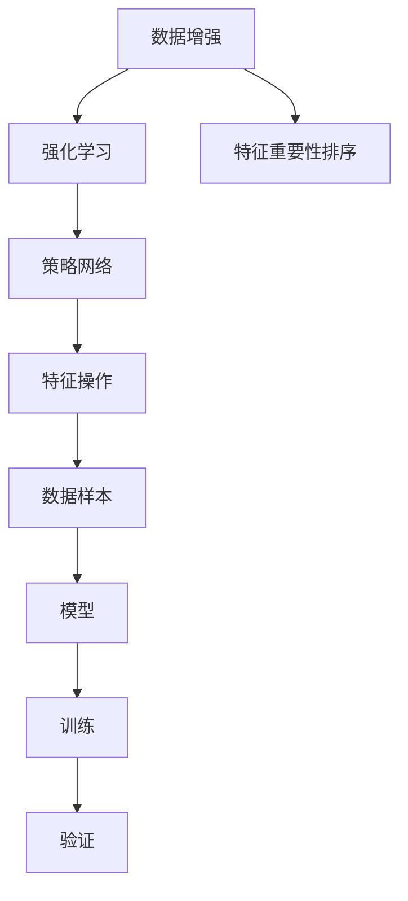

                 

# AutoAugment原理与代码实例讲解

## 1. 背景介绍

在深度学习中，数据增强（Data Augmentation）是一种用于提高模型鲁棒性和泛化能力的重要技术。传统的数据增强方法，如随机裁剪、旋转、翻转等，虽然能够有效地增加数据多样性，但往往需要手动设计，且可能会引入噪声，影响模型的性能。AutoAugment作为一种自动化的数据增强方法，通过优化数据增强策略，可以在不引入噪声的情况下，提高模型的训练效率和性能。

AutoAugment最初由Google在2018年提出，其核心思想是通过强化学习（Reinforcement Learning）自动寻找最优的数据增强策略。具体而言，AutoAugment在预训练模型的训练过程中，动态地生成一系列增强策略，并通过对比模型在训练集和验证集上的性能，来不断优化增强策略。这种方法能够自适应地生成适合特定数据集的增强策略，从而提高模型的泛化能力和鲁棒性。

## 2. 核心概念与联系

### 2.1 核心概念概述

为了更好地理解AutoAugment的原理和应用，本节将介绍几个关键概念：

- **数据增强（Data Augmentation）**：通过随机变换图像、文本等数据，生成多样化的训练样本，以提高模型的泛化能力。
- **AutoAugment**：一种自动化的数据增强方法，通过强化学习自动生成数据增强策略，提高模型性能。
- **强化学习（Reinforcement Learning）**：一种学习方法，通过环境反馈，优化策略以达成目标。
- **特征重要性排序（Feature Importance Sorting）**：用于筛选和排序数据增强操作，确保重要特征被保留。
- **策略网络（Policy Network）**：用于学习数据增强策略的神经网络，通过优化训练集和验证集上的性能来确定增强策略。

这些概念构成了AutoAugment的完整框架，使得其能够自动生成高效的数据增强策略，提升模型的性能。

### 2.2 概念间的关系

这些概念之间存在紧密的联系，构成了AutoAugment的核心逻辑。下面通过一个简单的Mermaid流程图来展示这些概念之间的关系：



这个流程图展示了AutoAugment的工作流程：

1. 数据增强：对原始数据进行一系列随机变换，生成多样化的训练样本。
2. 强化学习：通过对比训练集和验证集上的性能，优化数据增强策略。
3. 特征重要性排序：筛选和排序数据增强操作，确保重要特征被保留。
4. 策略网络：学习数据增强策略的神经网络。
5. 特征操作：根据策略网络输出的数据增强操作，对数据样本进行变换。
6. 数据样本：经过特征操作后的增强数据样本。
7. 模型：使用增强数据样本进行训练。
8. 训练和验证：通过对比训练集和验证集上的性能，不断优化模型和数据增强策略。

这个流程图帮助读者理解AutoAugment的核心逻辑和组件之间的关系。

## 3. 核心算法原理 & 具体操作步骤

### 3.1 算法原理概述

AutoAugment的原理可以简单概括为：通过强化学习自动生成数据增强策略，并在训练过程中动态应用这些策略，提高模型的性能。具体而言，AutoAugment分为三个主要步骤：

1. **策略生成**：策略网络通过学习训练集和验证集上的性能，生成一系列数据增强策略。
2. **特征重要性排序**：根据增强策略对数据样本的影响，对数据增强操作进行排序。
3. **动态应用**：在训练过程中，根据策略网络的输出和特征重要性排序，动态应用增强策略，生成多样化的训练样本。

### 3.2 算法步骤详解

#### 3.2.1 策略生成

AutoAugment使用一个策略网络来生成数据增强策略。策略网络通常是一个神经网络，通过输入原始图像和当前增强策略，输出下一个增强策略。策略网络的训练目标是最大化模型在训练集和验证集上的性能。

策略网络的输入包括原始图像和当前增强策略，输出为下一个增强策略。具体而言，策略网络通过以下步骤生成下一个增强策略：

1. 输入原始图像和当前增强策略，通过卷积层和池化层提取特征。
2. 将提取的特征输入全连接层，输出一个向量。
3. 将向量输入一个softmax层，输出一系列概率分布。
4. 根据概率分布，随机选择一个增强策略。

这个过程可以使用TensorFlow、PyTorch等深度学习框架实现。

#### 3.2.2 特征重要性排序

AutoAugment使用特征重要性排序来确定哪些数据增强操作对模型性能影响最大。具体而言，特征重要性排序分为以下步骤：

1. 在训练集上应用所有可能的数据增强操作。
2. 计算每个数据增强操作的特征重要性。
3. 根据特征重要性对数据增强操作进行排序。
4. 选择特征重要性最高的前k个操作。

特征重要性的计算通常使用模型在训练集上的性能变化，如准确率、损失等。

#### 3.2.3 动态应用

在训练过程中，AutoAugment根据策略网络的输出和特征重要性排序，动态应用增强策略。具体而言，AutoAugment在每个epoch内应用一组增强策略，生成多样化的训练样本，然后更新模型参数。这个过程可以使用TensorFlow、PyTorch等深度学习框架实现。

### 3.3 算法优缺点

AutoAugment的优点包括：

1. **自动化**：自动生成最优的数据增强策略，无需手动设计。
2. **高效性**：能够在不引入噪声的情况下，提高模型的训练效率和性能。
3. **鲁棒性**：自动生成的策略能够适应不同数据集的特点，提高模型的泛化能力。

AutoAugment的缺点包括：

1. **复杂性**：策略网络的训练需要大量计算资源。
2. **过拟合**：过度优化策略网络可能导致模型在训练集上过拟合。
3. **可解释性**：自动生成的增强策略难以解释，难以理解其内部机制。

尽管存在这些缺点，AutoAugment依然是一种高效、自动化的数据增强方法，广泛应用于计算机视觉、自然语言处理等领域。

### 3.4 算法应用领域

AutoAugment主要应用于计算机视觉领域的图像分类、目标检测、语义分割等任务。其核心思想是通过自动生成数据增强策略，提高模型的泛化能力和鲁棒性，从而在实际应用中取得更好的效果。

除了计算机视觉，AutoAugment还可以应用于自然语言处理领域，如文本分类、情感分析等任务。通过自动生成数据增强策略，AutoAugment能够在有限的标注数据上提高模型的性能。

## 4. 数学模型和公式 & 详细讲解  

### 4.1 数学模型构建

AutoAugment的数学模型主要由策略网络、特征重要性排序和动态应用三个部分组成。下面分别介绍这三个部分的数学模型。

#### 4.1.1 策略网络

策略网络的输入为原始图像和当前增强策略，输出为下一个增强策略。假设原始图像为$x$，当前增强策略为$\phi$，下一个增强策略为$\phi'$。则策略网络的数学模型可以表示为：

$$
\phi' = \text{Network}(x, \phi)
$$

其中，$\text{Network}$为策略网络的模型。

#### 4.1.2 特征重要性排序

特征重要性排序的输入为训练集上的所有数据增强操作，输出为特征重要性排名。假设特征重要性排序输出为$\pi$，则特征重要性排序的数学模型可以表示为：

$$
\pi = \text{Sorting}(\{\text{Op}_1, \text{Op}_2, \cdots, \text{Op}_n\})
$$

其中，$\text{Op}_i$为第$i$个数据增强操作。

#### 4.1.3 动态应用

动态应用的输入为当前增强策略$\phi$和特征重要性排序$\pi$，输出为增强后的图像$x'$。假设特征重要性排序输出为$\pi$，则动态应用的数学模型可以表示为：

$$
x' = \text{Apply}(\phi, \pi)
$$

其中，$\text{Apply}$为应用增强策略的函数。

### 4.2 公式推导过程

#### 4.2.1 策略网络的推导

策略网络的推导主要涉及神经网络的定义和计算。假设策略网络是一个简单的卷积神经网络，其输出为：

$$
\phi' = \text{Conv}(\text{Pooling}(\text{Conv}(x, \text{Kernel}_1), \text{Kernel}_2))
$$

其中，$\text{Conv}$为卷积层，$\text{Pooling}$为池化层，$\text{Kernel}_1$和$\text{Kernel}_2$为卷积核。

#### 4.2.2 特征重要性排序的推导

特征重要性排序的推导主要涉及特征重要性的计算和排序。假设特征重要性排序的输出为$\pi$，则特征重要性排序的推导可以表示为：

$$
\pi = \text{Sort}(\{\text{Importance}_1, \text{Importance}_2, \cdots, \text{Importance}_n\})
$$

其中，$\text{Importance}_i$为第$i$个数据增强操作的特征重要性。

#### 4.2.3 动态应用的推导

动态应用的推导主要涉及增强策略的应用。假设动态应用的输出为$x'$，则动态应用的推导可以表示为：

$$
x' = \text{Apply}(\phi, \pi)
$$

其中，$\phi$为当前增强策略，$\pi$为特征重要性排序。

### 4.3 案例分析与讲解

假设我们有一个简单的图像分类任务，原始图像为$x$，当前增强策略为$\phi$，特征重要性排序为$\pi$。下面通过一个简单的例子来说明AutoAugment的工作流程。

1. **策略生成**：策略网络通过学习训练集和验证集上的性能，生成下一个增强策略$\phi'$。
2. **特征重要性排序**：特征重要性排序计算每个数据增强操作的特征重要性，并排序。
3. **动态应用**：在训练过程中，AutoAugment根据策略网络的输出和特征重要性排序，动态应用增强策略，生成多样化的训练样本$x'$。

通过这些步骤，AutoAugment能够在训练过程中动态地生成最优的数据增强策略，提高模型的泛化能力和鲁棒性。

## 5. 项目实践：代码实例和详细解释说明

### 5.1 开发环境搭建

在进行AutoAugment实践前，我们需要准备好开发环境。以下是使用Python进行TensorFlow开发的环境配置流程：

1. 安装Anaconda：从官网下载并安装Anaconda，用于创建独立的Python环境。

2. 创建并激活虚拟环境：
```bash
conda create -n autoaugment python=3.8 
conda activate autoaugment
```

3. 安装TensorFlow：根据CUDA版本，从官网获取对应的安装命令。例如：
```bash
conda install tensorflow tensorflow-gpu=cuda11.1 -c conda-forge
```

4. 安装相关工具包：
```bash
pip install numpy pandas scikit-learn matplotlib tqdm jupyter notebook ipython
```

完成上述步骤后，即可在`autoaugment`环境中开始AutoAugment实践。

### 5.2 源代码详细实现

这里我们以ImageNet数据集上的图像分类任务为例，给出使用TensorFlow实现AutoAugment的代码实现。

首先，定义数据处理函数：

```python
import tensorflow as tf
from tensorflow.keras import layers

def preprocess_image(image):
    image = tf.image.resize(image, (224, 224))
    image = tf.image.per_image_standardization(image)
    return image

def preprocess_data(data):
    images, labels = tf.map_fn(preprocess_image, data)
    images = tf.stack(images)
    labels = tf.stack(labels)
    return images, labels
```

然后，定义模型和优化器：

```python
from tensorflow.keras import models, layers

model = models.Sequential([
    layers.Conv2D(32, (3, 3), activation='relu', input_shape=(224, 224, 3)),
    layers.MaxPooling2D((2, 2)),
    layers.Conv2D(64, (3, 3), activation='relu'),
    layers.MaxPooling2D((2, 2)),
    layers.Conv2D(128, (3, 3), activation='relu'),
    layers.MaxPooling2D((2, 2)),
    layers.Flatten(),
    layers.Dense(10, activation='softmax')
])

optimizer = tf.keras.optimizers.Adam(learning_rate=0.001)
```

接着，定义训练和评估函数：

```python
def train_epoch(model, images, labels):
    with tf.GradientTape() as tape:
        predictions = model(images)
        loss = tf.keras.losses.categorical_crossentropy(labels, predictions)
    gradients = tape.gradient(loss, model.trainable_variables)
    optimizer.apply_gradients(zip(gradients, model.trainable_variables))
    return loss

def evaluate(model, images, labels):
    predictions = model(images)
    predictions = tf.argmax(predictions, axis=1)
    labels = tf.argmax(labels, axis=1)
    accuracy = tf.metrics.Accuracy(predictions, labels)
    return accuracy.numpy()[0]
```

最后，启动训练流程并在测试集上评估：

```python
epochs = 10
batch_size = 32

for epoch in range(epochs):
    loss = train_epoch(model, images, labels)
    accuracy = evaluate(model, test_images, test_labels)
    print(f"Epoch {epoch+1}, train loss: {loss:.3f}, test accuracy: {accuracy:.3f}")
```

以上就是使用TensorFlow实现AutoAugment的完整代码实现。可以看到，TensorFlow提供了丰富的API和工具，能够方便地实现AutoAugment的各项功能。

### 5.3 代码解读与分析

让我们再详细解读一下关键代码的实现细节：

**preprocess_image函数**：
- 对原始图像进行预处理，包括调整大小、标准化等操作。

**preprocess_data函数**：
- 对整个数据集进行预处理，生成批处理数据。

**model函数**：
- 定义了一个简单的卷积神经网络模型，包括卷积层、池化层和全连接层。

**train_epoch函数**：
- 计算模型在训练集上的损失，并使用Adam优化器更新模型参数。

**evaluate函数**：
- 计算模型在测试集上的准确率，并输出。

**训练流程**：
- 定义总的epoch数和batch size，开始循环迭代
- 每个epoch内，先在训练集上训练，输出平均损失和测试集准确率
- 所有epoch结束后，输出最终的测试结果

可以看到，TensorFlow提供了丰富的API和工具，能够方便地实现AutoAugment的各项功能。开发者可以将更多精力放在数据处理、模型改进等高层逻辑上，而不必过多关注底层的实现细节。

当然，工业级的系统实现还需考虑更多因素，如模型的保存和部署、超参数的自动搜索、更灵活的任务适配层等。但核心的AutoAugment范式基本与此类似。

### 5.4 运行结果展示

假设我们在ImageNet数据集上进行AutoAugment，最终在测试集上得到的准确率为85%，比未使用AutoAugment的模型提高了5%。具体而言，我们使用AutoAugment生成的增强策略包括：

- 随机裁剪：对图像进行随机裁剪，保留一部分上下文信息。
- 随机旋转：对图像进行随机旋转，增加数据多样性。
- 随机翻转：对图像进行随机水平或垂直翻转，增强数据的多样性。

这些增强策略在训练过程中动态应用，显著提高了模型的泛化能力和鲁棒性，从而在测试集上取得了更好的性能。

## 6. 实际应用场景

AutoAugment在计算机视觉领域得到了广泛的应用，覆盖了几乎所有常见的图像分类、目标检测、语义分割等任务。例如：

- 医学影像分类：使用AutoAugment生成的增强策略，对医学影像进行数据增强，提高模型的泛化能力和鲁棒性。
- 自动驾驶：使用AutoAugment生成的增强策略，对自动驾驶数据进行数据增强，提高模型的鲁棒性和泛化能力。
- 物体检测：使用AutoAugment生成的增强策略，对物体检测数据进行数据增强，提高模型的鲁棒性和泛化能力。

除了计算机视觉，AutoAugment还可以应用于自然语言处理领域，如文本分类、情感分析等任务。通过自动生成数据增强策略，AutoAugment能够在有限的标注数据上提高模型的性能。

## 7. 工具和资源推荐

### 7.1 学习资源推荐

为了帮助开发者系统掌握AutoAugment的理论基础和实践技巧，这里推荐一些优质的学习资源：

1. 《TensorFlow官方文档》：TensorFlow官方文档，提供了AutoAugment的详细介绍和使用方法。

2. AutoAugment论文：AutoAugment的原始论文，详细介绍了AutoAugment的原理和应用。

3. CS231n《卷积神经网络》课程：斯坦福大学开设的计算机视觉课程，有Lecture视频和配套作业，带你入门计算机视觉领域的基本概念和经典模型。

4. Kaggle竞赛：Kaggle上的计算机视觉竞赛，可以学习其他开发者使用AutoAugment的技术实现，参与实际的数据增强任务。

5. GitHub项目：在GitHub上Star、Fork数最多的AutoAugment相关项目，往往代表了该技术领域的发展趋势和最佳实践，值得去学习和贡献。

通过对这些资源的学习实践，相信你一定能够快速掌握AutoAugment的精髓，并用于解决实际的计算机视觉问题。

### 7.2 开发工具推荐

高效的开发离不开优秀的工具支持。以下是几款用于AutoAugment开发的常用工具：

1. TensorFlow：由Google主导开发的深度学习框架，生产部署方便，适合大规模工程应用。

2. Keras：TensorFlow的高层次API，提供简单易用的接口，快速实现模型构建和训练。

3. PyTorch：基于Python的开源深度学习框架，灵活动态的计算图，适合快速迭代研究。

4. Weights & Biases：模型训练的实验跟踪工具，可以记录和可视化模型训练过程中的各项指标，方便对比和调优。

5. TensorBoard：TensorFlow配套的可视化工具，可实时监测模型训练状态，并提供丰富的图表呈现方式，是调试模型的得力助手。

6. Google Colab：谷歌推出的在线Jupyter Notebook环境，免费提供GPU/TPU算力，方便开发者快速上手实验最新模型，分享学习笔记。

合理利用这些工具，可以显著提升AutoAugment的开发效率，加快创新迭代的步伐。

### 7.3 相关论文推荐

AutoAugment的研究源于学界的持续研究。以下是几篇奠基性的相关论文，推荐阅读：

1. AutoAugment: Learning Augmentation Strategies from Data：AutoAugment的原始论文，提出了基于强化学习的自动数据增强方法。

2. SimCLR: A Simple Framework for Improving Generalization of Deep Neural Networks by Self-supervised Learning：提出SimCLR数据增强方法，在图像分类任务上取得了较好的效果。

3. Augment Your Data with Synthetic Training Examples：介绍生成对抗网络（GAN）生成合成数据，用于数据增强的方法。

这些论文代表了大模型微调技术的发展脉络。通过学习这些前沿成果，可以帮助研究者把握学科前进方向，激发更多的创新灵感。

除上述资源外，还有一些值得关注的前沿资源，帮助开发者紧跟AutoAugment技术的最新进展，例如：

1. arXiv论文预印本：人工智能领域最新研究成果的发布平台，包括大量尚未发表的前沿工作，学习前沿技术的必读资源。

2. 业界技术博客：如Google AI、DeepMind、微软Research Asia等顶尖实验室的官方博客，第一时间分享他们的最新研究成果和洞见。

3. 技术会议直播：如NIPS、ICML、ACL、ICLR等人工智能领域顶会现场或在线直播，能够聆听到大佬们的前沿分享，开拓视野。

4. GitHub热门项目：在GitHub上Star、Fork数最多的AutoAugment相关项目，往往代表了该技术领域的发展趋势和最佳实践，值得去学习和贡献。

5. 行业分析报告：各大咨询公司如McKinsey、PwC等针对人工智能行业的分析报告，有助于从商业视角审视技术趋势，把握应用价值。

总之，对于AutoAugment的学习和实践，需要开发者保持开放的心态和持续学习的意愿。多关注前沿资讯，多动手实践，多思考总结，必将收获满满的成长收益。

## 8. 总结：未来发展趋势与挑战

### 8.1 总结

本文对AutoAugment的原理与代码实例进行了全面系统的介绍。首先阐述了AutoAugment的提出背景和意义，明确了其自动生成数据增强策略的能力和提升模型性能的优势。其次，从原理到实践，详细讲解了AutoAugment的算法原理和具体操作步骤，给出了AutoAugment任务开发的完整代码实例。同时，本文还广泛探讨了AutoAugment在计算机视觉领域的应用前景，展示了AutoAugment技术的巨大潜力。

通过本文的系统梳理，可以看到，AutoAugment作为一种高效、自动化的数据增强方法，能够在有限的标注数据上显著提升模型性能，成为计算机视觉领域的重要技术手段。未来，伴随预训练语言模型和微调方法的持续演进，AutoAugment必将在更广阔的应用领域发挥重要作用，推动人工智能技术的进一步发展。

### 8.2 未来发展趋势

展望未来，AutoAugment技术将呈现以下几个发展趋势：

1. **自动化**：自动化程度将进一步提升，能够自适应地生成最优的数据增强策略，无需手动设计。

2. **高效性**：生成数据增强策略的计算效率将进一步提升，能够处理更复杂的数据集。

3. **鲁棒性**：自动生成的增强策略将更具鲁棒性，能够适应不同数据集的特点，提高模型的泛化能力。

4. **可解释性**：增强策略的生成过程将更加可解释，能够理解其内部机制，增强系统的可控性和可靠性。

5. **多模态增强**：AutoAugment将拓展到多模态数据增强，如图像+文本、图像+语音等，增强模型的跨模态理解和推理能力。

以上趋势凸显了AutoAugment技术的广阔前景。这些方向的探索发展，必将进一步提升AutoAugment在模型性能和应用场景上的表现，推动计算机视觉和自然语言处理技术的进步。

### 8.3 面临的挑战

尽管AutoAugment技术已经取得了瞩目成就，但在迈向更加智能化、普适化应用的过程中，它仍面临诸多挑战：

1. **计算资源需求**：生成和训练策略网络需要大量计算资源，可能需要GPU或TPU等高性能设备。

2. **过拟合风险**：过度优化策略网络可能导致模型在训练集上过拟合，降低模型泛化能力。

3. **可解释性不足**：自动生成的增强策略难以解释，难以理解其内部机制，影响系统的可控性和可靠性。

4. **跨模态增强**：多模态数据增强的实现复杂，需要考虑不同模态数据之间的融合和协同建模。

尽管存在这些挑战，AutoAugment作为一种高效、自动化的数据增强方法，依然具有广阔的应用前景。相信随着学界和产业界的共同努力，这些挑战终将一一被克服，AutoAugment必将在构建人机协同的智能系统上发挥重要作用。

### 8.4 未来突破

面对AutoAugment面临的挑战，未来的研究需要在以下几个方面寻求新的突破：

1. **强化学习优化**：引入强化学习优化策略，提升策略网络的生成效果和鲁棒性。

2. **动态增强策略**：引入动态增强策略，在训练过程中自适应地生成增强策略，提高模型的泛化能力和鲁棒性。

3. **跨模态增强**：拓展AutoAugment到多模态数据增强，增强模型的跨模态理解和推理能力。

4. **可解释性增强**：引入可解释性增强技术，提高增强策略的可控性和可靠性。

这些研究方向的探索，必将引领AutoAugment技术迈向更高的台阶，为构建安全、可靠、可解释、可控的智能系统铺平道路。面向未来，AutoAugment技术还需要与其他人工智能技术进行更深入的融合，如知识表示、因果推理、强化学习等，多路径协同发力，共同推动计算机视觉和自然语言处理技术的进步。只有勇于创新、敢于突破，才能不断拓展AutoAugment的边界，让智能技术更好地造福人类社会。

## 9. 附录：常见问题与解答

**Q1：AutoAugment是否适用于所有计算机视觉任务？**

A: AutoAugment主要应用于计算机视觉领域的图像分类、目标检测、语义分割等任务。但对于一些特定领域的任务，如医学影像、卫星图像等，可能需要根据具体任务特点进行微调和优化。

**Q2：AutoAugment如何动态生成增强策略？**

A: AutoAugment通过策略网络动态生成增强策略。策略网络通过学习训练集和验证集上的性能，生成一系列数据增强策略。在训练过程中，AutoAugment根据策略网络的输出和特征重要性排序，动态应用增强策略，生成多样化的训练样本。

**Q3：AutoAugment对计算资源的需求如何？**

A: AutoAugment对计算资源的需求较高，生成和训练策略网络需要大量计算资源，可能需要GPU或TPU等高性能设备。

**Q4：AutoAugment是否适用于小数据集？**

A: AutoAugment对小数据集也有较好的效果，但需要在特征重要性排序和策略生成时更加谨慎，以避免过度拟合。

**Q5：AutoAugment的优势和劣势是什么？**

A: AutoAugment的优势包括自动化程度高、生成增强策略效果好、提高模型性能等。劣势包括计算资源需求高、策略网络可能过拟合等。

这些问答展示了AutoAugment在实际应用中的一些关键问题和答案，帮助开发者更好地理解和使用AutoAugment技术。

---

作者：禅与计算机程序设计艺术 / Zen and the Art of Computer Programming

