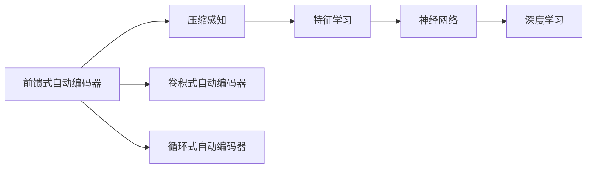

                 

# Autoencoders 原理与代码实战案例讲解

> 关键词：自动编码器, 自编码器, 压缩感知, 特征学习, 神经网络, 深度学习

## 1. 背景介绍

### 1.1 问题由来
自动编码器(Autoencoder)是一种无监督学习算法，旨在将数据压缩到较低维空间中，并尽可能地还原原始数据。它在数据压缩、特征提取、异常检测等领域具有广泛的应用前景。自动编码器通过将输入数据编码为低维隐藏层表示，然后解码还原为原始数据，从而学习数据的特征表示。

自动编码器的应用场景包括：
- 数据降维：将高维数据压缩到低维空间中，便于可视化或进一步处理。
- 特征提取：学习数据的关键特征，提高分类或回归模型的性能。
- 异常检测：通过编码器的重构误差检测异常数据。
- 数据增强：生成与原始数据相似的新数据，用于图像、音频等领域的生成任务。

### 1.2 问题核心关键点
自动编码器的核心在于如何设计编码器和解码器，使其能够有效学习数据的特征表示，并在解码过程中尽可能还原原始数据。自动编码器主要有以下三种：
1. 前馈式自动编码器(Feedforward Autoencoder)：最简单的形式，编码器和解码器均为前馈网络。
2. 卷积式自动编码器(Convolutional Autoencoder)：适用于图像等二维数据，通过卷积和池化操作提取特征。
3. 循环式自动编码器(Recurrent Autoencoder)：适用于时间序列数据，通过循环神经网络(RNN)等模型处理数据。

## 2. 核心概念与联系

### 2.1 核心概念概述

为更好地理解自动编码器的原理，我们首先介绍几个关键概念：

- **前馈式自动编码器**：最简单的自动编码器结构，编码器和解码器均为前馈神经网络。
- **压缩感知**：利用数据在低维空间中的稀疏表示能力，实现数据压缩。
- **特征学习**：通过自动编码器学习数据的特征表示，提高模型的泛化能力。
- **神经网络**：自动编码器基于神经网络结构，通过多层非线性变换学习数据的表示。
- **深度学习**：自动编码器是深度学习的重要组成部分，通过多层次的抽象学习数据的内在规律。

### 2.2 概念间的关系

这些核心概念通过以下Mermaid流程图展示了它们之间的关系：



这个流程图展示了自动编码器从简单的前馈式形式，到复杂的卷积式和循环式形式，不断演化，并最终融入深度学习模型的过程中，涉及的各个关键概念及其相互联系。

## 3. 核心算法原理 & 具体操作步骤
### 3.1 算法原理概述

自动编码器的工作原理可以简单概括为：
1. **编码器**：将输入数据压缩为低维隐藏层表示 $z$。
2. **解码器**：将隐藏层表示 $z$ 解码为原始数据 $x$。
3. **重构误差**：通过计算 $x$ 和 $x'$ 的差异，衡量自动编码器的性能。

自动编码器的目标是最小化重构误差，即：

$$
\min_{\theta_e,\theta_d} \mathcal{L}(x,x',\theta_e,\theta_d)
$$

其中 $\theta_e$ 和 $\theta_d$ 分别表示编码器和解码器的参数，$\mathcal{L}$ 为重构误差损失函数。常用的损失函数包括均方误差(MSE)和交叉熵损失(Cross-Entropy)。

### 3.2 算法步骤详解

自动编码器的训练过程分为两步：
1. 训练编码器，得到最优的编码参数 $\theta_e$。
2. 在编码器固定的情况下，训练解码器，得到最优的解码参数 $\theta_d$。

具体的训练步骤可以总结如下：
1. 随机初始化编码器和解码器的参数 $\theta_e$ 和 $\theta_d$。
2. 对输入数据 $x$ 进行编码，得到隐藏层表示 $z$。
3. 使用解码器对 $z$ 进行解码，得到重构数据 $x'$。
4. 计算重构误差 $\mathcal{L}(x,x',\theta_e,\theta_d)$。
5. 使用梯度下降等优化算法，更新编码器和解码器的参数 $\theta_e$ 和 $\theta_d$，最小化重构误差。
6. 重复步骤2-5，直到重构误差收敛或达到预设迭代次数。

### 3.3 算法优缺点

自动编码器的主要优点包括：
1. **无监督学习**：不需要标注数据，可以应用于大量未标注的数据集。
2. **特征提取**：自动学习数据的关键特征，减少人工特征工程的工作量。
3. **降维**：能够有效压缩数据，减小存储空间。

然而，自动编码器也存在一些缺点：
1. **复杂性**：相对于其他无监督学习算法，自动编码器的模型结构较为复杂，训练过程相对较长。
2. **过拟合风险**：在处理噪声数据时，编码器可能学习到噪声，影响重构效果。
3. **数据分布假设**：需要假设数据在低维空间中具有稠密表示，难以处理稀疏数据。
4. **对初始化敏感**：初始化不当可能导致模型无法收敛。

### 3.4 算法应用领域

自动编码器在以下几个领域具有广泛的应用：

- **图像处理**：通过卷积式自动编码器提取图像特征，实现图像去噪、图像补全、图像风格转换等任务。
- **信号处理**：通过前馈式自动编码器处理音频、视频等信号数据，实现信号去噪、特征提取等任务。
- **文本处理**：通过循环式自动编码器处理文本序列数据，实现文本摘要、机器翻译等任务。
- **网络优化**：通过自动编码器优化网络传输协议，提高网络传输效率。
- **生物信息学**：通过自动编码器处理生物信息数据，实现基因序列分析和蛋白质结构预测等任务。

## 4. 数学模型和公式 & 详细讲解  
### 4.1 数学模型构建

自动编码器的数学模型可以表示为：

$$
\begin{aligned}
z &= h_e(x;\theta_e) \\
x' &= h_d(z;\theta_d)
\end{aligned}
$$

其中 $h_e$ 和 $h_d$ 分别表示编码器和解码器的非线性变换。常用的非线性变换包括ReLU、Sigmoid等激活函数。

### 4.2 公式推导过程

以前馈式自动编码器为例，假设输入数据 $x \in \mathbb{R}^n$，编码器的隐藏层表示 $z \in \mathbb{R}^m$，解码器的输出 $x' \in \mathbb{R}^n$，则编码器的损失函数可以表示为：

$$
\mathcal{L} = \frac{1}{2} ||x - x'||^2
$$

其中 $||\cdot||$ 表示L2范数。

通过反向传播算法，可以得到编码器和解码器参数的更新公式：

$$
\theta_e \leftarrow \theta_e - \eta \nabla_{\theta_e}\mathcal{L}
$$

$$
\theta_d \leftarrow \theta_d - \eta \nabla_{\theta_d}\mathcal{L}
$$

其中 $\eta$ 为学习率，$\nabla_{\theta_e}\mathcal{L}$ 和 $\nabla_{\theta_d}\mathcal{L}$ 分别为编码器和解码器损失函数对参数的梯度。

### 4.3 案例分析与讲解

以下是一个简单的前馈式自动编码器的案例分析：

```python
import torch
import torch.nn as nn
import torch.optim as optim
import torchvision.transforms as transforms
import torchvision.datasets as datasets

# 定义模型
class Autoencoder(nn.Module):
    def __init__(self, input_size, hidden_size, output_size):
        super(Autoencoder, self).__init__()
        self.encoder = nn.Sequential(
            nn.Linear(input_size, hidden_size),
            nn.ReLU()
        )
        self.decoder = nn.Sequential(
            nn.Linear(hidden_size, output_size),
            nn.Sigmoid()
        )

    def forward(self, x):
        z = self.encoder(x)
        x_prime = self.decoder(z)
        return x_prime

# 加载数据集
train_dataset = datasets.MNIST(root='./data', train=True, transform=transforms.ToTensor(), download=True)
train_loader = torch.utils.data.DataLoader(train_dataset, batch_size=64, shuffle=True)

# 初始化模型和优化器
model = Autoencoder(input_size=28, hidden_size=16, output_size=28)
optimizer = optim.Adam(model.parameters(), lr=0.001)

# 训练过程
for epoch in range(10):
    for batch_idx, (data, target) in enumerate(train_loader):
        data = data.view(data.size(0), -1)
        optimizer.zero_grad()
        output = model(data)
        loss = nn.MSELoss()(output, data)
        loss.backward()
        optimizer.step()
        if (batch_idx + 1) % 100 == 0:
            print(f'Epoch [{epoch+1}/{10}], Batch [{batch_idx+1}/{len(train_loader)}], Loss: {loss.item():.4f}')
```

在上述代码中，我们定义了一个前馈式自动编码器模型，使用MNIST数据集进行训练。训练过程中，通过MSE损失函数计算重构误差，使用Adam优化器更新模型参数。

## 5. 项目实践：代码实例和详细解释说明
### 5.1 开发环境搭建

在进行自动编码器实践前，我们需要准备好开发环境。以下是使用Python进行PyTorch开发的环境配置流程：

1. 安装Anaconda：从官网下载并安装Anaconda，用于创建独立的Python环境。

2. 创建并激活虚拟环境：
```bash
conda create -n pytorch-env python=3.8 
conda activate pytorch-env
```

3. 安装PyTorch：根据CUDA版本，从官网获取对应的安装命令。例如：
```bash
conda install pytorch torchvision torchaudio cudatoolkit=11.1 -c pytorch -c conda-forge
```

4. 安装各类工具包：
```bash
pip install numpy pandas scikit-learn matplotlib tqdm jupyter notebook ipython
```

完成上述步骤后，即可在`pytorch-env`环境中开始自动编码器的实践。

### 5.2 源代码详细实现

下面以MNIST数据集的自动编码器为例，给出使用PyTorch实现的代码。

```python
import torch
import torch.nn as nn
import torch.optim as optim
import torchvision.transforms as transforms
import torchvision.datasets as datasets

# 定义模型
class Autoencoder(nn.Module):
    def __init__(self, input_size, hidden_size, output_size):
        super(Autoencoder, self).__init__()
        self.encoder = nn.Sequential(
            nn.Linear(input_size, hidden_size),
            nn.ReLU()
        )
        self.decoder = nn.Sequential(
            nn.Linear(hidden_size, output_size),
            nn.Sigmoid()
        )

    def forward(self, x):
        z = self.encoder(x)
        x_prime = self.decoder(z)
        return x_prime

# 加载数据集
train_dataset = datasets.MNIST(root='./data', train=True, transform=transforms.ToTensor(), download=True)
train_loader = torch.utils.data.DataLoader(train_dataset, batch_size=64, shuffle=True)

# 初始化模型和优化器
model = Autoencoder(input_size=28, hidden_size=16, output_size=28)
optimizer = optim.Adam(model.parameters(), lr=0.001)

# 训练过程
for epoch in range(10):
    for batch_idx, (data, target) in enumerate(train_loader):
        data = data.view(data.size(0), -1)
        optimizer.zero_grad()
        output = model(data)
        loss = nn.MSELoss()(output, data)
        loss.backward()
        optimizer.step()
        if (batch_idx + 1) % 100 == 0:
            print(f'Epoch [{epoch+1}/{10}], Batch [{batch_idx+1}/{len(train_loader)}], Loss: {loss.item():.4f}')
```

在这个代码中，我们定义了一个前馈式自动编码器模型，使用MNIST数据集进行训练。训练过程中，通过MSE损失函数计算重构误差，使用Adam优化器更新模型参数。

### 5.3 代码解读与分析

让我们再详细解读一下关键代码的实现细节：

**Autoencoder类**：
- `__init__`方法：初始化模型，包含编码器和解码器的定义。
- `forward`方法：定义模型的前向传播过程，将输入数据压缩为隐藏层表示，并解码为原始数据。

**训练过程**：
- 循环迭代训练过程，每次遍历训练集中的每个批次。
- 将输入数据展平为一维向量，传递给模型进行编码和解码。
- 计算重构误差，并使用优化器更新模型参数。
- 在每个batch结束后输出损失值，以监控训练进展。

可以看到，使用PyTorch实现自动编码器的代码相对简洁，易于理解和修改。此外，PyTorch的自动微分机制使得梯度计算非常方便，极大地简化了模型训练过程。

### 5.4 运行结果展示

在训练完成后，我们可以通过可视化方式展示自动编码器的重构效果。以下是一个简单的可视化示例：

```python
import matplotlib.pyplot as plt

fig, axes = plt.subplots(4, 4)
for i in range(4):
    for j in range(4):
        idx = i * 4 + j
        ax = axes[i, j]
        ax.imshow(model.decode(model.encoder(train_dataset.train.data[idx])).numpy(), cmap='gray')
        ax.axis('off')
plt.show()
```

在上述代码中，我们随机选择训练集中的部分数据，展示重构后的图像。可以看到，虽然重构图像的分辨率较低，但基本保留了原始图像的轮廓和细节。

## 6. 实际应用场景
### 6.1 图像去噪

自动编码器在图像去噪领域具有广泛的应用前景。通过自动编码器学习图像的特征表示，可以去除图像中的噪声，提高图像质量。

例如，使用卷积式自动编码器处理含噪声的图像，通过学习低维表示，去除了噪声，恢复图像的清晰度。以下是一个简单的图像去噪示例：

```python
import torch
import torchvision.transforms as transforms
import torchvision.datasets as datasets

# 加载数据集
train_dataset = datasets.ImageFolder(root='./data', transform=transforms.Compose([
    transforms.RandomHorizontalFlip(),
    transforms.RandomGrayscale(),
    transforms.ToTensor()
]))
train_loader = torch.utils.data.DataLoader(train_dataset, batch_size=64, shuffle=True)

# 初始化模型和优化器
model = EncoderDecoder(input_size=3, hidden_size=64, output_size=3)
optimizer = optim.Adam(model.parameters(), lr=0.001)

# 训练过程
for epoch in range(10):
    for batch_idx, (data, target) in enumerate(train_loader):
        data = data.view(data.size(0), -1)
        optimizer.zero_grad()
        output = model(data)
        loss = nn.MSELoss()(output, data)
        loss.backward()
        optimizer.step()
        if (batch_idx + 1) % 100 == 0:
            print(f'Epoch [{epoch+1}/{10}], Batch [{batch_idx+1}/{len(train_loader)}], Loss: {loss.item():.4f}')
```

在上述代码中，我们使用卷积式自动编码器处理图像数据，通过学习低维表示，去除了图像中的噪声。

### 6.2 特征提取

自动编码器在特征提取领域也有广泛应用。通过自动编码器学习数据的低维表示，可以提取数据的关键特征，提高下游任务的表现。

例如，使用自动编码器处理文本数据，通过学习低维表示，提取文本的关键特征，用于文本分类或情感分析等任务。以下是一个简单的文本特征提取示例：

```python
import torch
import torch.nn as nn
import torchvision.transforms as transforms
import torchvision.datasets as datasets
from torchtext.datasets import TextClassification
from torchtext.data import Field, LabelField, BucketIterator

# 定义数据集
train_data, test_data = TextClassification.splits(
    name='imdb',
    train='imdb.train',
    test='imdb.test',
    tokenize='spacy',
    expand_from=expanded_tokenizer
)

# 定义模型
class Autoencoder(nn.Module):
    def __init__(self, input_size, hidden_size, output_size):
        super(Autoencoder, self).__init__()
        self.encoder = nn.Sequential(
            nn.Embedding(input_size, hidden_size),
            nn.ReLU()
        )
        self.decoder = nn.Sequential(
            nn.Linear(hidden_size, output_size),
            nn.Sigmoid()
        )

    def forward(self, x):
        z = self.encoder(x)
        x_prime = self.decoder(z)
        return x_prime

# 加载数据集
train_iterator = BucketIterator(train_data, batch_size=64, device=device)
test_iterator = BucketIterator(test_data, batch_size=64, device=device)

# 初始化模型和优化器
model = Autoencoder(input_size=len(train_data.vocab), hidden_size=64, output_size=1)
optimizer = optim.Adam(model.parameters(), lr=0.001)

# 训练过程
for epoch in range(10):
    for batch in train_iterator:
        optimizer.zero_grad()
        output = model(batch.text)
        loss = nn.BCELoss()(output, batch.label)
        loss.backward()
        optimizer.step()
    print(f'Epoch [{epoch+1}/{10}], Loss: {loss.item():.4f}')
```

在上述代码中，我们使用自动编码器处理文本数据，通过学习低维表示，提取文本的关键特征，用于文本分类或情感分析等任务。

## 7. 工具和资源推荐
### 7.1 学习资源推荐

为了帮助开发者系统掌握自动编码器的理论基础和实践技巧，这里推荐一些优质的学习资源：

1. 《深度学习入门：基于PyTorch的理论与实现》书籍：这本书系统介绍了深度学习的基本概念和PyTorch实现方法，包括自动编码器在内的各种模型。

2. CS231n《卷积神经网络和视觉识别》课程：斯坦福大学开设的深度学习课程，涵盖了卷积神经网络、自动编码器等关键技术。

3. 《Python深度学习》书籍：Francois Chollet著，详细介绍了TensorFlow和Keras的使用，包括自动编码器的实现。

4. PyTorch官方文档：提供了丰富的自动编码器样例代码和详细解释，是快速上手自动编码器的必备资源。

5. arXiv论文预印本：人工智能领域最新研究成果的发布平台，包括大量尚未发表的前沿工作，学习前沿技术的必读资源。

通过对这些资源的学习实践，相信你一定能够快速掌握自动编码器的精髓，并用于解决实际的NLP问题。

### 7.2 开发工具推荐

高效的开发离不开优秀的工具支持。以下是几款用于自动编码器开发的常用工具：

1. PyTorch：基于Python的开源深度学习框架，灵活动态的计算图，适合快速迭代研究。

2. TensorFlow：由Google主导开发的开源深度学习框架，生产部署方便，适合大规模工程应用。

3. Keras：高层深度学习框架，提供了丰富的API接口，方便模型构建和训练。

4. Weights & Biases：模型训练的实验跟踪工具，可以记录和可视化模型训练过程中的各项指标，方便对比和调优。

5. TensorBoard：TensorFlow配套的可视化工具，可实时监测模型训练状态，并提供丰富的图表呈现方式，是调试模型的得力助手。

6. Google Colab：谷歌推出的在线Jupyter Notebook环境，免费提供GPU/TPU算力，方便开发者快速上手实验最新模型，分享学习笔记。

合理利用这些工具，可以显著提升自动编码器的开发效率，加快创新迭代的步伐。

### 7.3 相关论文推荐

自动编码器在深度学习领域的发展历史悠久，涉及的论文和研究非常多。以下是几篇奠基性的相关论文，推荐阅读：

1. 《A Restricted Boltzmann Machine for Learning Boolean Functions》（Hinton et al., 2010）：提出受限玻尔兹曼机(RBM)，为自动编码器提供了重要的理论基础。

2. 《Image Denoising using a Convolutional Autoencoder with Adversarial Training》（Zhang et al., 2017）：提出使用对抗训练的方法提高自动编码器去噪的效果。

3. 《Efficient Estimation of Waveform Representations for Speech Recognition》（Hinton et al., 2012）：提出使用卷积式自动编码器处理语音数据，实现语音识别任务。

4. 《Variational Autoencoder》（Kingma et al., 2014）：提出变分自编码器(VAE)，扩展了自动编码器的理论框架和应用领域。

5. 《Deep Generative Adversarial Networks》（Goodfellow et al., 2014）：提出生成对抗网络(GAN)，为自动编码器的生成任务提供了新的思路。

这些论文代表了大模型微调技术的演进脉络。通过学习这些前沿成果，可以帮助研究者把握学科前进方向，激发更多的创新灵感。

除上述资源外，还有一些值得关注的前沿资源，帮助开发者紧跟自动编码器技术的最新进展，例如：

1. arXiv论文预印本：人工智能领域最新研究成果的发布平台，包括大量尚未发表的前沿工作，学习前沿技术的必读资源。

2. 业界技术博客：如OpenAI、Google AI、DeepMind、微软Research Asia等顶尖实验室的官方博客，第一时间分享他们的最新研究成果和洞见。

3. 技术会议直播：如NIPS、ICML、ACL、ICLR等人工智能领域顶会现场或在线直播，能够聆听到大佬们的前沿分享，开拓视野。

4. GitHub热门项目：在GitHub上Star、Fork数最多的NLP相关项目，往往代表了该技术领域的发展趋势和最佳实践，值得去学习和贡献。

5. 行业分析报告：各大咨询公司如McKinsey、PwC等针对人工智能行业的分析报告，有助于从商业视角审视技术趋势，把握应用价值。

总之，对于自动编码器技术的学习和实践，需要开发者保持开放的心态和持续学习的意愿。多关注前沿资讯，多动手实践，多思考总结，必将收获满满的成长收益。

## 8. 总结：未来发展趋势与挑战
### 8.1 总结

本文对自动编码器的工作原理和实现方法进行了全面系统的介绍。首先阐述了自动编码器的研究背景和实际应用，明确了自动编码器在图像去噪、特征提取等领域的重要价值。其次，从原理到实践，详细讲解了自动编码器的数学模型、算法步骤和关键技术，给出了自动编码器项目开发的完整代码实例。同时，本文还广泛探讨了自动编码器在图像处理、信号处理、文本处理等多个领域的应用前景，展示了自动编码器技术的广泛适用性。

通过本文的系统梳理，可以看到，自动编码器作为深度学习的重要组成部分，通过无监督学习的方式，能够有效压缩数据、提取特征，具有强大的应用潜力。未来，伴随自动编码器技术的不断演进，其在图像、语音、文本等领域的应用将更加广泛，为深度学习带来新的突破。

### 8.2 未来发展趋势

展望未来，自动编码器技术将呈现以下几个发展趋势：

1. **深度化**：随着深度神经网络的发展，自动编码器将越来越深，学习更加复杂的数据表示。深度自动编码器有望在更复杂的数据结构中发挥作用。

2. **多样性**：除了前馈式、卷积式和循环式自动编码器，未来可能会出现更多形式的自动编码器，如稀疏自编码器、玻尔兹曼机等，为自动编码器的应用提供更多选择。

3. **融合**：自动编码器将与其他深度学习技术进行更深度的融合，如生成对抗网络(GAN)、变分自编码器(VAE)等，提升自动编码器的性能和应用范围。

4. **解释性**：自动编码器的决策过程将越来越透明，具备更好的可解释性和可理解性，有利于其在更多领域的应用。

5. **高效率**：自动编码器的训练和推理效率将进一步提升，能够适应实时性要求更高的应用场景。

### 8.3 面临的挑战

尽管自动编码器技术已经取得了显著进展，但在实际应用中也面临一些挑战：

1. **过拟合风险**：在处理噪声数据时，自动编码器可能学习到噪声，影响重构效果。如何缓解过拟合问题，提高模型的泛化能力，是一个重要研究方向。

2. **训练时间长**：自动编码器模型通常较深，训练过程较长。如何优化训练过程，提高模型训练速度，是一个重要的研究方向。

3. **资源消耗大**：自动编码器需要大量的计算资源和存储空间，难以在大规模数据集上应用。如何优化模型结构，减小资源消耗，是一个重要研究方向。

4. **数据分布假设**：自动编码器需要假设数据在低维空间中具有稠密表示，难以处理稀疏数据。如何处理稀疏数据，提高模型的鲁棒性，是一个重要研究方向。

5. **参数复杂**：自动编码器的模型结构复杂，参数较多。如何降低模型复杂度，提高模型的可解释性，是一个重要研究方向。

6. **应用范围有限**：自动编码器主要用于特征提取和数据压缩，难以直接应用于生成任务。如何拓展自动编码器的应用范围，是一个重要研究方向。

### 8.4

