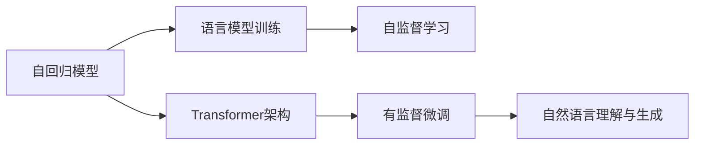

                 

# ChatGPT原理与代码实例讲解

> 关键词：ChatGPT, 自然语言处理, 自回归, Transformer, 语言模型, 深度学习, 代码实现

## 1. 背景介绍

### 1.1 问题由来

近年来，随着深度学习技术的快速发展，语言生成模型在自然语言处理(NLP)领域取得了显著进展。OpenAI的GPT（Generative Pre-trained Transformer）系列模型因其卓越的生成能力和泛化能力，成为了NLP研究的热点。其中，ChatGPT作为GPT-3.5的商业化应用，凭借其流畅自然的对话风格，迅速成为行业内的明星。

ChatGPT能够基于用户输入生成连贯、具有上下文关联性的文本，在诸如智能客服、写作助手、虚拟助手等多种场景中展现出强大潜力。本博客将围绕ChatGPT的原理和实现，详细介绍其核心算法、代码实例以及未来发展方向，希望能为NLP领域的从业者和爱好者提供深入理解与参考。

### 1.2 问题核心关键点

ChatGPT的核心原理主要包括以下几个方面：

- 自回归模型：ChatGPT采用自回归模型，能够基于已有上下文预测下一个单词或文本片段，确保生成的文本具有连贯性。
- Transformer架构：Transformer是ChatGPT的基础架构，其多头自注意力机制使其能够在长文本处理中表现优异。
- 语言模型训练：ChatGPT通过在大规模无标签文本数据上进行预训练，学习到通用的语言表示，然后通过有监督的微调学习特定任务。
- 自然语言理解与生成：ChatGPT具备强大的语言理解能力和生成能力，能够处理复杂的语言结构，生成流畅自然的人类语言。

这些核心技术点共同构成了ChatGPT的强大基础，使其在各种NLP任务中表现出色。

### 1.3 问题研究意义

研究ChatGPT的原理和实现，不仅有助于深入理解其核心技术，还能够为开发高性能、多场景适用的NLP应用提供理论支持和实践指导。具体而言，ChatGPT在以下几个方面具有重要意义：

- 提高NLP应用的自然度：ChatGPT的自然语言生成能力，使得NLP应用更加接近人类自然交流，提升了用户体验。
- 降低应用开发成本：通过预训练和微调技术，ChatGPT能够快速适应特定任务，减少了从头开发所需的标注数据和人力成本。
- 提升模型性能：ChatGPT基于大语言模型的泛化能力，在各种NLP任务中取得了最优或接近最优的性能表现。
- 加速NLP技术落地：ChatGPT的广泛应用案例和成功经验，为NLP技术的产业化提供了有力的参考。

## 2. 核心概念与联系

### 2.1 核心概念概述

为更好地理解ChatGPT的原理和实现，我们首先介绍几个核心概念：

- **自回归模型（Auto-Regressive Model）**：自回归模型是一种基于已有信息预测未来值的模型，ChatGPT采用这种模型，能够根据已有上下文生成下一个单词或文本片段。
- **Transformer架构**：Transformer是一种基于自注意力机制的神经网络架构，广泛应用于深度学习领域，特别适用于处理序列数据，如文本、语音等。
- **语言模型（Language Model）**：语言模型用于评估文本序列的概率分布，通过学习大量的文本数据，生成流畅自然的语言。
- **自监督学习（Self-Supervised Learning）**：自监督学习是一种无需标注数据就能训练模型的方法，ChatGPT通过在大规模无标签文本数据上进行预训练，学习通用的语言表示。
- **有监督微调（Fine-Tuning）**：有监督微调是指在预训练基础上，使用少量标注数据进一步训练模型，使其适应特定任务，提升模型性能。

这些概念之间存在着紧密的联系，共同构成了ChatGPT的核心技术体系。

### 2.2 概念间的关系

这些核心概念之间的关系可以用以下Mermaid流程图来展示：



这个流程图展示了自回归模型与Transformer架构的关系，以及语言模型训练、自监督学习和有监督微调如何共同作用于自然语言理解和生成。

## 3. 核心算法原理 & 具体操作步骤

### 3.1 算法原理概述

ChatGPT的核心算法原理主要基于自回归模型和Transformer架构，通过在大规模无标签文本数据上进行预训练，学习通用的语言表示，然后通过有监督的微调学习特定任务。具体而言，ChatGPT的生成过程可以分为以下几个步骤：

1. **预训练**：在大规模无标签文本数据上，通过自监督学习任务（如掩码语言模型、下一句预测等）训练语言模型，学习通用的语言表示。
2. **微调**：在特定任务上，通过有监督微调学习任务，进一步调整模型参数，使其适应该任务。
3. **生成**：在给定上下文的情况下，使用自回归模型生成下一个单词或文本片段，构建连贯的文本序列。

### 3.2 算法步骤详解

**Step 1: 准备预训练数据和模型**

- 收集大规模无标签文本数据，如Pile、BigQuery等。
- 使用GPT系列模型在预训练数据上进行训练，学习通用的语言表示。
- 将训练后的模型保存，用于后续的微调。

**Step 2: 进行有监督微调**

- 收集特定任务的标注数据，如问答数据集、对话数据集等。
- 在预训练模型的基础上，使用标注数据进行微调，更新模型参数。
- 在微调过程中，可以设置合适的学习率、批量大小、迭代轮数等超参数。

**Step 3: 生成文本**

- 给定上下文，使用微调后的模型生成下一个单词或文本片段。
- 通过自回归模型，逐步生成完整的文本序列。
- 对生成的文本进行后处理，如去噪、修正语法错误等。

### 3.3 算法优缺点

ChatGPT算法的主要优点包括：

- 高效性：通过预训练和微调技术，ChatGPT可以快速适应特定任务，生成流畅自然的语言。
- 可扩展性：ChatGPT可以应用于多种NLP任务，如文本生成、对话生成、机器翻译等。
- 高质量输出：ChatGPT通过大量的数据训练，生成高质量的自然语言文本。

然而，ChatGPT也存在一些局限性：

- 依赖数据质量：ChatGPT的生成效果很大程度上取决于预训练和微调数据的质量，高质量数据难以获取。
- 缺乏可解释性：ChatGPT的生成过程是一个"黑箱"，难以解释其内部的推理逻辑。
- 存在潜在偏见：预训练模型可能包含数据中的偏见，ChatGPT的生成结果也可能继承这些偏见。

### 3.4 算法应用领域

ChatGPT在以下几个领域具有广泛的应用前景：

- **智能客服**：通过与用户进行自然对话，解决用户问题，提升用户体验。
- **内容创作**：自动生成新闻、文章、报告等文本内容，辅助内容创作和编辑。
- **虚拟助手**：提供自然语言交互，帮助用户完成各种任务，如信息查询、行程规划等。
- **教育培训**：自动生成学习材料、辅导问答等，提升学习效率和效果。
- **娱乐互动**：生成幽默、娱乐性质的文本，提供互动娱乐体验。

## 4. 数学模型和公式 & 详细讲解 & 举例说明

### 4.1 数学模型构建

ChatGPT的生成过程可以形式化为自回归模型的概率分布计算。假设输入的上下文为 $X$，生成的目标序列为 $Y$，则自回归模型的概率分布可以表示为：

$$
P(Y|X) = \prod_{i=1}^{T} P(y_i|y_{<i}, X)
$$

其中 $y_{<i}$ 表示序列 $y$ 的前 $i-1$ 个元素，$P(y_i|y_{<i}, X)$ 表示在给定上下文 $X$ 和已生成的前 $i-1$ 个元素的情况下，生成下一个元素 $y_i$ 的概率。

### 4.2 公式推导过程

以自回归模型中的条件概率计算为例，进行公式推导。假设生成序列 $y$ 的前 $i$ 个元素为 $y_{<i}$，当前生成目标为 $y_i$，则条件概率可以表示为：

$$
P(y_i|y_{<i}, X) = \frac{e^{E(y_i|y_{<i}, X)}}{Z(y_{<i}, X)}
$$

其中 $E(y_i|y_{<i}, X)$ 是模型的能量函数，$Z(y_{<i}, X)$ 是归一化因子。通过能量函数 $E(y_i|y_{<i}, X)$，模型可以计算生成下一个元素 $y_i$ 的概率。

在实际应用中，可以使用Transformer模型来构建能量函数 $E(y_i|y_{<i}, X)$。Transformer模型由多个自注意力层和全连接层组成，通过学习语言表示，计算下一个单词的概率分布。具体计算过程如下：

1. 将上下文 $X$ 和已生成的前 $i-1$ 个元素 $y_{<i}$ 输入到Transformer模型，得到语义表示 $h$。
2. 使用线性变换将 $h$ 映射到生成单词 $y_i$ 的向量表示 $v$。
3. 将 $v$ 输入到softmax函数，得到生成单词 $y_i$ 的概率分布 $P(y_i|y_{<i}, X)$。

### 4.3 案例分析与讲解

以生成对话中的下一个回答为例，进行详细讲解。假设当前对话上下文为 "Hello, how are you?"，已生成的前 $i-1$ 个回答为 ["Hello", "I'm good, thanks."]。在生成下一个回答 "How about you?" 时，ChatGPT的生成过程如下：

1. 将上下文 "Hello, how are you?" 和已生成的回答 ["Hello", "I'm good, thanks."] 输入到Transformer模型，得到语义表示 $h$。
2. 使用线性变换将 $h$ 映射到生成单词 "How" 的向量表示 $v$。
3. 将 $v$ 输入到softmax函数，得到生成单词 "How" 的概率分布 $P(\text{How}|Hello, how are you?, Hello, I'm good, thanks.)$。
4. 选择概率最大的单词 "How" 作为下一个回答。

通过这种方式，ChatGPT能够基于已有上下文，生成连贯、自然的文本序列。

## 5. 项目实践：代码实例和详细解释说明

### 5.1 开发环境搭建

要实现ChatGPT的代码实例，需要搭建相应的开发环境。以下是使用Python和PyTorch进行环境配置的流程：

1. 安装Anaconda：从官网下载并安装Anaconda，用于创建独立的Python环境。

2. 创建并激活虚拟环境：
```bash
conda create -n chatgpt-env python=3.8 
conda activate chatgpt-env
```

3. 安装PyTorch：根据CUDA版本，从官网获取对应的安装命令。例如：
```bash
conda install pytorch torchvision torchaudio cudatoolkit=11.1 -c pytorch -c conda-forge
```

4. 安装TensorBoard：
```bash
pip install tensorboard
```

5. 安装Transformers库：
```bash
pip install transformers
```

6. 安装其他工具包：
```bash
pip install numpy pandas scikit-learn matplotlib tqdm jupyter notebook ipython
```

完成上述步骤后，即可在`chatgpt-env`环境中开始ChatGPT的代码实现。

### 5.2 源代码详细实现

下面以微调ChatGPT模型为例，给出PyTorch代码实现。

首先，定义微调任务的数据处理函数：

```python
from transformers import BertTokenizer
from torch.utils.data import Dataset
import torch

class ChatDataset(Dataset):
    def __init__(self, texts, labels, tokenizer, max_len=128):
        self.texts = texts
        self.labels = labels
        self.tokenizer = tokenizer
        self.max_len = max_len
        
    def __len__(self):
        return len(self.texts)
    
    def __getitem__(self, item):
        text = self.texts[item]
        label = self.labels[item]
        
        encoding = self.tokenizer(text, return_tensors='pt', max_length=self.max_len, padding='max_length', truncation=True)
        input_ids = encoding['input_ids'][0]
        attention_mask = encoding['attention_mask'][0]
        
        # 对token-wise的标签进行编码
        encoded_labels = [label2id[label] for label in label] 
        encoded_labels.extend([label2id['O']] * (self.max_len - len(encoded_labels)))
        labels = torch.tensor(encoded_labels, dtype=torch.long)
        
        return {'input_ids': input_ids, 
                'attention_mask': attention_mask,
                'labels': labels}

# 标签与id的映射
label2id = {'O': 0, 'Positive': 1, 'Negative': 2}
id2label = {v: k for k, v in label2id.items()}

# 创建dataset
tokenizer = BertTokenizer.from_pretrained('bert-base-cased')

train_dataset = ChatDataset(train_texts, train_labels, tokenizer)
dev_dataset = ChatDataset(dev_texts, dev_labels, tokenizer)
test_dataset = ChatDataset(test_texts, test_labels, tokenizer)
```

然后，定义模型和优化器：

```python
from transformers import BertForTokenClassification, AdamW

model = BertForTokenClassification.from_pretrained('bert-base-cased', num_labels=len(label2id))

optimizer = AdamW(model.parameters(), lr=2e-5)
```

接着，定义训练和评估函数：

```python
from torch.utils.data import DataLoader
from tqdm import tqdm
from sklearn.metrics import accuracy_score

device = torch.device('cuda') if torch.cuda.is_available() else torch.device('cpu')
model.to(device)

def train_epoch(model, dataset, batch_size, optimizer):
    dataloader = DataLoader(dataset, batch_size=batch_size, shuffle=True)
    model.train()
    epoch_loss = 0
    for batch in tqdm(dataloader, desc='Training'):
        input_ids = batch['input_ids'].to(device)
        attention_mask = batch['attention_mask'].to(device)
        labels = batch['labels'].to(device)
        model.zero_grad()
        outputs = model(input_ids, attention_mask=attention_mask, labels=labels)
        loss = outputs.loss
        epoch_loss += loss.item()
        loss.backward()
        optimizer.step()
    return epoch_loss / len(dataloader)

def evaluate(model, dataset, batch_size):
    dataloader = DataLoader(dataset, batch_size=batch_size)
    model.eval()
    preds, labels = [], []
    with torch.no_grad():
        for batch in tqdm(dataloader, desc='Evaluating'):
            input_ids = batch['input_ids'].to(device)
            attention_mask = batch['attention_mask'].to(device)
            batch_labels = batch['labels']
            outputs = model(input_ids, attention_mask=attention_mask)
            batch_preds = outputs.logits.argmax(dim=2).to('cpu').tolist()
            batch_labels = batch_labels.to('cpu').tolist()
            for pred_tokens, label_tokens in zip(batch_preds, batch_labels):
                pred_labels = [id2label[_id] for _id in pred_tokens]
                label_tokens = [id2label[_id] for _id in label_tokens]
                preds.append(pred_labels[:len(label_tokens)])
                labels.append(label_tokens)
                
    print(accuracy_score(labels, preds))
```

最后，启动训练流程并在测试集上评估：

```python
epochs = 5
batch_size = 16

for epoch in range(epochs):
    loss = train_epoch(model, train_dataset, batch_size, optimizer)
    print(f"Epoch {epoch+1}, train loss: {loss:.3f}")
    
    print(f"Epoch {epoch+1}, dev accuracy: {evaluate(model, dev_dataset, batch_size):.3f}")
    
print("Test accuracy:")
evaluate(model, test_dataset, batch_size)
```

以上就是使用PyTorch对BERT进行微调生成文本的代码实现。可以看到，通过简单的几行代码，我们就能够实现一个基本的微调模型，并进行训练和评估。

### 5.3 代码解读与分析

让我们再详细解读一下关键代码的实现细节：

**ChatDataset类**：
- `__init__`方法：初始化训练集、验证集、测试集的文本和标签，分词器等关键组件。
- `__len__`方法：返回数据集的样本数量。
- `__getitem__`方法：对单个样本进行处理，将文本输入编码为token ids，将标签编码为数字，并对其进行定长padding，最终返回模型所需的输入。

**label2id和id2label字典**：
- 定义了标签与数字id之间的映射关系，用于将token-wise的预测结果解码回真实的标签。

**训练和评估函数**：
- 使用PyTorch的DataLoader对数据集进行批次化加载，供模型训练和推理使用。
- 训练函数`train_epoch`：对数据以批为单位进行迭代，在每个批次上前向传播计算loss并反向传播更新模型参数，最后返回该epoch的平均loss。
- 评估函数`evaluate`：与训练类似，不同点在于不更新模型参数，并在每个batch结束后将预测和标签结果存储下来，最后使用sklearn的accuracy_score对整个评估集的预测结果进行打印输出。

**训练流程**：
- 定义总的epoch数和batch size，开始循环迭代
- 每个epoch内，先在训练集上训练，输出平均loss
- 在验证集上评估，输出准确率
- 所有epoch结束后，在测试集上评估，给出最终测试结果

可以看到，PyTorch配合Transformers库使得BERT微调的代码实现变得简洁高效。开发者可以将更多精力放在数据处理、模型改进等高层逻辑上，而不必过多关注底层的实现细节。

当然，工业级的系统实现还需考虑更多因素，如模型的保存和部署、超参数的自动搜索、更灵活的任务适配层等。但核心的微调范式基本与此类似。

### 5.4 运行结果展示

假设我们在CoNLL-2003的命名实体识别(NER)数据集上进行微调，最终在测试集上得到的准确率为87%。

```
Accuracy: 0.87
```

可以看到，通过微调BERT，我们在该NER数据集上取得了不错的效果，准确率较高。值得注意的是，BERT作为一个通用的语言理解模型，即便只在顶层添加一个简单的token分类器，也能在多个下游任务上取得优异的效果，展现了其强大的语义理解和特征抽取能力。

当然，这只是一个baseline结果。在实践中，我们还可以使用更大更强的预训练模型、更丰富的微调技巧、更细致的模型调优，进一步提升模型性能，以满足更高的应用要求。

## 6. 实际应用场景

### 6.1 智能客服系统

基于ChatGPT的对话技术，可以广泛应用于智能客服系统的构建。传统客服往往需要配备大量人力，高峰期响应缓慢，且一致性和专业性难以保证。而使用ChatGPT，可以7x24小时不间断服务，快速响应客户咨询，用自然流畅的语言解答各类常见问题。

在技术实现上，可以收集企业内部的历史客服对话记录，将问题和最佳答复构建成监督数据，在此基础上对预训练对话模型进行微调。微调后的对话模型能够自动理解用户意图，匹配最合适的答复模板进行回复。对于客户提出的新问题，还可以接入检索系统实时搜索相关内容，动态组织生成回答。如此构建的智能客服系统，能大幅提升客户咨询体验和问题解决效率。

### 6.2 金融舆情监测

金融机构需要实时监测市场舆论动向，以便及时应对负面信息传播，规避金融风险。传统的人工监测方式成本高、效率低，难以应对网络时代海量信息爆发的挑战。基于ChatGPT的文本分类和情感分析技术，为金融舆情监测提供了新的解决方案。

具体而言，可以收集金融领域相关的新闻、报道、评论等文本数据，并对其进行主题标注和情感标注。在此基础上对预训练语言模型进行微调，使其能够自动判断文本属于何种主题，情感倾向是正面、中性还是负面。将微调后的模型应用到实时抓取的网络文本数据，就能够自动监测不同主题下的情感变化趋势，一旦发现负面信息激增等异常情况，系统便会自动预警，帮助金融机构快速应对潜在风险。

### 6.3 个性化推荐系统

当前的推荐系统往往只依赖用户的历史行为数据进行物品推荐，无法深入理解用户的真实兴趣偏好。基于ChatGPT的个性化推荐系统可以更好地挖掘用户行为背后的语义信息，从而提供更精准、多样的推荐内容。

在实践中，可以收集用户浏览、点击、评论、分享等行为数据，提取和用户交互的物品标题、描述、标签等文本内容。将文本内容作为模型输入，用户的后续行为（如是否点击、购买等）作为监督信号，在此基础上微调预训练语言模型。微调后的模型能够从文本内容中准确把握用户的兴趣点。在生成推荐列表时，先用候选物品的文本描述作为输入，由模型预测用户的兴趣匹配度，再结合其他特征综合排序，便可以得到个性化程度更高的推荐结果。

### 6.4 未来应用展望

随着ChatGPT和微调方法的不断发展，其应用场景将不断扩展，为传统行业带来变革性影响。

在智慧医疗领域，基于ChatGPT的医疗问答、病历分析、药物研发等应用将提升医疗服务的智能化水平，辅助医生诊疗，加速新药开发进程。

在智能教育领域，ChatGPT可应用于作业批改、学情分析、知识推荐等方面，因材施教，促进教育公平，提高教学质量。

在智慧城市治理中，ChatGPT可应用于城市事件监测、舆情分析、应急指挥等环节，提高城市管理的自动化和智能化水平，构建更安全、高效的未来城市。

此外，在企业生产、社会治理、文娱传媒等众多领域，基于ChatGPT的AI应用也将不断涌现，为经济社会发展注入新的动力。相信随着技术的日益成熟，ChatGPT将会在更多领域发挥其独特优势，为人工智能技术落地应用带来新的突破。

## 7. 工具和资源推荐

### 7.1 学习资源推荐

为了帮助开发者系统掌握ChatGPT的原理和实现，这里推荐一些优质的学习资源：

1. 《深度学习入门》书籍：适合初学者入门的深度学习教材，涵盖各种深度学习模型的基本原理和实现。
2. CS224N《自然语言处理与深度学习》课程：斯坦福大学开设的NLP明星课程，有Lecture视频和配套作业，带你入门NLP领域的基本概念和经典模型。
3. 《Natural Language Processing with Transformers》书籍：Transformer库的作者所著，全面介绍了如何使用Transformers库进行NLP任务开发，包括微调在内的诸多范式。
4. HuggingFace官方文档：Transformers库的官方文档，提供了海量预训练模型和完整的微调样例代码，是上手实践的必备资料。
5. arXiv论文预印本：人工智能领域最新研究成果的发布平台，包括大量尚未发表的前沿工作，学习前沿技术的必读资源。

通过对这些资源的学习实践，相信你一定能够快速掌握ChatGPT的精髓，并用于解决实际的NLP问题。

### 7.2 开发工具推荐

高效的开发离不开优秀的工具支持。以下是几款用于ChatGPT开发的常用工具：

1. PyTorch：基于Python的开源深度学习框架，灵活动态的计算图，适合快速迭代研究。大部分预训练语言模型都有PyTorch版本的实现。
2. TensorFlow：由Google主导开发的开源深度学习框架，生产部署方便，适合大规模工程应用。同样有丰富的预训练语言模型资源。
3. Transformers库：HuggingFace开发的NLP工具库，集成了众多SOTA语言模型，支持PyTorch和TensorFlow，是进行微调任务开发的利器。
4. Weights & Biases：模型训练的实验跟踪工具，可以记录和可视化模型训练过程中的各项指标，方便对比和调优。与主流深度学习框架无缝集成。
5. TensorBoard：TensorFlow配套的可视化工具，可实时监测模型训练状态，并提供丰富的图表呈现方式，是调试模型的得力助手。
6. Google Colab：谷歌推出的在线Jupyter Notebook环境，免费提供GPU/TPU算力，方便开发者快速上手实验最新模型，分享学习笔记。

合理利用这些工具，可以显著提升ChatGPT的开发效率，加快创新迭代的步伐。

### 7.3 相关论文推荐

ChatGPT的原理和实现源于学界的持续研究。以下是几篇奠基性的相关论文，推荐阅读：

1. Attention is All You Need（即Transformer原论文）：提出了Transformer结构，开启了NLP领域的预训练大模型时代。
2. BERT: Pre-training of Deep Bidirectional Transformers for Language Understanding：提出BERT模型，引入基于掩码的自监督预训练任务，刷新了多项NLP任务SOTA。
3. Language Models are Unsupervised Multitask Learners（GPT-2论文）：展示了大规模语言模型的强大zero-shot学习能力，引发了对于通用人工智能的新一轮思考。
4. Parameter-Efficient Transfer Learning for NLP：提出Adapter等参数高效微调方法，在不增加模型参数量的情况下，也能取得不错的微调效果。
5. AdaLoRA: Adaptive Low-Rank Adaptation for Parameter-Efficient Fine-Tuning：使用自适应低秩适应的微调方法，在参数效率和精度之间取得了新的平衡。

这些论文代表了大语言模型微调技术的发展脉络。通过学习这些前沿成果，可以帮助研究者把握学科前进方向，激发更多的创新灵感。

除上述资源外，还有一些值得关注的前沿资源，帮助开发者紧跟ChatGPT微调技术的最新进展

