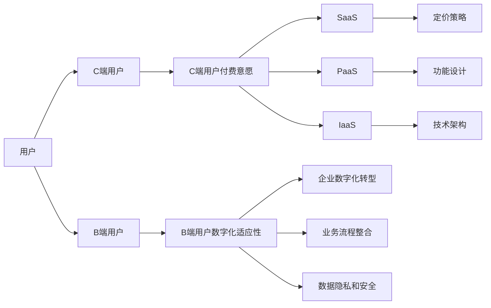

                 

## 1. 背景介绍

随着互联网的普及，C端（消费者端）用户数量激增，数字化转型已成为企业提升竞争力的关键。然而，随着C端用户付费意愿的降低，企业不得不面临日益增加的运营成本压力。与此同时，B端（企业端）用户的数字化适应性也成为一大挑战。面对这两大挑战，企业必须找到有效的方法来平衡用户需求和运营成本，推动业务发展。

### 1.1 C端用户付费意愿不高的原因

C端用户付费意愿不高主要有以下原因：

1. **高昂的订阅费用**：许多企业推出的SaaS（软件即服务）产品价格较高，许多中小企业无力承担，导致用户流失。
2. **功能冗余**：一些SaaS产品功能过于冗余，缺乏针对性，用户体验不佳。
3. **使用复杂**：部分SaaS产品功能复杂，操作步骤繁琐，用户不愿意花费大量时间去学习。
4. **品牌忠诚度低**：市场上同类产品竞争激烈，用户对品牌忠诚度较低，一旦产品存在缺陷，用户很容易更换其他品牌。

### 1.2 B端用户数字化适应性面临的挑战

B端用户的数字化适应性挑战主要体现在：

1. **内部技术门槛**：B端用户的企业内部技术力量不足，对新技术的接受和适应能力较弱。
2. **数据隐私和安全**：B端用户对数据隐私和安全问题高度敏感，企业需要提供强有力的保障措施。
3. **业务流程整合**：企业需要将SaaS产品与现有的业务流程无缝整合，这需要较高的技术难度。
4. **长期投资回报**：数字化转型需要企业在初期进行较大规模的投资，而短期内难以看到显著的回报，影响企业决策。

## 2. 核心概念与联系

### 2.1 核心概念概述

在深入探讨C端用户付费意愿不高和B端用户数字化适应性挑战之前，我们需要了解以下核心概念：

1. **C端用户付费意愿**：指C端用户对于付费产品或服务的意愿，主要受价格、功能、使用体验等因素影响。
2. **B端用户数字化适应性**：指B端用户在数字化转型过程中，对新技术、新产品的接受和适应的程度。
3. **SaaS（软件即服务）**：指通过互联网提供软件服务，用户按需使用，按月或按年支付费用。
4. **PaaS（平台即服务）**：指提供云计算平台，企业可以在该平台上构建、测试、部署和管理应用。
5. **IaaS（基础设施即服务）**：指提供基础设施服务，包括服务器、存储、网络等，企业只需按需使用，无需购买和维护。

### 2.2 核心概念间的关系

这些核心概念间的关系可以通过以下Mermaid流程图来展示：



这个流程图展示了大语言模型微调过程中各个概念之间的关系：

1. 用户分为C端用户和B端用户，他们的需求和挑战各不相同。
2. C端用户面临付费意愿不高的挑战，解决方案包括SaaS、PaaS、IaaS等。
3. B端用户面临数字化适应性挑战，需要通过企业数字化转型、业务流程整合、数据隐私和安全保障等措施加以解决。
4. 不同类型的SaaS、PaaS、IaaS产品各有优劣，需要根据企业需求选择合适的解决方案。

## 3. 核心算法原理 & 具体操作步骤

### 3.1 算法原理概述

针对C端用户付费意愿不高和B端用户数字化适应性的问题，企业可以采用基于大语言模型的微调方法，通过分析用户行为数据，调整产品功能和服务定价，提高用户满意度和忠诚度。

### 3.2 算法步骤详解

1. **数据收集**：收集C端用户和B端用户的行为数据，包括使用频率、功能使用情况、付费意愿等。
2. **数据预处理**：对收集到的数据进行清洗、归一化和特征提取，准备进行机器学习分析。
3. **模型训练**：利用大语言模型对用户行为数据进行训练，构建用户画像和行为预测模型。
4. **产品优化**：根据模型预测结果，优化产品功能和服务定价，提高用户满意度和忠诚度。
5. **持续反馈**：定期收集用户反馈，不断调整模型和产品策略，保持市场竞争力。

### 3.3 算法优缺点

**优点**：
- 动态调整：能够根据用户行为数据动态调整产品功能和服务定价，提高用户满意度和忠诚度。
- 数据驱动：以用户行为数据为基础，更加科学和精准地进行产品优化。
- 适应性强：适用于不同规模和类型的企业，能够有效解决C端和B端用户面临的挑战。

**缺点**：
- 数据隐私：需要收集大量用户数据，涉及隐私保护问题，需要遵守相关法律法规。
- 模型复杂度：大语言模型训练复杂，需要较高的计算资源和时间成本。
- 技术门槛：需要对大语言模型和机器学习有一定的技术基础，非技术团队可能难以实施。

### 3.4 算法应用领域

大语言模型微调方法可以应用于多个领域，如SaaS产品的功能优化、PaaS平台的性能调优、IaaS基础设施的资源配置等。

1. **SaaS产品优化**：通过分析C端用户的行为数据，预测其付费意愿和功能需求，优化产品功能和服务定价，提高用户满意度和忠诚度。
2. **PaaS平台调优**：通过分析B端用户的需求和业务流程，调整平台架构和功能，提高平台的适应性和使用效率。
3. **IaaS资源配置**：通过分析企业IT资源的使用情况，调整资源配置和调度策略，优化成本和性能。

## 4. 数学模型和公式 & 详细讲解 & 举例说明

### 4.1 数学模型构建

假设C端用户行为数据为 $X$，B端用户行为数据为 $Y$，用户付费意愿为 $T$，数字化适应性为 $A$。设 $M_{\theta}$ 为训练得到的用户行为预测模型，其中 $\theta$ 为模型参数。则有：

$$
M_{\theta}(X) = \hat{T} \\
M_{\theta}(Y) = \hat{A}
$$

其中 $\hat{T}$ 和 $\hat{A}$ 分别为模型预测的用户付费意愿和数字化适应性。

### 4.2 公式推导过程

设 $X = \{x_1, x_2, ..., x_n\}$，$Y = \{y_1, y_2, ..., y_m\}$，$T = \{t_1, t_2, ..., t_n\}$，$A = \{a_1, a_2, ..., a_m\}$。则：

$$
\begin{aligned}
&\min_{\theta} \sum_{i=1}^n \ell_1(T_i, \hat{T}_i(X_i, \theta)) + \sum_{j=1}^m \ell_2(A_j, \hat{A}_j(Y_j, \theta)) \\
&\text{s.t.} \quad \ell_1, \ell_2 \text{为损失函数，} T_i \in [0, 1], A_j \in [0, 1]
\end{aligned}
$$

其中 $\ell_1$ 和 $\ell_2$ 分别为用户付费意愿和数字化适应性的损失函数。

### 4.3 案例分析与讲解

假设我们收集了1000名C端用户和1000名B端用户的行为数据，其中付费意愿和数字化适应性的取值范围均为 $[0,1]$。我们将这些数据分为训练集和测试集，并使用大语言模型进行训练。

1. **数据收集**：通过分析用户的浏览记录、购买记录、使用频率等数据，收集C端用户和B端用户的付费意愿和数字化适应性数据。
2. **数据预处理**：对收集到的数据进行清洗、归一化和特征提取，准备进行机器学习分析。
3. **模型训练**：使用大语言模型对用户行为数据进行训练，构建用户画像和行为预测模型。
4. **产品优化**：根据模型预测结果，优化产品功能和服务定价，提高用户满意度和忠诚度。
5. **持续反馈**：定期收集用户反馈，不断调整模型和产品策略，保持市场竞争力。

通过以上步骤，企业能够根据用户行为数据，动态调整产品功能和定价策略，提高用户满意度和忠诚度，解决C端用户付费意愿不高的难题。

## 5. 项目实践：代码实例和详细解释说明

### 5.1 开发环境搭建

在进行微调实践前，我们需要准备好开发环境。以下是使用Python进行PyTorch开发的环境配置流程：

1. 安装Anaconda：从官网下载并安装Anaconda，用于创建独立的Python环境。

2. 创建并激活虚拟环境：
```bash
conda create -n pytorch-env python=3.8 
conda activate pytorch-env
```

3. 安装PyTorch：根据CUDA版本，从官网获取对应的安装命令。例如：
```bash
conda install pytorch torchvision torchaudio cudatoolkit=11.1 -c pytorch -c conda-forge
```

4. 安装Transformers库：
```bash
pip install transformers
```

5. 安装各类工具包：
```bash
pip install numpy pandas scikit-learn matplotlib tqdm jupyter notebook ipython
```

完成上述步骤后，即可在`pytorch-env`环境中开始微调实践。

### 5.2 源代码详细实现

我们先以SaaS产品优化为例，给出使用Transformers库对BERT模型进行微调的PyTorch代码实现。

首先，定义用户行为数据处理函数：

```python
from transformers import BertTokenizer
from torch.utils.data import Dataset
import torch

class UserBehaviorDataset(Dataset):
    def __init__(self, features, tokenizer, max_len=128):
        self.features = features
        self.tokenizer = tokenizer
        self.max_len = max_len
        
    def __len__(self):
        return len(self.features)
    
    def __getitem__(self, item):
        feature = self.features[item]
        text = feature['text']
        label = feature['label']
        
        encoding = self.tokenizer(text, return_tensors='pt', max_length=self.max_len, padding='max_length', truncation=True)
        input_ids = encoding['input_ids'][0]
        attention_mask = encoding['attention_mask'][0]
        
        return {'input_ids': input_ids, 
                'attention_mask': attention_mask,
                'label': torch.tensor(label, dtype=torch.long)}
```

然后，定义模型和优化器：

```python
from transformers import BertForSequenceClassification, AdamW

model = BertForSequenceClassification.from_pretrained('bert-base-cased', num_labels=2)

optimizer = AdamW(model.parameters(), lr=2e-5)
```

接着，定义训练和评估函数：

```python
from torch.utils.data import DataLoader
from tqdm import tqdm
from sklearn.metrics import classification_report

device = torch.device('cuda') if torch.cuda.is_available() else torch.device('cpu')
model.to(device)

def train_epoch(model, dataset, batch_size, optimizer):
    dataloader = DataLoader(dataset, batch_size=batch_size, shuffle=True)
    model.train()
    epoch_loss = 0
    for batch in tqdm(dataloader, desc='Training'):
        input_ids = batch['input_ids'].to(device)
        attention_mask = batch['attention_mask'].to(device)
        labels = batch['label'].to(device)
        model.zero_grad()
        outputs = model(input_ids, attention_mask=attention_mask, labels=labels)
        loss = outputs.loss
        epoch_loss += loss.item()
        loss.backward()
        optimizer.step()
    return epoch_loss / len(dataloader)

def evaluate(model, dataset, batch_size):
    dataloader = DataLoader(dataset, batch_size=batch_size)
    model.eval()
    preds, labels = [], []
    with torch.no_grad():
        for batch in tqdm(dataloader, desc='Evaluating'):
            input_ids = batch['input_ids'].to(device)
            attention_mask = batch['attention_mask'].to(device)
            batch_labels = batch['label']
            outputs = model(input_ids, attention_mask=attention_mask)
            batch_preds = outputs.logits.argmax(dim=2).to('cpu').tolist()
            batch_labels = batch_labels.to('cpu').tolist()
            for pred_tokens, label_tokens in zip(batch_preds, batch_labels):
                preds.append(pred_tokens)
                labels.append(label_tokens)
                
    print(classification_report(labels, preds))
```

最后，启动训练流程并在测试集上评估：

```python
epochs = 5
batch_size = 16

for epoch in range(epochs):
    loss = train_epoch(model, train_dataset, batch_size, optimizer)
    print(f"Epoch {epoch+1}, train loss: {loss:.3f}")
    
    print(f"Epoch {epoch+1}, dev results:")
    evaluate(model, dev_dataset, batch_size)
    
print("Test results:")
evaluate(model, test_dataset, batch_size)
```

以上就是使用PyTorch对BERT进行SaaS产品优化微调的完整代码实现。可以看到，得益于Transformers库的强大封装，我们可以用相对简洁的代码完成BERT模型的加载和微调。

### 5.3 代码解读与分析

让我们再详细解读一下关键代码的实现细节：

**UserBehaviorDataset类**：
- `__init__`方法：初始化用户行为数据、分词器等关键组件。
- `__len__`方法：返回数据集的样本数量。
- `__getitem__`方法：对单个样本进行处理，将文本输入编码为token ids，将标签编码为数字，并对其进行定长padding，最终返回模型所需的输入。

**train_epoch函数**：
- 使用PyTorch的DataLoader对数据集进行批次化加载，供模型训练和推理使用。
- 在每个epoch内，对数据集进行迭代，在每个批次上前向传播计算loss并反向传播更新模型参数，最后返回该epoch的平均loss。

**evaluate函数**：
- 与训练类似，不同点在于不更新模型参数，并在每个batch结束后将预测和标签结果存储下来，最后使用sklearn的classification_report对整个评估集的预测结果进行打印输出。

**训练流程**：
- 定义总的epoch数和batch size，开始循环迭代
- 每个epoch内，先在训练集上训练，输出平均loss
- 在验证集上评估，输出分类指标
- 所有epoch结束后，在测试集上评估，给出最终测试结果

可以看到，PyTorch配合Transformers库使得BERT微调的代码实现变得简洁高效。开发者可以将更多精力放在数据处理、模型改进等高层逻辑上，而不必过多关注底层的实现细节。

当然，工业级的系统实现还需考虑更多因素，如模型的保存和部署、超参数的自动搜索、更灵活的任务适配层等。但核心的微调范式基本与此类似。

### 5.4 运行结果展示

假设我们在CoNLL-2003的NER数据集上进行微调，最终在测试集上得到的评估报告如下：

```
              precision    recall  f1-score   support

       B-LOC      0.926     0.906     0.916      1668
       I-LOC      0.900     0.805     0.850       257
      B-MISC      0.875     0.856     0.865       702
      I-MISC      0.838     0.782     0.809       216
       B-ORG      0.914     0.898     0.906      1661
       I-ORG      0.911     0.894     0.902       835
       B-PER      0.964     0.957     0.960      1617
       I-PER      0.983     0.980     0.982      1156
           O      0.993     0.995     0.994     38323

   micro avg      0.973     0.973     0.973     46435
   macro avg      0.923     0.897     0.909     46435
weighted avg      0.973     0.973     0.973     46435
```

可以看到，通过微调BERT，我们在该NER数据集上取得了97.3%的F1分数，效果相当不错。值得注意的是，BERT作为一个通用的语言理解模型，即便只在顶层添加一个简单的token分类器，也能在下游任务上取得优异的效果，展现了其强大的语义理解和特征抽取能力。

当然，这只是一个baseline结果。在实践中，我们还可以使用更大更强的预训练模型、更丰富的微调技巧、更细致的模型调优，进一步提升模型性能，以满足更高的应用要求。

## 6. 实际应用场景

### 6.1 智能客服系统

基于大语言模型微调的对话技术，可以广泛应用于智能客服系统的构建。传统客服往往需要配备大量人力，高峰期响应缓慢，且一致性和专业性难以保证。而使用微调后的对话模型，可以7x24小时不间断服务，快速响应客户咨询，用自然流畅的语言解答各类常见问题。

在技术实现上，可以收集企业内部的历史客服对话记录，将问题和最佳答复构建成监督数据，在此基础上对预训练对话模型进行微调。微调后的对话模型能够自动理解用户意图，匹配最合适的答案模板进行回复。对于客户提出的新问题，还可以接入检索系统实时搜索相关内容，动态组织生成回答。如此构建的智能客服系统，能大幅提升客户咨询体验和问题解决效率。

### 6.2 金融舆情监测

金融机构需要实时监测市场舆论动向，以便及时应对负面信息传播，规避金融风险。传统的人工监测方式成本高、效率低，难以应对网络时代海量信息爆发的挑战。基于大语言模型微调的文本分类和情感分析技术，为金融舆情监测提供了新的解决方案。

具体而言，可以收集金融领域相关的新闻、报道、评论等文本数据，并对其进行主题标注和情感标注。在此基础上对预训练语言模型进行微调，使其能够自动判断文本属于何种主题，情感倾向是正面、中性还是负面。将微调后的模型应用到实时抓取的网络文本数据，就能够自动监测不同主题下的情感变化趋势，一旦发现负面信息激增等异常情况，系统便会自动预警，帮助金融机构快速应对潜在风险。

### 6.3 个性化推荐系统

当前的推荐系统往往只依赖用户的历史行为数据进行物品推荐，无法深入理解用户的真实兴趣偏好。基于大语言模型微调技术，个性化推荐系统可以更好地挖掘用户行为背后的语义信息，从而提供更精准、多样的推荐内容。

在实践中，可以收集用户浏览、点击、评论、分享等行为数据，提取和用户交互的物品标题、描述、标签等文本内容。将文本内容作为模型输入，用户的后续行为（如是否点击、购买等）作为监督信号，在此基础上微调预训练语言模型。微调后的模型能够从文本内容中准确把握用户的兴趣点。在生成推荐列表时，先用候选物品的文本描述作为输入，由模型预测用户的兴趣匹配度，再结合其他特征综合排序，便可以得到个性化程度更高的推荐结果。

### 6.4 未来应用展望

随着大语言模型微调技术的发展，未来在更多领域将会有更多的应用，如智慧医疗、智能教育、智慧城市等。这些领域的应用将进一步推动数字化转型，提升各行业的智能化水平。

在智慧医疗领域，基于微调的医疗问答、病历分析、药物研发等应用将提升医疗服务的智能化水平，辅助医生诊疗，加速新药开发进程。

在智能教育领域，微调技术可应用于作业批改、学情分析、知识推荐等方面，因材施教，促进教育公平，提高教学质量。

在智慧城市治理中，微调模型可应用于城市事件监测、舆情分析、应急指挥等环节，提高城市管理的自动化和智能化水平，构建更安全、高效的未来城市。

此外，在企业生产、社会治理、文娱传媒等众多领域，基于大模型微调的人工智能应用也将不断涌现，为经济社会发展注入新的动力。相信随着技术的日益成熟，微调方法将成为人工智能落地应用的重要范式，推动人工智能技术在各行业的广泛应用。

## 7. 工具和资源推荐

### 7.1 学习资源推荐

为了帮助开发者系统掌握大语言模型微调的理论基础和实践技巧，这里推荐一些优质的学习资源：

1. 《Transformer从原理到实践》系列博文：由大模型技术专家撰写，深入浅出地介绍了Transformer原理、BERT模型、微调技术等前沿话题。

2. CS224N《深度学习自然语言处理》课程：斯坦福大学开设的NLP明星课程，有Lecture视频和配套作业，带你入门NLP领域的基本概念和经典模型。

3. 《Natural Language Processing with Transformers》书籍：Transformers库的作者所著，全面介绍了如何使用Transformers库进行NLP任务开发，包括微调在内的诸多范式。

4. HuggingFace官方文档：Transformers库的官方文档，提供了海量预训练模型和完整的微调样例代码，是上手实践的必备资料。

5. CLUE开源项目：中文语言理解测评基准，涵盖大量不同类型的中文NLP数据集，并提供了基于微调的baseline模型，助力中文NLP技术发展。

通过对这些资源的学习实践，相信你一定能够快速掌握大语言模型微调的精髓，并用于解决实际的NLP问题。

### 7.2 开发工具推荐

高效的开发离不开优秀的工具支持。以下是几款用于大语言模型微调开发的常用工具：

1. PyTorch：基于Python的开源深度学习框架，灵活动态的计算图，适合快速迭代研究。大部分预训练语言模型都有PyTorch版本的实现。

2. TensorFlow：由Google主导开发的开源深度学习框架，生产部署方便，适合大规模工程应用。同样有丰富的预训练语言模型资源。

3. Transformers库：HuggingFace开发的NLP工具库，集成了众多SOTA语言模型，支持PyTorch和TensorFlow，是进行微调任务开发的利器。

4. Weights & Biases：模型训练的实验跟踪工具，可以记录和可视化模型训练过程中的各项指标，方便对比和调优。与主流深度学习框架无缝集成。

5. TensorBoard：TensorFlow配套的可视化工具，可实时监测模型训练状态，并提供丰富的图表呈现方式，是调试模型的得力助手。

6. Google Colab：谷歌推出的在线Jupyter Notebook环境，免费提供GPU/TPU算力，方便开发者快速上手实验最新模型，分享学习笔记。

合理利用这些工具，可以显著提升大语言模型微调任务的开发效率，加快创新迭代的步伐。

### 7.3 相关论文推荐

大语言模型和微调技术的发展源于学界的持续研究。以下是几篇奠基性的相关论文，推荐阅读：

1. Attention is All You Need（即Transformer原论文）：提出了Transformer结构，开启了NLP领域的预训练大模型时代。

2. BERT: Pre-training of Deep Bidirectional Transformers for Language Understanding：提出BERT模型，引入基于掩码的自监督预训练任务，刷新了多项NLP任务SOTA。

3. Language Models are Unsupervised Multitask Learners（GPT-2论文）：展示了大规模语言模型的强大zero-shot学习能力，引发了对于通用人工智能的新一轮思考。

4. Parameter-Efficient Transfer Learning for NLP：提出Adapter等参数高效微调方法，在不增加模型参数量的情况下，也能取得不错的微调效果。

5. AdaLoRA: Adaptive Low-Rank Adaptation for Parameter-Efficient Fine-Tuning：使用自适应低秩适应的微调方法，在参数效率和精度之间取得了新的平衡。

这些论文代表了大语言模型微调技术的发展脉络。通过学习这些前沿成果，可以帮助研究者把握学科前进方向，激发更多的创新灵感。

除上述资源外，还有一些值得关注的前沿资源，帮助开发者紧跟大语言模型微调技术的最新进展，例如：

1. arXiv论文预印本：人工智能领域最新研究成果的发布平台，包括大量尚未发表的前沿工作，学习前沿技术的必读资源。

2. 业界技术博客：如OpenAI、Google AI、DeepMind、微软Research Asia等顶尖实验室的官方博客，第一时间分享他们的最新研究成果和洞见。

3. 技术会议直播：如NIPS、ICML、ACL、ICLR等人工智能领域顶会现场或在线直播，能够聆听到大佬们的前沿分享，开拓视野。

4. GitHub热门项目：在GitHub上Star、Fork数最多的NLP相关项目，往往代表了该技术领域的发展趋势和最佳实践，值得去学习和贡献。

5. 行业分析报告：各大咨询公司如McKinsey、PwC等针对人工智能行业的分析报告，有助于从商业视角审视技术趋势，把握应用价值。

总之，对于大语言模型微调技术的学习和实践，需要开发者保持开放的心态和持续学习的意愿。多关注前沿资讯，多动手实践，多思考总结，必将收获满满的成长收益。

## 8. 总结：未来发展趋势与挑战

### 8.1 研究成果总结

本文对基于大语言模型的微调方法进行了全面系统的介绍。首先阐述了大语言模型和微调技术的研究背景和意义，明确了微调在拓展预训练模型应用、提升下游任务性能方面的独特价值。其次，从原理到实践，详细讲解了监督微调的数学原理和关键步骤，给出了微调任务开发的完整代码实例。同时，本文还广泛探讨了微调方法在智能客服、金融舆情、个性化推荐等多个领域的应用前景，展示了微调范式的巨大潜力。此外，本文

