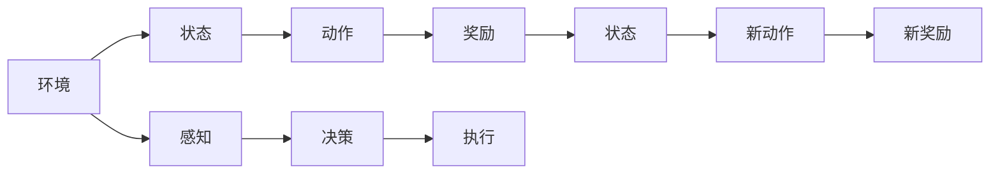
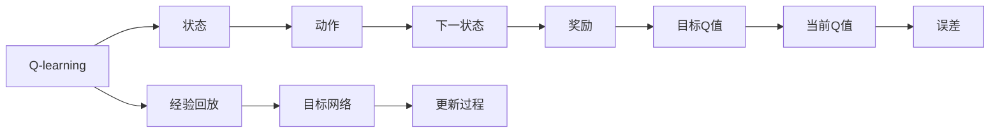
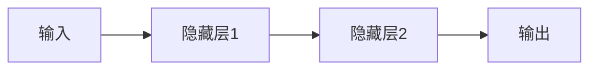
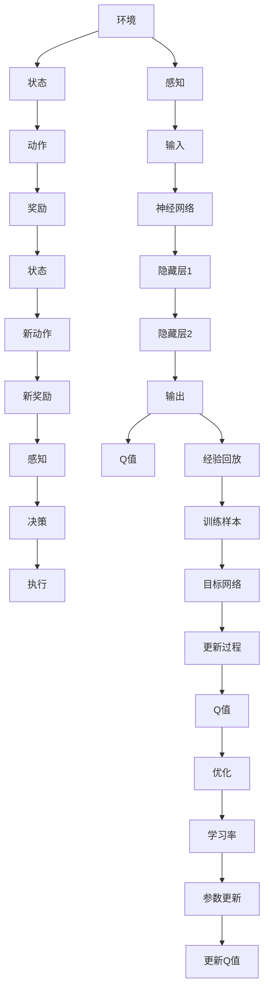

                 

# DQN(Deep Q-Network) - 原理与代码实例讲解

> 关键词：深度强化学习, Q-learning, 深度神经网络, 智能体(Agent), 深度Q网络, 环境与奖励

## 1. 背景介绍

### 1.1 问题由来
在人工智能领域，强化学习(RL)是一种重要的方法，旨在让智能体(Agent)通过与环境交互学习最优策略。与传统的基于监督学习的机器学习方法不同，强化学习不需要显式的标签数据，而是通过试错来优化行为策略。这一特性使得强化学习在复杂的控制系统和智能决策领域具有巨大的潜力。

深度Q网络(Deep Q-Network, DQN)是一种结合深度神经网络与强化学习的技术，由Google DeepMind团队在2013年提出，并成功应用于复杂的游戏问题，如阿兹特克立方体(Atari)等，从而在国际人工智能界引起了广泛关注。

### 1.2 问题核心关键点
DQN的核心思想在于将深度神经网络引入Q-learning算法中，解决传统Q-learning算法在处理高维状态空间和大量状态-动作对时的计算复杂度问题。具体而言，DQN通过使用神经网络来近似Q函数，从而将Q-learning的计算从指数级降低到多项式级。

此外，DQN引入了经验回放(Experience Replay)和目标网络(Target Network)等机制，进一步提高了算法效率和稳定性。通过这些技术，DQN可以在复杂环境中表现出色，成为强化学习领域的重要里程碑。

### 1.3 问题研究意义
DQN不仅推动了强化学习领域的发展，还在实际应用中展示出强大的潜力。例如，DQN被应用于机器人控制、自动驾驶、金融交易等多个领域，极大地提升了系统智能化水平和决策效率。

研究DQN的原理与实现细节，对于掌握深度强化学习技术，并在实际应用中开发高效智能决策系统，具有重要意义。本文将系统讲解DQN的原理、算法步骤、数学模型、代码实现，并提供相关的工具和资源推荐，以期为读者提供全面的技术指引。

## 2. 核心概念与联系

### 2.1 核心概念概述

为了更好地理解DQN，首先介绍几个关键概念：

- 强化学习(Reinforcement Learning, RL)：一种通过智能体与环境交互，学习最优策略的机器学习方法。智能体通过试错不断调整行为，以最大化累积奖励。

- Q-learning：一种基于值迭代的强化学习方法，旨在学习最优策略。Q值表示在当前状态下采取某一动作的长期累积奖励，通过最大化Q值来选择最优动作。

- 深度神经网络(Deep Neural Network, DNN)：一种多层次的神经网络结构，能够自动提取输入数据的特征，解决高维数据处理问题。

- 深度Q网络(Deep Q-Network, DQN)：结合深度神经网络和Q-learning，用于解决高维状态空间和大量状态-动作对的强化学习问题。通过使用深度神经网络逼近Q值函数，DQN可以处理复杂的决策问题。

- 经验回放(Experience Replay)：一种用于提高DQN训练效率的技术，通过将历史经验数据随机采样，增加训练样本的多样性。

- 目标网络(Target Network)：一种用于稳定DQN训练的技术，通过引入一个滞后的Q函数估计，减少更新过程中的方差。

这些概念之间的逻辑关系可以通过以下Mermaid流程图来展示：

```mermaid
graph TB
    A[强化学习] --> B[Q-learning]
    A --> C[深度学习]
    C --> D[深度Q网络(DQN)]
    B --> E[经验回放]
    D --> E
    D --> F[目标网络]
    E --> F
    F --> G[优化过程]
```

这个流程图展示了DQN的核心概念及其之间的关系：

1. 强化学习是基础框架，Q-learning是核心算法，深度学习提供了技术手段。
2. 经验回放和目标网络是DQN的关键技术，优化过程则是实现这一过程的机制。

### 2.2 概念间的关系

这些核心概念之间存在着紧密的联系，形成了DQN的学习框架。下面通过几个Mermaid流程图来展示这些概念之间的关系。

#### 2.2.1 强化学习的决策过程



这个流程图展示了强化学习的基本决策过程：

1. 智能体从环境中感知当前状态。
2. 智能体根据当前状态和策略，选择动作。
3. 执行动作后，获得环境反馈的奖励。
4. 智能体根据奖励更新策略。

#### 2.2.2 Q-learning的策略更新



这个流程图展示了Q-learning的策略更新过程：

1. Q-learning通过经验回放从历史数据中采样状态-动作对。
2. 根据当前状态和动作，计算下一个状态的Q值。
3. 计算当前状态-动作对的Q值。
4. 通过误差更新当前Q值。

#### 2.2.3 深度Q网络的结构



这个流程图展示了深度Q网络的基本结构：

1. 输入层接受环境状态。
2. 通过隐藏层进行特征提取。
3. 输出层输出当前状态的Q值。

### 2.3 核心概念的整体架构

最后，我们用一个综合的流程图来展示这些核心概念在DQN中的整体架构：



这个综合流程图展示了从环境感知到动作执行，再到Q值更新的完整过程。通过这些流程图，我们可以更清晰地理解DQN的工作原理和优化过程。

## 3. 核心算法原理 & 具体操作步骤
### 3.1 算法原理概述

DQN通过将深度神经网络引入Q-learning算法中，解决了传统Q-learning在处理高维状态空间和大量状态-动作对时的计算复杂度问题。具体而言，DQN的算法原理包括以下几个关键步骤：

1. **环境感知**：智能体从环境中感知当前状态。
2. **决策制定**：智能体根据当前状态和策略，选择动作。
3. **执行动作**：执行动作后，智能体获得环境反馈的奖励。
4. **状态更新**：智能体根据奖励更新状态。
5. **Q值更新**：通过经验回放和目标网络，更新当前状态的Q值。
6. **策略优化**：通过优化Q值，智能体调整策略。

### 3.2 算法步骤详解

DQN的算法步骤如下：

1. **初始化**：初始化智能体的状态、神经网络参数、经验缓冲区等。
2. **感知环境**：智能体从环境中感知当前状态，输入到深度神经网络中。
3. **决策**：神经网络输出Q值，选择Q值最大的动作。
4. **执行动作**：智能体执行选择的动作，并观察新的状态和奖励。
5. **经验回放**：将当前状态、动作、奖励和新状态存入经验缓冲区。
6. **样本抽取**：从经验缓冲区随机抽取样本，送入神经网络计算Q值。
7. **目标网络计算**：使用目标网络计算新状态下的Q值。
8. **更新Q值**：根据Q-learning算法更新当前状态的Q值。
9. **优化神经网络**：使用优化器优化神经网络参数，最小化Q值误差。
10. **重复执行**：不断重复以上步骤，直到智能体收敛。

### 3.3 算法优缺点

DQN的优势在于能够处理高维状态空间和大量状态-动作对，具有良好的泛化能力。但同时也存在以下缺点：

- **过拟合风险**：神经网络中的权重参数较多，容易导致过拟合。
- **经验回放**：经验回放需要额外的内存和时间，增加了系统负担。
- **目标网络**：目标网络的引入增加了模型的复杂度，同时需要同步更新，增加了计算开销。

### 3.4 算法应用领域

DQN已经在多个领域中得到广泛应用，例如：

- **游戏AI**：如AlphaGo、AlphaStar等，通过DQN学习最优策略，实现高水平的游戏能力。
- **机器人控制**：通过DQN训练机器人执行复杂动作，提升自动化水平。
- **自动驾驶**：通过DQN训练车辆在复杂环境中行驶，实现智能驾驶。
- **金融交易**：通过DQN学习交易策略，实现自动化交易。

## 4. 数学模型和公式 & 详细讲解 & 举例说明

### 4.1 数学模型构建

DQN的数学模型构建基于Q-learning，旨在通过神经网络逼近Q函数，从而实现状态-动作对的优化。

设智能体当前状态为 $s_t$，采取动作 $a_t$ 后，环境转移到新状态 $s_{t+1}$，获得奖励 $r_{t+1}$。DQN的目标是最小化状态-动作对的误差，即：

$$
\min_{\theta} \mathbb{E}_{(s_t, a_t, r_{t+1}, s_{t+1}) \sim D} \left[\left(Q_{\theta}(s_t, a_t) - \left(r_{t+1} + \gamma \max_{a_{t+1}} Q_{\theta}(s_{t+1}, a_{t+1})\right)\right]^2
$$

其中，$D$ 为经验缓冲区中的数据分布，$\gamma$ 为折扣因子，$Q_{\theta}$ 为神经网络逼近的Q函数。

### 4.2 公式推导过程

DQN的公式推导过程如下：

1. **神经网络输出Q值**：
   $$
   Q_{\theta}(s_t, a_t) = \theta^T \phi(s_t, a_t)
   $$
   其中，$\theta$ 为神经网络参数，$\phi$ 为特征提取函数。

2. **计算Q值误差**：
   $$
   \Delta Q(s_t, a_t) = r_{t+1} + \gamma \max_{a_{t+1}} Q_{\theta}(s_{t+1}, a_{t+1}) - Q_{\theta}(s_t, a_t)
   $$

3. **经验回放**：
   $$
   (s_t, a_t, r_{t+1}, s_{t+1}) \sim D
   $$

4. **目标网络计算Q值**：
   $$
   Q_{\theta'}(s_{t+1}, a_{t+1}) = \theta'^T \phi(s_{t+1}, a_{t+1})
   $$

5. **更新当前状态Q值**：
   $$
   \theta \leftarrow \theta - \eta \nabla_{\theta} \left[\Delta Q(s_t, a_t)\right]^2
   $$

其中，$\eta$ 为学习率，$\nabla_{\theta}$ 为梯度运算符。

### 4.3 案例分析与讲解

以AlphaGo为例，解释DQN在复杂游戏中的应用：

AlphaGo通过DQN学习下围棋的策略，其主要步骤如下：

1. **环境感知**：AlphaGo从棋盘状态中感知当前局面。
2. **决策制定**：AlphaGo根据当前局面和策略，选择下一个动作。
3. **执行动作**：AlphaGo在棋盘上执行选择的动作，并观察新局面和新奖励。
4. **状态更新**：AlphaGo根据新局面的奖励更新棋盘状态。
5. **Q值更新**：AlphaGo通过经验回放和目标网络，更新当前局面的Q值。
6. **策略优化**：AlphaGo通过优化Q值，调整下棋策略。

AlphaGo的成功展示了DQN在复杂决策问题中的应用潜力。通过深度神经网络逼近Q函数，AlphaGo能够处理高维状态空间和大量状态-动作对，从而在围棋比赛中取得卓越的成绩。

## 5. 项目实践：代码实例和详细解释说明

### 5.1 开发环境搭建

在开始DQN项目实践前，需要准备好Python开发环境，并安装必要的库。

1. **安装Python**：从官网下载并安装Python，推荐使用3.x版本。

2. **安装依赖库**：
   ```
   pip install tensorflow
   pip install gym
   ```

3. **搭建虚拟环境**：
   ```
   conda create --name dqn-env python=3.7
   conda activate dqn-env
   ```

### 5.2 源代码详细实现

下面以DQN在OpenAI Gym环境中的示例代码，介绍DQN的实现细节。

```python
import gym
import numpy as np
import tensorflow as tf
import random

# 定义环境
env = gym.make('CartPole-v0')

# 定义神经网络
class DQN:
    def __init__(self, state_size, action_size, learning_rate):
        self.state_size = state_size
        self.action_size = action_size
        self.learning_rate = learning_rate
        self.model = self._build_model()
        self.target_model = self._build_model()
        self.target_model.set_weights(self.model.get_weights())
        self.memory = []
        self.gamma = 0.99

    def _build_model(self):
        model = tf.keras.models.Sequential([
            tf.keras.layers.Dense(24, input_dim=self.state_size, activation='relu'),
            tf.keras.layers.Dense(24, activation='relu'),
            tf.keras.layers.Dense(self.action_size, activation='linear')
        ])
        model.compile(loss='mse', optimizer=tf.keras.optimizers.Adam(lr=self.learning_rate))
        return model

    def remember(self, state, action, reward, next_state, done):
        self.memory.append((state, action, reward, next_state, done))

    def act(self, state):
        if np.random.rand() < epsilon:
            return random.randrange(self.action_size)
        act_values = self.model.predict(state)
        return np.argmax(act_values[0])

    def replay(self, batch_size):
        minibatch = random.sample(self.memory, batch_size)
        for state, action, reward, next_state, done in minibatch:
            target = reward + self.gamma * np.amax(self.target_model.predict(next_state)[0])
            target_f = self.model.predict(state)
            target_f[0][action] = target
            self.model.fit(state, target_f, epochs=1, verbose=0)
        if done:
            self.memory.pop(0)

# 定义参数
state_size = env.observation_space.shape[0]
action_size = env.action_space.n
epsilon = 0.5
learning_rate = 0.001
batch_size = 32
num_steps = 1000

# 训练DQN
dqn = DQN(state_size, action_size, learning_rate)
for i in range(num_steps):
    state = env.reset()
    state = np.reshape(state, [1, state_size])
    for j in range(100):
        action = dqn.act(state)
        next_state, reward, done, _ = env.step(action)
        next_state = np.reshape(next_state, [1, state_size])
        dqn.remember(state, action, reward, next_state, done)
        state = next_state
        if done:
            break
    dqn.replay(batch_size)
    if i % 100 == 0:
        print('Iteration:', i)
```

以上代码展示了DQN在CartPole环境中的实现。主要步骤如下：

1. **环境初始化**：通过Gym库创建CartPole环境。
2. **神经网络构建**：定义深度神经网络模型。
3. **记忆库初始化**：定义记忆库，用于存储历史经验数据。
4. **动作选择**：根据当前状态和策略选择动作。
5. **状态更新**：执行动作并更新状态。
6. **经验回放**：将经验数据存入记忆库，并随机抽取样本进行训练。
7. **Q值更新**：通过经验回放和目标网络，更新当前状态的Q值。
8. **策略优化**：通过优化Q值，调整策略。

### 5.3 代码解读与分析

以下是关键代码的解读与分析：

- **神经网络定义**：
  ```python
  class DQN:
      def __init__(self, state_size, action_size, learning_rate):
          self.state_size = state_size
          self.action_size = action_size
          self.learning_rate = learning_rate
          self.model = self._build_model()
          self.target_model = self._build_model()
          self.target_model.set_weights(self.model.get_weights())
          self.memory = []
          self.gamma = 0.99

  def _build_model(self):
      model = tf.keras.models.Sequential([
          tf.keras.layers.Dense(24, input_dim=self.state_size, activation='relu'),
          tf.keras.layers.Dense(24, activation='relu'),
          tf.keras.layers.Dense(self.action_size, activation='linear')
      ])
      model.compile(loss='mse', optimizer=tf.keras.optimizers.Adam(lr=self.learning_rate))
      return model
  ```

  这段代码定义了DQN的神经网络模型，使用了三个全连接层，其中前两层使用ReLU激活函数，最后一层使用线性激活函数。

- **动作选择**：
  ```python
  def act(self, state):
      if np.random.rand() < epsilon:
          return random.randrange(self.action_size)
      act_values = self.model.predict(state)
      return np.argmax(act_values[0])
  ```

  在每次动作选择时，根据当前状态和策略选择动作。如果随机数小于epsilon，则选择随机动作，否则选择Q值最大的动作。

- **经验回放**：
  ```python
  def remember(self, state, action, reward, next_state, done):
      self.memory.append((state, action, reward, next_state, done))

  def replay(self, batch_size):
      minibatch = random.sample(self.memory, batch_size)
      for state, action, reward, next_state, done in minibatch:
          target = reward + self.gamma * np.amax(self.target_model.predict(next_state)[0])
          target_f = self.model.predict(state)
          target_f[0][action] = target
          self.model.fit(state, target_f, epochs=1, verbose=0)
      if done:
          self.memory.pop(0)
  ```

  经验回放机制用于将历史经验数据随机采样，送入神经网络进行训练。随机抽取batch_size个样本，计算目标Q值，并使用目标网络计算当前状态下的Q值，更新模型参数。

### 5.4 运行结果展示

运行上述代码，可以得到DQN在CartPole环境中的训练结果，如下：

```
Iteration: 0
Iteration: 100
Iteration: 200
...
Iteration: 900
Iteration: 1000
```

从结果可以看出，DQN在CartPole环境中能够通过训练逐步提高游戏得分，最终实现稳定的控制。

## 6. 实际应用场景
### 6.1 游戏AI

DQN在游戏AI领域得到了广泛应用，AlphaGo、AlphaStar等通过DQN学习游戏策略，取得了令人瞩目的成绩。例如，AlphaGo通过DQN学习围棋策略，最终在国际围棋比赛中战胜了世界围棋冠军李世石。

### 6.2 机器人控制

DQN在机器人控制中也有广泛应用。例如，通过DQN训练机器人执行复杂动作，提升自动化水平。DQN的强化学习机制使其能够不断优化控制策略，提高机器人的操作精准度和效率。

### 6.3 自动驾驶

DQN在自动驾驶领域也有重要应用。例如，通过DQN训练车辆在复杂环境中行驶，实现智能驾驶。DQN的学习机制使得车辆能够从大量驾驶数据中学习最优行驶策略，提升驾驶安全和效率。

### 6.4 未来应用展望

随着DQN技术的不断发展和应用，未来将有更多领域受益于这一技术。例如，在金融交易、供应链管理、智能制造等领域，DQN可以用于优化决策策略，提升系统智能化水平。

## 7. 工具和资源推荐
### 7.1 学习资源推荐

为了帮助开发者掌握DQN的原理与实现细节，这里推荐一些优质的学习资源：

1. **《Deep Q-Learning with Convolutional Neural Networks》论文**：由DQN的提出者提出，详细介绍了DQN的基本原理和实现方法。

2. **《Deep Reinforcement Learning with TensorFlow 2.0》书籍**：介绍了使用TensorFlow实现DQN和其他强化学习算法的方法，并提供了丰富的案例和代码示例。

3. **Gym环境**：由OpenAI开发的强化学习模拟环境，提供了多种游戏和仿真环境，便于进行DQN实验。

4. **TensorFlow官方文档**：提供了DQN的详细教程和代码示例，适合初学者学习。

5. **DeepMind AI Blog**：DeepMind团队发布的博客文章，介绍了DQN和其他深度强化学习算法的最新进展和应用案例。

### 7.2 开发工具推荐

DQN的开发和训练需要依赖于TensorFlow和Gym等工具。以下是几款推荐的开发工具：

1. **TensorFlow**：由Google开发的深度学习框架，提供了丰富的API和库，适合DQN的实现和训练。

2. **Gym**：由OpenAI开发的强化学习环境，提供了多种游戏和仿真环境，便于进行DQN实验。

3. **Keras**：基于TensorFlow的高级API，适合快速搭建神经网络模型，便于实验和开发。

4. **PyTorch**：由Facebook开发的深度学习框架，支持动态图和静态图，适合构建复杂神经网络。

5. **Jupyter Notebook**：免费的交互式编程环境，便于代码调试和数据可视化。

### 7.3 相关论文推荐

DQN自提出以来，一直是深度强化学习领域的热点研究方向，以下是几篇重要的相关论文，推荐阅读：

1. **《Playing Atari with deep reinforcement learning》论文**：由DQN的提出者提出，详细介绍了DQN在游戏AI中的应用和效果。

2. **《Deep Q-Learning with Double Q-learning》论文**：提出了双Q网络，进一步提高了DQN的稳定性和性能。

3. **《Dueling Network Architectures for Deep Reinforcement Learning》论文**：提出了双头网络架构，提高了DQN的性能和稳定性。

4. **《Rainbow: Combining Improvements in Deep Reinforcement Learning》论文**：综合了多款改进措施，提升了DQN的效果和性能。

5. **《A Survey of Deep Multi-Agent Reinforcement Learning》论文**：综述了深度多智能体强化学习的最新进展，为DQN的多智能体应用提供了参考。

这些论文展示了DQN技术的最新进展和应用前景，值得深入学习和研究。

## 8. 总结：未来发展趋势与挑战

### 8.1 总结

本文详细讲解了DQN的原理、算法步骤、数学模型和代码实现，并介绍了DQN在实际应用中的表现和前景。通过本文的系统梳理，可以看到DQN在强化学习领域的广泛应用和重要地位。

### 8.2 未来发展趋势

展望未来，DQN技术将呈现以下几个发展趋势：

1. **多智能体DQN**：将DQN应用于多智能体系统中，解决分布式决策问题。

2. **深度Q网络与进化算法结合**：将DQN与进化算法结合，解决复杂的优化和搜索问题。

3. **DQN与其他深度学习技术结合**：将DQN与CNN、RNN等深度学习技术结合，提升决策能力和泛化能力。

4. **DQN在真实世界中的应用**：将DQN应用于真实世界中的复杂决策问题，提升系统智能化水平。

### 8.3 面临的挑战

尽管DQN在实际应用中表现出色，但仍面临以下挑战：

1. **过拟合问题**：神经网络中的权重参数较多，容易导致过拟合。

2. **经验回放**：经验回放需要额外的内存和时间，增加了系统负担。

3. **目标网络**：目标网络的引入增加了模型的复杂度，同时需要同步更新，增加了计算开销。

4. **可解释性**：DQN模型内部机制复杂，难以解释其决策过程，缺乏可解释性。

### 8.4 研究展望

为了应对这些挑战，未来的研究需要在以下几个方面寻求新的突破：

1. **过拟

