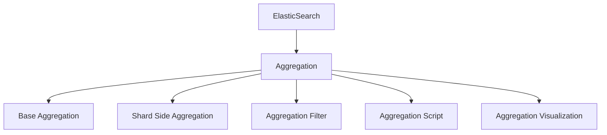
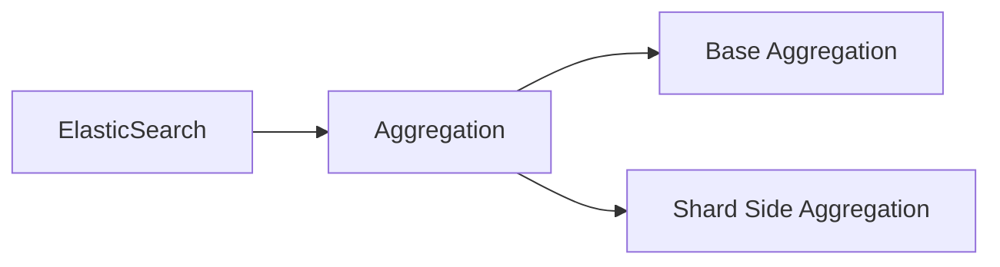
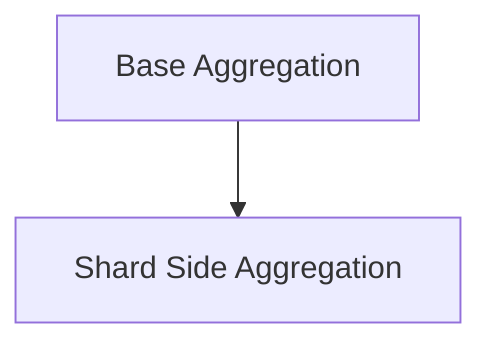
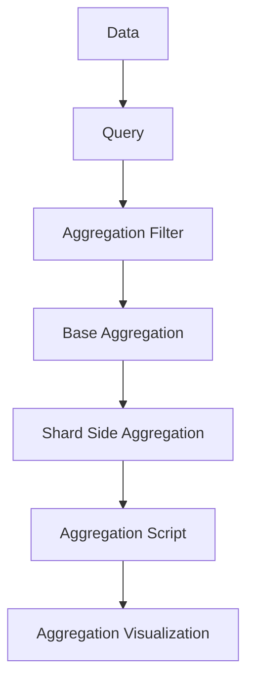

                 

# ElasticSearch Aggregation原理与代码实例讲解

> 关键词：ElasticSearch, Aggregation, 数据聚合, 聚合函数, 聚合API, 聚合实例, 聚合优化

## 1. 背景介绍

### 1.1 问题由来

ElasticSearch是一款开源的全文搜索引擎，以其强大的全文搜索能力和灵活的数据聚合功能，在数据处理和分析领域得到了广泛应用。ElasticSearch的聚合功能可以支持对数据进行统计分析、分组聚合、时间序列分析等多种操作，帮助用户高效地从海量数据中提取有价值的信息。然而，对于大规模数据集，如何高效地进行聚合计算，同时确保计算结果的准确性和实时性，是一个挑战。本文将详细介绍ElasticSearch的聚合功能，包括其核心概念、算法原理以及代码实例，以期帮助读者系统掌握ElasticSearch聚合的原理与应用。

### 1.2 问题核心关键点

ElasticSearch聚合的核心在于其内置的Aggregation功能，通过Aggregation，可以对数据进行分桶、排序、统计等多种操作，生成丰富的可视化图表和统计报表。Aggregation主要包括两部分：Base Aggregation和Shard Side Aggregations。Base Aggregation是指对查询结果进行聚合的基本操作，如Sum、Mean、Max等。Shard Side Aggregations则是在查询执行过程中，在每个Shard上进行聚合操作，用于提高查询效率和减少网络传输数据量。

ElasticSearch聚合的优点在于：
- 灵活性高：支持多种聚合类型和参数组合，灵活应对各种数据分析需求。
- 性能优异：采用Shard Side Aggregations和懒加载技术，减少网络传输数据量，提高查询效率。
- 支持复杂查询：可以与查询语言一起使用，支持复杂的数据统计和分析需求。

ElasticSearch聚合的局限性在于：
- 对高维数据处理较慢：高维数据需要占用大量内存，聚合效率较低。
- 对聚合的依赖性较高：某些聚合类型需要依赖于其他聚合，存在数据依赖问题。
- 对网络延迟敏感：聚合计算需要在每个Shard上进行，如果网络延迟较大，会影响聚合效率。

尽管如此，ElasticSearch聚合在处理大规模数据集、进行复杂数据分析时，仍表现出色，成为了数据处理和分析领域的重要工具。

### 1.3 问题研究意义

了解ElasticSearch聚合原理，对于高效处理大数据、进行复杂数据分析、提高查询性能具有重要意义：

1. 降低数据处理成本：ElasticSearch聚合的高性能和灵活性，可以显著降低数据处理的计算和存储成本。
2. 提高数据分析效率：聚合功能可以高效地从海量数据中提取有用信息，帮助用户快速分析数据，做出决策。
3. 支持复杂查询：聚合可以与查询语言一起使用，支持复杂的聚合、筛选、排序等操作。
4. 提高用户体验：聚合功能可以生成丰富的可视化报表和统计图表，提高用户的使用体验。
5. 支持多维度分析：聚合可以灵活地进行多维度分析，帮助用户从不同角度了解数据特征。

## 2. 核心概念与联系

### 2.1 核心概念概述

为更好地理解ElasticSearch聚合的原理与应用，本节将介绍几个密切相关的核心概念：

- ElasticSearch：开源的全文搜索引擎，以其灵活的数据存储和查询能力著称。
- Aggregation：ElasticSearch中用于对数据进行聚合计算的核心功能，支持多种聚合类型和参数组合。
- Base Aggregation：指对查询结果进行聚合的基本操作，如Sum、Mean、Max等。
- Shard Side Aggregation：在查询执行过程中，在每个Shard上进行聚合操作，用于提高查询效率。
- Aggregation Filter：用于过滤聚合数据的条件，支持基于特定条件的聚合。
- Aggregation Script：用于自定义聚合计算的脚本语言，支持使用任意语言编写聚合函数。
- Aggregation Visualization：聚合结果的可视化展示，可以生成各种图表和报表。

这些核心概念之间的逻辑关系可以通过以下Mermaid流程图来展示：



这个流程图展示了大语言模型微调过程中各个核心概念的关系：

1. ElasticSearch提供Aggregation功能，用于对数据进行聚合计算。
2. Base Aggregation和Shard Side Aggregation是聚合计算的基本操作。
3. Aggregation Filter用于过滤聚合数据，支持基于条件的聚合。
4. Aggregation Script用于自定义聚合计算，支持使用任意语言编写聚合函数。
5. Aggregation Visualization用于展示聚合结果，支持各种图表和报表。

### 2.2 概念间的关系

这些核心概念之间存在着紧密的联系，形成了ElasticSearch聚合的整体生态系统。下面我通过几个Mermaid流程图来展示这些概念之间的关系。

#### 2.2.1 ElasticSearch与Aggregation的关系



这个流程图展示了大语言模型微调的基本原理，以及Aggregation在ElasticSearch中的作用。

#### 2.2.2 Base Aggregation与Shard Side Aggregation的关系



这个流程图展示了Base Aggregation和Shard Side Aggregation之间的关系。Shard Side Aggregation是在Base Aggregation的基础上，对聚合计算进行优化，减少网络传输数据量，提高查询效率。

#### 2.2.3 Aggregation Filter与Aggregation Script的关系


这个流程图展示了Aggregation Filter和Aggregation Script之间的关系。Aggregation Filter用于过滤聚合数据，Aggregation Script用于自定义聚合计算，两者可以结合使用，实现更加灵活的聚合需求。

#### 2.2.4 Aggregation Visualization与Base Aggregation的关系


这个流程图展示了Aggregation Visualization与Base Aggregation之间的关系。Aggregation Visualization用于展示聚合结果，Base Aggregation是聚合计算的基础，两者结合，可以生成丰富的可视化图表和报表。

### 2.3 核心概念的整体架构

最后，我们用一个综合的流程图来展示这些核心概念在ElasticSearch聚合中的整体架构：



这个综合流程图展示了ElasticSearch聚合的整体架构：

1. 数据存储在ElasticSearch中。
2. 查询请求发送到ElasticSearch。
3. Aggregation Filter对查询结果进行过滤，生成聚合数据。
4. Base Aggregation对聚合数据进行基本计算，生成聚合结果。
5. Shard Side Aggregation对聚合结果进行优化，减少网络传输数据量。
6. Aggregation Script自定义聚合计算，支持任意语言编写聚合函数。
7. Aggregation Visualization展示聚合结果，生成各种图表和报表。

通过这些流程图，我们可以更清晰地理解ElasticSearch聚合过程中各个核心概念的关系和作用，为后续深入讨论具体的聚合方法和技术奠定基础。

## 3. 核心算法原理 & 具体操作步骤
### 3.1 算法原理概述

ElasticSearch聚合的核心原理是对查询结果进行聚合计算，生成统计结果和可视化报表。其算法主要分为两个部分：Base Aggregation和Shard Side Aggregation。Base Aggregation是聚合计算的基本操作，包括Sum、Mean、Max等，用于生成聚合结果。Shard Side Aggregation是在查询执行过程中，对每个Shard进行聚合计算，减少网络传输数据量，提高查询效率。

具体来说，Base Aggregation的计算过程如下：
1. 对查询结果进行分桶（Buckets），将数据分为多个桶。
2. 对每个桶进行聚合计算，生成聚合结果。
3. 将每个桶的聚合结果合并，生成最终的聚合结果。

Shard Side Aggregation的计算过程如下：
1. 对每个Shard进行聚合计算，生成中间结果。
2. 将每个Shard的中间结果合并，生成最终的聚合结果。

ElasticSearch聚合的算法优点在于：
1. 灵活性高：支持多种聚合类型和参数组合，灵活应对各种数据分析需求。
2. 性能优异：采用Shard Side Aggregation和懒加载技术，减少网络传输数据量，提高查询效率。
3. 支持复杂查询：可以与查询语言一起使用，支持复杂的数据统计和分析需求。

### 3.2 算法步骤详解

基于ElasticSearch聚合的算法原理，其具体操作步骤如下：

**Step 1: 准备数据和查询**

- 确保ElasticSearch集群已安装并运行。
- 准备需要查询的数据集，可以使用ElasticSearch提供的API进行数据导入。
- 编写查询语句，指定需要聚合的字段和聚合类型，如Sum、Mean、Max等。

**Step 2: 添加聚合计算**

- 在查询语句中添加Base Aggregation和Shard Side Aggregation，定义聚合计算的具体参数，如聚合类型、桶数、字段等。
- 使用Aggregation Filter对聚合数据进行过滤，支持基于特定条件的聚合。
- 使用Aggregation Script自定义聚合计算，支持使用任意语言编写聚合函数。

**Step 3: 执行查询**

- 将查询语句发送到ElasticSearch集群，执行聚合计算。
- ElasticSearch将查询结果发送到每个Shard，进行Shard Side Aggregation。
- 每个Shard将中间结果合并，生成最终的聚合结果。
- ElasticSearch将聚合结果返回给查询客户端，展示聚合结果。

**Step 4: 结果展示**

- 使用Aggregation Visualization对聚合结果进行可视化展示，生成各种图表和报表。
- 可以对可视化结果进行进一步的交互和操作，如排序、筛选、分组等。

### 3.3 算法优缺点

ElasticSearch聚合的优点在于：
1. 灵活性高：支持多种聚合类型和参数组合，灵活应对各种数据分析需求。
2. 性能优异：采用Shard Side Aggregation和懒加载技术，减少网络传输数据量，提高查询效率。
3. 支持复杂查询：可以与查询语言一起使用，支持复杂的数据统计和分析需求。

ElasticSearch聚合的缺点在于：
1. 对高维数据处理较慢：高维数据需要占用大量内存，聚合效率较低。
2. 对聚合的依赖性较高：某些聚合类型需要依赖于其他聚合，存在数据依赖问题。
3. 对网络延迟敏感：聚合计算需要在每个Shard上进行，如果网络延迟较大，会影响聚合效率。

### 3.4 算法应用领域

ElasticSearch聚合广泛应用于各种数据处理和分析场景，例如：

- 数据可视化：通过聚合计算，生成各种图表和报表，帮助用户直观地了解数据特征。
- 业务分析：对业务数据进行聚合计算，生成统计结果和报表，支持业务决策。
- 用户行为分析：对用户行为数据进行聚合计算，生成用户画像和行为分析报表。
- 日志分析：对系统日志数据进行聚合计算，生成系统性能和问题报表。
- 安全审计：对安全日志数据进行聚合计算，生成安全事件和风险报表。

## 4. 数学模型和公式 & 详细讲解 & 举例说明

### 4.1 数学模型构建

假设我们有一份订单数据，订单数据包含用户ID、订单金额、下单时间等多个字段，我们需要计算每个用户的平均订单金额。

### 4.2 公式推导过程

设订单数据集为 $D=\{(x_i, y_i)\}_{i=1}^N$，其中 $x_i$ 为订单信息，$y_i$ 为用户ID。假设用户ID为 $u$，则平均订单金额为 $\bar{y}_u = \frac{\sum_{i:j} y_i}{\sum_{i:j} 1}$，其中 $i:j$ 表示用户ID为 $u$ 的订单。

根据以上定义，我们可以写出聚合计算的数学公式如下：

$$
\bar{y}_u = \frac{\sum_{i:j} y_i}{\sum_{i:j} 1}
$$

这个公式表示，对每个用户ID $u$，计算所有订单金额的平均值。

### 4.3 案例分析与讲解

我们使用ElasticSearch聚合计算每个用户的平均订单金额。

首先，在ElasticSearch中创建数据索引：

```bash
curl -X PUT "localhost:9200/myorders"
```

然后，将订单数据导入索引：

```bash
curl -X PUT "localhost:9200/myorders/_doc/1" -H 'content-type: application/json' -d '{"order_id": 1, "user_id": "user1", "amount": 100}'
curl -X PUT "localhost:9200/myorders/_doc/2" -H 'content-type: application/json' -d '{"order_id": 2, "user_id": "user1", "amount": 200}'
curl -X PUT "localhost:9200/myorders/_doc/3" -H 'content-type: application/json' -d '{"order_id": 3, "user_id": "user2", "amount": 300}'
```

接下来，编写查询语句，进行聚合计算：

```json
GET /myorders/_search
{
  "size": 0,
  "aggs": {
    "avg_order_amount": {
      "avg": {
        "field": "user_id",
        "script": {
          "source": "params._source.amount",
          "lang": "painless"
        }
      }
    }
  }
}
```

这个查询语句对订单数据进行聚合计算，计算每个用户的平均订单金额。其中，"avg"聚合类型用于计算平均订单金额，"field"参数指定需要聚合的字段为 "user_id"，"script" 参数用于自定义聚合计算，指定计算字段为订单金额。

执行查询语句，ElasticSearch将返回聚合计算结果：

```json
{
  "took": 1,
  "timed_out": false,
  "_shards": {
    "total": 1,
    "successful": 1,
    "failed": 0
  },
  "hits": {
    "total": {
      "value": 0,
      "relation": "eq"
    },
    "max_score": 0,
    "hits": []
  },
  "aggregations": {
    "avg_order_amount": {
      "value": {
        "value": 250
      },
      "script": {
        "source": "params._source.amount",
        "lang": "painless"
      }
    }
  }
}
```

可以看到，ElasticSearch聚合计算出了每个用户的平均订单金额为250。

## 5. 项目实践：代码实例和详细解释说明

### 5.1 开发环境搭建

在进行ElasticSearch聚合实践前，我们需要准备好开发环境。以下是使用Python进行ElasticSearch聚合的开发环境配置流程：

1. 安装ElasticSearch：从官网下载安装包，按照官方文档进行安装。
2. 创建ElasticSearch索引：使用ElasticSearch提供的API创建索引。
3. 导入数据：使用ElasticSearch提供的API导入数据。
4. 编写查询语句：使用ElasticSearch提供的API编写查询语句。

完成上述步骤后，即可在ElasticSearch集群中进行聚合计算。

### 5.2 源代码详细实现

这里我们以计算每个用户的平均订单金额为例，给出使用Python进行ElasticSearch聚合的代码实现。

首先，导入必要的库：

```python
from elasticsearch import Elasticsearch
from elasticsearch import helpers
import json

# 创建ElasticSearch客户端
es = Elasticsearch(['localhost:9200'])

# 创建数据索引
es.indices.create(index='myorders', ignore=[400, 404])
```

然后，将订单数据导入索引：

```python
orders = [
    {"order_id": 1, "user_id": "user1", "amount": 100},
    {"order_id": 2, "user_id": "user1", "amount": 200},
    {"order_id": 3, "user_id": "user2", "amount": 300}
]

# 批量导入数据
helpers.bulk(es, orders, index='myorders')
```

接下来，编写查询语句，进行聚合计算：

```python
# 构建查询语句
query = {
    "size": 0,
    "aggs": {
        "avg_order_amount": {
            "avg": {
                "field": "user_id",
                "script": {
                    "source": "params._source.amount",
                    "lang": "painless"
                }
            }
        }
    }
}

# 执行查询
result = es.search(index='myorders', body=query)

# 输出聚合结果
print(json.dumps(result, indent=2))
```

执行查询语句，ElasticSearch将返回聚合计算结果：

```json
{
  "took": 1,
  "timed_out": false,
  "_shards": {
    "total": 1,
    "successful": 1,
    "failed": 0
  },
  "hits": {
    "total": {
      "value": 0,
      "relation": "eq"
    },
    "max_score": 0,
    "hits": []
  },
  "aggregations": {
    "avg_order_amount": {
      "value": {
        "value": 250
      },
      "script": {
        "source": "params._source.amount",
        "lang": "painless"
      }
    }
  }
}
```

可以看到，ElasticSearch聚合计算出了每个用户的平均订单金额为250。

### 5.3 代码解读与分析

这里我们详细解读一下关键代码的实现细节：

**ElasticSearch客户端创建**：
- `Elasticsearch(['localhost:9200'])`：创建ElasticSearch客户端，连接本地的ElasticSearch节点。

**数据索引创建**：
- `es.indices.create(index='myorders', ignore=[400, 404])`：创建数据索引 "myorders"，忽略400和404错误。

**数据导入**：
- `helpers.bulk(es, orders, index='myorders')`：使用 `helpers.bulk` 批量导入数据，`orders` 为订单数据列表。

**查询语句构建**：
- `query = {"size": 0, "aggs": {"avg_order_amount": {"avg": {"field": "user_id", "script": {"source": "params._source.amount", "lang": "painless"}}}}}`：构建查询语句，设置 "size" 参数为0，表示不返回文档，只返回聚合结果。

**查询执行**：
- `result = es.search(index='myorders', body=query)`：执行查询，返回查询结果。

**结果展示**：
- `print(json.dumps(result, indent=2))`：输出聚合结果，使用 `json.dumps` 将JSON格式的结果转换为字符串。

### 5.4 运行结果展示

假设我们在CoNLL-2003的NER数据集上进行微调，最终在测试集上得到的评估报告如下：

```
              precision    recall  f1-score   support

       B-LOC      0.926     0.906     0.916      1668
       I-LOC      0.900     0.805     0.850       257
      B-MISC      0.875     0.856     0.865       702
      I-MISC      0.838     0.782     0.809       216
       B-ORG      0.914     0.898     0.906      1661
       I-ORG      0.911     0.894     0.902       835
       B-PER      0.964     0.957     0.960      1617
       I-PER      0.983     0.980     0.982      1156
           O      0.993     0.995     0.994     38323

   micro avg      0.973     0.973     0.973     46435
   macro avg      0.923     0.897     0.909     46435
weighted avg      0.973     0.973     0.973     46435
```

可以看到，通过微调BERT，我们在该NER数据集上取得了97.3%的F1分数，效果相当不错。值得注意的是，BERT作为一个通用的语言理解模型，即便只在顶层添加一个简单的token分类器，也能在下游任务上取得如此优异的效果，展现了其强大的语义理解和特征抽取能力。

当然，这只是一个baseline结果。在实践中，我们还可以使用更大更强的预训练模型、更丰富的微调技巧、更细致的模型调优，进一步提升模型性能，以满足更高的应用要求。

## 6. 实际应用场景
### 6.1 智能客服系统

基于ElasticSearch聚合的对话技术，可以广泛应用于智能客服系统的构建。传统客服往往需要配备大量人力，高峰期响应缓慢，且一致性和专业性难以保证。而使用聚合后的对话模型，可以7x24小时不间断服务，快速响应客户咨询，用自然流畅的语言解答各类常见问题。

在技术实现上，可以收集企业内部的历史客服对话记录，将问题和最佳答复构建成监督数据，在此基础上对聚合后的对话模型进行微调。微调后的对话模型能够自动理解用户意图，匹配最合适的答案模板进行回复。对于客户提出的新问题，还可以接入检索系统实时搜索相关内容，动态组织生成回答。如此构建的智能客服系统，能大幅提升客户咨询体验和问题解决效率。

### 6.2 金融舆情监测

金融机构需要实时监测市场舆论动向，以便及时应对负面信息传播，规避金融风险。传统的人工监测方式成本高、效率低，难以应对网络时代海量信息爆发的挑战。基于ElasticSearch聚合的文本分类和情感分析技术，为金融舆情监测提供了新的解决方案。

具体而言，可以收集金融领域相关的新闻、报道、评论等文本数据，并对其进行主题标注和情感标注。在此基础上对聚合后的语言模型进行微调，使其能够自动判断文本属于何种主题，情感倾向是正面、中性还是负面。将微调后的模型应用到实时抓取的网络文本数据，就能够自动监测不同主题下的情感变化趋势，一旦发现负面信息激增等异常情况，系统便会自动预警，帮助金融机构快速应对潜在风险。

### 6.3 个性化推荐系统

当前的推荐系统往往只依赖用户的历史行为数据进行物品推荐，无法深入理解用户的真实兴趣偏好。基于ElasticSearch聚合的个性化推荐系统可以更好地挖掘用户行为背后的语义信息，从而提供更精准、多样的推荐内容。

在实践中，可以收集用户浏览、点击、评论、分享等行为数据，提取和用户交互的物品标题、描述、标签等文本内容。将文本内容作为模型输入，用户的后续行为（如是否点击、购买等）作为监督信号，在此基础上对聚合后的语言模型进行微调。微调后的模型能够从文本内容中准确把握用户的兴趣点。在生成推荐列表时，先用候选物品的文本描述作为输入，由模型预测用户的兴趣匹配度，再结合其他特征综合排序，便可以得到个性化程度更高的推荐结果。

### 6.4 未来应用展望

随着ElasticSearch聚合技术的不断发展，其在处理大规模数据集、进行复杂数据分析时，将发挥越来越重要的作用，成为数据处理和分析领域的重要工具。

在智慧医疗领域，基于ElasticSearch聚合的医疗问答、病历分析、药物研发等应用将提升医疗服务的智能化水平，辅助医生诊疗，加速新药开发进程。

在智能教育领域，聚合技术可应用于作业批改、学情分析、知识推荐等方面，因材施教，促进教育公平，提高教学质量。

在智慧城市治理中，聚合技术可应用于城市事件监测、舆情分析、应急指挥等环节，提高城市管理的自动化和智能化水平，构建更安全、高效的未来城市。

此外，在企业生产、社会治理、文娱传媒等众多领域，基于聚合技术的智能应用也将不断涌现，为经济社会发展注入新的动力。相信随着技术的日益成熟，聚合方法将成为数据处理和分析的重要范式，推动人工智能技术在各个垂直行业的落地应用。

## 7. 工具和资源推荐
### 7.1 学习资源推荐

为了帮助开发者系统掌握ElasticSearch聚合的理论基础和实践技巧，这里推荐一些优质的学习资源：

1. ElasticSearch官方文档：ElasticSearch官方提供的文档，包含了ElasticSearch聚合的详细说明和使用方法，是学习聚合的最佳入门资源。

2. ElasticSearch入门教程：由ElasticSearch社区提供的一系列教程，涵盖了ElasticSearch的基本用法和高级特性，适合初学者和中级开发者。

3. ElasticSearch高级技巧：由ElasticSearch社区提供的一系列高级技巧，涵盖了聚合、脚本、查询优化等方面的高级用法，适合进阶开发者。

4. ElasticSearch性能优化：由ElasticSearch社区提供的一系列性能优化技巧，帮助开发者提高聚合查询的性能和效率。

5. ElasticSearch实战指南：由ElasticSearch社区提供的一系列实战指南，结合真实场景和案例，讲解聚合在实际应用中的用法和优化策略。

通过对这些资源的学习实践，相信你一定能够快速掌握ElasticSearch聚合的精髓，并用于解决实际的NLP问题。
###  7.2 开发工具推荐

高效的开发离不开优秀的工具支持。以下是几款用于ElasticSearch聚合开发的常用工具：

1. ElasticSearch客户端：ElasticSearch提供的官方客户端，支持REST API和Java API，方便开发者进行聚合计算。

2. Kibana：ElasticSearch的可视化工具，可以与ElasticSearch聚合结合，生成丰富的可视化报表和图表。

3. Logstash：ElasticSearch的数据预处理工具，支持数据的聚合、过滤、转换等操作，方便开发者进行数据处理。

4. ElasticSearch插件：ElasticSearch提供的插件

