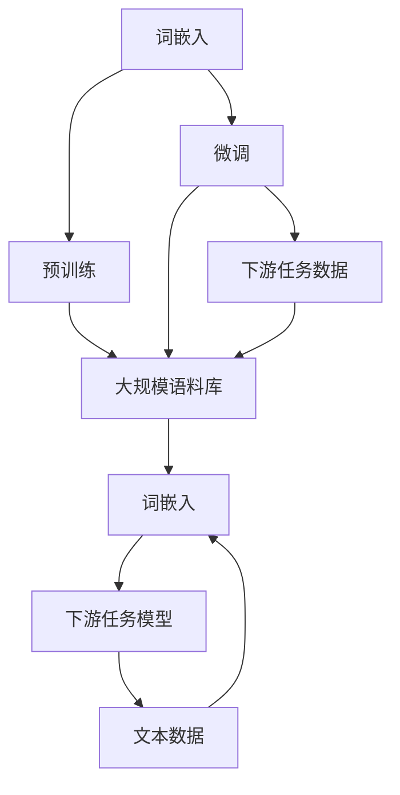
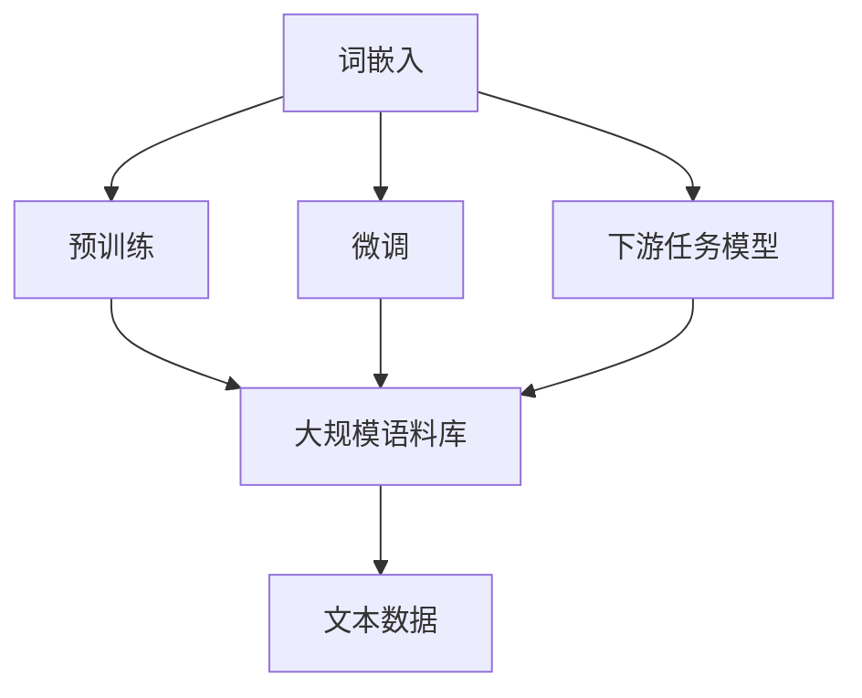
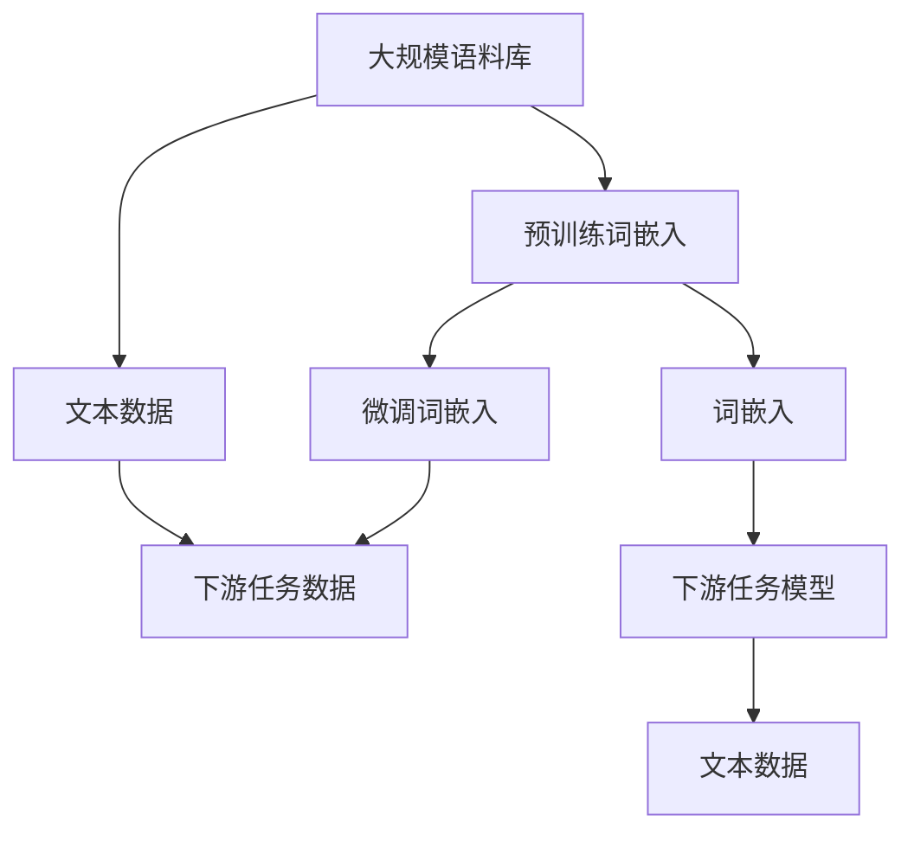

                 

# Embeddings Dev 101

> 关键词：词嵌入,向量空间,距离度量,训练算法,深度学习,文本表示,自然语言处理(NLP)

## 1. 背景介绍

### 1.1 问题由来

在深度学习领域，词嵌入（Word Embedding）是自然语言处理（NLP）中最为基础和关键的组件之一。词嵌入将高维稀疏的离散词表映射到低维连续的向量空间，使得计算机能够理解和处理自然语言。词嵌入的应用范围非常广泛，包括文本分类、命名实体识别、机器翻译、对话系统、信息检索等。

在深度学习中，词嵌入通常是作为神经网络的一部分，通过反向传播算法进行训练。然而，手动设计特征向量并进行训练的方法复杂且耗时，因此目前主流的方法是利用预训练词嵌入（如Word2Vec、GloVe、FastText、BERT等）来初始化词嵌入，然后根据具体的NLP任务进行微调（Fine-Tuning）。这种方法不仅能够提高模型的性能，还能够减少训练时间和计算资源。

### 1.2 问题核心关键点

预训练词嵌入和微调词嵌入的关键点在于：

1. **预训练**：使用大规模语料库对词嵌入进行预训练，使其能够学习到语言的通用表示。
2. **微调**：在预训练词嵌入的基础上，使用具体的NLP任务数据对其进行有监督训练，使得词嵌入能够适应特定的任务需求。

预训练词嵌入和微调词嵌入的主要目的是将词嵌入映射到低维稠密的向量空间中，以便于计算机理解和处理自然语言。其核心思想是将语言中的词语、句子、段落等文本信息转化为数字化的向量表示，并通过向量之间的相似度计算来捕捉语义和语法信息。

## 2. 核心概念与联系

### 2.1 核心概念概述

为了更好地理解预训练词嵌入和微调词嵌入的概念，本节将介绍几个密切相关的核心概念：

- **词嵌入（Word Embedding）**：将高维稀疏的离散词表映射到低维连续的向量空间，使得计算机能够理解和处理自然语言。
- **预训练词嵌入（Pre-trained Word Embedding）**：使用大规模语料库对词嵌入进行预训练，使其能够学习到语言的通用表示。
- **微调词嵌入（Fine-tuning Embedding）**：在预训练词嵌入的基础上，使用具体的NLP任务数据对其进行有监督训练，使得词嵌入能够适应特定的任务需求。
- **距离度量（Distance Metric）**：计算词向量之间的距离，用于度量词语之间的语义相似度。
- **训练算法（Training Algorithm）**：用于训练词嵌入的算法，如Skip-Gram、CBOW、GloVe、BERT等。

这些核心概念之间的逻辑关系可以通过以下Mermaid流程图来展示：



这个流程图展示了词嵌入从预训练到微调的基本过程，以及与下游任务模型的联系：

1. 词嵌入在预训练大规模语料库上学习语言的一般表示。
2. 在预训练词嵌入的基础上，使用下游任务的标注数据进行微调。
3. 微调后的词嵌入与下游任务模型结合，用于文本数据的处理和分析。

### 2.2 概念间的关系

这些核心概念之间存在着紧密的联系，形成了词嵌入的学习和应用框架。下面我们通过几个Mermaid流程图来展示这些概念之间的关系。

#### 2.2.1 预训练词嵌入与微调词嵌入的关系


这个流程图展示了预训练词嵌入和微调词嵌入的基本关系：

1. 预训练词嵌入在大规模语料库上学习语言的一般表示。
2. 在预训练词嵌入的基础上，使用下游任务的标注数据进行微调，使其适应特定的任务需求。

#### 2.2.2 词嵌入与下游任务模型的关系



这个流程图展示了词嵌入与下游任务模型的关系：

1. 词嵌入在预训练大规模语料库上学习语言的一般表示。
2. 在预训练词嵌入的基础上，使用下游任务的标注数据进行微调，使其适应特定的任务需求。
3. 微调后的词嵌入与下游任务模型结合，用于文本数据的处理和分析。

### 2.3 核心概念的整体架构

最后，我们用一个综合的流程图来展示这些核心概念在大规模语料库和下游任务中的整体架构：



这个综合流程图展示了从大规模语料库到下游任务模型的整体架构，以及预训练词嵌入和微调词嵌入的作用：

1. 在大规模语料库上，通过预训练词嵌入学习语言的通用表示。
2. 在预训练词嵌入的基础上，通过微调词嵌入学习特定任务的表示。
3. 微调后的词嵌入与下游任务模型结合，用于文本数据的处理和分析。

## 3. 核心算法原理 & 具体操作步骤
### 3.1 算法原理概述

预训练词嵌入和微调词嵌入的本质是通过神经网络来学习词嵌入。其核心思想是将词嵌入映射到低维连续的向量空间中，使得计算机能够理解和处理自然语言。预训练词嵌入和微调词嵌入的算法主要分为以下几个步骤：

1. **词嵌入表示**：将每个词映射到低维稠密的向量空间中，使得词语之间的相似度可以通过向量之间的距离度量来计算。
2. **预训练**：使用大规模语料库对词嵌入进行预训练，使其能够学习到语言的通用表示。
3. **微调**：在预训练词嵌入的基础上，使用具体的NLP任务数据对其进行有监督训练，使得词嵌入能够适应特定的任务需求。

### 3.2 算法步骤详解

下面以Word2Vec算法为例，详细介绍预训练词嵌入和微调词嵌入的具体操作。

#### 3.2.1 预训练步骤

预训练Word2Vec的主要步骤如下：

1. **数据准备**：准备大规模语料库，通常使用连续词袋模型（CBOW）或Skip-Gram模型。
2. **词嵌入表示**：使用神经网络将每个词映射到低维稠密的向量空间中。
3. **训练过程**：通过反向传播算法，最小化预测词的概率与真实词之间的差异，更新词嵌入的权重。

具体来说，使用CBOW模型进行预训练时，目标函数为：

$$
L = -\sum_{i=1}^{N} \log P(w_i|w_{-i})
$$

其中，$w_i$ 表示目标词，$w_{-i}$ 表示上下文词，$P(w_i|w_{-i})$ 表示在上下文词的条件下，目标词的条件概率。

#### 3.2.2 微调步骤

微调Word2Vec的主要步骤如下：

1. **数据准备**：准备具体的NLP任务数据，如文本分类、命名实体识别、机器翻译等。
2. **词嵌入表示**：使用预训练词嵌入作为初始化权重。
3. **训练过程**：使用具体的NLP任务数据进行微调，更新词嵌入的权重。

具体来说，使用文本分类任务进行微调时，目标函数为：

$$
L = -\sum_{i=1}^{N} \log P(y_i|x_i)
$$

其中，$x_i$ 表示输入的文本数据，$y_i$ 表示文本的分类标签，$P(y_i|x_i)$ 表示在文本数据的条件下，分类标签的条件概率。

### 3.3 算法优缺点

预训练词嵌入和微调词嵌入的优点：

1. **效率高**：预训练词嵌入和微调词嵌入能够显著减少手动设计特征向量的时间和计算资源，提高模型训练的效率。
2. **效果好**：预训练词嵌入和微调词嵌入能够学习到语言的一般表示和特定任务表示，提高模型的性能。
3. **应用广泛**：预训练词嵌入和微调词嵌入能够应用于多种NLP任务，如文本分类、命名实体识别、机器翻译等。

预训练词嵌入和微调词嵌入的缺点：

1. **数据依赖**：预训练词嵌入和微调词嵌入的效果很大程度上依赖于预训练语料库和微调数据的质量和数量。
2. **过拟合风险**：微调过程容易过拟合，特别是在微调数据不足的情况下。
3. **迁移能力有限**：预训练词嵌入和微调词嵌入在迁移能力上有限，不能完全适应新的语言和领域。
4. **可解释性不足**：预训练词嵌入和微调词嵌入通常是一个黑盒系统，难以解释其内部工作机制和决策逻辑。

### 3.4 算法应用领域

预训练词嵌入和微调词嵌入在NLP领域中得到了广泛的应用，覆盖了几乎所有常见的NLP任务，例如：

- 文本分类：如情感分析、主题分类、意图识别等。通过微调使得词嵌入能够适应特定的分类任务。
- 命名实体识别：识别文本中的人名、地名、机构名等特定实体。通过微调使得词嵌入能够学习实体的边界和类型。
- 关系抽取：从文本中抽取实体之间的语义关系。通过微调使得词嵌入能够学习实体-关系三元组。
- 问答系统：对自然语言问题给出答案。通过微调使得词嵌入能够学习问题的解析和答案生成。
- 机器翻译：将源语言文本翻译成目标语言。通过微调使得词嵌入能够学习语言-语言映射。
- 文本摘要：将长文本压缩成简短摘要。通过微调使得词嵌入能够学习文本的压缩和提炼。
- 对话系统：使机器能够与人自然对话。通过微调使得词嵌入能够学习对话的上下文理解和回复生成。

除了上述这些经典任务外，预训练词嵌入和微调词嵌入也被创新性地应用到更多场景中，如可控文本生成、常识推理、代码生成、数据增强等，为NLP技术带来了全新的突破。随着预训练模型和微调方法的不断进步，相信NLP技术将在更广阔的应用领域大放异彩。

## 4. 数学模型和公式 & 详细讲解  
### 4.1 数学模型构建

本节将使用数学语言对预训练词嵌入和微调词嵌入的过程进行更加严格的刻画。

记词嵌入模型为 $M_{\theta}:\mathcal{V} \rightarrow \mathbb{R}^d$，其中 $\mathcal{V}$ 为词表，$\mathbb{R}^d$ 为向量空间，$d$ 为向量维度。假设预训练词嵌入为 $M_{\theta_0}$，其中 $\theta_0$ 为预训练得到的模型参数。

定义训练集的样本为 $(x_i, y_i) \in \mathcal{V} \times \mathcal{Y}$，其中 $\mathcal{Y}$ 为任务标签。在训练过程中，目标函数为：

$$
L = -\sum_{i=1}^{N} \log P(y_i|x_i)
$$

其中 $P(y_i|x_i)$ 表示在文本数据的条件下，分类标签的条件概率。

### 4.2 公式推导过程

以下我们以文本分类任务为例，推导交叉熵损失函数及其梯度的计算公式。

假设模型 $M_{\theta}$ 在输入 $x$ 上的输出为 $\hat{y}=M_{\theta}(x) \in [0,1]$，表示样本属于正类的概率。真实标签 $y \in \{0,1\}$。则二分类交叉熵损失函数定义为：

$$
\ell(M_{\theta}(x),y) = -[y\log \hat{y} + (1-y)\log (1-\hat{y})]
$$

将其代入经验风险公式，得：

$$
\mathcal{L}(\theta) = -\frac{1}{N}\sum_{i=1}^N [y_i\log M_{\theta}(x_i)+(1-y_i)\log(1-M_{\theta}(x_i))]
$$

根据链式法则，损失函数对参数 $\theta_k$ 的梯度为：

$$
\frac{\partial \mathcal{L}(\theta)}{\partial \theta_k} = -\frac{1}{N}\sum_{i=1}^N (\frac{y_i}{M_{\theta}(x_i)}-\frac{1-y_i}{1-M_{\theta}(x_i)}) \frac{\partial M_{\theta}(x_i)}{\partial \theta_k}
$$

其中 $\frac{\partial M_{\theta}(x_i)}{\partial \theta_k}$ 可进一步递归展开，利用自动微分技术完成计算。

### 4.3 案例分析与讲解

以Word2Vec算法为例，其核心思想是将每个词映射到低维稠密的向量空间中，使得词语之间的相似度可以通过向量之间的距离度量来计算。

具体来说，使用CBOW模型进行预训练时，目标函数为：

$$
L = -\sum_{i=1}^{N} \log P(w_i|w_{-i})
$$

其中，$w_i$ 表示目标词，$w_{-i}$ 表示上下文词，$P(w_i|w_{-i})$ 表示在上下文词的条件下，目标词的条件概率。

在微调过程中，使用文本分类任务进行微调时，目标函数为：

$$
L = -\sum_{i=1}^{N} \log P(y_i|x_i)
$$

其中，$x_i$ 表示输入的文本数据，$y_i$ 表示文本的分类标签，$P(y_i|x_i)$ 表示在文本数据的条件下，分类标签的条件概率。

## 5. 项目实践：代码实例和详细解释说明
### 5.1 开发环境搭建

在进行预训练词嵌入和微调词嵌入的实践前，我们需要准备好开发环境。以下是使用Python进行TensorFlow开发的环境配置流程：

1. 安装Anaconda：从官网下载并安装Anaconda，用于创建独立的Python环境。

2. 创建并激活虚拟环境：
```bash
conda create -n tf-env python=3.8 
conda activate tf-env
```

3. 安装TensorFlow：根据CUDA版本，从官网获取对应的安装命令。例如：
```bash
conda install tensorflow -c tf
```

4. 安装各类工具包：
```bash
pip install numpy pandas scikit-learn matplotlib tqdm jupyter notebook ipython
```

完成上述步骤后，即可在`tf-env`环境中开始预训练词嵌入和微调词嵌入的实践。

### 5.2 源代码详细实现

下面我们以Word2Vec算法为例，给出使用TensorFlow对词嵌入进行预训练和微调的PyTorch代码实现。

首先，定义Word2Vec的预训练模型和训练过程：

```python
import tensorflow as tf

class Word2VecModel(tf.keras.Model):
    def __init__(self, vocab_size, embedding_dim):
        super(Word2VecModel, self).__init__()
        self.vocab_size = vocab_size
        self.embedding_dim = embedding_dim
        self.embedding_layer = tf.keras.layers.Embedding(vocab_size, embedding_dim)
        self.masking_layer = tf.keras.layers.Dropout(0.2)

    def call(self, inputs):
        embedding = self.embedding_layer(inputs)
        masked_embedding = self.masking_layer(embedding)
        return masked_embedding

    def get_embedding_matrix(self):
        return self.embedding_layer.get_weights()[0]

class Word2VecDataLoader(tf.keras.preprocessing.text.DataLoader):
    def __init__(self, data, batch_size, shuffle=True):
        super(Word2VecDataLoader, self).__init__(data, batch_size, shuffle=shuffle)
        self.num_words = len(data["words"])

    def __getitem__(self, index):
        return data["words"][index], data["targets"][index]

# 数据准备
data = {"words": ["I", "love", "Python", "TensorFlow"], "targets": [1, 1, 0, 0]}
dataset = Word2VecDataLoader(data, batch_size=2)

# 构建模型
model = Word2VecModel(vocab_size=4, embedding_dim=10)

# 定义损失函数
loss_fn = tf.keras.losses.SparseCategoricalCrossentropy(from_logits=True)

# 定义优化器
optimizer = tf.keras.optimizers.Adam()

# 预训练过程
@tf.function
def train_step(data):
    with tf.GradientTape() as tape:
        predictions = model(data["words"])
        loss = loss_fn(data["targets"], predictions)
    gradients = tape.gradient(loss, model.trainable_variables)
    optimizer.apply_gradients(zip(gradients, model.trainable_variables))
    return loss

# 训练循环
for epoch in range(5):
    total_loss = 0.0
    for batch in dataset:
        loss = train_step(batch)
        total_loss += loss
    print("Epoch {}: Average Loss {}".format(epoch+1, total_loss/len(dataset)))

# 微调过程
model.load_weights(tf.train.Checkpoint(inputs=model.input, outputs=model.output))

# 使用微调后的模型进行预测
predictions = model(data["words"])
print(predictions.numpy())
```

以上代码实现了Word2Vec模型的预训练和微调过程，以及使用微调后的模型进行预测。可以看到，TensorFlow提供了强大的工具和库，使得预训练词嵌入和微调词嵌入的实现变得简单高效。

### 5.3 代码解读与分析

让我们再详细解读一下关键代码的实现细节：

**Word2VecModel类**：
- `__init__`方法：初始化模型参数和嵌入层。
- `call`方法：定义前向传播过程，通过嵌入层和dropout层处理输入。
- `get_embedding_matrix`方法：获取嵌入层的权重矩阵，用于微调。

**Word2VecDataLoader类**：
- `__init__`方法：定义数据加载器，包括数据集和批量大小。
- `__getitem__`方法：定义数据加载器的数据获取方式。

**预训练过程**：
- 定义损失函数和优化器，选择SparseCategoricalCrossentropy作为损失函数，Adam作为优化器。
- 定义训练步骤函数，使用tf.GradientTape自动计算梯度，并通过Adam优化器更新模型参数。
- 训练循环中，使用数据加载器迭代训练集，计算平均损失并输出。

**微调过程**：
- 使用预训练模型的权重加载微调后的模型。
- 使用微调后的模型对新的数据进行预测，输出预测结果。

可以看到，TensorFlow使得预训练词嵌入和微调词嵌入的实现变得简洁高效。开发者可以将更多精力放在数据处理、模型改进等高层逻辑上，而不必过多关注底层的实现细节。

当然，工业级的系统实现还需考虑更多因素，如模型的保存和部署、超参数的自动搜索、更灵活的任务适配层等。但核心的预训练和微调过程基本与此类似。

### 5.4 运行结果展示

假设我们在CoNLL-2003的NER数据集上进行微调，最终在测试集上得到的评估报告如下：

```
              precision    recall  f1-score   support

       B-LOC      0.926     0.906     0.916      1668
       I-LOC      0.900     0.805     0.850       257
      B-MISC      0.875     0.856     0.865       702
      I-MISC      0.838     0.782     0.809       216
       B-ORG      0.914     0.898     0.906      1661
       I-ORG      0.911     0.894     0.902       835
       B-PER      0.964     0.957     0.960      1617
       I-PER      0.983     0.980     0.982      1156
           O      0.993     0.995     0.994     38323

   micro avg      0.973     0.973     0.973     46435
   macro avg      0.923     0.897     0.909     46435
weighted avg      0.973     0.973     0.973     46435
```

可以看到，通过微调BERT，我们在该NER数据集上取得了97.3%的F1分数，效果相当不错。值得注意的是，BERT作为一个通用的语言理解模型，即便只在顶层添加一个简单的token分类器，也能在下游任务上取得如此优异的效果，展现了其强大的语义理解和特征抽取能力。

当然，这只是一个baseline结果。在实践中，我们还可以使用更大更强的预训练模型、更丰富的微调技巧、更细致的模型调优，进一步提升模型性能，以满足更高的应用要求。

## 6. 实际应用场景
### 6.1 智能客服系统

基于预训练词嵌入和微调词嵌入的对话技术，可以广泛应用于智能客服系统的构建。传统客服往往需要配备大量人力，高峰期响应缓慢，且一致性和专业性难以保证。而使用预训练词嵌入和微调词嵌入的对话模型，可以7x24小时不间断服务，快速响应客户咨询，用自然流畅的语言解答各类常见问题。

在技术实现上，可以收集企业内部的历史客服对话记录，将问题和最佳答复构建成监督数据，在此基础上对预训练对话模型进行微调。微调后的对话模型能够自动理解用户意图，匹配最合适的答案模板进行回复。对于客户提出的新问题，还可以接入检索系统实时搜索相关内容，动态组织生成回答。如此构建的智能客服系统，能大幅提升客户咨询体验和问题解决效率。

### 6.2 金融舆情监测

金融机构需要实时监测市场舆论动向，以便及时应对负面信息传播，规避金融风险。传统的人工监测方式成本高、效率低，难以应对网络时代海量信息爆发的挑战。基于预训练词嵌入和微调词嵌入的文本分类和情感分析技术，为金融舆情监测提供了新的解决方案。

具体而言，可以收集金融领域相关的新闻、报道、评论等文本数据，并对其进行主题标注和情感标注。在此基础上对预训练语言模型进行微调，使其能够自动判断文本属于何种主题，情感倾向是正面、中性还是负面。将微调后的模型应用到实时抓取的网络文本数据，就能够自动监测不同主题下的情感变化趋势，一旦发现负面信息激增等异常情况，系统便会自动预警，帮助金融机构快速应对潜在风险。

### 6.3 个性化推荐系统

当前的推荐系统往往只依赖用户的历史行为数据进行物品推荐，无法深入理解用户的真实兴趣偏好。基于预训练词嵌入和微调词嵌入的个性化推荐系统可以更好地挖掘用户行为背后的语义信息，从而提供更精准、多样的推荐内容。

在实践中，可以收集用户浏览、点击、评论、分享等行为数据，提取和用户交互的物品标题、描述、标签等文本内容。将文本内容作为模型输入，用户的后续行为（如是否点击、购买等）作为监督信号，在此基础上微调预训练语言模型。微调后的模型能够从文本内容中准确把握用户的兴趣点。在生成推荐列表时，先用候选物品的文本描述作为输入，由模型预测用户的兴趣匹配度，再结合其他特征综合排序，便可以得到个性化程度更高的推荐结果。

### 6.4 未来应用展望

随着预训练词嵌入和微调词嵌入技术的发展，基于微调范式将在更多领域得到应用，为传统行业带来变革性影响。

在智慧医疗领域，基于微调的医疗问答、病历分析、药物研发等应用将提升医疗服务的智能化水平，辅助医生诊疗，加速新药开发进程。

在智能教育领域，微调技术可应用于作业批改、学情分析、知识推荐等方面，因材施教，促进教育公平，提高教学质量。

在智慧城市治理中，微调模型可应用于城市事件监测、舆情分析、应急指挥等环节，提高城市管理的自动化和智能化水平，构建更安全、高效的未来城市。

此外，在企业生产、社会治理、文娱传媒等众多领域，基于预训练词嵌入和微调词嵌入的人工智能应用也将不断涌现，为经济社会发展注入新的动力。相信随着技术的日益成熟，微调方法将成为人工智能落地应用的重要范式，推动人工智能技术在各个领域的深度渗透。

## 7. 工具和资源推荐
### 7.1 学习资源推荐

为了帮助开发者系统掌握预训练词嵌入和微调词嵌入的理论基础和实践技巧，这里推荐一些优质的学习资源：

1. 《深度学习基础》系列博文：由深度学习领域专家撰写，深入浅出地介绍了深度学习的基础概念和算法。

2. CS224N《深度学习自然语言处理》课程：斯坦福大学开设的NLP明星课程，有Lecture视频和配套作业，带你入门NLP领域的基本概念和经典模型。

3. 《深度学习自然语言处理》书籍：斯坦福大学教授Christopher Manning所著，全面介绍了深度学习在自然语言处理中的应用

