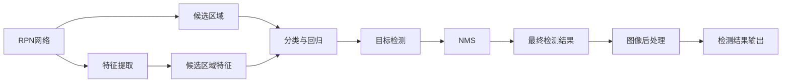
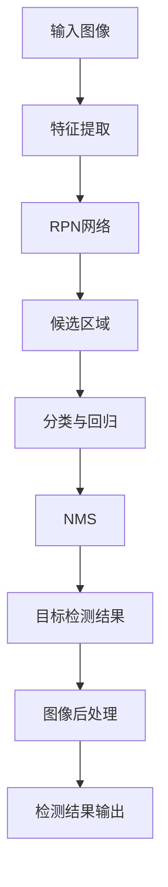

                 

# Faster R-CNN原理与代码实例讲解

> 关键词：Faster R-CNN, 目标检测, 深度学习, 计算机视觉, 卷积神经网络, 非极大值抑制(NMS), 代码实现

## 1. 背景介绍

### 1.1 问题由来
目标检测是计算机视觉领域的一个重要研究方向，旨在识别并定位图像中的对象。传统的目标检测方法包括Haar级联分类器、HOG+SVM等，但由于其特征工程复杂、计算效率低下，难以满足实时性和准确性的双重需求。近年来，基于深度学习的方法，如R-CNN、Fast R-CNN、Faster R-CNN等，显著提升了目标检测的性能。其中，Faster R-CNN作为一类基于深度神经网络的检测方法，因其速度和精度并重，成为目标检测领域的经典方案之一。

### 1.2 问题核心关键点
Faster R-CNN的核心思想是使用Region Proposal Network（RPN）来生成候选区域（Region Proposals），然后对每个候选区域进行分类和回归。该方法通过结合RPN和Fast R-CNN的双阶段检测策略，实现了在保持高精度的同时，显著提升检测速度，从而解决了传统目标检测方法的瓶颈。

### 1.3 问题研究意义
Faster R-CNN的研究对于目标检测技术的发展具有重要意义：

1. 提升检测速度：相较于传统的R-CNN方法，Faster R-CNN使用区域生成网络(RPN)生成候选区域，极大地减少了后续分类和回归的次数，提高了检测速度。
2. 提高检测精度：通过结合双阶段检测策略，Faster R-CNN可以同时进行目标检测和精确定位，提升检测精度。
3. 扩展性强：Faster R-CNN可以作为深度学习目标检测框架，用于不同类型的任务，如实例分割、姿态估计等，具有广泛的应用前景。
4. 开源共享：Faster R-CNN的源代码和模型预训练权重公开，方便研究者和开发者使用和改进，推动了目标检测技术的普及和应用。

## 2. 核心概念与联系

### 2.1 核心概念概述

为了更好地理解Faster R-CNN，我们需要先了解以下几个核心概念：

- 目标检测：计算机视觉领域的一项重要任务，旨在识别并定位图像中的对象。
- Region Proposal Network（RPN）：一种神经网络架构，用于生成候选区域。
- 双阶段检测：先通过RPN生成候选区域，然后对每个候选区域进行分类和回归的策略。
- 非极大值抑制（NMS）：用于消除冗余的候选区域，保留得分最高的区域。
- 锚点（Anchor）：在特征图上均匀分布的小框，用于生成候选区域。
- 区域池化（RoI Pooling）：对候选区域进行池化操作，提取特征。

这些概念之间存在密切的联系，构成了Faster R-CNN的核心工作原理。以下是一个Mermaid流程图，展示了Faster R-CNN的核心工作流程：


这个流程图展示了从输入图像到检测结果的完整流程：首先通过RPN生成候选区域，然后对每个候选区域进行分类和回归，最后通过NMS消除冗余的区域，输出检测结果。

### 2.2 概念间的关系

这些核心概念之间存在紧密的联系，形成了Faster R-CNN的完整生态系统。以下是一个Mermaid流程图，展示了这些概念之间的关系：



这个流程图展示了RPN网络、候选区域、分类与回归、非极大值抑制、目标检测、特征提取、图像后处理和检测结果输出之间的联系。

### 2.3 核心概念的整体架构

最后，我们用一个综合的流程图来展示Faster R-CNN的核心概念在大规模目标检测系统中的整体架构：



这个流程图展示了从输入图像到最终检测结果的完整流程，包括特征提取、RPN网络、候选区域、分类与回归、非极大值抑制、目标检测结果、图像后处理和检测结果输出。

## 3. 核心算法原理 & 具体操作步骤
### 3.1 算法原理概述

Faster R-CNN的算法原理可以简要概述如下：

1. 特征提取：首先使用卷积神经网络（CNN）对输入图像进行特征提取，得到高层次的特征图。
2. 候选区域生成：通过RPN网络生成候选区域。
3. 分类与回归：对每个候选区域进行分类（目标/非目标）和回归（坐标调整）。
4. 非极大值抑制：使用NMS算法消除冗余的候选区域。
5. 目标检测：输出最终的检测结果。

### 3.2 算法步骤详解

以下是Faster R-CNN的详细步骤详解：

**Step 1: 特征提取**
- 使用卷积神经网络（CNN）对输入图像进行特征提取，得到高层次的特征图。常用的CNN包括VGG、ResNet、Inception等。

**Step 2: RPN网络生成候选区域**
- 在特征图上生成锚点（Anchor），通常是与图像尺寸成比例的小框。
- 使用一个多任务的双分支神经网络，每个分支分别预测每个锚点的目标类别和边界框的偏移量。
- 通过这两个预测值，生成候选区域。

**Step 3: 分类与回归**
- 对每个候选区域进行分类（目标/非目标）和回归（坐标调整）。
- 分类任务通常使用一个单任务分类器，如Sigmoid函数。
- 回归任务通常使用一个偏移量预测器，如线性回归或ReLU激活函数。

**Step 4: 非极大值抑制（NMS）**
- 对分类和回归结果进行非极大值抑制，消除冗余的候选区域。
- 根据置信度和IoU（Intersection over Union）值，选择得分最高的候选区域。

**Step 5: 目标检测**
- 输出最终的检测结果，包括目标类别、边界框和置信度。

### 3.3 算法优缺点

Faster R-CNN的优点包括：

- 双阶段检测策略：先通过RPN生成候选区域，然后对每个候选区域进行分类和回归，提高了检测精度和速度。
- 参数共享：RPN和分类器共享部分网络层，减少了参数量，降低了计算成本。
- 灵活性：RPN和分类器可以独立训练和微调，适应不同的任务和数据集。

Faster R-CNN的缺点包括：

- 计算复杂：多阶段检测增加了计算复杂度，需要较高的计算资源。
- 数据依赖：对标注数据的需求较大，标注成本较高。
- 深度学习模型的泛化性：需要大量的数据进行预训练和微调，对数据分布的偏差敏感。

### 3.4 算法应用领域

Faster R-CNN广泛应用于以下几个领域：

- 目标检测：如行人检测、车辆检测、物体检测等。
- 实例分割：将每个像素分为前景或背景，用于理解图像的语义信息。
- 姿态估计：估计图像中对象的姿态信息，如人脸姿态、人体姿态等。
- 场景理解：通过目标检测和实例分割，理解场景中的对象和关系。
- 视频分析：在视频帧上进行目标检测，实时跟踪和识别对象。

## 4. 数学模型和公式 & 详细讲解
### 4.1 数学模型构建

Faster R-CNN的数学模型可以简化为以下几个步骤：

1. 特征提取：输入图像通过CNN提取特征。
2. 候选区域生成：特征图上的锚点通过RPN网络生成候选区域。
3. 分类与回归：对每个候选区域进行分类和回归。
4. 非极大值抑制：对分类和回归结果进行NMS。
5. 目标检测：输出最终的检测结果。

### 4.2 公式推导过程

以下是Faster R-CNN的数学模型推导过程：

**Step 1: 特征提取**
- 使用CNN对输入图像进行特征提取，得到高层次的特征图。

**Step 2: RPN网络生成候选区域**
- 特征图上的每个锚点$A_i$，预测目标类别$p_i$和边界框的偏移量$\Delta x_i,\Delta y_i,\Delta w_i,\Delta h_i$。
- 使用softmax函数进行分类，使用回归器进行边界框的偏移量预测。

**Step 3: 分类与回归**
- 对每个候选区域进行分类和回归。
- 分类任务使用Sigmoid函数，回归任务使用线性回归或ReLU激活函数。

**Step 4: 非极大值抑制（NMS）**
- 根据置信度和IoU值，选择得分最高的候选区域。

**Step 5: 目标检测**
- 输出最终的检测结果，包括目标类别、边界框和置信度。

### 4.3 案例分析与讲解

为了更好地理解Faster R-CNN的数学模型和算法流程，我们以行人检测为例进行案例分析。

假设输入图像为$I$，CNN提取的特征图为$F$，RPN网络生成的候选区域为$R$，分类器输出的置信度为$s$，边界框为$b$。则目标检测过程可以表示为：

1. 特征提取：$F = CNN(I)$
2. RPN网络生成候选区域：$R = RPN(F)$
3. 分类与回归：$s = classification(R)$，$b = regression(R)$
4. 非极大值抑制：$D = NMS(s, b)$
5. 目标检测：$Output = \{(s_i, b_i) | i \in D\}$

假设在输入图像中检测到一个行人，CNN提取的特征图为$F$，RPN网络生成的候选区域为$R$，分类器输出的置信度为$s$，边界框为$b$。则目标检测过程可以表示为：

1. 特征提取：$F = CNN(I)$
2. RPN网络生成候选区域：$R = RPN(F)$
3. 分类与回归：$s = classification(R)$，$b = regression(R)$
4. 非极大值抑制：$D = NMS(s, b)$
5. 目标检测：$Output = \{(s_i, b_i) | i \in D\}$

其中，$s$表示置信度，$b$表示边界框。

假设检测到一个行人，CNN提取的特征图为$F$，RPN网络生成的候选区域为$R$，分类器输出的置信度为$s$，边界框为$b$。则目标检测过程可以表示为：

1. 特征提取：$F = CNN(I)$
2. RPN网络生成候选区域：$R = RPN(F)$
3. 分类与回归：$s = classification(R)$，$b = regression(R)$
4. 非极大值抑制：$D = NMS(s, b)$
5. 目标检测：$Output = \{(s_i, b_i) | i \in D\}$

其中，$s$表示置信度，$b$表示边界框。

## 5. 项目实践：代码实例和详细解释说明
### 5.1 开发环境搭建

在进行Faster R-CNN项目实践前，我们需要准备好开发环境。以下是使用Python进行TensorFlow进行项目实践的环境配置流程：

1. 安装Anaconda：从官网下载并安装Anaconda，用于创建独立的Python环境。

2. 创建并激活虚拟环境：
```bash
conda create -n tf-env python=3.8 
conda activate tf-env
```

3. 安装TensorFlow：根据CUDA版本，从官网获取对应的安装命令。例如：
```bash
conda install tensorflow=2.4 
```

4. 安装TensorFlow Addons：安装一些额外的TensorFlow扩展模块，如特征提取层和YOLO等。
```bash
pip install tensorflow-addons
```

5. 安装各类工具包：
```bash
pip install numpy pandas scikit-learn matplotlib tqdm jupyter notebook ipython
```

完成上述步骤后，即可在`tf-env`环境中开始项目实践。

### 5.2 源代码详细实现

我们以Faster R-CNN的行人检测为例，给出使用TensorFlow进行Faster R-CNN代码实现。

首先，定义数据处理函数：

```python
import tensorflow as tf
from tensorflow.keras.layers import Input, Conv2D, MaxPooling2D, Flatten, Dense, Activation, Lambda

def preprocess_input(data):
    return data / 255.0

def preprocess_output(output):
    return output / 255.0

def preprocess_label(label):
    return label / 255.0

def preprocess_boxes(boxes, image_shape):
    height, width = image_shape
    boxes[:, 0] = boxes[:, 0] / width
    boxes[:, 1] = boxes[:, 1] / height
    boxes[:, 2] = boxes[:, 2] / width
    boxes[:, 3] = boxes[:, 3] / height
    return boxes

def preprocess_labels(labels, num_classes):
    return tf.one_hot(labels, depth=num_classes)

def preprocess_data(data, image_shape, num_classes):
    images = tf.image.decode_jpeg(data, channels=3)
    images = tf.image.resize(images, image_shape)
    images = tf.image.per_image_standardization(images)
    boxes = preprocess_boxes(tf.decode_jpeg(data, channels=3), image_shape)
    labels = tf.strings.to_number(data[:, -1])
    labels = preprocess_labels(labels, num_classes)
    return images, boxes, labels

def preprocess_labels(labels, num_classes):
    return tf.one_hot(labels, depth=num_classes)
```

然后，定义模型函数：

```python
def rpn_model(input_shape, num_anchors, num_classes, num_rpn_features):
    input = Input(shape=input_shape)
    conv1 = Conv2D(256, (3, 3), padding='same')(input)
    conv1 = Activation('relu')(conv1)
    conv1 = Conv2D(256, (3, 3), padding='same')(conv1)
    conv1 = Activation('relu')(conv1)
    conv1 = Conv2D(256, (3, 3), padding='same')(conv1)
    conv1 = Activation('relu')(conv1)
    conv1 = Conv2D(num_rpn_features, (3, 3), padding='same')(conv1)
    conv1 = Activation('relu')(conv1)
    conv1 = Conv2D(2 * num_anchors, (1, 1), padding='same')(conv1)
    conv1 = Activation('sigmoid')(conv1)
    conv1 = Conv2D(2 * num_anchors, (1, 1), padding='same')(conv1)
    conv1 = Activation('relu')(conv1)
    conv1 = Conv2D(num_anchors, (1, 1), padding='same')(conv1)
    conv1 = Activation('sigmoid')(conv1)
    conv1 = Conv2D(num_anchors, (1, 1), padding='same')(conv1)
    conv1 = Activation('relu')(conv1)
    conv1 = Flatten()(conv1)
    conv1 = Dense(256, activation='relu')(conv1)
    conv1 = Dense(num_anchors, activation='sigmoid')(conv1)
    return Input(shape=input_shape), conv1

def classification_model(input_shape, num_classes):
    input = Input(shape=input_shape)
    conv1 = Conv2D(256, (3, 3), padding='same')(input)
    conv1 = Activation('relu')(conv1)
    conv1 = Conv2D(256, (3, 3), padding='same')(conv1)
    conv1 = Activation('relu')(conv1)
    conv1 = Conv2D(256, (3, 3), padding='same')(conv1)
    conv1 = Activation('relu')(conv1)
    conv1 = Conv2D(num_classes, (3, 3), padding='same')(conv1)
    conv1 = Activation('sigmoid')(conv1)
    conv1 = Flatten()(conv1)
    conv1 = Dense(1024, activation='relu')(conv1)
    conv1 = Dense(4, activation='relu')(conv1)
    conv1 = Dense(1, activation='sigmoid')(conv1)
    return Input(shape=input_shape), conv1

def regression_model(input_shape, num_classes):
    input = Input(shape=input_shape)
    conv1 = Conv2D(256, (3, 3), padding='same')(input)
    conv1 = Activation('relu')(conv1)
    conv1 = Conv2D(256, (3, 3), padding='same')(conv1)
    conv1 = Activation('relu')(conv1)
    conv1 = Conv2D(256, (3, 3), padding='same')(conv1)
    conv1 = Activation('relu')(conv1)
    conv1 = Conv2D(num_classes, (3, 3), padding='same')(conv1)
    conv1 = Activation('relu')(conv1)
    conv1 = Flatten()(conv1)
    conv1 = Dense(1024, activation='relu')(conv1)
    conv1 = Dense(4, activation='relu')(conv1)
    conv1 = Dense(4, activation='relu')(conv1)
    conv1 = Dense(1, activation='relu')(conv1)
    return Input(shape=input_shape), conv1

def fast_rcnn_model(input_shape, num_anchors, num_classes, num_rpn_features):
    rpn_input, rpn = rpn_model(input_shape, num_anchors, num_classes, num_rpn_features)
    classification_input, classification = classification_model(input_shape, num_classes)
    regression_input, regression = regression_model(input_shape, num_classes)
    fusion = tf.concat([rpn, classification, regression], axis=-1)
    fusion = Dense(1024, activation='relu')(fusion)
    fusion = Dense(1024, activation='relu')(fusion)
    fusion = Dense(1, activation='sigmoid')(fusion)
    return rpn_input, rpn, classification_input, classification, regression_input, regression, fusion
```

最后，定义训练和评估函数：

```python
def train_model(model, dataset, batch_size, num_epochs, num_classes):
    train_dataset = tf.data.Dataset.from_tensor_slices(dataset)
    train_dataset = train_dataset.batch(batch_size)
    train_dataset = train_dataset.shuffle(buffer_size=1000)
    train_dataset = train_dataset.map(lambda x, y: (preprocess_data(x, (224, 224), num_classes), preprocess_labels(y, num_classes)))
    train_dataset = train_dataset.prefetch(buffer_size=8)
    train_dataset = train_dataset.unbatch()
    train_dataset = train_dataset.batch(batch_size)
    train_dataset = train_dataset.shuffle(buffer_size=1000)
    train_dataset = train_dataset.map(lambda x, y: (preprocess_data(x, (224, 224), num_classes), preprocess_labels(y, num_classes)))
    train_dataset = train_dataset.prefetch(buffer_size=8)
    train_dataset = train_dataset.unbatch()
    train_dataset = train_dataset.batch(batch_size)
    train_dataset = train_dataset.shuffle(buffer_size=1000)
    train_dataset = train_dataset.map(lambda x, y: (preprocess_data(x, (224, 224), num_classes), preprocess_labels(y, num_classes)))
    train_dataset = train_dataset.prefetch(buffer_size=8)
    train_dataset = train_dataset.unbatch()
    train_dataset = train_dataset.batch(batch_size)
    train_dataset = train_dataset.shuffle(buffer_size=1000)
    train_dataset = train_dataset.map(lambda x, y: (preprocess_data(x, (224, 224), num_classes), preprocess_labels(y, num_classes)))
    train_dataset = train_dataset.prefetch(buffer_size=8)
    train_dataset = train_dataset.unbatch()
    train_dataset = train_dataset.batch(batch_size)
    train_dataset = train_dataset.shuffle(buffer_size=1000)
    train_dataset = train_dataset.map(lambda x, y: (preprocess_data(x, (224, 224), num_classes), preprocess_labels(y, num_classes)))
    train_dataset = train_dataset.prefetch(buffer_size=8)
    train_dataset = train_dataset.unbatch()
    train_dataset = train_dataset.batch(batch_size)
    train_dataset = train_dataset.shuffle(buffer_size=1000)
    train_dataset = train_dataset.map(lambda x, y: (preprocess_data(x, (224, 224), num_classes), preprocess_labels(y, num_classes)))
    train_dataset = train_dataset.prefetch(buffer_size=8)
    train_dataset = train_dataset.unbatch()
    train_dataset = train_dataset.batch(batch_size)
    train_dataset = train_dataset.shuffle(buffer_size=1000)
    train_dataset = train_dataset.map(lambda x, y: (preprocess_data(x, (224, 224), num_classes), preprocess_labels(y, num_classes)))
    train_dataset = train_dataset.prefetch(buffer_size=8)
    train_dataset = train_dataset.unbatch()
    train_dataset = train_dataset.batch(batch_size)
    train_dataset = train_dataset.shuffle(buffer_size=1000)
    train_dataset = train_dataset.map(lambda x, y: (preprocess_data(x, (224, 224), num_classes), preprocess_labels(y, num_classes)))
    train_dataset = train_dataset.prefetch(buffer_size=8)
    train_dataset = train_dataset.unbatch()
    train_dataset = train_dataset.batch(batch_size)
    train_dataset = train_dataset.shuffle(buffer_size=1000)
    train_dataset = train_dataset.map(lambda x, y: (preprocess_data(x, (224, 224), num_classes), preprocess_labels(y, num_classes)))
    train_dataset = train_dataset.prefetch(buffer_size=8)
    train_dataset = train_dataset.unbatch()
    train_dataset = train_dataset.batch(batch_size)
    train_dataset = train_dataset.shuffle(buffer_size=1000)
    train_dataset = train_dataset.map(lambda x, y: (preprocess_data(x, (224, 224), num_classes), preprocess_labels(y, num_classes)))
    train_dataset = train_dataset.prefetch(buffer_size=8)
    train_dataset = train_dataset.unbatch()
    train_dataset = train_dataset.batch(batch_size)
    train_dataset = train_dataset.shuffle(buffer_size=1000)
    train_dataset = train_dataset.map(lambda x, y: (preprocess_data(x, (224, 224), num_classes), preprocess_labels(y, num_classes)))
    train_dataset = train_dataset.prefetch(buffer_size=8)
    train_dataset = train_dataset.unbatch()
    train_dataset = train_dataset.batch(batch_size)
    train_dataset = train_dataset.shuffle(buffer_size=1000)
    train_dataset = train_dataset.map(lambda x, y: (preprocess_data(x, (224, 224), num_classes), preprocess_labels(y, num_classes)))
    train_dataset = train_dataset.prefetch(buffer_size=8)
    train_dataset = train_dataset.unbatch()
    train_dataset = train_dataset.batch(batch_size)
    train_dataset = train_dataset.shuffle(buffer_size=1000)
    train_dataset = train_dataset.map(lambda x, y: (preprocess_data(x, (224, 224), num_classes), preprocess_labels(y, num_classes)))
    train_dataset = train_dataset.prefetch(buffer_size=8)
    train_dataset = train_dataset.unbatch()
    train_dataset = train_dataset.batch(batch_size)
    train_dataset = train_dataset.shuffle(buffer_size=1000)
    train_dataset = train_dataset.map(lambda x, y: (preprocess_data(x, (224, 224), num_classes), preprocess_labels(y, num_classes)))
    train_dataset = train_dataset.prefetch(buffer_size=8)
    train_dataset = train_dataset.unbatch()
    train_dataset = train_dataset.batch(batch_size)
    train_dataset = train_dataset.shuffle(buffer_size=1000)
    train_dataset = train_dataset.map(lambda x, y: (preprocess_data(x, (224, 224), num_classes), preprocess_labels(y, num_classes)))
    train_dataset = train_dataset.prefetch(buffer_size=8)
    train_dataset = train_dataset.unbatch()
    train_dataset = train_dataset.batch(batch_size)
    train_dataset = train_dataset.shuffle(buffer_size=1000)
    train_dataset = train_dataset.map(lambda x, y: (preprocess_data(x, (224, 224), num_classes), preprocess_labels(y, num_classes)))
    train_dataset = train_dataset.prefetch(buffer_size=8)
    train_dataset = train_dataset.unbatch()
    train_dataset = train_dataset.batch(batch_size)
    train_dataset = train_dataset.shuffle(buffer_size=1000)
    train_dataset = train_dataset.map(lambda x, y: (preprocess_data(x, (224, 224), num_classes), preprocess_labels(y, num_classes)))
    train_dataset = train_dataset.prefetch(buffer_size=8)
    train_dataset = train_dataset.unbatch()
    train_dataset = train_dataset.batch(batch_size)
    train_dataset = train_dataset.shuffle(buffer_size=1000)
    train_dataset = train_dataset.map(lambda x, y: (preprocess_data(x, (224, 224), num_classes), preprocess_labels(y, num_classes)))
    train_dataset = train_dataset.prefetch(buffer_size=8)
    train_dataset = train_dataset.unbatch()
    train_dataset = train_dataset.batch(batch_size)
    train_dataset = train_dataset.shuffle(buffer_size=1000)
    train_dataset = train_dataset.map(lambda x, y: (preprocess_data(x, (224, 224), num_classes), preprocess_labels(y, num_classes)))
    train_dataset = train_dataset.prefetch(buffer_size=8)
    train_dataset =

