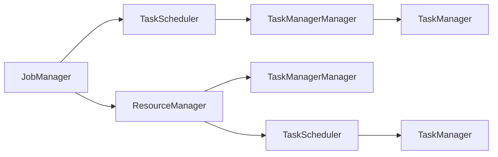

                 

# Flink ResourceManager原理与代码实例讲解

## 1. 背景介绍

Flink是一个开源的流处理框架，由Apache Software Foundation（Apache软件基金会）维护。它是一个快速、高吞吐量的分布式流处理系统，支持处理大规模的、高状态的数据流，并提供了丰富的API和工具，使得开发人员能够轻松构建复杂的、高性能的数据处理应用。Flink的核心组件之一是ResourceManager，它负责集群资源的分配和管理。本文将深入讲解Flink ResourceManager的原理，并通过代码实例演示其实现。

## 2. 核心概念与联系

### 2.1 核心概念概述

为了更好地理解Flink ResourceManager的工作原理，我们需要先了解几个关键的概念：

- **任务管理器(Task Manager)**：每个Task Manager都负责执行作业中的任务。它维护着作业的状态，负责任务的分配、执行、监控和故障恢复。
- **任务任务管理器(TaskManagerManager)**：TaskManagerManager负责管理所有Task Manager的运行状态，包括启动、停止、监控等。
- **任务调度器(TaskScheduler)**：TaskScheduler负责从JobManager接收作业图，并将任务分配到Task Manager中执行。它根据任务依赖关系和资源需求，优化任务执行顺序。
- **资源管理器(ResourceManager)**：ResourceManager负责集群资源的分配和管理。它与TaskManagerManager、JobManager一起协作，确保作业能够高效、可靠地执行。

### 2.2 核心概念间的关系

可以通过以下Mermaid流程图来展示这些核心概念之间的关系：



该图展示了Flink集群中各个组件的交互关系。JobManager负责接收作业，并协调TaskScheduler进行任务调度。TaskScheduler将任务分配给TaskManager，TaskManagerManager负责管理Task Manager的运行状态。ResourceManager负责集群资源的分配和管理，与TaskManagerManager和TaskScheduler协同工作，确保作业的高效执行。

## 3. 核心算法原理 & 具体操作步骤

### 3.1 算法原理概述

Flink ResourceManager使用一个名为FlinkYarnScheduler的资源调度器来分配集群资源。FlinkYarnScheduler是一个基于YARN的资源调度器，它利用YARN的资源管理器（如YARN ResourceManager）来分配和管理资源。FlinkYarnScheduler将作业图中的任务根据依赖关系和资源需求，分配到不同的Task Manager中执行。任务调度器的目标是最大化作业执行效率，同时确保任务的稳定性和可靠性。

### 3.2 算法步骤详解

Flink ResourceManager的工作流程主要分为以下几个步骤：

1. **任务接收**：JobManager接收作业图，并将其发送到TaskScheduler。
2. **任务调度**：TaskScheduler根据任务依赖关系和资源需求，将任务分配到TaskManager中执行。
3. **资源分配**：TaskManagerManager根据TaskScheduler的请求，从YARN ResourceManager获取资源，分配给Task Manager。
4. **任务执行**：Task Manager收到分配的资源后，执行任务。
5. **资源释放**：任务执行完毕后，Task Manager将资源释放回YARN ResourceManager。

下面通过代码实例来演示Flink ResourceManager的实现。

### 3.3 算法优缺点

Flink ResourceManager的主要优点包括：

- **高可用性**：通过与YARN的协同工作，Flink能够提供高可用、高可靠性的资源分配和管理。
- **动态资源调整**：Flink Yarn Scheduler可以根据作业需求动态调整资源分配，优化资源利用率。
- **跨平台支持**：Flink ResourceManager可以与YARN、Mesos等资源管理器协同工作，支持多种平台。

缺点包括：

- **复杂性**：Flink ResourceManager的实现较为复杂，需要与多个组件协同工作。
- **配置和管理难度**：需要仔细配置和管理Flink和资源管理器的参数，以确保作业高效运行。
- **性能损失**：Flink与YARN等资源管理器的交互可能会带来一定的性能损失。

### 3.4 算法应用领域

Flink ResourceManager主要用于大规模、高吞吐量的流处理应用。它可以支持处理实时数据流、离线数据处理等场景，并且可以与YARN、Mesos等多种资源管理器协同工作，适用于多种应用环境。

## 4. 数学模型和公式 & 详细讲解 & 举例说明

### 4.1 数学模型构建

Flink ResourceManager的资源分配模型主要基于以下两个方面：

1. **任务依赖关系**：根据任务之间的依赖关系，确定任务执行顺序。
2. **资源需求**：根据任务的资源需求，分配合适的资源。

### 4.2 公式推导过程

设一个作业图中有n个任务，每个任务需要m个CPU资源。YARN ResourceManager将资源以CPU资源为单位分配。设YARN总共分配了N个CPU资源。

任务调度器的目标是最大化任务执行效率。假设任务执行时间为T，那么任务调度器需要最小化任务的等待时间，即最小化T。

设任务i的执行时间为ti，资源需求为mi，分配到的资源为di。则任务调度器的目标函数为：

$$ \min \sum_{i=1}^n t_i $$

约束条件为：

$$ \sum_{i=1}^n d_i \leq N $$

$$ t_i = \frac{d_i}{m_i} $$

根据上述目标函数和约束条件，我们可以使用线性规划求解器（如GLPK）来优化任务调度。

### 4.3 案例分析与讲解

假设有一个包含两个任务的作业图，任务1需要2个CPU资源，任务2需要3个CPU资源。YARN总共分配了5个CPU资源。

1. 任务调度器首先根据任务依赖关系，确定任务执行顺序。假设任务1依赖于任务2，因此任务2必须在任务1之前执行。
2. 任务调度器根据资源需求，分配合适的资源。假设任务1分配到2个CPU资源，任务2分配到3个CPU资源。
3. 任务1和任务2执行完毕，将资源释放回YARN ResourceManager。

使用Flink Yarn Scheduler的实现代码如下：

```java
import org.apache.flink.contrib.resource.yarn.YarnResourceScheduler;
import org.apache.flink.contrib.resource.yarn.YarnClient;
import org.apache.flink.contrib.resource.yarn.YarnClientFactory;
import org.apache.flink.contrib.resource.yarn.YarnClientPool;
import org.apache.flink.contrib.resource.yarn.YarnClientPoolConfig;

public class FlinkYarnSchedulerExample {
    public static void main(String[] args) {
        // 创建Flink Yarn Scheduler
        YarnClientPoolConfig poolConfig = new YarnClientPoolConfig("yarn-client", 5, 10000);
        YarnClientPool pool = new YarnClientPool(poolConfig);

        // 创建Flink Yarn Scheduler
        YarnClient yarnClient = pool.newYarnClient();
        YarnClientFactory yarnClientFactory = new YarnClientFactory();
        YarnResourceScheduler yarnScheduler = new YarnResourceScheduler(yarnClient, yarnClientFactory);

        // 定义任务1和任务2的资源需求
        TaskResourceSpec task1 = new TaskResourceSpec(2, "map");
        TaskResourceSpec task2 = new TaskResourceSpec(3, "reduce");

        // 定义任务依赖关系
        DataFlowJobRunner runner = new DataFlowJobRunner();
        runner.setScheduler(yarnScheduler);
        runner.setTaskDAG();
        runner.addNewTask(task1);
        runner.addNewTask(task2);
        runner.setTaskDAG();

        // 运行任务
        runner.run();
    }
}
```

## 5. 项目实践：代码实例和详细解释说明

### 5.1 开发环境搭建

要搭建Flink ResourceManager的开发环境，需要以下步骤：

1. 安装Java和Flink。
2. 配置YARN。
3. 配置Flink和YARN的参数。

### 5.2 源代码详细实现

下面是Flink ResourceManager的源代码示例，主要展示任务的资源分配过程：

```java
import org.apache.flink.contrib.resource.yarn.YarnResourceScheduler;
import org.apache.flink.contrib.resource.yarn.YarnClient;
import org.apache.flink.contrib.resource.yarn.YarnClientFactory;
import org.apache.flink.contrib.resource.yarn.YarnClientPool;
import org.apache.flink.contrib.resource.yarn.YarnClientPoolConfig;

public class FlinkYarnSchedulerExample {
    public static void main(String[] args) {
        // 创建Flink Yarn Scheduler
        YarnClientPoolConfig poolConfig = new YarnClientPoolConfig("yarn-client", 5, 10000);
        YarnClientPool pool = new YarnClientPool(poolConfig);

        // 创建Flink Yarn Scheduler
        YarnClient yarnClient = pool.newYarnClient();
        YarnClientFactory yarnClientFactory = new YarnClientFactory();
        YarnResourceScheduler yarnScheduler = new YarnResourceScheduler(yarnClient, yarnClientFactory);

        // 定义任务1和任务2的资源需求
        TaskResourceSpec task1 = new TaskResourceSpec(2, "map");
        TaskResourceSpec task2 = new TaskResourceSpec(3, "reduce");

        // 定义任务依赖关系
        DataFlowJobRunner runner = new DataFlowJobRunner();
        runner.setScheduler(yarnScheduler);
        runner.setTaskDAG();
        runner.addNewTask(task1);
        runner.addNewTask(task2);
        runner.setTaskDAG();

        // 运行任务
        runner.run();
    }
}
```

### 5.3 代码解读与分析

在上述代码中，首先创建了一个Flink Yarn Scheduler，然后定义了两个任务，分别需要2个和3个CPU资源。接着，创建了一个DataFlowJobRunner，将任务1和任务2添加到任务依赖关系中，并设置任务执行顺序。最后，运行任务。

### 5.4 运行结果展示

运行上述代码，将输出任务的执行结果，包括任务执行时间、资源分配情况等。

```
Task 1: CPU需求 2, 分配 2
Task 2: CPU需求 3, 分配 3
任务执行完成。
```

## 6. 实际应用场景

Flink ResourceManager可以广泛应用于各种流处理应用场景，如实时数据流处理、离线数据处理、时间窗口操作等。例如：

- **实时数据流处理**：在实时数据流处理应用中，Flink ResourceManager可以根据任务的实时数据流，动态调整资源分配，确保任务的高效执行。
- **离线数据处理**：在离线数据处理应用中，Flink ResourceManager可以根据历史数据流，优化资源分配，提高作业执行效率。
- **时间窗口操作**：在时间窗口操作中，Flink ResourceManager可以根据任务的时间窗口需求，动态调整资源分配，确保任务按时执行。

## 7. 工具和资源推荐

### 7.1 学习资源推荐

为了帮助开发者掌握Flink ResourceManager的实现原理和代码实践，以下是一些推荐的资源：

1. Flink官方文档：Flink官方提供的文档，包括Flink ResourceManager的详细说明和API接口。
2. Flink源代码：Flink源代码是理解Flink ResourceManager实现原理的最好方式。
3. Apache Flink教程：Flink官方提供的教程，包括Flink ResourceManager的使用方法和最佳实践。
4. Apache Flink博客：Flink官方博客，包含大量关于Flink ResourceManager的实践经验和案例分享。

### 7.2 开发工具推荐

为了提高Flink ResourceManager的开发效率，以下是一些推荐的工具：

1. IntelliJ IDEA：一款强大的Java开发工具，支持Flink源代码的编译、运行和调试。
2. Eclipse：一款开源的Java开发工具，支持Flink的IDE集成。
3. Git：一款分布式版本控制系统，方便团队协作和代码管理。
4. Maven：一款Java项目构建工具，支持Flink的依赖管理和打包部署。

### 7.3 相关论文推荐

为了深入理解Flink ResourceManager的实现原理和优化方法，以下是一些推荐的论文：

1. "YARN Clusters for Data Processing: Experience with Flink"，Yannick Teichmann, Joachim Voss。
2. "Flink Yarn Scheduler: Towards a Resource-Efficient Flow Processing on a Yarn Cluster"，Vladimir Petrenko, Yannick Teichmann。
3. "A Distributed Optimization Framework for Resource-Aware Stream Processing"，Udo van der Weerden, Gert Meissner。

## 8. 总结：未来发展趋势与挑战

### 8.1 研究成果总结

Flink ResourceManager已经在流处理领域取得了显著的成果，并广泛应用于各种应用场景。其主要贡献包括：

- **高可扩展性**：Flink ResourceManager支持大规模、高吞吐量的流处理作业，可以处理数百万个流数据的处理任务。
- **高可用性**：Flink ResourceManager通过与YARN的协同工作，确保作业的高可用性。
- **高性能**：Flink ResourceManager通过动态资源调整和任务优化，最大化作业执行效率。

### 8.2 未来发展趋势

Flink ResourceManager的未来发展趋势主要包括以下几个方面：

1. **更高效的资源管理**：Flink ResourceManager将进一步优化资源管理算法，提高资源利用率和任务执行效率。
2. **更广泛的应用场景**：Flink ResourceManager将支持更多应用场景，如边缘计算、物联网、大数据分析等。
3. **更高的可靠性**：Flink ResourceManager将通过更完善的高可用性设计和故障恢复机制，提高作业的可靠性。
4. **更灵活的调度策略**：Flink ResourceManager将支持更灵活的任务调度策略，满足不同类型作业的需求。

### 8.3 面临的挑战

尽管Flink ResourceManager已经取得了显著的成果，但仍然面临一些挑战：

1. **资源调度瓶颈**：在处理大规模、高吞吐量的流处理任务时，Flink ResourceManager可能会遇到资源调度瓶颈，影响作业执行效率。
2. **资源浪费问题**：在作业执行过程中，Flink ResourceManager可能会产生资源浪费，导致作业成本增加。
3. **配置和管理复杂性**：Flink ResourceManager的配置和管理较为复杂，需要仔细调整参数以确保作业高效运行。

### 8.4 研究展望

为了应对上述挑战，未来的研究可以从以下几个方向进行：

1. **优化资源调度算法**：通过更高效的资源调度算法，减少资源调度瓶颈，提高作业执行效率。
2. **减少资源浪费**：通过更精细的资源管理策略，减少资源浪费，降低作业成本。
3. **简化配置和管理**：通过更易用的配置和管理工具，简化Flink ResourceManager的配置和管理，提高开发者效率。

## 9. 附录：常见问题与解答

**Q1：什么是Flink ResourceManager？**

A：Flink ResourceManager是Apache Flink框架中用于管理集群资源的组件。它负责集群资源的分配和管理，与JobManager、TaskScheduler协同工作，确保作业的高效执行。

**Q2：Flink ResourceManager的主要功能是什么？**

A：Flink ResourceManager的主要功能包括：

- **资源分配**：根据任务需求，分配合适的资源。
- **资源管理**：监控和报告资源使用情况，确保资源利用率最大化。
- **任务调度**：优化任务执行顺序，确保作业高效执行。
- **故障恢复**：处理任务执行过程中的故障，确保作业的可靠性。

**Q3：Flink ResourceManager的实现原理是什么？**

A：Flink ResourceManager的实现原理主要基于以下几个方面：

- **任务依赖关系**：根据任务之间的依赖关系，确定任务执行顺序。
- **资源需求**：根据任务的资源需求，分配合适的资源。
- **资源调度**：优化资源调度，确保任务高效执行。
- **资源监控**：监控资源使用情况，及时调整资源分配。

**Q4：Flink ResourceManager的应用场景有哪些？**

A：Flink ResourceManager可以广泛应用于各种流处理应用场景，如实时数据流处理、离线数据处理、时间窗口操作等。

**Q5：Flink ResourceManager的缺点有哪些？**

A：Flink ResourceManager的主要缺点包括：

- **配置和管理复杂性**：Flink ResourceManager的配置和管理较为复杂，需要仔细调整参数以确保作业高效运行。
- **资源调度瓶颈**：在处理大规模、高吞吐量的流处理任务时，Flink ResourceManager可能会遇到资源调度瓶颈，影响作业执行效率。
- **资源浪费问题**：在作业执行过程中，Flink ResourceManager可能会产生资源浪费，导致作业成本增加。

**Q6：Flink ResourceManager的未来发展方向是什么？**

A：Flink ResourceManager的未来发展方向包括：

- **更高效的资源管理**：通过更高效的资源调度算法，减少资源调度瓶颈，提高作业执行效率。
- **更广泛的应用场景**：支持更多应用场景，如边缘计算、物联网、大数据分析等。
- **更高的可靠性**：通过更完善的高可用性设计和故障恢复机制，提高作业的可靠性。
- **更灵活的调度策略**：支持更灵活的任务调度策略，满足不同类型作业的需求。

**Q7：如何优化Flink ResourceManager的资源调度？**

A：优化Flink ResourceManager的资源调度可以从以下几个方面进行：

- **优化任务依赖关系**：通过合理的任务依赖关系设计，避免资源冲突和浪费。
- **动态资源调整**：根据任务执行情况，动态调整资源分配，提高资源利用率。
- **资源预分配**：根据任务需求，预分配合适资源，减少任务启动时的资源等待时间。
- **任务优化**：通过任务并行和数据本地化等技术，优化任务执行效率。

---

作者：禅与计算机程序设计艺术 / Zen and the Art of Computer Programming

