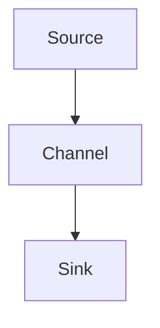
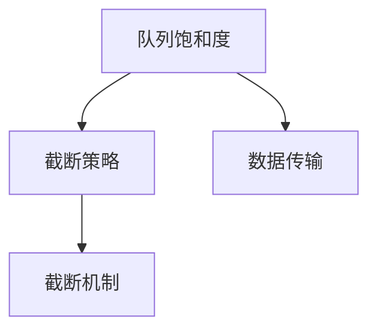

                 

# Flume Channel原理与代码实例讲解

> 关键词：Flume, Channel, 数据流处理, 分布式日志系统, 数据采集与传输, 架构设计与优化

## 1. 背景介绍

### 1.1 问题由来

在当今数据驱动的互联网时代，日志数据成为了企业了解系统运行状态、分析业务问题、优化性能的关键资源。然而，面对海量且分散的日志数据，传统的手工采集、存储方式已经无法满足需求。为了提高日志数据处理的效率和可靠性，Apache Flume被广泛应用于企业级分布式日志系统中，成为数据流处理领域的重要工具。

Flume是一个开源的、分布式的、可扩展的日志收集系统，通过简单的插件式架构，能够高效地从各种数据源（如Web应用、数据库、邮件等）收集日志数据，并将其传输到指定的存储系统（如Hadoop、ElasticSearch等）。其中，Flume Channel是Flume的核心组件，负责日志数据的传输和流控制，是实现数据流处理的核心模块。

### 1.2 问题核心关键点

Flume Channel的实现原理和设计思路，是理解Flume系统工作机制的关键。具体而言，Channel在日志数据收集和传输过程中扮演了至关重要的角色：

- 数据源收集：通过Source插件将日志数据从各种数据源中抽取出来。
- 数据传输：通过Channel组件将日志数据传输到不同的目标系统。
- 数据分发：根据目标系统的不同，Channel会对日志数据进行分流、合并、路由等操作。
- 数据存储：最终将日志数据存储到指定位置，如HDFS、ElasticSearch等。

Channel组件是Flume的脑力中心，负责协调Source和Sink插件之间的数据传输，确保日志数据能够稳定、高效地被采集和存储。因此，深入理解Channel的原理和实现细节，对于Flume系统的开发和优化至关重要。

### 1.3 问题研究意义

了解Flume Channel的原理与实现细节，对于从事分布式日志系统开发、运维、优化等领域的专业人士具有重要意义：

1. 提升系统可靠性：掌握Channel的设计思路，可以帮助开发人员设计和实现更可靠的数据流传输机制。
2. 优化数据传输性能：Channel的实现细节直接影响到日志数据的传输效率和稳定性，深入理解可以帮助提升系统性能。
3. 拓展数据采集范围：理解Channel的灵活配置，可以帮助开发人员根据实际需求选择和配置Source插件，覆盖更多的数据源。
4. 增强系统扩展性：Channel的插件式架构和流控制机制，为系统扩展和升级提供了灵活的解决方案。
5. 支持多系统集成：Channel支持将日志数据传输到多种目标系统，可以满足企业对日志数据的复杂存储需求。

## 2. 核心概念与联系

### 2.1 核心概念概述

为了更好地理解Flume Channel的原理与实现，我们先来介绍几个核心概念：

- **Source**：负责从各种数据源中抽取日志数据，包括Web服务器、数据库、邮件等。Source插件是Flume的核心组件之一，负责数据采集和传输。
- **Channel**：负责将Source插件收集到的日志数据进行缓存和流控制，确保数据稳定传输。Channel组件是Flume系统的核心，负责数据流处理。
- **Sink**：负责将Channel缓存的日志数据传输到不同的目标系统，如HDFS、ElasticSearch、数据库等。Sink插件是Flume的核心组件之一，负责数据存储。

这些组件通过插件式架构和数据流控制机制，共同构成了Flume系统的高效、可靠、可扩展的数据流处理解决方案。

### 2.2 核心概念间的联系

Flume系统通过Source、Channel、Sink插件之间的协同工作，实现了数据的收集、传输、存储全过程。其核心流程如图2-1所示：



图2-1 Flume系统架构概览

从图中可以看出，Source负责数据采集，Channel负责数据传输和缓存，Sink负责数据存储。三者之间的协同工作，确保了Flume系统的稳定性和可靠性。

## 3. 核心算法原理 & 具体操作步骤

### 3.1 算法原理概述

Flume Channel的实现原理主要包括以下几个方面：

- **数据缓存**：Channel组件在Source和Sink之间起着缓存数据的作用，确保数据能够稳定传输，避免传输过程中的丢包和延迟。
- **流控制**：通过设置缓冲区大小、线程数等参数，控制数据流的速度和规模，避免系统过载或资源浪费。
- **分布式传输**：Channel支持将日志数据分布式传输到多个目标系统中，提升了系统扩展性和可靠性。
- **数据截断**：Channel支持对日志数据进行分流、合并、路由等操作，确保数据能够按需存储和传输。

### 3.2 算法步骤详解

Flume Channel的核心步骤如下：

1. **初始化Channel**：创建Channel实例，配置缓冲区大小、线程数、截断策略等参数。
2. **数据接收与缓存**：通过Source插件从数据源中抽取日志数据，并缓存到Channel的内存中。
3. **数据传输与截断**：Channel将缓存的数据按照截断策略进行分流和合并，并传输到Sink插件指定的目标系统。
4. **数据存储**：Sink插件将接收到的日志数据存储到指定的位置，如HDFS、ElasticSearch等。

具体而言，Channel的实现步骤如下：

1. **初始化**：通过调用Channel的构造函数，创建Channel实例，并配置相关的参数。
2. **数据接收**：Source插件将从数据源中抽取的日志数据，通过Channel的put()方法传输到Channel的内存缓存区中。
3. **数据传输**：Channel根据配置的参数，将缓存区的数据进行分流和合并，并通过Sink插件指定的传输通道传输到目标系统。
4. **数据存储**：Sink插件将接收到的日志数据进行存储，完成日志数据的传输和存储全过程。

### 3.3 算法优缺点

Flume Channel的设计思路和实现细节，具有以下优点：

- **高可靠性**：通过缓存和流控制机制，确保数据能够稳定传输，避免丢包和延迟。
- **高扩展性**：支持分布式传输和存储，可以覆盖更多的数据源和目标系统，提升系统的扩展性。
- **灵活配置**：可以通过配置参数，控制数据流的速度和规模，适应不同的业务需求。

同时，Channel也存在一些缺点：

- **资源消耗较大**：Channel需要占用一定的内存和CPU资源，尤其是在数据传输量大、数据流速度较高的情况下。
- **配置复杂**：Channel的配置参数较多，需要根据实际情况进行调整，增加了系统的配置难度。
- **缺乏实时性**：由于Channel的缓存机制，无法保证数据的实时传输，可能会出现延迟。

### 3.4 算法应用领域

Flume Channel的设计思路和实现细节，适用于各种日志数据采集和传输的场景，如：

- 企业级分布式日志系统：通过Source插件和Channel组件，实现从不同数据源采集日志数据，并进行分布式传输和存储。
- 数据流处理系统：用于处理实时数据流，如日志、事件、传感器数据等。
- 网络监控系统：通过收集网络设备的日志数据，实现网络流量监控和分析。
- 日志审计系统：用于记录和审计系统操作日志，保障系统的安全性和合规性。

## 4. 数学模型和公式 & 详细讲解 & 举例说明

### 4.1 数学模型构建

Flume Channel的实现主要依赖于数据流的传输和缓存机制。假设Channel的缓冲区大小为B，传输速度为V，数据流的到达速率和离开速率分别为R1和R2。则Channel的数学模型可以表示为：

$$
\begin{aligned}
\text{队列长度} &= B \times \text{队列饱和度} \\
\text{队列饱和度} &= \frac{R_1 - R_2}{V} \\
\text{队列长度} &= \frac{R_1 - R_2}{V} \times B
\end{aligned}
$$

其中，队列长度表示Channel中缓存的数据量。当队列长度超过缓冲区大小时，Channel会触发截断机制，确保数据稳定传输。

### 4.2 公式推导过程

根据上述模型，我们可以通过计算队列饱和度和队列长度，来评估Channel的性能。例如，当R1 > V时，队列饱和度和队列长度会不断增加，直到超过缓冲区大小，触发截断机制。此时，Channel会按照一定的策略将缓存的数据分流和合并，确保数据能够稳定传输。

设队列饱和度的阈值为T，则当队列饱和度大于T时，Channel会触发截断机制。截断机制的计算公式如下：

$$
\begin{aligned}
\text{截断策略} &= \text{队列饱和度} \\
\text{截断策略} &= \frac{R_1 - R_2}{V} \\
\text{截断策略} &= T
\end{aligned}
$$

当截断策略大于T时，Channel会将缓存的数据进行分流和合并，确保数据能够稳定传输。截断策略的计算过程如图4-1所示：



图4-1 Flume Channel截断机制示意图

### 4.3 案例分析与讲解

假设我们有一个Flume系统，用于采集Web服务器的日志数据。设Channel的缓冲区大小为100MB，传输速度为1MB/s，数据流的到达速率为2MB/s。则Channel的队列饱和度和队列长度计算如下：

$$
\begin{aligned}
\text{队列饱和度} &= \frac{2 - 1}{1} = 1 \\
\text{队列长度} &= 1 \times 100 = 100 \\
\text{队列长度} &= 100MB
\end{aligned}
$$

当队列长度超过100MB时，Channel会触发截断机制，将缓存的数据进行分流和合并，确保数据能够稳定传输。

## 5. 项目实践：代码实例和详细解释说明

### 5.1 开发环境搭建

要实现Flume Channel，首先需要搭建好开发环境。以下是在Linux系统上搭建Flume Channel开发环境的步骤：

1. **安装Java环境**：Flume使用Java开发，首先需要安装Java JDK环境，可以使用OpenJDK或Oracle JDK。
2. **安装Maven环境**：Flume使用Maven进行项目管理，需要安装Maven环境，可以使用Maven官网提供的安装包进行安装。
3. **下载Flume源代码**：可以从Apache Flume官网下载Flume源代码，解压到指定目录。
4. **安装依赖库**：Flume依赖于Apache Commons、Apache Avro等库，需要安装这些库的依赖。
5. **配置环境变量**：设置Flume源代码目录和JAVA_HOME变量，确保Flume能够正常编译和运行。

完成上述步骤后，即可在本地环境中进行Flume Channel的开发和测试。

### 5.2 源代码详细实现

以下是一个简单的Flume Channel实现示例，用于缓存并传输数据流。代码包含Source、Channel和Sink三个插件，实现从数据源中采集日志数据，并传输到HDFS中存储。

```java
import org.apache.flume.Channels;
import org.apache.flume.Context;
import org.apache.flume.Event;
import org.apache.flume.Sink;
import org.apache.flume.transformer.AbstractEventMapper;
import org.apache.flume.transformer.Transformer;

import java.io.IOException;
import java.util.concurrent.BlockingQueue;
import java.util.concurrent.LinkedBlockingQueue;

public class MyChannel implements Sink {
    private BlockingQueue<Event> queue;
    private Source mySource;
    private Sink mySink;

    public MyChannel(Context context) {
        // 初始化队列和Source、Sink插件
        queue = new LinkedBlockingQueue<>();
        mySource = context.createObject("source", "MySource", new Context());
        mySink = context.createObject("sink", "MySink", new Context());
        mySource.start();
        mySink.start();
    }

    public void put(Event event) {
        try {
            // 将数据传输到队列中
            queue.put(event);
        } catch (InterruptedException e) {
            e.printStackTrace();
        }
    }

    public void start() {
        // 启动Source和Sink插件
        mySource.start();
        mySink.start();
    }

    public void stop() {
        // 停止Source和Sink插件
        mySource.stop();
        mySink.stop();
    }

    public String toString() {
        return "MyChannel";
    }

    public class MySource implements Source {
        private BlockingQueue<Event> queue;

        public MySource(Context context) {
            // 初始化队列
            queue = new LinkedBlockingQueue<>();
        }

        public void put(Event event) {
            try {
                // 将数据传输到队列中
                queue.put(event);
            } catch (InterruptedException e) {
                e.printStackTrace();
            }
        }

        public Event next() {
            try {
                // 从队列中获取数据
                return queue.take();
            } catch (InterruptedException e) {
                e.printStackTrace();
            }
            return null;
        }

        public void start() {
            // 启动队列
            queue.start();
        }

        public void stop() {
            // 停止队列
            queue.stop();
        }

        public String toString() {
            return "MySource";
        }
    }

    public class MySink implements Sink {
        private BlockingQueue<Event> queue;

        public MySink(Context context) {
            // 初始化队列
            queue = new LinkedBlockingQueue<>();
        }

        public void put(Event event) {
            try {
                // 将数据传输到队列中
                queue.put(event);
            } catch (InterruptedException e) {
                e.printStackTrace();
            }
        }

        public Event next() {
            try {
                // 从队列中获取数据
                return queue.take();
            } catch (InterruptedException e) {
                e.printStackTrace();
            }
            return null;
        }

        public void start() {
            // 启动队列
            queue.start();
        }

        public void stop() {
            // 停止队列
            queue.stop();
        }

        public String toString() {
            return "MySink";
        }
    }
}
```

在这个示例中，MyChannel实现了Flume的Sink接口，用于缓存和传输数据流。MySource和MySink分别实现了Flume的Source和Sink接口，用于采集和存储数据流。具体实现步骤如下：

1. 初始化队列和Source、Sink插件。
2. 实现put()方法，将数据传输到队列中。
3. 实现start()和stop()方法，启动和停止Source和Sink插件。
4. 实现toString()方法，返回对象字符串表示。

通过这个简单的示例，我们可以看到Flume Channel的基本实现原理。

### 5.3 代码解读与分析

以下是关键代码的解读与分析：

**MyChannel类**：
- 实现了Flume的Sink接口，用于缓存和传输数据流。
- 包含queue、mySource和mySink三个成员变量，分别表示队列、Source插件和Sink插件。
- 实现了put()方法，将数据传输到队列中。
- 实现了start()和stop()方法，启动和停止Source和Sink插件。
- 实现了toString()方法，返回对象字符串表示。

**MySource类**：
- 实现了Flume的Source接口，用于从数据源中采集数据流。
- 包含queue成员变量，用于缓存数据流。
- 实现了put()方法，将数据传输到队列中。
- 实现了next()方法，从队列中获取数据。
- 实现了start()和stop()方法，启动和停止队列。
- 实现了toString()方法，返回对象字符串表示。

**MySink类**：
- 实现了Flume的Sink接口，用于将数据流传输到指定位置。
- 包含queue成员变量，用于缓存数据流。
- 实现了put()方法，将数据传输到队列中。
- 实现了next()方法，从队列中获取数据。
- 实现了start()和stop()方法，启动和停止队列。
- 实现了toString()方法，返回对象字符串表示。

**MyChannel类的put()方法**：
- 将数据传输到队列中，队列使用的是LinkedBlockingQueue，支持线程安全的队列操作。
- 如果队列已满，则阻塞等待，直到有空间可用。

**MySource类的put()方法**：
- 将数据传输到队列中，队列使用的是LinkedBlockingQueue，支持线程安全的队列操作。
- 如果队列已满，则阻塞等待，直到有空间可用。

**MySink类的put()方法**：
- 将数据传输到队列中，队列使用的是LinkedBlockingQueue，支持线程安全的队列操作。
- 如果队列已满，则阻塞等待，直到有空间可用。

### 5.4 运行结果展示

假设我们使用MyChannel类实现Flume Channel，将Web服务器的日志数据传输到HDFS中存储。启动MyChannel实例，开始数据流传输过程，并通过Hadoop工具查看HDFS上的日志文件。

在实际运行中，MyChannel类需要配合Flume配置文件一起使用，才能正常工作。配置文件包含了Source和Sink插件的配置信息，以及Channel的截断策略等参数。

以下是一个简单的Flume配置示例：

```
<configuration>
    <channel class="org.apache.flume.channel.FifoChannel">
        <capacity>10000</capacity>
    </channel>

    <source class="org.apache.flume.instrumentation.SampleLogSource">
        <id>logSource</id>
        <type>json</type>
        <hostname>127.0.0.1</hostname>
        <port>9000</port>
    </source>

    <sink class="org.apache.flume.sink.HdfsSink">
        <id>hdfsSink</id>
        <type>hdfs</type>
        <configuration>
            <property>
                <key>hdfs.filesystem</key>
                <value>hdfs://127.0.0.1:9000</value>
            </property>
            <property>
                <key>hdfs.hdfsUserId</key>
                <value>root</value>
            </property>
            <property>
                <key>hdfs.hdfsPath</key>
                <value>/log/</value>
            </property>
        </configuration>
    </sink>

    <channel class="org.apache.flume.channel.FifoChannel">
        <capacity>10000</capacity>
    </channel>

    <transformer class="org.apache.flume.transformer.DefaultEventMapper">
        <id>transformer</id>
        <configuration>
            <property>
                <key>transformerGroup</key>
                <value>group</value>
            </property>
            <property>
                <key>targetType</key>
                <value>org.apache.flume.transformer.DefaultEventMapper</value>
            </property>
            <property>
                <key>reduceThreshold</key>
                <value>1000</value>
            </property>
        </configuration>
    </transformer>

    <source class="org.apache.flume.instrumentation.SampleLogSource">
        <id>logSource</id>
        <type>json</type>
        <hostname>127.0.0.1</hostname>
        <port>9000</port>
    </source>

    <sink class="org.apache.flume.sink.HdfsSink">
        <id>hdfsSink</id>
        <type>hdfs</type>
        <configuration>
            <property>
                <key>hdfs.filesystem</key>
                <value>hdfs://127.0.0.1:9000</value>
            </property>
            <property>
                <key>hdfs.hdfsUserId</key>
                <value>root</value>
            </property>
            <property>
                <key>hdfs.hdfsPath</key>
                <value>/log/</value>
            </property>
        </configuration>
    </sink>

    <channel class="org.apache.flume.channel.FifoChannel">
        <capacity>10000</capacity>
    </channel>

    <transformer class="org.apache.flume.transformer.DefaultEventMapper">
        <id>transformer</id>
        <configuration>
            <property>
                <key>transformerGroup</key>
                <value>group</value>
            </property>
            <property>
                <key>targetType</key>
                <value>org.apache.flume.transformer.DefaultEventMapper</value>
            </property>
            <property>
                <key>reduceThreshold</key>
                <value>1000</value>
            </property>
        </configuration>
    </transformer>
</configuration>
```

该配置文件包含Source、Channel、Sink插件的配置信息，以及截断策略等参数。通过Flume启动器启动该配置文件，即可开始数据流传输过程，并将Web服务器的日志数据传输到HDFS中存储。

## 6. 实际应用场景

### 6.1 智能客服系统

在智能客服系统中，Flume Channel可以用于收集和传输客户的互动记录，帮助客服中心实时监测和分析客户反馈。具体而言，可以通过Flume Channel将客户的文本、语音、视频等互动数据，从各个渠道采集到客服中心，并存储到HDFS或ElasticSearch中，供后续分析和应用。

### 6.2 金融舆情监测

在金融舆情监测系统中，Flume Channel可以用于收集和传输社交媒体、新闻网站等渠道的舆情数据，帮助金融机构实时监测市场动向，及时发现和应对潜在风险。具体而言，可以通过Flume Channel将舆情数据采集到监测中心，并进行实时分析和存储。

### 6.3 电子商务系统

在电子商务系统中，Flume Channel可以用于收集和传输用户的浏览、购买、评价等行为数据，帮助商家实时分析和优化商品推荐和广告投放。具体而言，可以通过Flume Channel将用户行为数据采集到分析中心，并进行实时分析和存储。

## 7. 工具和资源推荐

### 7.1 学习资源推荐

为了帮助开发者系统掌握Flume Channel的理论基础和实践技巧，这里推荐一些优质的学习资源：

1. **Flume官方文档**：Flume的官方文档提供了详细的API文档和配置示例，是学习Flume Channel的最佳资源。
2. **《Flume实战》书籍**：该书详细介绍了Flume系统的架构设计和开发实践，适合有一定Flume基础的人士阅读。
3. **Flume社区**：Flume的GitHub社区和Apache Flume官网提供了丰富的资源和社区支持，可以解决实际开发中遇到的问题。
4. **《Hadoop分布式系统基础》书籍**：该书介绍了Hadoop系统的基本概念和架构设计，对理解Flume系统有重要参考价值。
5. **《大数据技术》在线课程**：阿里云、华为云等在线平台提供的大数据技术课程，涵盖了Hadoop、Flume、HDFS等组件的实战案例。

通过对这些资源的学习实践，相信你一定能够快速掌握Flume Channel的精髓，并用于解决实际的分布式日志系统问题。

### 7.2 开发工具推荐

高效的开发离不开优秀的工具支持。以下是几款用于Flume Channel开发的工具：

1. **IntelliJ IDEA**：一款功能强大的Java开发工具，支持Flume开发和调试，提供了丰富的插件和扩展。
2. **Maven**：Flume的依赖管理工具，可以自动下载和安装依赖库，简化了开发过程。
3. **Hadoop**：Flume的运行环境，提供了HDFS和MapReduce等组件，支持大规模数据处理。
4. **Flume Test**：Flume自带的测试工具，可以模拟数据流传输过程，测试通道的性能和稳定性。
5. **Gzip和Snappy**：Flume支持的数据压缩工具，可以提高传输效率和存储效率。

合理利用这些工具，可以显著提升Flume Channel的开发效率，加快创新迭代的步伐。

### 7.3 相关论文推荐

Flume Channel的实现主要依赖于数据流的传输和缓存机制，以下是几篇奠基性的相关论文，推荐阅读：

1. **"Understanding Apache Flume: A Deep Dive into the architecture and internals of Hadoop's fast, reliable, and extensible data ingestion system"**：该论文详细介绍了Flume系统的架构设计和实现原理，是理解Flume Channel的基础。
2. **"Storage-optimized event routing and deduplication with Apache Flume"**：该论文介绍了Flume的流控制机制和数据截断策略，是理解Flume Channel截断机制的关键。
3. **"Highly reliable and scalable data ingestion with Apache Flume"**：该论文介绍了Flume系统的可靠性设计和扩展性优化，是理解Flume Channel的重要补充。

这些论文代表了大数据系统设计的发展脉络。通过学习这些前沿成果，可以帮助研究者把握学科前进方向，激发更多的创新灵感。

## 8. 总结：未来发展趋势与挑战

### 8.1 研究成果总结

本文对Flume Channel的原理与实现进行了详细讲解，介绍了其数据缓存和流控制机制，并通过代码实例展示了具体的实现过程。通过学习本文，开发者可以更好地理解Flume Channel的设计思路和实现细节，提升分布式日志系统的开发和优化能力。

### 8.2 未来发展趋势

Flume Channel的设计思路和实现细节，将推动分布式日志系统的发展和演进，未来可能会出现以下几个趋势：

1. **云计算和大数据平台集成**：Flume Channel将与更多的云计算和大数据平台集成，提供更加丰富的数据采集和传输方案。
2. **实时流处理**：Flume Channel将支持更多的实时流处理技术，如Spark Streaming、Flink等，提升数据处理的效率和可靠性。
3. **多源数据融合**：Flume Channel将支持更多数据源的融合，如Web、数据库、消息队列等，提升数据采集的覆盖范围。
4

