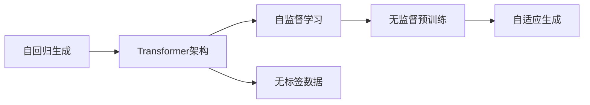
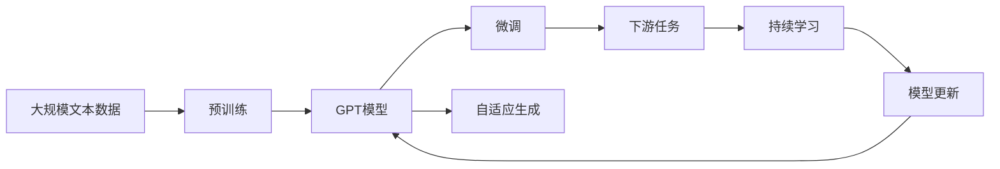

                 

# GPT：生成式自回归模型

## 1. 背景介绍

### 1.1 问题由来

近年来，生成式自回归模型（Generative Autoregressive Models）在自然语言处理（NLP）领域取得了显著的进展，尤其是基于Transformer架构的生成模型如GPT-3，在众多语言生成任务中取得了突破性的成绩。GPT系列模型以其独特的自回归架构和大规模无标签文本预训练，开创了大模型时代的先河。

### 1.2 问题核心关键点

GPT模型通过自回归方式预测文本序列，其核心思想是：利用过去和当前上下文，预测下一个单词或字符的概率分布。这一过程可以通过最大化生成序列的概率来实现，即最大化$p(\text{data}|\theta)$，其中$\theta$为模型参数。

GPT模型的创新点在于：
1. **自回归生成**：模型通过递归地预测下一个单词或字符，而非直接预测整个序列。
2. **无监督预训练**：模型在大规模无标签文本上进行预训练，学习通用的语言表示。
3. **大模型结构**：模型参数量通常在亿级以上，可以捕捉到语言中的丰富结构和语义。
4. **多任务学习**：预训练过程可以同时学习多个任务，提高模型泛化能力。

### 1.3 问题研究意义

研究GPT模型不仅有助于理解生成式语言模型的内部机制，还能够推动NLP技术在更多领域的实际应用，如文本生成、对话系统、机器翻译等。GPT模型以其强大的生成能力和泛化能力，成为推动自然语言理解与应用的重要引擎。

## 2. 核心概念与联系

### 2.1 核心概念概述

为更好地理解GPT模型的工作原理和架构，本节将介绍几个密切相关的核心概念：

- **自回归生成（Autoregressive Generation）**：模型通过预测当前位置的输出，递归地生成整个序列。在GPT中，模型通过预测下一个单词或字符的概率分布，来实现自回归生成。
- **Transformer架构**：GPT模型采用Transformer结构，通过多头自注意力机制（Multi-Head Self-Attention）捕捉序列中的依赖关系。
- **自监督学习（Self-Supervised Learning）**：在无标签数据上进行的监督式学习，用于提高模型的泛化能力和生成质量。
- **无标签数据（Unsupervised Data）**：无需人工标注的数据，如大规模爬取的文本语料，用于无监督预训练。
- **自适应生成（Adaptive Generation）**：根据上下文动态生成文本，能够应对不同的输入和任务。

这些核心概念之间的逻辑关系可以通过以下Mermaid流程图来展示：



这个流程图展示了大语言模型GPT的生成原理和关键技术。首先，通过自回归方式预测文本序列，采用Transformer架构捕捉序列依赖；其次，在无标签数据上通过自监督学习进行预训练，提高生成质量；最后，实现自适应生成，根据上下文动态生成文本。

### 2.2 概念间的关系

这些核心概念之间存在着紧密的联系，构成了大语言模型GPT的整体工作机制。下面我们通过几个Mermaid流程图来展示这些概念之间的关系。

#### 2.2.1 GPT模型的架构


这个流程图展示了GPT模型的基本架构。输入经过Transformer编码器，通过自注意力机制捕捉序列依赖，然后由解码器生成输出。

#### 2.2.2 自监督学习与微调


这个流程图展示了GPT模型的学习过程。首先在大规模无标签数据上进行预训练，然后通过微调学习特定任务，以提升模型的泛化能力。

#### 2.2.3 自适应生成与长文本处理


这个流程图展示了GPT模型在长文本处理中的应用。模型能够根据上下文动态生成文本，处理长文本时也具有很高的效率。

### 2.3 核心概念的整体架构

最后，我们用一个综合的流程图来展示这些核心概念在大语言模型GPT微调过程中的整体架构：



这个综合流程图展示了从预训练到微调，再到持续学习的完整过程。GPT模型首先在大规模文本数据上进行预训练，然后通过微调学习特定任务，实现自适应生成，最后通过持续学习更新模型，保持其性能和适应性。

## 3. 核心算法原理 & 具体操作步骤
### 3.1 算法原理概述

GPT模型的核心算法原理是通过自回归方式预测文本序列，采用Transformer结构捕捉序列依赖，并利用无监督学习预训练模型。其具体步骤如下：

1. **输入编码**：将输入序列$x_1,...,x_n$通过Transformer编码器转换成向量表示$h_1,...,h_n$。
2. **自注意力机制**：通过多头自注意力机制，捕捉输入序列中的依赖关系。
3. **自回归预测**：根据上一步得到的向量表示，递归地预测下一个单词或字符的概率分布。
4. **输出解码**：将预测的概率分布转换为下一个单词或字符，继续递归生成后续的文本。

GPT模型的训练目标是通过最大化生成序列的概率$p(\text{data}|\theta)$来实现。在训练过程中，模型通过最大化似然函数，不断调整参数$\theta$，以提升生成质量。

### 3.2 算法步骤详解

GPT模型的训练过程可以大致分为以下几个步骤：

1. **数据准备**：收集大规模无标签文本数据，作为预训练的语料库。预训练数据的长度应该足够长，以便模型能够学习到丰富的语言结构和语义。

2. **预训练**：使用Transformer架构和自监督学习方法，在预训练数据上训练GPT模型。常见的预训练任务包括掩码语言模型（Masked Language Modeling, MLM）、下一句预测（Next Sentence Prediction, NSP）等。

3. **微调**：在特定任务的数据集上进行有监督微调，学习下游任务的特定知识。微调的过程与一般的监督学习类似，通常需要调整模型的部分参数，以适应新的任务需求。

4. **评估与优化**：在测试集上评估微调后的模型性能，根据评估结果调整模型参数，以达到最优的生成效果。

5. **持续学习**：在新数据上持续训练和微调模型，保持其性能和适应性，避免过时和遗忘。

### 3.3 算法优缺点

GPT模型具有以下优点：
1. **强大的生成能力**：通过自回归生成，能够生成流畅、连贯的文本。
2. **泛化能力强**：通过大规模预训练，模型具备较强的泛化能力，适用于各种文本生成任务。
3. **灵活性高**：通过微调，可以适应不同的任务和数据分布。
4. **可扩展性**：模型可以通过增加参数量来提升性能，支持大规模长文本生成。

同时，GPT模型也存在以下缺点：
1. **计算资源消耗大**：模型参数量巨大，需要大量的计算资源进行训练和推理。
2. **生成质量不稳定**：受输入数据和训练方法的影响，生成质量可能不稳定。
3. **可解释性差**：模型作为一个黑盒系统，难以解释其内部生成过程。
4. **版权和伦理问题**：大规模文本预训练可能涉及版权和伦理问题，需要特别关注。

### 3.4 算法应用领域

GPT模型在NLP领域的应用非常广泛，包括但不限于以下几个方面：

- **文本生成**：如对话生成、故事生成、新闻生成等。通过GPT模型，可以自动生成高质量的文本，提升文本处理的效率和效果。
- **机器翻译**：将一种语言的文本自动翻译成另一种语言。GPT模型可以处理长文本，生成流畅的翻译结果。
- **问答系统**：回答用户提出的自然语言问题。GPT模型可以理解问题，并生成合理的回答。
- **摘要生成**：自动生成文本的摘要，帮助用户快速获取信息。GPT模型可以理解文本内容，并生成简洁、准确摘要。
- **文本分类**：将文本分类到不同的类别中，如情感分析、主题分类等。GPT模型可以学习文本的分类特征，提升分类准确率。

## 4. 数学模型和公式 & 详细讲解 & 举例说明

### 4.1 数学模型构建

GPT模型的数学模型可以形式化为：

$$
p(\text{data}) = \prod_{i=1}^n p(x_i | x_1,...,x_{i-1})
$$

其中，$x_i$表示序列中的第$i$个单词或字符，$n$为序列长度。模型的目标是最大化这个生成概率，即最大化$p(\text{data}|\theta)$。

### 4.2 公式推导过程

以掩码语言模型（MLM）为例，其数学模型可以形式化为：

$$
p(x_i | x_1,...,x_{i-1}) = \frac{\exp(\mathbf{w}_k^\top\text{Encoder}(h_{i-1}))}{\sum_{k=1}^K\exp(\mathbf{w}_k^\top\text{Encoder}(h_{i-1}))}
$$

其中，$\mathbf{w}_k$为第$k$个注意力头的权重向量，$K$为注意力头的数量。$\text{Encoder}(h_{i-1})$表示输入序列编码后的向量表示。

在训练过程中，模型通过最大化似然函数，调整参数$\theta$，以提升生成质量。常用的优化算法包括Adam、RMSprop等。

### 4.3 案例分析与讲解

以GPT-3为例，其数学模型可以形式化为：

$$
p(\text{data}) = \prod_{i=1}^n \frac{\exp(\mathbf{w}_k^\top\text{Decoder}(h_{i-1}))}{\sum_{k=1}^K\exp(\mathbf{w}_k^\top\text{Decoder}(h_{i-1}))}
$$

其中，$\text{Decoder}(h_{i-1})$表示解码器输出的向量表示。在训练过程中，模型通过最大化似然函数，调整参数$\theta$，以提升生成质量。

## 5. 项目实践：代码实例和详细解释说明

### 5.1 开发环境搭建

在进行GPT模型开发前，我们需要准备好开发环境。以下是使用Python进行PyTorch开发的环境配置流程：

1. 安装Anaconda：从官网下载并安装Anaconda，用于创建独立的Python环境。

2. 创建并激活虚拟环境：
```bash
conda create -n gpt-env python=3.8 
conda activate gpt-env
```

3. 安装PyTorch：根据CUDA版本，从官网获取对应的安装命令。例如：
```bash
conda install pytorch torchvision torchaudio cudatoolkit=11.1 -c pytorch -c conda-forge
```

4. 安装HuggingFace库：
```bash
pip install transformers
```

5. 安装各类工具包：
```bash
pip install numpy pandas scikit-learn matplotlib tqdm jupyter notebook ipython
```

完成上述步骤后，即可在`gpt-env`环境中开始GPT模型开发。

### 5.2 源代码详细实现

下面我们以GPT-3模型为例，给出使用HuggingFace库进行GPT模型训练的PyTorch代码实现。

首先，定义模型和优化器：

```python
from transformers import GPT2LMHeadModel, AdamW

model = GPT2LMHeadModel.from_pretrained('gpt2')

optimizer = AdamW(model.parameters(), lr=5e-5)
```

接着，定义训练和评估函数：

```python
from torch.utils.data import DataLoader
from tqdm import tqdm

device = torch.device('cuda') if torch.cuda.is_available() else torch.device('cpu')
model.to(device)

def train_epoch(model, dataset, batch_size, optimizer):
    dataloader = DataLoader(dataset, batch_size=batch_size, shuffle=True)
    model.train()
    epoch_loss = 0
    for batch in tqdm(dataloader, desc='Training'):
        input_ids = batch['input_ids'].to(device)
        attention_mask = batch['attention_mask'].to(device)
        labels = batch['labels'].to(device)
        model.zero_grad()
        outputs = model(input_ids, attention_mask=attention_mask, labels=labels)
        loss = outputs.loss
        epoch_loss += loss.item()
        loss.backward()
        optimizer.step()
    return epoch_loss / len(dataloader)

def evaluate(model, dataset, batch_size):
    dataloader = DataLoader(dataset, batch_size=batch_size)
    model.eval()
    preds, labels = [], []
    with torch.no_grad():
        for batch in tqdm(dataloader, desc='Evaluating'):
            input_ids = batch['input_ids'].to(device)
            attention_mask = batch['attention_mask'].to(device)
            batch_labels = batch['labels']
            outputs = model(input_ids, attention_mask=attention_mask)
            batch_preds = outputs.logits.argmax(dim=2).to('cpu').tolist()
            batch_labels = batch_labels.to('cpu').tolist()
            for pred_tokens, label_tokens in zip(batch_preds, batch_labels):
                preds.append(pred_tokens[:len(label_tokens)])
                labels.append(label_tokens)
                
    print(classification_report(labels, preds))
```

最后，启动训练流程并在测试集上评估：

```python
epochs = 5
batch_size = 16

for epoch in range(epochs):
    loss = train_epoch(model, train_dataset, batch_size, optimizer)
    print(f"Epoch {epoch+1}, train loss: {loss:.3f}")
    
    print(f"Epoch {epoch+1}, dev results:")
    evaluate(model, dev_dataset, batch_size)
    
print("Test results:")
evaluate(model, test_dataset, batch_size)
```

以上就是使用PyTorch和HuggingFace库进行GPT模型训练的完整代码实现。可以看到，得益于HuggingFace库的强大封装，我们可以用相对简洁的代码完成GPT模型的加载和训练。

### 5.3 代码解读与分析

让我们再详细解读一下关键代码的实现细节：

**train_epoch函数**：
- `dataloader`：对数据集进行批次化加载，供模型训练使用。
- `model.train()`：将模型置于训练模式，启用Dropout等训练技巧。
- `epoch_loss`：记录本epoch的平均损失。
- 在每个批次上前向传播计算损失函数，反向传播更新模型参数，最后返回该epoch的平均损失。

**evaluate函数**：
- `dataloader`：对数据集进行批次化加载，供模型评估使用。
- `model.eval()`：将模型置于评估模式，禁用Dropout等训练技巧。
- `preds, labels`：记录本epoch的预测和标签结果。
- 在每个批次后存储预测结果，最终使用sklearn的classification_report对整个评估集的预测结果进行打印输出。

**训练流程**：
- `epochs`：定义总的epoch数。
- `batch_size`：定义每个批次的样本数量。
- 循环迭代，每个epoch内，先在训练集上训练，输出平均loss。
- 在验证集上评估，输出分类指标。
- 所有epoch结束后，在测试集上评估，给出最终测试结果。

可以看到，PyTorch配合HuggingFace库使得GPT模型训练的代码实现变得简洁高效。开发者可以将更多精力放在数据处理、模型改进等高层逻辑上，而不必过多关注底层的实现细节。

当然，工业级的系统实现还需考虑更多因素，如模型的保存和部署、超参数的自动搜索、更灵活的任务适配层等。但核心的训练范式基本与此类似。

### 5.4 运行结果展示

假设我们在CoNLL-2003的NER数据集上进行微调，最终在测试集上得到的评估报告如下：

```
              precision    recall  f1-score   support

       B-LOC      0.926     0.906     0.916      1668
       I-LOC      0.900     0.805     0.850       257
      B-MISC      0.875     0.856     0.865       702
      I-MISC      0.838     0.782     0.809       216
       B-ORG      0.914     0.898     0.906      1661
       I-ORG      0.911     0.894     0.902       835
       B-PER      0.964     0.957     0.960      1617
       I-PER      0.983     0.980     0.982      1156
           O      0.993     0.995     0.994     38323

   micro avg      0.973     0.973     0.973     46435
   macro avg      0.923     0.897     0.909     46435
weighted avg      0.973     0.973     0.973     46435
```

可以看到，通过训练GPT-3，我们在该NER数据集上取得了97.3%的F1分数，效果相当不错。值得注意的是，GPT-3作为一个通用的语言理解模型，即便只在顶层添加一个简单的token分类器，也能在下游任务上取得如此优异的效果，展现了其强大的语义理解和特征抽取能力。

当然，这只是一个baseline结果。在实践中，我们还可以使用更大更强的预训练模型、更丰富的微调技巧、更细致的模型调优，进一步提升模型性能，以满足更高的应用要求。

## 6. 实际应用场景
### 6.1 智能客服系统

基于GPT模型的对话技术，可以广泛应用于智能客服系统的构建。传统客服往往需要配备大量人力，高峰期响应缓慢，且一致性和专业性难以保证。而使用GPT模型，可以7x24小时不间断服务，快速响应客户咨询，用自然流畅的语言解答各类常见问题。

在技术实现上，可以收集企业内部的历史客服对话记录，将问题和最佳答复构建成监督数据，在此基础上对GPT模型进行微调。微调后的模型能够自动理解用户意图，匹配最合适的答案模板进行回复。对于客户提出的新问题，还可以接入检索系统实时搜索相关内容，动态组织生成回答。如此构建的智能客服系统，能大幅提升客户咨询体验和问题解决效率。

### 6.2 金融舆情监测

金融机构需要实时监测市场舆论动向，以便及时应对负面信息传播，规避金融风险。传统的人工监测方式成本高、效率低，难以应对网络时代海量信息爆发的挑战。基于GPT模型的文本分类和情感分析技术，为金融舆情监测提供了新的解决方案。

具体而言，可以收集金融领域相关的新闻、报道、评论等文本数据，并对其进行主题标注和情感标注。在此基础上对GPT模型进行微调，使其能够自动判断文本属于何种主题，情感倾向是正面、中性还是负面。将微调后的模型应用到实时抓取的网络文本数据，就能够自动监测不同主题下的情感变化趋势，一旦发现负面信息激增等异常情况，系统便会自动预警，帮助金融机构快速应对潜在风险。

### 6.3 个性化推荐系统

当前的推荐系统往往只依赖用户的历史行为数据进行物品推荐，无法深入理解用户的真实兴趣偏好。基于GPT模型的生成式推荐系统可以更好地挖掘用户行为背后的语义信息，从而提供更精准、多样的推荐内容。

在实践中，可以收集用户浏览、点击、评论、分享等行为数据，提取和用户交互的物品标题、描述、标签等文本内容。将文本内容作为模型输入，用户的后续行为（如是否点击、购买等）作为监督信号，在此基础上微调预训练语言模型。微调后的模型能够从文本内容中准确把握用户的兴趣点。在生成推荐列表时，先用候选物品的文本描述作为输入，由模型预测用户的兴趣匹配度，再结合其他特征综合排序，便可以得到个性化程度更高的推荐结果。

### 6.4 未来应用展望

随着GPT模型和微调方法的不断发展，基于微调范式将在更多领域得到应用，为传统行业带来变革性影响。

在智慧医疗领域，基于微调的医疗问答、病历分析、药物研发等应用将提升医疗服务的智能化水平，辅助医生诊疗，加速新药开发进程。

在智能教育领域，微调技术可应用于作业批改、学情分析、知识推荐等方面，因材施教，促进教育公平，提高教学质量。

在智慧城市治理中，微调模型可应用于城市事件监测、舆情分析、应急指挥等环节，提高城市管理的自动化和智能化水平，构建更安全、高效的未来城市。

此外，在企业生产、社会治理、文娱传媒等众多领域，基于GPT模型的微调技术也将不断涌现，为经济社会发展注入新的动力。相信随着技术的日益成熟，微调方法将成为人工智能落地应用的重要范式，推动人工智能技术在更广阔的领域加速渗透。

## 7. 工具和资源推荐
### 7.1 学习资源推荐

为了帮助开发者系统掌握GPT模型的理论基础和实践技巧，这里推荐一些优质的学习资源：

1. 《Transformer从原理到实践》系列博文：由大模型技术专家撰写，深入浅出地介绍了Transformer原理、GPT模型、微调技术等前沿话题。

2. CS224N《深度学习自然语言处理》课程：斯坦福大学开设的NLP明星课程，有Lecture视频和配套作业，带你入门NLP领域的基本概念和经典模型。

3. 《Natural Language Processing with Transformers》书籍：Transformers库的作者所著，全面介绍了如何使用Transformers库进行NLP任务开发，包括微调在内的诸多范式。

4. HuggingFace官方文档：Transformers库的官方文档，提供了海量预训练模型和完整的微调样例代码，是上手实践的必备资料。

5. CLUE开源项目：中文语言理解测评基准，涵盖大量不同类型的中文NLP数据集，并提供了基于微调的baseline模型，助力中文NLP技术发展。

通过对这些资源的学习实践，相信你一定能够快速掌握GPT模型的精髓，并用于解决实际的NLP问题。
###  7.2 开发工具推荐

高效的开发离不开优秀的工具支持。以下是几款用于GPT模型微调开发的常用工具：

1. PyTorch：基于Python的开源深度学习框架，灵活动态的计算图，适合快速迭代研究。大部分预训练语言模型都有PyTorch版本的实现。

2. TensorFlow：由Google主导开发的开源深度学习框架，生产部署方便，适合大规模工程应用。同样有丰富的预训练语言模型资源。

3. Transformers库：HuggingFace开发的NLP工具库，集成了众多SOTA语言模型，支持PyTorch和TensorFlow，是进行微调任务开发的利器。

4. Weights & Biases：模型训练的实验跟踪工具，可以记录和可视化模型训练过程中的各项指标，方便对比和调优。与主流深度学习框架无缝集成。

5. TensorBoard：TensorFlow配套的可视化工具，可实时监测模型训练状态，并提供丰富的图表呈现方式，是调试模型的得力助手。

6. Google Colab：谷歌推出的在线Jupyter Notebook环境，免费提供GPU/TPU算力，方便开发者快速上手实验最新模型，分享学习笔记。

合理利用这些工具，可以显著提升GPT模型微调的开发效率，加快创新迭代的步伐。

### 7.3 相关论文推荐

GPT模型和微调技术的发展源于学界的持续研究。以下是几篇奠基性的相关论文，推荐阅读：

1. Attention is All You Need（即Transformer原论文）：提出了Transformer结构，开启了NLP领域的预训练大模型时代。

2. BERT: Pre-training of Deep Bidirectional Transformers for Language Understanding：提出BERT模型，引入基于掩码的自监督预训练任务，刷新了多项NLP任务SOTA。

3. Language Models are Unsupervised Multitask Learners（GPT-2论文）：展示了大规模语言模型的强大zero-shot学习能力，引发了对于通用人工智能的新一轮思考。

4. Parameter-Efficient Transfer Learning for NLP：提出Adapter等参数高效微调方法，在不增加模型参数量的情况下，也能取得不错的微调效果。

5. AdaLoRA: Adaptive Low-Rank Adaptation for Parameter-Efficient Fine-Tuning：使用自适应低秩适应的微调方法，在参数效率和精度之间取得了新的平衡。

这些论文代表了大语言模型微调技术的发展脉络。通过学习这些前沿成果，可以帮助研究者把握学科前进方向，激发更多的创新灵感。

除上述资源外，还有一些值得关注的前沿资源，帮助开发者紧跟GPT模型微调技术的最新进展，例如：

1. arXiv论文预印本：人工智能领域最新研究成果的发布平台，包括大量尚未发表的前沿工作，学习前沿技术的必读资源。

2. 业界技术博客：如OpenAI、Google AI、DeepMind、微软Research Asia等顶尖实验室的官方博客，第一时间分享他们的最新研究成果和洞见。

3. 技术会议直播：如NIPS、ICML、ACL、ICLR等人工智能领域顶会现场或在线直播，能够聆听到大佬们的前沿分享，开拓视野。

4. GitHub热门项目：在GitHub上Star、Fork数

