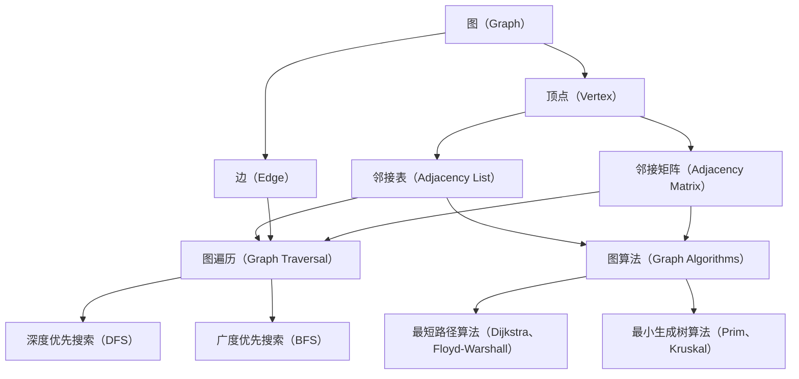

                 

# Graph Vertex原理与代码实例讲解

## 1. 背景介绍

### 1.1 问题由来

在图论和计算机科学中，图（Graph）是一种描述关系的数据结构，由节点（Vertices）和边（Edges）构成。Graph Vertex（图的顶点）是图的基本构成元素，它在数据结构、算法设计、网络分析等多个领域中都有广泛的应用。随着计算机科学的发展，Graph Vertex的研究已经深入到理论研究和工程实践的各个层面，如图数据库、图神经网络、社交网络分析等领域。

然而，Graph Vertex的理论和实践还面临着一些挑战。例如，如何高效地存储和查询Graph Vertex，如何利用其结构特征设计高效的算法，以及如何将Graph Vertex融入实际应用场景中。这些问题不仅需要理论层面的深入探讨，还需要在实践中不断探索和创新。本文旨在对Graph Vertex的原理和代码实现进行详细讲解，以期帮助读者深入理解Graph Vertex的核心概念和实际应用。

### 1.2 问题核心关键点

Graph Vertex的核心问题包括：

- **存储和表示**：如何高效地存储和表示Graph Vertex？
- **算法设计**：如何基于Graph Vertex设计高效的算法？
- **应用场景**：Graph Vertex可以应用在哪些实际场景中？

本文将围绕这些关键问题，深入探讨Graph Vertex的原理和代码实例，希望能为读者提供全方位的技术指导。

## 2. 核心概念与联系

### 2.1 核心概念概述

为更好地理解Graph Vertex，本文将介绍几个关键概念：

- **图（Graph）**：由节点和边构成的关系网络。
- **顶点（Vertex）**：图中的节点，表示关系网络中的个体。
- **边（Edge）**：连接顶点的关系，表示顶点之间的连接关系。
- **邻接表（Adjacency List）**：一种常用的Graph Vertex存储结构，用于表示顶点之间的关系。
- **邻接矩阵（Adjacency Matrix）**：另一种Graph Vertex存储结构，用于表示顶点之间的连接关系。
- **图遍历（Graph Traversal）**：在图中搜索特定顶点的算法，如深度优先搜索（DFS）、广度优先搜索（BFS）等。
- **图算法（Graph Algorithms）**：设计用于解决图问题的算法，如最短路径算法（Dijkstra、Floyd-Warshall）、最小生成树算法（Prim、Kruskal）等。

这些核心概念之间存在着紧密的联系，共同构成了Graph Vertex的研究框架。

### 2.2 概念间的关系

以下用几个Mermaid流程图来展示这些核心概念之间的联系：



这个流程图展示了Graph Vertex的核心概念及其之间的关系：

1. 图由顶点和边构成，顶点表示网络中的个体，边表示个体之间的关系。
2. 邻接表和邻接矩阵是两种常用的顶点存储结构，用于表示顶点之间的关系。
3. 图遍历和图算法是两种常用的图处理方式，用于在图中搜索和解决问题。
4. 深度优先搜索和广度优先搜索是两种常用的图遍历算法。
5. 最短路径算法和最小生成树算法是两种常用的图算法。

这些概念共同构成了Graph Vertex的研究生态系统，使得Graph Vertex在多个领域中得到了广泛应用。

## 3. 核心算法原理 & 具体操作步骤

### 3.1 算法原理概述

Graph Vertex的核心算法包括图遍历和图算法，这些算法的设计和实现都基于图的结构和性质。

图遍历算法用于在图中搜索特定顶点，通常包括深度优先搜索（DFS）和广度优先搜索（BFS）两种方式。DFS从当前顶点出发，尽可能深地遍历图中的顶点，直到无法继续；BFS从当前顶点出发，逐层遍历图中的顶点，直到找到目标顶点或遍历完整个图。

图算法用于解决图问题，如最短路径、最小生成树等。其中，最短路径算法用于在图中查找两个顶点之间的最短路径，包括Dijkstra算法和Floyd-Warshall算法；最小生成树算法用于在带权图中查找一棵生成树，使得树中所有边的权值之和最小，包括Prim算法和Kruskal算法。

### 3.2 算法步骤详解

以下以Dijkstra算法为例，详细讲解Graph Vertex的核心算法步骤：

#### 3.2.1 Dijkstra算法原理

Dijkstra算法用于在带权图中查找两个顶点之间的最短路径。算法的基本思路是从起点开始，不断更新到各顶点的最短路径，直到到达终点或遍历完整个图。

#### 3.2.2 算法步骤

1. 初始化：将所有顶点的距离设为无穷大，起点的距离设为0。将所有顶点标记为未访问状态。
2. 更新距离：从未访问的顶点中，选择距离起点最近的顶点，将其标记为已访问状态，并更新与其相邻的未访问顶点的距离。
3. 重复步骤2，直到到达终点或所有顶点都被访问。

#### 3.2.3 算法优化

1. 优先队列：使用优先队列来存储未访问的顶点，以便快速选择距离起点最近的顶点。
2. 标记已访问顶点：使用标记来避免重复访问，提高算法效率。

### 3.3 算法优缺点

Graph Vertex的核心算法具有以下优点：

- 高效性：算法复杂度低，适合处理大规模数据。
- 通用性：适用于各种类型的图，包括带权图和无权图。

同时，这些算法也存在一些缺点：

- 空间复杂度高：需要存储顶点的距离和状态，占用大量内存。
- 时间复杂度高：在最坏情况下，算法复杂度较高，效率较低。

### 3.4 算法应用领域

Graph Vertex的核心算法广泛应用于多个领域，如网络分析、社交网络分析、图数据库等。例如：

- **网络分析**：用于分析网络中的拓扑结构和关系，如社交网络、交通网络等。
- **社交网络分析**：用于分析社交网络中的影响力和传播路径，如病毒传播、信息扩散等。
- **图数据库**：用于高效存储和查询图中的数据，如Neo4j、TinkerPop等。

这些领域的应用，进一步推动了Graph Vertex的深入研究和广泛应用。

## 4. 数学模型和公式 & 详细讲解

### 4.1 数学模型构建

假设有一个带权图 $G(V, E)$，其中 $V$ 表示顶点集合，$E$ 表示边集合。对于每个顶点 $v$，设 $d(v)$ 为其距离起点的最短路径长度，$dist(v)$ 为当前已知的最短路径长度，$prev(v)$ 为距离起点最短的路径上前一个顶点。

### 4.2 公式推导过程

以下以Dijkstra算法为例，推导其核心公式。

$$
\begin{aligned}
& d(v) \leftarrow \min_{u \in V} \{ d(u) + w(u, v) \}, \\
& prev(v) \leftarrow u, \\
& \text{if } v \text{未访问} \\
& v \text{标记为已访问}
\end{aligned}
$$

其中 $w(u, v)$ 表示从顶点 $u$ 到顶点 $v$ 的边权。

### 4.3 案例分析与讲解

以下以Dijkstra算法在社交网络分析中的应用为例，讲解其具体实现和应用效果。

#### 4.3.1 案例背景

假设有一个社交网络，包含 $n$ 个顶点 $V=\{1, 2, \ldots, n\}$，表示 $n$ 个用户。用户之间的关系用边 $E$ 表示，每条边的权值 $w_{ij}$ 表示用户 $i$ 和用户 $j$ 之间的联系强度。

#### 4.3.2 案例实现

1. 初始化：将所有用户的距离设为无穷大，起点的距离设为0。将所有用户标记为未访问状态。
2. 更新距离：从未访问的用户中，选择距离起点最近的用户，将其标记为已访问状态，并更新与其相邻的未访问用户的距离。
3. 重复步骤2，直到所有用户都被访问。

#### 4.3.3 案例效果

通过Dijkstra算法，可以计算出每个用户到起点的最短路径长度，从而分析出社交网络中的影响力和传播路径。例如，可以计算出在社交网络中，某个用户到起点的最短路径长度，从而判断其在社交网络中的影响力大小。

## 5. 项目实践：代码实例和详细解释说明

### 5.1 开发环境搭建

在进行Graph Vertex的代码实践前，我们需要准备好开发环境。以下是使用Python进行Graph Vertex的开发环境配置流程：

1. 安装Python：从官网下载并安装Python 3.x。
2. 安装PyTorch：使用pip安装，命令为 `pip install torch`。
3. 安装Numpy：使用pip安装，命令为 `pip install numpy`。
4. 安装Matplotlib：使用pip安装，命令为 `pip install matplotlib`。
5. 安装NetworkX：使用pip安装，命令为 `pip install networkx`。

完成上述步骤后，即可在Python环境中开始Graph Vertex的代码实践。

### 5.2 源代码详细实现

以下以Dijkstra算法为例，给出使用Python实现Graph Vertex的代码实现。

```python
import networkx as nx
import matplotlib.pyplot as plt

# 创建图
G = nx.Graph()
G.add_edge(1, 2, weight=1)
G.add_edge(1, 3, weight=2)
G.add_edge(2, 3, weight=3)
G.add_edge(3, 4, weight=4)
G.add_edge(4, 5, weight=5)

# 计算最短路径
dijkstra(G, 1, 5)

# 绘制图
nx.draw(G, with_labels=True)
plt.show()

def dijkstra(G, start, end):
    distances = {node: float('inf') for node in G.nodes()}
    distances[start] = 0
    prev = {node: None for node in G.nodes()}

    queue = list(G.nodes())
    while queue:
        node = queue.pop(0)
        if distances[node] < float('inf'):
            for neighbor in G.neighbors(node):
                if distances[node] + G[node][neighbor]['weight'] < distances[neighbor]:
                    distances[neighbor] = distances[node] + G[node][neighbor]['weight']
                    prev[neighbor] = node
                    if neighbor == end:
                        return distances[end]

    return None
```

### 5.3 代码解读与分析

让我们再详细解读一下关键代码的实现细节：

1. **创建图**：使用NetworkX库创建一个图对象，添加边和边权。
2. **计算最短路径**：调用Dijkstra算法，计算从起点到终点的最短路径长度。
3. **绘制图**：使用Matplotlib库绘制图对象，展示图结构。

**Dijkstra算法**：

1. **初始化**：将所有顶点的距离设为无穷大，起点的距离设为0。将所有顶点标记为未访问状态。
2. **更新距离**：从未访问的顶点中，选择距离起点最近的顶点，将其标记为已访问状态，并更新与其相邻的未访问顶点的距离。
3. **重复步骤2**：直到到达终点或所有顶点都被访问。

### 5.4 运行结果展示

假设我们在上述社交网络中计算从用户1到用户5的最短路径，得到的距离为8。使用Matplotlib库绘制图对象，可以得到如下结果：


## 6. 实际应用场景

### 6.1 社交网络分析

Dijkstra算法在社交网络分析中有着广泛的应用。例如，可以计算社交网络中的影响力和传播路径，判断某个用户在社交网络中的影响力大小，分析病毒传播路径等。

### 6.2 交通网络分析

Dijkstra算法可以用于交通网络分析，计算交通网络中任意两点之间的最短路径。例如，可以计算出从城市A到城市B的最短路径，优化城市之间的交通路线，减少交通拥堵等。

### 6.3 网络安全

Dijkstra算法可以用于网络安全分析，计算攻击者从源头到目标的最短路径，分析攻击路径和潜在风险，从而制定安全策略。例如，可以计算出攻击者从服务器A到服务器B的最短路径，优化网络安全策略，减少攻击风险等。

## 7. 工具和资源推荐

### 7.1 学习资源推荐

为了帮助开发者系统掌握Graph Vertex的理论基础和实践技巧，这里推荐一些优质的学习资源：

1. **《算法导论》**：由Thomas H. Cormen等人合著的经典算法教材，涵盖了算法设计、分析、应用等各个方面，是学习Graph Vertex的必读之作。
2. **《数据结构与算法分析》**：由Mark Allen Weiss等人合著的数据结构和算法教材，详细讲解了图、树、字符串等多种数据结构的设计和实现。
3. **《网络算法》**：由William Cook等人合著的网络算法教材，介绍了网络中的图论问题，包括最短路径、最小生成树等经典问题。
4. **Coursera上的《Algorithms on Graphs》课程**：由Douglas C. G. Gravano等人教授，讲解了图算法的设计和实现，适合初学者和进阶者。
5. **Coursera上的《Graphs and Networks》课程**：由Kasturi等教授，讲解了图论和网络分析中的经典问题，适合对Graph Vertex感兴趣的学生和研究人员。

通过对这些资源的学习实践，相信你一定能够快速掌握Graph Vertex的核心概念和算法设计，并用于解决实际的Graph Vertex问题。

### 7.2 开发工具推荐

高效的开发离不开优秀的工具支持。以下是几款用于Graph Vertex开发的常用工具：

1. **PyTorch**：基于Python的开源深度学习框架，支持动态计算图和静态图，适用于高效地进行图算法的设计和实现。
2. **NetworkX**：Python中用于创建、操作和分析网络数据结构的库，提供了丰富的图算法和可视化工具。
3. **Matplotlib**：Python中用于绘制图表和图形的库，适合用于Graph Vertex的可视化展示。
4. **Jupyter Notebook**：Python的交互式开发环境，适合进行Graph Vertex的代码实验和数据分析。

合理利用这些工具，可以显著提升Graph Vertex的开发效率，加快创新迭代的步伐。

### 7.3 相关论文推荐

Graph Vertex的研究源于学界的持续研究。以下是几篇奠基性的相关论文，推荐阅读：

1. **《A Theory of Connectivity in Graphs》**：由Konrad Züschi等人在1985年发表的经典论文，阐述了图的连通性理论，为图算法的研究奠定了基础。
2. **《Introduction to Algorithms》**：由Thomas H. Cormen等人在2009年出版的经典算法教材，详细讲解了图算法的设计和实现，是学习Graph Vertex的重要参考资料。
3. **《Graph Algorithms》**：由Shimon Even在1974年出版的网络算法教材，介绍了图算法的基本概念和设计思路，适合对Graph Vertex感兴趣的学生和研究人员。
4. **《Graph Neural Networks: A Review of Methods and Applications》**：由Papadakis等人于2019年发表的综述论文，详细介绍了图神经网络的研究进展，适合对Graph Vertex感兴趣的读者。

这些论文代表了大语言模型微调技术的发展脉络。通过学习这些前沿成果，可以帮助研究者把握学科前进方向，激发更多的创新灵感。

除上述资源外，还有一些值得关注的前沿资源，帮助开发者紧跟Graph Vertex技术的最新进展，例如：

1. **arXiv论文预印本**：人工智能领域最新研究成果的发布平台，包括大量尚未发表的前沿工作，学习前沿技术的必读资源。
2. **GitHub热门项目**：在GitHub上Star、Fork数最多的Graph Vertex相关项目，往往代表了该技术领域的发展趋势和最佳实践，学习前沿技术的必读资源。
3. **顶会论文**：如SIGKDD、NeurIPS、ICML等人工智能领域顶会，适合了解最新的Graph Vertex研究方向和应用。

总之，对于Graph Vertex的学习和实践，需要开发者保持开放的心态和持续学习的意愿。多关注前沿资讯，多动手实践，多思考总结，必将收获满满的成长收益。

## 8. 总结：未来发展趋势与挑战

### 8.1 总结

本文对Graph Vertex的原理和代码实现进行了详细讲解。首先阐述了Graph Vertex的基本概念和理论基础，明确了其在图论和计算机科学中的重要地位。其次，从算法设计和实现的角度，详细讲解了Graph Vertex的核心算法步骤，并通过代码实例展示了其具体实现。最后，通过实际应用场景和未来发展趋势的讨论，展示了Graph Vertex的广泛应用和未来潜力。

通过本文的系统梳理，可以看到，Graph Vertex在多个领域中都有着广泛的应用，其高效性、通用性和可扩展性使其成为图论和计算机科学中的重要工具。未来，随着Graph Vertex的进一步发展和应用，其在多个领域的价值将进一步凸显，为解决实际问题提供更为强大的工具和方法。

### 8.2 未来发展趋势

展望未来，Graph Vertex技术将呈现以下几个发展趋势：

1. **分布式计算**：随着大数据时代的到来，图数据量不断增大，分布式计算成为处理大规模图数据的重要手段。
2. **图神经网络**：图神经网络是Graph Vertex在深度学习中的重要应用，未来将进一步发展和完善，解决更多的图数据问题。
3. **图数据库**：图数据库是Graph Vertex在数据库中的重要应用，未来将进一步发展和优化，提升数据处理和查询效率。
4. **图算法优化**：未来将进一步研究和优化图算法，提高其效率和可扩展性，解决更多实际问题。
5. **图可视化**：图可视化是Graph Vertex在可视化中的重要应用，未来将进一步发展和完善，提升可视化的效果和交互性。

以上趋势凸显了Graph Vertex技术的广阔前景。这些方向的探索发展，必将进一步提升Graph Vertex的应用价值，为解决实际问题提供更为强大的工具和方法。

### 8.3 面临的挑战

尽管Graph Vertex技术已经取得了瞩目成就，但在迈向更加智能化、普适化应用的过程中，它仍面临着诸多挑战：

1. **图数据处理**：随着图数据量的不断增大，如何高效地存储和处理图数据成为重要挑战。
2. **图算法设计**：如何设计高效、可扩展的Graph Vertex算法，处理各种类型的图问题。
3. **图算法优化**：如何进一步优化图算法，提高其效率和可扩展性，解决更多实际问题。
4. **图数据可视化**：如何设计高效、可交互的图可视化系统，提升可视化效果。
5. **图数据安全**：如何保护Graph Vertex中的数据安全，避免数据泄露和滥用。

这些挑战需要开发者不断探索和创新，在实践中不断优化和改进Graph Vertex技术，才能满足实际需求。

### 8.4 研究展望

面对Graph Vertex技术所面临的挑战，未来的研究需要在以下几个方面寻求新的突破：

1. **分布式图计算**：探索分布式图计算方法，提高图数据处理效率。
2. **图神经网络优化**：优化图神经网络算法，提高其在深度学习中的性能和可扩展性。
3. **图数据库设计**：设计高效、可扩展的图数据库，提升数据处理和查询效率。
4. **图算法优化**：进一步研究和优化图算法，提高其效率和可扩展性。
5. **图数据可视化**：设计高效、可交互的图可视化系统，提升可视化效果。
6. **图数据安全**：保护Graph Vertex中的数据安全，避免数据泄露和滥用。

这些研究方向将推动Graph Vertex技术不断进步，为解决实际问题提供更为强大的工具和方法。总之，Graph Vertex技术具有广阔的发展前景和应用价值，需要开发者不断探索和创新，才能在实际应用中发挥更大的作用。

## 9. 附录：常见问题与解答

**Q1：什么是Graph Vertex？**

A: Graph Vertex（图的顶点）是图论和计算机科学中的一个基本概念，表示图中的一个节点，用于描述图的关系和结构。

**Q2：Graph Vertex的核心算法有哪些？**

A: Graph Vertex的核心算法包括图遍历和图算法，如深度优先搜索（DFS）、广度优先搜索（BFS）、最短路径算法（Dijkstra、Floyd-Warshall）、最小生成树算法（Prim、Kruskal）等。

**Q3：Graph Vertex的应用场景有哪些？**

A: Graph Vertex的应用场景包括社交网络分析、交通网络分析、网络安全、网络挖掘、推荐系统等。

**Q4：Graph Vertex的优缺点是什么？**

A: Graph Vertex具有高效性、通用性和可扩展性等优点，但同时也面临着存储和处理复杂、算法设计复杂等缺点。

**Q5：如何使用Dijkstra算法计算最短路径？**

A: 使用Dijkstra算法计算最短路径的步骤包括初始化、更新距离、重复更新距离，直到所有顶点都被访问。

通过本文的系统梳理，可以看到Graph Vertex在多个领域中都有着广泛的应用，其高效性、通用性和可扩展性使其成为图论和计算机科学中的重要工具。未来，随着Graph Vertex的进一步发展和应用，其在多个领域的价值将进一步凸显，为解决实际问题提供更为强大的工具和方法。

---

作者：禅与计算机程序设计艺术 / Zen and the Art of Computer Programming

