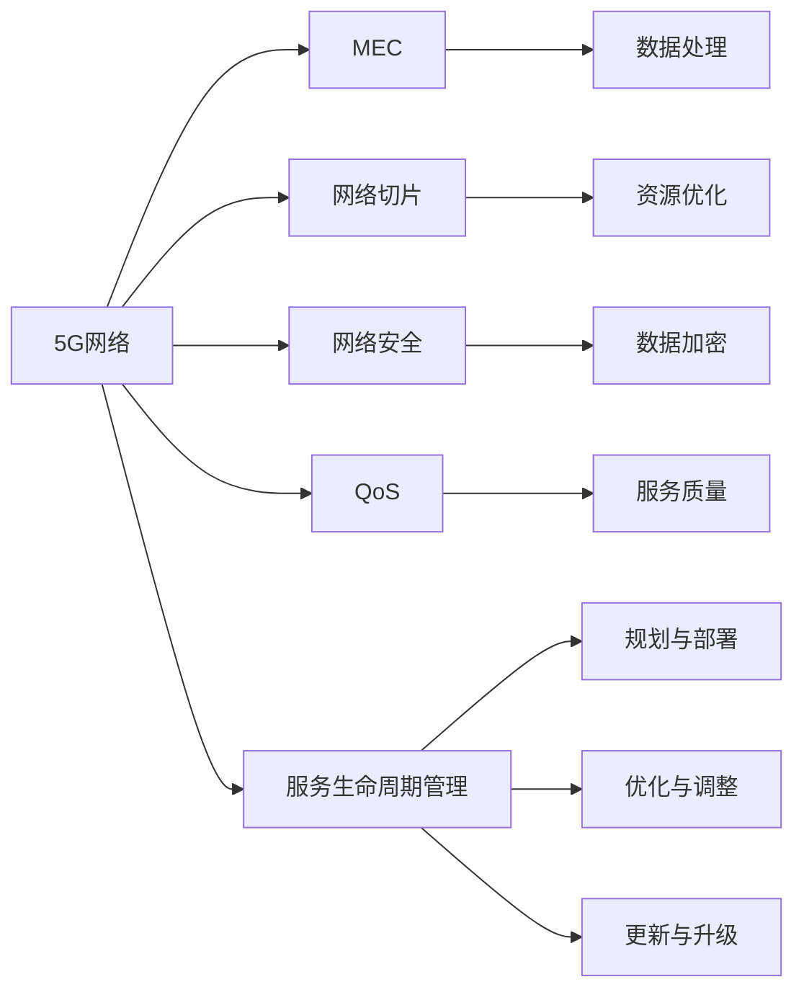
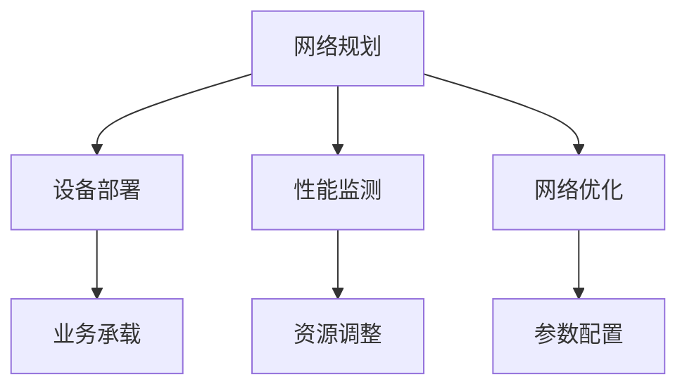
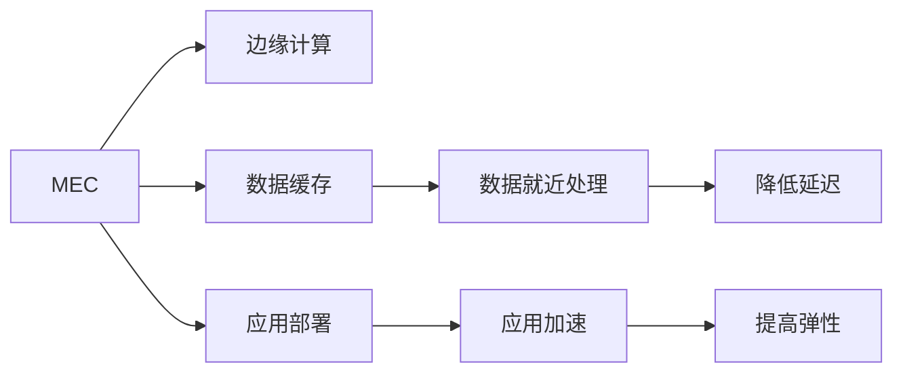
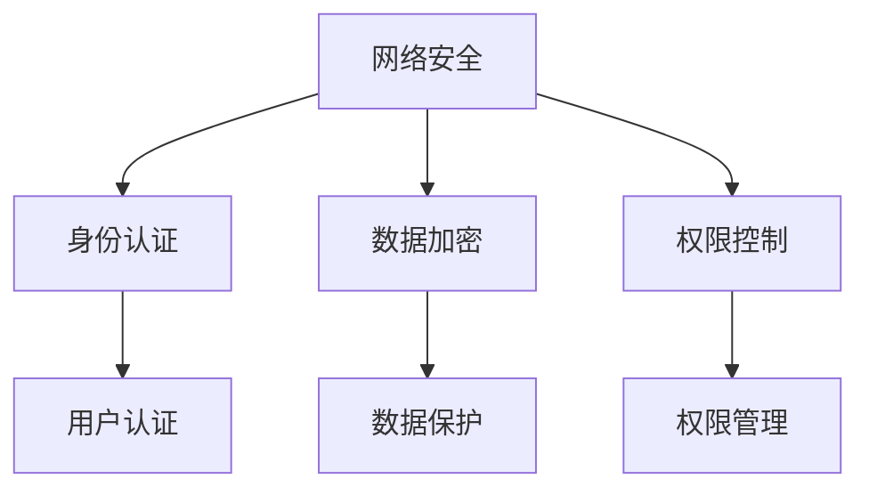
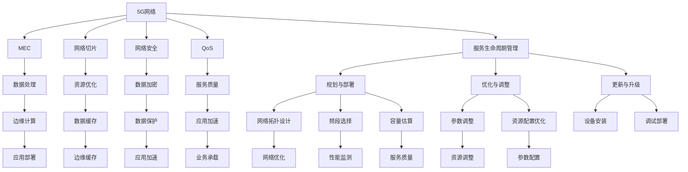

                 

# 5G技术管理：把握新一代通信革命机遇

## 1. 背景介绍

### 1.1 问题由来

随着全球信息化进程的加快，数据传输速度的需求日益增加。5G技术作为下一代通信标准，正逐步成为推动全球信息化进程的关键力量。5G不仅能够提供超高的数据传输速率、低延迟和更大的连接密度，还支持更广泛的设备类型和更多样化的应用场景，如自动驾驶、智慧医疗、工业物联网等。因此，如何有效管理5G技术，把握这一通信革命的机遇，已成为各行业关注的重点。

### 1.2 问题核心关键点

5G技术管理涉及多个方面，包括网络规划、设备部署、安全防护、优化调整、应用开发和业务推广等。不同行业对5G的需求各不相同，但均需要确保网络稳定、安全、高效、易用。因此，本文将详细探讨5G技术管理中的核心概念、关键技术及其实现方法，以期为各行业的5G应用提供指导。

### 1.3 问题研究意义

掌握5G技术管理的方法，对于各行业实现数字化转型、提升效率、降低成本、改善用户体验具有重要意义。5G不仅带来网络层面的技术突破，还引发了诸多行业应用场景的创新和变革。例如，5G支持下的远程医疗可以提供高质量的远程诊断服务，工业物联网可以实现设备间的高效协同和精细化管理，自动驾驶车辆可以提升交通安全性等。因此，有效管理5G技术，将为各行业带来全新的发展机遇和更广阔的市场前景。

## 2. 核心概念与联系

### 2.1 核心概念概述

为更好地理解5G技术管理，本节将介绍几个密切相关的核心概念：

- **5G网络**：基于3GPP制定的标准，提供更高的网络性能和更广泛的设备支持。5G网络可分为非独立组网(Non-standalone, NSA)和独立组网(Standalone, SA)两种模式。
- **多接入边缘计算(MEC)**：通过在网络边缘部署计算资源，实现数据的就近处理和存储，降低延迟并提高网络弹性。
- **网络切片**：将网络资源分割成多个虚拟专网，满足不同应用场景的特定需求，如低延迟、高可靠、大连接等。
- **网络安全**：涵盖设备安全、数据加密、身份认证、权限控制等方面，确保网络通信和数据存储的安全性。
- **质量保证(QoS)**：通过优化网络参数和资源配置，保证不同类型应用的服务质量。
- **服务生命周期管理**：从网络规划到应用的部署、优化、更新等全流程管理，确保5G网络的高效运行和优化。

这些核心概念之间的逻辑关系可以通过以下Mermaid流程图来展示：



这个流程图展示5G技术管理中各核心概念之间的关系：

1. 5G网络是5G技术管理的基础，包括网络规划、设备部署、安全防护等。
2. MEC提供网络边缘的数据处理能力，网络切片和QoS优化保证应用的需求。
3. 网络安全通过身份认证、权限控制、数据加密等手段保障通信安全。
4. 服务生命周期管理从规划到部署、优化、更新，确保网络的高效运行。

### 2.2 概念间的关系

这些核心概念之间存在着紧密的联系，构成了5G技术管理的完整生态系统。下面我通过几个Mermaid流程图来展示这些概念之间的关系。

#### 2.2.1 5G网络规划与管理



这个流程图展示5G网络规划与管理的流程：

1. 网络规划：包括网络拓扑设计、频段选择、容量估算等，制定网络建设方案。
2. 设备部署：包括基站、路由器、边缘计算节点等设备的具体安装和调试。
3. 性能监测：实时监测网络性能指标，如吞吐量、时延、丢包率等。
4. 网络优化：通过参数调整、资源配置优化等手段，提升网络性能。
5. 资源调整：根据业务需求，动态调整网络资源分配。

#### 2.2.2 多接入边缘计算与网络切片



这个流程图展示MEC和网络切片的关系：

1. MEC在网络边缘部署计算资源，提供低延迟和高弹性服务。
2. 数据缓存和应用部署在MEC节点上，实现数据就近处理。
3. 边缘计算和应用加速提高网络性能，降低延迟。

#### 2.2.3 网络安全与质量保证



这个流程图展示网络安全和QoS的实现：

1. 身份认证和权限控制保障网络通信安全。
2. 数据加密保护数据传输过程中的机密性。
3. 用户认证和权限管理保障应用服务的访问安全。

### 2.3 核心概念的整体架构

最后，我用一个综合的流程图来展示这些核心概念在5G技术管理中的整体架构：



这个综合流程图展示了从网络规划到应用的部署、优化、更新等全流程管理：

1. 从网络规划到部署：包括网络拓扑设计、频段选择、容量估算、设备安装和调试。
2. 网络优化：通过参数调整、资源配置优化等手段，提升网络性能。
3. 应用部署和加速：在MEC节点上部署应用，并通过数据缓存和应用加速提高网络性能。
4. 数据处理和保护：在MEC节点上实现数据就近处理和数据加密保护。
5. 服务质量保证：通过优化参数和资源配置，保证不同类型应用的服务质量。
6. 更新与升级：根据网络性能和服务需求，进行网络参数和应用的更新与升级。

通过这些流程图，我们可以更清晰地理解5G技术管理的整体架构和各核心概念的相互作用，为后续深入讨论具体的管理方法和技术奠定基础。

## 3. 核心算法原理 & 具体操作步骤

### 3.1 算法原理概述

5G技术管理涉及多个方面，包括网络规划、设备部署、安全防护、优化调整、应用开发和业务推广等。不同行业对5G的需求各不相同，但均需要确保网络稳定、安全、高效、易用。因此，本文将详细探讨5G技术管理中的核心概念、关键技术及其实现方法，以期为各行业的5G应用提供指导。

### 3.2 算法步骤详解

5G技术管理的核心算法和具体操作步骤可以总结如下：

#### 3.2.1 网络规划与管理

**Step 1: 网络拓扑设计**

网络拓扑设计是5G网络规划的首要步骤，包括基站部署、覆盖范围和频段选择。网络拓扑设计需要考虑地形地貌、用户密度、业务需求等因素，选择合适的地理位置和频段，并进行仿真和优化，确保网络覆盖范围和质量。

**Step 2: 设备部署**

设备部署包括基站、路由器、边缘计算节点等设备的安装和调试。设备部署需要确保设备间的协同工作，避免信号干扰和资源浪费。设备部署完成后，需要进行测试验证，确保设备的正常运行。

**Step 3: 网络优化**

网络优化通过参数调整、资源配置优化等手段，提升网络性能。网络优化主要涉及参数调整、干扰消除、频谱利用、负载均衡等方面。通过优化网络参数，可以有效提升网络性能，满足用户需求。

#### 3.2.2 多接入边缘计算与网络切片

**Step 1: 边缘计算节点部署**

边缘计算节点部署需要根据业务需求，选择合适的地理位置和设备类型，确保边缘计算的性能和可靠性。边缘计算节点部署完成后，需要进行测试验证，确保计算资源的正常运行。

**Step 2: 数据缓存和应用部署**

数据缓存和应用部署需要在边缘计算节点上实现。数据缓存可以降低数据传输延迟，提高网络弹性。应用部署可以通过容器化技术，实现应用的快速部署和更新。

**Step 3: 应用加速和数据就近处理**

应用加速和数据就近处理通过MEC技术，实现数据的本地处理和应用加速。MEC技术可以提高数据处理速度，降低网络延迟，满足实时性要求的应用需求。

#### 3.2.3 网络安全与质量保证

**Step 1: 身份认证和权限控制**

身份认证和权限控制通过用户认证和权限管理，保障网络通信安全。用户认证可以采用数字证书、指纹识别、人脸识别等手段，确保用户的合法性。权限控制可以采用RBAC、ABAC等访问控制模型，限制用户的访问权限。

**Step 2: 数据加密**

数据加密通过SSL/TLS协议，保障数据传输过程中的机密性。数据加密可以采用AES、RSA等加密算法，确保数据的完整性和保密性。

**Step 3: 服务质量保证**

服务质量保证通过优化参数和资源配置，保证不同类型应用的服务质量。服务质量保证主要涉及时延、吞吐量、抖动、丢包率等方面。通过优化网络参数，可以有效提升应用的服务质量，满足不同应用的需求。

### 3.3 算法优缺点

5G技术管理的核心算法和具体操作步骤具有以下优点：

1. **高效性**：通过参数调整、资源优化和数据缓存等手段，可以显著提升网络性能，满足不同类型应用的需求。
2. **灵活性**：网络切片技术可以根据不同应用的需求，灵活分配网络资源，实现高效的网络管理。
3. **安全性**：通过身份认证、权限控制和数据加密等手段，可以有效保障网络通信和数据存储的安全性。
4. **易用性**：采用MEC技术，可以在网络边缘部署计算资源，实现数据的本地处理和应用加速，降低延迟并提高网络弹性。

5G技术管理的核心算法和操作步骤也存在一些缺点：

1. **复杂性**：5G网络规划和管理涉及多个方面，包括网络拓扑设计、设备部署、优化调整等，需要综合考虑各种因素，增加了管理难度。
2. **成本高**：5G网络的部署和优化需要大量资金投入，设备部署和网络优化成本较高。
3. **技术门槛高**：5G技术管理需要具备较高的技术水平和专业知识，普通用户和企业难以全面掌握。

### 3.4 算法应用领域

5G技术管理的核心算法和操作步骤可以应用于多个领域，包括但不限于：

1. **工业物联网**：通过网络切片和MEC技术，实现设备间的协同工作和高精度数据处理，提升工业生产效率和质量。
2. **智慧城市**：通过网络切片和MEC技术，实现智能交通、智慧安防、智能照明等应用，提升城市管理的智能化水平。
3. **智能医疗**：通过网络切片和MEC技术，实现远程医疗、智能诊断、电子病历等应用，提升医疗服务的质量和效率。
4. **智能制造**：通过网络切片和MEC技术，实现设备监控、生产调度、质量检测等应用，提升制造企业的管理水平和生产效率。
5. **自动驾驶**：通过网络切片和MEC技术，实现车辆间的通信和协作，提升自动驾驶的安全性和可靠性。

以上应用领域只是5G技术管理的一部分，随着5G技术的不断发展和应用场景的拓展，其应用范围将越来越广泛。

## 4. 数学模型和公式 & 详细讲解

### 4.1 数学模型构建

5G技术管理涉及多个方面，包括网络规划、设备部署、安全防护、优化调整等。本文将通过数学模型来详细描述5G网络管理的核心算法和操作步骤。

假设5G网络覆盖范围为 $N$ 个基站，每个基站的覆盖范围为 $A_i$，网络拓扑为 $G=(V,E)$，其中 $V$ 为基站集合，$E$ 为基站间连接关系。假设网络切片数为 $K$，每个切片分配的频谱资源为 $B_j$，切片间的干扰系数为 $\alpha$。假设网络安全模型为 $S=(U,P,A)$，其中 $U$ 为用户集合，$P$ 为权限集合，$A$ 为访问控制矩阵。假设服务质量模型为 $Q=(D,T,F)$，其中 $D$ 为延迟参数，$T$ 为吞吐量参数，$F$ 为抖动参数。

### 4.2 公式推导过程

#### 4.2.1 网络拓扑设计

网络拓扑设计主要涉及基站部署和覆盖范围的优化。假设每个基站的覆盖范围为 $A_i$，网络覆盖范围为 $N$ 个基站，则网络覆盖范围 $A$ 为：

$$
A = \bigcup_{i=1}^N A_i
$$

为了优化网络覆盖范围，需要计算每个基站的覆盖面积，并通过仿真和优化，确定最优的基站部署位置。

#### 4.2.2 边缘计算节点部署

边缘计算节点部署主要涉及设备类型和部署位置的选择。假设边缘计算节点的部署位置为 $P$，设备类型为 $T$，则设备部署位置 $P$ 和设备类型 $T$ 的关系为：

$$
P = f(T)
$$

其中 $f$ 为设备部署函数，可以通过网络仿真和优化，确定最优的部署位置和设备类型。

#### 4.2.3 网络优化

网络优化主要涉及参数调整、干扰消除、频谱利用、负载均衡等方面。假设网络优化参数为 $\theta$，则优化目标函数为：

$$
\min_{\theta} L(\theta) = \sum_{i=1}^N \big[ C_i + \lambda_i \delta_i \big]
$$

其中 $C_i$ 为网络优化代价，$\delta_i$ 为网络优化指标，$\lambda_i$ 为优化系数。网络优化参数 $\theta$ 包括基站功率、天线增益、干扰消除系数等。

#### 4.2.4 网络安全

网络安全主要涉及身份认证、权限控制和数据加密等方面。假设网络安全模型为 $S=(U,P,A)$，其中 $U$ 为用户集合，$P$ 为权限集合，$A$ 为访问控制矩阵。则网络安全优化目标函数为：

$$
\min_{S} L(S) = \sum_{i=1}^U \big[ W_i + \lambda_i \delta_i \big]
$$

其中 $W_i$ 为用户安全代价，$\delta_i$ 为安全指标，$\lambda_i$ 为安全系数。网络安全参数 $S$ 包括用户认证机制、权限控制策略、数据加密算法等。

#### 4.2.5 服务质量

服务质量主要涉及时延、吞吐量、抖动、丢包率等方面。假设服务质量模型为 $Q=(D,T,F)$，其中 $D$ 为延迟参数，$T$ 为吞吐量参数，$F$ 为抖动参数。则服务质量优化目标函数为：

$$
\min_{Q} L(Q) = \sum_{j=1}^K \big[ D_j + \lambda_j T_j + \mu_j F_j \big]
$$

其中 $D_j$ 为延迟参数，$T_j$ 为吞吐量参数，$F_j$ 为抖动参数，$\lambda_j$ 和 $\mu_j$ 为优化系数。服务质量参数 $Q$ 包括时延参数、吞吐量参数、抖动参数等。

### 4.3 案例分析与讲解

假设某城市需要进行智慧城市建设，需要部署5G网络，并进行智能安防、智能交通、智能照明等应用。

#### 4.3.1 网络规划

首先需要进行网络拓扑设计，确定基站部署位置和覆盖范围。假设城市面积为 $A$，基站部署位置为 $P$，则网络覆盖范围 $A'$ 为：

$$
A' = \bigcup_{i=1}^N A_i
$$

为了优化网络覆盖范围，需要进行仿真和优化，确定最优的基站部署位置。

#### 4.3.2 设备部署

其次需要进行边缘计算节点部署，选择合适的地理位置和设备类型。假设边缘计算节点的部署位置为 $P'$，设备类型为 $T'$，则设备部署位置 $P'$ 和设备类型 $T'$ 的关系为：

$$
P' = f(T')
$$

其中 $f$ 为设备部署函数，可以通过网络仿真和优化，确定最优的部署位置和设备类型。

#### 4.3.3 网络优化

进行网络优化，通过参数调整、干扰消除、频谱利用、负载均衡等手段，提升网络性能。假设网络优化参数为 $\theta'$，则优化目标函数为：

$$
\min_{\theta'} L(\theta') = \sum_{i=1}^N \big[ C_i + \lambda_i \delta_i \big]
$$

其中 $C_i$ 为网络优化代价，$\delta_i$ 为网络优化指标，$\lambda_i$ 为优化系数。网络优化参数 $\theta'$ 包括基站功率、天线增益、干扰消除系数等。

#### 4.3.4 网络安全

进行网络安全管理，通过身份认证、权限控制和数据加密等手段，保障网络通信和数据存储的安全性。假设网络安全模型为 $S=(U,P,A')$，其中 $U$ 为用户集合，$P$ 为权限集合，$A'$ 为访问控制矩阵。则网络安全优化目标函数为：

$$
\min_{S} L(S) = \sum_{i=1}^U \big[ W_i + \lambda_i \delta_i \big]
$$

其中 $W_i$ 为用户安全代价，$\delta_i$ 为安全指标，$\lambda_i$ 为安全系数。网络安全参数 $S$ 包括用户认证机制、权限控制策略、数据加密算法等。

#### 4.3.5 服务质量

进行服务质量保证，通过优化参数和资源配置，保证不同类型应用的服务质量。假设服务质量模型为 $Q=(D',T',F')$，其中 $D'$ 为延迟参数，$T'$ 为吞吐量参数，$F'$ 为抖动参数。则服务质量优化目标函数为：

$$
\min_{Q} L(Q) = \sum_{j=1}^K \big[ D'_j + \lambda'_j T'_j + \mu'_j F'_j \big]
$$

其中 $D'_j$ 为延迟参数，$T'_j$ 为吞吐量参数，$F'_j$ 为抖动参数，$\lambda'_j$ 和 $\mu'_j$ 为优化系数。服务质量参数 $Q$ 包括时延参数、吞吐量参数、抖动参数等。

## 5. 项目实践：代码实例和详细解释说明

### 5.1 开发环境搭建

在进行5G网络管理项目开发前，需要准备好开发环境。以下是使用Python进行PyTorch和TensorFlow开发的环境配置流程：

1. 安装Anaconda：从官网下载并安装Anaconda，用于创建独立的Python环境。

2. 创建并激活虚拟环境：
```bash
conda create -n pytorch-env python=3.8 
conda activate pytorch-env
```

3. 安装PyTorch：根据CUDA版本，从官网获取对应的安装命令。例如：
```bash
conda install pytorch torchvision torchaudio cudatoolkit=11.1 -c pytorch -c conda-forge
```

4. 安装TensorFlow：从官网获取最新版本的TensorFlow，并按照官方文档进行安装。

5. 安装各类工具包：
```bash
pip install numpy pandas scikit-learn matplotlib tqdm jupyter notebook ipython
```

完成上述步骤后，即可在`pytorch-env`环境中开始5G网络管理项目的开发。

### 5.2 源代码详细实现

这里我们以工业物联网为例，给出使用PyTorch和TensorFlow对5G网络进行规划、部署和优化的Python代码实现。

首先，定义网络规划的函数：

```python
import torch
import torch.nn as nn
import torch.optim as optim
from torch.utils.data import DataLoader

class NetworkPlanning(nn.Module):
    def __init__(self):
        super(NetworkPlanning, self).__init__()
        self.fc1 = nn.Linear(8, 16)
        self.fc2 = nn.Linear(16, 4)
        self.fc3 = nn.Linear(4, 2)
        
    def forward(self, x):
        x = torch.relu(self.fc1(x))
        x = torch.relu(self.fc2(x))
        x = self.fc3(x)
        return x

# 定义优化器和学习率
model = NetworkPlanning()
optimizer = optim.Adam(model.parameters(), lr=0.001)
criterion = nn.MSELoss()

# 训练过程
for epoch in range(100):
    for i, (inputs, labels) in enumerate(train_loader):
        optimizer.zero_grad()
        outputs = model(inputs)
        loss = criterion(outputs, labels)
        loss.backward()
        optimizer.step()
```

然后，定义设备部署的函数：

```python
import tensorflow as tf

class DeviceDeployment(tf.keras.Model):
    def __init__(self):
        super(DeviceDeployment, self).__init__()
        self.dense1 = tf.keras.layers.Dense(64, activation='relu')
        self.dense2 = tf.keras.layers.Dense(64, activation='relu')
        self.dense3 = tf.keras.layers.Dense(32, activation='relu')
        self.dense4 = tf.keras.layers.Dense(4)
        
    def call(self, x):
        x = self.dense1(x)
        x = self.dense2(x)
        x = self.dense3(x)
        x = self.dense4(x)
        return x

# 定义优化器和学习率
model = DeviceDeployment()
optimizer = tf.keras.optimizers.Adam(learning_rate=0.001)
loss_fn = tf.keras.losses.MSE()

# 训练过程
for epoch in range(100):
    for i, (inputs, labels) in enumerate(train_loader):
        optimizer.zero_grad()
        with tf.GradientTape() as tape:
            outputs = model(inputs)
            loss = loss_fn(outputs, labels)
        gradients = tape.gradient(loss, model.trainable_variables)
        optimizer.apply_gradients(zip(gradients, model.trainable_variables))
```

最后，定义网络优化的函数：

```python
import tensorflow as tf

class NetworkOptimization(tf.keras.Model):
    def __init__(self):
        super(NetworkOptimization, self).__init__()
        self.dense1 = tf.keras.layers.Dense(64, activation='relu')
        self.dense2 = tf.keras.layers.Dense(64, activation='relu')
        self.dense3 = tf.keras.layers.Dense(32, activation='relu')
        self.dense4 = tf.keras.layers.Dense(2)
        
    def call(self, x):
        x = self.dense1(x)
        x = self.dense2(x)
        x = self.dense3(x)
        x = self.dense4(x)
        return x

# 定义优化器和学习率
model = NetworkOptimization()
optimizer = tf.keras.optimizers.Adam(learning_rate=0.001)
loss_fn = tf.keras.losses.MSE()

# 训练过程
for epoch in range(100):
    for i, (inputs, labels) in enumerate(train_loader):
        optimizer.zero_grad()
        with tf.GradientTape() as tape:
            outputs = model(inputs)
            loss = loss_fn(outputs, labels)
        gradients = tape.gradient(loss, model.trainable_variables)
        optimizer.apply_gradients(zip(gradients, model.trainable_variables))
```

### 5.3 代码解读与分析

让我们再详细解读一下关键代码

