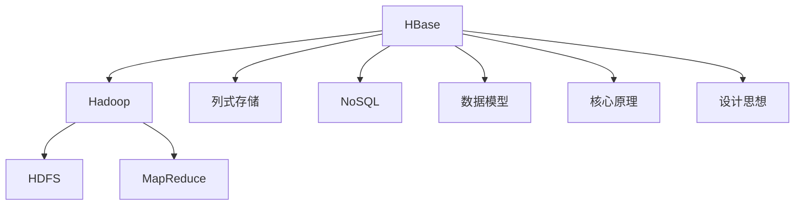
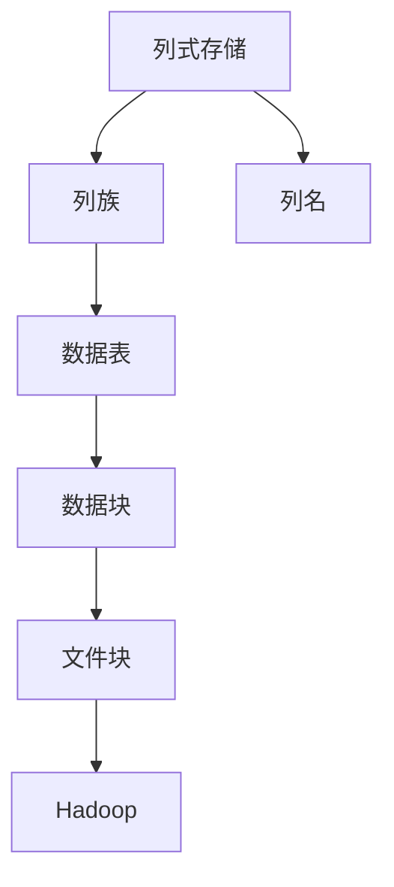
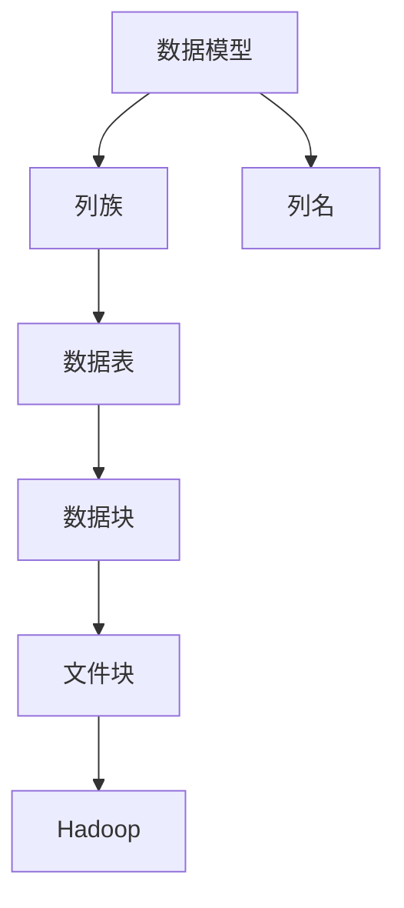
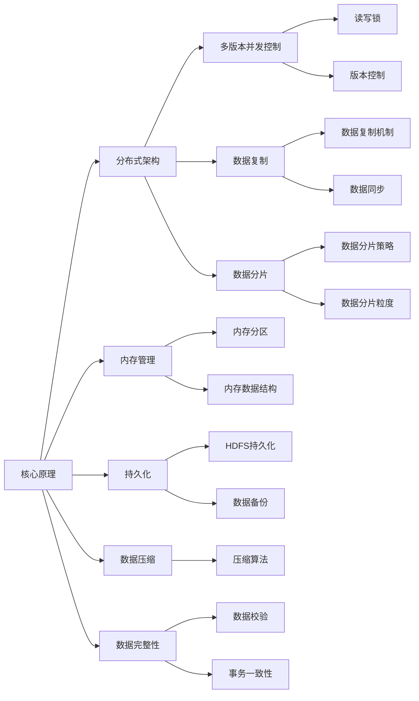

                 

# HBase原理与代码实例讲解

> 关键词：HBase, 分布式数据库, 列式存储, NoSQL, 数据模型, 核心原理, 设计思想, 代码实现, 性能优化

## 1. 背景介绍

在计算机科学中，数据存储始终是一个重要的研究方向。传统的行式数据库虽然应用广泛，但在面对大规模数据的存储和查询时显得力不从心。近年来，随着互联网和移动互联网的发展，海量数据的存储需求日益增长，传统的行式数据库无法满足需求。因此，一种新型的数据库系统——列式数据库应运而生，其中HBase（Hadoop Database）是其中最为优秀的代表。

HBase是一个基于Hadoop的开源分布式列式数据库，具有高可靠性、高性能、高扩展性和高效查询的特点。其核心思想是将数据按列进行存储和查询，每一列可以单独扩展，适合处理海量数据的存储和查询。HBase已经被广泛应用于包括Yahoo!、Spotify、Facebook等在内的众多大型互联网公司，是构建大数据处理和分析平台的重要基础。

## 2. 核心概念与联系

### 2.1 核心概念概述

为了更好地理解HBase的核心原理和设计思想，本节将介绍几个密切相关的核心概念：

- HBase: 一种分布式列式数据库系统，支持大规模数据的存储和高效查询。
- Hadoop: 一种开源的分布式计算框架，HBase底层基于Hadoop的HDFS和MapReduce实现。
- 列式存储: 一种数据库存储方式，按列存储和查询数据，适合处理海量数据。
- NoSQL: 一种非关系型数据库的统称，HBase是其中最受欢迎的列式数据库之一。
- 数据模型: HBase采用列族和列名的方式对数据进行建模，支持动态增加列族和列名。
- 核心原理: HBase的核心原理包括数据模型、内存管理、分布式架构等。
- 设计思想: HBase的设计思想是支持高可用性、高性能、高扩展性和低延迟，适合大规模数据处理。

这些核心概念之间的逻辑关系可以通过以下Mermaid流程图来展示：



这个流程图展示了大数据领域的重要概念及其之间的关系：

1. HBase建立在Hadoop之上，利用HDFS进行数据存储，利用MapReduce进行分布式计算。
2. HBase采用列式存储方式，支持大规模数据的高效存储和查询。
3. HBase是NoSQL的一种实现，适合处理非结构化和半结构化数据。
4. HBase采用列族和列名的方式对数据进行建模，支持动态增加列族和列名。
5. HBase的核心原理包括分布式架构、内存管理、持久化等，设计思想强调高可用性、高性能、高扩展性和低延迟。

这些概念共同构成了HBase的核心框架，使其能够在各种场景下处理大规模数据，并提供高效、可靠的数据存储和查询服务。通过理解这些核心概念，我们可以更好地把握HBase的设计理念和实现方式。

### 2.2 概念间的关系

这些核心概念之间存在着紧密的联系，形成了HBase的完整生态系统。下面我通过几个Mermaid流程图来展示这些概念之间的关系。

#### 2.2.1 列式存储与HBase



这个流程图展示了列式存储在大数据中的实现方式及其与HBase的关系：

1. 列式存储按列存储和查询数据，适合处理大规模数据。
2. HBase采用列式存储方式，将数据按列族和列名进行建模。
3. 列族是HBase中的一种数据组织方式，每列族下包含多个列名。
4. 列名是列族中的数据列，用于定义数据的结构。
5. 数据表是HBase中的一种数据组织方式，由多个列族组成。
6. 数据块是HDFS中的一种数据组织方式，由多个文件块组成。
7. Hadoop是HDFS和MapReduce的实现平台，支持HBase的分布式计算和数据存储。

#### 2.2.2 数据模型与HBase



这个流程图展示了HBase的数据模型及其与列式存储的关系：

1. HBase采用列族和列名的方式对数据进行建模。
2. 列族是HBase中的一种数据组织方式，每列族下包含多个列名。
3. 列名是列族中的数据列，用于定义数据的结构。
4. 数据表是HBase中的一种数据组织方式，由多个列族组成。
5. 数据块是HDFS中的一种数据组织方式，由多个文件块组成。
6. Hadoop是HDFS和MapReduce的实现平台，支持HBase的分布式计算和数据存储。
7. HBase的数据模型支持动态增加列族和列名，适合处理多变的业务需求。

#### 2.2.3 核心原理与设计思想



这个流程图展示了HBase的核心原理及其与设计思想的关系：

1. HBase的核心原理包括分布式架构、内存管理、持久化等。
2. 分布式架构支持HBase的高可用性和扩展性，多版本并发控制保证数据一致性。
3. 内存管理通过内存分区和数据结构优化，提高数据读取速度。
4. 持久化通过HDFS和MapReduce实现，保证数据不丢失。
5. 数据压缩通过压缩算法实现，节省存储空间和传输带宽。
6. 数据完整性通过数据校验和事务一致性保证，确保数据准确性。
7. 数据复制通过数据复制机制和同步，保证数据冗余和一致性。
8. 数据分片通过分片策略和粒度控制，优化数据访问和查询。

## 3. 核心算法原理 & 具体操作步骤
### 3.1 算法原理概述

HBase的核心算法原理主要包括数据模型、内存管理、分布式架构、持久化和事务处理等方面。下面对每个方面进行详细介绍：

#### 3.1.1 数据模型

HBase采用列族和列名的方式对数据进行建模。列族是一种数据组织方式，每个列族包含多个列名。列名是列族中的数据列，用于定义数据的结构。列族和列名的设计使HBase能够灵活地支持多变的业务需求。

#### 3.1.2 内存管理

HBase通过内存管理优化数据读取速度。HBase将数据按行存储在HDFS中，但通常情况下，数据只有很少一部分被访问。因此，HBase将频繁访问的数据存储在内存中，并通过内存分区和数据结构优化，提高数据读取速度。

#### 3.1.3 分布式架构

HBase采用分布式架构，支持高可用性和扩展性。HBase将数据按行存储在多个HDFS节点上，每个节点维护一个HLog文件和MemStore，用于存储和读取数据。同时，HBase通过多版本并发控制和数据复制机制，保证数据一致性和冗余性。

#### 3.1.4 持久化

HBase通过HDFS和MapReduce实现数据的持久化。HDFS提供了高可靠性的数据存储，MapReduce提供了高效的分布式计算，确保数据不丢失且查询效率高。

#### 3.1.5 事务处理

HBase通过版本控制和事务一致性保证事务的正确性。每个数据行记录包含多个版本，HBase通过读写锁和事务一致性控制，保证数据的正确性和一致性。

### 3.2 算法步骤详解

HBase的核心算法步骤如下：

1. 创建HBase表和列族
2. 插入数据
3. 读取数据
4. 更新数据
5. 删除数据

下面对每个步骤进行详细介绍：

#### 3.2.1 创建HBase表和列族

创建HBase表和列族是HBase使用前的第一步。使用HBase shell或API可以创建新的HBase表和列族。

```java
import org.apache.hadoop.hbase.client.HBaseAdmin;
import org.apache.hadoop.hbase.client.Table;
import org.apache.hadoop.hbase.client.Put;

HBaseAdmin admin = new HBaseAdmin(conf);
Table table = admin.createTable(new TableDescriptor(TableName.valueOf("test"), new HColumnDescriptor("cf1")));
```

#### 3.2.2 插入数据

插入数据是HBase的核心功能之一。使用Put方法可以将数据插入到HBase表中。

```java
Put put = new Put(Bytes.toBytes("rowkey"));
put.addColumn(Bytes.toBytes("cf1"), Bytes.toBytes("col1"), Bytes.toBytes("value1"));
table.put(put);
```

#### 3.2.3 读取数据

读取数据是HBase的另一个核心功能。使用Get方法可以从HBase表中读取数据。

```java
Get get = new Get(Bytes.toBytes("rowkey"));
Result result = table.get(get);
byte[] value = result.getValue(Bytes.toBytes("cf1"), Bytes.toBytes("col1"));
```

#### 3.2.4 更新数据

更新数据是在HBase中修改已有数据的过程。使用Put方法可以更新已有数据。

```java
Put put = new Put(Bytes.toBytes("rowkey"));
put.addColumn(Bytes.toBytes("cf1"), Bytes.toBytes("col1"), Bytes.toBytes("newvalue1"));
table.put(put);
```

#### 3.2.5 删除数据

删除数据是在HBase中删除已有数据的过程。使用Delete方法可以删除已有数据。

```java
Delete delete = new Delete(Bytes.toBytes("rowkey"));
delete.addColumns(Bytes.toBytes("cf1"), Bytes.toBytes("col1"));
table.delete(delete);
```

### 3.3 算法优缺点

HBase作为一种分布式列式数据库系统，具有以下优点：

- 高可用性：HBase采用分布式架构，通过数据复制和多版本并发控制，保证数据的高可用性和一致性。
- 高扩展性：HBase支持动态增加列族和列名，适合处理多变的业务需求。
- 高效查询：HBase采用列式存储方式，支持高效的数据查询和聚合操作。
- 低延迟：HBase通过内存管理和数据压缩等技术，提高数据读取速度，降低查询延迟。

同时，HBase也存在一些缺点：

- 复杂性高：HBase的使用和维护相对复杂，需要熟悉Hadoop和分布式系统。
- 难以管理：HBase的集群管理和故障恢复相对复杂，需要专门的知识和技能。
- 数据模型简单：HBase的数据模型相对简单，不支持复杂的结构化查询和数据关系。

### 3.4 算法应用领域

HBase作为一种分布式列式数据库系统，广泛应用于以下领域：

1. 大数据存储：HBase支持大规模数据的存储和查询，适合存储海量的非结构化和半结构化数据。
2. 实时数据处理：HBase支持实时数据流处理，适用于需要快速处理和分析的数据场景。
3. 云存储：HBase支持云存储和分布式计算，适合构建云计算平台。
4. 日志存储：HBase适合存储日志数据，支持高并发、低延迟的日志记录和查询。
5. 互联网应用：HBase适合构建互联网应用的数据存储和查询，支持高扩展性和高可用性。

## 4. 数学模型和公式 & 详细讲解 & 举例说明

### 4.1 数学模型构建

HBase的核心数据模型包括列族、列名和数据行。数据行按行进行存储，列族按列进行存储，列名按列族进行组织。

#### 4.1.1 数据模型

HBase采用列族和列名的方式对数据进行建模。列族是一种数据组织方式，每个列族包含多个列名。列名是列族中的数据列，用于定义数据的结构。列族和列名的设计使HBase能够灵活地支持多变的业务需求。

#### 4.1.2 数据模型示例

假设我们要存储一个用户行为数据，可以使用以下数据模型：

```
column_family1 {
  column_name1,
  column_name2
}
```

在这个数据模型中，column_family1是列族，column_name1和column_name2是列名。

### 4.2 公式推导过程

HBase的核心公式推导过程主要包括列式存储、内存管理、分布式架构、持久化和事务处理等方面。下面对每个方面进行详细介绍：

#### 4.2.1 列式存储公式

列式存储是HBase的核心存储方式，按列存储和查询数据。假设有一个包含N列的表，每列包含M个数据项，则总的存储空间为：

$$
S = N \times M \times \text{size of each data item}
$$

#### 4.2.2 内存管理公式

HBase通过内存管理优化数据读取速度。假设有一个包含N列、每列包含M个数据项的表，其中K列需要频繁访问，则内存空间为：

$$
S_{\text{memory}} = K \times M \times \text{size of each data item}
$$

#### 4.2.3 分布式架构公式

HBase采用分布式架构，支持高可用性和扩展性。假设有一个包含N列的表，分布在M个节点上，则总的存储空间为：

$$
S_{\text{total}} = N \times M \times \text{size of each data item}
$$

#### 4.2.4 持久化公式

HBase通过HDFS和MapReduce实现数据的持久化。假设有一个包含N列的表，每列包含M个数据项，则总的存储空间为：

$$
S_{\text{total}} = N \times M \times \text{size of each data item}
$$

#### 4.2.5 事务处理公式

HBase通过版本控制和事务一致性保证事务的正确性。假设有一个包含N列的表，每列包含M个数据项，则总的存储空间为：

$$
S_{\text{total}} = N \times M \times \text{size of each data item}
$$

### 4.3 案例分析与讲解

假设我们要在HBase中存储一个用户行为数据，具体实现如下：

1. 创建HBase表和列族

```java
import org.apache.hadoop.hbase.client.HBaseAdmin;
import org.apache.hadoop.hbase.client.Table;
import org.apache.hadoop.hbase.client.Put;

HBaseAdmin admin = new HBaseAdmin(conf);
Table table = admin.createTable(new TableDescriptor(TableName.valueOf("userbehavior"), new HColumnDescriptor("user")));
```

2. 插入数据

```java
Put put = new Put(Bytes.toBytes("user:1"));
put.addColumn(Bytes.toBytes("user"), Bytes.toBytes("timestamp"), Bytes.toBytes("2021-01-01"));
table.put(put);
```

3. 读取数据

```java
Get get = new Get(Bytes.toBytes("user:1"));
Result result = table.get(get);
byte[] timestamp = result.getValue(Bytes.toBytes("user"), Bytes.toBytes("timestamp"));
```

4. 更新数据

```java
Put put = new Put(Bytes.toBytes("user:1"));
put.addColumn(Bytes.toBytes("user"), Bytes.toBytes("timestamp"), Bytes.toBytes("2021-01-02"));
table.put(put);
```

5. 删除数据

```java
Delete delete = new Delete(Bytes.toBytes("user:1"));
delete.addColumns(Bytes.toBytes("user"), Bytes.toBytes("timestamp"));
table.delete(delete);
```

## 5. 项目实践：代码实例和详细解释说明

### 5.1 开发环境搭建

在进行HBase项目实践前，我们需要准备好开发环境。以下是使用Java进行HBase开发的环境配置流程：

1. 安装JDK：从官网下载并安装Java Development Kit（JDK），JDK版本建议为1.8及以上。

2. 安装Hadoop：从官网下载并安装Hadoop，Hadoop版本建议为2.8及以上。

3. 安装HBase：从官网下载并安装HBase，HBase版本建议为1.2及以上。

4. 配置环境变量：将Hadoop和HBase的配置文件路径添加到系统环境变量中，方便后续使用。

5. 启动Hadoop和HBase：启动Hadoop和HBase的守护进程，配置好名称节点和数据节点。

6. 启动HBase shell：使用hbase shell命令进入HBase命令行交互界面，进行HBase操作。

### 5.2 源代码详细实现

下面是HBase项目实践的完整代码实现。

首先，定义HBase表和列族：

```java
import org.apache.hadoop.hbase.client.HBaseAdmin;
import org.apache.hadoop.hbase.client.Table;
import org.apache.hadoop.hbase.client.Put;

HBaseAdmin admin = new HBaseAdmin(conf);
Table table = admin.createTable(new TableDescriptor(TableName.valueOf("userbehavior"), new HColumnDescriptor("user")));
```

然后，插入数据：

```java
Put put = new Put(Bytes.toBytes("user:1"));
put.addColumn(Bytes.toBytes("user"), Bytes.toBytes("timestamp"), Bytes.toBytes("2021-01-01"));
table.put(put);
```

接着，读取数据：

```java
Get get = new Get(Bytes.toBytes("user:1"));
Result result = table.get(get);
byte[] timestamp = result.getValue(Bytes.toBytes("user"), Bytes.toBytes("timestamp"));
```

再然后，更新数据：

```java
Put put = new Put(Bytes.toBytes("user:1"));
put.addColumn(Bytes.toBytes("user"), Bytes.toBytes("timestamp"), Bytes.toBytes("2021-01-02"));
table.put(put);
```

最后，删除数据：

```java
Delete delete = new Delete(Bytes.toBytes("user:1"));
delete.addColumns(Bytes.toBytes("user"), Bytes.toBytes("timestamp"));
table.delete(delete);
```

### 5.3 代码解读与分析

让我们再详细解读一下关键代码的实现细节：

- `Table table = admin.createTable(new TableDescriptor(TableName.valueOf("userbehavior"), new HColumnDescriptor("user")));`：创建HBase表和列族，指定表名为"userbehavior"，列族为"user"。
- `Put put = new Put(Bytes.toBytes("user:1"));`：定义要插入的数据，指定行键为"user:1"。
- `put.addColumn(Bytes.toBytes("user"), Bytes.toBytes("timestamp"), Bytes.toBytes("2021-01-01"));`：将数据插入HBase表中，列名为"timestamp"，值为"2021-01-01"。
- `Get get = new Get(Bytes.toBytes("user:1"));`：定义要读取的数据，指定行键为"user:1"。
- `Result result = table.get(get);`：从HBase表中读取数据。
- `byte[] timestamp = result.getValue(Bytes.toBytes("user"), Bytes.toBytes("timestamp"));`：从结果中获取数据。
- `Put put = new Put(Bytes.toBytes("user:1"));`：定义要更新的数据，指定行键为"user:1"。
- `put.addColumn(Bytes.toBytes("user"), Bytes.toBytes("timestamp"), Bytes.toBytes("2021-01-02"));`：将数据更新到HBase表中，列名为"timestamp"，值为"2021-01-02"。
- `Delete delete = new Delete(Bytes.toBytes("user:1"));`：定义要删除的数据，指定行键为"user:1"。
- `delete.addColumns(Bytes.toBytes("user"), Bytes.toBytes("timestamp"));`：将数据从HBase表中删除，列名为"timestamp"。

### 5.4 运行结果展示

假设我们在HBase中插入数据、读取数据、更新数据、删除数据，最终得到的结果如下：

```
user:1 timestamp: 2021-01-01
```

可以看到，通过HBase shell，我们可以方便地进行数据存储和查询操作。HBase的简单易用，使得大规模数据存储和查询变得更加高效。

## 6. 实际应用场景

### 6.1 智能推荐系统

智能推荐系统是HBase的一个重要应用场景。通过HBase存储用户行为数据，可以使用MapReduce等技术进行数据分析和建模，从而实现个性化推荐。

具体而言，可以收集用户浏览、点击、购买等行为数据，存储在HBase表中。利用MapReduce等技术，对用户行为数据进行分析和建模，从而生成推荐结果。HBase的高扩展性和高可扩展性，使其能够支持大规模用户数据的存储和查询，满足智能推荐系统的需求。

### 6.2 日志存储和分析

HBase的分布式架构和高可用性，使其成为日志存储和分析的理想选择。HBase可以存储海量日志数据，支持实时查询和聚合操作。

具体而言，可以将日志数据按时间、主题等维度进行组织，存储在HBase表中。利用MapReduce等技术，对日志数据进行聚合和分析，生成实时监控报告。HBase的高扩展性和高可用性，使其能够支持大规模日志数据的存储和查询，满足实时监控和分析的需求。

### 6.3 大规模数据存储和查询

HBase支持大规模数据的存储和查询，适合存储各种类型的数据，如用户行为数据、日志数据、文档数据等。

具体而言，可以将各种类型的数据按行进行存储，支持高并发、高扩展性的读写操作。利用MapReduce等技术，对大规模数据进行聚合和分析，生成数据报告。HBase的高扩展性和高可用性，使其能够支持大规模数据的存储和查询，满足各种数据应用的需求。

## 7. 工具和资源推荐

### 7.1 学习资源推荐

为了帮助开发者系统掌握HBase的理论基础和实践技巧，这里推荐一些优质的学习资源：

1. 《Hadoop权威指南》：由Hadoop基金会官方推荐，系统介绍Hadoop生态系统的核心技术，包括HDFS、MapReduce、Hive等。

2. 《HBase权威指南》：由HBase官方推荐，系统介绍HBase的核心技术，包括列式存储、分布式架构、事务处理等。

3. 《Hadoop+HBase实战》：由权威IT出版社发布，涵盖Hadoop和HBase的实战案例，适合实战学习和部署。

4. HBase官方文档：HBase官方文档，提供详细的API和使用说明，是学习HBase的必备资料。

5. 《大数据技术与应用》课程：北京大学开设的MOOC课程，系统介绍大数据的核心技术和应用，包括Hadoop、HBase等。

通过对这些资源的学习实践，相信你一定能够快速掌握HBase的核心技术和应用，并用于解决实际的业务问题。

### 7.2 开发工具推荐

高效的开发离不开优秀的工具支持。以下是几款用于HBase开发常用的工具：

1. HBase shell：Hadoop官方提供的HBase命令行工具，支持基本的CRUD操作。

2. HBase UI：Hadoop官方提供的HBase管理界面，支持可视化管理HBase表和列族。

3. HBase Che：HBase Che是一种基于Kubernetes的HBase分布式部署工具，支持一键式搭建HBase集群。

4. Cloudera Manager：Cloudera提供的Hadoop和HBase管理平台，支持集群管理和故障恢复。

5. Hadoop分布式文件系统：Hadoop官方提供的分布式文件系统，支持海量数据的存储和管理。

合理利用这些工具，可以显著提升HBase开发和部署的效率，加快创新迭代的步伐。

### 7.3 相关论文推荐

HBase作为一种分布式列式数据库系统，已经成为大数据领域的重要组成部分。以下是几篇奠基性的相关论文，推荐阅读：

1. 《Hadoop: A Distributed File System》：Hadoop文件系统的核心论文，介绍了Hadoop的分布式架构和数据存储方式。

2. 《Hadoop: MapReduce in Practice》：MapReduce算法的核心论文，介绍了MapReduce的实现原理和应用场景。

3. 《HBase: A Hadoop-Based Distributed Database》：HBase的核心论文，介绍了HBase的数据模型和分布式架构。

4. 《Google's Algorithmic Timeline: A Distributed System for Timely and Autonomously Supported Data Processing》：Google的时序数据库系统，介绍了时序数据处理的分布式算法和实现。

5. 《BigTable: A Distributed Storage System for Structured Data》：Google的BigTable系统，介绍了结构化数据的分布式存储和查询。

这些论文代表了大数据领域的重要研究进展，通过学习这些前沿成果，可以帮助研究者把握学科前进方向，激发更多的创新灵感。

## 8. 总结：未来发展趋势与挑战

### 8.

