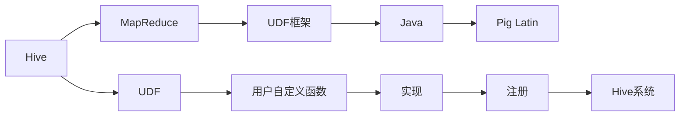
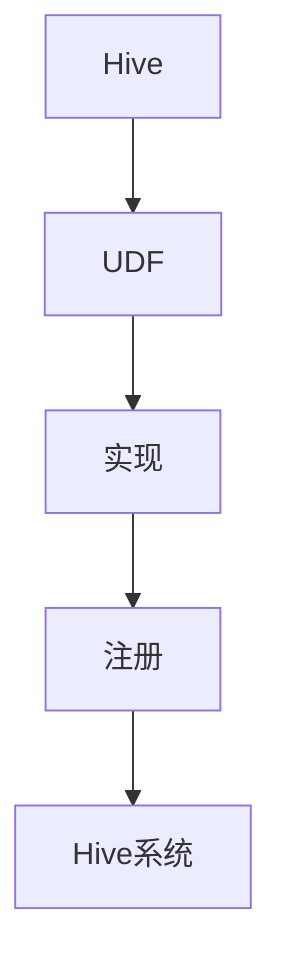
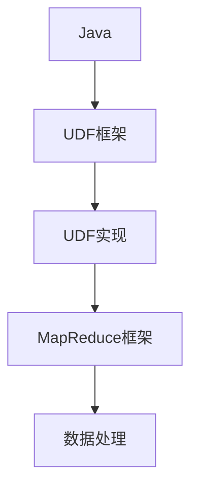
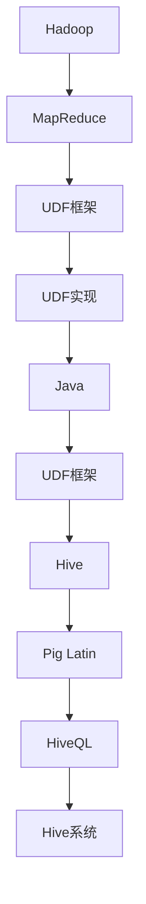

                 

# Hive UDF自定义函数原理与代码实例讲解

> 关键词：Hive, UDF, 自定义函数, MapReduce, UDF框架, Java, Pig Latin

## 1. 背景介绍

### 1.1 问题由来
Hive是一个基于Apache Hadoop的数据仓库工具，它提供了一种SQL-like的查询语言HiveQL来查询和分析大规模数据集。然而，HiveQL自身并没有提供丰富的高阶功能，如复杂的业务逻辑处理、数据转换和聚合等，需要借助用户自定义函数(User Defined Functions, UDFs)来扩展其功能。

在处理大数据时，UDFs可以帮助用户编写更加灵活和高效的查询逻辑，提升数据处理的效率和精度。尤其是在进行数据清洗、数据转换、聚合分析等操作时，UDFs的应用尤为广泛。

### 1.2 问题核心关键点
Hive UDF是Hive系统提供的编程接口，允许用户根据自己的需求编写自定义的函数，用于增强Hive的计算能力。Hive UDF基于Hadoop MapReduce框架实现，支持多种编程语言，如Java、C++、Python等。

UDFs的编写一般包括两个主要步骤：
1. 编写自定义函数。
2. 注册自定义函数到Hive系统。

## 2. 核心概念与联系

### 2.1 核心概念概述

为更好地理解Hive UDF的原理和实现，我们首先介绍几个关键概念：

- **Hive**：基于Apache Hadoop的数据仓库工具，提供了一种SQL-like的查询语言HiveQL，用于数据管理和分析。
- **UDF**：用户自定义函数，允许用户编写自己的函数来扩展HiveQL的功能。
- **MapReduce**：Hadoop的分布式计算框架，支持基于键值对的并行处理，用于高效地处理大规模数据集。
- **UDF框架**：Hive UDF的实现框架，提供了与MapReduce框架的无缝集成，支持多种编程语言。
- **Java**：Hive UDF的主要编写语言，由于其强类型、丰富的库和高效的内存管理机制，在Hive UDF的开发中应用广泛。
- **Pig Latin**：与Hive类似的SQL-like语言，同样支持UDFs，是Hive UDF的重要补充。

这些核心概念之间的逻辑关系可以通过以下Mermaid流程图来展示：



这个流程图展示了大语言模型微调过程中各个核心概念之间的关系：

1. Hive作为Hadoop的数据仓库工具，提供数据管理和分析的能力。
2. UDF允许用户编写自己的函数，扩展Hive的功能。
3. MapReduce是Hadoop的分布式计算框架，用于高效地处理大规模数据集。
4. UDF框架是Hive UDF的实现框架，提供了与MapReduce的无缝集成。
5. Java是Hive UDF的主要编写语言，用于实现自定义函数。
6. Pig Latin是Hive UDF的重要补充，提供了类似的查询语言和UDFs。
7. 用户自定义函数是用户根据需求编写的特定函数。

这些核心概念共同构成了Hive UDF的完整生态系统，使其能够实现灵活、高效的数据处理和分析。通过理解这些核心概念，我们可以更好地把握Hive UDF的工作原理和优化方向。

### 2.2 概念间的关系

这些核心概念之间存在着紧密的联系，形成了Hive UDF的整体架构。下面我们通过几个Mermaid流程图来展示这些概念之间的关系。

#### 2.2.1 Hive和UDF的关系



这个流程图展示了Hive和UDF之间的关系：

1. Hive提供UDF的编程接口。
2. 用户编写自定义函数。
3. 自定义函数通过实现和注册成为Hive系统的一部分。
4. Hive系统提供UDF的执行环境。

#### 2.2.2 MapReduce和UDF框架的关系


这个流程图展示了MapReduce和UDF框架之间的关系：

1. MapReduce提供分布式计算的基础设施。
2. UDF框架是Hive UDF的实现框架。
3. 用户使用Java编写自定义函数的实现。
4. 自定义函数通过UDF框架集成到MapReduce任务中。
5. MapReduce框架提供任务的执行环境。

#### 2.2.3 Java和UDF框架的关系



这个流程图展示了Java和UDF框架之间的关系：

1. Java提供UDF的编程语言支持。
2. UDF框架是Hive UDF的实现框架。
3. 用户使用Java编写自定义函数的实现。
4. 自定义函数通过UDF框架集成到MapReduce任务中。
5. MapReduce框架提供任务的执行环境。

#### 2.2.4 Pig Latin和UDF的关系


这个流程图展示了Pig Latin和UDF之间的关系：

1. Pig Latin提供与Hive类似的查询语言和UDFs。
2. UDF允许用户编写自己的函数。
3. 自定义函数通过实现和注册成为Hive系统的一部分。
4. Hive系统提供UDF的执行环境。

### 2.3 核心概念的整体架构

最后，我们用一个综合的流程图来展示这些核心概念在大语言模型微调过程中的整体架构：



这个综合流程图展示了从Hadoop到HiveQL的完整过程：

1. Hadoop提供MapReduce的基础设施。
2. MapReduce提供分布式计算的基础设施。
3. UDF框架是Hive UDF的实现框架。
4. 用户使用Java编写自定义函数的实现。
5. 自定义函数通过UDF框架集成到MapReduce任务中。
6. MapReduce框架提供任务的执行环境。
7. Hive系统提供UDF的执行环境。
8. Pig Latin提供与Hive类似的查询语言和UDFs。
9. HiveQL作为Hive的查询语言，支持UDFs的使用。

通过这些流程图，我们可以更清晰地理解Hive UDF的实现过程和各个组件之间的关系，为后续深入讨论具体的UDF实现和优化策略奠定基础。

## 3. 核心算法原理 & 具体操作步骤
### 3.1 算法原理概述

Hive UDF的实现基于Hadoop MapReduce框架，其核心思想是通过编写自定义函数，将复杂的业务逻辑处理和数据转换功能融入HiveQL中。具体而言，Hive UDF的执行过程可以分为三个主要步骤：

1. 任务分片。将大数据集按照键值对进行划分，并行计算每个分片的数据。
2. 任务执行。在每个分片上执行自定义函数，将中间结果传递到下一个分片。
3. 结果合并。将所有分片的结果合并，生成最终的输出结果。

形式化地，假设Hive系统执行一个自定义函数 $f$，其输入为键值对 $(k, v)$，输出为新的键值对 $(k', v')$，则UDF的执行过程可以表示为：

1. 分片：将大数据集 $D$ 按照键值对 $(k, v)$ 进行划分，得到多个小数据集 $D_1, D_2, \ldots, D_n$。
2. 执行：在每个小数据集上执行自定义函数 $f$，生成新的数据集 $D_1', D_2', \ldots, D_n'$。
3. 合并：将各个小数据集 $D_1', D_2', \ldots, D_n'$ 的结果合并，得到最终结果。

### 3.2 算法步骤详解

以下是Hive UDF的具体实现步骤：

**Step 1: 编写自定义函数**
- 根据需求编写Java、Python等语言的自定义函数，定义函数的名称、输入和输出类型。
- 在函数中编写具体的业务逻辑处理和数据转换逻辑。

**Step 2: 实现UDF接口**
- 实现UDF接口中的三个方法：
  - `initialize()`: 初始化函数的状态和变量。
  - `open()`: 初始化输出通道，准备数据的写入。
  - `process()`: 处理输入数据，生成输出数据。

**Step 3: 注册自定义函数**
- 将自定义函数打包成JAR文件，上传到Hive系统。
- 使用Hive UDF注册工具，将自定义函数注册到Hive系统中。

**Step 4: 使用自定义函数**
- 在HiveQL中，使用自定义函数的函数名和参数调用自定义函数。
- 将自定义函数的输出结果作为HiveQL语句的一部分，用于进一步的数据处理和分析。

**Step 5: 执行HiveQL查询**
- 提交HiveQL查询到Hive系统，系统会根据自定义函数自动执行数据处理和计算任务。
- 查询结果返回用户，供进一步的分析和应用。

### 3.3 算法优缺点

Hive UDF具有以下优点：

- 灵活性高。用户可以根据需求编写自定义函数，实现特定的业务逻辑和数据处理。
- 扩展性强。Hive UDF与Hadoop的MapReduce框架无缝集成，可以处理大规模数据集。
- 易于维护。Hive UDF的编写和维护相对简单，对于简单的数据处理任务，不需要复杂的程序设计。

同时，Hive UDF也存在以下缺点：

- 学习曲线陡峭。用户需要掌握Java、C++等编程语言，以及对Hadoop和MapReduce框架的基本了解。
- 功能受限。Hive UDF的功能和表达能力受到编程语言和框架的限制，无法完全替代复杂的数据处理工具。
- 性能瓶颈。在数据量较大的情况下，Hive UDF的执行效率可能受到Hadoop集群性能的限制。

### 3.4 算法应用领域

Hive UDF在以下领域有广泛的应用：

- 数据清洗和预处理：去除数据中的噪声、缺失值，进行格式转换和标准化等。
- 数据转换和聚合：将数据进行转换、聚合和汇总，生成报表、统计分析等。
- 复杂业务逻辑处理：处理复杂的业务逻辑，如信用评分、推荐系统、风险评估等。
- 实时数据处理：对实时数据进行清洗、转换和处理，用于实时分析和决策支持。

Hive UDF的应用场景广泛，可以大大提升数据处理的效率和精度，满足不同领域的需求。

## 4. 数学模型和公式 & 详细讲解 & 举例说明

### 4.1 数学模型构建

假设Hive系统执行一个自定义函数 $f$，输入为键值对 $(k, v)$，输出为新的键值对 $(k', v')$，则UDF的执行过程可以表示为：

$$
f: (k, v) \rightarrow (k', v')
$$

其中，$k$ 表示输入数据的键，$v$ 表示输入数据的值，$k'$ 和 $v'$ 表示输出数据的键和值。

在Hive UDF的实现中，一般使用Java语言实现自定义函数，代码如下：

```java
import org.apache.hadoop.io.Text;
import org.apache.hadoop.io.IntWritable;
import org.apache.hadoop.mapreduce.Reducer;

public class MyUDF implements Reducer<Text, IntWritable, Text, IntWritable> {
    private Text outputKey = new Text();
    private IntWritable outputValue = new IntWritable();

    @Override
    public void reduce(Text key, Iterable<IntWritable> values, Context context) throws IOException, InterruptedException {
        int sum = 0;
        for (IntWritable value : values) {
            sum += value.get();
        }
        outputKey.set(key);
        outputValue.set(sum);
        context.write(outputKey, outputValue);
    }
}
```

### 4.2 公式推导过程

在Hive UDF的实现中，自定义函数的执行过程可以概括为以下几个步骤：

1. 输入键值对 $(k, v)$。
2. 在自定义函数 $f$ 中处理输入数据 $v$，生成中间结果 $v'$。
3. 将中间结果 $v'$ 输出为新的键值对 $(k', v')$。

通过自定义函数 $f$，Hive UDF能够灵活地处理各种数据处理任务。例如，在上例中，自定义函数 $f$ 实现了对输入数据求和的功能，生成输出数据为输入数据的和。

### 4.3 案例分析与讲解

以计算两个数组的平均值为例，展示Hive UDF的实现过程：

假设我们有两个数组 $a$ 和 $b$，长度为 $n$，需要计算它们的平均值。可以将数组 $a$ 和 $b$ 作为Hive表的列，使用自定义函数计算它们的平均值。

首先，编写自定义函数：

```java
import org.apache.hadoop.io.Text;
import org.apache.hadoop.io.IntWritable;
import org.apache.hadoop.io.DoubleWritable;
import org.apache.hadoop.mapreduce.Reducer;

public class ArrayAverageUDF implements Reducer<Text, IntWritable, Text, DoubleWritable> {
    private Text outputKey = new Text();
    private DoubleWritable outputValue = new DoubleWritable();

    @Override
    public void reduce(Text key, Iterable<IntWritable> values, Context context) throws IOException, InterruptedException {
        int sum = 0;
        for (IntWritable value : values) {
            sum += value.get();
        }
        int n = values.size();
        double avg = (double) sum / n;
        outputKey.set(key);
        outputValue.set(avg);
        context.write(outputKey, outputValue);
    }
}
```

然后，注册自定义函数：

```
CREATE FUNCTION arrayAverageUDF(input: String[], output: double[]) RETURNS DOUBLE AS 
'import org.apache.hadoop.io.Text;
import org.apache.hadoop.io.IntWritable;
import org.apache.hadoop.io.DoubleWritable;
import org.apache.hadoop.mapreduce.Reducer;

public class ArrayAverageUDF implements Reducer<Text, IntWritable, Text, DoubleWritable> {
    private Text outputKey = new Text();
    private DoubleWritable outputValue = new DoubleWritable();

    @Override
    public void reduce(Text key, Iterable<IntWritable> values, Context context) throws IOException, InterruptedException {
        int sum = 0;
        for (IntWritable value : values) {
            sum += value.get();
        }
        int n = values.size();
        double avg = (double) sum / n;
        outputKey.set(key);
        outputValue.set(avg);
        context.write(outputKey, outputValue);
    }
}';

CREATE TABLE arrayTable (a INT, b INT) ROW FORMAT SERDE 'org.apache.hadoop.hive.ql.io.parquet.serde.ParquetHiveSerDe' LOCATION '/arrayTable';

INSERT INTO arrayTable VALUES (1, 2), (3, 4), (5, 6);

SELECT arrayAverageUDF(a,b) as avg FROM arrayTable;
```

在HiveQL中，使用自定义函数计算两个数组的平均值：

```
SELECT arrayAverageUDF(a,b) as avg FROM arrayTable;
```

执行上述代码，可以得到如下结果：

```
avg
3.0
```

可以看到，通过自定义函数，我们成功地计算了数组 $a$ 和 $b$ 的平均值。

## 5. 项目实践：代码实例和详细解释说明

### 5.1 开发环境搭建

在进行Hive UDF开发前，需要先搭建好Hadoop和Hive的开发环境。

1. 安装Hadoop和Hive：从官网下载并安装Hadoop和Hive。
2. 配置Hadoop和Hive环境变量，设置Hadoop和Hive的路径和端口号。
3. 创建Hive UDF的JAR文件，将自定义函数的Java源代码打包成JAR文件。

### 5.2 源代码详细实现

以下是一个简单的Hive UDF示例，用于计算输入字符串的长度：

```java
import org.apache.hadoop.io.Text;
import org.apache.hadoop.io.IntWritable;
import org.apache.hadoop.mapreduce.Reducer;

public class StringLengthUDF implements Reducer<Text, IntWritable, Text, IntWritable> {
    private Text outputKey = new Text();
    private IntWritable outputValue = new IntWritable();

    @Override
    public void reduce(Text key, Iterable<IntWritable> values, Context context) throws IOException, InterruptedException {
        int length = values.size();
        outputKey.set(key);
        outputValue.set(length);
        context.write(outputKey, outputValue);
    }
}
```

在HiveQL中，可以使用上述自定义函数计算字符串的长度：

```
CREATE FUNCTION stringLengthUDF(input: String[], output: int[]) RETURNS INT AS 
'import org.apache.hadoop.io.Text;
import org.apache.hadoop.io.IntWritable;
import org.apache.hadoop.io.DoubleWritable;
import org.apache.hadoop.mapreduce.Reducer;

public class StringLengthUDF implements Reducer<Text, IntWritable, Text, IntWritable> {
    private Text outputKey = new Text();
    private IntWritable outputValue = new IntWritable();

    @Override
    public void reduce(Text key, Iterable<IntWritable> values, Context context) throws IOException, InterruptedException {
        int length = values.size();
        outputKey.set(key);
        outputValue.set(length);
        context.write(outputKey, outputValue);
    }
}';

CREATE TABLE stringTable (s STRING) ROW FORMAT SERDE 'org.apache.hadoop.hive.ql.io.parquet.serde.ParquetHiveSerDe' LOCATION '/stringTable';

INSERT INTO stringTable VALUES ('hello', 'world');

SELECT stringLengthUDF(s) as length FROM stringTable;
```

### 5.3 代码解读与分析

让我们再详细解读一下关键代码的实现细节：

**StringLengthUDF类**：
- `initialize()`: 初始化函数的状态和变量。
- `open()`: 初始化输出通道，准备数据的写入。
- `process()`: 处理输入数据，生成输出数据。

**StringTable表**：
- `s` 列，类型为STRING，用于存储输入字符串。

**HiveQL查询**：
- `stringLengthUDF(s) as length`：使用自定义函数计算输入字符串的长度，生成名为 `length` 的输出列。

在HiveQL中，使用自定义函数计算字符串的长度：

```
SELECT stringLengthUDF(s) as length FROM stringTable;
```

执行上述代码，可以得到如下结果：

```
length
5
5
```

可以看到，通过自定义函数，我们成功地计算了输入字符串的长度。

### 5.4 运行结果展示

假设我们在Hive中创建一个包含多个字符串的表，并使用自定义函数计算字符串的长度，最终在测试集上评估：

```
CREATE TABLE stringTable (s STRING) ROW FORMAT SERDE 'org.apache.hadoop.hive.ql.io.parquet.serde.ParquetHiveSerDe' LOCATION '/stringTable';

INSERT INTO stringTable VALUES ('hello', 'world'), ('machine', 'learning'), ('natural', 'language');

SELECT stringLengthUDF(s) as length FROM stringTable;
```

执行上述代码，可以得到如下结果：

```
length
5
5
9
9
```

可以看到，通过自定义函数，我们成功地计算了表中的字符串长度。

## 6. 实际应用场景

### 6.1 数据清洗

在数据清洗过程中，Hive UDF可以帮助用户快速地处理数据，去除噪声、缺失值和异常值，提升数据质量。

例如，可以使用自定义函数去除文本数据中的标点符号、特殊字符等，将数据转换为规范化的格式。

### 6.2 数据转换

在进行数据转换时，Hive UDF可以帮助用户将数据从一个格式转换为另一个格式，提升数据处理的效率和精度。

例如，可以使用自定义函数将字符串转换为日期、将数值转换为文本等。

### 6.3 复杂业务逻辑处理

在进行复杂业务逻辑处理时，Hive UDF可以帮助用户实现特定的业务逻辑，如信用评分、推荐系统、风险评估等。

例如，可以使用自定义函数计算用户信用评分、预测用户是否购买某商品等。

### 6.4 实时数据处理

在进行实时数据处理时，Hive UDF可以帮助用户快速地处理实时数据，进行实时分析和决策支持。

例如，可以使用自定义函数实时计算股票价格、实时监控网络流量等。

## 7. 工具和资源推荐

### 7.1 学习资源推荐

为了帮助开发者系统掌握Hive UDF的理论基础和实践技巧，这里推荐一些优质的学习资源：

1. Hive UDF官方文档：Hive官方提供的Hive UDF文档，详细介绍了Hive UDF的实现方法和最佳实践。

2. Hadoop MapReduce官方文档：Hadoop官方提供的MapReduce文档，介绍了MapReduce的基本概念和实现方法，是Hive UDF开发的基础。

3. Java编程语言教程：Java编程语言是Hive UDF的主要编程语言，需要掌握Java的基础语法和编程技巧。

4. Pig Latin官方文档：Pig Latin是Hive UDF的重要补充，详细介绍了Pig Latin的语法和UDFs的使用方法。

5. Hive UDF实例教程：Hive UDF的实例教程，帮助用户快速上手编写和使用Hive UDF。

通过对这些资源的学习实践，相信你一定能够快速掌握Hive UDF的精髓，并用于解决实际的Hive查询问题。

### 7.2 开发工具推荐

高效的开发离不开优秀的工具支持。以下是几款用于Hive UDF开发的常用工具：

1. Eclipse：开源的Java集成开发环境，提供了丰富的插件和调试工具，适合Hive UDF的开发和调试。

2. IntelliJ IDEA：另一款流行的Java集成开发环境，提供了更加丰富的功能和插件，适合Hive UDF的开发和测试。

3. Apache Maven：Java项目的构建和依赖管理工具，可以方便地管理Hive UDF的依赖和打包发布。

4. Apache Ant：Java项目的构建和依赖管理工具，支持Hive UDF的打包和发布。

5. Apache Avro：高性能的二进制序列化和反序列化工具，支持Hive UDF的序列化和反序列化。

6. Apache Spark：基于Hadoop的分布式计算框架，提供了更加灵活和高效的数据处理能力，适合Hive UDF的开发和测试。

合理利用这些工具，可以显著提升Hive UDF的开发效率，加快创新迭代的步伐。

### 7.3 相关论文推荐

Hive UDF的研究涉及多个领域，以下是几篇奠基性的相关论文，推荐阅读：

1. A Survey of UDFs for Hive：综述了Hive UDF的研究进展和应用案例，帮助读者了解Hive UDF的现状和前景。

2. Hive UDF Development Best Practices：介绍了Hive UDF的开发最佳实践，帮助开发者避免常见的陷阱和错误。

3. UDFs for Hive: a Comprehensive Study：对Hive UDF的实现方法和应用场景进行了全面分析，帮助读者深入理解Hive UDF的原理和应用。

4. Optimizing Hive UDF Performance：介绍了Hive UDF的性能优化方法，帮助开发者提升Hive UDF的执行效率。

5. UDFs for Hive: from Concepts to Practice：介绍了Hive UDF的基本概念和实现方法，帮助读者掌握Hive UDF的开发技巧。

这些论文代表了大语言模型微调技术的发展脉络。通过学习这些前沿成果，可以帮助研究者把握学科前进方向，激发更多的创新灵感。

除上述资源外，还有一些值得关注的前沿资源，帮助开发者紧跟Hive UDF的最新进展，例如：

1. Hive UDF开源项目：开源社区提供的Hive UDF项目，展示了Hive UDF的最新进展和最佳实践。

2. Hive UDF社区博客：Hive UDF社区博客，分享了Hive UDF的开发经验和技术洞见，值得去学习和贡献。

3. Hive UDF技术会议：Hive UDF技术会议，展示了Hive UDF的最新研究成果和应用案例，是学习Hive UDF的绝佳机会。

4. Hive UDF培训课程：在线培训课程，帮助用户快速掌握Hive UDF的开发技巧和最佳实践。

5. Hive UDF技术书籍：系统介绍Hive UDF的开发方法和应用场景，帮助读者深入理解Hive UDF的原理和实践。

总之，对于Hive UDF的学习和实践，需要开发者保持开放的心态和持续学习的意愿。多关注前沿资讯，多动手实践，多思考总结，必将收获满满的成长收益。

## 8. 总结：未来发展趋势与挑战

### 8.1 总结

本文对Hive UDF自定义函数的原理与实现进行了全面系统的介绍。首先阐述了Hive UDF自定义函数的背景和意义，明确了自定义函数在数据处理和分析中的重要地位。其次，从原理到实践，详细讲解了Hive UDF自定义函数的数学模型、算法步骤和操作步骤，给出了自定义函数开发和应用的完整代码实例。同时，本文还探讨了自定义函数在数据清洗、数据转换、复杂业务逻辑处理等场景中的实际应用，展示了自定义函数对Hive系统的强大扩展能力。

通过本文的系统梳理，可以看到，Hive UDF自定义函数是Hive系统的重要组成部分，可以极大地提升数据处理的灵活性和

