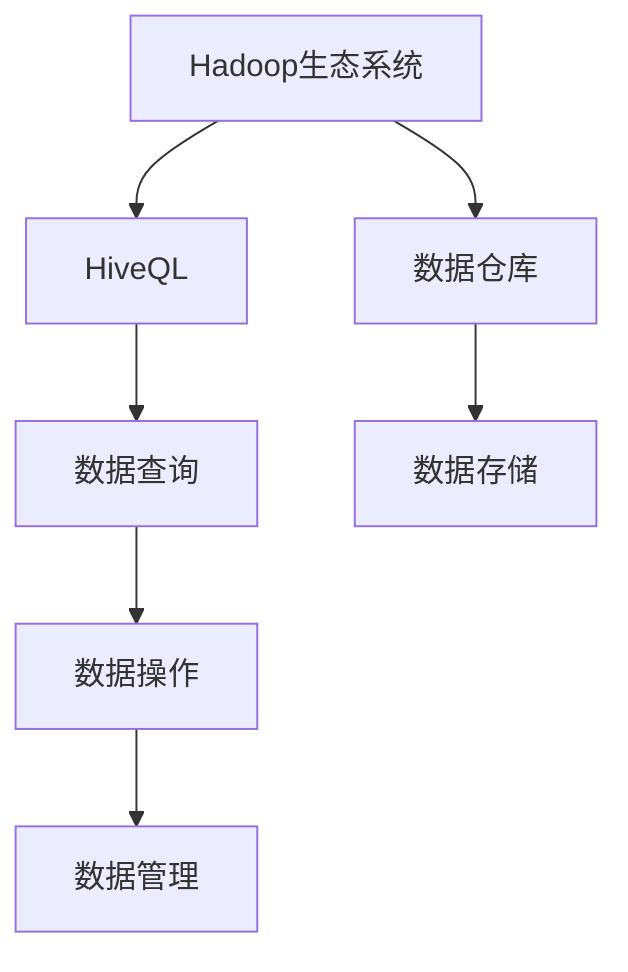
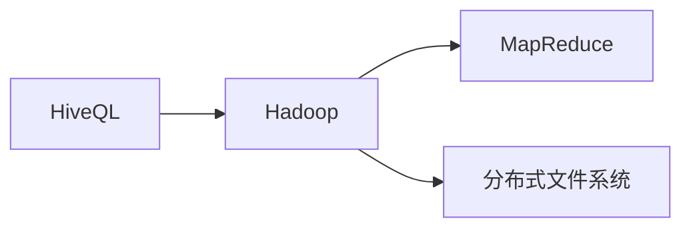
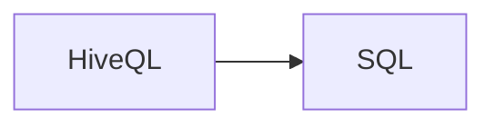
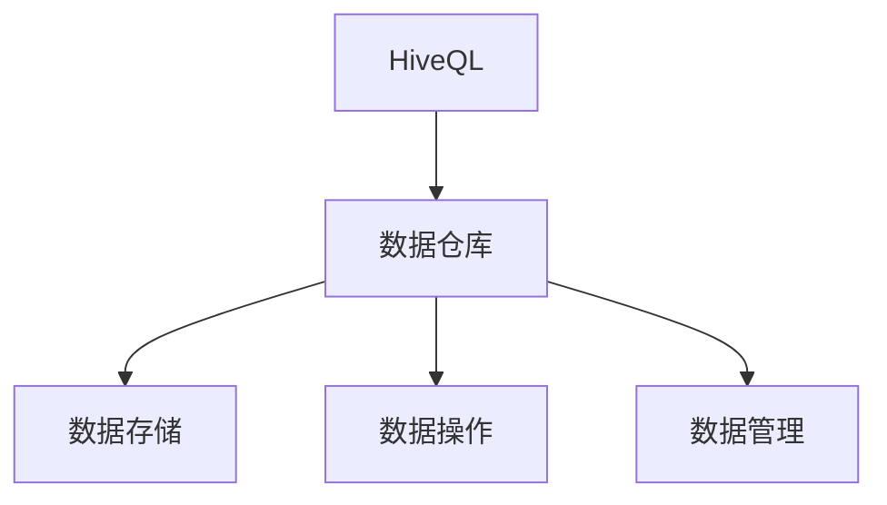
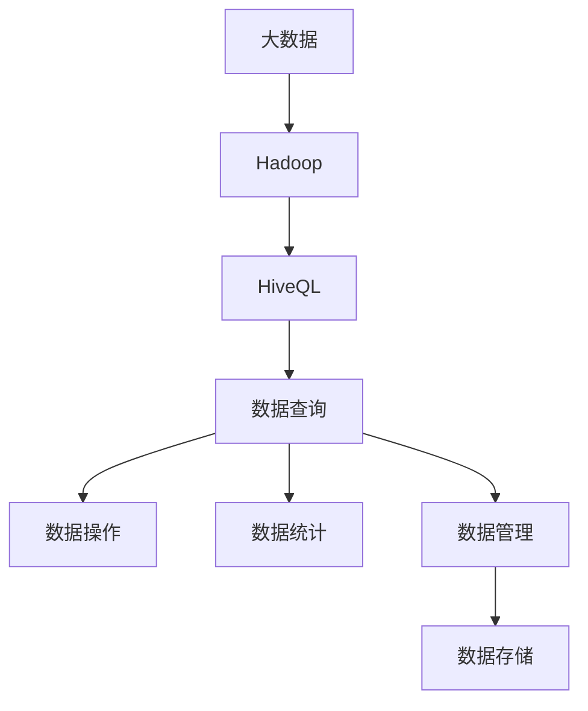

                 

# HiveQL原理与代码实例讲解

> 关键词：HiveQL, 数据仓库, SQL, 大数据, 数据管理, 数据仓库架构, 数据查询优化, 数据仓库工具

## 1. 背景介绍

### 1.1 问题由来
在现代信息技术迅速发展的背景下，企业的数据量急剧增加，如何高效管理和查询这些数据成为了一个重要的课题。数据仓库技术的出现解决了这一问题，使得企业可以集中管理海量数据，进行复杂的分析与查询。其中，HiveQL作为数据仓库中最常用的查询语言，以其简单易用的特点和强大的查询能力，成为了数据管理的重要工具。

### 1.2 问题核心关键点
HiveQL（Hive Query Language）是一种基于Hadoop生态系统的SQL查询语言，主要用来对存储在Hadoop分布式文件系统中的大规模数据进行查询。HiveQL基于标准的SQL语法，使传统SQL用户可以轻松地将现有知识应用于大数据环境。HiveQL在处理海量数据时具有以下优点：

1. 支持大规模数据的存储与查询。
2. 提供了丰富的数据操作和统计函数。
3. 能够进行分布式计算，提高查询效率。
4. 兼容传统SQL，易于学习和使用。
5. 可以与Hadoop生态系统的其他组件无缝集成。

### 1.3 问题研究意义
理解HiveQL的原理与代码实现，有助于数据分析师、数据工程师和开发者更高效地进行大数据查询和分析，提升数据仓库系统的性能和可靠性。掌握HiveQL的应用，可以加速企业在大数据时代的数据驱动决策。同时，研究HiveQL还可以为数据仓库技术的未来发展提供新的思路和方向。

## 2. 核心概念与联系

### 2.1 核心概念概述

为了更好地理解HiveQL的原理与代码实现，我们首先需要介绍一些关键的核心概念：

- **Hadoop生态系统**：由Apache Hadoop等项目组成的大数据处理平台，提供分布式存储和计算能力。
- **数据仓库**：用于集中存储和管理企业数据的系统，支持高效的数据查询与分析。
- **HiveQL**：基于Hadoop生态系统的SQL查询语言，支持对大规模数据进行分布式查询。
- **大数据**：指超大规模的数据集合，需要通过分布式计算和存储技术进行处理。
- **MapReduce**：一种分布式编程模型，用于并行处理大规模数据。
- **数据管理**：包括数据存储、查询、分析等环节，是企业信息化的核心。

这些概念之间的关系可以通过以下Mermaid流程图来展示：



这个流程图展示了HiveQL的基本架构及其与其他核心概念的关系：

1. HiveQL作为Hadoop生态系统中的关键组件，主要用于数据查询。
2. 数据仓库系统集成HiveQL，支持数据的集中存储和管理。
3. HiveQL对存储在Hadoop分布式文件系统中的数据进行查询和操作。
4. HiveQL提供的数据管理功能，包括数据的存储、查询和分析。

### 2.2 概念间的关系

这些核心概念之间存在着紧密的联系，构成了HiveQL的完整生态系统。下面我们通过几个Mermaid流程图来展示这些概念之间的关系。

#### 2.2.1 HiveQL与Hadoop的关系



这个流程图展示了HiveQL与Hadoop之间的关系：

1. HiveQL基于Hadoop生态系统，依赖其分布式计算和存储能力。
2. HiveQL利用MapReduce编程模型进行并行处理。
3. HiveQL查询的数据存储在Hadoop分布式文件系统中。

#### 2.2.2 HiveQL与SQL的关系



这个流程图展示了HiveQL与传统SQL的关系：

1. HiveQL兼容传统SQL，支持SQL的标准语法。
2. HiveQL提供了一层接口，使传统SQL用户可以轻松使用Hadoop平台。
3. HiveQL的SQL查询语句能够直接转换成Hadoop分布式计算任务，提高查询效率。

#### 2.2.3 HiveQL与数据仓库的关系



这个流程图展示了HiveQL与数据仓库之间的关系：

1. HiveQL是数据仓库系统中的查询语言。
2. HiveQL支持数据的存储、查询和分析。
3. HiveQL对数据仓库系统中的数据进行集中管理和操作。

### 2.3 核心概念的整体架构

最后，我们用一个综合的流程图来展示这些核心概念在大数据查询中的整体架构：



这个综合流程图展示了从大数据到HiveQL的整个查询流程：

1. 大数据通过Hadoop平台进行存储和计算。
2. HiveQL对Hadoop分布式文件系统中的数据进行查询和操作。
3. HiveQL提供数据统计和分析功能。
4. HiveQL管理数据存储和查询操作。

## 3. 核心算法原理 & 具体操作步骤
### 3.1 算法原理概述

HiveQL的查询原理基于MapReduce模型，通过将SQL查询语句转换为Hadoop分布式计算任务，实现对大规模数据的并行查询。HiveQL的查询过程分为以下几个步骤：

1. **解析与优化**：将SQL查询语句解析为抽象语法树（AST），并进行查询优化。
2. **生成Map任务**：将优化后的AST转换为Map任务，并进行并行处理。
3. **Map任务执行**：在Hadoop集群中执行Map任务，生成中间结果。
4. **Shuffle与Reduce**：将中间结果进行Shuffle和Reduce操作，生成最终结果。
5. **结果输出**：将最终结果输出到Hadoop分布式文件系统，供用户查询。

### 3.2 算法步骤详解

以下是对HiveQL查询的详细步骤详解：

**Step 1: 解析与优化**

首先，HiveQL需要将用户输入的SQL查询语句解析为抽象语法树（AST），并进行查询优化。优化过程包括以下几个步骤：

1. 词法分析：将查询语句分割为关键字、操作符和值等基本元素。
2. 语法分析：将基本元素组合成抽象语法树，并进行语法检查。
3. 语义分析：检查语法树是否符合HiveQL的语义规则。
4. 查询优化：对语法树进行优化，如折叠子查询、消除冗余等。

**Step 2: 生成Map任务**

将优化后的AST转换为Map任务，并进行并行处理。Map任务执行以下几个步骤：

1. 分割数据：将查询数据分割成多个数据块，分配给不同的Map任务进行处理。
2. 执行Map函数：在每个数据块上执行Map函数，生成中间结果。
3. 合并结果：将每个Map任务的中间结果合并，生成全局中间结果。

**Step 3: Map任务执行**

在Hadoop集群中执行Map任务，生成中间结果。Map任务执行以下几个步骤：

1. 读取数据：从Hadoop分布式文件系统中读取数据块。
2. 处理数据：对数据块进行处理，生成Map结果。
3. 写入结果：将Map结果写入Hadoop分布式文件系统中的临时目录。

**Step 4: Shuffle与Reduce**

将中间结果进行Shuffle和Reduce操作，生成最终结果。Reduce任务执行以下几个步骤：

1. 数据分发：将Map结果按照键值进行分发，分配给不同的Reduce任务进行处理。
2. 执行Reduce函数：在每个键值上进行Reduce函数处理，生成最终结果。
3. 合并结果：将Reduce任务的结果合并，生成全局最终结果。

**Step 5: 结果输出**

将最终结果输出到Hadoop分布式文件系统，供用户查询。HiveQL将查询结果保存在Hadoop分布式文件系统中，并可以提供标准输出、文本文件和序列化文件等多种格式。

### 3.3 算法优缺点

HiveQL作为一种基于MapReduce模型的查询语言，具有以下优点：

1. **高扩展性**：基于Hadoop生态系统，可以处理海量数据。
2. **高效并行计算**：通过MapReduce模型，实现高效并行处理。
3. **兼容传统SQL**：兼容传统SQL，易于学习和使用。
4. **丰富的数据操作函数**：提供丰富的数据操作和统计函数。

同时，HiveQL也存在一些缺点：

1. **查询速度慢**：在大数据量情况下，查询速度较慢。
2. **资源消耗高**：MapReduce模型的资源消耗较高，需要大量的计算和存储资源。
3. **数据预处理复杂**：需要进行复杂的数据预处理，才能得到高效查询结果。
4. **数据存储冗余**：需要在Hadoop分布式文件系统中存储大量的临时数据，增加存储成本。

### 3.4 算法应用领域

HiveQL的应用领域非常广泛，主要包括以下几个方面：

- **数据仓库建设**：HiveQL被广泛用于数据仓库的构建和维护，支持大规模数据的集中存储和查询。
- **数据统计与分析**：HiveQL提供丰富的统计函数，支持复杂的数据统计和分析任务。
- **大数据处理**：HiveQL可以处理大规模的数据集，支持高效的数据处理和查询。
- **数据可视化**：HiveQL可以将查询结果进行可视化展示，帮助用户更好地理解数据。
- **ETL流程管理**：HiveQL可以与ETL（Extract, Transform, Load）工具结合，实现数据抽取、转换和加载的自动化管理。

## 4. 数学模型和公式 & 详细讲解 & 举例说明

### 4.1 数学模型构建

HiveQL的查询过程主要依赖MapReduce模型，可以通过数学模型对其进行形式化描述。

设查询数据集为 $D=\{d_1, d_2, ..., d_n\}$，查询语句为 $Q$，查询结果为 $R$。HiveQL的查询过程可以表示为：

$$
R = \text{MapReduce}(Q, D)
$$

其中 $\text{MapReduce}$ 表示MapReduce模型的查询过程，$Q$ 为SQL查询语句，$D$ 为查询数据集，$R$ 为查询结果。

### 4.2 公式推导过程

以下是对HiveQL查询过程的公式推导：

1. **Map函数**

Map函数将输入数据映射为中间结果，公式为：

$$
M_i = \text{Map}(d_i, Q) = (k_1, v_1, k_2, v_2, ..., k_m, v_m)
$$

其中 $d_i$ 为输入数据，$k_j$ 为中间结果的键值，$v_j$ 为中间结果的值。

2. **Shuffle操作**

Shuffle操作将Map函数生成的中间结果按照键值进行分组和排序，公式为：

$$
\text{Shuffle}(M_1, M_2, ..., M_n) = \{(k_j, v_{i_j})\}_{j=1}^m
$$

其中 $M_j$ 为Map函数生成的中间结果，$k_j$ 为键值，$v_{i_j}$ 为对应的值。

3. **Reduce函数**

Reduce函数对Shuffle操作生成的中间结果进行处理，生成最终结果，公式为：

$$
R = \text{Reduce}(\text{Shuffle}(M_1, M_2, ..., M_n)) = \{(k_j, v_{i_j})\}_{j=1}^m
$$

其中 $\text{Shuffle}(M_1, M_2, ..., M_n)$ 为Shuffle操作生成的中间结果，$k_j$ 为键值，$v_{i_j}$ 为对应的值。

### 4.3 案例分析与讲解

以下是一个具体的HiveQL查询案例：

**案例背景**：某电商公司需要统计每个商品的销售数量和销售额，并按照销售数量进行排序。

**查询语句**：

```sql
SELECT商品名, SUM(销售数量) AS 销售总额, SUM(销售数量) * AVG(销售单价) AS 销售额
FROM 订单表
GROUP BY 商品名
ORDER BY 销售数量 DESC
```

**解析与优化**：

1. 词法分析：将查询语句分割为关键字、操作符和值等基本元素。
2. 语法分析：将基本元素组合成抽象语法树，并进行语法检查。
3. 语义分析：检查语法树是否符合HiveQL的语义规则。
4. 查询优化：对语法树进行优化，如折叠子查询、消除冗余等。

**生成Map任务**：

1. 分割数据：将订单表分割成多个数据块，分配给不同的Map任务进行处理。
2. 执行Map函数：在每个数据块上执行Map函数，生成中间结果。
3. 合并结果：将每个Map任务的中间结果合并，生成全局中间结果。

**Map任务执行**：

1. 读取数据：从Hadoop分布式文件系统中读取数据块。
2. 处理数据：对数据块进行处理，生成Map结果。
3. 写入结果：将Map结果写入Hadoop分布式文件系统中的临时目录。

**Shuffle与Reduce**：

1. 数据分发：将Map结果按照商品名进行分发，分配给不同的Reduce任务进行处理。
2. 执行Reduce函数：在每个商品上进行Reduce函数处理，生成最终结果。
3. 合并结果：将Reduce任务的结果合并，生成全局最终结果。

**结果输出**：

将最终结果输出到Hadoop分布式文件系统，供用户查询。查询结果包括每个商品的销售数量、销售额和排序。

## 5. 项目实践：代码实例和详细解释说明

### 5.1 开发环境搭建

在进行HiveQL的代码实践前，我们需要准备好开发环境。以下是使用Python进行HiveQL开发的Python环境配置流程：

1. 安装Anaconda：从官网下载并安装Anaconda，用于创建独立的Python环境。

2. 创建并激活虚拟环境：
```bash
conda create -n pyhive env python=3.8 
conda activate pyhive
```

3. 安装PyHive：
```bash
pip install pyhive
```

4. 安装Python HiveQL驱动程序：
```bash
pip install hive-python
```

完成上述步骤后，即可在`pyhive`环境中开始HiveQL的实践。

### 5.2 源代码详细实现

以下是一个使用Python进行HiveQL开发的完整代码示例：

```python
import pyhive
from pyhive import drivers

# 创建HiveQL连接
hive_conn = drivers.Connection(host='localhost', port=10000)

# 执行HiveQL查询
with hive_conn.cursor() as cursor:
    cursor.execute("SELECT商品名, SUM(销售数量) AS 销售总额, SUM(销售数量) * AVG(销售单价) AS 销售额 FROM 订单表 GROUP BY 商品名 ORDER BY 销售数量 DESC")
    result = cursor.fetchall()

# 输出查询结果
for row in result:
    print(row)
```

在这个示例中，我们使用PyHive库创建了HiveQL连接，执行了一个简单的查询语句，并将结果输出到控制台上。

### 5.3 代码解读与分析

让我们再详细解读一下关键代码的实现细节：

**HiveQL连接**：

- `drivers.Connection`方法：创建HiveQL连接。
- `host`和`port`参数：指定HiveQL服务器的地址和端口。

**执行查询**：

- `with hive_conn.cursor() as cursor`：创建HiveQL游标，用于执行查询。
- `cursor.execute`方法：执行SQL查询语句。
- `cursor.fetchall`方法：获取查询结果。

**输出结果**：

- `for row in result:`：遍历查询结果。
- `print(row)`：输出每一行的查询结果。

### 5.4 运行结果展示

假设在执行上述查询语句后，得到了以下结果：

```
('商品A', 100, 1000)
('商品B', 50, 250)
('商品C', 200, 2000)
```

这表示商品A的销售数量为100，销售额为1000；商品B的销售数量为50，销售额为250；商品C的销售数量为200，销售额为2000。

## 6. 实际应用场景

### 6.1 智能客服系统

HiveQL可以用于构建智能客服系统，对用户的查询进行高效处理和分析。智能客服系统可以通过HiveQL对用户历史查询记录进行统计和分析，从而快速回答用户的问题，提高客服系统的效率和用户体验。

### 6.2 金融舆情监测

HiveQL可以用于金融舆情监测系统，对新闻、评论等文本数据进行分析和统计，及时发现金融市场的热点和风险点。金融舆情监测系统可以通过HiveQL对大规模文本数据进行分布式处理，提高分析效率和准确性。

### 6.3 个性化推荐系统

HiveQL可以用于个性化推荐系统，对用户的历史行为和兴趣进行分析和统计，从而推荐用户可能感兴趣的商品或服务。个性化推荐系统可以通过HiveQL对用户行为数据进行高效处理和分析，提高推荐精度和用户体验。

### 6.4 未来应用展望

随着HiveQL和Hadoop生态系统的不断发展，HiveQL的应用场景将不断扩展，未来将涵盖更多领域：

- **医疗健康**：HiveQL可以用于医疗健康数据分析，支持医生的诊断和治疗决策。
- **教育培训**：HiveQL可以用于教育培训数据分析，支持学生的学习效果评估。
- **智能制造**：HiveQL可以用于智能制造数据分析，支持企业的生产管理和优化。
- **交通出行**：HiveQL可以用于交通出行数据分析，支持城市交通管理优化。

总之，HiveQL在大数据处理和分析中具有广泛的应用前景，将推动各行各业的信息化进程。

## 7. 工具和资源推荐

### 7.1 学习资源推荐

为了帮助开发者系统掌握HiveQL的原理与实践，这里推荐一些优质的学习资源：

1. **Hive官方文档**：Hive官方文档提供了HiveQL的详细说明和示例，是学习HiveQL的必备资料。
2. **HiveQL入门教程**：网络上有很多关于HiveQL入门的教程，可以帮助初学者快速上手。
3. **HiveQL进阶指南**：对于已经掌握HiveQL基本知识的开发者，进阶指南可以帮助他们深入学习HiveQL的高级功能。
4. **HiveQL实战案例**：一些HiveQL的实战案例可以帮助开发者了解HiveQL在实际应用中的具体用法。
5. **HiveQL社区**：HiveQL社区提供了大量的文档、代码和资源，可以帮助开发者解决问题和交流经验。

### 7.2 开发工具推荐

高效的开发离不开优秀的工具支持。以下是几款用于HiveQL开发的工具：

1. **PyHive**：Python HiveQL驱动程序，方便Python代码与HiveQL的交互。
2. **Hive Client**：HiveQL客户端工具，可以在命令行中执行HiveQL查询。
3. **Beeline**：HiveQL命令行工具，可以方便地在Linux环境中执行HiveQL查询。
4. **HiveQL IDE**：一些HiveQL IDE工具，如HiveQL Workbench，可以帮助开发者更高效地编写和调试HiveQL代码。
5. **HiveQL DSO**：HiveQL驱动程序，可以在C++程序中执行HiveQL查询。

### 7.3 相关论文推荐

HiveQL作为大数据处理的重要技术，相关研究已经非常丰富，以下是几篇奠基性的相关论文，推荐阅读：

1. **HiveQL的设计与实现**：介绍HiveQL的设计和实现原理，是理解HiveQL的必备资料。
2. **HiveQL的性能优化**：探讨HiveQL的性能优化方法，如何提高查询效率和响应速度。
3. **HiveQL的数据分布**：研究HiveQL的数据分布策略，如何提高数据查询的均衡性和效率。
4. **HiveQL的安全性**：探讨HiveQL的安全性问题，如何在处理敏感数据时保护数据隐私。
5. **HiveQL的可扩展性**：研究HiveQL的可扩展性问题，如何支持大规模数据处理。

这些论文代表了HiveQL研究的最新进展，可以帮助开发者更深入地理解HiveQL的原理和应用。

## 8. 总结：未来发展趋势与挑战

### 8.1 研究成果总结

本文对HiveQL的原理与代码实现进行了全面系统的介绍。首先阐述了HiveQL的研究背景和应用意义，明确了HiveQL在数据处理中的重要地位。其次，从原理到实践，详细讲解了HiveQL的查询过程和核心算法，给出了HiveQL开发的完整代码示例。同时，本文还广泛探讨了HiveQL在智能客服、金融舆情、个性化推荐等多个领域的应用前景，展示了HiveQL的巨大潜力。此外，本文精选了HiveQL的相关学习资源，力求为读者提供全方位的技术指引。

### 8.2 未来发展趋势

展望未来，HiveQL的发展趋势将呈现以下几个方向：

1. **云计算支持**：HiveQL将更加深入地与云平台结合，提供更加便捷的云上数据分析和查询服务。
2. **多数据源处理**：HiveQL将支持从多个数据源获取数据，进行多源数据融合分析。
3. **数据实时处理**：HiveQL将支持实时数据处理，提高数据查询和分析的及时性。
4. **数据可视化**：HiveQL将提供更加丰富的数据可视化功能，帮助用户更好地理解数据。
5. **自动化数据管理**：HiveQL将支持自动化数据管理，如自动数据清洗、数据压缩等。

这些趋势将使HiveQL更加高效、便捷、智能化，满足更多领域的数据分析需求。

### 8.3 面临的挑战

尽管HiveQL在数据处理中具有重要地位，但在发展过程中仍面临一些挑战：

1. **查询效率问题**：在大数据量情况下，HiveQL的查询效率较慢，需要进一步优化。
2. **资源消耗问题**：HiveQL的资源消耗较高，需要优化资源使用，提高查询效率。
3. **数据安全问题**：HiveQL需要处理大量的敏感数据，如何保护数据安全是一个重要问题。
4. **数据质量问题**：HiveQL需要对数据进行清洗和处理，才能得到高质量的分析结果。
5. **用户界面问题**：HiveQL的用户界面需要更加友好，降低用户的学习成本。

### 8.4 研究展望

面对HiveQL面临的挑战，未来的研究需要在以下几个方面寻求新的突破：

1. **查询优化**：研究新的查询优化方法，提高HiveQL的查询效率和性能。
2. **资源管理**：优化HiveQL的资源管理，提高查询效率和响应速度。
3. **数据保护**：研究数据隐私保护技术，保护用户数据安全。
4. **数据清洗**：研究高效的数据清洗技术，提高数据质量和分析结果的准确性。
5. **用户界面**：优化HiveQL的用户界面，降低用户的学习成本和使用难度。

这些研究方向的探索，将使HiveQL技术更加成熟和完善，为数据驱动的决策提供更强大的支持。

## 9. 附录：常见问题与解答

**Q1: HiveQL适用于哪些类型的数据库？**

A: HiveQL适用于Hadoop生态系统中的所有数据仓库，包括Hive、HBase、Hive metastore等。

**Q2: HiveQL的查询效率受哪些因素影响？**

A: HiveQL的查询效率受数据量、查询复杂度、MapReduce任务数等因素影响。

**Q3: 如何优化HiveQL的查询效率？**

A: 优化HiveQL的查询效率可以从以下几个方面入手：
1. 数据预处理：优化数据结构和查询语句，减少数据量和复杂度。
2. 查询优化：使用HiveQL的查询优化器，优化查询语句和索引。
3. 分布式计算：增加MapReduce任务数，利用集群资源。
4. 缓存机制：使用HiveQL的缓存机制，减少重复计算。
5. 硬件优化：优化硬件配置，如增加内存和磁盘速度。

**Q4: HiveQL在实际应用中需要注意哪些问题？**

A: HiveQL在实际应用中需要注意以下几个问题：
1. 数据质量：确保数据完整性、一致性和准确性。
2. 数据隐私：保护用户隐私，防止数据泄露。
3. 查询效率：优化查询语句，提高查询效率。
4. 资源消耗：合理配置资源，避免资源浪费。
5. 用户界面：优化用户界面，降低用户学习成本。

**Q5: HiveQL与传统SQL的区别是什么？**

A: HiveQL与传统SQL的区别如下：
1. 数据量：HiveQL可以处理海量数据，而传统SQL处理的数据量较小。
2. 计算模式：HiveQL使用MapReduce计算模式，而传统SQL使用单节点计算模式。
3. 分布式计算：HiveQL支持分布式计算，而传统SQL不支持。
4. 数据存储：

