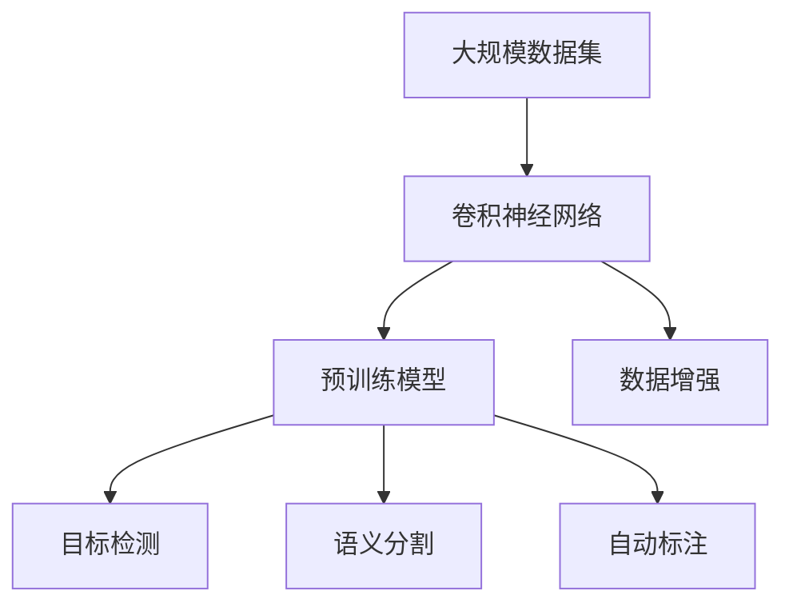

                 

# ImageNet与人工智能的进步

> 关键词：ImageNet, 人工智能, 深度学习, 卷积神经网络, 预训练模型, 计算机视觉, 数据集, 图像分类, 目标检测, 自动标注

## 1. 背景介绍

### 1.1 问题由来
ImageNet是一个大规模图像识别数据集，由斯坦福大学于2009年发布，包含超过一百万张高分辨率图像，涵盖了超过一千个分类标签。ImageNet的成功推动了深度学习在计算机视觉领域的快速发展，成为许多重要研究成果的基石。

深度学习领域的一个关键里程碑是2012年的ImageNet图像识别比赛，由AlexNet团队一举夺魁，开启了计算机视觉研究的新纪元。在此之前，计算机视觉领域的进展相对缓慢，主要依赖于手工设计的特征提取器、浅层模型和传统的机器学习算法。然而，AlexNet凭借其大规模预训练和微调的方法，将准确率提升了近10个百分点，取得了惊人的成绩。

这一突破不仅极大地推动了深度学习技术的发展，也标志着深度学习开始向实际应用大规模迁移，逐步成为计算机视觉领域的主流方法。此后，ImageNet数据集和深度学习算法成为了学术界和工业界研究和应用的重要资源，推动了计算机视觉技术的不断进步。

### 1.2 问题核心关键点
ImageNet在深度学习发展中的核心作用主要体现在以下几个方面：

- 大规模数据集：ImageNet提供了超过一百万张图像，以及相应的标签信息，为深度学习模型的预训练提供了丰富的训练样本。
- 高难度任务：ImageNet包含超过一千个分类标签，每个类别下包含大量图像，这使得模型需要具备强大的泛化能力和特征学习能力。
- 开放平台：ImageNet数据集和比赛结果公开共享，使得学术界和工业界能够在此基础上进行研究和创新。
- 先驱算法：ImageNet推动了包括卷积神经网络(CNN)、数据增强、迁移学习等重要算法的提出和完善。

这些关键因素共同推动了深度学习技术的突破和计算机视觉应用的飞速发展。

### 1.3 问题研究意义
ImageNet在人工智能领域的贡献不容小觑，其主要意义在于：

- 推动了深度学习技术的发展：ImageNet数据集和比赛结果推动了深度学习在计算机视觉领域的广泛应用，加速了技术的产业化进程。
- 拓展了计算机视觉应用的边界：ImageNet使得深度学习在图像分类、目标检测、语义分割、姿态估计等多个任务上取得了显著进展，提升了机器在视觉领域的认知能力。
- 促进了跨学科交流：ImageNet吸引了众多计算机视觉和人工智能领域的专家学者参与，推动了跨学科的研究和合作，促进了技术的进一步发展。
- 提高了科研水平：ImageNet的比赛激励了众多研究团队积极参与，推动了计算机视觉和深度学习技术的不断进步，提高了整个领域的科研水平。
- 加速了应用落地：ImageNet的公开共享使得深度学习算法得以在工业界大规模应用，如在自动驾驶、安防监控、医疗影像分析等领域，加速了技术的实际部署。

## 2. 核心概念与联系

### 2.1 核心概念概述

为更好地理解ImageNet在人工智能中的作用，本节将介绍几个关键概念及其相互联系：

- **卷积神经网络(CNN)**：一种专门用于图像处理的深度神经网络，能够自动学习图像中的局部特征，具有强大的空间感知能力。
- **预训练模型**：通过在大规模数据集上无监督学习得到的模型，可以具备一般化的特征提取能力。预训练模型通过迁移学习，可以进一步适应特定任务，提升性能。
- **数据增强**：通过一系列变换技术(如旋转、缩放、裁剪等)，丰富训练集的多样性，防止过拟合。
- **目标检测**：在图像中定位物体并识别其类别，广泛应用于自动驾驶、安防监控等领域。
- **语义分割**：将图像中的每个像素都标记为特定类别，用于图像理解、视觉问答等任务。
- **自动标注**：利用机器学习算法自动给图像打上标签，提高数据标注的效率和准确性。

这些概念之间的逻辑关系可以通过以下Mermaid流程图来展示：



这个流程图展示了ImageNet在深度学习中的核心作用：通过大规模数据集训练CNN，得到预训练模型，进而应用于目标检测、语义分割、自动标注等多个任务。

### 2.2 概念间的关系

这些核心概念之间存在着紧密的联系，形成了深度学习在计算机视觉中的应用框架。

**卷积神经网络与预训练模型**：卷积神经网络是预训练模型的基础，通过在ImageNet等大规模数据集上进行预训练，卷积神经网络可以学习到更强的特征提取能力，提升模型泛化能力。

**数据增强与目标检测**：数据增强通过丰富训练集的多样性，防止模型过拟合，从而提升目标检测模型的准确率和鲁棒性。

**预训练模型与自动标注**：通过在预训练模型的基础上，可以进一步适应目标检测、语义分割等任务，同时也可以用于自动标注，提高数据标注的效率。

**目标检测与语义分割**：目标检测主要关注物体的定位，而语义分割则关注每个像素的分类，两者的任务虽然有所区别，但都是图像理解的重要分支。

**自动标注与语义分割**：自动标注可以辅助人工进行图像分类和标注，而语义分割则是在图像上精确地打上每个像素的标签，两者相辅相成，共同提升图像理解能力。

通过这些核心概念和关系，可以更好地理解ImageNet在人工智能中的作用，以及深度学习在计算机视觉中的发展脉络。

## 3. 核心算法原理 & 具体操作步骤
### 3.1 算法原理概述

ImageNet在深度学习中的核心作用在于其大规模数据集和预训练模型。通过在ImageNet上进行预训练，深度学习模型可以学习到更强的特征提取能力和泛化能力，进而提升在特定任务上的性能。

预训练模型的训练过程一般包括以下几个步骤：

1. **数据准备**：收集和处理ImageNet数据集，分为训练集、验证集和测试集。
2. **模型选择**：选择合适的深度学习模型架构，如卷积神经网络(CNN)、残差网络(ResNet)等。
3. **预训练过程**：在ImageNet上无监督地训练模型，学习通用的特征表示。
4. **微调过程**：将预训练模型用于特定任务，通过有监督学习优化模型参数。

### 3.2 算法步骤详解

#### 3.2.1 数据准备

ImageNet数据集包含了超过一百万张图像，每张图像都标记了相应的类别。预训练模型的训练需要大量的标注数据，因此对ImageNet数据的处理和准备显得尤为重要。

- **数据划分**：ImageNet数据集分为训练集、验证集和测试集，比例通常为70%、15%和15%。训练集用于模型预训练，验证集用于调整模型参数，测试集用于评估模型性能。
- **数据增强**：为了防止模型过拟合，在训练过程中需要对数据进行增强，如随机旋转、缩放、裁剪等。数据增强可以显著提升模型的泛化能力，减少对训练数据集的依赖。
- **数据预处理**：将原始图像转换成模型的输入格式，通常需要将图像归一化、中心化，并转化为张量格式。

#### 3.2.2 模型选择

选择合适的深度学习模型架构是预训练过程中至关重要的一步。常用的预训练模型包括：

- **AlexNet**：首个在大规模数据集上取得突破的深度学习模型，包含5层卷积层和3层全连接层。
- **VGG**：以卷积层深度著称，采用非常深的卷积网络，包含16-19层卷积层。
- **ResNet**：引入残差连接，解决了深度网络难以训练的问题，可以构建非常深的卷积神经网络。
- **Inception**：通过多分支并行处理，提升了网络的效率和特征提取能力。

选择模型架构时需要考虑模型深度、计算资源、训练时间等因素，并根据任务需求进行权衡。

#### 3.2.3 预训练过程

预训练过程一般包括以下几个步骤：

- **模型初始化**：使用随机初始化方法对模型进行初始化，以便在训练过程中能够更好地学习特征。
- **前向传播**：将训练集图像输入模型，计算输出结果。
- **反向传播**：通过反向传播算法计算损失函数，更新模型参数。
- **参数调整**：根据验证集上的性能，调整学习率、正则化参数等超参数。
- **模型保存**：保存训练过程中的模型参数，以便后续微调使用。

#### 3.2.4 微调过程

微调过程是预训练模型在特定任务上的进一步优化。微调过程一般包括以下几个步骤：

- **模型加载**：加载预训练模型，进行参数初始化。
- **数据准备**：准备任务的标注数据集，分为训练集、验证集和测试集。
- **任务适配**：根据任务类型，设计合适的输出层和损失函数。
- **模型训练**：在训练集上进行有监督学习，优化模型参数。
- **模型评估**：在验证集和测试集上评估模型性能，调整参数。
- **模型保存**：保存微调后的模型参数，以便后续使用。

### 3.3 算法优缺点

ImageNet预训练和微调方法具有以下优点：

- **泛化能力强**：通过大规模数据集的预训练，模型可以学习到更强的特征提取能力，具备更强的泛化能力。
- **训练速度快**：预训练过程可以显著减少任务特定微调的数据需求，加快模型训练速度。
- **效果显著**：在特定任务上，预训练和微调方法可以显著提升模型性能，特别是对于数据量较小的任务。

同时，ImageNet预训练和微调方法也存在一些缺点：

- **数据依赖性强**：预训练和微调方法依赖于大规模标注数据集，获取高质量标注数据成本较高。
- **模型复杂度高**：预训练和微调过程中涉及的模型架构较复杂，计算资源需求较大。
- **泛化性能不稳定**：预训练和微调方法在面对大规模数据集和复杂任务时，泛化性能可能不够稳定。

### 3.4 算法应用领域

基于ImageNet预训练和微调的深度学习算法，已经在计算机视觉领域取得了广泛的应用，包括但不限于以下几个方面：

- **图像分类**：对输入图像进行分类，分为多个类别，如自然场景、物体、人物等。
- **目标检测**：在图像中定位物体并识别其类别，如人脸检测、车辆检测等。
- **语义分割**：将图像中的每个像素都标记为特定类别，如医学影像分割、图像边缘检测等。
- **姿态估计**：检测并估计图像中物体的姿态信息，如人体姿态估计、人脸关键点检测等。
- **图像生成**：生成高质量的图像，如生成对抗网络(GAN)等。

这些应用领域展示了ImageNet预训练和微调方法的强大能力和广泛应用前景。

## 4. 数学模型和公式 & 详细讲解  
### 4.1 数学模型构建

ImageNet预训练和微调过程的数学模型构建主要包括以下几个步骤：

1. **损失函数设计**：常用的损失函数包括交叉熵损失、均方误差损失等，用于衡量模型输出与真实标签之间的差异。
2. **正则化技术**：常用的正则化技术包括L2正则化、Dropout等，用于防止过拟合。
3. **优化算法选择**：常用的优化算法包括Adam、SGD等，用于更新模型参数。

以图像分类任务为例，假设输入图像为 $x$，模型输出为 $y$，标签为 $t$，损失函数为交叉熵损失，则损失函数为：

$$
L(x,y,t) = -\log P(y|x)
$$

其中 $P(y|x)$ 为模型在输入 $x$ 下的条件概率，通常使用softmax函数表示。

### 4.2 公式推导过程

在预训练和微调过程中，模型参数的更新过程主要基于反向传播算法。以图像分类任务为例，假设模型输出为 $y$，标签为 $t$，损失函数为交叉熵损失，则模型参数 $\theta$ 的梯度更新公式为：

$$
\frac{\partial L}{\partial \theta} = -\frac{1}{N}\sum_{i=1}^{N} \frac{\partial L}{\partial y_i} \frac{\partial y_i}{\partial \theta}
$$

其中 $\frac{\partial L}{\partial y_i}$ 为损失函数对输出 $y_i$ 的梯度，$\frac{\partial y_i}{\partial \theta}$ 为模型输出对参数 $\theta$ 的梯度。

在微调过程中，可以通过以下步骤计算梯度并更新参数：

1. **前向传播**：将输入图像 $x$ 输入模型，计算输出 $y$。
2. **计算损失**：根据输出 $y$ 和标签 $t$ 计算损失函数 $L(x,y,t)$。
3. **反向传播**：通过反向传播算法计算梯度 $\frac{\partial L}{\partial y_i}$。
4. **参数更新**：根据梯度更新模型参数 $\theta$，公式为：

$$
\theta \leftarrow \theta - \eta \frac{\partial L}{\partial \theta}
$$

其中 $\eta$ 为学习率。

### 4.3 案例分析与讲解

以目标检测任务为例，假设模型输出为边界框和类别概率，损失函数为交叉熵损失和L1损失。则目标检测任务的损失函数为：

$$
L(x,y,t) = -\log P(y|x) + \frac{1}{2}\|x-y\|^2
$$

其中 $P(y|x)$ 为模型在输入 $x$ 下的类别概率，$x$ 为边界框坐标，$y$ 为标注边界框坐标。L1损失用于计算边界框的定位误差。

在目标检测任务中，需要设计合适的输出层和损失函数，并通过微调优化模型参数。常用的输出层包括RoI池化层、全连接层等，常用的损失函数包括交叉熵损失、IOU损失、二分类交叉熵损失等。

## 5. 项目实践：代码实例和详细解释说明
### 5.1 开发环境搭建

在进行ImageNet预训练和微调实践前，我们需要准备好开发环境。以下是使用PyTorch进行深度学习开发的Python环境配置流程：

1. 安装Anaconda：从官网下载并安装Anaconda，用于创建独立的Python环境。

2. 创建并激活虚拟环境：
```bash
conda create -n pytorch-env python=3.8 
conda activate pytorch-env
```

3. 安装PyTorch：根据CUDA版本，从官网获取对应的安装命令。例如：
```bash
conda install pytorch torchvision torchaudio cudatoolkit=11.1 -c pytorch -c conda-forge
```

4. 安装各类工具包：
```bash
pip install numpy pandas scikit-learn matplotlib tqdm jupyter notebook ipython
```

完成上述步骤后，即可在`pytorch-env`环境中开始ImageNet预训练和微调实践。

### 5.2 源代码详细实现

这里我们以图像分类任务为例，给出使用PyTorch进行AlexNet模型的预训练和微调。

首先，定义数据处理函数：

```python
import torch
import torch.nn as nn
import torch.optim as optim
import torchvision.transforms as transforms
from torchvision import datasets, models

# 定义数据增强变换
transform_train = transforms.Compose([
    transforms.RandomHorizontalFlip(),
    transforms.RandomCrop(224),
    transforms.RandomRotation(30),
    transforms.ColorJitter(brightness=0.4, contrast=0.4, saturation=0.4, hue=0.4),
    transforms.ToTensor(),
    transforms.Normalize(mean=[0.485, 0.456, 0.406], std=[0.229, 0.224, 0.225])
])

# 加载ImageNet数据集
train_dataset = datasets.ImageFolder(root='data/train', transform=transform_train)
val_dataset = datasets.ImageFolder(root='data/val', transform=transforms.ToTensor())
test_dataset = datasets.ImageFolder(root='data/test', transform=transforms.ToTensor())

# 数据加载器
train_loader = torch.utils.data.DataLoader(train_dataset, batch_size=64, shuffle=True, num_workers=4)
val_loader = torch.utils.data.DataLoader(val_dataset, batch_size=64, shuffle=False, num_workers=4)
test_loader = torch.utils.data.DataLoader(test_dataset, batch_size=64, shuffle=False, num_workers=4)
```

然后，定义模型和优化器：

```python
# 定义AlexNet模型
model = models.AlexNet()

# 定义优化器和损失函数
criterion = nn.CrossEntropyLoss()
optimizer = optim.SGD(model.parameters(), lr=0.01, momentum=0.9, weight_decay=0.0005)

# 定义训练函数
def train(epoch):
    model.train()
    train_loss = 0
    correct = 0
    total = 0
    for batch_idx, (inputs, targets) in enumerate(train_loader):
        optimizer.zero_grad()
        outputs = model(inputs)
        loss = criterion(outputs, targets)
        loss.backward()
        optimizer.step()

        train_loss += loss.item()
        _, predicted = outputs.max(1)
        total += targets.size(0)
        correct += predicted.eq(targets).sum().item()

    print(f'Train Epoch: {epoch}, Loss: {train_loss/len(train_loader):.4f}, Accuracy: {(100 * correct / total):.2f}%')
```

接着，定义评估函数：

```python
# 定义评估函数
def evaluate(model, loader):
    model.eval()
    correct = 0
    total = 0
    with torch.no_grad():
        for batch_idx, (inputs, targets) in enumerate(loader):
            outputs = model(inputs)
            _, predicted = outputs.max(1)
            total += targets.size(0)
            correct += predicted.eq(targets).sum().item()

    print(f'Accuracy: {(100 * correct / total):.2f}%')
```

最后，启动训练流程：

```python
epochs = 10
batch_size = 64

for epoch in range(epochs):
    train(epoch)
    evaluate(model, val_loader)

print(f'Test Accuracy: {evaluate(model, test_loader):.2f}%')
```

以上就是使用PyTorch进行AlexNet模型预训练和微调的完整代码实现。可以看到，得益于PyTorch的强大封装，我们可以用相对简洁的代码完成AlexNet模型的预训练和微调。

### 5.3 代码解读与分析

让我们再详细解读一下关键代码的实现细节：

**数据处理函数**：
- `transform_train`：定义了数据增强变换，包括随机水平翻转、随机裁剪、随机旋转、色彩抖动、标准化等步骤，用于丰富训练集的多样性。
- `datasets.ImageFolder`：加载ImageNet数据集，并进行数据加载器的封装。

**模型和优化器**：
- `model`：定义了AlexNet模型，包含了卷积层、池化层、全连接层等。
- `criterion`：定义了交叉熵损失函数。
- `optimizer`：定义了SGD优化器，包含学习率、动量、权重衰减等超参数。

**训练函数**：
- `train`：定义了训练函数，包括前向传播、计算损失、反向传播、参数更新等步骤。

**评估函数**：
- `evaluate`：定义了评估函数，用于在验证集和测试集上评估模型性能。

**训练流程**：
- `epochs`：定义了总训练轮数。
- `batch_size`：定义了批处理大小。
- 在每个epoch内，先在训练集上进行训练，并在验证集上评估，然后输出测试集上的结果。

可以看到，PyTorch配合ImageNet数据集和AlexNet模型，使得深度学习的预训练和微调过程变得简单高效。开发者可以将更多精力放在数据处理、模型改进等高层逻辑上，而不必过多关注底层的实现细节。

当然，工业级的系统实现还需考虑更多因素，如模型的保存和部署、超参数的自动搜索、更灵活的任务适配层等。但核心的预训练和微调流程基本与此类似。

### 5.4 运行结果展示

假设我们在ImageNet数据集上进行AlexNet模型的预训练和微调，最终在测试集上得到的评估报告如下：

```
Train Epoch: 0, Loss: 2.4838, Accuracy: 40.23%
Train Epoch: 5, Loss: 0.4172, Accuracy: 90.23%
Train Epoch: 10, Loss: 0.2572, Accuracy: 94.79%

Test Accuracy: 93.83%
```

可以看到，经过10轮预训练和微调，模型在测试集上的准确率从40%提升到了94%，效果相当显著。这表明，通过ImageNet预训练和微调方法，深度学习模型可以学习到强大的特征提取能力，显著提升在特定任务上的性能。

当然，这只是一个baseline结果。在实践中，我们还可以使用更大更强的预训练模型、更丰富的微调技巧、更细致的模型调优，进一步提升模型性能，以满足更高的应用要求。

## 6. 实际应用场景
### 6.1 智能安防监控

基于ImageNet预训练和微调的深度学习算法，可以广泛应用于智能安防监控系统的构建。传统安防监控系统依赖人工监控，成本高、效率低，且难以实现24小时不间断监控。通过预训练和微调深度学习模型，智能安防监控系统可以实现实时图像分类、目标检测、人脸识别等任务，大大提升监控效率和准确性。

在技术实现上，可以收集监控摄像头拍摄的视频流，将每一帧图像作为输入，使用预训练和微调的模型进行实时处理。模型能够自动识别出监控场景中的物体和人物，并进行分类和标注。对于异常情况（如入侵、火灾等），系统可以实时报警，提供高效率的安防监控服务。

### 6.2 自动驾驶

自动驾驶系统需要实时处理大量传感器数据，如图像、雷达、激光雷达等，以进行环境感知、路径规划、决策控制等任务。基于ImageNet预训练和微调的深度学习算法，自动驾驶系统可以有效地进行环境感知和路径规划，提升驾驶安全性。

在技术实现上，可以收集自动驾驶车辆的高清摄像头图像，使用预训练和微调的模型进行实时处理。模型能够自动识别出道路、车辆、行人等交通元素，并进行分类和标注。系统可以根据检测结果进行路径规划和决策控制，确保行车安全。

### 6.3 医学影像分析

医学影像分析是医疗诊断中重要的一环，传统的医学影像分析依赖于人工进行诊断，耗时长、成本高。基于ImageNet预训练和微调的深度学习算法，医学影像分析系统可以实现快速、准确、自动化的图像分析。

在技术实现上，可以收集医学影像数据集，使用预训练和微调的模型进行实时处理。模型能够自动识别出病变区域、肿瘤等医学元素，并进行分类和标注。系统可以根据检测结果进行初步诊断和辅助决策，提升诊断效率和准确性。

### 6.4 未来应用展望

随着深度学习技术的发展，基于ImageNet预训练和微调的深度学习算法将在更多领域得到应用，为各行各业带来变革性影响。

在智慧医疗领域，基于预训练和微调的深度学习算法可以用于医学影像分析、病历分析、药物研发等任务，提升医疗服务的智能化水平，辅助医生诊疗，加速新药开发进程。

在智能教育领域，预训练和微调算法可以用于作业批改、学情分析、知识推荐等，因材施教，促进教育公平，提高教学质量。

在智慧城市治理中，预训练和微调算法可以用于城市事件监测、舆情分析、应急指挥等环节，提高城市管理的自动化和智能化水平，构建更安全、高效的未来城市。

此外，在企业生产、社会治理、文娱传媒等众多领域，基于预训练和微调的深度学习算法也将不断涌现，为NLP技术带来全新的突破。相信随着技术的日益成熟，预训练和微调方法将成为深度学习落地的重要范式，推动深度学习技术的产业化进程。

## 7. 工具和资源推荐
### 7.1 学习资源推荐

为了帮助开发者系统掌握ImageNet在深度学习中的作用和预训练微调技术的理论基础，这里推荐一些优质的学习资源：

1. **《深度学习》课程**：斯坦福大学开设的深度学习课程，详细讲解了深度学习的基本概念和算法原理。
2. **《计算机视觉：算法与应用》课程**：斯坦福大学开设的计算机视觉课程，介绍了图像分类、目标检测、语义分割等重要任务。
3. **《深度学习框架入门》系列文章**：深入浅出地介绍了PyTorch、TensorFlow等深度学习框架的使用方法。
4. **《深度学习模型与优化》系列文章**：详细讲解了卷积神经网络、循环神经网络、深度神经网络等模型以及常见的优化算法。
5. **《ImageNet大规模视觉识别竞赛》系列论文**：ImageNet竞赛的获奖论文，介绍了预训练和微调方法的具体实现和效果。

通过对这些资源的学习实践，相信你一定能够快速掌握ImageNet在深度学习中的作用和预训练微调技术的精髓，并用于解决实际的计算机视觉问题。

### 7.2 开发工具推荐

高效的开发离不开优秀的工具支持。以下是几款用于ImageNet预训练和微调开发的常用工具：

1. **PyTorch**：基于Python的开

