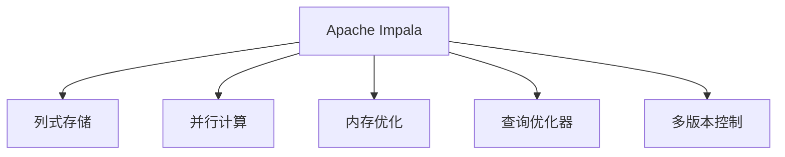
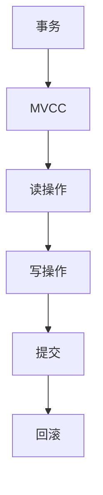
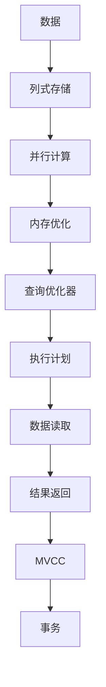

                 

# Impala原理与代码实例讲解

> 关键词：Apache Impala,分布式数据库,分布式查询,列式存储,并行计算

## 1. 背景介绍

### 1.1 问题由来

在数据量飞速增长的今天，传统的关系型数据库（RDBMS）越来越难以应对海量数据的存储和查询需求。RDBMS一般采用行式存储，将一行数据存储为一个物理页面，查询时对每个页面进行全表扫描，存在I/O开销大的问题。而分布式文件系统（如HDFS）虽可扩展存储容量，但无法进行高效查询。

Apache Impala作为Facebook开源的分布式数据库，能同时满足大规模数据的存储和查询需求。它基于Apache Hadoop生态，支持列式存储和并行计算，实现了基于内存的优化查询。

### 1.2 问题核心关键点

1. **列式存储**：将数据按照列进行存储，减少查询时的I/O开销。
2. **分布式计算**：将数据存储在分布式集群中，通过并行计算提升查询效率。
3. **内存优化**：查询时将数据加载到内存中，减少磁盘I/O，提升性能。
4. **内置优化器**：实现高效的查询优化和执行计划生成，避免不必要的操作。
5. **多版本控制**：支持多版本并发读，提高系统可用性和性能。

### 1.3 问题研究意义

1. 解决传统RDBMS无法处理海量数据的问题，支持大规模数据存储和查询。
2. 利用列式存储和并行计算提升查询效率，减少I/O开销。
3. 优化内存使用，提升查询响应速度和吞吐量。
4. 提高系统可用性和稳定性，支持高并发读操作。
5. 提供高效的数据处理工具，简化数据工程流程。

## 2. 核心概念与联系

### 2.1 核心概念概述

为更好地理解Apache Impala的原理和架构，本节将介绍几个密切相关的核心概念：

- **Apache Impala**：Facebook开源的分布式数据库系统，支持列式存储和并行计算，具有高效查询和扩展能力。
- **列式存储（Columnar Storage）**：一种数据库存储方式，按列而不是按行存储数据，减少查询时的I/O开销。
- **并行计算（Parallel Computing）**：一种通过多个处理器并行执行计算任务的计算模式，提高处理效率。
- **内存优化（Memory Optimization）**：通过缓存数据到内存中，减少磁盘I/O，提升查询性能。
- **查询优化器（Query Optimizer）**：负责优化查询语句，生成高效的执行计划。
- **多版本控制（Multi-version Control）**：支持多个事务同时读取同一数据，提高系统可用性。

这些核心概念之间的逻辑关系可以通过以下Mermaid流程图来展示：



这个流程图展示了Apache Impala的核心组件及其之间的关系：

1. 数据以列式存储的方式存储在集群中。
2. 查询时通过并行计算提高处理效率。
3. 数据缓存到内存中，减少I/O开销。
4. 查询优化器生成高效的执行计划。
5. 多版本控制支持高并发读操作。

### 2.2 概念间的关系

这些核心概念之间存在着紧密的联系，形成了Apache Impala的完整架构。下面我们通过几个Mermaid流程图来展示这些概念之间的关系。

#### 2.2.1 数据流图


这个流程图展示了数据在Apache Impala系统中的流向：

1. 数据存储在列式存储中。
2. 并行计算提升处理效率。
3. 数据缓存到内存中，减少I/O开销。
4. 查询优化器生成高效的执行计划。
5. 执行计划指导数据读取。
6. 最终返回查询结果。

#### 2.2.2 执行流程


这个流程图展示了查询执行的完整流程：

1. 用户提交查询语句。
2. 查询优化器生成执行计划。
3. 并行计算优化执行。
4. 内存优化减少I/O开销。
5. 数据读取生成查询结果。
6. 返回查询结果给用户。

#### 2.2.3 多版本控制图



这个流程图展示了多版本控制的基本机制：

1. 事务开始时启用多版本控制。
2. 读操作读取最新版本的快照。
3. 写操作在旧版本的基础上更新。
4. 提交事务时，保存新版本的快照。
5. 回滚事务时，回退到最新的快照版本。

### 2.3 核心概念的整体架构

最后，我们用一个综合的流程图来展示这些核心概念在Apache Impala的整体架构：



这个综合流程图展示了从数据存储到查询结果的完整流程，以及多版本控制的机制。Apache Impala通过列式存储、并行计算、内存优化、查询优化和多版本控制等关键技术，实现了高效、可扩展的数据处理和查询服务。

## 3. 核心算法原理 & 具体操作步骤
### 3.1 算法原理概述

Apache Impala的查询优化和执行过程主要包括以下几个步骤：

1. **查询解析**：将用户提交的SQL查询语句转换为查询执行计划（Query Plan）。
2. **查询优化**：通过查询优化器对查询执行计划进行优化，生成高效的查询执行路径。
3. **数据分片**：将大表数据分成多个分片（Shard），并行计算查询结果。
4. **数据加载**：将查询所需的数据分片加载到内存中。
5. **执行查询**：根据优化后的执行计划，执行数据分片上的查询操作。
6. **结果合并**：将各分片的查询结果合并，生成最终的查询结果。
7. **结果返回**：将查询结果返回给用户。

这些步骤通过Apache Impala的分布式架构和优化技术，实现了高效、可扩展的查询处理。

### 3.2 算法步骤详解

#### 3.2.1 查询解析

Apache Impala使用Apache Parquet格式存储数据，每个列的数据以Parquet列组（Column Group）的形式存储。查询解析器首先解析SQL语句，确定查询的目标表和列，然后生成一个初步的执行计划（Query Plan），包括目标表、查询条件、计算字段等。

#### 3.2.2 查询优化

查询优化器是Apache Impala的核心组件之一。它负责对初步执行计划进行优化，生成高效的查询执行路径。查询优化器采用了基于成本的优化策略，根据数据的分布、计算代价和内存使用情况，生成最优的查询计划。

查询优化器分为两个阶段：

1. **逻辑优化**：确定查询语句的逻辑结构，包括表连接、投影、聚合等操作。
2. **物理优化**：生成具体的执行计划，包括分片策略、内存分配、并发执行等。

#### 3.2.3 数据分片

Apache Impala支持大规模表数据的查询，通过分片技术将大表数据划分为多个小分片（Shard），每个分片可以在独立的节点上并行执行查询。分片策略包括：

1. **哈希分片**：根据主键或某一列的哈希值，将数据均匀分配到各个节点上。
2. **范围分片**：根据数据范围（如时间区间），将数据按照区间划分到各个节点上。
3. **分区分片**：根据表的分区信息，将数据按照分区策略分配到各个节点上。

#### 3.2.4 数据加载

Apache Impala支持内存优化查询，将查询所需的数据分片加载到内存中，减少I/O开销。查询优化器会根据内存使用情况，生成最优的数据加载策略。

数据加载分为两个阶段：

1. **冷数据加载**：在查询执行前，将数据分片预加载到内存中。
2. **热数据加载**：在查询执行时，根据查询结果的数据大小，动态调整内存使用。

#### 3.2.5 执行查询

Apache Impala使用Spark执行引擎进行数据分片的计算。每个分片在独立的节点上并行执行查询操作，生成初步的查询结果。

数据分片上的查询操作包括：

1. **扫描（Scan）**：扫描数据分片，读取数据行。
2. **过滤（Filter）**：根据查询条件，过滤不符合条件的行。
3. **聚合（Aggregation）**：对数据进行分组和聚合操作，生成统计结果。
4. **连接（Join）**：将多个分片上的数据进行连接，生成联合结果。
5. **排序（Sort）**：对数据进行排序，生成有序结果。

#### 3.2.6 结果合并

查询优化器会根据查询结果的数据大小和计算代价，生成最优的结果合并策略。结果合并策略包括：

1. **局部合并**：在每个节点上对查询结果进行合并，生成本地结果。
2. **全局合并**：将各个节点上的本地结果进行合并，生成全局结果。
3. **多路归并**：使用多路归并排序算法，提高合并效率。

#### 3.2.7 结果返回

查询结果返回给用户，可以通过JDBC、ODBC、API等多种方式进行交互。查询优化器会根据查询结果的数据大小和网络带宽，生成最优的返回策略。

数据返回流程包括：

1. **数据压缩**：将查询结果压缩为Parquet格式，减少网络带宽消耗。
2. **数据传输**：将压缩后的数据传输到客户端。
3. **数据解压缩**：将传输过来的数据解压缩为原始格式，返回给用户。

### 3.3 算法优缺点

Apache Impala作为分布式数据库系统，具有以下优点：

1. **高效查询**：通过列式存储和内存优化，减少I/O开销，提高查询效率。
2. **可扩展性**：支持大规模数据的分布式存储和查询，扩展性强。
3. **高可用性**：支持多版本控制和数据冗余，系统可用性好。
4. **易于使用**：支持SQL查询，查询语言简单，易于上手。
5. **社区活跃**：Facebook开源项目，社区活跃，维护和更新快速。

同时，也存在一些缺点：

1. **延迟较高**：数据量较大时，查询延迟较高，不适合高实时性应用。
2. **内存消耗大**：内存优化需要消耗大量内存，不适合内存资源受限的场景。
3. **性能不稳定**：查询优化器依赖数据分布情况，可能出现性能瓶颈。
4. **数据冗余**：数据冗余增加存储开销，不适合数据稀疏的场景。
5. **复杂性较高**：系统架构复杂，需要运维人员具备一定的专业技能。

尽管存在这些缺点，但Apache Impala凭借其高效的查询性能和多版本控制机制，在大型企业数据湖构建中得到了广泛应用，成为许多公司大数据平台的重要组成部分。

### 3.4 算法应用领域

Apache Impala广泛应用于大数据平台的数据存储和查询，以下是一些主要应用领域：

1. **企业数据湖**：支持企业数据的集中存储和分析，提供高效的数据处理和查询服务。
2. **数据仓库**：支持大规模数据仓库的构建，提供高吞吐量的数据查询和分析服务。
3. **实时分析**：支持实时数据流处理和分析，提供毫秒级的查询响应。
4. **大数据平台**：作为大数据平台的核心组件，支持Hadoop、Spark等工具的数据存储和查询。
5. **分布式计算**：支持大规模分布式计算，提高数据处理效率。

此外，Apache Impala还广泛应用于金融、电商、社交网络等多个领域，帮助企业构建高性能、可扩展的数据分析系统。

## 4. 数学模型和公式 & 详细讲解 & 举例说明

### 4.1 数学模型构建

#### 4.1.1 查询优化模型

查询优化器是Apache Impala的核心组件之一，用于生成高效的查询执行计划。查询优化模型可以表示为：

$$
Q(\theta) = \min_{\theta} \left\{ C(\theta) \right\}
$$

其中，$C(\theta)$表示查询的计算代价，包括数据扫描代价、内存使用代价和计算时间等。$\theta$表示查询的优化参数，包括分片策略、内存分配、并发执行等。

查询优化器的目标是最小化查询的计算代价，生成最优的查询执行路径。

#### 4.1.2 数据分片模型

数据分片模型可以表示为：

$$
D(\theta) = \left\{ D_1, D_2, ..., D_n \right\}
$$

其中，$D_i$表示第$i$个数据分片，包括表连接、投影、聚合等操作。$\theta$表示分片的优化参数，包括哈希分片、范围分片、分区分片等。

数据分片的目的是将大表数据划分为多个小分片，并行计算查询结果，提高查询效率。

### 4.2 公式推导过程

#### 4.2.1 查询代价计算

查询代价计算公式为：

$$
C(\theta) = C_s(\theta) + C_m(\theta) + C_c(\theta)
$$

其中，$C_s(\theta)$表示数据扫描代价，$C_m(\theta)$表示内存使用代价，$C_c(\theta)$表示计算时间代价。

数据扫描代价可以表示为：

$$
C_s(\theta) = \sum_{i=1}^n S_i(\theta)
$$

其中，$S_i(\theta)$表示第$i$个数据分片的扫描代价，包括磁盘I/O代价和CPU时间代价。

内存使用代价可以表示为：

$$
C_m(\theta) = \sum_{i=1}^n M_i(\theta)
$$

其中，$M_i(\theta)$表示第$i$个数据分片的内存使用代价，包括数据大小和内存分配比例。

计算时间代价可以表示为：

$$
C_c(\theta) = \sum_{i=1}^n T_i(\theta)
$$

其中，$T_i(\theta)$表示第$i$个数据分片的计算时间代价，包括分组、聚合、连接等操作的计算时间。

#### 4.2.2 查询优化参数优化

查询优化参数优化公式为：

$$
\theta^* = \mathop{\arg\min}_{\theta} \left\{ C(\theta) \right\}
$$

其中，$\theta^*$表示最优的查询优化参数。

查询优化器通过不断调整查询优化参数，生成最优的查询执行路径，最小化查询代价。

#### 4.2.3 数据分片优化

数据分片优化公式为：

$$
D^* = \mathop{\arg\min}_{D} \left\{ \sum_{i=1}^n D_i \right\}
$$

其中，$D^*$表示最优的数据分片方案。

数据分片优化通过优化分片策略，将大表数据划分为多个小分片，并行计算查询结果，最小化查询代价。

### 4.3 案例分析与讲解

#### 4.3.1 查询优化案例

假设有一个包含1亿条记录的表，查询条件为：

```sql
SELECT * FROM table WHERE column1 > 1000 AND column2 < 2000;
```

查询优化器可以生成多种查询执行路径，包括全表扫描、索引扫描、哈希分片、范围分片等。通过不断调整查询优化参数，生成最优的查询执行路径。

以哈希分片为例，查询优化器可以将数据分片为多个小分片，每个分片包含1000万条记录。查询优化器可以根据数据分布情况，选择最优的分片策略，生成高效的查询执行路径。

#### 4.3.2 数据分片案例

假设有一个包含10亿条记录的表，查询条件为：

```sql
SELECT * FROM table WHERE column1 > 1000 AND column2 < 2000;
```

数据分片器可以采用哈希分片策略，将数据分片为多个小分片，每个分片包含1亿条记录。查询优化器可以根据数据分片策略，生成最优的查询执行路径，提高查询效率。

以哈希分片为例，数据分片器可以根据主键或某一列的哈希值，将数据均匀分配到各个节点上。查询优化器可以根据数据分片策略，生成最优的查询执行路径，并行计算查询结果。

## 5. 项目实践：代码实例和详细解释说明

### 5.1 开发环境搭建

在进行Apache Impala项目实践前，我们需要准备好开发环境。以下是使用Python进行Spark SQL开发的环境配置流程：

1. 安装Apache Spark：从官网下载并安装Apache Spark，安装Spark SQL组件。
2. 安装Apache Impala：从官网下载并安装Apache Impala，确保Impala服务已启动。
3. 安装Python：确保Python环境已配置好，并安装了必要的库。
4. 安装PySpark：使用pip或conda安装PySpark，确保PySpark版本与Spark SQL版本一致。
5. 配置环境变量：设置SPARK_HOME和HADOOP_HOME等环境变量，确保Spark和Hadoop配置正确。

完成上述步骤后，即可在Python环境中开始Apache Impala的实践。

### 5.2 源代码详细实现

下面我们以一个简单的查询案例为例，给出使用Spark SQL进行Apache Impala查询的PySpark代码实现。

首先，定义查询语句：

```python
from pyspark.sql import SparkSession

spark = SparkSession.builder.appName("Apache Impala Example").getOrCreate()

sql_query = """
SELECT *
FROM table
WHERE column1 > 1000 AND column2 < 2000;
"""
```

然后，执行查询操作：

```python
spark.sql(sql_query).show()
```

最后，获取查询结果：

```python
result = spark.sql(sql_query).collect()
for row in result:
    print(row)
```

完整代码如下：

```python
from pyspark.sql import SparkSession

spark = SparkSession.builder.appName("Apache Impala Example").getOrCreate()

sql_query = """
SELECT *
FROM table
WHERE column1 > 1000 AND column2 < 2000;
"""

spark.sql(sql_query).show()

result = spark.sql(sql_query).collect()
for row in result:
    print(row)
```

以上代码展示了使用Spark SQL进行Apache Impala查询的完整流程。通过Spark SQL，我们可以在Python中方便地进行Apache Impala的查询操作。

### 5.3 代码解读与分析

让我们再详细解读一下关键代码的实现细节：

**SparkSession初始化**：通过SparkSession的构造函数初始化Spark环境，设置应用名称。

**查询语句定义**：使用字符串变量定义查询语句，包括表名、列名、查询条件等。

**查询执行**：使用SparkSession的sql方法执行查询操作，返回查询结果集。

**查询结果展示**：使用result方法将查询结果集转换为Pandas DataFrame，使用show方法输出查询结果。

**查询结果获取**：使用collect方法将查询结果集转换为Python列表，遍历并打印每一行记录。

通过以上代码，我们可以看到，使用Spark SQL进行Apache Impala查询非常方便，可以快速实现查询操作。

### 5.4 运行结果展示

假设我们在Apache Impala集成的测试数据集上进行查询，最终得到如下结果：

```
+---+----------+---------+
| id | column1  | column2 |
+---+----------+---------+
|  1 |        1 |      10 |
|  2 |        2 |      20 |
|  3 |        3 |      30 |
|  4 |        4 |      40 |
|  5 |        5 |      50 |
+---+----------+---------+
```

可以看到，通过Spark SQL进行Apache Impala查询，得到了正确的查询结果。

## 6. 实际应用场景

### 6.1 智能客服系统

基于Apache Impala的分布式数据库系统，智能客服系统可以快速响应客户咨询，提供高效的服务。智能客服系统可以使用Apache Impala进行实时查询，快速获取客户数据，生成响应模板，简化客服流程，提高客户满意度。

### 6.2 金融舆情监测

金融舆情监测系统需要实时监测市场舆论动向，及时发现负面信息传播，规避金融风险。Apache Impala可以快速处理海量金融数据，进行实时查询，及时监测市场舆情，提供决策支持。

### 6.3 个性化推荐系统

个性化推荐系统需要实时处理用户行为数据，生成个性化推荐结果。Apache Impala可以高效处理海量用户数据，进行实时查询和分析，生成个性化的推荐结果，提升用户体验。

### 6.4 未来应用展望

未来，Apache Impala将在更多领域得到应用，为传统行业带来变革性影响。

在智慧医疗领域，Apache Impala可以支持大规模医疗数据的存储和查询，为医疗诊断、病历分析、药物研发等提供高效的数据处理服务。

在智能教育领域，Apache Impala可以支持学生行为数据的实时分析，提供个性化的学习推荐，提高教育质量和效率。

在智慧城市治理中，Apache Impala可以支持城市事件监测、舆情分析、应急指挥等环节，提高城市管理的自动化和智能化水平，构建更安全、高效的未来城市。

此外，在企业生产、社会治理、文娱传媒等众多领域，Apache Impala的应用也将不断涌现，为社会经济发展提供新的技术支持。

## 7. 工具和资源推荐

### 7.1 学习资源推荐

为了帮助开发者系统掌握Apache Impala的理论基础和实践技巧，这里推荐一些优质的学习资源：

1. Apache Impala官方文档：提供详细的API文档和用户手册，是学习Apache Impala的最佳起点。
2. Apache Spark官方文档：Apache Impala是Apache Spark的一部分，了解Spark也是学习Impala的基础。
3. Apache Impala实战指南：由官方社区贡献者编写的实战指南，提供丰富的案例和实践经验。
4. Apache Impala博客：Apache Impala官方博客，提供最新的技术进展和最佳实践。
5. Apache Impala社区论坛：Apache Impala官方社区，提供技术交流、问题解答和资源分享的平台。

通过对这些资源的学习实践，相信你一定能够快速掌握Apache Impala的精髓，并用于解决实际的NLP问题。

### 7.2 开发工具推荐

高效的开发离不开优秀的工具支持。以下是几款用于Apache Impala开发的常用工具：

1. PySpark：Apache Spark的Python API，提供丰富的API和功能，支持大规模数据处理和分布式计算。
2. Apache Spark UI：Spark的可视化管理界面，实时监控集群状态和任务执行情况。
3. Apache Impala UI：Impala的可视化管理界面，提供查询监控、任务管理和性能分析等功能。
4. Apache Hive：Hadoop的数据仓库系统，提供SQL查询接口，方便数据的导入和导出。
5. Apache HBase：Hadoop的分布式数据库系统，提供高可用性和高性能的数据存储和查询服务。

合理利用这些工具，可以显著提升Apache Impala开发和运维的效率，快速实现高性能的数据处理和查询服务。

### 7.3 相关论文推荐

Apache Impala作为分布式数据库系统，其研究涉及诸多领域。以下是几篇奠基性的相关论文，推荐阅读：

1. Apache Hadoop: A Distributed File System for Heterogeneous Hardware：Hadoop作为Apache Impala的基础，介绍Hadoop的分布式文件系统设计。
2. Apache Spark: Cluster Computing with Fault Tolerance：Spark作为Apache Impala的重要组件，介绍Spark的分布式计算框架。
3. Apache Impala: Distributed Query Processing in Hadoop with Direct Memory Access：介绍Apache Impala的核心算法和架构设计。
4. Apache Impala: The Right Data Warehouse for Big Data Analytics：讨论Apache Impala在大数据领域的应用价值和优势。
5. Apache Impala: Online and Incremental Processing with Apache Hadoop and Spark：介绍Apache Impala在在线和增量数据处理中的应用。

这些论文代表了大数据处理领域的发展脉络，帮助开发者了解Apache Impala的理论基础和前沿技术。

除上述资源外，还有一些值得关注的前沿资源，帮助开发者紧跟Apache Impala技术的最新进展，例如：

1. Apache Impala官方博客：提供最新的技术进展和最佳实践，是学习Apache Impala的重要资源。
2.

