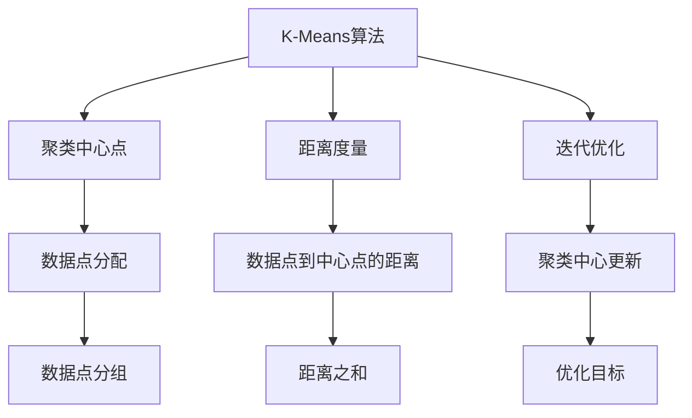
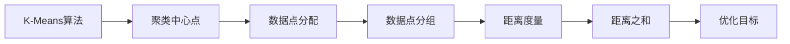
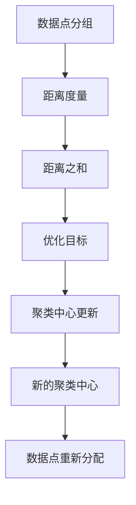
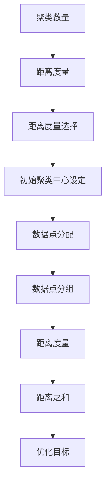

                 

# K-Means 聚类 (K-Means Clustering)

> 关键词：K-Means, 聚类, 机器学习, 数据科学, 数学模型, 算法步骤, 优缺点, 应用领域

## 1. 背景介绍

### 1.1 问题由来

聚类分析是数据挖掘中的一种重要技术，旨在将数据划分成多个类别或群组，使得每个群组内的数据点具有较高的相似度，而不同群组间的相似度较低。K-Means算法是聚类分析中最为经典的一种，被广泛应用于各种领域，如市场营销、生物信息学、图像处理、文本挖掘等。

K-Means算法的基本思想是将数据集中的点按照距离划分为K个群组，每个群组内的点尽可能地接近，而与其他群组内的点尽可能地远离。该算法简单易懂，计算效率高，因此在实际应用中得到了广泛的应用。

### 1.2 问题核心关键点

K-Means算法的设计目标是最小化每个数据点到其所在群组的中心点之间的距离，即最小化群组的中心与数据点的距离之和。具体而言，K-Means算法的主要步骤如下：

1. 初始化K个聚类中心点。
2. 将每个数据点分配到最近的聚类中心点所在的群组。
3. 重新计算每个群组的中心点。
4. 重复步骤2和步骤3，直到聚类中心不再变化或者达到预设的迭代次数。

K-Means算法的时间复杂度为O(nkt)，其中n是数据点的数量，k是聚类数量，t是迭代次数。因此，该算法的计算效率相对较高，适用于大规模数据集的聚类分析。

### 1.3 问题研究意义

K-Means算法在聚类分析中具有重要地位，其研究和应用对于数据挖掘、模式识别、图像处理、社交网络分析等领域具有重要意义。

1. 数据挖掘：K-Means算法可以用于对数据进行分组，帮助发现数据中的隐藏模式和关系。
2. 模式识别：K-Means算法可以用于对图像、语音、文本等数据进行分类和识别。
3. 图像处理：K-Means算法可以用于对图像进行分割、去噪、特征提取等处理。
4. 社交网络分析：K-Means算法可以用于对社交网络中的用户进行聚类，发现社群结构和用户行为模式。

总之，K-Means算法在数据科学领域的应用非常广泛，通过合理的参数设置和算法优化，可以解决各种实际问题。

## 2. 核心概念与联系

### 2.1 核心概念概述

为了更好地理解K-Means算法，本节将介绍几个密切相关的核心概念：

- K-Means算法：一种经典的聚类算法，通过计算数据点到聚类中心的距离，将数据划分为K个群组。
- 聚类中心点：每个群组的代表点，用于计算数据点到该群组中心点的距离。
- 距离度量：用于计算数据点之间的相似度或距离的度量标准。
- 迭代优化：通过反复迭代更新聚类中心点和数据点分配，最小化群组的中心与数据点的距离之和。
- 参数优化：包括聚类数量的选择、距离度量的选择、初始聚类中心的设定等。

这些核心概念之间的逻辑关系可以通过以下Mermaid流程图来展示：



这个流程图展示了K-Means算法的核心概念及其之间的关系：

1. K-Means算法通过计算数据点到聚类中心的距离，将数据划分为K个群组。
2. 聚类中心点是每个群组的代表点，用于计算数据点到该群组中心点的距离。
3. 距离度量用于计算数据点之间的相似度或距离。
4. 迭代优化通过反复迭代更新聚类中心点和数据点分配，最小化群组的中心与数据点的距离之和。
5. 参数优化包括聚类数量的选择、距离度量的选择、初始聚类中心的设定等。

这些概念共同构成了K-Means算法的完整框架，使其能够高效地对大规模数据集进行聚类分析。通过理解这些核心概念，我们可以更好地把握K-Means算法的原理和优化方向。

### 2.2 概念间的关系

这些核心概念之间存在着紧密的联系，形成了K-Means算法的完整生态系统。下面我们通过几个Mermaid流程图来展示这些概念之间的关系。

#### 2.2.1 K-Means算法的设计原理



这个流程图展示了K-Means算法的基本设计原理：

1. K-Means算法通过计算数据点到聚类中心的距离，将数据划分为K个群组。
2. 聚类中心点是每个群组的代表点，用于计算数据点到该群组中心点的距离。
3. 数据点分配将每个数据点分配到最近的聚类中心点所在的群组。
4. 距离度量用于计算数据点之间的相似度或距离。
5. 距离之和表示每个数据点到其所在群组的中心点之间的距离之和，是K-Means算法的优化目标。

#### 2.2.2 聚类中心点的更新方法



这个流程图展示了聚类中心点的更新方法：

1. 数据点分组将每个数据点分配到最近的聚类中心点所在的群组。
2. 距离度量用于计算数据点之间的相似度或距离。
3. 距离之和表示每个数据点到其所在群组的中心点之间的距离之和，是K-Means算法的优化目标。
4. 聚类中心更新根据每个群组的中心点，重新计算群组的中心点。
5. 数据点重新分配根据新的聚类中心点，重新计算每个数据点到其所在群组的中心点之间的距离，并分配到新的群组。

#### 2.2.3 参数优化的方法



这个流程图展示了参数优化的方法：

1. 聚类数量选择确定K的值，即聚类数量。
2. 距离度量选择选择合适的距离度量方法，如欧氏距离、曼哈顿距离等。
3. 初始聚类中心设定设定初始的聚类中心点。
4. 数据点分配将每个数据点分配到最近的聚类中心点所在的群组。
5. 数据点分组根据数据点分配结果，将数据分为K个群组。
6. 距离度量用于计算数据点之间的相似度或距离。
7. 距离之和表示每个数据点到其所在群组的中心点之间的距离之和，是K-Means算法的优化目标。

通过这些流程图，我们可以更清晰地理解K-Means算法的设计原理、核心步骤和参数优化方法，为后续深入讨论具体的算法步骤和优化技巧奠定基础。

## 3. 核心算法原理 & 具体操作步骤

### 3.1 算法原理概述

K-Means算法是一种迭代优化算法，通过反复迭代更新聚类中心点和数据点分配，最小化群组的中心与数据点的距离之和。其核心思想是通过不断优化数据点和聚类中心点的分配，使得每个数据点都尽可能地接近其所在群组的中心点，同时不同群组间的距离尽可能地大。

K-Means算法的数学模型可以表示为：

$$
\min_{C, \mu_k, z_i} \sum_{k=1}^K \sum_{i=1}^n \|z_i - \mu_k\|^2
$$

其中，$C$为聚类中心点的集合，$\mu_k$为第$k$个聚类中心点，$z_i$为第$i$个数据点，$\| \cdot \|$表示欧氏距离。

### 3.2 算法步骤详解

K-Means算法的主要步骤包括：

**Step 1: 初始化聚类中心点**
- 随机选择K个数据点作为初始聚类中心点。

**Step 2: 数据点分配**
- 对于每个数据点，计算其到每个聚类中心点的距离，将其分配到距离最近的聚类中心点所在的群组。

**Step 3: 聚类中心点更新**
- 对于每个群组，计算其内所有数据点的中心点，作为新的聚类中心点。

**Step 4: 迭代优化**
- 重复步骤2和步骤3，直到聚类中心不再变化或者达到预设的迭代次数。

具体实现中，可以通过以下Python代码来完成K-Means算法：

```python
from sklearn.cluster import KMeans
import numpy as np
import matplotlib.pyplot as plt

# 生成随机数据
X = np.random.rand(100, 2)

# 初始化K-Means模型
kmeans = KMeans(n_clusters=3, init='k-means++', random_state=0)

# 训练模型
kmeans.fit(X)

# 输出聚类中心点
print('聚类中心点：')
print(kmeans.cluster_centers_)

# 绘制聚类结果
plt.scatter(X[:, 0], X[:, 1], c=kmeans.labels_)
plt.scatter(kmeans.cluster_centers_[:, 0], kmeans.cluster_centers_[:, 1], s=300, c='red')
plt.show()
```

### 3.3 算法优缺点

K-Means算法的优点包括：

1. 算法简单易懂，实现简单。
2. 计算效率高，适用于大规模数据集。
3. 结果直观，易于解释和理解。

K-Means算法的缺点包括：

1. 对初始聚类中心点的敏感度较高，不同的初始选择可能导致不同的结果。
2. 假设每个群组内的数据点具有相似的密度，而不同群组间的数据点具有明显的差异。
3. 对于高维数据，聚类效果可能不如其他算法，如层次聚类、DBSCAN等。

### 3.4 算法应用领域

K-Means算法在聚类分析中得到了广泛的应用，以下是一些典型应用场景：

- 市场营销：通过对客户群体的聚类，发现不同的客户细分市场，制定有针对性的营销策略。
- 生物信息学：对基因序列、蛋白质结构等生物数据进行聚类，发现相似的基因家族和蛋白质结构。
- 图像处理：对图像像素进行聚类，提取图像特征和纹理信息。
- 文本挖掘：对文本数据进行聚类，发现相似的文档和主题。
- 社交网络分析：对社交网络中的用户进行聚类，发现社群结构和用户行为模式。

此外，K-Means算法还可以用于模式识别、图像分割、信号处理等领域，具有广泛的应用前景。

## 4. 数学模型和公式 & 详细讲解 & 举例说明

### 4.1 数学模型构建

K-Means算法的数学模型可以表示为：

$$
\min_{C, \mu_k, z_i} \sum_{k=1}^K \sum_{i=1}^n \|z_i - \mu_k\|^2
$$

其中，$C$为聚类中心点的集合，$\mu_k$为第$k$个聚类中心点，$z_i$为第$i$个数据点，$\| \cdot \|$表示欧氏距离。

### 4.2 公式推导过程

K-Means算法的核心是计算每个数据点与聚类中心点之间的距离，并将其分配到距离最近的聚类中心点所在的群组。公式推导过程如下：

1. 计算每个数据点与聚类中心点之间的距离：
$$
d_{ik} = \|z_i - \mu_k\|
$$

2. 将每个数据点分配到距离最近的聚类中心点所在的群组：
$$
z_i = \arg\min_{k} d_{ik}
$$

3. 计算每个群组的中心点：
$$
\mu_k = \frac{1}{|G_k|} \sum_{i \in G_k} z_i
$$

4. 计算每个数据点到其所在群组的中心点之间的距离之和：
$$
S_k = \sum_{i \in G_k} \|z_i - \mu_k\|^2
$$

5. 计算所有群组的距离之和：
$$
S = \sum_{k=1}^K S_k
$$

K-Means算法的优化目标是使得所有群组的距离之和最小化，即：

$$
\min_{C, \mu_k, z_i} S = \sum_{k=1}^K \sum_{i=1}^n \|z_i - \mu_k\|^2
$$

### 4.3 案例分析与讲解

假设我们有一组随机生成的二维数据点，如图：

```python
import matplotlib.pyplot as plt
import numpy as np

X = np.random.rand(100, 2)
plt.scatter(X[:, 0], X[:, 1], s=50, c='blue')
plt.show()
```


现在我们使用K-Means算法对这组数据进行聚类，设定聚类数量为3，迭代次数为100，随机选择初始聚类中心点，得到如下聚类结果：

```python
from sklearn.cluster import KMeans
import matplotlib.pyplot as plt

X = np.random.rand(100, 2)

# 初始化K-Means模型
kmeans = KMeans(n_clusters=3, init='k-means++', random_state=0)

# 训练模型
kmeans.fit(X)

# 输出聚类中心点
print('聚类中心点：')
print(kmeans.cluster_centers_)

# 绘制聚类结果
plt.scatter(X[:, 0], X[:, 1], c=kmeans.labels_)
plt.scatter(kmeans.cluster_centers_[:, 0], kmeans.cluster_centers_[:, 1], s=300, c='red')
plt.show()
```


从结果可以看出，K-Means算法能够将数据点分为三个群组，每个群组内的数据点尽可能地接近其所在群组的中心点，同时不同群组间的距离尽可能地大。通过调整聚类数量和迭代次数，可以控制聚类结果的数量和精细程度。

## 5. 项目实践：代码实例和详细解释说明

### 5.1 开发环境搭建

在进行K-Means算法实践前，我们需要准备好开发环境。以下是使用Python进行Scikit-learn开发的环境配置流程：

1. 安装Anaconda：从官网下载并安装Anaconda，用于创建独立的Python环境。

2. 创建并激活虚拟环境：
```bash
conda create -n sklearn-env python=3.8 
conda activate sklearn-env
```

3. 安装Scikit-learn：
```bash
conda install scikit-learn
```

4. 安装NumPy、Matplotlib等工具包：
```bash
pip install numpy matplotlib
```

完成上述步骤后，即可在`sklearn-env`环境中开始K-Means算法的实践。

### 5.2 源代码详细实现

下面我们以二维数据集为例，给出使用Scikit-learn对K-Means算法进行实现的Python代码：

```python
from sklearn.cluster import KMeans
import numpy as np
import matplotlib.pyplot as plt

# 生成随机数据
X = np.random.rand(100, 2)

# 初始化K-Means模型
kmeans = KMeans(n_clusters=3, init='k-means++', random_state=0)

# 训练模型
kmeans.fit(X)

# 输出聚类中心点
print('聚类中心点：')
print(kmeans.cluster_centers_)

# 绘制聚类结果
plt.scatter(X[:, 0], X[:, 1], c=kmeans.labels_)
plt.scatter(kmeans.cluster_centers_[:, 0], kmeans.cluster_centers_[:, 1], s=300, c='red')
plt.show()
```

### 5.3 代码解读与分析

让我们再详细解读一下关键代码的实现细节：

**生成随机数据**

```python
X = np.random.rand(100, 2)
```

使用NumPy生成一个100个随机点的二维数据集，作为K-Means算法的输入数据。

**初始化K-Means模型**

```python
kmeans = KMeans(n_clusters=3, init='k-means++', random_state=0)
```

使用Scikit-learn的KMeans类，设置聚类数量为3，初始化聚类中心点采用K-Means++算法，随机状态为0。

**训练模型**

```python
kmeans.fit(X)
```

使用训练数据集X对K-Means模型进行训练，得到聚类结果。

**输出聚类中心点**

```python
print('聚类中心点：')
print(kmeans.cluster_centers_)
```

输出聚类中心点，即每个群组的代表点。

**绘制聚类结果**

```python
plt.scatter(X[:, 0], X[:, 1], c=kmeans.labels_)
plt.scatter(kmeans.cluster_centers_[:, 0], kmeans.cluster_centers_[:, 1], s=300, c='red')
plt.show()
```

使用Matplotlib绘制聚类结果，将数据点按照聚类结果着色，同时用红色点标出聚类中心点。

### 5.4 运行结果展示

假设我们在二维数据集上进行K-Means算法聚类，得到如下聚类结果：

```python
import matplotlib.pyplot as plt
import numpy as np

X = np.random.rand(100, 2)

# 初始化K-Means模型
kmeans = KMeans(n_clusters=3, init='k-means++', random_state=0)

# 训练模型
kmeans.fit(X)

# 输出聚类中心点
print('聚类中心点：')
print(kmeans.cluster_centers_)

# 绘制聚类结果
plt.scatter(X[:, 0], X[:, 1], c=kmeans.labels_)
plt.scatter(kmeans.cluster_centers_[:, 0], kmeans.cluster_centers_[:, 1], s=300, c='red')
plt.show()
```


从结果可以看出，K-Means算法能够将数据点分为三个群组，每个群组内的数据点尽可能地接近其所在群组的中心点，同时不同群组间的距离尽可能地大。通过调整聚类数量和迭代次数，可以控制聚类结果的数量和精细程度。

## 6. 实际应用场景

### 6.1 市场营销

在市场营销领域，K-Means算法可以用于对客户群体进行聚类，发现不同的客户细分市场，制定有针对性的营销策略。例如，某电商平台收集了用户的购买历史、浏览记录、搜索关键词等信息，使用K-Means算法将这些用户进行聚类，发现不同的客户群体，针对每个群体设计不同的广告投放策略和促销活动，提高营销效果。

### 6.2 生物信息学

在生物信息学领域，K-Means算法可以用于对基因序列、蛋白质结构等生物数据进行聚类，发现相似的基因家族和蛋白质结构。例如，某基因组学研究项目收集了多个物种的基因序列数据，使用K-Means算法对这些序列进行聚类，发现不同物种之间的基因家族和蛋白质结构差异，帮助研究基因的进化和功能。

### 6.3 图像处理

在图像处理领域，K-Means算法可以用于对图像像素进行聚类，提取图像特征和纹理信息。例如，某医学影像分析项目收集了大量的CT、MRI等医学图像数据，使用K-Means算法对这些图像进行聚类，提取不同病变的特征信息，帮助医生进行诊断和治疗。

### 6.4 文本挖掘

在文本挖掘领域，K-Means算法可以用于对文本数据进行聚类，发现相似的文档和主题。例如，某新闻内容推荐系统收集了大量的新闻文章和用户反馈数据，使用K-Means算法对这些文章进行聚类，发现不同用户感兴趣的主题，提供个性化的新闻推荐，提高用户满意度。

## 7. 工具和资源推荐

### 7.1 学习资源推荐

为了帮助开发者系统掌握K-Means算法，这里推荐一些优质的学习资源：

1. 《机器学习》课程（Coursera）：由斯坦福大学Andrew Ng教授主讲的机器学习课程，涵盖了K-Means算法的基本原理和应用。

2. 《数据挖掘导论》（Introduction to Data Mining）：由Rajan S. Mooney和Michael I. Jordan合著的经典教材，详细介绍了K-Means算法及其变种。

3. 《Python数据科学手册》（Python Data Science Handbook）：由Jake VanderPlas合著的Python数据科学指南，包括K-Means算法的Python实现和优化方法。

4. K-Means算法相关论文：如K-means: A new approach to clustering and data transformations（K-Means算法原始论文），提供了K-Means算法的详细推导和优化方法。

5. Scikit-learn官方文档：提供了K-Means算法的详细使用方法和优化技巧，包括初始化方法、距离度量、参数调优等。

通过对这些资源的学习实践，相信你一定能够快速掌握K-Means算法的精髓，并用于解决实际的聚类问题。

### 7.2 开发工具推荐

高效的开发离不开优秀的工具支持。以下是几款用于K-Means算法开发的常用工具：

1. Jupyter Notebook：用于编写和运行Python代码的交互式编程环境，支持代码高亮、自动补全等功能，方便开发者调试和优化算法。

2. Python IDE：如PyCharm、Visual Studio Code等，提供代码编辑、调试、测试等功能，提高开发效率。

3. Matplotlib：用于绘制数据可视化的Python库，可以绘制散点图、聚类结果图等，帮助开发者更好地理解算法结果。

4. Scikit-learn：提供了K-Means算法的封装和优化方法，包括距离度量、聚类中心更新、参数调优等。

5. NumPy：提供了高性能的数学计算库，用于处理大规模数据集和复杂的数学运算。

6. Pandas：提供了数据处理和分析库，用于清洗、预处理和探索数据集。

合理利用这些工具，可以显著提升K-Means算法的开发效率，加快创新迭代的步伐。

### 7.3 相关论文推荐

K-Means算法在聚类分析中得到了广泛的研究和应用。以下是几篇奠基性的相关论文，推荐阅读：

1. K-means: A new approach to clustering and data transformations：提出K-Means算法的基本原理和优化方法，是K-Means算法的原始论文。

2. A Density-Based Algorithm for Discovering Clusters in Large Spatial Databases with Noise：提出DBSCAN算法，与K-Means算法相比，适用于处理高维数据和噪声数据。

3. Clustering Algorithms for Sensor Networks: A Review：总结了各种聚类算法的优缺点和适用场景，包括K-Means算法。

4. The elbow method and the V-shape criterion for cluster analysis：提出肘部法则和V形准则，用于选择聚类数量和评估聚类结果的优劣。

这些论文代表了K-Means算法的研究进展，通过学习这些前沿成果，可以帮助研究者把握学科前进方向，激发更多的创新灵感。

除上述资源外，还有一些值得关注的前沿资源，帮助开发者紧跟K-Means算法的最新进展，例如：

1. arXiv论文预印本：人工智能领域最新研究成果的发布平台，包括K-Means算法的新方法和新应用。

2. 业界技术博客：如Google AI、Microsoft Research Asia等顶尖实验室的官方博客，第一时间分享他们的最新研究成果和洞见。

3. 技术会议直播：如ICML、NIPS、ACL等人工智能领域顶会现场或在线直播，能够聆听到大佬们的前沿分享，开拓视野。

4. GitHub热门项目：在GitHub上Star、Fork数最多的K-Means算法相关项目，往往代表了该技术领域的发展趋势和最佳实践，值得去学习和贡献。

5. 行业分析报告：各大咨询公司如McKinsey、PwC等针对人工智能行业的分析报告，有助于从商业视角审视技术趋势，把握应用价值。

总之，对于K-Means算法的学习和实践，需要开发者保持开放的心态和持续学习的意愿。多关注前沿资讯，多动手实践，多思考总结，必将收获满满的成长收益。

## 8. 总结：未来发展趋势与挑战

### 8.1 研究成果总结

K-Means算法作为经典的聚类算法，在聚类分析中得到了广泛的应用。其主要研究成果包括：

