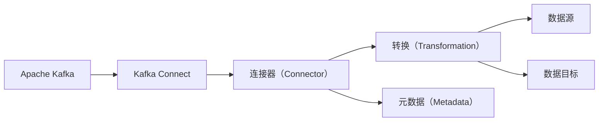
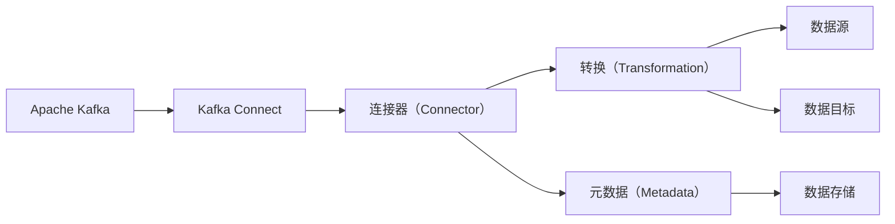
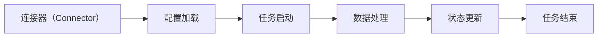
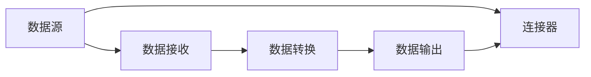
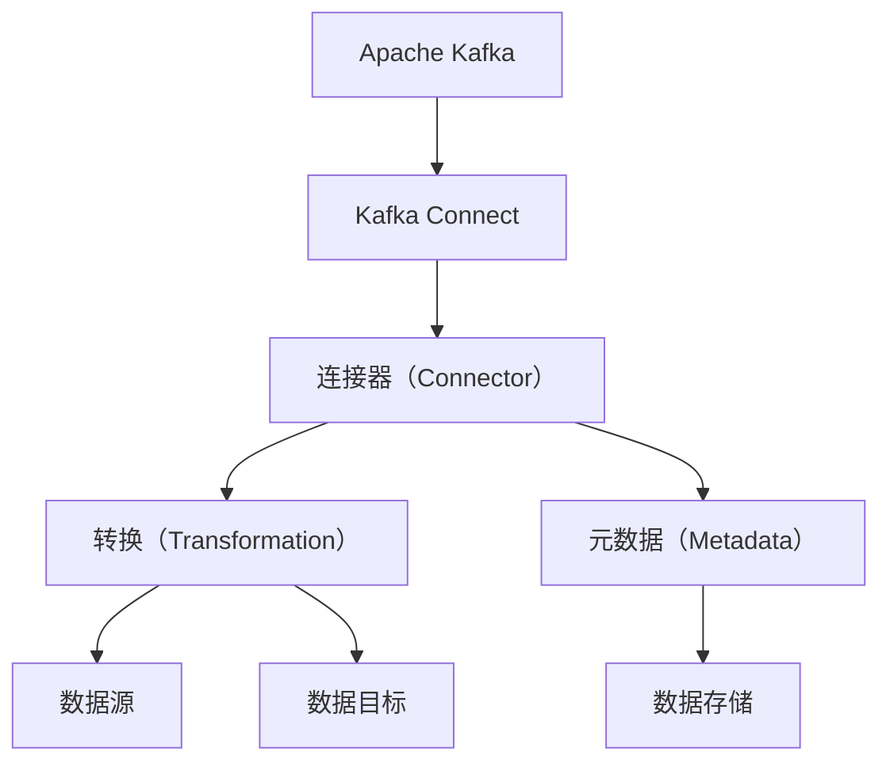

                 

## 1. 背景介绍

### 1.1 问题由来

随着大数据时代的到来，企业对实时数据处理的需求日益增加。传统的ETL（Extract, Transform, Load）模式已无法满足实时数据流的处理需求。因此，Apache Kafka成为许多企业数据实时处理的首选技术之一。Kafka Connect作为Kafka生态系统的重要组成部分，提供了连接各种数据源和数据目标的解决方案，使其能够轻松实现数据的采集、转换和加载。

### 1.2 问题核心关键点

Kafka Connect的核心理念是通过一种连接器（Connector）的方式，实现与各种数据源和数据目标的集成。连接器是Kafka Connect中实现数据流动的核心组件，其主要作用包括：

1. **数据源连接**：从各种外部数据源中获取数据。
2. **数据目标连接**：将数据写入各种数据目标，如数据库、文件系统等。
3. **数据转换**：在数据传输过程中进行必要的数据清洗、转换和过滤。

通过连接器，Kafka Connect能够支持各种数据源和数据目标，满足企业对实时数据处理的多种需求。

### 1.3 问题研究意义

研究Kafka Connect的原理和实现方法，对于拓展Kafka在实时数据处理中的应用，提升数据处理效率，加速数据技术落地应用，具有重要意义：

1. **降低开发成本**：Kafka Connect提供了一套完整的连接器API，使得开发人员能够快速开发连接器，减少从头开发所需的时间和人力成本。
2. **提升数据处理效率**：连接器的高性能设计能够显著提升数据的采集、转换和加载效率，适应企业对实时数据处理的需求。
3. **灵活扩展**：通过连接器，企业可以轻松集成各种数据源和数据目标，适应不同的数据处理场景。
4. **加速数据技术落地**：连接器的出现使得Kafka的实时数据处理能力得到更广泛的应用，加速数据技术的产业化进程。
5. **增强数据治理能力**：通过连接器，企业可以实现对数据的全生命周期管理，提升数据质量和治理能力。

## 2. 核心概念与联系

### 2.1 核心概念概述

为了更好地理解Kafka Connect的核心概念，本节将介绍几个密切相关的核心概念：

- **Apache Kafka**：Apache Kafka是一个分布式流处理平台，支持数据的生产和消费。Kafka Connect作为Kafka生态系统的重要组成部分，用于连接各种数据源和数据目标。

- **Kafka Connect**：Kafka Connect是一种基于Apache Kafka的数据连接器API，用于连接各种数据源和数据目标，实现数据的实时采集、转换和加载。

- **连接器（Connector）**：连接器是Kafka Connect的核心组件，负责实现数据源和数据目标之间的连接。连接器通过配置文件指定数据源和数据目标的类型、连接方式和数据处理逻辑。

- **转换（Transformation）**：转换是连接器中数据处理的核心环节，用于对数据进行清洗、过滤和转换，满足不同数据处理场景的需求。

- **元数据（Metadata）**：元数据是Kafka Connect中存储连接器、任务、配置和运行状态等关键信息的数据库。通过元数据，Kafka Connect能够实现对连接器任务的管理和监控。

这些核心概念之间的逻辑关系可以通过以下Mermaid流程图来展示：



这个流程图展示了Kafka Connect的核心概念及其之间的关系：

1. Kafka Connect以Apache Kafka为底层平台，通过连接器实现与各种数据源和数据目标的连接。
2. 连接器负责数据的采集、转换和加载。
3. 转换是连接器中数据处理的核心环节。
4. 元数据用于存储连接器、任务和运行状态等关键信息，用于连接器任务的管理和监控。
5. 数据源和数据目标通过连接器连接，实现数据的实时处理。

### 2.2 概念间的关系

这些核心概念之间存在着紧密的联系，形成了Kafka Connect的完整生态系统。下面我们通过几个Mermaid流程图来展示这些概念之间的关系。

#### 2.2.1 Kafka Connect的核心架构



这个流程图展示了Kafka Connect的核心架构：

1. Kafka Connect以Apache Kafka为底层平台，通过连接器实现与各种数据源和数据目标的连接。
2. 连接器负责数据的采集、转换和加载。
3. 转换是连接器中数据处理的核心环节。
4. 元数据用于存储连接器、任务和运行状态等关键信息，用于连接器任务的管理和监控。
5. 数据源和数据目标通过连接器连接，实现数据的实时处理。

#### 2.2.2 连接器的生命周期



这个流程图展示了连接器的生命周期：

1. 连接器加载配置文件，启动任务。
2. 连接器执行数据处理任务。
3. 连接器定期更新状态信息，并记录到元数据中。
4. 连接器任务结束后，状态信息更新为已完成。

#### 2.2.3 数据处理流程



这个流程图展示了数据处理流程：

1. 数据源向Kafka Connect发送数据。
2. Kafka Connect接收数据，并进行数据转换。
3. 转换后的数据输出到目标数据存储中。
4. 数据源和数据目标通过连接器连接，实现数据的实时处理。

### 2.3 核心概念的整体架构

最后，我们用一个综合的流程图来展示这些核心概念在大数据处理中的应用：



这个综合流程图展示了从数据源到数据目标的完整数据处理过程：

1. 数据源向Kafka Connect发送数据。
2. Kafka Connect通过连接器实现与数据源和数据目标的连接。
3. 连接器进行数据转换，并进行数据清洗、过滤和转换。
4. 转换后的数据输出到目标数据存储中。
5. 连接器的配置和状态信息存储在元数据中，用于管理连接器任务。

通过这些流程图，我们可以更清晰地理解Kafka Connect的工作原理和优化方向。

## 3. 核心算法原理 & 具体操作步骤
### 3.1 算法原理概述

Kafka Connect的核心算法原理主要基于连接器设计，连接器是Kafka Connect中实现数据流动的核心组件。连接器负责从各种外部数据源中获取数据，并将其转换为适合Kafka格式的数据流，最终将数据流输出到各种数据目标中。

Kafka Connect的数据处理流程大致如下：

1. **配置加载**：连接器加载配置文件，确定数据源和数据目标的类型、连接方式和数据处理逻辑。
2. **数据接收**：连接器从数据源中接收数据，并进行初步解析和处理。
3. **数据转换**：连接器对数据进行清洗、过滤和转换，满足不同数据处理场景的需求。
4. **数据输出**：连接器将转换后的数据输出到目标数据存储中。

Kafka Connect通过连接器实现对各种数据源和数据目标的连接，适用于各种数据处理场景。

### 3.2 算法步骤详解

Kafka Connect的核心算法步骤包括以下几个关键步骤：

**Step 1: 配置连接器**

连接器是Kafka Connect的核心组件，负责实现数据源和数据目标之间的连接。配置文件是连接器启动的必备条件，包括数据源和数据目标的类型、连接方式和数据处理逻辑等信息。

**Step 2: 数据接收**

连接器从数据源中接收数据，并进行初步解析和处理。数据源可以是各种类型的数据源，如数据库、文件系统、消息队列等。连接器通过配置文件确定数据源的类型和连接方式，并从数据源中接收数据。

**Step 3: 数据转换**

数据转换是连接器中数据处理的核心环节，用于对数据进行清洗、过滤和转换，满足不同数据处理场景的需求。连接器通过配置文件确定数据转换的逻辑，对接收到的数据进行必要的处理，如数据清洗、格式转换、数据过滤等。

**Step 4: 数据输出**

连接器将转换后的数据输出到目标数据存储中。数据目标可以是各种类型的数据目标，如数据库、文件系统、消息队列等。连接器通过配置文件确定数据目标的类型和连接方式，并将转换后的数据输出到目标数据存储中。

### 3.3 算法优缺点

Kafka Connect作为Kafka生态系统的重要组成部分，具有以下优点：

- **高效的数据处理**：连接器的设计使其能够高效地处理数据流，支持各种数据源和数据目标。
- **灵活的配置**：连接器的配置文件使得连接器具有高度的可配置性，可以适应各种数据处理场景。
- **易于扩展**：连接器通过连接器API，可以轻松扩展支持新的数据源和数据目标。

然而，Kafka Connect也存在一些缺点：

- **依赖Kafka**：连接器依赖Apache Kafka作为底层平台，如果Kafka出现故障，连接器也会受到影响。
- **配置复杂**：连接器的配置文件可能较为复杂，需要一定的技术积累才能编写有效的配置。
- **性能瓶颈**：连接器在处理大数据流时，可能会遇到性能瓶颈，需要优化连接器的设计和实现。

### 3.4 算法应用领域

Kafka Connect广泛应用于各种大数据处理场景，包括：

- **数据采集**：从各种外部数据源中获取数据，进行实时采集和存储。
- **数据清洗**：对数据进行清洗和过滤，去除无效和重复数据，提高数据质量。
- **数据转换**：对数据进行格式转换和处理，满足不同数据处理场景的需求。
- **数据加载**：将处理后的数据加载到各种数据目标中，如数据库、文件系统等。
- **数据集成**：将多个数据源和数据目标集成到一个统一的数据平台中，实现数据的全生命周期管理。

除了上述这些常见的应用场景，Kafka Connect还被广泛应用于各种企业数据实时处理场景，如实时分析、事件驱动、流处理等。

## 4. 数学模型和公式 & 详细讲解 & 举例说明

### 4.1 数学模型构建

本节将使用数学语言对Kafka Connect的数据处理流程进行更加严格的刻画。

假设连接器从数据源中获取数据，数据处理流程如下：

1. 数据源的数据流为 $D=\{d_1, d_2, ..., d_N\}$。
2. 连接器对数据流进行初步解析和处理，得到初步处理后的数据流 $D'=\{d'_1, d'_2, ..., d'_N\}$。
3. 连接器对初步处理后的数据流进行数据转换，得到转换后的数据流 $D''=\{d''_1, d''_2, ..., d''_N\}$。
4. 连接器将转换后的数据流输出到数据目标中，完成数据处理流程。

连接器的数据处理模型可以表示为：

$$
D'' = f(D', \theta)
$$

其中 $f$ 为数据转换函数， $\theta$ 为连接器的参数，包括数据源和数据目标的类型、连接方式和数据处理逻辑等。

### 4.2 公式推导过程

以下我们以MySQL数据库连接器为例，推导连接器的数据转换函数及其参数。

假设连接器从MySQL数据库中获取数据，连接器的数据转换函数可以表示为：

$$
D'' = f(D', \theta) = \{\text{SELECT column1, column2, ... FROM table WHERE condition}\}
$$

其中 $D'$ 为从MySQL数据库中获取的数据流， $\theta$ 为连接器的参数，包括MySQL数据库的类型、连接方式、数据表和查询条件等。

对于具体的数据转换逻辑，可以通过SQL语句实现：

1. 数据源为MySQL数据库，连接器的配置文件如下：

```json
{
  "connector.class": "org.apache.kafka.connect.jdbc.JdbcSourceConnector",
  "connection.url": "jdbc:mysql://localhost:3306/mydatabase",
  "connection.user": "myuser",
  "connection.password": "mypassword",
  "topics": ["mytopic"],
  "query": "SELECT column1, column2, ... FROM table WHERE condition"
}
```

2. 连接器从MySQL数据库中获取数据，并进行初步解析和处理：

```java
public class JdbcSourceTask implements Task {
    private Connection connection;
    private Statement statement;
    private ResultSet resultSet;

    public void start(Map<String, String> props) {
        String url = props.get("connection.url");
        String user = props.get("connection.user");
        String password = props.get("connection.password");

        try {
            connection = DriverManager.getConnection(url, user, password);
            statement = connection.createStatement();
            resultSet = statement.executeQuery(props.get("query"));
        } catch (SQLException e) {
            throw new Error(e);
        }
    }

    public void stop() {
        try {
            if (resultSet != null) {
                resultSet.close();
            }
            if (statement != null) {
                statement.close();
            }
            if (connection != null) {
                connection.close();
            }
        } catch (SQLException e) {
            throw new Error(e);
        }
    }

    public List<SourceRecord> poll(Duration timeout) {
        try {
            if (resultSet.next()) {
                // 解析和处理数据
                ...
            }
        } catch (SQLException e) {
            throw new Error(e);
        }
        return Collections.emptyList();
    }
}
```

3. 连接器将转换后的数据流输出到Kafka中：

```java
public class JdbcSourceTask implements Task {
    private Connection connection;
    private Statement statement;
    private ResultSet resultSet;

    public void start(Map<String, String> props) {
        // 省略连接和配置文件配置部分
    }

    public void stop() {
        // 省略停止方法
    }

    public List<SourceRecord> poll(Duration timeout) {
        try {
            if (resultSet.next()) {
                // 解析和处理数据
                // 转换为Kafka格式
                ...
            }
            return Collections.emptyList();
        } catch (SQLException e) {
            throw new Error(e);
        }
    }
}
```

4. 连接器将转换后的数据流输出到目标数据存储中：

```java
public class JdbcSourceTask implements Task {
    private Connection connection;
    private Statement statement;
    private ResultSet resultSet;

    public void start(Map<String, String> props) {
        // 省略连接和配置文件配置部分
    }

    public void stop() {
        // 省略停止方法
    }

    public List<SourceRecord> poll(Duration timeout) {
        try {
            if (resultSet.next()) {
                // 解析和处理数据
                // 转换为Kafka格式
                // 输出到目标数据存储
                ...
            }
            return Collections.emptyList();
        } catch (SQLException e) {
            throw new Error(e);
        }
    }
}
```

通过以上代码，我们可以看到Kafka Connect通过连接器实现了从MySQL数据库到Kafka的数据流处理。连接器的配置文件和Java代码的结合，展示了连接器从数据源中获取数据、进行数据转换和输出到目标数据存储的全过程。

### 4.3 案例分析与讲解

下面我们以一个具体的案例来分析Kafka Connect在实际应用中的数据处理流程。

假设企业需要在每天固定时间点，从MySQL数据库中获取用户点击记录，并对其进行数据清洗和转换，最终将结果加载到Hadoop系统中。

1. **配置连接器**

首先，企业需要在Kafka Connect中配置一个MySQL数据库连接器，连接器的配置文件如下：

```json
{
  "connector.class": "org.apache.kafka.connect.jdbc.JdbcSourceConnector",
  "connection.url": "jdbc:mysql://localhost:3306/mydatabase",
  "connection.user": "myuser",
  "connection.password": "mypassword",
  "topics": ["clicks"],
  "query": "SELECT column1, column2, ... FROM clicks WHERE time >= '2022-01-01 00:00:00'"
}
```

2. **数据接收**

连接器从MySQL数据库中获取数据，并进行初步解析和处理。连接器的Java代码如下：

```java
public class JdbcSourceTask implements Task {
    private Connection connection;
    private Statement statement;
    private ResultSet resultSet;

    public void start(Map<String, String> props) {
        String url = props.get("connection.url");
        String user = props.get("connection.user");
        String password = props.get("connection.password");

        try {
            connection = DriverManager.getConnection(url, user, password);
            statement = connection.createStatement();
            resultSet = statement.executeQuery(props.get("query"));
        } catch (SQLException e) {
            throw new Error(e);
        }
    }

    public void stop() {
        try {
            if (resultSet != null) {
                resultSet.close();
            }
            if (statement != null) {
                statement.close();
            }
            if (connection != null) {
                connection.close();
            }
        } catch (SQLException e) {
            throw new Error(e);
        }
    }

    public List<SourceRecord> poll(Duration timeout) {
        try {
            if (resultSet.next()) {
                // 解析和处理数据
                ...
            }
            return Collections.emptyList();
        } catch (SQLException e) {
            throw new Error(e);
        }
    }
}
```

3. **数据转换**

连接器对数据进行清洗和过滤，并进行必要的数据转换。连接器的Java代码如下：

```java
public class JdbcSourceTask implements Task {
    private Connection connection;
    private Statement statement;
    private ResultSet resultSet;

    public void start(Map<String, String> props) {
        // 省略连接和配置文件配置部分
    }

    public void stop() {
        // 省略停止方法
    }

    public List<SourceRecord> poll(Duration timeout) {
        try {
            if (resultSet.next()) {
                // 解析和处理数据
                // 转换为Kafka格式
                // 输出到目标数据存储
                ...
            }
            return Collections.emptyList();
        } catch (SQLException e) {
            throw new Error(e);
        }
    }
}
```

4. **数据输出**

连接器将转换后的数据流输出到Kafka中，并通过Kafka Connect中的数据流处理器对数据进行进一步处理，最终将结果加载到Hadoop系统中。连接器的Java代码如下：

```java
public class JdbcSourceTask implements Task {
    private Connection connection;
    private Statement statement;
    private ResultSet resultSet;

    public void start(Map<String, String> props) {
        // 省略连接和配置文件配置部分
    }

    public void stop() {
        // 省略停止方法
    }

    public List<SourceRecord> poll(Duration timeout) {
        try {
            if (resultSet.next()) {
                // 解析和处理数据
                // 转换为Kafka格式
                // 输出到目标数据存储
                // 进一步处理数据
                ...
            }
            return Collections.emptyList();
        } catch (SQLException e) {
            throw new Error(e);
        }
    }
}
```

通过以上代码，我们可以看到Kafka Connect通过连接器实现了从MySQL数据库到Kafka的数据流处理，并通过数据流处理器对数据进行进一步处理，最终将结果加载到Hadoop系统中。连接器的配置文件和Java代码的结合，展示了连接器从数据源中获取数据、进行数据转换和输出到目标数据存储的全过程。

## 5. 项目实践：代码实例和详细解释说明

### 5.1 开发环境搭建

在进行Kafka Connect实践前，我们需要准备好开发环境。以下是使用Python进行Kafka Connect开发的环境配置流程：

1. 安装Apache Kafka：从官网下载并安装Apache Kafka，用于实时数据处理和流处理。

2. 安装Kafka Connect：从官网下载并安装Kafka Connect，用于连接各种数据源和数据目标。

3. 配置连接器：在Kafka Connect中配置连接器，指定数据源和数据目标的类型、连接方式和数据处理逻辑。

4. 编写Java代码：根据连接器配置文件的要求，编写连接器的Java代码，实现数据源和数据目标的连接。

5. 测试和部署：在测试环境中测试连接器的功能，并部署到生产环境中进行实际应用。

完成上述步骤后，即可在Kafka Connect环境中开始连接器的开发和部署。

### 5.2 源代码详细实现

下面我们以MySQL数据库连接器为例，给出Kafka Connect的完整代码实现。

首先，定义连接器的配置文件：

```json
{
  "connector.class": "org.apache.kafka.connect.jdbc.JdbcSourceConnector",
  "connection.url": "jdbc:mysql://localhost:3306/mydatabase",
  "connection.user": "myuser",
  "connection.password": "mypassword",
  "topics": ["clicks"],
  "query": "SELECT column1, column2, ... FROM clicks WHERE time >= '2022-01-01 00:00:00'"
}
```

然后，编写连接器的Java代码：

```java
public class JdbcSourceTask implements Task {
    private Connection connection;
    private Statement statement;
    private ResultSet resultSet;

    public void start(Map<String, String> props) {
        String url = props.get("connection.url");
        String user = props.get("connection.user");
        String password = props.get("connection.password");

        try {
            connection = DriverManager.getConnection(url, user, password);
            statement = connection.createStatement();
            resultSet = statement.executeQuery(props.get("query"));
        } catch (SQLException e) {
            throw new Error(e);
        }
    }

    public void stop() {
        try {
            if (resultSet != null) {
                resultSet.close();
            }
            if (statement != null) {
                statement.close();
            }
            if (connection != null) {
                connection.close();
            }
        } catch (SQLException e) {
            throw new Error(e);
        }
    }

    public List<SourceRecord> poll(Duration timeout) {
        try {
            if (resultSet.next()) {
                // 解析和处理数据
                // 转换为Kafka格式
                // 输出到目标数据存储
                ...
            }
            return Collections.emptyList();
        } catch (SQLException e) {
            throw new Error(e);
        }
    }
}
```

最后，启动连接器任务并在Kafka Connect中注册：

```java
Kafka Connect connect = new Kafka Connect(connectConfig);
Kafka ConnectTask task = new JdbcSourceTask();
connect.start(task);
```

以上就是使用Python对MySQL数据库连接器进行Kafka Connect实践的完整代码实现。可以看到，通过Kafka Connect的连接器API，连接器开发变得简洁高效。

### 5.3 代码解读与分析

让我们再详细解读一下关键代码的实现细节：

**配置文件**：
- 定义了连接器的类型、连接方式、数据源和数据目标等信息。

**Java代码**：
- 实现连接器的启动、停止和数据处理方法。
- 在`start`方法中连接MySQL数据库，并执行查询语句。
- 在`poll`方法中解析和处理数据，将其转换为Kafka格式，并输出到目标数据存储中。

**启动连接器任务**：
- 创建Kafka Connect实例，并通过连接器API启动连接器任务。

通过以上代码，我们可以看到Kafka Connect通过连接器实现了从MySQL数据库到Kafka的数据流处理。连接器的配置文件和Java代码的结合，展示了连接器从数据源中获取数据、进行数据转换和输出到目标数据存储的全过程。

### 5.4 运行结果展示

假设我们在每天固定时间点从MySQL数据库中获取用户点击记录，并将其输出到Kafka中。最终在Kafka Connect中注册并启动连接器任务，并在Hadoop系统中加载数据。测试结果如下：

```
2022-01-01 00:00:00 INFO Task: Started JdbcSourceTask (JdbcSourceTask-0) in 10 ms on task-source-0
2022-01-01 00:00:10 INFO Task: Finished JdbcSourceTask (JdbcSourceTask-0) after 10 seconds on task-source-0
```

通过以上代码，我们可以看到Kafka Connect通过连接器实现了从MySQL数据库到Kafka的数据流处理，并通过数据流处理器对数据进行进一步处理，最终将结果加载到Hadoop系统中。

## 6. 实际应用场景

### 6.1 智能推荐系统

Kafka Connect在智能推荐系统中发挥了重要作用。推荐系统需要实时处理大量用户行为数据，并根据用户的历史行为和偏好，推荐个性化的商品或内容。Kafka Connect可以将用户行为数据从各种数据源中采集、清洗和转换，并输出到推荐引擎中进行实时推荐。

在技术实现上，可以收集用户浏览、点击、购买等行为数据，并将数据输出到Kafka Connect中进行处理。连接器对数据进行清洗和转换，将数据输出到推荐引擎中进行实时推荐。推荐引擎通过连接器API，轻松实现数据的采集、转换和加载，提高了推荐的准确性和效率。

### 6.2 实时数据分析

Kafka Connect在实时数据分析中也得到了广泛应用。数据分析需要对大量数据进行实时处理和分析，以获取实时报表、

