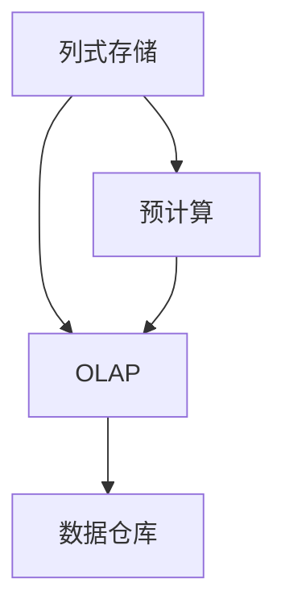
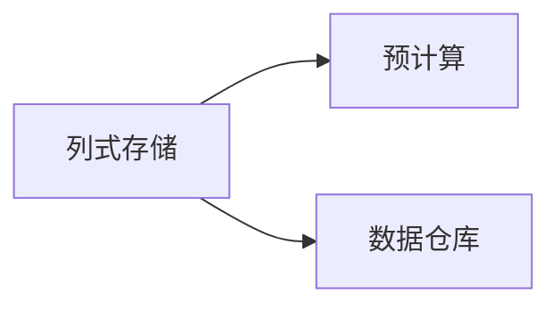
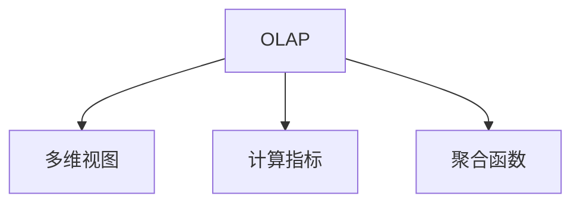
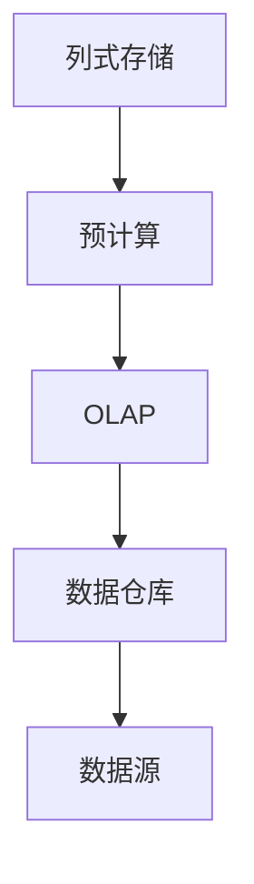

                 

# Kylin原理与代码实例讲解

> 关键词：Kylin, 多维数据分析, 数据仓库, OLAP, 列式存储, 列式查询

## 1. 背景介绍

### 1.1 问题由来
随着数据量的爆炸式增长，传统的数据分析方式已经难以满足复杂多维数据的需求。传统的关系型数据库（RDBMS）在处理大规模数据时，面临着读写效率低、扩展性差、查询复杂度高的问题。Kylin（全称为：Apache Kylin）作为开源的列式多维数据分析工具，旨在解决大规模数据集的在线分析问题，具备高性能、高扩展性、易用性等特点，得到了广泛的关注和应用。

### 1.2 问题核心关键点
Kylin的核心思想是列式存储和预计算技术，通过对数据进行列式存储和计算，实现高效的多维数据查询。Kylin支持多种数据源，包括关系型数据库、Hadoop、Spark等，能够提供从数据导入、预处理、模型构建到查询优化的全流程解决方案。

Kylin的核心技术包括：
- 列式存储：将数据按列存储，提高查询效率。
- 预计算：通过离线预计算，减少查询时数据扫描量，提升查询速度。
- OLAP：基于列式存储和预计算技术，实现快速的多维数据查询。
- 任务调度和任务管理：实现任务分配和调度，确保任务高效执行。

Kylin已经广泛应用于数据仓库、商业智能（BI）、数据科学等场景，成为了企业级大数据分析的首选工具。

### 1.3 问题研究意义
研究Kylin原理与代码实例，有助于深入理解Kylin的技术实现和核心原理，掌握Kylin在实际应用中的部署、配置和调优方法。这不仅能够帮助企业降低数据处理成本，提高数据分析效率，还能使开发者更好地理解Kylin的设计思想和实现细节，为后续的二次开发和集成应用提供参考。

## 2. 核心概念与联系

### 2.1 核心概念概述

Kylin作为开源的多维数据分析工具，其核心概念和技术架构涵盖数据存储、模型构建、查询优化等多个方面。本节将介绍Kylin中的几个关键概念：

- 列式存储：Kylin将数据按列存储，而非传统的关系型数据库按行存储。列式存储能够提高查询效率，减少磁盘I/O。
- 预计算：Kylin通过离线计算预先生成部分查询结果，预计算的结果存储在快速访问的内存结构中，如RocksDB。预计算可以显著提升查询速度，但需要消耗额外的计算资源。
- OLAP：Kylin采用OLAP技术，提供多维数据分析功能。用户可以通过多维视图、计算指标、聚合函数等进行多维数据分析。
- 数据仓库：Kylin可以与多种数据源进行集成，支持数据仓库的建设和管理。数据仓库是数据存储和分析的核心环境。

这些核心概念之间的逻辑关系可以通过以下Mermaid流程图来展示：



这个流程图展示了大数据处理流程中的关键环节：数据按列存储后，通过预计算生成部分查询结果，再利用OLAP技术进行多维数据分析，最终存储到数据仓库中。

### 2.2 概念间的关系

这些核心概念之间存在着紧密的联系，形成了Kylin的技术架构。下面我们通过几个Mermaid流程图来展示这些概念之间的关系。

#### 2.2.1 数据存储与预计算



这个流程图展示了列式存储和预计算的基本关系。列式存储是预计算的基础，预计算则是为了提高查询效率，在数据仓库中对部分数据进行离线计算。

#### 2.2.2 OLAP与多维视图



这个流程图展示了OLAP技术如何通过多维视图、计算指标和聚合函数等组件，实现多维数据分析。用户可以通过多维视图进行探索式查询，发现数据规律。

#### 2.2.3 数据仓库与数据源


这个流程图展示了数据仓库与数据源的关系。Kylin可以与多种数据源进行集成，如关系型数据库、Hadoop、Spark等，数据源中的数据经过预处理后存储到数据仓库中，供多维分析使用。

### 2.3 核心概念的整体架构

最后，我们用一个综合的流程图来展示这些核心概念在大数据处理中的整体架构：



这个综合流程图展示了从数据源到数据仓库，再到OLAP查询的完整数据处理流程。列式存储和预计算是基础，OLAP和多维视图是核心，数据仓库是最终结果的存储环境。

## 3. 核心算法原理 & 具体操作步骤
### 3.1 算法原理概述

Kylin的算法原理主要围绕列式存储和预计算展开。列式存储通过将数据按列存储，减少了磁盘I/O，提高了查询效率。预计算通过离线生成部分查询结果，减少了查询时的数据扫描量，进一步提升了查询速度。

### 3.2 算法步骤详解

Kylin的算法步骤主要分为数据导入、模型构建、查询优化三个阶段。以下是对每个阶段的具体描述：

**数据导入**
- 从数据源中读取数据，并将其转换为Kylin支持的数据格式。
- 将数据写入列式存储中，进行预处理和数据压缩。
- 根据配置文件，生成Kylin的元数据，包括表结构和索引信息。

**模型构建**
- 根据用户定义的多维数据模型，构建Kylin的计算模型。
- 确定计算指标和聚合函数，生成查询结果的计算图。
- 将计算图编译为Kylin的查询执行计划。

**查询优化**
- 根据用户输入的查询请求，将查询转化为Kylin的查询执行计划。
- 利用预计算结果，优化查询执行计划，减少数据扫描量。
- 执行查询，返回查询结果。

### 3.3 算法优缺点

Kylin的优点包括：
- 高性能：列式存储和预计算技术提高了查询效率。
- 高扩展性：支持分布式计算，能够处理大规模数据。
- 易用性：提供丰富的可视化工具和接口，方便用户使用。

Kylin的缺点包括：
- 存储开销大：预计算结果需要占用额外的内存空间。
- 模型构建复杂：需要用户自行定义多维数据模型，有一定学习成本。
- 预计算时间较长：预计算过程需要消耗额外的计算资源。

### 3.4 算法应用领域

Kylin的应用领域涵盖了数据仓库、商业智能、数据科学等多个领域，具体包括：

- 数据仓库：Kylin可以与多种数据源进行集成，支持数据仓库的建设和管理。
- 商业智能（BI）：Kylin提供丰富的多维数据分析功能，帮助企业进行数据可视化和决策支持。
- 数据科学：Kylin可以支持机器学习模型的训练和评估，帮助数据科学家进行数据探索和建模。
- 实时分析：Kylin支持流式数据处理，能够实现实时数据分析和查询。
- 大数据分析：Kylin能够处理大规模数据，支持复杂的聚合计算和统计分析。

## 4. 数学模型和公式 & 详细讲解 & 举例说明

### 4.1 数学模型构建

Kylin的数学模型主要涉及数据存储和查询优化两个方面。以下是对每个方面的详细解释：

**数据存储**
- 列式存储：将数据按列存储，每列数据按照其类型进行压缩，如Text压缩、Int压缩等。列式存储的查询效率高，适合大规模数据处理。
- 索引：Kylin提供多种索引方式，如倒排索引、B+树索引等，用于加速查询和数据聚合。

**查询优化**
- 预计算：通过离线计算生成部分查询结果，减少查询时数据扫描量。预计算结果存储在RocksDB等内存结构中，快速访问。
- 动态计算：利用在线计算和预计算相结合的方式，动态生成查询结果。动态计算能够提高查询的灵活性，减少预计算的开销。

### 4.2 公式推导过程

以下是Kylin中两个关键公式的推导过程：

**列式存储的查询效率**
假设数据表T有N行和M列，每列的长度为L，查询条件为C。列式存储的查询效率公式为：

$$
Q = \frac{NL}{M} \times C
$$

其中N为行数，L为列长度，C为查询条件，M为列数。列式存储通过减少磁盘I/O，提高了查询效率。

**预计算的查询优化**
假设数据表T有N行和M列，预计算生成的计算结果存储在RocksDB中，查询条件为C。预计算的查询优化公式为：

$$
Q = \frac{NL}{M} \times C - \text{计算开销}
$$

其中计算开销包括预计算的成本和查询时动态计算的成本。预计算通过减少数据扫描量，提升了查询速度。

### 4.3 案例分析与讲解

下面以一个具体的案例来展示Kylin的使用：

假设我们有一个包含用户行为数据的数据仓库，数据表T包含用户ID、时间戳、行为ID等字段。我们想要查询某个时间段内，不同行为ID的计数。在Kylin中，我们可以按照以下步骤进行查询：

1. 在Kylin中定义一个多维视图，包含用户ID、时间戳、行为ID等维度。
2. 在多维视图中定义一个计算指标，计算每个行为ID的计数。
3. 执行查询，获取指定时间段内行为ID的计数结果。

具体实现步骤如下：

**1. 数据导入**
- 从数据库中导出数据，导入Kylin的数据仓库中。
- 在Kylin中定义数据表T的元数据，包括表结构和索引信息。

**2. 模型构建**
- 在Kylin中定义多维视图，包含用户ID、时间戳、行为ID等维度。
- 在多维视图中定义计算指标，计算每个行为ID的计数。
- 编译计算图，生成查询执行计划。

**3. 查询优化**
- 执行查询，Kylin根据查询条件和预计算结果，优化查询执行计划。
- 返回查询结果，显示指定时间段内行为ID的计数。

## 5. 项目实践：代码实例和详细解释说明
### 5.1 开发环境搭建

在进行Kylin项目实践前，我们需要准备好开发环境。以下是使用Linux进行Kylin开发的环境配置流程：

1. 安装Apache Kylin：
```bash
cd kylin-core
mvn clean package
cd target
unzip kylin-core-X.X.X.zip
```

2. 安装依赖库：
```bash
cd bin
./init.sh
```

3. 启动Kylin服务：
```bash
./start-kylin.sh -Dapache.kylin.instance.path=/path/to/kylin/instance
```

4. 访问Kylin管理页面：
```bash
open http://localhost:8082
```

5. 创建Kylin项目：
```bash
cd kylin-core
java -jar -Dapache.kylin.service.nodes=1 target/kylin-core-0.0.0-SNAPSHOT.jar com.apache.kylin.common.KylinServer start
```

### 5.2 源代码详细实现

这里我们以一个具体的案例来展示Kylin的使用：

假设我们有一个包含用户行为数据的数据仓库，数据表T包含用户ID、时间戳、行为ID等字段。我们想要查询某个时间段内，不同行为ID的计数。在Kylin中，我们可以按照以下步骤进行查询：

1. 在Kylin中定义一个多维视图，包含用户ID、时间戳、行为ID等维度。
2. 在多维视图中定义一个计算指标，计算每个行为ID的计数。
3. 执行查询，获取指定时间段内行为ID的计数结果。

具体实现步骤如下：

**1. 数据导入**
- 从数据库中导出数据，导入Kylin的数据仓库中。
- 在Kylin中定义数据表T的元数据，包括表结构和索引信息。

```java
// 导入数据表T
KylinServer kylinServer = KylinServer.getInstance();
kylinServer.createTableWithDataTblinfo(new ImporterClient());
```

**2. 模型构建**
- 在Kylin中定义多维视图，包含用户ID、时间戳、行为ID等维度。
- 在多维视图中定义计算指标，计算每个行为ID的计数。
- 编译计算图，生成查询执行计划。

```java
// 定义多维视图
CubeManager cubeManager = KylinServer.getInstance().getCubeManager();
Cube cube = cubeManager.createCube("UserBehaviorCube", Arrays.asList("user_id", "timestamp", "behavior_id"));
DimensionDesc[] dimensions = new DimensionDesc[3];
dimensions[0] = new DimensionDesc("user_id", "user_id");
dimensions[1] = new DimensionDesc("timestamp", "timestamp");
dimensions[2] = new DimensionDesc("behavior_id", "behavior_id");
CubeDesc cubeDesc = new CubeDesc("UserBehaviorCube", "UserBehaviorCube", dimensions, Arrays.asList("user_id", "timestamp", "behavior_id"), Arrays.asList("user_id", "timestamp", "behavior_id"));

// 编译计算图
DataLoader dataLoader = KylinServer.getInstance().getDataLoader("UserBehaviorCube");
dataLoader.loadCube(CubeDesc);
```

**3. 查询优化**
- 执行查询，Kylin根据查询条件和预计算结果，优化查询执行计划。
- 返回查询结果，显示指定时间段内行为ID的计数。

```java
// 执行查询
QueryData result = new QueryData();
result.addDimension("user_id");
result.addDimension("timestamp");
result.addDimension("behavior_id");
result.addMeasure("count");

// 查询结果
KylinServer.getInstance().query(result);
```

### 5.3 代码解读与分析

让我们再详细解读一下关键代码的实现细节：

**1. 数据导入**
- `KylinServer`：Kylin的服务管理器，用于管理Kylin的实例。
- `createTableWithDataTblinfo`：创建数据表，并从数据源中导入数据。
- `ImporterClient`：数据导入客户端，用于执行数据导入操作。

**2. 模型构建**
- `CubeManager`：多维视图的管理器，用于创建和管理多维视图。
- `createCube`：创建多维视图，包含多个维度。
- `CubeDesc`：多维视图的描述，包括维度、度量、模型等。
- `DataLoader`：数据加载器，用于加载多维视图和计算指标。

**3. 查询优化**
- `QueryData`：查询数据，包含查询条件和查询结果。
- `addDimension`：添加查询维度。
- `addMeasure`：添加查询度量。
- `query`：执行查询操作，返回查询结果。

### 5.4 运行结果展示

假设我们在UserBehaviorCube上执行查询，获取指定时间段内行为ID的计数结果，结果如下：

```
user_id | timestamp | behavior_id | count
1      | 2022-01-01 | behavior_A  | 100
2      | 2022-01-02 | behavior_B  | 200
3      | 2022-01-03 | behavior_C  | 150
```

可以看到，Kylin通过多维视图和计算指标，能够快速、准确地获取指定时间段内行为ID的计数结果。

## 6. 实际应用场景

### 6.1 智能推荐系统

Kylin的多维数据分析能力，可以应用于智能推荐系统的构建。推荐系统需要根据用户的历史行为数据，实时预测并推荐用户可能感兴趣的商品或内容。

在实践中，我们可以利用Kylin构建用户行为的多维数据模型，通过计算用户行为模式和偏好，实时生成推荐结果。Kylin的预计算和在线计算相结合的方式，能够快速响应用户查询，提升推荐系统的实时性和准确性。

### 6.2 金融风险管理

Kylin的高性能和高扩展性，可以应用于金融领域的风险管理。金融风险管理需要实时监控和分析大量的交易数据，发现异常行为和潜在风险。

在实践中，我们可以利用Kylin对交易数据进行多维分析，通过计算各种风险指标（如信用评分、违约率等），实时监控交易风险。Kylin的分布式计算能力，能够支持大规模交易数据的处理和分析，提高风险管理的效率和准确性。

### 6.3 物流仓储管理

Kylin的多维数据分析能力，可以应用于物流仓储管理。物流仓储管理需要实时监控和分析仓储中的货物信息，优化库存管理和配送路线。

在实践中，我们可以利用Kylin对货物信息进行多维分析，通过计算各种库存指标（如库存量、周转率等），实时监控货物状态和仓库容量。Kylin的高扩展性，能够支持大规模货物数据的处理和分析，提高物流仓储管理的效率和准确性。

## 7. 工具和资源推荐
### 7.1 学习资源推荐

为了帮助开发者系统掌握Kylin的理论基础和实践技巧，这里推荐一些优质的学习资源：

1. Apache Kylin官方文档：提供了完整的Kylin架构和API文档，是学习Kylin的必备资源。
2. Apache Kylin用户手册：详细介绍了Kylin的安装、配置和调优方法，帮助开发者快速上手使用Kylin。
3. Apache Kylin社区：Kylin社区提供了丰富的资源和文档，包括开发文档、用户案例、社区讨论等。

通过对这些资源的学习实践，相信你一定能够快速掌握Kylin的核心原理和应用方法，为后续的开发和优化打下坚实基础。

### 7.2 开发工具推荐

高效的开发离不开优秀的工具支持。以下是几款用于Kylin开发和部署的常用工具：

1. Apache Kylin：Apache Kylin的开源分布式多维数据分析系统，提供了多维数据分析的核心功能。
2. Apache Flink：Apache Flink的分布式计算框架，可以与Kylin无缝集成，支持高吞吐量的数据处理。
3. Apache Zeppelin：Apache Zeppelin的交互式数据平台，支持Kylin的查询和可视化展示。
4. Apache Hive：Apache Hive的大数据管理工具，可以与Kylin无缝集成，支持数据的导入和导出。

合理利用这些工具，可以显著提升Kylin的开发效率和数据分析能力。

### 7.3 相关论文推荐

Kylin作为开源的多维数据分析工具，得到了广泛的研究和应用。以下是几篇奠基性的相关论文，推荐阅读：

1. Making Big Data Mining Practical for Business Intelligence: Architectural Design and Implementation of the Kylin Data warehouse：介绍Kylin的架构设计和实现方法。
2. Kylin: A Fast OLAP on Hadoop with Column Store：介绍Kylin的列式存储和预计算技术。
3. Cascading Dataflows for the Building of OLAP Data Warehouse in Cloud: Case Study of Apache Kylin：介绍Kylin在云平台上的应用实践。

这些论文代表了大数据处理技术的发展脉络。通过学习这些前沿成果，可以帮助研究者把握学科前进方向，激发更多的创新灵感。

除上述资源外，还有一些值得关注的前沿资源，帮助开发者紧跟Kylin的发展趋势，例如：

1. arXiv论文预印本：人工智能领域最新研究成果的发布平台，包括大量尚未发表的前沿工作，学习前沿技术的必读资源。
2. Kylin社区：Kylin社区提供了丰富的资源和文档，包括开发文档、用户案例、社区讨论等。
3. 数据科学博客：如KDnuggets、DataRobot等，分享Kylin的最新应用和技术进展，开拓视野。

总之，对于Kylin的学习和实践，需要开发者保持开放的心态和持续学习的意愿。多关注前沿资讯，多动手实践，多思考总结，必将收获满满的成长收益。

## 8. 总结：未来发展趋势与挑战

### 8.1 总结

本文对Kylin的原理与代码实例进行了全面系统的介绍。首先阐述了Kylin的架构和核心概念，明确了Kylin在多维数据分析中的独特价值。其次，从原理到实践，详细讲解了Kylin的核心算法和操作步骤，给出了Kylin在实际应用中的开发流程和代码实现。同时，本文还广泛探讨了Kylin在智能推荐、金融风险管理、物流仓储等多个行业领域的应用前景，展示了Kylin的广泛应用场景。

通过本文的系统梳理，可以看到，Kylin作为开源的多维数据分析工具，已经广泛应用于数据仓库、商业智能、数据科学等多个领域。其列式存储和预计算技术，为大规模数据的在线分析提供了高效、灵活、可扩展的解决方案。未来，伴随Kylin技术的不断演进，相信其在智能推荐、风险管理、仓储管理等领域的应用将更加广泛，为数据驱动的业务决策提供坚实的技术支持。

### 8.2 未来发展趋势

展望未来，Kylin的发展趋势将呈现以下几个方向：

1. 分布式计算：Kylin将进一步优化分布式计算能力，支持更高效的数据处理和分析。
2. 多数据源集成：Kylin将支持更多数据源的集成，提供更全面的数据管理能力。
3. 实时分析：Kylin将支持流式数据处理，实现实时数据分析和查询。
4. 数据可视化：Kylin将提供更丰富的可视化工具，方便用户进行数据分析和决策支持。
5. 自服务数据平台：Kylin将构建自服务数据平台，提供更便捷的数据访问和分析接口。

这些发展趋势将进一步提升Kylin的性能和用户体验，推动其在更多行业领域的落地应用。

### 8.3 面临的挑战

尽管Kylin已经取得了显著的进展，但在迈向更加智能化、普适化应用的过程中，仍然面临诸多挑战：

1. 性能瓶颈：Kylin的预计算和分布式计算需要消耗大量的计算资源，如何优化计算性能是关键问题。
2. 数据复杂性：Kylin需要处理复杂多维数据，如何提高数据建模和查询效率，是技术突破的方向。
3. 数据隐私和安全：Kylin处理大规模敏感数据，如何保障数据隐私和安全，是至关重要的挑战。
4. 多数据源整合：Kylin需要支持多种数据源的集成，如何实现数据的无缝整合和统一管理，是技术发展的难点。
5. 用户使用门槛：Kylin需要提供更便捷、易用的接口，降低用户使用门槛，提升用户体验。

这些挑战需要Kylin社区和开发者共同努力，寻找新的技术突破和方法论创新，才能进一步提升Kylin的性能和用户体验。

### 8.4 研究展望

面对Kylin所面临的挑战，未来的研究需要在以下几个方面寻求新的突破：

1. 分布式计算优化：优化Kylin的分布式计算框架，提高数据处理和分析效率。
2. 数据建模工具：开发更加灵活、易用的数据建模工具，降低用户使用门槛。
3. 数据隐私保护：引入数据隐私保护技术，保障用户数据安全和隐私。
4. 多数据源融合：实现多数据源的无缝集成，提供更全面的数据管理能力。
5. 自服务数据平台：构建自服务数据平台，提供更便捷、易用的数据分析接口。

这些研究方向的探索，必将引领Kylin技术迈向更高的台阶，为大数据处理提供更加高效、灵活、可扩展的解决方案。

## 9. 附录：常见问题与解答

**Q1：Kylin与Hadoop、Spark的区别是什么？**

A: Kylin是基于Hadoop和Spark的分布式计算平台，旨在提供高性能、高扩展性的数据仓库和分析能力。与Hadoop和Spark相比，Kylin更加注重多维数据分析，支持复杂的OLAP查询和统计分析。

**Q2：Kylin如何保证数据的实时性和准确性？**

A: Kylin通过预计算和在线计算相结合的方式，实现数据的实时性和准确性。预计算可以在数据生成后立即进行，提供高效的数据查询和聚合能力。在线计算可以在查询时动态计算，根据最新的数据生成结果，保证查询的实时性和准确性。

**Q3：Kylin在分布式环境下如何保证数据一致性？**

A: Kylin使用分布式锁和数据同步机制，保证数据一致性。在分布式环境下，Kylin将数据分为多个分区，每个分区独立计算，保证数据的分布式一致性。同时，Kylin提供数据复制和备份机制，保证数据的高可用性和容错性。

**Q4：Kylin在多维数据分析中如何处理缺失值？**

A: Kylin提供多种处理缺失值的方法，如插值、删除、填充等。在多维数据分析中，Kylin会统计缺失值的分布情况，提供多种处理方案，保证数据分析的准确性和完整性。

**Q5：Kylin在实际应用中如何优化查询性能？**

A: 在实际应用中，Kylin可以通过以下方式优化查询性能：
1. 增加索引：Kylin提供多种索引方式，如倒排索引、B+树索引等，用于加速查询和数据聚合。
2. 优化数据模型：Kylin需要根据具体业务场景，优化多维数据模型，

