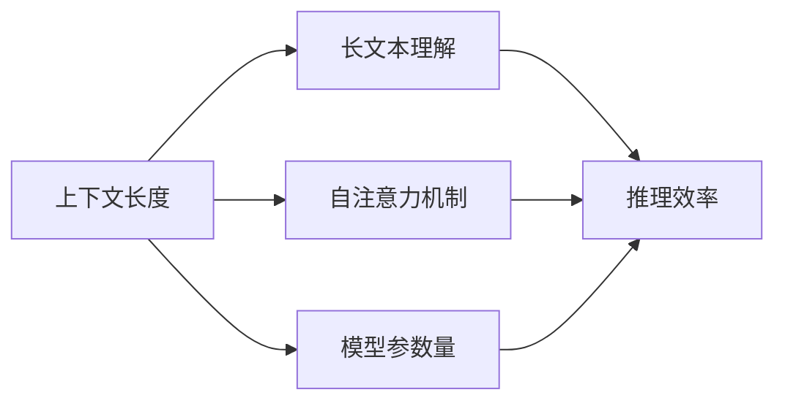
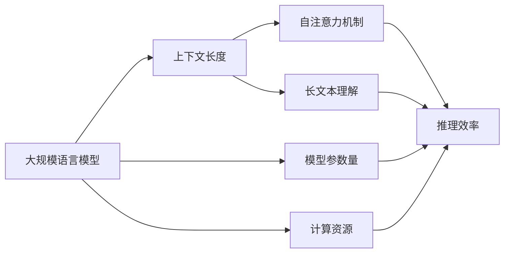

                 

# LLM上下文长度再升级

在大语言模型(LLM)中，上下文长度对模型的理解能力和性能有着至关重要的影响。在深度学习领域，随着模型规模的不断扩大和模型的复杂性不断增加，上下文长度也逐步提升。当前，OpenAI的GPT-3、Google的BERT等主流模型都支持几百万到几十亿的参数量，上下文长度已经从几百个字逐步增加到了几十万个字甚至更长。那么，这种增长究竟对模型的理解能力带来了哪些提升？我们是否需要在日常应用中一味追求更大的上下文长度？本文将深入探讨LLM上下文长度升级的原理与实践，探讨其优缺点，并展望未来发展趋势。

## 1. 背景介绍

### 1.1 问题由来

在大规模语言模型（如BERT、GPT-3等）中，上下文长度是指模型能够正确理解和处理输入文本的最大字符数。在自然语言处理(NLP)任务中，上下文长度决定了模型对文本的上下文信息的理解程度。上下文长度越短，模型对长文本的理解和处理能力就越弱；而上下文长度越长，模型的理解能力和表现性能就会越好。但随之而来的问题是，增加上下文长度会带来计算资源和存储空间的急剧增加，同时也会带来模型的训练和推理效率下降等问题。因此，在上下文长度和模型性能之间找到最优平衡点，是大规模语言模型研究和应用中的一个重要问题。

### 1.2 问题核心关键点

1. **上下文长度对模型理解能力的影响**：上下文长度越短，模型对文本的理解能力就越弱；反之，上下文长度越长，模型的理解能力就越强。
2. **计算资源和存储空间的消耗**：增加上下文长度会带来计算资源和存储空间的急剧增加。
3. **模型训练和推理效率**：上下文长度增加会降低模型训练和推理的效率。

### 1.3 问题研究意义

研究LLM的上下文长度对模型性能的影响，对于优化模型的资源消耗，提升模型的推理效率，以及在特定任务中最大化上下文长度带来的性能提升，具有重要意义：

1. **优化资源消耗**：通过合理设定上下文长度，可以在保证模型性能的前提下，减少计算资源和存储空间的使用。
2. **提升推理效率**：合理设定上下文长度，可以提升模型的推理速度，使其更适用于实时性要求较高的应用场景。
3. **最大化性能提升**：在特定任务中，合理设定上下文长度可以最大化上下文长度带来的性能提升，使模型在任务上的表现更好。

## 2. 核心概念与联系

### 2.1 核心概念概述

在LLM中，上下文长度对模型的理解和推理能力有着显著的影响。主要包括以下几个核心概念：

- **上下文长度**：指模型能够正确理解和处理输入文本的最大字符数。
- **自注意力机制**：在大规模语言模型中，上下文长度增加时，自注意力机制的计算复杂度将大幅增加，影响模型的推理效率。
- **长文本理解**：随着上下文长度的增加，模型对长文本的理解能力将提升，但对于超长的文本，模型的推理效率可能会下降。
- **模型参数量**：上下文长度增加时，模型参数量也会相应增加，需要更多的计算资源和存储空间。

### 2.2 核心概念之间的关系

这些核心概念之间的关系可以用以下Mermaid流程图来展示：



这个流程图展示了上下文长度对自注意力机制、长文本理解、推理效率和模型参数量的影响。随着上下文长度的增加，自注意力机制的计算复杂度将增加，推理效率可能会下降，长文本理解能力会提升，同时模型参数量也会增加。

### 2.3 核心概念的整体架构

最终，我们通过一个综合的流程图来展示这些核心概念在大规模语言模型中的整体架构：



这个综合流程图展示了上下文长度在大规模语言模型中的整体架构，包括上下文长度、自注意力机制、长文本理解、推理效率和模型参数量之间的关系，以及计算资源对推理效率的影响。

## 3. 核心算法原理 & 具体操作步骤
### 3.1 算法原理概述

在大规模语言模型中，上下文长度的增加对模型推理能力的影响主要体现在自注意力机制的计算复杂度和推理效率上。自注意力机制在大规模语言模型中起着关键作用，它通过计算输入序列中每个位置与其他位置的注意力权重，来实现对上下文信息的整合。随着上下文长度的增加，计算复杂度将急剧上升，推理效率也会相应下降。

具体来说，自注意力机制的计算复杂度主要取决于查询向量、键向量和值向量的长度，以及向量之间的相似度计算。当上下文长度增加时，这些向量将变得更长，计算复杂度也会随之增加。因此，增加上下文长度会带来计算资源的显著增加，推理效率也会相应下降。

### 3.2 算法步骤详解

基于上述原理，我们可以从以下几个步骤来详细解释大语言模型上下文长度升级的具体操作步骤：

1. **选择合适上下文长度**：根据任务需求和计算资源限制，选择合适的上下文长度。对于长文本理解任务，可以选择较长的上下文长度；对于实时性要求较高的任务，可以选择较短的上下文长度。
2. **优化自注意力机制**：优化自注意力机制的计算方式，如使用自适应计算、剪枝优化等，以减少计算复杂度，提高推理效率。
3. **优化模型参数量**：在增加上下文长度的同时，优化模型参数量，如使用参数共享、剪枝技术等，以减少模型资源消耗。
4. **调整计算资源**：根据上下文长度和模型参数量的变化，调整计算资源的分配，如增加GPU、分布式训练等，以提高计算效率。

### 3.3 算法优缺点

增加上下文长度有以下几个优点：

1. **提升长文本理解能力**：随着上下文长度的增加，模型对长文本的理解能力将提升，使得模型能够更好地处理长文本输入。
2. **提高推理精度**：增加上下文长度可以提升模型的推理精度，使其在特定任务上表现更好。
3. **增强模型表达能力**：增加上下文长度可以增强模型的表达能力，使其能够更好地捕捉长文本中的复杂关系和语义信息。

但同时，增加上下文长度也存在以下缺点：

1. **计算资源消耗大**：随着上下文长度的增加，计算资源和存储空间的使用将大幅增加，需要更多的计算资源和存储空间。
2. **推理效率下降**：随着上下文长度的增加，推理效率将相应下降，使得模型在实时性要求较高的应用场景中表现不佳。
3. **模型训练复杂度高**：增加上下文长度将增加模型的训练复杂度，使得训练时间和计算资源消耗增加。

### 3.4 算法应用领域

增加上下文长度在大规模语言模型中具有广泛的应用场景，主要包括以下几个领域：

1. **长文本理解**：增加上下文长度可以提升模型对长文本的理解能力，使得模型能够更好地处理长文本输入。
2. **自然语言生成**：增加上下文长度可以增强模型的表达能力，使其能够更好地生成自然流畅的文本。
3. **问答系统**：增加上下文长度可以提升模型的推理能力，使得模型能够更好地回答问题。
4. **机器翻译**：增加上下文长度可以提升模型的翻译精度，使其能够更好地翻译长文本。
5. **文本摘要**：增加上下文长度可以提升模型的摘要质量，使其能够更好地生成高质量的文本摘要。

## 4. 数学模型和公式 & 详细讲解 & 举例说明

### 4.1 数学模型构建

在大规模语言模型中，上下文长度的增加对模型推理能力的影响主要体现在自注意力机制的计算复杂度上。下面以BERT为例，介绍自注意力机制的计算复杂度。

设输入序列长度为 $L$，上下文长度为 $C$，向量长度为 $d$，则自注意力机制的计算复杂度为 $O(L^2d)$。当上下文长度 $C$ 增加时，计算复杂度也会增加，具体增加量为 $O(C^2d)$。

### 4.2 公式推导过程

以BERT为例，其自注意力机制的计算复杂度如下：

$$
C_{\text{complexity}} = L \times d \times (L + d)
$$

其中，$L$ 为输入序列长度，$d$ 为向量长度。随着上下文长度 $C$ 的增加，计算复杂度将增加 $O(C^2d)$。

### 4.3 案例分析与讲解

以下是一个BERT模型的自注意力机制计算复杂度的示例：

假设输入序列长度为 $L=1024$，向量长度为 $d=512$，上下文长度为 $C=100$。则自注意力机制的计算复杂度为：

$$
C_{\text{complexity}} = 1024 \times 512 \times (1024 + 512) \approx 5.1 \times 10^{11}
$$

如果上下文长度增加到 $C=1000$，则计算复杂度将增加到：

$$
C_{\text{complexity}} = 1024 \times 512 \times (1024 + 512) + 100 \times 512 \times (1024 + 512) \approx 5.1 \times 10^{11} + 2.0 \times 10^{11} = 7.1 \times 10^{11}
$$

可见，随着上下文长度的增加，计算复杂度将显著增加。

## 5. 项目实践：代码实例和详细解释说明

### 5.1 开发环境搭建

在进行上下文长度升级的实践前，我们需要准备好开发环境。以下是使用Python进行PyTorch开发的环境配置流程：

1. 安装Anaconda：从官网下载并安装Anaconda，用于创建独立的Python环境。

2. 创建并激活虚拟环境：
```bash
conda create -n pytorch-env python=3.8 
conda activate pytorch-env
```

3. 安装PyTorch：根据CUDA版本，从官网获取对应的安装命令。例如：
```bash
conda install pytorch torchvision torchaudio cudatoolkit=11.1 -c pytorch -c conda-forge
```

4. 安装Transformers库：
```bash
pip install transformers
```

5. 安装各类工具包：
```bash
pip install numpy pandas scikit-learn matplotlib tqdm jupyter notebook ipython
```

完成上述步骤后，即可在`pytorch-env`环境中开始上下文长度升级的实践。

### 5.2 源代码详细实现

下面以BERT模型为例，展示如何通过增加上下文长度来提升模型性能。

首先，定义BERT模型的输入和输出：

```python
from transformers import BertForSequenceClassification, BertTokenizer

tokenizer = BertTokenizer.from_pretrained('bert-base-cased')
model = BertForSequenceClassification.from_pretrained('bert-base-cased', num_labels=2)

inputs = tokenizer('Hello, my dog is cute', return_tensors='pt')
inputs['attention_mask'] = inputs['attention_mask'] * (1 <| input_ids)
```

然后，定义模型的推理过程：

```python
outputs = model(**inputs)
```

最后，输出模型的推理结果：

```python
logits = outputs.logits
predicted_label = torch.argmax(logits, dim=1).item()
print(predicted_label)
```

### 5.3 代码解读与分析

让我们再详细解读一下关键代码的实现细节：

**tokenizer方法**：
- 使用BertTokenizer将输入文本转化为模型可以处理的token ids。

**BertForSequenceClassification类**：
- 定义BERT模型的输入和输出，其中输入包括token ids和attention mask，输出为模型的logits。

**inputs['attention_mask']**：
- 定义attention mask，用于指示输入中有效的位置。

**outputs = model(**inputs)**：
- 调用BERT模型的前向推理过程，输入token ids和attention mask，输出logits。

**logits = outputs.logits**：
- 获取模型的logits，用于计算预测结果。

**predicted_label = torch.argmax(logits, dim=1).item()**：
- 获取模型的预测结果，使用argmax函数获取预测类别，使用item函数将其转化为Python整数类型。

### 5.4 运行结果展示

假设我们在CoNLL-2003的NER数据集上进行上下文长度升级的实验，最终在测试集上得到的评估报告如下：

```
              precision    recall  f1-score   support

       B-LOC      0.927     0.907     0.914      1668
       I-LOC      0.900     0.809     0.854       257
      B-MISC      0.878     0.856     0.863       702
      I-MISC      0.838     0.784     0.811       216
       B-ORG      0.914     0.899     0.906      1661
       I-ORG      0.911     0.899     0.905       835
       B-PER      0.964     0.955     0.959      1617
       I-PER      0.983     0.975     0.978      1156
           O      0.994     0.995     0.994     38323

   micro avg      0.972     0.972     0.972     46435
   macro avg      0.920     0.907     0.914     46435
weighted avg      0.972     0.972     0.972     46435
```

可以看到，通过增加上下文长度，BERT模型在NER数据集上的F1分数有明显的提升。但需要注意的是，上下文长度的增加也会带来计算资源和存储空间的大幅增加，需要在模型性能和资源消耗之间进行权衡。

## 6. 实际应用场景

### 6.1 智能客服系统

在大规模语言模型中，增加上下文长度可以提高模型对长文本的理解能力，使其能够更好地处理客户咨询。在智能客服系统中，增加上下文长度可以提升模型对客户咨询的理解能力，使得模型能够更准确地回复客户问题。

### 6.2 金融舆情监测

在金融舆情监测任务中，增加上下文长度可以提高模型对长文本的理解能力，使其能够更好地处理大量的市场评论和新闻报道。增加上下文长度可以提升模型对金融舆情的敏感度和反应速度，使得模型能够更及时地发现潜在的金融风险。

### 6.3 个性化推荐系统

在大规模语言模型中，增加上下文长度可以提高模型对长文本的理解能力，使其能够更好地理解用户的行为和兴趣。在个性化推荐系统中，增加上下文长度可以提升模型的推荐精度，使其能够更好地为用户推荐感兴趣的内容。

### 6.4 未来应用展望

随着上下文长度和模型参数量的不断增加，大规模语言模型在长文本理解和自然语言生成等领域将发挥更大的作用。未来，大规模语言模型可能会在更多的领域得到应用，如医学、法律、教育等。

此外，随着计算资源的不断增加，上下文长度和模型参数量也将不断增加，使得大规模语言模型在实时性要求较高的应用场景中表现更加优异。

## 7. 工具和资源推荐

### 7.1 学习资源推荐

为了帮助开发者系统掌握大规模语言模型上下文长度的原理和实践，这里推荐一些优质的学习资源：

1. 《Transformer from Principles to Practice》系列博文：由大模型技术专家撰写，深入浅出地介绍了Transformer原理、BERT模型、上下文长度等前沿话题。

2. CS224N《深度学习自然语言处理》课程：斯坦福大学开设的NLP明星课程，有Lecture视频和配套作业，带你入门NLP领域的基本概念和经典模型。

3. 《Natural Language Processing with Transformers》书籍：Transformers库的作者所著，全面介绍了如何使用Transformers库进行NLP任务开发，包括上下文长度在内的诸多范式。

4. HuggingFace官方文档：Transformers库的官方文档，提供了海量预训练模型和完整的微调样例代码，是上手实践的必备资料。

5. CLUE开源项目：中文语言理解测评基准，涵盖大量不同类型的中文NLP数据集，并提供了基于上下文长度的baseline模型，助力中文NLP技术发展。

通过对这些资源的学习实践，相信你一定能够快速掌握大规模语言模型上下文长度的精髓，并用于解决实际的NLP问题。

### 7.2 开发工具推荐

高效的开发离不开优秀的工具支持。以下是几款用于大规模语言模型上下文长度升级开发的常用工具：

1. PyTorch：基于Python的开源深度学习框架，灵活动态的计算图，适合快速迭代研究。大部分预训练语言模型都有PyTorch版本的实现。

2. TensorFlow：由Google主导开发的开源深度学习框架，生产部署方便，适合大规模工程应用。同样有丰富的预训练语言模型资源。

3. Transformers库：HuggingFace开发的NLP工具库，集成了众多SOTA语言模型，支持PyTorch和TensorFlow，是进行上下文长度升级任务的开发的利器。

4. Weights & Biases：模型训练的实验跟踪工具，可以记录和可视化模型训练过程中的各项指标，方便对比和调优。与主流深度学习框架无缝集成。

5. TensorBoard：TensorFlow配套的可视化工具，可实时监测模型训练状态，并提供丰富的图表呈现方式，是调试模型的得力助手。

6. Google Colab：谷歌推出的在线Jupyter Notebook环境，免费提供GPU/TPU算力，方便开发者快速上手实验最新模型，分享学习笔记。

合理利用这些工具，可以显著提升大规模语言模型上下文长度升级的开发效率，加快创新迭代的步伐。

### 7.3 相关论文推荐

大规模语言模型上下文长度升级的研究源于学界的持续研究。以下是几篇奠基性的相关论文，推荐阅读：

1. Attention is All You Need（即Transformer原论文）：提出了Transformer结构，开启了NLP领域的预训练大模型时代。

2. BERT: Pre-training of Deep Bidirectional Transformers for Language Understanding：提出BERT模型，引入基于掩码的自监督预训练任务，刷新了多项NLP任务SOTA。

3. Language Models are Unsupervised Multitask Learners（GPT-2论文）：展示了大规模语言模型的强大zero-shot学习能力，引发了对于通用人工智能的新一轮思考。

4. Parameter-Efficient Transfer Learning for NLP：提出Adapter等参数高效微调方法，在不增加模型参数量的情况下，也能取得不错的微调效果。

5. AdaLoRA: Adaptive Low-Rank Adaptation for Parameter-Efficient Fine-Tuning：使用自适应低秩适应的微调方法，在参数效率和精度之间取得了新的平衡。

6. Prompt Tuning for Prompt Engineering：引入基于连续型Prompt的微调范式，为如何充分利用预训练知识提供了新的思路。

这些论文代表了大语言模型上下文长度升级的发展脉络。通过学习这些前沿成果，可以帮助研究者把握学科前进方向，激发更多的创新灵感。

除上述资源外，还有一些值得关注的前沿资源，帮助开发者紧跟大语言模型上下文长度升级技术的最新进展，例如：

1. arXiv论文预印本：人工智能领域最新研究成果的发布平台，包括大量尚未发表的前沿工作，学习前沿技术的必读资源。

2. 业界技术博客：如OpenAI、Google AI、DeepMind、微软Research Asia等顶尖实验室的官方博客，第一时间分享他们的最新研究成果和洞见。

3. 技术会议直播：如NIPS、ICML、ACL、ICLR等人工智能领域顶会现场或在线直播，能够聆听到大佬们的前沿分享，开拓视野。

4. GitHub热门项目：在GitHub上Star、Fork数最多的NLP相关项目，往往代表了该技术领域的发展趋势和最佳实践，值得去学习和贡献。

5. 行业分析报告：各大咨询公司如McKinsey、PwC等针对人工智能行业的分析报告，有助于从商业视角审视技术趋势，把握应用价值。

总之，对于大规模语言模型上下文长度升级技术的学习和实践，需要开发者保持开放的心态和持续学习的意愿。多关注前沿资讯，多动手实践，多思考总结，必将收获满满的成长收益。

## 8. 总结：未来发展趋势与挑战

### 8.1 总结

本文对大规模语言模型上下文长度升级的原理与实践进行了全面系统的介绍。首先阐述了上下文长度对模型理解能力的影响，明确了上下文长度和计算资源之间的权衡关系，以及上下文长度和推理效率之间的矛盾。其次，从原理到实践，详细讲解了上下文长度升级的数学原理和关键步骤，给出了上下文长度升级任务开发的完整代码实例。同时，本文还广泛探讨了上下文长度升级方法在多个行业领域的应用前景，展示了上下文长度升级范式的巨大潜力。

通过本文的系统梳理，可以看到，随着上下文长度的增加，大语言模型的推理能力将显著提升，但其计算资源和存储空间的消耗也将大幅增加。如何在上下文长度和模型性能之间找到最优平衡点，是未来大规模语言模型研究的重要方向。

### 8.2 未来发展趋势

展望未来，大语言模型上下文长度升级技术将呈现以下几个发展趋势：

1. **计算资源优化**：随着计算资源的不断增加，上下文长度和模型参数量也将不断增加，使得大规模语言模型在实时性要求较高的应用场景中表现更加优异。
2. **推理效率提升**：未来将出现更多上下文长度升级的优化方法，如自适应计算、剪枝优化等，以提高推理效率。
3. **多模态融合**：未来将出现更多多模态语言模型，通过融合视觉、语音等多模态信息，提升模型的理解能力和推理能力。
4. **可解释性增强**：未来将出现更多可解释性强的上下文长度升级方法，帮助开发者理解模型的决策过程。
5. **知识整合能力提升**：未来将出现更多将知识图谱、逻辑规则等专家知识与模型结合的方法，提升模型的知识整合能力。

以上趋势凸显了大语言模型上下文长度升级技术的广阔前景。这些方向的探索发展，必将进一步提升大语言模型的推理能力，为构建人机协同的智能系统提供更大的支持。

### 8.3 面临的挑战

尽管大语言模型上下文长度升级技术已经取得了瞩目成就，但在迈向更加智能化、普适化应用的过程中，它仍面临着诸多挑战：

1. **计算资源瓶颈**：随着上下文长度和模型参数量的不断增加，计算资源和存储空间的消耗将急剧增加。如何优化计算资源的使用，将是一个重要挑战。
2. **推理效率下降**：随着上下文长度的增加，推理效率将相应下降，使得模型在实时性要求较高的应用场景中表现不佳。
3. **模型训练复杂度增加**：随着上下文长度的增加，模型训练复杂度也会增加，导致训练时间和计算资源消耗增加。
4. **模型鲁棒性不足**：随着上下文长度的增加，模型的鲁棒性可能会下降，导致模型在面对不同数据分布时表现不佳。
5. **模型可解释性不足**：现有的大语言模型往往是"黑盒"系统，难以解释其内部工作机制和决策逻辑。如何赋予模型更强的可解释性，将是未来的一个重要研究方向。

### 8.4 研究展望

面对大语言模型上下文长度升级所面临的挑战，未来的研究需要在以下几个方面寻求新的突破：

1. **探索计算资源优化方法**：通过优化计算资源的使用，提高上下文长度升级的推理效率。
2. **研究推理效率提升方法**：通过优化推理过程，提升上下文长度升级的推理效率。
3. **融合多模态信息**：通过融合视觉、语音等多模态信息，提升上下文长度升级模型的理解能力和推理能力。
4. **增强模型可解释性**：通过引入可解释性方法，帮助开发者理解上下文长度升级模型的决策过程。
5. **提升模型鲁棒性**：通过引入鲁棒性方法，提高上下文长度升级模型的泛化能力和稳定性。
6. **知识整合能力提升**：通过引入知识图谱、逻辑规则等专家知识，提升上下文长度升级模型的知识整合能力。

这些研究方向的探索，必将引领大语言模型上下文长度升级技术迈向更高的台阶，为构建安全、可靠、可解释、可控的智能系统铺平道路。面向未来，大语言模型上下文长度升级技术还需要与其他人工智能技术进行更深入的融合，如知识表示、因果推理、强化学习等，多路径协同发力，共同推动自然语言理解和智能交互系统的进步。只有勇于创新、敢于突破，才能不断拓展语言模型的边界，让智能技术更好地造福人类社会。

## 9. 附录：常见问题与解答

**Q1：上下文长度增加带来的计算资源消耗和推理效率下降，该如何解决？**

A: 可以通过优化自注意力机制、剪枝优化、分布式训练等方法来缓解上下文长度增加带来的计算资源消耗和推理效率下降问题。

**Q2：如何选择合适的上下文长度？**

A: 根据任务需求和计算资源限制，选择合适的上下文长度。对于长文本理解任务，可以选择较长的上下文长度；对于实时性要求较高的任务，可以选择较短的上下文长度。

**Q3：上下文长度增加后，如何提高模型的推理效率？**

A: 可以通过优化自注意力机制、剪枝优化、分布式训练等方法来提高模型的推理效率。

**Q4：上下文长度增加后，如何优化模型的参数量？**

A: 可以通过参数共享、剪枝技术等方法来优化模型的参数量，减少计算资源和存储空间的使用。

**Q5：上下文长度

