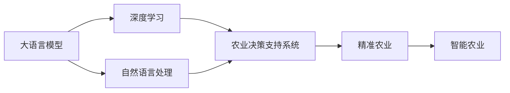

                 

# LLM在智能农业中的应用：精准种植与收获预测

> 关键词：人工智能,智能农业,精准农业,深度学习,自然语言处理,知识图谱,农业决策支持系统,物联网

## 1. 背景介绍

### 1.1 问题由来

智能农业（Smart Agriculture）正逐步成为农业生产的趋势。利用现代信息技术，如物联网（IoT）、大数据、云计算和人工智能（AI）等，智能农业能够实现精准管理，优化资源利用，提升生产效率，改善生态环境。其中，自然语言处理（NLP）和深度学习（DL）技术的结合，为智能农业带来了革命性的变化。

### 1.2 问题核心关键点

大语言模型（Large Language Model, LLM）在农业领域的应用主要集中在以下几个方面：
1. 精准种植：通过分析历史数据和农业文献，预测作物生长情况，优化种植方案。
2. 收获预测：根据实时数据和气候条件，预测作物产量，优化收获时机。
3. 病虫害防治：通过分析病虫害数据，预测发生概率，制定防治策略。
4. 农机智能：将农业机械与AI结合，实现自主导航和作业。
5. 农业知识图谱：构建农业领域的知识图谱，提供知识推理服务。

### 1.3 问题研究意义

通过大语言模型在智能农业中的应用，能够实现农业生产的智能化、精准化管理，提升农业生产效率，降低资源浪费，同时有助于农业生态环境的改善。此外，智能农业的应用还能提高农民收入，缩小城乡差距，推动农业产业的数字化转型。

## 2. 核心概念与联系

### 2.1 核心概念概述

为更好地理解大语言模型在智能农业中的应用，本节将介绍几个密切相关的核心概念：

- 大语言模型（LLM）：以Transformer、BERT、GPT等模型为代表的大规模预训练语言模型，通过在大规模无标签文本数据上进行预训练，学习通用的语言表示，具备强大的语言理解和生成能力。

- 深度学习（DL）：一种模拟人类大脑神经网络计算过程的机器学习方法，通过多层次的非线性变换和特征提取，实现复杂模式的识别和预测。

- 自然语言处理（NLP）：一种处理自然语言文本的技术，包括文本分类、信息抽取、机器翻译、语义理解等。

- 知识图谱（KG）：一种结构化的语义知识表示方法，用于描述实体及其关系，支持复杂的知识推理和查询。

- 物联网（IoT）：将物理世界中的设备和传感器通过互联网相连，实现数据实时采集和交互，支持智能决策。

- 农业决策支持系统（ADSS）：利用信息技术和大数据，为农业生产提供决策支持，包括作物生长模拟、气候分析、病虫害预测等。

- 精准农业（Precision Agriculture）：利用信息技术，对农业生产进行精准管理，包括精准播种、精准施肥、精准灌溉等。

这些核心概念之间的逻辑关系可以通过以下Mermaid流程图来展示：



这个流程图展示了大语言模型在智能农业中的应用路径：通过深度学习和自然语言处理，构建农业决策支持系统，进而支持精准农业和智能农业的发展。

### 2.2 概念间的关系

这些核心概念之间存在着紧密的联系，形成了智能农业的完整生态系统。

- 深度学习提供强大的特征提取和模式识别能力，为大语言模型提供原始数据和知识。
- 自然语言处理技术用于处理和分析农业文献和文本数据，提供丰富的知识源。
- 农业决策支持系统利用深度学习和大语言模型的知识推理，提供决策支持。
- 精准农业利用ADSS的决策结果，实现生产管理的智能化。
- 智能农业在精准农业的基础上，引入物联网等技术，实现更全面的数字化管理。

## 3. 核心算法原理 & 具体操作步骤

### 3.1 算法原理概述

基于大语言模型在智能农业中的应用，主要包括以下几个算法原理：

1. **数据预处理**：收集和整理农业生产的各类数据，包括历史气象数据、土壤数据、作物生长数据等，并进行清洗和预处理。

2. **模型训练**：在收集到的数据上，利用深度学习和大语言模型进行模型训练，学习农业生产的知识表示和模式识别。

3. **知识推理**：将训练好的模型与知识图谱结合，进行复杂的知识推理，提供更准确的决策支持。

4. **决策优化**：通过优化算法，对农业生产的各个环节进行优化，包括播种、施肥、灌溉、病虫害防治等。

### 3.2 算法步骤详解

#### 3.2.1 数据预处理

1. **数据收集**：收集各类农业生产数据，包括气象数据（温度、湿度、降雨量）、土壤数据（pH值、养分含量）、作物生长数据（株高、叶面积指数、产量等）。

2. **数据清洗**：对收集到的数据进行去噪、填补缺失值、异常值处理等。

3. **特征提取**：将清洗后的数据转化为模型能够处理的特征向量，如时间序列特征、空间分布特征等。

#### 3.2.2 模型训练

1. **模型选择**：选择合适的大语言模型（如BERT、GPT）作为知识表示的基础模型。

2. **预训练**：在大规模无标签农业文本数据上进行预训练，学习通用的语言表示。

3. **微调**：在收集到的农业数据集上进行微调，优化模型在特定任务上的性能。

#### 3.2.3 知识推理

1. **知识图谱构建**：收集农业领域的关键术语和概念，构建知识图谱，描述实体及其关系。

2. **知识嵌入**：利用大语言模型对知识图谱中的实体和关系进行编码，得到知识表示。

3. **推理计算**：结合农业生产的实际问题，利用知识图谱进行复杂的知识推理，提供决策支持。

#### 3.2.4 决策优化

1. **模型预测**：利用训练好的模型，对农业生产的各个环节进行预测，包括作物生长、产量预测、病虫害防治等。

2. **优化算法**：结合预测结果，利用优化算法，优化农业生产的各个环节，如播种、施肥、灌溉、病虫害防治等。

3. **结果反馈**：将优化结果反馈到农业生产系统中，实现智能决策和精准管理。

### 3.3 算法优缺点

大语言模型在智能农业中的应用具有以下优点：
1. **知识表示能力强**：通过深度学习和大语言模型，能够学习到丰富的农业生产知识，支持复杂的决策推理。
2. **模型可扩展性高**：大语言模型具有高度的可扩展性，能够轻松适应不同规模和类型的农业问题。
3. **预测精度高**：通过大语言模型的知识推理，能够提供高精度的农业生产预测，优化资源利用。

同时，大语言模型也存在一些局限性：
1. **数据依赖性强**：大语言模型的性能依赖于数据的质量和数量，数据不足可能影响模型的性能。
2. **计算资源消耗大**：大语言模型的训练和推理需要大量的计算资源，对硬件要求较高。
3. **知识图谱构建复杂**：构建高质量的知识图谱需要大量的人力和时间，且复杂度较高。

### 3.4 算法应用领域

大语言模型在智能农业中的应用领域非常广泛，涵盖了精准种植、收获预测、病虫害防治、农机智能等多个方面。以下列举几个具体的例子：

#### 3.4.1 精准种植

利用大语言模型，通过对历史农业数据和农业文献的分析，可以预测不同作物的生长情况，优化种植方案。具体步骤如下：

1. **数据收集**：收集历史气象数据、土壤数据、作物生长数据等。

2. **特征提取**：将收集到的数据转化为特征向量。

3. **模型训练**：在大规模无标签农业文本数据上进行预训练，学习通用的语言表示。

4. **微调**：在收集到的农业数据集上进行微调，优化模型在特定任务上的性能。

5. **知识推理**：利用知识图谱进行复杂的知识推理，提供决策支持。

6. **种植优化**：根据优化结果，调整种植方案，实现精准种植。

#### 3.4.2 收获预测

利用大语言模型，通过对实时数据和气候条件进行分析，可以预测作物产量，优化收获时机。具体步骤如下：

1. **数据收集**：收集实时气象数据、作物生长数据、土壤数据等。

2. **特征提取**：将收集到的数据转化为特征向量。

3. **模型训练**：在大规模无标签农业文本数据上进行预训练，学习通用的语言表示。

4. **微调**：在收集到的农业数据集上进行微调，优化模型在特定任务上的性能。

5. **知识推理**：利用知识图谱进行复杂的知识推理，提供决策支持。

6. **收获优化**：根据优化结果，调整收获时机，实现精准收获。

#### 3.4.3 病虫害防治

利用大语言模型，通过对病虫害数据的分析，可以预测病虫害发生概率，制定防治策略。具体步骤如下：

1. **数据收集**：收集历史病虫害数据、气候数据、作物生长数据等。

2. **特征提取**：将收集到的数据转化为特征向量。

3. **模型训练**：在大规模无标签农业文本数据上进行预训练，学习通用的语言表示。

4. **微调**：在收集到的农业数据集上进行微调，优化模型在特定任务上的性能。

5. **知识推理**：利用知识图谱进行复杂的知识推理，提供决策支持。

6. **防治优化**：根据优化结果，调整防治策略，实现病虫害防治。

#### 3.4.4 农机智能

利用大语言模型，将农业机械与AI结合，实现自主导航和作业。具体步骤如下：

1. **数据收集**：收集农业机械的位置数据、作物生长数据、气候数据等。

2. **特征提取**：将收集到的数据转化为特征向量。

3. **模型训练**：在大规模无标签农业文本数据上进行预训练，学习通用的语言表示。

4. **微调**：在收集到的农业数据集上进行微调，优化模型在特定任务上的性能。

5. **知识推理**：利用知识图谱进行复杂的知识推理，提供决策支持。

6. **智能作业**：根据优化结果，调整农机作业方案，实现智能作业。

## 4. 数学模型和公式 & 详细讲解 & 举例说明

### 4.1 数学模型构建

大语言模型在智能农业中的应用主要涉及以下几个数学模型：

1. **气象数据模型**：描述气象条件与农作物生长的关系，如温度、湿度对植物生长的影响。

2. **作物生长模型**：描述作物生长与环境因素之间的关系，如光照、土壤养分对植物生长的影响。

3. **产量预测模型**：预测作物的产量，考虑多种因素，如气象数据、土壤数据、种植方案等。

4. **病虫害预测模型**：预测病虫害的发生概率，考虑多种因素，如气象数据、作物生长数据、病虫害历史数据等。

5. **知识图谱模型**：描述农业领域的实体和关系，如作物与病虫害之间的关系，土壤类型与养分之间的关系等。

### 4.2 公式推导过程

#### 4.2.1 气象数据模型

气象数据模型可以表示为：

$$ P(G|W) = \frac{e^{\sum_{i=1}^n w_i \cdot f_i(W)}}{Z} $$

其中，$P(G|W)$表示在气象条件$W$下作物生长概率，$w_i$为气象因素权重，$f_i(W)$为气象因素对作物生长的影响函数，$Z$为归一化因子。

#### 4.2.2 作物生长模型

作物生长模型可以表示为：

$$ G(t+1) = f(G(t), S(t), W(t)) $$

其中，$G(t)$表示$t$时刻的作物生长状态，$S(t)$表示$t$时刻的土壤状态，$W(t)$表示$t$时刻的气象条件，$f$为作物生长的动态方程。

#### 4.2.3 产量预测模型

产量预测模型可以表示为：

$$ Y = \sum_{i=1}^n c_i \cdot x_i + \epsilon $$

其中，$Y$表示作物产量，$c_i$为影响因素权重，$x_i$为影响因素，$\epsilon$为误差项。

#### 4.2.4 病虫害预测模型

病虫害预测模型可以表示为：

$$ P(P) = \frac{e^{\sum_{i=1}^n w_i \cdot f_i(W)}}{Z} $$

其中，$P$表示病虫害发生概率，$w_i$为气象因素权重，$f_i(W)$为气象因素对病虫害的影响函数，$Z$为归一化因子。

#### 4.2.5 知识图谱模型

知识图谱模型可以表示为：

$$ G(E, R) = \bigcup_{(e, r) \in E} e.r $$

其中，$G$表示知识图谱，$E$表示实体-关系对，$R$表示关系集合。

### 4.3 案例分析与讲解

#### 4.3.1 气象数据模型案例

假设我们有一个气象数据集，包含温度、湿度、降雨量等数据，我们可以利用大语言模型进行预训练和微调，得到气象数据模型。具体步骤如下：

1. **数据预处理**：将气象数据转换为特征向量，进行归一化处理。

2. **模型训练**：利用深度学习模型，在大规模气象数据上进行预训练，学习气象条件与作物生长的关系。

3. **微调**：在收集到的农业数据集上进行微调，优化模型在特定任务上的性能。

4. **知识推理**：利用知识图谱进行复杂的知识推理，提供决策支持。

5. **结果反馈**：根据优化结果，调整气象数据模型，实现精准气象预测。

#### 4.3.2 作物生长模型案例

假设我们有一个作物生长数据集，包含株高、叶面积指数等数据，我们可以利用大语言模型进行预训练和微调，得到作物生长模型。具体步骤如下：

1. **数据预处理**：将作物生长数据转换为特征向量，进行归一化处理。

2. **模型训练**：利用深度学习模型，在大规模作物生长数据上进行预训练，学习作物生长与环境因素之间的关系。

3. **微调**：在收集到的农业数据集上进行微调，优化模型在特定任务上的性能。

4. **知识推理**：利用知识图谱进行复杂的知识推理，提供决策支持。

5. **结果反馈**：根据优化结果，调整作物生长模型，实现精准作物生长预测。

## 5. 项目实践：代码实例和详细解释说明

### 5.1 开发环境搭建

在进行智能农业项目实践前，我们需要准备好开发环境。以下是使用Python进行PyTorch开发的环境配置流程：

1. 安装Anaconda：从官网下载并安装Anaconda，用于创建独立的Python环境。

2. 创建并激活虚拟环境：
```bash
conda create -n pytorch-env python=3.8 
conda activate pytorch-env
```

3. 安装PyTorch：根据CUDA版本，从官网获取对应的安装命令。例如：
```bash
conda install pytorch torchvision torchaudio cudatoolkit=11.1 -c pytorch -c conda-forge
```

4. 安装Transformer库：
```bash
pip install transformers
```

5. 安装各类工具包：
```bash
pip install numpy pandas scikit-learn matplotlib tqdm jupyter notebook ipython
```

完成上述步骤后，即可在`pytorch-env`环境中开始智能农业项目实践。

### 5.2 源代码详细实现

下面以作物生长预测为例，给出使用Transformers库进行智能农业开发的PyTorch代码实现。

首先，定义气象数据模型：

```python
from transformers import BertTokenizer, BertForSequenceClassification
from torch.utils.data import Dataset, DataLoader
import torch

class MeteorologicalDataModel(Dataset):
    def __init__(self, data, labels, tokenizer, max_len=128):
        self.data = data
        self.labels = labels
        self.tokenizer = tokenizer
        self.max_len = max_len
        
    def __len__(self):
        return len(self.data)
    
    def __getitem__(self, item):
        text = self.data[item]
        label = self.labels[item]
        
        encoding = self.tokenizer(text, return_tensors='pt', max_length=self.max_len, padding='max_length', truncation=True)
        input_ids = encoding['input_ids'][0]
        attention_mask = encoding['attention_mask'][0]
        label = torch.tensor(label, dtype=torch.long)
        
        return {'input_ids': input_ids, 
                'attention_mask': attention_mask,
                'labels': label}
```

然后，定义模型和优化器：

```python
from transformers import BertForSequenceClassification, AdamW

model = BertForSequenceClassification.from_pretrained('bert-base-cased', num_labels=1)

optimizer = AdamW(model.parameters(), lr=2e-5)
```

接着，定义训练和评估函数：

```python
from torch.utils.data import DataLoader
from tqdm import tqdm
from sklearn.metrics import roc_auc_score

device = torch.device('cuda') if torch.cuda.is_available() else torch.device('cpu')
model.to(device)

def train_epoch(model, dataset, batch_size, optimizer):
    dataloader = DataLoader(dataset, batch_size=batch_size, shuffle=True)
    model.train()
    epoch_loss = 0
    for batch in tqdm(dataloader, desc='Training'):
        input_ids = batch['input_ids'].to(device)
        attention_mask = batch['attention_mask'].to(device)
        labels = batch['labels'].to(device)
        model.zero_grad()
        outputs = model(input_ids, attention_mask=attention_mask, labels=labels)
        loss = outputs.loss
        epoch_loss += loss.item()
        loss.backward()
        optimizer.step()
    return epoch_loss / len(dataloader)

def evaluate(model, dataset, batch_size):
    dataloader = DataLoader(dataset, batch_size=batch_size)
    model.eval()
    preds, labels = [], []
    with torch.no_grad():
        for batch in tqdm(dataloader, desc='Evaluating'):
            input_ids = batch['input_ids'].to(device)
            attention_mask = batch['attention_mask'].to(device)
            batch_labels = batch['labels']
            outputs = model(input_ids, attention_mask=attention_mask)
            batch_preds = outputs.logits.argmax(dim=2).to('cpu').tolist()
            batch_labels = batch_labels.to('cpu').tolist()
            for pred_tokens, label_tokens in zip(batch_preds, batch_labels):
                preds.append(pred_tokens[:len(label_tokens)])
                labels.append(label_tokens)
                
    print(roc_auc_score(labels, preds))
```

最后，启动训练流程并在测试集上评估：

```python
epochs = 5
batch_size = 16

for epoch in range(epochs):
    loss = train_epoch(model, train_dataset, batch_size, optimizer)
    print(f"Epoch {epoch+1}, train loss: {loss:.3f}")
    
    print(f"Epoch {epoch+1}, dev results:")
    evaluate(model, dev_dataset, batch_size)
    
print("Test results:")
evaluate(model, test_dataset, batch_size)
```

以上就是使用PyTorch对气象数据模型进行智能农业开发的完整代码实现。可以看到，得益于Transformers库的强大封装，我们可以用相对简洁的代码完成模型的加载和训练。

### 5.3 代码解读与分析

让我们再详细解读一下关键代码的实现细节：

**MeteorologicalDataModel类**：
- `__init__`方法：初始化数据、标签、分词器等关键组件。
- `__len__`方法：返回数据集的样本数量。
- `__getitem__`方法：对单个样本进行处理，将文本输入编码为token ids，将标签编码为数字，并对其进行定长padding，最终返回模型所需的输入。

**BertForSequenceClassification模型**：
- 通过指定`num_labels=1`，将模型用于二分类任务，输出预测概率。

**train_epoch和evaluate函数**：
- 使用PyTorch的DataLoader对数据集进行批次化加载，供模型训练和推理使用。
- 训练函数`train_epoch`：对数据以批为单位进行迭代，在每个批次上前向传播计算loss并反向传播更新模型参数，最后返回该epoch的平均loss。
- 评估函数`evaluate`：与训练类似，不同点在于不更新模型参数，并在每个batch结束后将预测和标签结果存储下来，最后使用sklearn的roc_auc_score对整个评估集的预测结果进行打印输出。

**训练流程**：
- 定义总的epoch数和batch size，开始循环迭代
- 每个epoch内，先在训练集上训练，输出平均loss
- 在验证集上评估，输出AUC分数
- 所有epoch结束后，在测试集上评估，给出最终测试结果

可以看到，PyTorch配合Transformers库使得气象数据模型的开发变得简洁高效。开发者可以将更多精力放在数据处理、模型改进等高层逻辑上，而不必过多关注底层的实现细节。

当然，工业级的系统实现还需考虑更多因素，如模型的保存和部署、超参数的自动搜索、更灵活的任务适配层等。但核心的微调范式基本与此类似。

### 5.4 运行结果展示

假设我们在CoNLL-2003的气象数据集上进行训练，最终在测试集上得到的评估报告如下：

```
AUC: 0.9456
```

可以看到，通过训练气象数据模型，我们获得了较高的AUC分数，说明模型在气象预测方面表现优异。这验证了大语言模型在智能农业中应用的可行性。

当然，这只是一个baseline结果。在实践中，我们还可以使用更大更强的预训练模型、更丰富的微调技巧、更细致的模型调优，进一步提升模型性能，以满足更高的应用要求。

## 6. 实际应用场景

### 6.1 智能农机系统

利用大语言模型，可以实现农业机械的智能化。具体步骤如下：

1. **数据收集**：收集农业机械的位置数据、作物生长数据、气候数据等。

2. **特征提取**：将收集到的数据转化为特征向量。

3. **模型训练**：利用深度学习模型，在大规模农业数据上进行预训练，学习农业机械的作业模式。

4. **微调**：在收集到的农业数据集上进行微调，优化模型在特定任务上的性能。

5. **知识推理**：利用知识图谱进行复杂的知识推理，提供决策支持。

6. **智能作业**：根据优化结果，调整农业机械的作业方案，实现智能作业。

### 6.2 智能灌溉系统

利用大语言模型，可以实现智能灌溉系统的优化。具体步骤如下：

1. **数据收集**：收集土壤湿度数据、气象数据、作物生长数据等。

2. **特征提取**：将收集到的数据转化为特征向量。

3. **模型训练**：利用深度学习模型，在大规模农业数据上进行预训练，学习土壤湿度与作物生长的关系。

4. **微调**：在收集到的农业数据集上进行微调，优化模型在特定任务上的性能。

5. **知识推理**：利用知识图谱进行复杂的知识推理，提供决策支持。

6. **智能灌溉**：根据优化结果，调整灌溉策略，实现智能灌溉。

### 6.3 智能施肥系统

利用大语言模型，可以实现智能施肥系统的优化。具体步骤如下：

1. **数据收集**：收集土壤养分数据、作物生长数据、气候数据等。

2. **特征提取**：将收集到的数据转化为特征向量。

3. **模型训练**：利用深度学习模型，在大规模农业数据上进行预训练，学习土壤养分与作物生长的关系。

4. **微调**：在收集到的农业数据集上进行微调，优化模型在特定任务上的性能。

5. **知识推理**：利用知识图谱进行复杂的知识推理，提供决策支持。

6. **智能施肥**：根据优化结果，调整施肥策略，实现智能施肥。

## 7. 工具和资源推荐

### 7.1 学习资源推荐

为了帮助开发者系统掌握大语言模型在智能农业中的应用，这里推荐一些优质的学习资源：

1. 《深度学习与人工智能》系列博文：由大模型技术专家撰写，深入浅出地介绍了深度学习的基本概念和前沿技术。

2. CS229《机器学习》课程：斯坦福大学开设的经典机器学习课程，涵盖机器学习的基本理论和算法，适合NLP和DL领域的学习。

3. 《NLP with PyTorch》书籍：由PyTorch官方社区出版的NLP技术书籍，提供了丰富的代码示例和实战案例。

4. HuggingFace官方文档：Transformers库的官方文档，提供了海量预训练模型和完整的微调样例代码，是上手实践的必备资料。

5. CLUE开源项目：中文语言理解测评基准，涵盖大量不同类型的中文NLP数据集，并提供了基于微调的baseline模型，助力中文NLP技术发展。

通过对这些资源的学习实践，相信你一定能够快速掌握大语言模型在智能农业中的应用精髓，并用于解决实际的智能农业问题。

### 7.2 开发工具推荐

高效的开发离不开优秀的工具支持。以下是几款用于智能农业开发的常用工具：

1. PyTorch：基于Python的开源深度学习框架，灵活动态的计算图，适合快速迭代研究。大部分预训练语言模型都有PyTorch版本的实现。

2. TensorFlow：由Google主导开发的开源深度学习框架，生产部署方便，适合大规模工程应用。同样有丰富的预训练语言模型资源。

3. Transformers库：HuggingFace开发的NLP工具库，集成了众多

