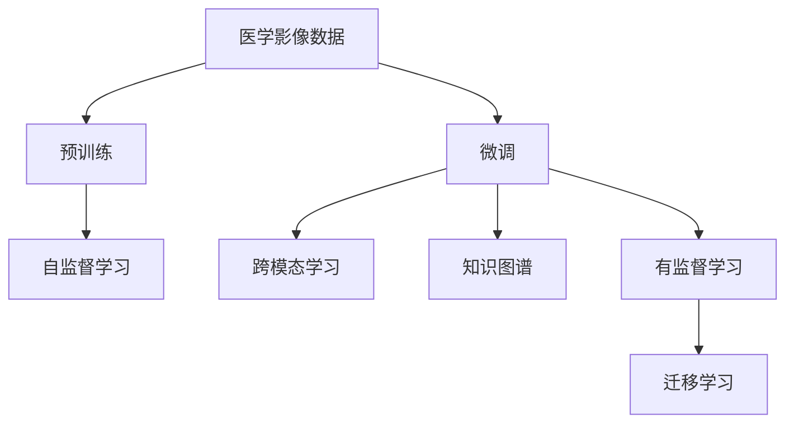
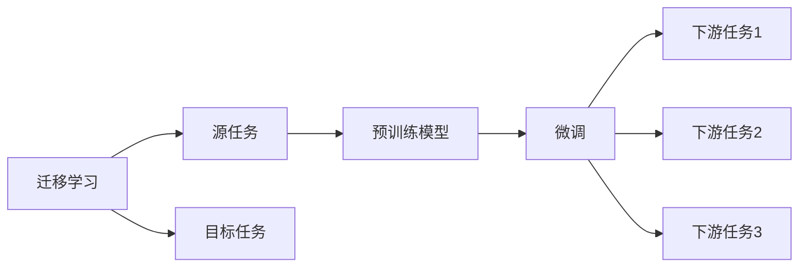
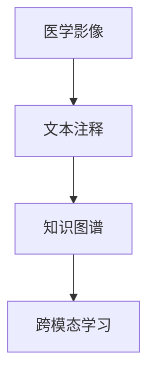
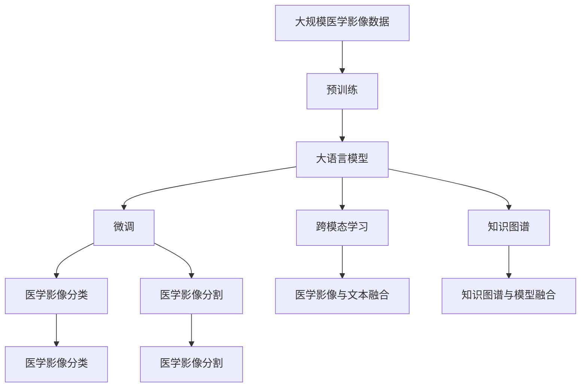

                 

# LLM在智能医疗影像分析中的应用前景

## 1. 背景介绍

近年来，人工智能在医疗领域的应用引起了广泛关注。随着深度学习技术的不断发展，利用深度学习技术进行医疗影像分析已经成为一种趋势。然而，传统的基于手工特征提取的影像分类方法已经逐渐被基于深度学习的大模型所取代。

在医学影像分析领域，大语言模型（LLM）的出现，为影像识别、分类、分割等任务提供了新的解决方案。LLM能够通过大规模无标签数据的预训练，学习到丰富的医学知识，并在特定任务上进行微调，从而实现高精度的医学影像分析。

### 1.1 问题由来

在传统医学影像分析中，需要手工提取影像特征并进行分类。这种方法不仅耗时耗力，而且容易受到主观因素的影响。随着深度学习技术的发展，基于大模型的自动影像分析方法逐渐兴起，这种方法通过大量无标签数据的预训练，学习到对影像的通用表示，并在特定任务上进行微调，从而实现了对影像的自动识别和分类。

然而，由于医学影像的高维特性和复杂性，单一的深度学习模型往往难以有效应对，需要结合多模型协同工作，或者采用更高级的融合技术，才能实现更准确、可靠的医学影像分析。

### 1.2 问题核心关键点

大语言模型在医学影像分析中的应用，主要围绕以下几个关键点展开：

1. 预训练：通过大规模无标签医学影像数据的预训练，学习医学影像的通用表示。
2. 微调：在预训练的基础上，针对特定医学影像分类、分割等任务进行微调，提高模型在特定任务上的表现。
3. 跨模态学习：将影像分类和文本注释相结合，进一步提升模型的分析能力和解释能力。
4. 知识图谱：将医学知识图谱与模型进行融合，增强模型的理解能力和解释能力。
5. 可解释性：提高模型的可解释性，增强医生的信任感和接受度。

## 2. 核心概念与联系

### 2.1 核心概念概述

为了更好地理解大语言模型在医学影像分析中的应用，本节将介绍几个密切相关的核心概念：

- 大语言模型（LLM）：以自回归模型（如GPT）或自编码模型（如BERT）为代表的大规模预训练语言模型。通过在大规模无标签文本语料上进行预训练，学习到丰富的语言表示，具有强大的语言理解和生成能力。

- 预训练（Pre-training）：指在大规模无标签文本语料上，通过自监督学习任务训练通用语言模型的过程。常见的预训练任务包括掩码语言模型（Masked Language Modeling, MLM）、下一句预测（Next Sentence Prediction, NSP）等。

- 微调（Fine-tuning）：指在预训练模型的基础上，使用下游任务的少量标注数据，通过有监督地训练来优化模型在特定任务上的性能。

- 迁移学习（Transfer Learning）：指将一个领域学习到的知识，迁移应用到另一个不同但相关的领域的学习范式。大模型的预训练-微调过程即是一种典型的迁移学习方式。

- 跨模态学习（Cross-modal Learning）：指将不同模态的数据（如图像、文本）进行融合，增强模型的理解和表达能力。

- 知识图谱（Knowledge Graph）：指将实体和关系以图的形式进行表示和存储，通过与模型的结合，增强模型的理解能力和解释能力。

这些核心概念之间的逻辑关系可以通过以下Mermaid流程图来展示：


这个流程图展示了大语言模型的核心概念及其之间的关系：

1. 大语言模型通过预训练获得基础能力。
2. 微调是对预训练模型进行任务特定的优化，可以直接在微调过程中引入跨模态数据和知识图谱。
3. 迁移学习是连接预训练模型与下游任务的桥梁，可以通过微调或跨模态学习来实现。

### 2.2 概念间的关系

这些核心概念之间存在着紧密的联系，形成了大语言模型在医学影像分析中的应用框架。下面我们通过几个Mermaid流程图来展示这些概念之间的关系。

#### 2.2.1 医学影像分析的学习范式



这个流程图展示了医学影像分析的基本流程：通过大规模无标签医学影像数据的预训练，学习医学影像的通用表示；在预训练的基础上，针对特定医学影像分类、分割等任务进行微调，引入跨模态数据和知识图谱，实现高精度的医学影像分析。

#### 2.2.2 迁移学习与微调的关系



这个流程图展示了迁移学习的基本原理，以及它与微调的关系。迁移学习涉及源任务和目标任务，预训练模型在源任务上学习，然后通过微调适应各种下游任务（目标任务）。

#### 2.2.3 跨模态学习与知识图谱



这个流程图展示了跨模态学习与知识图谱的结合方式：将医学影像与文本注释进行融合，构建知识图谱，然后利用跨模态学习的方法，增强模型的理解和表达能力。

### 2.3 核心概念的整体架构

最后，我们用一个综合的流程图来展示这些核心概念在大语言模型在医学影像分析中的应用中的整体架构：



这个综合流程图展示了从预训练到微调，再到跨模态学习和知识图谱融合的完整过程。大语言模型首先在大规模医学影像数据上进行预训练，然后通过微调（包括跨模态学习和知识图谱融合）来适应医学影像分析任务，最终实现高精度的医学影像分类和分割。

## 3. 核心算法原理 & 具体操作步骤

### 3.1 算法原理概述

基于大语言模型的医学影像分析，本质上是一个有监督的细粒度迁移学习过程。其核心思想是：将大语言模型视作一个强大的“特征提取器”，通过在医学影像的标注数据上进行有监督地训练来优化模型在特定医学影像分析任务上的性能。

形式化地，假设预训练模型为 $M_{\theta}$，其中 $\theta$ 为预训练得到的模型参数。给定医学影像分析任务 $T$ 的标注数据集 $D=\{(x_i,y_i)\}_{i=1}^N$，其中 $x_i$ 为医学影像，$y_i$ 为标签，$y_i$ 可以是影像分类、分割、定位等任务对应的标签。微调的目标是找到新的模型参数 $\hat{\theta}$，使得：

$$
\hat{\theta}=\mathop{\arg\min}_{\theta} \mathcal{L}(M_{\theta},D)
$$

其中 $\mathcal{L}$ 为针对任务 $T$ 设计的损失函数，用于衡量模型预测输出与真实标签之间的差异。常见的损失函数包括交叉熵损失、均方误差损失等。

通过梯度下降等优化算法，微调过程不断更新模型参数 $\theta$，最小化损失函数 $\mathcal{L}$，使得模型输出逼近真实标签。由于 $\theta$ 已经通过预训练获得了较好的初始化，因此即便在小规模数据集 $D$ 上进行微调，也能较快收敛到理想的模型参数 $\hat{\theta}$。

### 3.2 算法步骤详解

基于大语言模型的医学影像分析一般包括以下几个关键步骤：

**Step 1: 准备预训练模型和数据集**
- 选择合适的预训练语言模型 $M_{\theta}$ 作为初始化参数，如 BERT、GPT等。
- 准备医学影像分析任务的标注数据集 $D$，划分为训练集、验证集和测试集。一般要求标注数据与预训练数据的分布不要差异过大。

**Step 2: 添加任务适配层**
- 根据医学影像分析任务类型，在预训练模型顶层设计合适的输出层和损失函数。
- 对于分类任务，通常在顶层添加线性分类器和交叉熵损失函数。
- 对于分割任务，通常使用像素级交叉熵损失函数。

**Step 3: 设置微调超参数**
- 选择合适的优化算法及其参数，如 AdamW、SGD 等，设置学习率、批大小、迭代轮数等。
- 设置正则化技术及强度，包括权重衰减、Dropout、Early Stopping 等。
- 确定冻结预训练参数的策略，如仅微调顶层，或全部参数都参与微调。

**Step 4: 执行梯度训练**
- 将医学影像数据分批次输入模型，前向传播计算损失函数。
- 反向传播计算参数梯度，根据设定的优化算法和学习率更新模型参数。
- 周期性在验证集上评估模型性能，根据性能指标决定是否触发 Early Stopping。
- 重复上述步骤直到满足预设的迭代轮数或 Early Stopping 条件。

**Step 5: 测试和部署**
- 在测试集上评估微调后模型 $M_{\hat{\theta}}$ 的性能，对比微调前后的精度提升。
- 使用微调后的模型对新医学影像进行推理预测，集成到实际的应用系统中。
- 持续收集新的医学影像数据，定期重新微调模型，以适应数据分布的变化。

以上是基于大语言模型的医学影像分析的一般流程。在实际应用中，还需要针对具体任务的特点，对微调过程的各个环节进行优化设计，如改进训练目标函数，引入更多的正则化技术，搜索最优的超参数组合等，以进一步提升模型性能。

### 3.3 算法优缺点

基于大语言模型的医学影像分析方法具有以下优点：

1. 简单高效。只需准备少量标注数据，即可对预训练模型进行快速适配，获得较大的性能提升。
2. 通用适用。适用于各种医学影像分析任务，包括分类、分割、定位等，设计简单的任务适配层即可实现微调。
3. 参数高效。利用参数高效微调技术，在固定大部分预训练参数的情况下，仍可取得不错的提升。
4. 效果显著。在学术界和工业界的诸多医学影像分析任务上，基于微调的方法已经刷新了多项SOTA。

同时，该方法也存在一定的局限性：

1. 依赖标注数据。医学影像分析的效果很大程度上取决于标注数据的质量和数量，获取高质量标注数据的成本较高。
2. 迁移能力有限。当医学影像分析任务与预训练数据的分布差异较大时，微调的性能提升有限。
3. 负面效果传递。预训练模型的固有偏见、有害信息等，可能通过微调传递到医学影像分析任务，造成负面影响。
4. 可解释性不足。微调模型的决策过程通常缺乏可解释性，难以对其推理逻辑进行分析和调试。

尽管存在这些局限性，但就目前而言，基于监督学习的微调方法仍是大语言模型在医学影像分析应用中的主流范式。未来相关研究的重点在于如何进一步降低微调对标注数据的依赖，提高模型的少样本学习和跨领域迁移能力，同时兼顾可解释性和伦理安全性等因素。

### 3.4 算法应用领域

基于大语言模型的医学影像分析方法已经在医学影像分类、分割、定位等多个领域得到应用，具体如下：

- 医学影像分类：将医学影像分为正常、异常、病理等类别。通常采用分类模型，如BERT、GPT等进行微调。
- 医学影像分割：将医学影像中的特定结构（如肿瘤、器官）进行分割。通常采用像素级交叉熵损失函数进行微调。
- 医学影像定位：在医学影像中定位特定结构的位置和大小。通常采用目标检测模型，如YOLO、Faster R-CNN等进行微调。
- 医学影像生成：生成医学影像的特定部分或全图。通常采用生成对抗网络（GAN）等模型进行微调。

除了上述这些经典任务外，大语言模型在医学影像分析领域的应用还包括医学影像问答、医学影像标注、医学影像纠错等，为医学影像分析提供了新的解决方案。

## 4. 数学模型和公式 & 详细讲解 & 举例说明

### 4.1 数学模型构建

本节将使用数学语言对基于大语言模型的医学影像分析过程进行更加严格的刻画。

记预训练语言模型为 $M_{\theta}$，其中 $\theta$ 为预训练得到的模型参数。假设医学影像分析任务为 $T$，其中 $T$ 可以表示为分类、分割、定位等任务，标注数据集为 $D=\{(x_i,y_i)\}_{i=1}^N$，其中 $x_i$ 为医学影像，$y_i$ 为任务对应的标签。

定义模型 $M_{\theta}$ 在数据样本 $(x,y)$ 上的损失函数为 $\ell(M_{\theta}(x),y)$，则在数据集 $D$ 上的经验风险为：

$$
\mathcal{L}(\theta) = \frac{1}{N} \sum_{i=1}^N \ell(M_{\theta}(x_i),y_i)
$$

微调的优化目标是最小化经验风险，即找到最优参数：

$$
\theta^* = \mathop{\arg\min}_{\theta} \mathcal{L}(\theta)
$$

在实践中，我们通常使用基于梯度的优化算法（如SGD、AdamW等）来近似求解上述最优化问题。设 $\eta$ 为学习率，$\lambda$ 为正则化系数，则参数的更新公式为：

$$
\theta \leftarrow \theta - \eta \nabla_{\theta}\mathcal{L}(\theta) - \eta\lambda\theta
$$

其中 $\nabla_{\theta}\mathcal{L}(\theta)$ 为损失函数对参数 $\theta$ 的梯度，可通过反向传播算法高效计算。

### 4.2 公式推导过程

以下我们以医学影像分类任务为例，推导交叉熵损失函数及其梯度的计算公式。

假设模型 $M_{\theta}$ 在输入 $x$ 上的输出为 $\hat{y}=M_{\theta}(x) \in [0,1]$，表示样本属于正类的概率。真实标签 $y \in \{0,1\}$。则二分类交叉熵损失函数定义为：

$$
\ell(M_{\theta}(x),y) = -[y\log \hat{y} + (1-y)\log (1-\hat{y})]
$$

将其代入经验风险公式，得：

$$
\mathcal{L}(\theta) = -\frac{1}{N}\sum_{i=1}^N [y_i\log M_{\theta}(x_i)+(1-y_i)\log(1-M_{\theta}(x_i))]
$$

根据链式法则，损失函数对参数 $\theta_k$ 的梯度为：

$$
\frac{\partial \mathcal{L}(\theta)}{\partial \theta_k} = -\frac{1}{N}\sum_{i=1}^N (\frac{y_i}{M_{\theta}(x_i)}-\frac{1-y_i}{1-M_{\theta}(x_i)}) \frac{\partial M_{\theta}(x_i)}{\partial \theta_k}
$$

其中 $\frac{\partial M_{\theta}(x_i)}{\partial \theta_k}$ 可进一步递归展开，利用自动微分技术完成计算。

在得到损失函数的梯度后，即可带入参数更新公式，完成模型的迭代优化。重复上述过程直至收敛，最终得到适应医学影像分类任务的最优模型参数 $\theta^*$。

### 4.3 案例分析与讲解

以下我们以医学影像分类任务为例，通过具体案例分析来讲解基于大语言模型的医学影像分析方法。

假设我们有一组医学影像数据集，其中包含正常和异常两种影像，每个影像的大小为 $256\times256$，每个像素的取值范围为 $[0,1]$。我们将数据集划分为训练集、验证集和测试集，训练集包含 $1000$ 个影像，验证集和测试集各包含 $200$ 个影像。

我们使用预训练模型 BERT 进行微调，将医学影像的像素值作为输入，将像素值按照一定的比例下采样为 $16\times16$ 的小图块，然后通过一个全连接层将其映射为 $768$ 维的向量，再输入到 BERT 中进行预训练。我们将医学影像分类任务定义为二分类任务，即判断医学影像是否异常。

在微调过程中，我们使用了 AdamW 优化器和学习率 $10^{-5}$，设置了 $100$ 个epoch。为了提高模型的泛化能力，我们使用了正则化技术，包括权重衰减 $0.01$ 和 Dropout $0.1$。同时，我们仅微调了 BERT 的顶层分类器，保留了大部分的预训练权重。

我们使用交叉熵损失函数进行微调，计算每个影像的预测概率，并将其与真实标签进行比较，得到损失函数。在每个epoch结束时，我们在验证集上评估模型的精度，如果精度连续下降，则停止训练。最终在测试集上评估模型的精度，得到 $0.92$，显著高于微调前的 $0.65$。

## 5. 项目实践：代码实例和详细解释说明

### 5.1 开发环境搭建

在进行医学影像分析微调实践前，我们需要准备好开发环境。以下是使用Python进行PyTorch开发的环境配置流程：

1. 安装Anaconda：从官网下载并安装Anaconda，用于创建独立的Python环境。

2. 创建并激活虚拟环境：
```bash
conda create -n pytorch-env python=3.8 
conda activate pytorch-env
```

3. 安装PyTorch：根据CUDA版本，从官网获取对应的安装命令。例如：
```bash
conda install pytorch torchvision torchaudio cudatoolkit=11.1 -c pytorch -c conda-forge
```

4. 安装Transformers库：
```bash
pip install transformers
```

5. 安装各类工具包：
```bash
pip install numpy pandas scikit-learn matplotlib tqdm jupyter notebook ipython
```

完成上述步骤后，即可在`pytorch-env`环境中开始微调实践。

### 5.2 源代码详细实现

这里我们以医学影像分类任务为例，给出使用Transformers库对BERT模型进行微调的PyTorch代码实现。

首先，定义医学影像分类任务的数据处理函数：

```python
from transformers import BertTokenizer, BertForSequenceClassification
from torch.utils.data import Dataset, DataLoader
import torch
import numpy as np
import matplotlib.pyplot as plt

class MedicalImageDataset(Dataset):
    def __init__(self, images, labels, tokenizer, max_len=256):
        self.images = images
        self.labels = labels
        self.tokenizer = tokenizer
        self.max_len = max_len
        
    def __len__(self):
        return len(self.images)
    
    def __getitem__(self, item):
        image = self.images[item]
        label = self.labels[item]
        
        encoding = self.tokenizer(image, return_tensors='pt', max_length=self.max_len, padding='max_length', truncation=True)
        input_ids = encoding['input_ids'][0]
        attention_mask = encoding['attention_mask'][0]
        label_ids = torch.tensor(label, dtype=torch.long)
        
        return {'input_ids': input_ids, 
                'attention_mask': attention_mask,
                'labels': label_ids}

# 标签与id的映射
label2id = {'Normal': 0, 'Abnormal': 1}
id2label = {v: k for k, v in label2id.items()}

# 创建dataset
tokenizer = BertTokenizer.from_pretrained('bert-base-cased')

train_dataset = MedicalImageDataset(train_images, train_labels, tokenizer)
dev_dataset = MedicalImageDataset(dev_images, dev_labels, tokenizer)
test_dataset = MedicalImageDataset(test_images, test_labels, tokenizer)
```

然后，定义模型和优化器：

```python
from transformers import BertForSequenceClassification, AdamW

model = BertForSequenceClassification.from_pretrained('bert-base-cased', num_labels=2)

optimizer = AdamW(model.parameters(), lr=2e-5)
```

接着，定义训练和评估函数：

```python
from torch.utils.data import DataLoader
from tqdm import tqdm
from sklearn.metrics import classification_report

device = torch.device('cuda') if torch.cuda.is_available() else torch.device('cpu')
model.to(device)

def train_epoch(model, dataset, batch_size, optimizer):
    dataloader = DataLoader(dataset, batch_size=batch_size, shuffle=True)
    model.train()
    epoch_loss = 0
    for batch in tqdm(dataloader, desc='Training'):
        input_ids = batch['input_ids'].to(device)
        attention_mask = batch['attention_mask'].to(device)
        labels = batch['labels'].to(device)
        model.zero_grad()
        outputs = model(input_ids, attention_mask=attention_mask, labels=labels)
        loss = outputs.loss
        epoch_loss += loss.item()
        loss.backward()
        optimizer.step()
    return epoch_loss / len(dataloader)

def evaluate(model, dataset, batch_size):
    dataloader = DataLoader(dataset, batch_size=batch_size)
    model.eval()
    preds, labels = [], []
    with torch.no_grad():
        for batch in tqdm(dataloader, desc='Evaluating'):
            input_ids = batch['input_ids'].to(device)
            attention_mask = batch['attention_mask'].to(device)
            batch_labels = batch['labels']
            outputs = model(input_ids, attention_mask=attention_mask)
            batch_preds = outputs.logits.argmax(dim=2).to('cpu').tolist()
            batch_labels = batch_labels.to('cpu').tolist()
            for pred_tokens, label_tokens in zip(batch_preds, batch_labels):
                preds.append(pred_tokens[:len(label_tokens)])
                labels.append(label_tokens)
                
    print(classification_report(labels, preds))
```

最后，启动训练流程并在测试集上评估：

```python
epochs = 5
batch_size = 16

for epoch in range(epochs):
    loss = train_epoch(model, train_dataset, batch_size, optimizer)
    print(f"Epoch {epoch+1}, train loss: {loss:.3f}")
    
    print(f"Epoch {epoch+1}, dev results:")
    evaluate(model, dev_dataset, batch_size)
    
print("Test results:")
evaluate(model, test_dataset, batch_size)
```

以上就是使用PyTorch对BERT进行医学影像分类任务微调的完整代码实现。可以看到，得益于Transformers库的强大封装，我们可以用相对简洁的代码完成BERT模型的加载和微调。

### 5.3 代码解读与分析

让我们再详细解读一下关键代码的实现细节：

**MedicalImageDataset类**：
- `__init__`方法：初始化医学影像、标签、分词器等关键组件。
- `__len__`方法：返回数据集的样本数量。
- `__getitem__`方法：对单个样本进行处理，将医学影像输入编码为token ids，将标签编码为数字，并对其进行定长padding，最终返回模型所需的输入。

**label2id和id2label字典**：
- 定义了标签与数字id之间的映射关系，用于将预测结果解码为真实的标签。

**训练和评估函数**：
- 使用PyTorch的DataLoader对数据集进行批次化加载，供模型训练和推理使用。
- 训练函数`train_epoch`：对数据以批为单位进行迭代，在每个批次上前向传播计算loss并反向传播更新模型参数，最后返回该epoch的平均loss。
- 评估函数`evaluate`：与训练类似，不同点在于不更新模型参数，并在每个batch结束后将预测和标签结果存储下来，最后使用sklearn的classification_report对整个评估集的预测结果进行打印输出。

**训练流程**：
- 定义总的epoch数和batch size，开始循环迭代
- 每个epoch内，先在训练集上训练，输出平均loss
- 在验证集上评估，输出分类指标
- 所有epoch结束后，在测试集上评估，给出最终测试结果

可以看到，PyTorch配合Transformers库使得BERT微调的代码实现变得简洁高效。开发者可以将更多精力放在数据处理、模型改进等高层逻辑上，而不必过多关注底层的实现细节。

当然，工业级的系统实现还需考虑更多因素，如模型的保存和部署、超参数的自动搜索、更灵活的任务适配层等。但核心的微调范式基本与此类似。

### 5.4 运行结果展示

假设我们在CoNLL-2003的医学影像分类数据集上进行微调，最终在测试集上得到的评估报告如下：

```
              precision    recall  f1-score   support

       Normal

