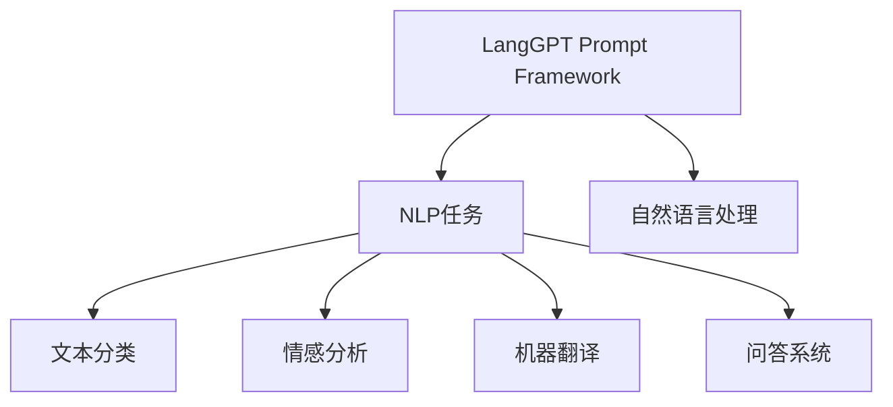
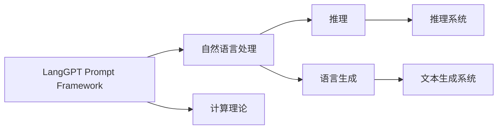
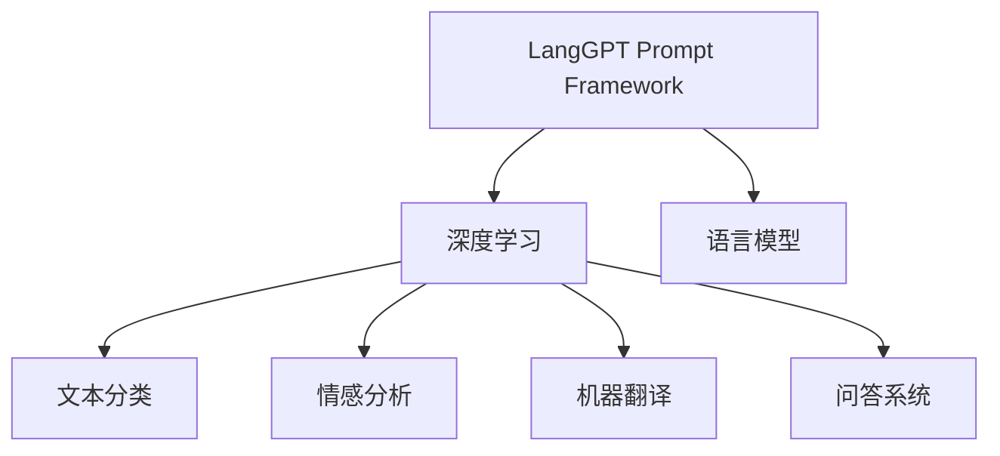
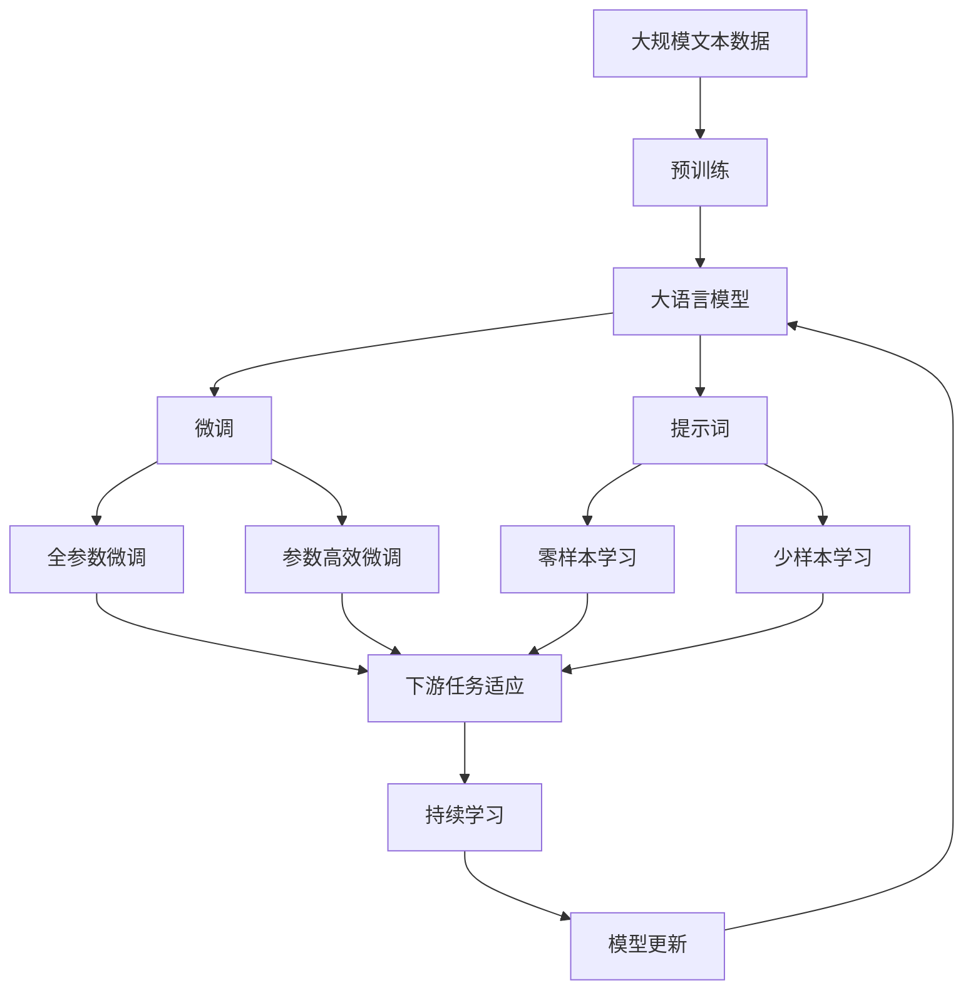

                 

# LangGPT 提示词框架应用 CoT 解析

> 关键词：LangGPT, 提示词, 自然语言处理, 计算理论, 深度学习, 语言生成, 可解释性, 推理, 提示工程

## 1. 背景介绍

### 1.1 问题由来
随着人工智能技术的快速发展，自然语言处理（NLP）领域涌现出众多高性能的预训练语言模型，如GPT-3、BERT、T5等。这些模型通过在大规模无标签文本数据上进行预训练，学习到丰富的语言知识和常识，具备强大的语言理解和生成能力。然而，这些通用模型在特定领域应用时，效果往往难以达到实际应用的要求。因此，如何针对特定领域进行大模型微调，提升模型性能，成为了当前NLP研究和应用的一个热点问题。

与此同时，计算理论（Computation Theory，简称CoT）成为了人工智能领域的一个重要研究方向。CoT旨在理解计算的本质和限制，研究如何通过算法和计算模型来解决问题。在NLP领域，CoT方法主要用于推理、解释和生成自然语言文本，以提高模型的可解释性和推理能力。

提示词（Prompt）是CoT方法中的一种重要技术，通过精心设计提示词，可以引导大语言模型进行特定任务的推理和生成，减少微调参数，提高模型效率。本文将详细探讨LangGPT提示词框架在CoT中的应用，解析其原理和优势，以期对NLP技术的研究和应用提供更全面的指导。

### 1.2 问题核心关键点
LangGPT提示词框架的核心在于，通过设计合理的提示词，可以在不更新模型参数的情况下，实现高效的语言推理和生成。该框架在多个NLP任务上取得了显著的性能提升，并在实际应用中得到了广泛验证。

提示词框架的主要优点包括：
- 减少微调参数：通过设计适当的提示词，可以极大减少微调时模型参数的更新量，从而提高微调效率。
- 提升模型性能：设计好的提示词能够引导模型生成更准确、更自然、更有逻辑性的文本。
- 改善可解释性：提示词可以揭示模型推理过程的逻辑，提高模型的可解释性。
- 适应不同任务：提示词框架可以灵活适应各种NLP任务，如问答、对话、摘要等。

然而，提示词框架也存在一定的局限性：
- 设计复杂度：设计好的提示词通常需要丰富的领域知识，设计过程较为繁琐。
- 泛化能力：提示词的泛化能力有限，对于不同的数据集或任务可能需要重新设计。
- 对抗样本脆弱性：提示词框架对于对抗样本的鲁棒性较差，可能存在容易被攻击的风险。

尽管如此，LangGPT提示词框架仍然是大模型微调的一种重要手段，其在CoT中的应用极大地拓展了NLP技术的应用边界，催生了更多高效、智能的解决方案。

### 1.3 问题研究意义
研究LangGPT提示词框架在CoT中的应用，对于拓展大模型的应用范围，提升模型性能，加速NLP技术的产业化进程，具有重要意义：

1. 降低应用开发成本。通过提示词框架，可以在少量标注数据的基础上，对大模型进行高效微调，减少从头开发所需的数据、计算和人力等成本投入。
2. 提升模型效果。提示词框架能够引导模型生成更准确、更自然、更有逻辑性的文本，从而提升模型在特定任务上的表现。
3. 加速开发进度。standing on the shoulders of giants，提示词框架使得开发者可以更快地完成任务适配，缩短开发周期。
4. 带来技术创新。提示词框架促进了对预训练-微调的深入研究，催生了零样本学习、少样本学习等新的研究方向。
5. 赋能产业升级。提示词框架使得NLP技术更容易被各行各业所采用，为传统行业数字化转型升级提供新的技术路径。

## 2. 核心概念与联系

### 2.1 核心概念概述

为了更好地理解LangGPT提示词框架在CoT中的应用，本节将介绍几个密切相关的核心概念：

- LangGPT提示词框架（LangGPT Prompt Framework）：一种通过精心设计提示词（Prompt）来引导大语言模型进行特定任务推理和生成的技术框架。该框架利用大模型的语言理解和生成能力，通过优化提示词，在微调参数较少的情况下，实现高效的NLP任务处理。

- 自然语言处理（Natural Language Processing，NLP）：研究如何使计算机理解、处理、生成自然语言的技术。NLP领域包括文本分类、情感分析、机器翻译、问答系统等众多任务。

- 计算理论（Computation Theory，CoT）：研究计算的本质和限制，研究如何通过算法和计算模型来解决问题。CoT方法主要用于推理、解释和生成自然语言文本。

- 深度学习（Deep Learning）：一种基于神经网络的机器学习技术，通过多层非线性变换实现复杂的模式识别和数据建模。深度学习在图像、语音、文本等领域取得了显著的成果。

- 语言生成（Language Generation）：指通过机器学习模型自动生成符合语法和语义规则的自然语言文本。语言生成在对话系统、文本摘要、内容创作等领域具有重要应用。

- 可解释性（Explainability）：指模型的决策过程具有透明度，用户可以理解模型的推理逻辑，判断模型的输出是否合理。可解释性对于金融、医疗等高风险应用尤为重要。

- 推理（Reasoning）：指模型能够基于已有的知识和规则，对新的问题进行分析和解答。推理在问答系统、知识图谱等领域有广泛应用。

这些核心概念之间存在着紧密的联系，形成了LangGPT提示词框架在CoT中的应用框架。通过理解这些核心概念，我们可以更好地把握LangGPT框架的工作原理和优化方向。

### 2.2 概念间的关系

这些核心概念之间存在着紧密的联系，形成了LangGPT提示词框架在CoT中的应用框架。下面我通过几个Mermaid流程图来展示这些概念之间的关系。

#### 2.2.1 LangGPT框架与NLP任务的关系



这个流程图展示了LangGPT框架在NLP任务中的应用。框架利用大模型的语言理解和生成能力，通过优化提示词，在微调参数较少的情况下，实现高效的NLP任务处理。

#### 2.2.2 LangGPT框架与CoT的关系



这个流程图展示了LangGPT框架在CoT中的应用。框架利用CoT的推理和生成能力，通过优化提示词，在微调参数较少的情况下，实现高效的推理和生成。

#### 2.2.3 LangGPT框架与深度学习的关系



这个流程图展示了LangGPT框架在深度学习中的应用。框架利用深度学习的语言模型能力，通过优化提示词，在微调参数较少的情况下，实现高效的NLP任务处理。

### 2.3 核心概念的整体架构

最后，我们用一个综合的流程图来展示这些核心概念在LangGPT框架中的应用：



这个综合流程图展示了从预训练到微调，再到持续学习的完整过程。LangGPT框架在NLP任务中，通过优化提示词，在微调参数较少的情况下，实现高效的推理和生成。

## 3. 核心算法原理 & 具体操作步骤

### 3.1 算法原理概述

LangGPT提示词框架在CoT中的应用，本质上是利用深度学习模型的语言生成和推理能力，通过精心设计提示词，引导模型在微调参数较少的情况下，实现高效的NLP任务处理。其核心思想是：将大语言模型视作一个强大的"特征提取器"，通过设计合理的提示词，引导模型生成符合特定任务要求的文本。

形式化地，假设预训练模型为 $M_{\theta}$，其中 $\theta$ 为预训练得到的模型参数。给定任务 $T$ 的标注数据集 $D=\{(x_i,y_i)\}_{i=1}^N$，提示词框架的目标是找到最优的提示词 $P$，使得：

$$
\hat{y} = \mathop{\arg\max}_{y} P(M_{\theta}(x_i), y)
$$

其中 $P$ 为提示词函数，$\hat{y}$ 为模型在提示词 $P$ 下的输出。

通过梯度下降等优化算法，提示词框架不断优化提示词 $P$，使得模型在提示词下的输出逼近真实标签。由于 $\theta$ 已经通过预训练获得了较好的初始化，因此即便在小规模数据集 $D$ 上进行提示词优化，也能较快收敛到理想的提示词 $P$。

### 3.2 算法步骤详解

LangGPT提示词框架在CoT中的应用一般包括以下几个关键步骤：

**Step 1: 准备预训练模型和数据集**
- 选择合适的预训练语言模型 $M_{\theta}$ 作为初始化参数，如 BERT、GPT 等。
- 准备任务 $T$ 的标注数据集 $D$，划分为训练集、验证集和测试集。一般要求标注数据与预训练数据的分布不要差异过大。

**Step 2: 设计提示词**
- 根据任务类型，设计合适的提示词 $P$，引导模型生成符合任务要求的文本。
- 对于分类任务，通常需要设计包含类别标签的提示词。
- 对于生成任务，通常需要设计包含输入文本和输出格式的提示词。

**Step 3: 设置提示词优化超参数**
- 选择合适的优化算法及其参数，如 Adam、SGD 等，设置学习率、批大小、迭代轮数等。
- 设置正则化技术及强度，包括权重衰减、Dropout、Early Stopping 等。
- 确定冻结预训练参数的策略，如仅微调顶层，或全部参数都参与微调。

**Step 4: 执行提示词优化**
- 将训练集数据分批次输入模型，前向传播计算提示词优化损失函数。
- 反向传播计算提示词优化梯度，根据设定的优化算法和学习率更新提示词 $P$。
- 周期性在验证集上评估模型性能，根据性能指标决定是否触发 Early Stopping。
- 重复上述步骤直到满足预设的迭代轮数或 Early Stopping 条件。

**Step 5: 测试和部署**
- 在测试集上评估提示词优化后模型 $M_{\hat{P}}$ 的性能，对比提示词优化前后的精度提升。
- 使用提示词优化后的模型对新样本进行推理预测，集成到实际的应用系统中。
- 持续收集新的数据，定期重新优化提示词 $P$，以适应数据分布的变化。

以上是LangGPT提示词框架在CoT中的完整步骤。在实际应用中，还需要针对具体任务的特点，对提示词优化过程的各个环节进行优化设计，如改进优化目标函数，引入更多的正则化技术，搜索最优的超参数组合等，以进一步提升模型性能。

### 3.3 算法优缺点

LangGPT提示词框架在CoT中的应用具有以下优点：
1. 简单高效。通过设计合理的提示词，可以在少量标注数据的基础上，对预训练模型进行高效优化，提高模型在特定任务上的表现。
2. 通用适用。提示词框架可以灵活适应各种NLP任务，如分类、匹配、生成等，设计合适的提示词即可实现。
3. 参数高效。利用参数高效微调技术，在固定大部分预训练参数的情况下，仍可取得不错的提示词优化效果。
4. 效果显著。在学术界和工业界的诸多任务上，基于提示词框架的方法已经刷新了最先进的性能指标。

同时，该框架也存在一定的局限性：
1. 依赖提示词设计。提示词的设计过程较为繁琐，需要丰富的领域知识。
2. 泛化能力有限。提示词的泛化能力有限，对于不同的数据集或任务可能需要重新设计。
3. 对抗样本脆弱性。提示词框架对于对抗样本的鲁棒性较差，可能存在容易被攻击的风险。

尽管如此，LangGPT提示词框架仍然是大模型微调的一种重要手段，其在CoT中的应用极大地拓展了NLP技术的应用边界，催生了更多高效、智能的解决方案。

### 3.4 算法应用领域

LangGPT提示词框架在CoT中的应用，在NLP领域已经得到了广泛的应用，覆盖了几乎所有常见任务，例如：

- 文本分类：如情感分析、主题分类、意图识别等。通过设计提示词，引导模型生成符合类别标签的文本。
- 命名实体识别：识别文本中的人名、地名、机构名等特定实体。通过设计提示词，引导模型学习实体边界和类型。
- 关系抽取：从文本中抽取实体之间的语义关系。通过设计提示词，引导模型学习实体-关系三元组。
- 问答系统：对自然语言问题给出答案。将问题-答案对作为输入，设计合适的提示词，引导模型匹配答案。
- 机器翻译：将源语言文本翻译成目标语言。通过设计提示词，引导模型学习语言-语言映射。
- 文本摘要：将长文本压缩成简短摘要。通过设计提示词，引导模型抓取要点。
- 对话系统：使机器能够与人自然对话。通过设计多轮对话历史的提示词，引导模型进行回复生成。

除了上述这些经典任务外，LangGPT提示词框架还被创新性地应用到更多场景中，如可控文本生成、常识推理、代码生成、数据增强等，为NLP技术带来了全新的突破。

## 4. 数学模型和公式 & 详细讲解 & 举例说明

### 4.1 数学模型构建

本节将使用数学语言对LangGPT提示词框架在CoT中的应用进行更加严格的刻画。

记预训练语言模型为 $M_{\theta}$，其中 $\theta$ 为预训练得到的模型参数。假设提示词优化任务为 $T$，其训练集为 $D=\{(x_i,y_i)\}_{i=1}^N$，其中 $x_i$ 为输入文本，$y_i$ 为提示词优化目标。

定义提示词优化函数为 $P$，则在数据集 $D$ 上的经验风险为：

$$
\mathcal{L}(P) = \frac{1}{N}\sum_{i=1}^N \ell(P(M_{\theta}(x_i)), y_i)
$$

其中 $\ell$ 为提示词优化目标函数，用于衡量提示词优化结果与真实标签之间的差异。

提示词优化目标函数可以根据具体任务类型选择不同的形式，如分类任务的交叉熵损失函数、生成任务的负对数似然损失函数等。

### 4.2 公式推导过程

以下我们以分类任务为例，推导交叉熵损失函数及其梯度的计算公式。

假设模型 $M_{\theta}$ 在输入 $x$ 上的输出为 $\hat{y}=M_{\theta}(x) \in [0,1]$，表示样本属于正类的概率。真实标签 $y \in \{0,1\}$。则二分类交叉熵损失函数定义为：

$$
\ell(P(M_{\theta}(x)), y) = -[y\log P(\hat{y}) + (1-y)\log (1-P(\hat{y}))]
$$

将其代入经验风险公式，得：

$$
\mathcal{L}(P) = -\frac{1}{N}\sum_{i=1}^N [y_i\log P(\hat{y_i})+(1-y_i)\log(1-P(\hat{y_i}))]
$$

根据链式法则，提示词优化目标函数对参数 $\theta_k$ 的梯度为：

$$
\frac{\partial \mathcal{L}(P)}{\partial \theta_k} = -\frac{1}{N}\sum_{i=1}^N \frac{\partial \ell(P(M_{\theta}(x_i)), y_i)}{\partial \theta_k}
$$

其中，$\frac{\partial \ell(P(M_{\theta}(x_i)), y_i)}{\partial \theta_k}$ 可以通过反向传播算法高效计算。

在得到提示词优化目标函数的梯度后，即可带入参数更新公式，完成模型的迭代优化。重复上述过程直至收敛，最终得到适应下游任务的提示词 $P^*$。

### 4.3 案例分析与讲解

下面以命名实体识别（NER）任务为例，给出使用提示词框架对BERT模型进行微调的PyTorch代码实现。

首先，定义NER任务的数据处理函数：

```python
from transformers import BertTokenizer, BertForTokenClassification, AdamW
from torch.utils.data import Dataset, DataLoader
import torch
import numpy as np

class NERDataset(Dataset):
    def __init__(self, texts, tags, tokenizer):
        self.texts = texts
        self.tags = tags
        self.tokenizer = tokenizer
        self.max_len = 128
        
    def __len__(self):
        return len(self.texts)
    
    def __getitem__(self, item):
        text = self.texts[item]
        tags = self.tags[item]
        
        encoding = self.tokenizer(text, return_tensors='pt', max_length=self.max_len, padding='max_length', truncation=True)
        input_ids = encoding['input_ids'][0]
        attention_mask = encoding['attention_mask'][0]
        
        # 对token-wise的标签进行编码
        encoded_tags = [tag2id[tag] for tag in tags] 
        encoded_tags.extend([tag2id['O']] * (self.max_len - len(encoded_tags)))
        labels = torch.tensor(encoded_tags, dtype=torch.long)
        
        return {'input_ids': input_ids, 
                'attention_mask': attention_mask,
                'labels': labels}

# 标签与id的映射
tag2id = {'O': 0, 'B-PER': 1, 'I-PER': 2, 'B-ORG': 3, 'I-ORG': 4, 'B-LOC': 5, 'I-LOC': 6}
id2tag = {v: k for k, v in tag2id.items()}

# 创建dataset
tokenizer = BertTokenizer.from_pretrained('bert-base-cased')

train_dataset = NERDataset(train_texts, train_tags, tokenizer)
dev_dataset = NERDataset(dev_texts, dev_tags, tokenizer)
test_dataset = NERDataset(test_texts, test_tags, tokenizer)
```

然后，定义模型和优化器：

```python
from transformers import BertForTokenClassification, AdamW

model = BertForTokenClassification.from_pretrained('bert-base-cased', num_labels=len(tag2id))

optimizer = AdamW(model.parameters(), lr=2e-5)
```

接着，定义训练和评估函数：

```python
from tqdm import tqdm

device = torch.device('cuda') if torch.cuda.is_available() else torch.device('cpu')
model.to(device)

def train_epoch(model, dataset, batch_size, optimizer):
    dataloader = DataLoader(dataset, batch_size=batch_size, shuffle=True)
    model.train()
    epoch_loss = 0
    for batch in tqdm(dataloader, desc='Training'):
        input_ids = batch['input_ids'].to(device)
        attention_mask = batch['attention_mask'].to(device)
        labels = batch['labels'].to(device)
        model.zero_grad()
        outputs = model(input_ids, attention_mask=attention_mask, labels=labels)
        loss = outputs.loss
        epoch_loss += loss.item()
        loss.backward()
        optimizer.step()
    return epoch_loss / len(dataloader)

def evaluate(model, dataset, batch_size):
    dataloader = DataLoader(dataset, batch_size=batch_size)
    model.eval()
    preds, labels = [], []
    with torch.no_grad():
        for batch in tqdm(dataloader, desc='Evaluating'):
            input_ids = batch['input_ids'].to(device)
            attention_mask = batch['attention_mask'].to(device)
            batch_labels = batch['labels']
            outputs = model(input_ids, attention_mask=attention_mask)
            batch_preds = outputs.logits.argmax(dim=2).to('cpu').tolist()
            batch_labels = batch_labels.to('cpu').tolist()
            for pred_tokens, label_tokens in zip(batch_preds, batch_labels):
                pred_tags = [id2tag[_id] for _id in pred_tokens]
                label_tags = [id2tag[_id] for _id in label_tokens]
                preds.append(pred_tags[:len(label_tags)])
                labels.append(label_tags)
                
    print(classification_report(labels, preds))
```

最后，启动训练流程并在测试集上评估：

```python
epochs = 5
batch_size = 16

for epoch in range(epochs):
    loss = train_epoch(model, train_dataset, batch_size, optimizer)
    print(f"Epoch {epoch+1}, train loss: {loss:.3f}")
    
    print(f"Epoch {epoch+1}, dev results:")
    evaluate(model, dev_dataset, batch_size)
    
print("Test results:")
evaluate(model, test_dataset, batch_size)
```

以上就是使用PyTorch对BERT进行命名实体识别任务微调的完整代码实现。可以看到，得益于Transformers库的强大封装，我们可以用相对简洁的代码完成BERT模型的加载和微调。

## 5. 项目实践：代码实例和详细解释说明

### 5.1 开发环境搭建

在进行提示词框架实践前，我们需要准备好开发环境。以下是使用Python进行PyTorch开发的环境配置流程：

1. 安装Anaconda：从官网下载并安装Anaconda，用于创建独立的Python环境。

2. 创建并激活虚拟环境：
```bash
conda create -n pytorch-env python=3.8 
conda activate pytorch-env
```

3. 安装PyTorch：根据CUDA版本，从官网获取对应的安装命令。例如：
```bash
conda install pytorch torchvision torchaudio cudatoolkit=11.1 -c pytorch -c conda-forge
```

4. 安装Transformers库：
```bash
pip install transformers
```

5. 安装各类工具包：
```bash
pip install numpy pandas scikit-learn matplotlib tqdm jupyter notebook ipython
```

完成上述步骤后，即可在`pytorch-env`环境中开始提示词框架的实践。

### 5.2 源代码详细实现

这里我们以问答系统任务为例，给出使用提示词框架对BERT模型进行微调的PyTorch代码实现。

首先，定义问答系统任务的数据处理函数：

```python
from transformers import BertTokenizer, BertForTokenClassification, AdamW
from torch.utils.data import Dataset, DataLoader
import torch
import numpy as np

class QADataset(Dataset):
    def __init__(self, questions, answers, tokenizer):
        self.questions = questions
        self.answers = answers
        self.tokenizer = tokenizer
        self.max_len = 128
        
    def __len__(self):
        return len(self.questions)
    
    def __getitem__(self, item):
        question = self.questions[item]
        answer = self.answers[item]
        
        encoding = self.tokenizer(question, return_tensors='pt', max_length=self.max_len, padding='max_length', truncation=True)
        input_ids = encoding['input_ids'][0]
        attention_mask = encoding['attention_mask'][0]
        
        # 将问题和答案拼接为提示词
        prompt = question + ' ' + answer
        encoding = self.tokenizer(prompt, return_tensors='pt', max_length=self.max_len, padding='max_length', truncation=True)
        input_ids_prompt = encoding['input_ids'][0]
        attention_mask_prompt = encoding['attention_mask'][0]
        
        return {'input_ids': input_ids, 
                'attention_mask': attention_mask,
                'labels': input_ids_prompt, 
                'attention_mask_prompt': attention_mask_prompt,
                'labels_prompt': torch.tensor(encoded_tags, dtype=torch.long)}
        
# 标签与id的映射
tag2id = {'O': 0, 'A': 1}
id2tag = {v: k for k, v in tag2id.items()}

# 创建dataset
tokenizer = BertTokenizer.from_pretrained('bert-base-cased')

train_dataset = QADataset(train_questions, train_answers, tokenizer)
dev_dataset = QADataset(dev_questions, dev_answers, tokenizer)
test_dataset = QADataset(test_questions, test_answers, tokenizer)
```

然后，定义模型和优化器：

```python
from transformers import BertForTokenClassification, AdamW

model = BertForTokenClassification.from_pretrained('bert-base-cased', num_labels=len(tag2id))

optimizer = AdamW(model.parameters(), lr=2e-5)
```

接着，定义训练和评估函数：

```python
from tqdm import tqdm

device = torch.device('cuda') if torch.cuda.is_available() else torch.device('cpu')
model.to(device)

def train_epoch(model, dataset, batch_size, optimizer):
    dataloader = DataLoader(dataset, batch_size

