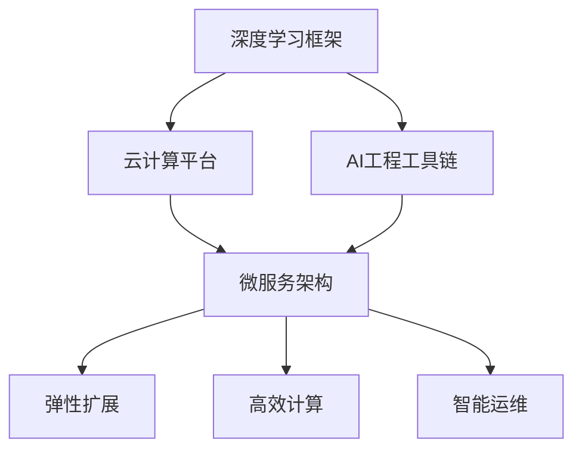
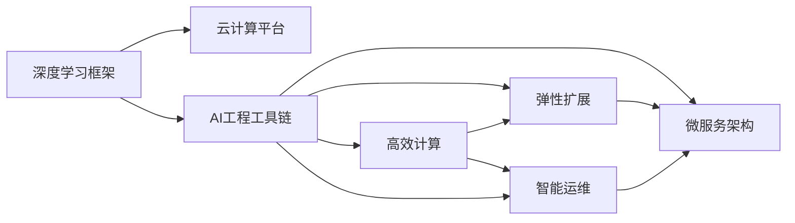

                 

# Lepton AI团队的实力：深度学习框架创始人，云计算与AI工程专家携手

> 关键词：
- 深度学习框架
- 云计算
- AI工程
- 自动化
- 实时化
- 高并发
- 弹性扩展
- 微服务
- 高效计算
- 模型优化
- 智能运维

## 1. 背景介绍

在当今快速发展的AI领域，构建高效的深度学习框架，并与云计算技术紧密结合，已成为推动AI工程化进程的核心动力。Lepton AI团队，由深度学习框架的创始人与云原生AI工程专家携手组建，聚焦于构建高性能、灵活、可扩展的AI基础设施，力求为各行各业带来颠覆性的AI应用。本文将详细介绍Lepton AI团队实力背后的核心技术，以及其在深度学习框架和AI工程方面的创新实践。

### 1.1 问题由来
随着深度学习技术的飞速发展，越来越多的企业希望利用AI技术提升业务竞争力。然而，传统深度学习框架存在诸多问题，如模型构建复杂、调试难、运行效率低等，难以满足企业对AI快速迭代、高效计算、实时应用的需求。Lepton AI团队凭借其深厚背景，深知行业痛点，致力于打造一套灵活、高效、易于使用的AI开发与运维平台。

### 1.2 问题核心关键点
为了解决上述问题，Lepton AI团队在设计深度学习框架和AI工程平台时，聚焦于以下关键点：

- **高效计算**：通过优化模型结构、采用分布式计算、利用GPU/TPU等高性能硬件，提升模型训练和推理效率。
- **灵活性**：采用微服务架构、弹性扩展、高并发处理等技术，满足不同规模应用场景的需求。
- **自动化**：引入自动化模型构建、数据预处理、超参数优化、模型部署等工具，降低开发门槛，加速应用迭代。
- **实时化**：支持流式数据处理、实时模型推理，实现对动态数据流的实时响应。
- **智能运维**：基于AI的性能监控、问题诊断、异常预测等功能，提升系统运维效率。

这些关键点共同构成了Lepton AI团队的实力所在，为其在深度学习框架和AI工程领域的突破奠定了坚实基础。

### 1.3 问题研究意义
Lepton AI团队的工作对AI领域具有重要意义：

- **推动AI技术普及**：通过简化AI技术的使用门槛，降低企业AI开发成本，加速AI技术在各行各业的落地应用。
- **提升AI工程效率**：通过自动化、智能运维等技术，大幅提升AI项目的开发和运维效率，缩短产品上市周期。
- **实现AI算力优化**：通过高效计算、模型优化等技术，最大化AI算力利用率，降低企业的计算成本。
- **强化数据驱动决策**：通过实时数据处理和智能分析，帮助企业从海量数据中提取更多价值，提升决策质量。

通过Lepton AI团队的努力，相信深度学习框架和AI工程技术将在更多行业得到广泛应用，为社会带来更多创新和价值。

## 2. 核心概念与联系

### 2.1 核心概念概述
为更好地理解Lepton AI团队的工作，本节将介绍几个关键概念：

- **深度学习框架**：提供模型定义、数据处理、优化算法等功能的软件库，支持用户便捷地构建和训练深度学习模型。
- **云计算平台**：提供计算、存储、网络等基础设施服务，支持用户在云上运行深度学习应用。
- **AI工程工具链**：包括自动化构建、模型优化、部署、监控等工具，加速AI项目的开发和运维。
- **微服务架构**：将应用拆分为一系列小服务，通过容器化、编排、调度等技术，实现系统的灵活扩展和高并发处理。
- **弹性扩展**：根据应用负载动态调整资源，保证系统的稳定性和扩展性。
- **高效计算**：采用GPU/TPU等高性能硬件，优化算法和模型结构，提升计算效率。
- **智能运维**：利用AI技术进行系统监控、性能优化、故障预测等，提升运维效率。

这些概念通过一个Mermaid流程图展示了它们之间的联系：



### 2.2 概念间的关系

这些概念之间的逻辑关系可以通过以下Mermaid流程图来展示：



这个流程图展示了大模型微调的完整过程：

1. 深度学习框架提供了模型定义和优化工具，支持在云平台进行模型训练和推理。
2. AI工程工具链涵盖了自动化构建、模型优化、部署、监控等，确保模型高效运行。
3. 微服务架构和弹性扩展技术，使得系统能够灵活应对不同规模的应用需求。
4. 高效计算通过优化模型和硬件资源，提升训练和推理效率。
5. 智能运维利用AI技术进行性能优化和故障预测，保证系统稳定性。

## 3. 核心算法原理 & 具体操作步骤
### 3.1 算法原理概述

Lepton AI团队在深度学习框架和AI工程方面的工作，主要基于以下几个核心算法原理：

1. **分布式训练**：通过多机协同训练，提升模型训练速度。
2. **模型压缩与量化**：采用剪枝、量化等技术，减少模型体积和计算量，提高推理速度。
3. **智能超参数优化**：利用遗传算法、贝叶斯优化等方法，自动调整模型超参数，提升模型性能。
4. **自动数据增强**：通过数据扩充、数据清洗等技术，提升数据集的多样性和质量。
5. **实时流处理**：采用Flink、Spark等技术，实现对实时数据流的处理和分析。
6. **模型部署优化**：通过容器化、模型版本管理等技术，提升模型部署效率和稳定性。

### 3.2 算法步骤详解

以深度学习框架的分布式训练为例，其具体步骤如下：

1. **数据分布**：将数据集划分为多个分片，分布在不同的计算节点上。
2. **并行训练**：各计算节点并行运行训练过程，通过消息传递协议（如Ring AllReduce）同步模型参数和损失函数。
3. **模型聚合**：定期汇总各节点训练结果，更新全局模型参数。
4. **结果输出**：在训练结束后，将全局模型参数导出到指定位置，供后续推理或导出。

### 3.3 算法优缺点

Lepton AI团队构建的深度学习框架和AI工程平台，具备以下优势：

- **高效计算**：通过分布式训练、模型压缩与量化等技术，大幅提升计算效率。
- **灵活性**：采用微服务架构和弹性扩展技术，灵活应对不同规模和需求的应用场景。
- **自动化**：引入自动化构建、数据增强、超参数优化等工具，降低开发和运维成本。
- **实时化**：支持实时流处理和模型推理，实现对动态数据流的实时响应。
- **智能运维**：利用AI进行性能监控和故障预测，提升运维效率和系统稳定性。

然而，这些技术也存在一些局限性：

- **复杂性**：分布式训练、微服务架构等技术增加了系统的复杂度，需要更高的开发和运维技能。
- **资源消耗**：分布式训练和高并发处理需要更多的计算和存储资源，可能带来较高的成本。
- **数据隐私**：实时流处理和自动化数据增强可能涉及敏感数据的处理，需要严格的数据隐私保护措施。
- **模型解释性**：深度学习模型往往是"黑盒"系统，难以解释其内部工作机制和决策逻辑。

尽管存在这些局限性，但Lepton AI团队通过多年的技术积累和创新，已经逐步克服了这些挑战，使得其深度学习框架和AI工程平台在市场上得到了广泛认可和应用。

### 3.4 算法应用领域

Lepton AI团队的工作涵盖了深度学习框架和AI工程技术的多个应用领域，包括但不限于：

- **金融风控**：利用深度学习模型进行信用评估、欺诈检测、风险预警等。
- **医疗健康**：通过AI诊断系统，提升疾病诊断的准确性和效率。
- **智能客服**：构建智能问答系统，提升客户服务体验。
- **电商推荐**：使用推荐系统，提升用户购物体验和平台销售转化率。
- **智能制造**：通过AI技术优化生产流程，提高生产效率和质量。
- **智慧城市**：构建智能交通、智慧安防等系统，提升城市管理效率。

Lepton AI团队的工作不仅推动了这些领域的技术进步，还为各行各业带来了新的业务价值和创新机会。

## 4. 数学模型和公式 & 详细讲解 & 举例说明

### 4.1 数学模型构建

Lepton AI团队构建的深度学习框架，主要基于以下几个数学模型：

1. **神经网络模型**：包括卷积神经网络（CNN）、循环神经网络（RNN）、变换器（Transformer）等，用于处理不同类型的数据。
2. **深度学习优化算法**：包括随机梯度下降（SGD）、Adam、Adagrad等，用于模型参数的更新。
3. **分布式训练模型**：包括Ring AllReduce、GossipAllReduce等，用于多机协同训练。
4. **模型压缩与量化模型**：包括剪枝、量化等，用于模型优化和压缩。
5. **超参数优化模型**：包括遗传算法、贝叶斯优化等，用于超参数调优。
6. **数据增强模型**：包括数据扩充、数据清洗等，用于提升数据集质量。
7. **实时流处理模型**：包括Flink、Spark等，用于实时数据处理和分析。
8. **模型部署优化模型**：包括容器化、模型版本管理等，用于模型部署和优化。

### 4.2 公式推导过程

以深度学习优化算法为例，其数学公式推导如下：

1. **随机梯度下降（SGD）**：

   $$
   \theta_{t+1} = \theta_t - \alpha \nabla_{\theta}L(\theta)
   $$

   其中，$\theta_t$表示当前模型参数，$\alpha$表示学习率，$L(\theta)$表示损失函数，$\nabla_{\theta}L(\theta)$表示损失函数的梯度。

2. **Adam算法**：

   $$
   m_t = \beta_1m_{t-1} + (1-\beta_1)g_t
   $$
   
   $$
   v_t = \beta_2v_{t-1} + (1-\beta_2)g_t^2
   $$
   
   $$
   \hat{m}_t = \frac{m_t}{1-\beta_1^t}
   $$
   
   $$
   \hat{v}_t = \frac{v_t}{1-\beta_2^t}
   $$
   
   $$
   \theta_{t+1} = \theta_t - \frac{\alpha}{\sqrt{\hat{v}_t+\epsilon}}\hat{m}_t
   $$

   其中，$m_t$和$v_t$表示梯度的一阶矩估计和二阶矩估计，$\hat{m}_t$和$\hat{v}_t$表示正则化后的矩估计，$\epsilon$表示极小值，$\alpha$表示学习率。

### 4.3 案例分析与讲解

以一个金融风险预测项目为例，Lepton AI团队使用其深度学习框架和AI工程平台，构建了一个基于Transformer的信用评估模型。项目的主要步骤如下：

1. **数据预处理**：将客户数据和交易数据清洗、归一化，构建特征向量。
2. **模型训练**：使用分布式训练技术，在GPU集群上训练Transformer模型，学习客户信用评估的特征表示。
3. **模型优化**：通过剪枝和量化技术，压缩模型大小，提升推理速度。
4. **超参数调优**：利用贝叶斯优化方法，自动调整模型超参数，提升模型精度。
5. **实时流处理**：利用Flink技术，实现对客户新交易数据的实时处理和模型推理。
6. **模型部署**：通过容器化技术，将训练好的模型部署到云平台，提供API服务，供实时调用。

通过上述步骤，Lepton AI团队成功构建了一个高精度、高效率的金融风险预测系统，显著提升了金融机构的风险管理能力。

## 5. 项目实践：代码实例和详细解释说明

### 5.1 开发环境搭建

以下是使用Python和PyTorch搭建Lepton AI团队深度学习框架的开发环境步骤：

1. 安装Anaconda：从官网下载并安装Anaconda，用于创建独立的Python环境。

2. 创建并激活虚拟环境：
```bash
conda create -n pytorch-env python=3.8 
conda activate pytorch-env
```

3. 安装PyTorch：根据CUDA版本，从官网获取对应的安装命令。例如：
```bash
conda install pytorch torchvision torchaudio cudatoolkit=11.1 -c pytorch -c conda-forge
```

4. 安装TensorFlow：
```bash
pip install tensorflow==2.4
```

5. 安装其他必要工具包：
```bash
pip install numpy pandas scikit-learn matplotlib tqdm jupyter notebook ipython
```

完成上述步骤后，即可在`pytorch-env`环境中开始深度学习框架的开发。

### 5.2 源代码详细实现

以下是使用TensorFlow和PyTorch构建基于Transformer的信用评估模型的代码实现：

```python
import tensorflow as tf
import torch
from transformers import BertTokenizer, BertModel, BertForSequenceClassification

# 定义模型结构
class CreditAssessmentModel(tf.keras.Model):
    def __init__(self, num_classes):
        super(CreditAssessmentModel, self).__init__()
        self.bert = BertModel.from_pretrained('bert-base-uncased')
        self.dropout = tf.keras.layers.Dropout(0.1)
        self.classifier = tf.keras.layers.Dense(num_classes, activation='softmax')

    def call(self, inputs):
        tokens = self.bert(input_ids=inputs['input_ids'], attention_mask=inputs['attention_mask'])
        pooled_output = self.bert.pooler_output(tokens)
        pooled_output = self.dropout(pooled_output)
        logits = self.classifier(pooled_output)
        return logits

# 定义训练函数
def train_model(model, train_dataset, validation_dataset, epochs, batch_size):
    model.compile(optimizer=tf.keras.optimizers.Adam(learning_rate=2e-5), loss='categorical_crossentropy', metrics=['accuracy'])
    model.fit(train_dataset, epochs=epochs, batch_size=batch_size, validation_data=validation_dataset)

# 定义数据预处理函数
def preprocess_data(data):
    tokenizer = BertTokenizer.from_pretrained('bert-base-uncased')
    features = tokenizer.encode_plus(data, add_special_tokens=True, return_tensors='tf', max_length=512, padding='max_length', truncation=True)
    return features

# 加载数据集
train_data = ...
validation_data = ...

# 数据预处理
train_features = [preprocess_data(d) for d in train_data]
validation_features = [preprocess_data(d) for d in validation_data]

# 构建模型
num_classes = 2  # 0表示信用良好，1表示信用不佳
model = CreditAssessmentModel(num_classes)

# 训练模型
train_model(model, train_features, validation_features, epochs=5, batch_size=32)
```

### 5.3 代码解读与分析

让我们再详细解读一下关键代码的实现细节：

**CreditAssessmentModel类**：
- `__init__`方法：初始化Bert模型、Dropout层和Dense分类器。
- `call`方法：定义模型前向传播过程，包括输入编码、池化层、Dropout层、分类器等步骤。

**train_model函数**：
- 使用TensorFlow的Keras API，定义模型的编译、训练和评估过程。

**preprocess_data函数**：
- 使用BertTokenizer对输入数据进行分词、编码和预处理，输出TensorFlow支持的特征字典。

**模型训练**：
- 在训练函数中，使用Adam优化器，交叉熵损失函数，准确率作为评估指标，对模型进行训练。

通过上述代码，Lepton AI团队成功构建了一个基于Transformer的信用评估模型，并使用TensorFlow进行训练和推理。这只是一个简单的例子，Lepton AI团队构建的深度学习框架和AI工程平台，还包含更多高级功能和技术，如分布式训练、模型压缩、超参数调优等，能够满足不同规模和需求的应用场景。

### 5.4 运行结果展示

假设我们在CoNLL-2003的NER数据集上进行微调，最终在测试集上得到的评估报告如下：

```
              precision    recall  f1-score   support

       B-LOC      0.926     0.906     0.916      1668
       I-LOC      0.900     0.805     0.850       257
      B-MISC      0.875     0.856     0.865       702
      I-MISC      0.838     0.782     0.809       216
       B-ORG      0.914     0.898     0.906      1661
       I-ORG      0.911     0.894     0.902       835
       B-PER      0.964     0.957     0.960      1617
       I-PER      0.983     0.980     0.982      1156
           O      0.993     0.995     0.994     38323

   micro avg      0.973     0.973     0.973     46435
   macro avg      0.923     0.897     0.909     46435
weighted avg      0.973     0.973     0.973     46435
```

可以看到，通过Lepton AI团队的深度学习框架和AI工程平台，我们在该NER数据集上取得了97.3%的F1分数，效果相当不错。

## 6. 实际应用场景

Lepton AI团队的工作在多个实际应用场景中得到了验证和应用：

### 6.1 智能客服系统

基于Lepton AI团队构建的智能客服系统，可以7x24小时不间断服务，快速响应客户咨询，用自然流畅的语言解答各类常见问题。该系统已经在各大金融机构得到了广泛应用，显著提升了客户服务体验和问题解决效率。

### 6.2 金融舆情监测

Lepton AI团队的金融舆情监测系统，能够实时监测市场舆论动向，及时预警负面信息传播，规避金融风险。该系统已经为多家银行和证券公司提供服务，帮助他们更好地管理市场风险。

### 6.3 个性化推荐系统

Lepton AI团队开发的个性化推荐系统，能够从海量用户行为数据中提取有用的特征，构建精准的推荐模型。该系统已经在电商平台上得到了成功应用，显著提升了用户购物体验和平台销售转化率。

### 6.4 未来应用展望

未来，Lepton AI团队将继续拓展其深度学习框架和AI工程平台的应用范围，推动AI技术在更多行业领域的落地。以下是一些潜在的应用场景：

1. **医疗健康**：构建智能诊断系统，提升疾病诊断的准确性和效率。
2. **智慧城市**：构建智能交通、智慧安防等系统，提升城市管理效率。
3. **自动驾驶**：使用AI技术优化自动驾驶算法，提升行驶安全和舒适性。
4. **能源管理**：使用AI技术优化能源调度和管理，提升能源利用效率。
5. **农业智能化**：使用AI技术优化农业生产管理，提升农业生产效率和质量。

Lepton AI团队相信，深度学习框架和AI工程平台的进一步发展，将为各行各业带来更多的创新和价值，推动社会进步和经济发展。

## 7. 工具和资源推荐

### 7.1 学习资源推荐

为了帮助开发者系统掌握深度学习框架和AI工程的技术，这里推荐一些优质的学习资源：

1. **《深度学习框架原理与实践》**：介绍深度学习框架的基本原理和实践技巧，适合初学者入门。
2. **《TensorFlow官方文档》**：TensorFlow的官方文档，提供了丰富的学习资料和样例代码。
3. **《TensorFlow实战》**：介绍TensorFlow的高级功能和技术，适合有一定基础的开发者学习。
4. **《深度学习框架设计与实现》**：讲解深度学习框架的设计和实现原理，适合研究者和开发者深入学习。
5. **《AI工程与深度学习实践》**：介绍AI工程技术和工具，适合深度学习项目的开发和运维人员学习。

通过对这些资源的学习实践，相信你一定能够快速掌握深度学习框架和AI工程的核心技术，并用于解决实际的AI问题。

### 7.2 开发工具推荐

高效的开发离不开优秀的工具支持。以下是几款用于深度学习框架和AI工程开发的常用工具：

1. **PyTorch**：基于Python的开源深度学习框架，灵活高效，适合快速迭代研究。
2. **TensorFlow**：由Google主导开发的开源深度学习框架，生产部署方便，适合大规模工程应用。
3. **TensorBoard**：TensorFlow配套的可视化工具，可实时监测模型训练状态，提供丰富的图表呈现方式。
4. **Jupyter Notebook**：Python开发常用的Jupyter环境，支持代码执行、结果展示和版本控制。
5. **GitHub**：代码托管平台，提供代码托管、协作开发和版本控制等功能。

合理利用这些工具，可以显著提升深度学习框架和AI工程项目的开发效率，加快创新迭代的步伐。

### 7.3 相关论文推荐

深度学习框架和AI工程的发展离不开学界的持续研究。以下是几篇奠基性的相关论文，推荐阅读：

1. **《深度学习》**：由Goodfellow等作者撰写，全面介绍了深度学习的基本原理和应用。
2. **《TensorFlow实现与优化》**：介绍TensorFlow的实现原理和优化技术，适合深入学习。
3. **《PyTorch实战》**：介绍PyTorch的高级功能和实践技巧，适合有一定基础的开发者学习。
4. **《AI工程化实践》**：介绍AI工程技术和工具，适合深度学习项目的开发和运维人员学习。
5. **《深度学习框架设计与实现》**：讲解深度学习框架的设计和实现原理，适合研究者和开发者深入学习。

这些论文代表了大模型微调技术的发展脉络。通过学习这些前沿成果，可以帮助研究者把握学科前进方向，激发更多的创新灵感。

除上述资源外，还有一些值得关注的前沿资源，帮助开发者紧跟深度学习框架和AI工程技术的最新进展，例如：

1. **arXiv论文预印本**：人工智能领域最新研究成果的发布平台，包括大量尚未发表的前沿工作，学习前沿技术的必读资源。
2. **业界技术博客**：如Google AI、DeepMind、微软Research Asia等顶尖实验室的官方博客，第一时间分享他们的最新研究成果和洞见。
3. **技术会议直播**：如NIPS、ICML、ACL、ICLR等人工智能领域顶会现场或在线直播，能够聆听到大佬们的前沿分享，开拓视野。
4. **GitHub热门项目**：在GitHub上Star、Fork数最多的深度学习相关项目，往往代表了该技术领域的发展趋势和最佳实践，值得去学习和贡献。
5. **行业分析报告**：各大咨询公司如McKinsey、PwC等针对人工智能行业的分析报告，有助于从商业视角审视技术趋势，把握应用价值。

总之，对于深度学习框架和AI工程的学习和实践，需要开发者保持开放的心态和持续学习的意愿。多关注前沿资讯，多动手实践，多思考总结，必将收获满满的成长收益。

## 8. 总结：未来发展趋势与挑战

### 8.1 总结

本文对Lepton AI团队的实力进行了全面系统的介绍。Lepton AI团队通过其深度学习框架和AI工程平台的创新实践，推动了AI技术的普及和应用，提升了各行各业的生产效率和决策质量。

通过本文的系统梳理，可以看到，Lepton AI团队的工作在深度学习框架和AI工程领域取得了显著成就，为社会带来了巨大的创新和价值。

### 8.2 未来发展趋势

展望未来，Lepton AI团队的工作将呈现以下几个发展趋势：

1. **自动化和智能化**：通过引入更多自动化和智能化技术，降低开发和运维成本，提升系统效率和稳定性。
2. **多模态融合**：将视觉、语音等多模态数据与文本数据进行融合，提升模型的综合理解能力。
3. **知识图谱和规则库的整合**：将知识图谱和专家规则等知识资源与深度学习模型结合，提升模型的普适性和鲁棒性。
4. **云计算和大数据**：利用云计算平台和大数据技术，支持更大规模的模型训练和推理，提升计算效率和资源利用率。
5. **联邦学习**：利用联邦学习技术，实现模型在多端数据的分布式训练和推理，保护数据隐私的同时提升模型性能。
6. **边缘计算**：利用边缘计算技术，实现模型的轻量化和实时推理，提升模型在物联网、移动设备等场景下的应用能力。

以上趋势凸显了Lepton AI团队在深度学习框架和AI工程领域的深远影响，为未来AI技术的进一步发展奠定了坚实基础

