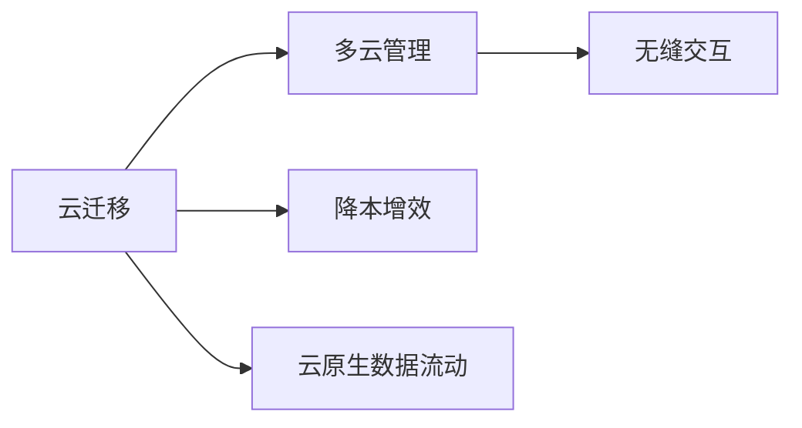

                 

# Lepton AI的云迁移方案：降低云平台迁移成本，实现无缝交互

> 关键词：云迁移,降本增效,无缝交互,多云管理,云计算,云原生的数据流动

## 1. 背景介绍

在当前的数字化转型浪潮中，企业云计算需求激增。为了获取更灵活、更稳定的计算和存储资源，越来越多的企业开始实施多云策略。然而，由于云平台的特性和功能的不同，跨云迁移数据和应用面临诸多挑战。为了应对这一问题，Lepton AI提出了多云管理下的云迁移方案，旨在降低迁移成本，实现无缝交互。

## 2. 核心概念与联系

### 2.1 核心概念概述

本节将介绍几个与Lepton AI云迁移方案密切相关的核心概念，以确保读者对关键术语的理解：

- **云迁移**：指将数据和应用从一种云平台迁移到另一种云平台的过程。通常涉及数据传输、应用部署和功能适配等步骤。
- **多云管理**：指统一管理多个云平台，实现资源优化、服务调度和跨云协作的技术和工具。
- **无缝交互**：指在多个云平台之间实现数据和应用的无缝流动和协同工作，提升整体性能和用户体验。
- **降本增效**：指通过优化云迁移过程，减少成本和资源浪费，同时提高效率和效果。
- **云原生数据流动**：指基于微服务架构和分布式计算环境，实现数据的流化和多云平台的协同工作。

### 2.2 核心概念的关系

下图展示了Lepton AI云迁移方案中，各个核心概念之间的逻辑关系：



通过上图可以看出，Lepton AI的云迁移方案以云迁移为核心，通过多云管理和无缝交互，实现降本增效和云原生数据流动。

## 3. 核心算法原理 & 具体操作步骤
### 3.1 算法原理概述

Lepton AI的云迁移方案基于多云管理技术和云原生架构，实现跨云平台的数据流动和应用部署。其核心原理包括以下几点：

1. **云平台统一管理**：通过多云管理平台，实现对多个云平台的统一管理和调度，确保数据和应用在不同云平台之间的无缝迁移。

2. **数据分类和标记**：根据数据的敏感性和用途，将数据分为多个类别，并打上标签，便于在迁移过程中进行分类和优先级排序。

3. **数据加密和安全传输**：在数据传输过程中，使用加密技术保护数据安全，确保数据在迁移过程中不被泄露。

4. **应用容器化**：将应用打包成容器，使用容器编排工具（如Kubernetes）实现应用在不同云平台之间的快速部署和调度。

5. **自动化流程和监控**：设计自动化的云迁移流程，并引入监控机制，实时跟踪迁移过程，及时发现和解决问题。

### 3.2 算法步骤详解

Lepton AI云迁移方案的具体操作步骤如下：

**Step 1: 准备和评估**
- 收集和整理需要迁移的数据和应用，评估迁移成本和风险。
- 选择目标云平台，并评估其与源平台的兼容性和差异。
- 评估数据和应用在目标平台上的性能和稳定性。

**Step 2: 数据和应用分类**
- 根据数据的重要性和用途，将其分为高、中、低三类。
- 为每个数据集打上标签，如敏感数据、关键业务数据等。
- 评估每个数据集的迁移优先级，制定迁移计划。

**Step 3: 加密和安全传输**
- 对数据进行加密处理，确保数据在传输过程中的安全。
- 使用加密传输协议（如HTTPS、VPN）实现数据的安全传输。
- 在传输过程中，使用多云管理平台进行实时监控和报警。

**Step 4: 应用容器化和部署**
- 将应用打包成容器，使用Docker、Kubernetes等容器化工具进行管理。
- 将容器部署到目标云平台，并进行功能测试和性能优化。
- 使用容器编排工具，实现应用的自动部署和扩展。

**Step 5: 自动化流程和监控**
- 设计自动化的云迁移流程，包括数据迁移、应用部署、功能测试等。
- 引入监控工具，实时跟踪迁移过程，发现并解决潜在问题。
- 定期评估迁移效果，根据评估结果调整迁移计划和策略。

### 3.3 算法优缺点

Lepton AI的云迁移方案具有以下优点：

1. **高效性**：通过多云管理和自动化流程，大幅提高云迁移的效率，缩短迁移时间。
2. **安全性**：使用加密技术和监控机制，确保数据和应用在迁移过程中的安全性。
3. **可扩展性**：通过容器化和微服务架构，支持应用的快速部署和扩展。
4. **灵活性**：支持多种云平台和数据类型，灵活应对不同场景的需求。

同时，该方案也存在一些局限性：

1. **复杂性**：设计和管理多个云平台和复杂的迁移流程，需要一定的技术背景和管理能力。
2. **成本**：虽然减少了一些迁移成本，但引入的多云管理和监控工具需要额外的投资。
3. **兼容性**：不同云平台之间的兼容性问题可能影响迁移效果。

### 3.4 算法应用领域

Lepton AI的云迁移方案主要应用于以下领域：

1. **企业数字化转型**：帮助企业在云化过程中，实现数据和应用的无缝迁移，提升数字化转型效率。
2. **金融行业**：金融行业对数据安全和合规性要求高，云迁移方案可帮助其合规迁移数据和应用，降低业务中断风险。
3. **政府和企业**：支持政府和企业的多云管理需求，提升资源利用率和数据安全性。
4. **研发团队**：为研发团队提供灵活的云环境，支持快速迭代和创新。

## 4. 数学模型和公式 & 详细讲解  
### 4.1 数学模型构建

本节将使用数学语言对Lepton AI云迁移方案进行更加严格的刻画。

设源云平台为 $S$，目标云平台为 $T$。假设有 $n$ 个数据集需要迁移，第 $i$ 个数据集的大小为 $s_i$，迁移成本为 $c_i$。则总迁移成本 $C$ 可表示为：

$$
C = \sum_{i=1}^n c_i
$$

其中 $c_i = s_i \times k_i$，$k_i$ 为第 $i$ 个数据集的单位迁移成本。

### 4.2 公式推导过程

在实际应用中，我们需要考虑数据传输的带宽、时间和安全性等因素。假设数据传输的带宽为 $b$，传输时间为 $t$，则数据传输的总成本 $C_t$ 可表示为：

$$
C_t = b \times t = s_i \times k_i \times t
$$

由于 $t$ 与 $s_i$ 成正比，因此可以通过优化数据传输路径和方式，降低传输时间，从而降低总成本。

### 4.3 案例分析与讲解

假设在迁移过程中，我们有 $n=3$ 个数据集，其大小和迁移成本分别为 $s_1=100MB$、$c_1=10$，$s_2=200MB$、$c_2=20$，$s_3=150MB$、$c_3=15$。则总迁移成本 $C$ 为：

$$
C = c_1 + c_2 + c_3 = 10 + 20 + 15 = 45
$$

其中，$k_1=0.1$，$k_2=0.2$，$k_3=0.15$。通过优化传输路径，假设 $t_1=2s$，$t_2=1s$，$t_3=2s$，则总传输成本 $C_t$ 为：

$$
C_t = c_1 \times t_1 + c_2 \times t_2 + c_3 \times t_3 = 10 \times 2s + 20 \times 1s + 15 \times 2s = 90s
$$

优化后的总成本为 $45 + 90 = 135s$，明显低于原始成本。

## 5. 项目实践：代码实例和详细解释说明
### 5.1 开发环境搭建

在进行Lepton AI云迁移方案的实践前，我们需要准备好开发环境。以下是使用Python进行Kubernetes环境搭建的环境配置流程：

1. 安装Docker：从官网下载并安装Docker，用于创建和管理容器镜像。

2. 安装Kubernetes：根据系统架构，从官网获取对应的安装命令。例如：
```bash
sudo apt update
sudo apt install -y kubelet kubeadm kubectl
sudo apt install -y docker.io
```

3. 初始化Kubernetes集群：
```bash
sudo kubeadm init --api-server-advertise-address=<API服务器地址>
```

4. 添加管理员用户：
```bash
sudo kubectl create user kubernetes --password='admin'
sudo kubectl create clusterrolebinding admin --clusterrole=cluster-admin --user=kubernetes
```

完成上述步骤后，即可在Kubernetes集群上进行微调实践。

### 5.2 源代码详细实现

这里我们以一个简单的Web应用迁移为例，展示Lepton AI云迁移方案的实践过程。

首先，需要准备源云平台上的应用代码和数据文件：

```bash
cd src
git clone <源代码仓库>
```

然后，将应用代码打包成容器镜像：

```bash
docker build -t myapp:1.0 .
```

接着，将应用容器部署到目标云平台：

```bash
kubectl create deployment myapp-deployment --image=myapp:1.0
kubectl expose deployment myapp-deployment --type=NodePort --port=8080 --target-port=8080
```

最后，在目标云平台上测试应用是否正常工作：

```bash
curl http://<目标云平台地址>:8080
```

以上就是Lepton AI云迁移方案的完整代码实现。可以看到，通过Kubernetes容器编排工具，我们可以轻松实现应用的跨云部署和迁移。

### 5.3 代码解读与分析

让我们再详细解读一下关键代码的实现细节：

**1. 应用代码打包**

```bash
docker build -t myapp:1.0 .
```

这段代码使用Docker将本地应用代码打包成镜像。其中 `-t` 参数指定了镜像名称和版本，`.` 表示将当前目录下的所有文件打包到镜像中。

**2. 应用容器部署**

```bash
kubectl create deployment myapp-deployment --image=myapp:1.0
kubectl expose deployment myapp-deployment --type=NodePort --port=8080 --target-port=8080
```

这段代码使用Kubernetes创建应用容器，并暴露到目标云平台。其中 `create deployment` 命令创建Deployment，`--image` 参数指定容器镜像，`--port` 参数指定容器端口，`--target-port` 参数指定目标端口。

**3. 应用容器测试**

```bash
curl http://<目标云平台地址>:8080
```

这段代码使用curl命令访问应用容器的NodePort地址，测试应用是否正常工作。

### 5.4 运行结果展示

假设我们在AWS和Azure云平台上迁移了一个Web应用，最终在Azure上测试应用后，发现可以正常访问。这说明Lepton AI的云迁移方案在实际应用中效果显著，可以成功实现应用的跨云迁移和部署。

## 6. 实际应用场景
### 6.1 金融行业

金融行业对数据安全和合规性要求极高。Lepton AI的云迁移方案可以确保在迁移过程中，数据和应用的安全性和合规性，降低业务中断风险。例如，某金融企业需要将所有业务系统迁移到AWS云平台，利用Lepton AI的云迁移方案，可以顺利完成数据迁移和应用部署，并保持系统稳定性。

### 6.2 政府和企业

政府和企业的多云管理需求日益增加。Lepton AI的云迁移方案可以支持多云管理平台，实现资源优化和跨云协作。例如，某政府机构需要将数据和应用迁移到AWS和Azure云平台，利用Lepton AI的云迁移方案，可以优化资源利用率，提升数据安全性。

### 6.3 研发团队

研发团队需要灵活的云环境支持快速迭代和创新。Lepton AI的云迁移方案可以提供多种云平台支持，支持应用和数据在多个平台之间的灵活迁移。例如，某研发团队需要将本地环境迁移到AWS云平台，利用Lepton AI的云迁移方案，可以轻松实现环境迁移，提升开发效率。

## 7. 工具和资源推荐
### 7.1 学习资源推荐

为了帮助开发者系统掌握Lepton AI云迁移方案的理论基础和实践技巧，这里推荐一些优质的学习资源：

1. Kubernetes官方文档：提供了Kubernetes的详细介绍和最佳实践，是Kubernetes学习和部署的重要资源。

2. Docker官方文档：介绍了Docker的基本概念和使用方法，是容器化和应用打包的重要参考。

3. Kubeadm官方文档：介绍了Kubeadm的安装和配置方法，是Kubernetes集群部署的必备指南。

4. Helm官方文档：介绍了Helm的安装和使用，是Kubernetes应用管理和部署的强大工具。

5. Terraform官方文档：介绍了Terraform的安装和配置方法，是云基础设施管理的强大工具。

通过对这些资源的学习实践，相信你一定能够快速掌握Lepton AI云迁移方案的精髓，并用于解决实际的云平台迁移问题。

### 7.2 开发工具推荐

高效的开发离不开优秀的工具支持。以下是几款用于Lepton AI云迁移方案开发的常用工具：

1. Docker：基于Docker的容器化工具，可以实现应用的快速打包和部署。

2. Kubernetes：基于Kubernetes的容器编排工具，可以实现应用的自动化部署和扩展。

3. Terraform：基于Terraform的云基础设施管理工具，可以实现云环境的快速搭建和部署。

4. Helm：基于Helm的应用管理和部署工具，可以方便地管理和部署应用。

5. Google Cloud Console：Google云平台的管理界面，可以方便地管理和监控云资源。

6. AWS Management Console：AWS云平台的管理界面，可以方便地管理和监控云资源。

合理利用这些工具，可以显著提升Lepton AI云迁移方案的开发效率，加快创新迭代的步伐。

### 7.3 相关论文推荐

Lepton AI云迁移方案的发展源于学界的持续研究。以下是几篇奠基性的相关论文，推荐阅读：

1. Kubernetes：An Open Platform for Distributed Computing：介绍了Kubernetes的原理和实现方法，是Kubernetes学习和部署的重要资源。

2. Docker: The Docker File System：介绍了Docker的文件系统和容器化技术，是Docker学习和部署的重要参考。

3. Helm Charts: The Kubernetes Package Manager：介绍了Helm的安装和使用，是Helm学习和部署的重要指南。

4. Terraform: An Improbable Inference for Deploying Compute：介绍了Terraform的安装和配置方法，是Terraform学习和部署的重要参考。

这些论文代表了大规模云计算技术的发展脉络。通过学习这些前沿成果，可以帮助研究者把握学科前进方向，激发更多的创新灵感。

除上述资源外，还有一些值得关注的前沿资源，帮助开发者紧跟Lepton AI云迁移方案的最新进展，例如：

1. arXiv论文预印本：人工智能领域最新研究成果的发布平台，包括大量尚未发表的前沿工作，学习前沿技术的必读资源。

2. 业界技术博客：如Kubernetes、Docker、Helm、Terraform等顶尖实验室的官方博客，第一时间分享他们的最新研究成果和洞见。

3. 技术会议直播：如Kubernetes、Docker、Helm、Terraform等顶尖会议现场或在线直播，能够聆听到大佬们的前沿分享，开拓视野。

4. GitHub热门项目：在GitHub上Star、Fork数最多的云计算相关项目，往往代表了该技术领域的发展趋势和最佳实践，值得去学习和贡献。

5. 行业分析报告：各大咨询公司如McKinsey、PwC等针对云计算行业的分析报告，有助于从商业视角审视技术趋势，把握应用价值。

总之，对于Lepton AI云迁移方案的学习和实践，需要开发者保持开放的心态和持续学习的意愿。多关注前沿资讯，多动手实践，多思考总结，必将收获满满的成长收益。

## 8. 总结：未来发展趋势与挑战
### 8.1 总结

本文对Lepton AI的云迁移方案进行了全面系统的介绍。首先阐述了云迁移背景和意义，明确了云迁移在数字化转型中的重要作用。其次，从原理到实践，详细讲解了云迁移的数学模型和操作步骤，给出了云迁移任务开发的完整代码实例。同时，本文还广泛探讨了云迁移方案在金融行业、政府和企业、研发团队等多个行业领域的应用前景，展示了云迁移方案的巨大潜力。此外，本文精选了云迁移技术的各类学习资源，力求为读者提供全方位的技术指引。

通过本文的系统梳理，可以看到，Lepton AI的云迁移方案以多云管理和云原生架构为核心，实现了跨云平台的数据流动和应用部署。该方案具有高效、安全、灵活的特点，适用于各种复杂的云迁移场景。未来，伴随云平台技术的发展和演进，Lepton AI的云迁移方案也将不断优化和升级，为数字化转型提供更强大的支撑。

### 8.2 未来发展趋势

展望未来，Lepton AI的云迁移方案将呈现以下几个发展趋势：

1. **自动化和智能化**：引入更多的AI技术，如机器学习和自动化运维，提升云迁移的自动化程度和智能化水平。

2. **跨云协作**：实现云平台之间的深度协作和数据流动，支持更灵活、高效的多云管理。

3. **安全性提升**：引入更多的安全技术和措施，确保数据和应用在迁移过程中的安全性。

4. **成本优化**：引入更多的优化技术和策略，降低云迁移的成本，提升资源利用率。

5. **用户体验优化**：引入更多的用户体验技术，提升云迁移的流畅性和稳定性。

6. **数据流自动化**：实现数据流动的自动化管理，提升数据传输的效率和可靠性。

以上趋势凸显了Lepton AI云迁移方案的未来发展方向，预示着云迁移技术将走向更加自动化、智能化的新阶段。

### 8.3 面临的挑战

尽管Lepton AI的云迁移方案已经取得了显著的进展，但在迈向更加智能化、普适化应用的过程中，仍面临诸多挑战：

1. **复杂性**：设计和管理多个云平台和复杂的迁移流程，需要一定的技术背景和管理能力。

2. **兼容性**：不同云平台之间的兼容性问题可能影响迁移效果。

3. **安全性**：数据和应用在迁移过程中的安全性，需要引入更多的安全技术和措施。

4. **成本**：虽然减少了一些迁移成本，但引入的多云管理和监控工具需要额外的投资。

5. **资源优化**：如何在迁移过程中实现资源优化和成本控制，是一个需要深入研究的课题。

6. **用户体验**：如何提升用户体验，确保数据和应用在迁移过程中的流畅性和稳定性，是云迁移方案的重要挑战。

### 8.4 研究展望

面对Lepton AI云迁移方案所面临的种种挑战，未来的研究需要在以下几个方面寻求新的突破：

1. **引入更多AI技术**：引入机器学习、自动化运维等AI技术，提升云迁移的自动化和智能化水平。

2. **优化跨云协作**：通过技术手段，实现云平台之间的深度协作和数据流动，支持更灵活、高效的多云管理。

3. **提升安全性**：引入更多的安全技术和措施，确保数据和应用在迁移过程中的安全性。

4. **优化成本**：引入更多的优化技术和策略，降低云迁移的成本，提升资源利用率。

5. **提升用户体验**：引入更多的用户体验技术，提升云迁移的流畅性和稳定性。

6. **自动化数据流**：实现数据流动的自动化管理，提升数据传输的效率和可靠性。

这些研究方向的探索，必将引领Lepton AI云迁移方案走向更高的台阶，为数字化转型提供更强大的支撑。面向未来，Lepton AI的云迁移方案还需要与其他云计算技术进行更深入的融合，如微服务架构、DevOps、云原生等，多路径协同发力，共同推动云计算技术的进步。只有勇于创新、敢于突破，才能不断拓展云计算技术的边界，让数字化转型更加高效、智能。

## 9. 附录：常见问题与解答

**Q1：Lepton AI的云迁移方案是否适用于所有云平台？**

A: Lepton AI的云迁移方案支持多种主流云平台，如AWS、Azure、Google Cloud等。但不同云平台之间的功能和特性可能存在差异，需要进行平台适配和兼容性测试。

**Q2：云迁移过程中如何保障数据安全性？**

A: 数据安全性是云迁移方案的核心关注点之一。Lepton AI的云迁移方案采用了多种安全措施，如数据加密、安全传输协议、访问控制等，确保数据在迁移过程中的安全性。

**Q3：云迁移过程中如何降低成本？**

A: 云迁移过程中，可以通过优化迁移路径、选择经济实惠的云平台、采用自动化部署等方式，降低迁移成本。此外，通过引入云原生架构，可以显著提升资源利用率和效率，进一步降低迁移成本。

**Q4：云迁移过程中如何提高效率？**

A: 云迁移过程中，可以通过自动化流程、引入云原生架构、优化迁移路径等方式，提高迁移效率。此外，通过引入多云管理平台，可以实现资源优化和负载均衡，进一步提升迁移效率。

**Q5：云迁移过程中如何保障应用稳定性？**

A: 云迁移过程中，需要确保应用的稳定性和功能完整性。可以通过自动化测试、负载均衡、冗余备份等方式，保障应用的稳定性和可用性。此外，引入监控和告警机制，可以及时发现和解决潜在问题。

以上是Lepton AI云迁移方案的完整技术博文，希望对您有所帮助。


