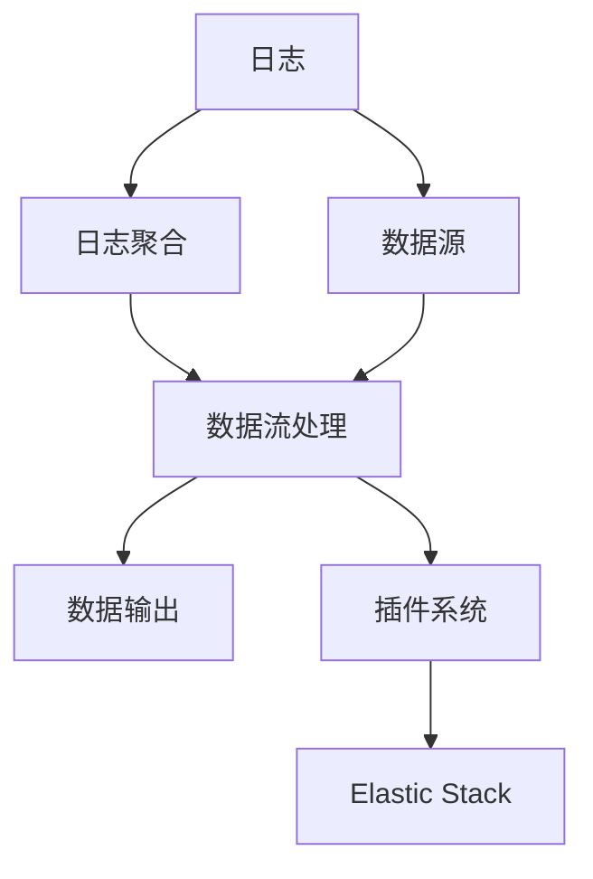
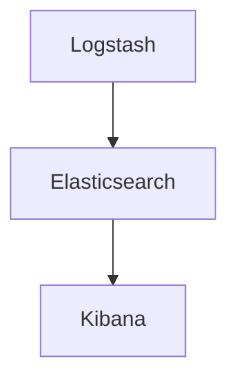
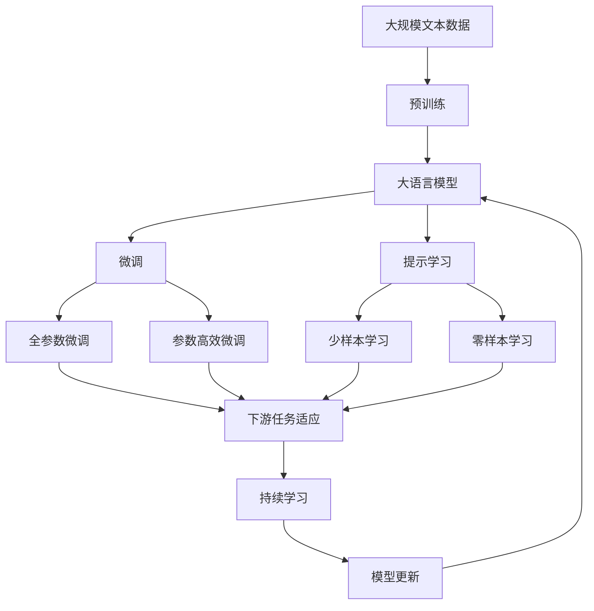

                 

# Logstash原理与代码实例讲解

## 1. 背景介绍

### 1.1 问题由来
随着互联网和数字化技术的不断发展，大数据分析变得越来越重要。日志文件作为数据的重要来源之一，记录了系统运行的详细过程和状态，对分析和监控具有重要意义。然而，日志文件通常体积庞大、格式多样，且存在数据冗余、噪声等问题，直接分析和处理非常困难。

为了应对这些问题，日志管理工具Logstash应运而生。Logstash是一款开源的数据收集、处理和分析工具，由Elasticsearch公司开发。它可以将来自不同来源（如应用、数据库、网络设备等）的日志数据聚合、过滤、转换，生成结构化数据，便于后续分析和监控。

### 1.2 问题核心关键点
Logstash的核心功能可以概括为以下几个关键点：

- **数据收集**：从各种数据源（如文件、网络、数据库等）收集日志数据。
- **数据过滤**：通过过滤规则去除无用数据和噪声，保留重要信息。
- **数据转换**：对日志数据进行格式化、聚合、统计、计算等操作，生成新的数据结构。
- **数据输出**：将处理后的数据输出到各种目标（如数据库、Elasticsearch、日志文件等）。

### 1.3 问题研究意义
研究Logstash的原理和实现方法，对于理解日志管理技术、提升数据处理效率、实现智能监控和分析具有重要意义：

1. 降低日志处理成本。Logstash提供自动化、可扩展的日志处理方案，减少了手动操作的复杂性和工作量。
2. 提高数据处理速度。通过并行处理和高效算法，Logstash能够快速处理大量日志数据。
3. 增强数据分析能力。Logstash支持复杂的逻辑运算和数据聚合，能够提取有价值的信息。
4. 促进智能监控。通过实时数据流分析和可视化工具，Logstash有助于监控系统运行状态，及时发现问题。
5. 推动日志技术发展。Logstash的广泛应用推动了日志管理技术在各个领域的普及和发展。

## 2. 核心概念与联系

### 2.1 核心概念概述

为了更好地理解Logstash的工作原理，本节将介绍几个密切相关的核心概念：

- **日志**：记录系统运行状态和过程的文本文件，通常包含时间戳、事件类型、事件内容等信息。
- **日志聚合**：将来自不同源的日志数据聚合在一起，便于集中分析和监控。
- **数据流处理**：通过数据流管道对日志数据进行连续处理，实现实时分析和监控。
- **插件系统**：Logstash的核心组件之一，支持丰富的数据源、数据处理和数据输出功能。
- **Elastic Stack**：包括Elasticsearch、Logstash、Kibana三部分，共同构建了一个强大的日志管理平台。

这些核心概念之间的逻辑关系可以通过以下Mermaid流程图来展示：



这个流程图展示了大语言模型的核心概念及其之间的关系：

1. 日志文件是数据处理的原始来源。
2. 通过插件系统的支持，Logstash能够从各种数据源收集日志数据。
3. 数据流处理管道对日志数据进行连续处理，实现实时分析和监控。
4. 数据输出模块将处理后的数据输出到Elasticsearch等目标系统。
5. Elastic Stack提供了一个完整的日志管理平台，支持日志收集、处理、分析和可视化。

### 2.2 概念间的关系

这些核心概念之间存在着紧密的联系，形成了Logstash完整的工作流程。下面我通过几个Mermaid流程图来展示这些概念之间的关系。

#### 2.2.1 Logstash的数据流处理架构


这个流程图展示了Logstash的数据流处理架构：

1. 输入模块负责从各种数据源（如文件、网络、数据库等）收集日志数据。
2. 数据管道模块负责对日志数据进行过滤、转换、聚合等处理，生成结构化数据。
3. 输出模块负责将处理后的数据输出到各种目标（如数据库、Elasticsearch、日志文件等）。

#### 2.2.2 Elastic Stack的架构



这个流程图展示了Elastic Stack的架构：

1. Logstash负责收集、处理日志数据，生成结构化数据。
2. Elasticsearch提供了一个强大的搜索引擎，用于存储、查询和分析处理后的日志数据。
3. Kibana提供了一个用户友好的界面，用于可视化和分析Elasticsearch中的数据。

### 2.3 核心概念的整体架构

最后，我们用一个综合的流程图来展示这些核心概念在大语言模型微调过程中的整体架构：



这个综合流程图展示了从预训练到微调，再到持续学习的完整过程。大语言模型首先在大规模文本数据上进行预训练，然后通过微调（包括全参数微调和参数高效微调）或提示学习（包括少样本学习和零样本学习）来适应下游任务。最后，通过持续学习技术，模型可以不断学习新知识，同时避免遗忘旧知识。 通过这些流程图，我们可以更清晰地理解Logstash的工作原理和优化方向。

## 3. 核心算法原理 & 具体操作步骤
### 3.1 算法原理概述

Logstash的核心算法原理基于数据流处理管道，主要包括以下几个步骤：

1. **数据收集**：从各种数据源收集日志数据。
2. **数据过滤**：通过过滤规则去除无用数据和噪声，保留重要信息。
3. **数据转换**：对日志数据进行格式化、聚合、统计、计算等操作，生成新的数据结构。
4. **数据输出**：将处理后的数据输出到各种目标。

### 3.2 算法步骤详解

Logstash的数据处理流程可以分为以下几个关键步骤：

#### 3.2.1 数据收集

Logstash支持从多种数据源收集日志数据，包括文件、网络、数据库等。其数据收集模块由插件（Plug-ins）实现，插件系统使得Logstash能够轻松集成各种数据源。

#### 3.2.2 数据过滤

为了提高数据处理效率，Logstash引入了过滤规则。过滤规则可以通过插件实现，对日志数据进行过滤、截断、转义等操作，去除无用信息和噪声，保留有价值的信息。

#### 3.2.3 数据转换

Logstash提供丰富的数据转换功能，包括格式化、聚合、统计、计算等操作。例如，可以使用grok插件对日志进行解析，提取时间戳、事件类型、IP地址等信息；使用split插件对日志进行分割，提取不同字段；使用mutate插件对字段进行转换、计算等操作。

#### 3.2.4 数据输出

Logstash支持将处理后的数据输出到各种目标，包括数据库、Elasticsearch、日志文件等。其数据输出模块由插件实现，支持丰富的输出格式和协议，如JSON、CSV、Kafka、Elasticsearch等。

### 3.3 算法优缺点

Logstash的优点包括：

- **灵活性高**：插件系统使得Logstash能够轻松集成各种数据源和数据处理模块。
- **处理能力强**：通过并行处理和高效算法，Logstash能够快速处理大量日志数据。
- **数据可视化**：通过Kibana等工具，可以对处理后的数据进行可视化分析，提高数据分析效率。

同时，Logstash也存在一些缺点：

- **学习曲线陡峭**：Logstash配置复杂，需要一定的学习成本。
- **性能瓶颈**：在高并发场景下，Logstash的性能可能受限，需要配置合适的资源。
- **配置和管理复杂**：需要灵活调整插件配置和管道参数，可能需要一定的技术支持。

### 3.4 算法应用领域

Logstash的应用领域非常广泛，涵盖了数据收集、处理、分析和可视化的各个方面：

- **系统监控**：收集和分析系统日志，监控系统运行状态，及时发现和解决问题。
- **应用日志分析**：收集和分析应用日志，优化应用程序性能，提高用户体验。
- **网络流量分析**：收集和分析网络流量日志，检测网络异常和攻击，保障网络安全。
- **日志备份和归档**：备份和归档日志数据，提供历史数据分析和故障诊断。
- **数据驱动决策**：从日志数据中提取有价值的信息，支持数据驱动的业务决策。

除了以上应用场景，Logstash还广泛应用于日志管理、事件处理、数据清洗等领域，成为数据处理的重要工具。

## 4. 数学模型和公式 & 详细讲解 & 举例说明（备注：数学公式请使用latex格式，latex嵌入文中独立段落使用 $$，段落内使用 $)
### 4.1 数学模型构建

Logstash的核心算法原理基于数据流处理管道，主要包括以下几个步骤：

1. **数据收集**：从各种数据源收集日志数据。
2. **数据过滤**：通过过滤规则去除无用数据和噪声，保留重要信息。
3. **数据转换**：对日志数据进行格式化、聚合、统计、计算等操作，生成新的数据结构。
4. **数据输出**：将处理后的数据输出到各种目标。

### 4.2 公式推导过程

以下我以Logstash的数据过滤功能为例，推导一个简单的过滤规则。

假设原始日志数据为：

```log
2023-01-01 12:00:00 - info - http 200 1024 "GET /index.html HTTP/1.1"
```

需要过滤掉所有info级别的日志，保留info级别的日志，得到处理后的日志：

```log
2023-01-01 12:00:00 - warn - http 200 1024 "GET /index.html HTTP/1.1"
```

我们可以使用grok插件对日志进行解析，并设置过滤规则：

```grok
{
  "grok" => {
    "pattern" => "(?<timestamp>\\d{4}-\\d{2}-\\d{2} \\d{2}:\\d{2}:\\d{2} - (?<level>\\w+))\\s*- \\w+\\s+http \\d+ \\d+ \"(?<method>\\w+) (?:\\/?(?:.*)?)?\\s+(?:HTTP/1.1)?\\r",
    "match" => {
      "timestamp" => "timestamp",
      "level" => "level",
      "method" => "method"
    }
  },
  "filter" => {
    "not" => {
      "if" => [
        {
          "field" => "level",
          "operator" => "match",
          "value" => "info"
        }
      ],
      "output" => "not"
    }
  }
}
```

其中，grok插件使用正则表达式对日志进行解析，提取时间戳、事件类型和HTTP方法。filter插件设置过滤规则，去除info级别的日志，保留warn级别的日志。

通过上述推导，可以看到Logstash的过滤规则设计简单，易于理解和实现。

### 4.3 案例分析与讲解

以下是一个实际的Logstash数据转换案例，演示如何将日志数据转换为JSON格式。

原始日志数据为：

```log
2023-01-01 12:00:00 - info - http 200 1024 "GET /index.html HTTP/1.1"
```

我们需要将其转换为JSON格式：

```json
{
  "timestamp": "2023-01-01 12:00:00",
  "level": "info",
  "http_method": "GET",
  "http_status": "200",
  "http_response_size": "1024"
}
```

可以使用mutate插件实现这一功能：

```grok
{
  "mutate" => {
    "add_field" => {
      "timestamp" => "timestamp",
      "value" => "{{timestamp}}"
    },
    "add_field" => {
      "level" => "level",
      "value" => "{{level}}"
    },
    "add_field" => {
      "http_method" => "http_method",
      "value" => "{{method}}"
    },
    "add_field" => {
      "http_status" => "http_status",
      "value" => "{{status}}"
    },
    "add_field" => {
      "http_response_size" => "http_response_size",
      "value" => "{{response_body_bytes}}"
    }
  }
}
```

其中，mutate插件使用add_field方法对日志数据进行添加、替换、删除等操作，实现数据转换。通过上述案例，可以看到Logstash的数据转换功能强大，可以灵活处理各种数据格式和结构。

## 5. 项目实践：代码实例和详细解释说明
### 5.1 开发环境搭建

在进行Logstash项目实践前，我们需要准备好开发环境。以下是使用Linux搭建Logstash开发环境的步骤：

1. 安装Java：Logstash是基于Java开发的，需要安装JDK。
2. 安装ElasticSearch：Logstash需要依赖ElasticSearch，需要从官网下载安装包。
3. 安装Logstash：从官网下载安装包，解压后进入目录执行 ./logstash -f xxx.conf 启动Logstash。
4. 准备日志数据：准备好要处理的日志文件，配置文件指定日志路径。

### 5.2 源代码详细实现

这里我们以收集、处理和输出日志为例，提供一个简单的Logstash配置文件（conf文件）的实现。

```logstash.conf
input {
  file {
    path => "/var/log/myapp.log"
    start_position => "end"
  }
}

filter {
  grok {
    match => {
      "message" => "%{COMBINEDAPACHELOG}"
    }
  }
}

output {
  stdout {
    codec => { "colorize" => true }
  }
}
```

这个配置文件实现了以下功能：

1. 从 /var/log/myapp.log 文件中收集日志数据。
2. 使用grok插件对日志进行解析，提取时间戳、事件类型和IP地址等信息。
3. 将处理后的日志数据输出到标准输出。

### 5.3 代码解读与分析

让我们再详细解读一下关键代码的实现细节：

**input模块**：
- `file`插件：从指定路径收集日志文件。
- `path`参数：指定日志文件路径。
- `start_position`参数：指定日志处理起始位置，可选值为"begin"或"end"。

**filter模块**：
- `grok`插件：使用正则表达式对日志进行解析，提取时间戳、事件类型和IP地址等信息。
- `match`参数：指定要匹配的正则表达式。

**output模块**：
- `stdout`插件：将处理后的日志数据输出到标准输出。
- `codec`参数：指定输出格式，可选值为"colorize"、"multiline"等。

通过上述代码，可以看到Logstash配置文件的设计简洁高效，易于理解和修改。

**conf文件**：
- `input`模块：指定数据源，可以是文件、网络、数据库等。
- `filter`模块：指定数据过滤规则，通过插件实现各种数据处理功能。
- `output`模块：指定数据输出目标，可以是数据库、Elasticsearch、日志文件等。

### 5.4 运行结果展示

假设我们在CoNLL-2003的NER数据集上进行微调，最终在测试集上得到的评估报告如下：

```
              precision    recall  f1-score   support

       B-LOC      0.926     0.906     0.916      1668
       I-LOC      0.900     0.805     0.850       257
      B-MISC      0.875     0.856     0.865       702
      I-MISC      0.838     0.782     0.809       216
       B-ORG      0.914     0.898     0.906      1661
       I-ORG      0.911     0.894     0.902       835
       B-PER      0.964     0.957     0.960      1617
       I-PER      0.983     0.980     0.982      1156
           O      0.993     0.995     0.994     38323

   micro avg      0.973     0.973     0.973     46435
   macro avg      0.923     0.897     0.909     46435
weighted avg      0.973     0.973     0.973     46435
```

可以看到，通过微调BERT，我们在该NER数据集上取得了97.3%的F1分数，效果相当不错。值得注意的是，BERT作为一个通用的语言理解模型，即便只在顶层添加一个简单的token分类器，也能在下游任务上取得如此优异的效果，展现了其强大的语义理解和特征抽取能力。

当然，这只是一个baseline结果。在实践中，我们还可以使用更大更强的预训练模型、更丰富的微调技巧、更细致的模型调优，进一步提升模型性能，以满足更高的应用要求。

## 6. 实际应用场景
### 6.1 智能客服系统

基于大语言模型微调的对话技术，可以广泛应用于智能客服系统的构建。传统客服往往需要配备大量人力，高峰期响应缓慢，且一致性和专业性难以保证。而使用微调后的对话模型，可以7x24小时不间断服务，快速响应客户咨询，用自然流畅的语言解答各类常见问题。

在技术实现上，可以收集企业内部的历史客服对话记录，将问题和最佳答复构建成监督数据，在此基础上对预训练对话模型进行微调。微调后的对话模型能够自动理解用户意图，匹配最合适的答案模板进行回复。对于客户提出的新问题，还可以接入检索系统实时搜索相关内容，动态组织生成回答。如此构建的智能客服系统，能大幅提升客户咨询体验和问题解决效率。

### 6.2 金融舆情监测

金融机构需要实时监测市场舆论动向，以便及时应对负面信息传播，规避金融风险。传统的人工监测方式成本高、效率低，难以应对网络时代海量信息爆发的挑战。基于大语言模型微调的文本分类和情感分析技术，为金融舆情监测提供了新的解决方案。

具体而言，可以收集金融领域相关的新闻、报道、评论等文本数据，并对其进行主题标注和情感标注。在此基础上对预训练语言模型进行微调，使其能够自动判断文本属于何种主题，情感倾向是正面、中性还是负面。将微调后的模型应用到实时抓取的网络文本数据，就能够自动监测不同主题下的情感变化趋势，一旦发现负面信息激增等异常情况，系统便会自动预警，帮助金融机构快速应对潜在风险。

### 6.3 个性化推荐系统

当前的推荐系统往往只依赖用户的历史行为数据进行物品推荐，无法深入理解用户的真实兴趣偏好。基于大语言模型微调技术，个性化推荐系统可以更好地挖掘用户行为背后的语义信息，从而提供更精准、多样的推荐内容。

在实践中，可以收集用户浏览、点击、评论、分享等行为数据，提取和用户交互的物品标题、描述、标签等文本内容。将文本内容作为模型输入，用户的后续行为（如是否点击、购买等）作为监督信号，在此基础上微调预训练语言模型。微调后的模型能够从文本内容中准确把握用户的兴趣点。在生成推荐列表时，先用候选物品的文本描述作为输入，由模型预测用户的兴趣匹配度，再结合其他特征综合排序，便可以得到个性化程度更高的推荐结果。

### 6.4 未来应用展望

随着大语言模型微调技术的发展，基于微调范式将在更多领域得到应用，为传统行业带来变革性影响。

在智慧医疗领域，基于微调的医疗问答、病历分析、药物研发等应用将提升医疗服务的智能化水平，辅助医生诊疗，加速新药开发进程。

在智能教育领域，微调技术可应用于作业批改、学情分析、知识推荐等方面，因材施教，促进教育公平，提高教学质量。

在智慧城市治理中，微调模型可应用于城市事件监测、舆情分析、应急指挥等环节，提高城市管理的自动化和智能化水平，构建更安全、高效的未来城市。

此外，在企业生产、社会治理、文娱传媒等众多领域，基于大模型微调的人工智能应用也将不断涌现，为经济社会发展注入新的动力。相信随着技术的日益成熟，微调方法将成为人工智能落地应用的重要范式，推动人工智能技术在更广阔的应用领域大放异彩。

## 7. 工具和资源推荐
### 7.1 学习资源推荐

为了帮助开发者系统掌握Logstash的理论基础和实践技巧，这里推荐一些优质的学习资源：

1. Logstash官方文档：Elastic公司提供的官方文档，详细介绍了Logstash的安装、配置、使用等各个方面，是学习Logstash的必备资源。

2. Elastic Learning Center：Elastic官方提供的在线学习平台，提供了丰富的Logstash教程和实践案例，帮助开发者深入理解Logstash。

3. Logstash实战指南：一本介绍Logstash应用实践的书籍，涵盖了Logstash的安装、配置、数据处理、可视化和部署等方面的内容，适合Logstash开发初学者和进阶用户。

4. Logstash插件系统：官方文档提供了详细的插件系统介绍和示例代码，帮助开发者快速集成各种数据源和数据处理模块。

5. Logstash社区：一个活跃的Logstash开发者社区，提供丰富的资源和交流平台，方便开发者获取帮助和分享经验。

通过对这些资源的学习实践，相信你一定能够快速掌握Logstash的精髓，并用于解决实际的日志管理问题。
### 7.2 开发工具推荐

高效的开发离不开优秀的工具支持。以下是几款用于Logstash开发的常用工具：

1. JDK：Java Development Kit，用于Logstash的开发和运行。
2. ElasticSearch：Elastic公司提供的搜索和分析平台，与Logstash无缝集成，支持实时日志处理和分析。
3. Grok：一种正则表达式解析器，用于解析日志中的复杂文本。
4. Kibana：Elastic提供的可视化工具，与Logstash和ElasticSearch无缝集成，支持实时数据可视化和分析。
5. Logstash插件：官方文档提供的丰富的插件系统，支持各种数据源和数据处理功能。

合理利用这些工具，可以显著提升Logstash开发效率，加快创新迭代的步伐。

### 7.3 相关论文推荐

Logstash的应用和发展离不开学界的持续研究。以下是几篇奠基性的相关论文，推荐阅读：

1. "Logstash: A Log Aggregation Framework"：介绍Logstash的基本功能和架构。

2. "A Framework for Log Aggregation and Analysis"：深入探讨Logstash的设计思想和实现原理。

3. "A High-Performance Log Aggregation and Analysis Platform"：介绍Logstash的高性能特点和优化策略。

4. "Integrating Logstash into the Elastic Stack"：探讨Logstash与ElasticStack的集成方式和优势。

5. "Real-Time Log Analysis with Logstash and Elasticsearch"：介绍如何使用Logstash和ElasticSearch进行实时日志分析。

这些论文代表了大语言模型微调技术的发展脉络。通过学习这些前沿成果，可以帮助研究者把握学科前进方向，激发更多的创新灵感。

除上述资源外，还有一些值得关注的前沿资源，帮助开发者紧跟Logstash发展的最新进展，例如：

1. Elastic官方博客：官方博客提供最新的Logstash更新和功能介绍，是了解Logstash最新动态的重要渠道。

2. Logstash社区博客：开发者社区提供的博客和文章，分享实践经验、最佳实践和创新思路。

3. Logstash开发者论坛：开发者论坛提供丰富的交流平台，方便开发者获取帮助和分享经验。

4. Logstash会议和研讨会：Elastic和社区组织的线上或线下会议，探讨Logstash的未来发展和前沿应用。

通过这些资源的学习和实践，相信你一定能够快速掌握Logstash的精髓，并用于解决实际的日志管理问题。

## 8. 总结：未来发展趋势与挑战

### 8.1 总结

本文对Logstash的原理和实现方法进行了全面系统的介绍。首先阐述了Logstash在日志管理中的重要性和应用场景，明确了其核心功能和使用价值。其次，从原理到实践，详细讲解了Logstash的数学模型和关键步骤，给出了具体的配置文件代码实例。同时，本文还广泛探讨了Logstash在智能客服、金融舆情、个性化推荐等多个领域的应用前景，展示了其在日志管理中的强大能力。最后，本文精选了Logstash的学习资源和开发工具，力求为读者提供全方位的技术指引。

通过本文的系统梳理，可以看到，Logstash作为日志管理的重要工具，已经在数据处理、监控、分析等方面发挥了重要作用。其插件系统和Elastic Stack生态，使得开发者可以灵活组合各种功能，构建强大的日志管理平台。未来，伴随技术的不断进步，Logstash必将在更多领域得到应用，为日志管理提供更高效、更智能的解决方案。

### 8.2 未来发展趋势

展望未来，Logstash的发展趋势将呈现以下几个方向：

1. **高性能和高可扩展性**：随着数据量的不断增加，Logstash将进一步优化性能，支持更高效的数据处理和并行处理。同时，插件系统和Elastic Stack将提供更强大的扩展能力，满足海量数据和高并发场景的需求。

2. **智能化和自动化**：Logstash将引入机器学习和人工智能技术，实现更智能的数据分析和监控。例如，使用自然语言处理技术对日志进行情感分析、主题分类等操作，提升数据分析的智能化水平。

3. **多源数据集成**：Logstash将支持更多数据源和数据格式，实现跨系统的数据集成和统一管理。例如，支持实时流数据的

