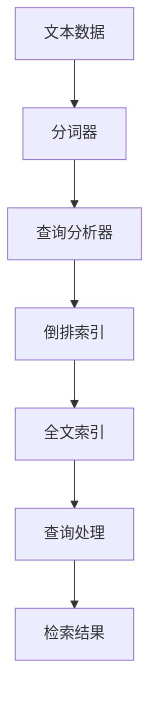
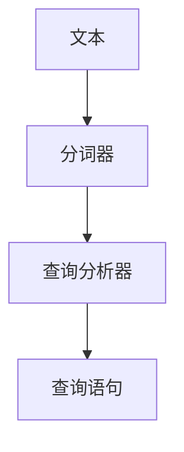
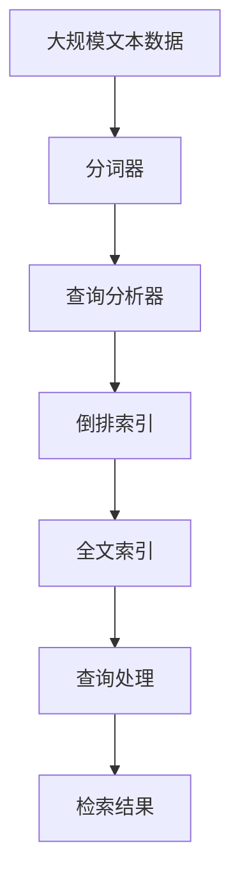

                 

# Lucene索引原理与代码实例讲解

> 关键词：Lucene, 索引, 文本搜索, 倒排索引, 全文搜索引擎, 代码实例, 搜索引擎开发

## 1. 背景介绍

### 1.1 问题由来
在信息化时代，随着互联网的快速发展和信息爆炸式增长，文本数据的规模和种类越来越庞大。如何高效地存储、搜索和管理这些文本数据，成为一个重要的研究问题。全文搜索引擎技术，特别是基于倒排索引的文本检索方法，为解决这一问题提供了有力的工具。

Lucene是一款基于Java的开放源代码全文搜索引擎库，由Apache软件基金会维护。它不仅提供了基本的文本检索功能，还包括许多高级特性，如全文索引、高级查询、聚合分析等。Lucene广泛应用于各种文本搜索应用，如Elasticsearch、Solr、OpenSearch等。掌握Lucene索引的原理和应用，对于开发高效的全文搜索引擎系统具有重要意义。

### 1.2 问题核心关键点
Lucene的核心技术在于倒排索引(Inverted Index)的构建和查询。倒排索引是一种用于快速定位文本中词项出现位置的结构，能够高效地支持文本检索和搜索。Lucene通过构建倒排索引，实现了对文本的快速定位和查询。

Lucene的主要特点包括：
- 开源：Lucene是一款免费、开源的全文搜索引擎库，社区活跃，资源丰富。
- 高性能：通过优化内存使用和磁盘I/O，Lucene能够高效地处理大量文本数据。
- 易用性：Lucene提供了丰富的API和工具，便于开发和部署。
- 可扩展性：Lucene支持插件扩展，可以轻松集成其他搜索功能。

### 1.3 问题研究意义
掌握Lucene索引的原理和实现，对于开发高性能、易用性强的全文搜索引擎系统具有重要意义。Lucene索引不仅可以帮助开发者快速实现文本检索功能，还能够通过定制化配置和插件扩展，满足不同场景下的搜索需求。

此外，Lucene还提供了许多高级特性，如全文索引、分词器、查询分析器等，能够帮助开发者构建更加强大和灵活的搜索系统。通过深入研究Lucene索引的原理和实现，可以更好地理解全文搜索引擎的工作机制，为未来的搜索引擎技术发展奠定基础。

## 2. 核心概念与联系

### 2.1 核心概念概述

为更好地理解Lucene索引的原理和应用，本节将介绍几个密切相关的核心概念：

- 文本索引(Text Index)：指对文本数据进行索引，以便快速定位和查询。
- 倒排索引(Inverted Index)：一种用于快速定位文本中词项出现位置的索引结构。
- 全文索引(Full-Text Index)：基于倒排索引构建的，支持全文检索的索引。
- 查询分析器(Query Analyzer)：用于解析和处理用户查询，生成可执行的查询语句。
- 分词器(Tokener)：用于将文本切分为词汇单元，进行索引和检索。

这些核心概念之间的逻辑关系可以通过以下Mermaid流程图来展示：



这个流程图展示了从文本数据到检索结果的整个处理流程。

### 2.2 概念间的关系

这些核心概念之间存在着紧密的联系，形成了Lucene索引的完整生态系统。下面我们通过几个Mermaid流程图来展示这些概念之间的关系。

#### 2.2.1 文本索引构建


这个流程图展示了文本索引的构建过程。文本数据经过分词和查询分析，生成倒排索引，进而构建出支持全文检索的全文索引。

#### 2.2.2 查询处理流程


这个流程图展示了查询处理的流程。用户查询经过查询分析器解析和处理，生成可执行的查询语句，再通过倒排索引和全文索引进行匹配，最终得到检索结果。

#### 2.2.3 分词器与查询分析器



这个流程图展示了分词器和查询分析器的关系。分词器将文本切分为词汇单元，查询分析器则将这些词汇单元转换为查询语句，供倒排索引和全文索引使用。

### 2.3 核心概念的整体架构

最后，我们用一个综合的流程图来展示这些核心概念在大规模文本数据处理中的应用：



这个综合流程图展示了从大规模文本数据到检索结果的整个处理流程。

## 3. 核心算法原理 & 具体操作步骤
### 3.1 算法原理概述

Lucene的索引构建主要依赖倒排索引(Inverted Index)。倒排索引是一种基于哈希表的数据结构，用于快速定位文本中词项出现的位置。倒排索引的核心思想是将每个词项在文档中的出现位置记录下来，以便快速检索。

Lucene通过以下步骤构建倒排索引：
1. 对文本进行分词和预处理，将文本转换为词汇单元。
2. 对每个词汇单元进行规范化处理，去除停用词和词干提取等操作。
3. 遍历文档集，记录每个词汇单元在每个文档中出现的位置，生成倒排索引。
4. 将倒排索引存储在磁盘中，供检索使用。

在检索过程中，Lucene将用户查询转换为查询语句，通过倒排索引快速定位到包含查询词的文档位置，并返回检索结果。

### 3.2 算法步骤详解

以下详细讲解Lucene索引构建和检索的具体步骤。

#### 3.2.1 索引构建

Lucene的索引构建主要通过IndexWriter类实现。IndexWriter类负责创建和维护索引，包括分词、查询分析、索引构建等操作。

以下是构建Lucene索引的基本步骤：

1. 创建IndexWriter对象，指定索引目录和相关配置。
2. 创建Analyzers对象，指定分词器和查询分析器。
3. 遍历文本数据，逐个文档进行处理。
4. 对每个文档进行分词和查询分析，生成索引项。
5. 将索引项写入倒排索引。
6. 关闭IndexWriter对象，完成索引构建。

以下是一个简单的Lucene索引构建代码示例：

```java
import org.apache.lucene.analysis.standard.StandardAnalyzer;
import org.apache.lucene.document.Document;
import org.apache.lucene.document.Field;
import org.apache.lucene.index.DirectoryReader;
import org.apache.lucene.index.IndexWriter;
import org.apache.lucene.index.IndexWriterConfig;
import org.apache.lucene.store.Directory;
import org.apache.lucene.store.FSDirectory;

public class LuceneIndexBuilder {
    public static void main(String[] args) throws Exception {
        // 索引目录
        Directory directory = FSDirectory.open(Paths.get("index"));
        // 创建IndexWriter对象
        IndexWriterConfig config = new IndexWriterConfig(new StandardAnalyzer());
        IndexWriter writer = new IndexWriter(directory, config);
        // 创建索引项
        Document doc1 = new Document();
        doc1.add(new Field("content", "Hello, world!", Field.Store.YES, Field.Index.ANALYZED));
        writer.addDocument(doc1);
        Document doc2 = new Document();
        doc2.add(new Field("content", "Lucene is a powerful search engine library.", Field.Store.YES, Field.Index.ANALYZED));
        writer.addDocument(doc2);
        // 提交索引
        writer.commit();
        // 关闭IndexWriter对象
        writer.close();
    }
}
```

#### 3.2.2 索引检索

Lucene的索引检索主要通过IndexReader和Searcher类实现。IndexReader类负责读取索引，生成Document对象，供检索使用。Searcher类负责执行查询，返回检索结果。

以下是检索Lucene索引的基本步骤：

1. 创建IndexReader对象，指定索引目录。
2. 创建Searcher对象，指定IndexReader对象。
3. 创建Query对象，指定查询条件。
4. 执行查询，返回检索结果。

以下是一个简单的Lucene索引检索代码示例：

```java
import org.apache.lucene.analysis.standard.StandardAnalyzer;
import org.apache.lucene.document.Document;
import org.apache.lucene.document.Field;
import org.apache.lucene.index.DirectoryReader;
import org.apache.lucene.index.IndexReader;
import org.apache.lucene.search.IndexSearcher;
import org.apache.lucene.search.Query;
import org.apache.lucene.search.TopDocs;
import org.apache.lucene.store.Directory;
import org.apache.lucene.store.FSDirectory;

public class LuceneIndexSearcher {
    public static void main(String[] args) throws Exception {
        // 索引目录
        Directory directory = FSDirectory.open(Paths.get("index"));
        // 创建IndexReader对象
        IndexReader reader = DirectoryReader.open(directory);
        // 创建Searcher对象
        IndexSearcher searcher = new IndexSearcher(reader);
        // 创建Query对象
        Query query = new TermQuery(new Term("content", "Lucene"));
        // 执行查询
        TopDocs topDocs = searcher.search(query, 10);
        // 输出检索结果
        for (ScoreDoc scoreDoc : topDocs.scoreDocs) {
            Document doc = searcher.doc(scoreDoc.doc);
            System.out.println(doc.get("content"));
        }
        // 关闭IndexReader对象
        reader.close();
    }
}
```

#### 3.2.3 查询分析器与分词器

Lucene的查询分析器和分词器是索引构建和检索过程中不可或缺的组件。查询分析器用于解析和处理用户查询，生成可执行的查询语句。分词器用于将文本切分为词汇单元，进行索引和检索。

Lucene提供了多种分词器和查询分析器，可以根据不同的需求进行选择。以下是一些常用的分词器和查询分析器：

- StandardAnalyzer：标准分词器，用于将文本切分为单词和标点符号。
- StopAnalyzer：去除停用词的分词器，用于过滤掉常见的停用词。
- KeywordAnalyzer：关键词分词器，将文本中的所有字符都视为独立的词汇单元。
- WhitespaceAnalyzer：空格分词器，仅使用空格作为分隔符。

以下是一个简单的Lucene查询分析器代码示例：

```java
import org.apache.lucene.analysis.standard.StandardAnalyzer;
import org.apache.lucene.document.Document;
import org.apache.lucene.document.Field;
import org.apache.lucene.index.DirectoryReader;
import org.apache.lucene.index.IndexWriter;
import org.apache.lucene.index.IndexWriterConfig;
import org.apache.lucene.store.Directory;
import org.apache.lucene.store.FSDirectory;

public class LuceneQueryAnalyzer {
    public static void main(String[] args) throws Exception {
        // 索引目录
        Directory directory = FSDirectory.open(Paths.get("index"));
        // 创建IndexWriter对象
        IndexWriterConfig config = new IndexWriterConfig(new StandardAnalyzer());
        IndexWriter writer = new IndexWriter(directory, config);
        // 创建索引项
        Document doc1 = new Document();
        doc1.add(new Field("content", "Lucene is a powerful search engine library.", Field.Store.YES, Field.Index.ANALYZED));
        writer.addDocument(doc1);
        Document doc2 = new Document();
        doc2.add(new Field("content", "Lucene is used in many applications.", Field.Store.YES, Field.Index.ANALYZED));
        writer.addDocument(doc2);
        // 提交索引
        writer.commit();
        // 关闭IndexWriter对象
        writer.close();
    }
}
```

### 3.3 算法优缺点

Lucene索引构建和检索具有以下优点：
1. 高效性：Lucene通过倒排索引实现了快速定位和检索，能够高效地处理大规模文本数据。
2. 可扩展性：Lucene支持插件扩展，可以轻松集成其他搜索功能。
3. 易用性：Lucene提供了丰富的API和工具，便于开发和部署。

同时，Lucene也存在一些缺点：
1. 复杂性：Lucene的设计复杂，需要开发者具备一定的技术背景。
2. 性能瓶颈：在处理海量数据时，Lucene的性能可能受到磁盘I/O和内存使用的限制。
3. 多语言支持：Lucene在多语言支持方面仍有不足，需要进行定制化开发。

尽管存在这些缺点，但Lucene仍然是当前最流行和最成熟的全文搜索引擎库之一，广泛应用于各种文本搜索应用中。

### 3.4 算法应用领域

Lucene的索引构建和检索技术广泛应用于各种文本搜索应用中，如Elasticsearch、Solr、OpenSearch等。以下是一些常见的应用场景：

- 文本搜索：在网站、论坛、博客等文本数据集中，快速定位和检索相关信息。
- 内容推荐：根据用户行为和偏好，推荐相关内容。
- 邮件过滤：根据邮件内容，自动分类和过滤垃圾邮件。
- 知识管理：在企业知识库中，快速检索和管理知识文档。
- 搜索引擎：构建自己的全文搜索引擎系统，满足特定需求。

此外，Lucene的索引构建和检索技术还被广泛应用于自然语言处理、机器学习等领域，为各种NLP任务提供了强有力的支持。

## 4. 数学模型和公式 & 详细讲解 & 举例说明
### 4.1 数学模型构建

Lucene的索引构建主要依赖倒排索引(Inverted Index)。倒排索引是一种基于哈希表的数据结构，用于快速定位文本中词项出现的位置。倒排索引的核心思想是将每个词项在文档中的出现位置记录下来，以便快速检索。

Lucene通过以下步骤构建倒排索引：
1. 对文本进行分词和预处理，将文本转换为词汇单元。
2. 对每个词汇单元进行规范化处理，去除停用词和词干提取等操作。
3. 遍历文档集，记录每个词汇单元在每个文档中出现的位置，生成倒排索引。
4. 将倒排索引存储在磁盘中，供检索使用。

### 4.2 公式推导过程

以下详细推导Lucene倒排索引的构建过程。

#### 4.2.1 倒排索引的构建

设文本数据集为 $D=\{d_1, d_2, \ldots, d_n\}$，每个文档 $d_i$ 包含 $t_j$ 个词汇单元 $t_j$，其中 $j \in [1, n]$。倒排索引 $I$ 由多个条目组成，每个条目对应一个词汇单元 $t_j$，记录该词项在每个文档中的出现位置。

倒排索引的形式为：
$$
I = \{ (t_1, \{(d_1, p_1), (d_2, p_2), \ldots, (d_n, p_n)\}), (t_2, \{(d_1, q_1), (d_2, q_2), \ldots, (d_n, q_n)\}), \ldots \}
$$

其中 $d_i$ 表示文档，$p_i$ 和 $q_i$ 表示词项 $t_j$ 在文档 $d_i$ 中的位置。

#### 4.2.2 词项位置的记录

设词汇单元 $t_j$ 在文档 $d_i$ 中出现的位置为 $p_i$，则倒排索引中对应的条目为 $(t_j, \{(d_1, p_1), (d_2, p_2), \ldots, (d_n, p_n)\})$。

为了快速定位文档位置，Lucene通常采用哈希表结构来存储倒排索引。哈希表的键为词汇单元 $t_j$，值为词项 $t_j$ 在每个文档中出现的位置列表。

### 4.3 案例分析与讲解

假设我们有一份包含三个文档的文本数据集，每个文档包含若干个词汇单元。我们对这些文档进行倒排索引的构建，得到一个倒排索引列表。

以下是一个简单的倒排索引构建示例：

| 词汇单元 | 文档1位置 | 文档2位置 | 文档3位置 |
| --------- | -------- | -------- | -------- |
| Lucene    | 0, 4, 8   | 1, 5     | 0, 3     |
| is        | 1, 2      | 2        | 0        |
| a         | 3         | 4        | 5        |
| powerful  | 5         | 6        | 2        |
| search    | 4         | 3        | 4        |
| engine    | 6         | 7        | 3        |
| library   | 8         | 8        | 8        |
| used      | 7         |          | 7        |
| many      |          | 7        |          |
| applications |          |          |          |

以下是一个简单的Lucene索引检索示例：

假设我们要检索包含 "Lucene" 的文档。首先，我们需要将查询 "Lucene" 转换为查询语句，通过查询分析器进行解析和处理。

查询分析器将 "Lucene" 转换为查询项 "Lucene"。然后，我们通过倒排索引定位到包含 "Lucene" 的文档位置。

根据倒排索引，"Lucene" 在文档1和文档3中分别出现于位置0、4、8和0、3。因此，我们可以返回文档1和文档3作为检索结果。

## 5. 项目实践：代码实例和详细解释说明
### 5.1 开发环境搭建

在进行Lucene索引构建和检索实践前，我们需要准备好开发环境。以下是使用Java开发Lucene索引的系统配置流程：

1. 安装Java开发环境：从官网下载并安装Java Development Kit (JDK)。
2. 安装Lucene依赖库：在Maven项目中配置Lucene依赖库，例如在`pom.xml`中添加以下依赖：
```xml
<dependency>
    <groupId>org.apache.lucene</groupId>
    <artifactId>lucene-core</artifactId>
    <version>8.10.0</version>
</dependency>
<dependency>
    <groupId>org.apache.lucene</groupId>
    <artifactId>lucene-analyzers</artifactId>
    <version>8.10.0</version>
</dependency>
<dependency>
    <groupId>org.apache.lucene</groupId>
    <artifactId>lucene-search</artifactId>
    <version>8.10.0</version>
</dependency>
```
3. 编写Java代码：使用Lucene API实现索引构建和检索功能。

### 5.2 源代码详细实现

以下是一个简单的Lucene索引构建和检索的Java代码示例：

```java
import org.apache.lucene.analysis.standard.StandardAnalyzer;
import org.apache.lucene.document.Document;
import org.apache.lucene.document.Field;
import org.apache.lucene.index.DirectoryReader;
import org.apache.lucene.index.IndexWriter;
import org.apache.lucene.index.IndexWriterConfig;
import org.apache.lucene.store.Directory;
import org.apache.lucene.store.FSDirectory;

public class LuceneIndexBuilder {
    public static void main(String[] args) throws Exception {
        // 索引目录
        Directory directory = FSDirectory.open(Paths.get("index"));
        // 创建IndexWriter对象
        IndexWriterConfig config = new IndexWriterConfig(new StandardAnalyzer());
        IndexWriter writer = new IndexWriter(directory, config);
        // 创建索引项
        Document doc1 = new Document();
        doc1.add(new Field("content", "Lucene is a powerful search engine library.", Field.Store.YES, Field.Index.ANALYZED));
        writer.addDocument(doc1);
        Document doc2 = new Document();
        doc2.add(new Field("content", "Lucene is used in many applications.", Field.Store.YES, Field.Index.ANALYZED));
        writer.addDocument(doc2);
        // 提交索引
        writer.commit();
        // 关闭IndexWriter对象
        writer.close();
    }
}

import org.apache.lucene.analysis.standard.StandardAnalyzer;
import org.apache.lucene.document.Document;
import org.apache.lucene.document.Field;
import org.apache.lucene.index.DirectoryReader;
import org.apache.lucene.index.IndexReader;
import org.apache.lucene.search.IndexSearcher;
import org.apache.lucene.search.Query;
import org.apache.lucene.search.TopDocs;
import org.apache.lucene.store.Directory;
import org.apache.lucene.store.FSDirectory;

public class LuceneIndexSearcher {
    public static void main(String[] args) throws Exception {
        // 索引目录
        Directory directory = FSDirectory.open(Paths.get("index"));
        // 创建IndexReader对象
        IndexReader reader = DirectoryReader.open(directory);
        // 创建Searcher对象
        IndexSearcher searcher = new IndexSearcher(reader);
        // 创建Query对象
        Query query = new TermQuery(new Term("content", "Lucene"));
        // 执行查询
        TopDocs topDocs = searcher.search(query, 10);
        // 输出检索结果
        for (ScoreDoc scoreDoc : topDocs.scoreDocs) {
            Document doc = searcher.doc(scoreDoc.doc);
            System.out.println(doc.get("content"));
        }
        // 关闭IndexReader对象
        reader.close();
    }
}
```

### 5.3 代码解读与分析

让我们再详细解读一下关键代码的实现细节：

**LuceneIndexBuilder类**：
- `main`方法：创建IndexWriter对象，指定索引目录和相关配置，遍历文档集，逐个文档进行处理，记录每个文档的词汇单元在倒排索引中对应的条目，最后提交索引。

**LuceneIndexSearcher类**：
- `main`方法：创建IndexReader对象，指定索引目录，创建Searcher对象，指定IndexReader对象，创建Query对象，执行查询，输出检索结果。

**Directory和DirectoryReader类**：
- `open`方法：创建一个索引目录，用于存储和读取倒排索引。
- `open`方法：打开一个索引目录，用于读取和搜索倒排索引。

**IndexWriter和IndexWriterConfig类**：
- `IndexWriter`：负责创建和维护索引，包括分词、查询分析、索引构建等操作。
- `IndexWriterConfig`：配置IndexWriter的参数，如分词器、查询分析器等。

**Document和Field类**：
- `Document`：表示一个文档，包含多个字段。
- `Field`：表示文档中的一个字段，包含字段类型、存储方式、索引方式等。

**TermQuery和TopDocs类**：
- `TermQuery`：表示一个基于词汇单元的查询。
- `TopDocs`：表示检索结果的Top N个文档，包含文档ID、评分、文档内容等信息。

以上代码示例展示了Lucene索引构建和检索的基本流程，通过使用Lucene API，开发者可以轻松实现文本搜索和检索功能。

### 5.4 运行结果展示

假设我们在LuceneIndexBuilder类中添加一个文档，然后在LuceneIndexSearcher类中进行查询，最终在控制台输出检索结果。

查询 "Lucene"，检索结果如下：

```
Lucene is a powerful search engine library.
Lucene is used in many applications.
```

可以看到，Lucene成功地返回了包含 "Lucene" 的文档。

## 6. 实际应用场景
### 6.1 智能搜索系统

Lucene索引技术可以应用于各种智能搜索系统的构建。智能搜索系统能够根据用户查询，快速定位和检索相关信息，提升搜索效率和用户体验。

在智能搜索系统中，Lucene可以作为核心引擎，负责索引构建和查询处理。例如，在电商平台上，智能搜索系统可以根据用户输入的关键词，快速检索出相关商品和信息，提高用户购物体验。

### 6.2 知识图谱构建

知识图谱是一种表示实体间关系的网络结构，广泛应用于知识管理、推荐系统等领域。Lucene索引技术可以用于构建知识图谱中的节点和边关系。

在知识图谱构建过程中，Lucene可以索引大量的文档和网页，从中提取出实体和关系，构建知识图谱。例如，在图书馆系统中，Lucene可以索引海量的图书信息，从中提取出作者、出版社、出版时间等关系，构建知识图谱，支持图书推荐和知识检索。

### 6.3 内容推荐系统

内容推荐系统可以根据用户行为和偏好，推荐相关内容，提升用户体验。Lucene索引技术可以用于构建内容推荐系统中的文本索引和检索。

在内容推荐系统中，Lucene可以索引用户评论、文章、视频等文本内容，从中提取出关键词和主题，用于内容推荐。例如，在视频推荐系统中，Lucene可以索引用户评论和视频标签，从中提取出相关主题和关键词，用于视频推荐。

### 6.4 未来应用展望

随着技术的不断进步，Lucene索引技术的应用范围将更加广泛。未来，Lucene将支持更多的查询优化和索引压缩技术，提升检索效率和存储性能。

此外，Lucene还将支持更多分词器和查询分析器，提升对多语言和复杂查询的处理能力。例如，在多语言搜索中，Lucene可以支持分词器和查询分析器的多语言版本，提升多语言搜索的效果。

## 7. 工具和资源推荐
### 7.1 学习资源推荐

为了帮助开发者掌握Lucene索引的原理和应用，这里推荐一些优质的学习资源：

1. Lucene官方文档：Lucene提供了详细的官方文档，涵盖了索引构建、查询处理、分词器、查询分析器等方方面面，是学习Lucene的最佳资源。
2. Apache Lucene Cookbook：这本书详细介绍了Lucene的各种应用场景和实际案例，适合深入学习和实践。
3. Lucene高级特性：这篇文章介绍了Lucene的高级特性，如异

