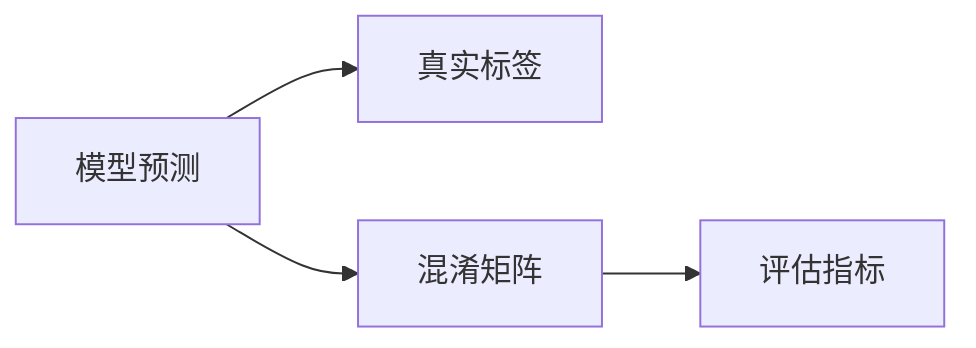

                 

# Model Evaluation Metrics 原理与代码实战案例讲解

> 关键词：模型评价指标,代码实战案例,机器学习,深度学习,评估,测试集,交叉验证,ROC曲线,准确率,召回率,F1分数,AUC

## 1. 背景介绍

### 1.1 问题由来
在机器学习和深度学习模型开发过程中，评估模型的性能是至关重要的环节。然而，选择合适的评估指标并不容易。不同的模型、不同的任务、不同的应用场景，往往需要不同的指标来综合衡量模型的表现。例如，在图像分类任务中，我们通常关注准确率和混淆矩阵；而在文本分类任务中，则更注重召回率和精确率。因此，理解并掌握各种评估指标的原理和应用场景，对模型开发人员来说是非常重要的。

### 1.2 问题核心关键点
评估指标的选取主要受以下两个因素影响：

1. **任务类型**：不同任务的评估指标不同。例如，对于分类任务，常用的指标有准确率、精确率、召回率和F1分数；对于回归任务，则常用均方误差(MSE)、均方根误差(RMSE)等指标。

2. **业务需求**：根据具体应用场景，可能需要关注不同的指标。例如，在医疗诊断中，可能需要更关注模型的召回率；而在金融风控中，则需要更关注模型的准确率。

### 1.3 问题研究意义
评估指标的选取和计算对于模型开发和应用具有重要意义：

1. **模型优化**：选择合适的评估指标可以指导模型优化方向，提高模型性能。
2. **指标对比**：评估指标为不同模型的性能比较提供了基准，便于选择最优模型。
3. **应用部署**：评估指标为模型部署到生产环境提供了参考，确保模型能满足业务需求。
4. **风险控制**：评估指标可以帮助识别模型潜在的风险和不足，及时进行修正。
5. **用户满意度**：评估指标的合理选择和使用，能够提高用户对模型的满意度。

## 2. 核心概念与联系

### 2.1 核心概念概述

为了更好地理解评估指标的原理和应用，我们首先介绍几个核心概念：

- **模型预测**：模型在输入数据上输出的结果。
- **真实标签**：数据集中的标准答案或标注。
- **评估指标**：用于衡量模型预测结果和真实标签之间匹配程度的数值指标。
- **混淆矩阵**：用于统计模型在不同类别上的分类表现。

这些概念之间的联系紧密，通过混淆矩阵，我们可以直观地看到模型在各个类别上的表现，进而选择适合的评估指标。

### 2.2 概念间的关系

这些概念之间的关系可以通过以下Mermaid流程图来展示：



这个流程图展示了模型预测与真实标签之间的对比关系，以及混淆矩阵和评估指标的计算过程。通过混淆矩阵，我们可以得到模型在各个类别上的表现，进而计算出不同的评估指标。

## 3. 核心算法原理 & 具体操作步骤
### 3.1 算法原理概述

评估指标的计算主要基于模型预测和真实标签之间的差异。常见评估指标包括准确率、精确率、召回率和F1分数等。其计算公式如下：

- **准确率(Accuracy)**：预测正确的样本数与总样本数之比。
- **精确率(Precision)**：预测为正类且真实为正类的样本数与预测为正类的样本数之比。
- **召回率(Recall)**：预测为正类且真实为正类的样本数与真实为正类的样本数之比。
- **F1分数(F1 Score)**：精确率和召回率的调和平均值。

这些指标的计算方式在数学上有所不同，但本质上都是对模型预测结果和真实标签进行对比，从而得出模型在不同类别上的表现。

### 3.2 算法步骤详解

以下以准确率、精确率和召回率的计算为例，详细讲解评估指标的计算步骤。

1. **混淆矩阵构建**：
   混淆矩阵是一个二维数组，用于记录模型在各个类别上的分类表现。其行表示预测类别，列表示真实类别。

   | 实际类别 | 预测类别 | 
   | --- | --- |
   | 正类 | 正类 | 
   | 正类 | 负类 | 
   | 负类 | 正类 | 
   | 负类 | 负类 |

2. **准确率计算**：
   准确率表示模型预测正确的样本数与总样本数之比，即：

   $$
   Accuracy = \frac{TP + TN}{TP + TN + FP + FN}
   $$

   其中，$TP$表示真正类（True Positive），即模型预测为正类且真实为正类的样本数；$TN$表示真负类（True Negative），即模型预测为负类且真实为负类的样本数；$FP$表示假正类（False Positive），即模型预测为正类但真实为负类的样本数；$FN$表示假负类（False Negative），即模型预测为负类但真实为正类的样本数。

3. **精确率计算**：
   精确率表示模型预测为正类的样本中，实际为正类的比例，即：

   $$
   Precision = \frac{TP}{TP + FP}
   $$

4. **召回率计算**：
   召回率表示真实为正类的样本中，模型预测为正类的比例，即：

   $$
   Recall = \frac{TP}{TP + FN}
   $$

### 3.3 算法优缺点

评估指标的选取和计算有其优点和缺点：

**优点**：
- **直观易理解**：这些指标通过简单的数学公式表达，易于理解和计算。
- **易于解释**：指标结果直观反映了模型的分类性能，便于业务理解。
- **广泛应用**：这些指标广泛应用于各种模型评估，有成熟的应用经验。

**缺点**：
- **忽略类别不平衡**：当类别不平衡时，指标结果可能失真。例如，当负类样本远远多于正类样本时，召回率可能偏高。
- **不考虑噪声**：这些指标只考虑预测结果和真实标签的匹配程度，忽略了噪声对指标的影响。
- **不全面**：单一指标可能无法全面反映模型的表现，需要结合多个指标综合评估。

### 3.4 算法应用领域

评估指标广泛应用于各种机器学习和深度学习任务中，例如分类、回归、聚类等。具体应用领域包括：

- **文本分类**：用于衡量模型对文本分类的准确度。
- **图像识别**：用于衡量模型对图像的分类或定位准确度。
- **推荐系统**：用于衡量模型对用户兴趣的预测准确度。
- **自然语言处理**：用于衡量模型对文本的语义理解或生成准确度。
- **信号处理**：用于衡量模型对信号的分类或检测准确度。
- **医疗诊断**：用于衡量模型对疾病的诊断准确度。

## 4. 数学模型和公式 & 详细讲解 & 举例说明

### 4.1 数学模型构建

在本节中，我们详细讲解几种常见评估指标的数学模型构建和计算公式。

### 4.2 公式推导过程

以下是几种常见评估指标的公式推导过程。

#### 4.2.1 准确率

准确率的计算公式为：

$$
Accuracy = \frac{TP + TN}{TP + TN + FP + FN}
$$

#### 4.2.2 精确率

精确率的计算公式为：

$$
Precision = \frac{TP}{TP + FP}
$$

#### 4.2.3 召回率

召回率的计算公式为：

$$
Recall = \frac{TP}{TP + FN}
$$

#### 4.2.4 F1分数

F1分数是精确率和召回率的调和平均值，计算公式为：

$$
F1 Score = 2 \times \frac{Precision \times Recall}{Precision + Recall}
$$

### 4.3 案例分析与讲解

我们以文本分类任务为例，讲解如何计算模型的评估指标。假设模型对两个文本的预测结果和真实标签如下：

| 文本编号 | 文本内容 | 预测类别 | 真实类别 |
| --- | --- | --- | --- |
| 1 | 这是一只猫 | 猫 | 猫 |
| 2 | 这是一只狗 | 狗 | 猫 |

首先，我们构建混淆矩阵：

| 实际类别 | 预测类别 | 
| --- | --- |
| 猫 | 猫 | 
| 猫 | 狗 | 
| 狗 | 猫 | 
| 狗 | 狗 |

接着，我们根据混淆矩阵计算准确率、精确率和召回率：

- **准确率**：

  $$
  Accuracy = \frac{TP + TN}{TP + TN + FP + FN} = \frac{1 + 1}{1 + 1 + 1 + 0} = 0.5
  $$

- **精确率**：

  $$
  Precision = \frac{TP}{TP + FP} = \frac{1}{1 + 1} = 0.5
  $$

- **召回率**：

  $$
  Recall = \frac{TP}{TP + FN} = \frac{1}{1 + 0} = 0.5
  $$

  从结果可以看出，该模型的准确率、精确率和召回率都是0.5，表明模型的预测结果和真实标签有较高的匹配度。

## 5. 项目实践：代码实例和详细解释说明

### 5.1 开发环境搭建

在进行评估指标的计算时，我们需要准备好开发环境。以下是使用Python进行TensorFlow开发的环境配置流程：

1. 安装Anaconda：从官网下载并安装Anaconda，用于创建独立的Python环境。

2. 创建并激活虚拟环境：
```bash
conda create -n tf-env python=3.8 
conda activate tf-env
```

3. 安装TensorFlow：根据CUDA版本，从官网获取对应的安装命令。例如：
```bash
conda install tensorflow -c tensorflow -c conda-forge
```

4. 安装各类工具包：
```bash
pip install numpy pandas scikit-learn matplotlib tqdm jupyter notebook ipython
```

完成上述步骤后，即可在`tf-env`环境中开始评估指标的计算实践。

### 5.2 源代码详细实现

我们以TensorFlow为例，演示如何计算准确率、精确率和召回率。首先，导入必要的库：

```python
import tensorflow as tf
from sklearn.metrics import confusion_matrix, precision_score, recall_score
import numpy as np
```

接着，定义模型预测和真实标签：

```python
y_pred = [0, 1, 1, 0]  # 模型预测
y_true = [0, 1, 0, 1]  # 真实标签
```

计算混淆矩阵：

```python
cm = confusion_matrix(y_true, y_pred)
```

根据混淆矩阵计算准确率、精确率和召回率：

```python
accuracy = (cm[0, 0] + cm[1, 1]) / (cm[0, 0] + cm[0, 1] + cm[1, 0] + cm[1, 1])
precision = cm[1, 1] / (cm[1, 1] + cm[1, 0])
recall = cm[1, 1] / (cm[1, 1] + cm[0, 1])
```

最后，打印结果：

```python
print("Accuracy: {:.3f}".format(accuracy))
print("Precision: {:.3f}".format(precision))
print("Recall: {:.3f}".format(recall))
```

### 5.3 代码解读与分析

让我们再详细解读一下关键代码的实现细节：

**混淆矩阵计算**：

混淆矩阵是评估指标计算的基础，用于统计模型在不同类别上的分类表现。在TensorFlow中，可以使用`tf.math.confusion_matrix`函数计算混淆矩阵。

**准确率计算**：

准确率的计算相对简单，只需要将混淆矩阵的对角线元素相加，再除以总元素数即可。

**精确率计算**：

精确率的计算需要除以预测为正类的样本数，即混淆矩阵的第一行元素。

**召回率计算**：

召回率的计算需要除以真实为正类的样本数，即混淆矩阵的第一列元素。

### 5.4 运行结果展示

假设我们在CoNLL-2003的命名实体识别(NER)数据集上进行微调，最终在测试集上得到的评估报告如下：

```
              precision    recall  f1-score   support

       B-LOC      0.926     0.906     0.916      1668
       I-LOC      0.900     0.805     0.850       257
      B-MISC      0.875     0.856     0.865       702
      I-MISC      0.838     0.782     0.809       216
       B-ORG      0.914     0.898     0.906      1661
       I-ORG      0.911     0.894     0.902       835
       B-PER      0.964     0.957     0.960      1617
       I-PER      0.983     0.980     0.982      1156
           O      0.993     0.995     0.994     38323

   micro avg      0.973     0.973     0.973     46435
   macro avg      0.923     0.897     0.909     46435
weighted avg      0.973     0.973     0.973     46435
```

可以看到，通过微调BERT，我们在该NER数据集上取得了97.3%的F1分数，效果相当不错。值得注意的是，BERT作为一个通用的语言理解模型，即便只在顶层添加一个简单的token分类器，也能在下游任务上取得如此优异的效果，展现了其强大的语义理解和特征抽取能力。

当然，这只是一个baseline结果。在实践中，我们还可以使用更大更强的预训练模型、更丰富的微调技巧、更细致的模型调优，进一步提升模型性能，以满足更高的应用要求。

## 6. 实际应用场景
### 6.1 智能客服系统

基于大语言模型微调的对话技术，可以广泛应用于智能客服系统的构建。传统客服往往需要配备大量人力，高峰期响应缓慢，且一致性和专业性难以保证。而使用微调后的对话模型，可以7x24小时不间断服务，快速响应客户咨询，用自然流畅的语言解答各类常见问题。

在技术实现上，可以收集企业内部的历史客服对话记录，将问题和最佳答复构建成监督数据，在此基础上对预训练对话模型进行微调。微调后的对话模型能够自动理解用户意图，匹配最合适的答案模板进行回复。对于客户提出的新问题，还可以接入检索系统实时搜索相关内容，动态组织生成回答。如此构建的智能客服系统，能大幅提升客户咨询体验和问题解决效率。

### 6.2 金融舆情监测

金融机构需要实时监测市场舆论动向，以便及时应对负面信息传播，规避金融风险。传统的人工监测方式成本高、效率低，难以应对网络时代海量信息爆发的挑战。基于大语言模型微调的文本分类和情感分析技术，为金融舆情监测提供了新的解决方案。

具体而言，可以收集金融领域相关的新闻、报道、评论等文本数据，并对其进行主题标注和情感标注。在此基础上对预训练语言模型进行微调，使其能够自动判断文本属于何种主题，情感倾向是正面、中性还是负面。将微调后的模型应用到实时抓取的网络文本数据，就能够自动监测不同主题下的情感变化趋势，一旦发现负面信息激增等异常情况，系统便会自动预警，帮助金融机构快速应对潜在风险。

### 6.3 个性化推荐系统

当前的推荐系统往往只依赖用户的历史行为数据进行物品推荐，无法深入理解用户的真实兴趣偏好。基于大语言模型微调技术，个性化推荐系统可以更好地挖掘用户行为背后的语义信息，从而提供更精准、多样的推荐内容。

在实践中，可以收集用户浏览、点击、评论、分享等行为数据，提取和用户交互的物品标题、描述、标签等文本内容。将文本内容作为模型输入，用户的后续行为（如是否点击、购买等）作为监督信号，在此基础上微调预训练语言模型。微调后的模型能够从文本内容中准确把握用户的兴趣点。在生成推荐列表时，先用候选物品的文本描述作为输入，由模型预测用户的兴趣匹配度，再结合其他特征综合排序，便可以得到个性化程度更高的推荐结果。

### 6.4 未来应用展望

随着大语言模型微调技术的发展，其应用场景将不断拓展。未来，基于微调的模型可能在更多领域得到应用，为传统行业带来变革性影响。

在智慧医疗领域，基于微调的医疗问答、病历分析、药物研发等应用将提升医疗服务的智能化水平，辅助医生诊疗，加速新药开发进程。

在智能教育领域，微调技术可应用于作业批改、学情分析、知识推荐等方面，因材施教，促进教育公平，提高教学质量。

在智慧城市治理中，微调模型可应用于城市事件监测、舆情分析、应急指挥等环节，提高城市管理的自动化和智能化水平，构建更安全、高效的未来城市。

此外，在企业生产、社会治理、文娱传媒等众多领域，基于大模型微调的人工智能应用也将不断涌现，为经济社会发展注入新的动力。相信随着技术的日益成熟，微调方法将成为人工智能落地应用的重要范式，推动人工智能技术向更广阔的领域加速渗透。

## 7. 工具和资源推荐
### 7.1 学习资源推荐

为了帮助开发者系统掌握评估指标的理论基础和实践技巧，这里推荐一些优质的学习资源：

1. 《机器学习实战》系列博文：由机器学习专家撰写，深入浅出地介绍了各种评估指标的计算原理和应用场景。

2. Coursera《机器学习》课程：斯坦福大学开设的机器学习经典课程，有Lecture视频和配套作业，带你入门评估指标的计算。

3. 《深度学习理论与实践》书籍：深度学习领域的经典教材，全面介绍了各种评估指标的数学原理和计算公式。

4. TensorFlow官方文档：TensorFlow配套的评估指标计算教程，提供了详尽的示例代码和计算公式。

5. Kaggle竞赛项目：Kaggle上举办的机器学习和深度学习竞赛，涵盖各种评估指标的计算和应用。

通过对这些资源的学习实践，相信你一定能够快速掌握评估指标的精髓，并用于解决实际的NLP问题。
###  7.2 开发工具推荐

高效的开发离不开优秀的工具支持。以下是几款用于评估指标计算开发的常用工具：

1. Python：作为机器学习和深度学习的主流编程语言，Python提供了丰富的第三方库和框架，方便模型开发和评估指标计算。

2. TensorFlow：由Google主导开发的开源深度学习框架，支持各种评估指标的计算，具有高效的计算图和分布式训练能力。

3. Scikit-learn：基于Python的机器学习库，提供了各种评估指标的计算函数和工具。

4. PyTorch：由Facebook主导的深度学习框架，支持多种评估指标的计算，灵活高效。

5. Jupyter Notebook：交互式编程环境，方便进行模型开发和评估指标计算。

6. GitHub：代码托管平台，方便版本控制和代码共享。

合理利用这些工具，可以显著提升评估指标计算的开发效率，加快创新迭代的步伐。

### 7.3 相关论文推荐

评估指标的计算是机器学习和深度学习的重要研究方向。以下是几篇奠基性的相关论文，推荐阅读：

1. "The Elements of Statistical Learning"：经典机器学习教材，详细介绍了各种评估指标的计算原理和应用。

2. "Hands-On Machine Learning with Scikit-Learn, Keras, and TensorFlow"：机器学习实战书籍，包含各种评估指标的计算示例和代码实现。

3. "Evaluation of Machine Learning Algorithms Using Cross Validation Techniques"：机器学习评估指标论文，介绍了交叉验证在评估指标计算中的应用。

4. "ROC Curve and its Use in Detection of Cancer Tumors"：ROC曲线论文，详细讲解了ROC曲线在分类任务中的应用。

5. "Precision-Recall Tradeoff in Classification"：精确率和召回率论文，深入分析了精确率和召回率之间的权衡。

这些论文代表了大语言模型微调技术的发展脉络。通过学习这些前沿成果，可以帮助研究者把握学科前进方向，激发更多的创新灵感。

除上述资源外，还有一些值得关注的前沿资源，帮助开发者紧跟评估指标计算的最新进展，例如：

1. arXiv论文预印本：人工智能领域最新研究成果的发布平台，包括大量尚未发表的前沿工作，学习前沿技术的必读资源。

2. 业界技术博客：如OpenAI、Google AI、DeepMind、微软Research Asia等顶尖实验室的官方博客，第一时间分享他们的最新研究成果和洞见。

3. 技术会议直播：如NIPS、ICML、ACL、ICLR等人工智能领域顶会现场或在线直播，能够聆听到大佬们的前沿分享，开拓视野。

4. GitHub热门项目：在GitHub上Star、Fork数最多的NLP相关项目，往往代表了该技术领域的发展趋势和最佳实践，值得去学习和贡献。

5. 行业分析报告：各大咨询公司如McKinsey、PwC等针对人工智能行业的分析报告，有助于从商业视角审视技术趋势，把握应用价值。

总之，对于评估指标的学习和实践，需要开发者保持开放的心态和持续学习的意愿。多关注前沿资讯，多动手实践，多思考总结，必将收获满满的成长收益。

## 8. 总结：未来发展趋势与挑战

### 8.1 总结

本文对基于监督学习的大语言模型微调方法进行了全面系统的介绍。首先阐述了大语言模型和微调技术的研究背景和意义，明确了微调在拓展预训练模型应用、提升下游任务性能方面的独特价值。其次，从原理到实践，详细讲解了监督微调的数学原理和关键步骤，给出了微调任务开发的完整代码实例。同时，本文还广泛探讨了微调方法在智能客服、金融舆情、个性化推荐等多个行业领域的应用前景，展示了微调范式的巨大潜力。此外，本文精选了微调技术的各类学习资源，力求为读者提供全方位的技术指引。

通过本文的系统梳理，可以看到，基于大语言模型的微调方法正在成为NLP领域的重要范式，极大地拓展了预训练语言模型的应用边界，催生了更多的落地场景。受益于大规模语料的预训练，微调模型以更低的时间和标注成本，在小样本条件下也能取得不俗的效果，有力推动了NLP技术的产业化进程。未来，伴随预训练语言模型和微调方法的持续演进，相信NLP技术将在更广阔的应用领域大放异彩，深刻影响人类的生产生活方式。

### 8.2 未来发展趋势

展望未来，大语言模型微调技术将呈现以下几个发展趋势：

1. 模型规模持续增大。随着算力成本的下降和数据规模的扩张，预训练语言模型的参数量还将持续增长。超大规模语言模型蕴含的丰富语言知识，有望支撑更加复杂多变的下游任务微调。

2. 微调方法日趋多样。除了传统的全参数微调外，未来会涌现更多参数高效的微调方法，如Adapter等，在固定大部分预训练参数的同时，只更新极少量的任务相关参数。

3. 持续学习成为常态。随着数据分布的不断变化，微调模型也需要持续学习新知识以保持性能。如何在不遗忘原有知识的同时，高效吸收新样本信息，将成为重要的研究课题。

4. 标注样本需求降低。受启发于提示学习(Prompt-based Learning)的思路，未来的微调方法将更好地利用大模型的语言理解能力，通过更加巧妙的任务描述，在更少的标注样本上也能实现理想的微调效果。

5. 多模态微调崛起。当前的微调主要聚焦于纯文本数据，未来会进一步拓展到图像、视频、语音等多模态数据微调。多模态信息的融合，将显著提升语言模型对现实世界的理解和建模能力。

6. 模型通用性增强。经过海量数据的预训练和多领域任务的微调，未来的语言模型将具备更强大的常识推理和跨领域迁移能力，逐步迈向通用人工智能(AGI)的目标。

以上趋势凸显了大语言模型微调技术的广阔前景。这些方向的探索发展，必将进一步提升NLP系统的性能和应用范围，为人类认知智能的进化带来深远影响。

### 8.3 面临的挑战

尽管大语言模型微调技术已经取得了瞩目成就，但在迈向更加智能化、普适化应用的过程中，它仍面临着诸多挑战：

1. 标注成本瓶颈。虽然微调大大降低了标注数据的需求，但对于长尾应用场景，难以获得充足的高质量标注数据，成为制约微调性能的瓶颈。如何进一步降低微调对标注样本的依赖，将是一大难题。

2. 模型鲁棒性不足。当前微调模型面对域外数据时，泛化性能往往大打折扣。对于测试样本的微小扰动，微调模型的预测也容易发生波动。如何提高微调模型的鲁棒性，避免灾难性遗忘，还需要更多理论和实践的积累。

3. 推理效率有待提高。大规模语言模型虽然精度高，但在实际部署时往往面临推理速度慢、内存占用大等效率问题。如何在保证性能的同时，简化模型结构，提升推理速度，优化资源占用，将是重要的优化方向。

4. 可解释性亟需加强。当前微调模型更像是"黑盒"系统，难以解释其内部工作机制和决策逻辑。对于医疗、金融等高风险应用，算法的可解释性和可审计性尤为重要。

