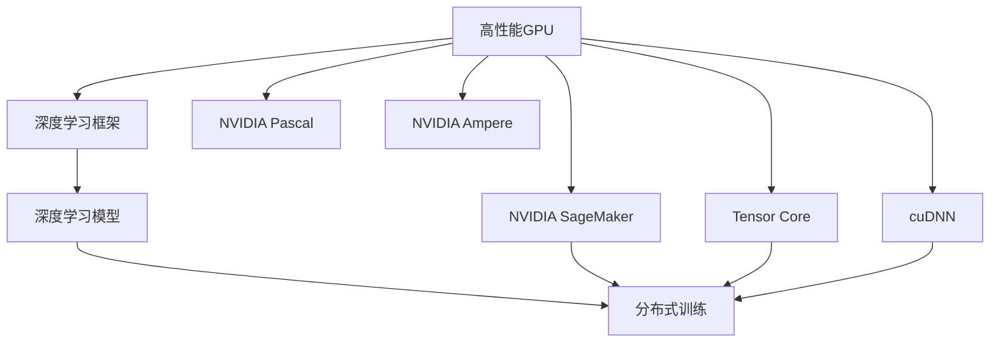
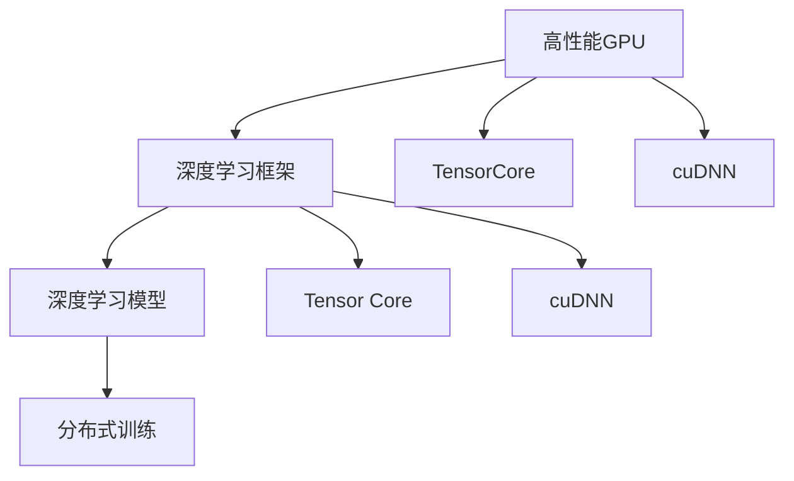
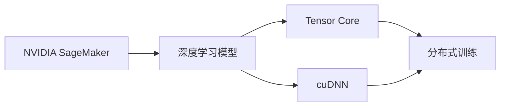
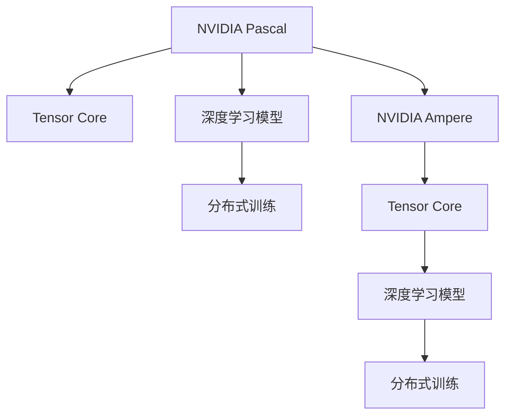
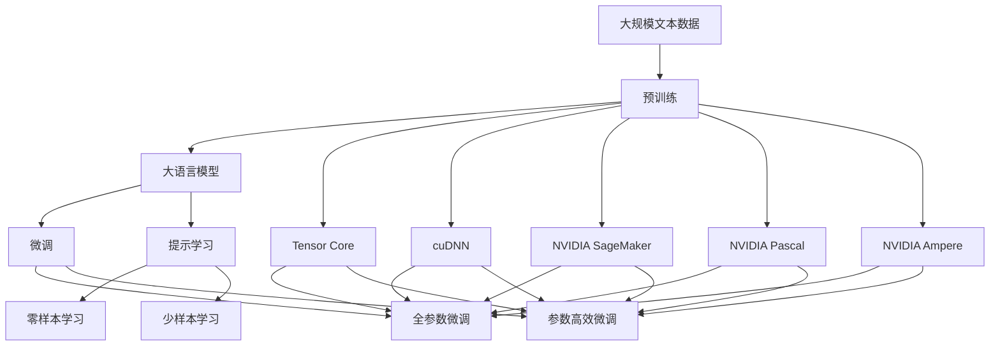

                 

## 1. 背景介绍

### 1.1 问题由来

在过去的几年中，人工智能（AI）和深度学习（DL）的发展得益于强大的算力支持。随着模型规模和复杂度的不断增大，对算力资源的需求也随之提升。为了满足这一需求，各大硬件供应商和云服务提供商纷纷推出高性能的计算平台和解决方案，其中NVIDIA无疑是其中的佼佼者。

NVIDIA通过其领先的图形处理单元（GPU）和应用特定的集成电路（ASIC），为深度学习模型的训练和推理提供了强大的算力支持。其高性能的计算平台如NVIDIA DGX系统，已经在包括机器学习、计算机视觉、自然语言处理等众多领域中发挥了重要作用。

### 1.2 问题核心关键点

NVIDIA的算力支持主要通过以下几个方面来实现：

- **高性能GPU和ASIC**：NVIDIA的GPU和ASIC具备极高的并行处理能力，能够显著提高深度学习模型的训练速度和推理效率。
- **软件生态系统**：包括CUDA、cuDNN等工具，为开发者提供了丰富的API和库，便于其在NVIDIA硬件上进行高效开发。
- **云计算平台**：如AWS上的NVIDIA SageMaker实例、Azure上的NVIDIA GPU云实例等，提供便捷的算力租赁服务，支持大规模深度学习任务的运行。
- **科研与合作**：通过与学术机构和工业界的合作，推动深度学习技术的进步，并推动AI应用场景的拓展。

这些关键点共同构成了NVIDIA算力支持的强大架构，使其成为深度学习研究者和工业界的重要合作伙伴。

## 2. 核心概念与联系

### 2.1 核心概念概述

为更好地理解NVIDIA的算力支持，本节将介绍几个密切相关的核心概念：

- **高性能GPU**：NVIDIA的GPU如Tesla系列、RTX系列等，具备极高的浮点运算能力（FLOPS）和并行处理能力，是深度学习计算的核心。
- **深度学习框架**：如TensorFlow、PyTorch、MXNet等，能够与NVIDIA的GPU和ASIC无缝集成，提供高效的计算图优化和自动微分功能。
- **分布式训练**：利用多台NVIDIA GPU和ASIC进行并行计算，以加速深度学习模型的训练。
- **深度学习模型**：包括卷积神经网络（CNN）、循环神经网络（RNN）、变分自编码器（VAE）等，依赖于强大的算力支持来实现高效的训练和推理。

- **Tensor Core**：NVIDIA GPU中专门用于矩阵乘法和张量操作的硬件单元，可以显著提升深度学习模型的性能。
- **cuDNN**：NVIDIA提供的深度学习加速库，包含大量优化过的神经网络算法，能够大幅提升模型的计算效率。
- **NVIDIA SageMaker**：AWS上的云服务平台，提供易于使用的GPU实例，支持大规模深度学习任务。

- **NVIDIA Pascal**：NVIDIA于2016年推出的架构平台，支持Tensor Core技术，提升了GPU的深度学习计算能力。
- **NVIDIA Ampere**：NVIDIA于2020年推出的最新架构平台，进一步提升了GPU的深度学习计算能力，并引入了TF32等新特性。

这些核心概念之间的逻辑关系可以通过以下Mermaid流程图来展示：



这个流程图展示了大语言模型微调过程中各个核心概念的关系：

1. 高性能GPU为深度学习模型提供了强大的算力支持。
2. 深度学习框架和模型在GPU上运行，利用Tensor Core和cuDNN等加速库进行高效的计算。
3. NVIDIA SageMaker提供了便捷的云服务平台，支持大规模深度学习任务。
4. NVIDIA Pascal和Ampere架构不断提升GPU的深度学习计算能力，推动深度学习技术的发展。

### 2.2 概念间的关系

这些核心概念之间存在着紧密的联系，形成了NVIDIA算力支持的完整生态系统。下面我们通过几个Mermaid流程图来展示这些概念之间的关系。

#### 2.2.1 高性能GPU与深度学习框架的配合



这个流程图展示了高性能GPU与深度学习框架的配合过程。深度学习框架能够利用GPU的Tensor Core和cuDNN等加速库进行高效的计算，而高性能GPU则为深度学习模型的分布式训练提供了强大的算力支持。

#### 2.2.2 NVIDIA SageMaker的计算平台支持



这个流程图展示了NVIDIA SageMaker作为计算平台如何支持深度学习模型的分布式训练。NVIDIA SageMaker提供的GPU实例可以方便地进行大规模深度学习任务，利用Tensor Core和cuDNN等加速库进行高效的计算。

#### 2.2.3 NVIDIA Pascal与Ampere架构的演变



这个流程图展示了NVIDIA Pascal与Ampere架构的演变过程。Pascal架构引入了Tensor Core技术，提升了GPU的深度学习计算能力，而Ampere架构在此基础上进一步优化，引入了TF32等新特性，进一步提升了深度学习计算能力。

### 2.3 核心概念的整体架构

最后，我们用一个综合的流程图来展示这些核心概念在大语言模型微调过程中的整体架构：



这个综合流程图展示了从预训练到微调，再到提示学习的完整过程。大语言模型首先在大规模文本数据上进行预训练，然后通过微调或提示学习来适应下游任务。NVIDIA的GPU和ASIC为这一过程提供了强大的算力支持，Tensor Core和cuDNN等加速库进一步提升了深度学习的计算效率。

## 3. 核心算法原理 & 具体操作步骤

### 3.1 算法原理概述

NVIDIA的算力支持主要基于其高性能GPU和ASIC，通过优化深度学习计算图和算法，提供强大的算力支持。具体来说，NVIDIA通过以下技术实现其算力支持：

1. **Tensor Core**：NVIDIA GPU中的Tensor Core单元专门用于矩阵乘法和张量操作，能够大幅提升深度学习模型的计算效率。
2. **cuDNN**：NVIDIA提供的深度学习加速库，包含大量优化过的神经网络算法，能够大幅提升模型的计算效率。
3. **分布式训练**：利用多台NVIDIA GPU和ASIC进行并行计算，以加速深度学习模型的训练。

这些技术共同构成了NVIDIA算力支持的强大基础，使得其在深度学习计算领域处于领先地位。

### 3.2 算法步骤详解

NVIDIA的算力支持通常包括以下几个关键步骤：

**Step 1: 选择硬件平台**
- 根据任务需求选择合适的NVIDIA GPU或ASIC。如需要高效计算，可以选择带有Tensor Core的GPU；如需大规模分布式训练，可以选择多GPU或ASIC的集群。

**Step 2: 安装与配置**
- 安装NVIDIA GPU或ASIC的驱动程序和cuDNN库。
- 配置TensorFlow、PyTorch等深度学习框架，使其能够与NVIDIA硬件无缝集成。

**Step 3: 编写代码**
- 使用NVIDIA深度学习框架编写深度学习模型代码。
- 利用Tensor Core和cuDNN等加速库优化计算图和算法，提升模型性能。

**Step 4: 训练与推理**
- 在NVIDIA GPU或ASIC上执行深度学习模型的训练任务。
- 使用Tensor Core和cuDNN等加速库进行高效的计算，加速模型训练。
- 在训练完成后，使用相同的硬件平台进行模型的推理任务，提升推理效率。

**Step 5: 优化与调优**
- 根据模型训练和推理的性能表现，不断优化计算图和算法。
- 使用NVIDIA提供的性能分析工具，如NVIDIA Visor，监控和优化模型性能。
- 根据实际需求，调整硬件资源配置，提升系统效率。

### 3.3 算法优缺点

NVIDIA的算力支持具有以下优点：

- **高效计算**：利用Tensor Core和cuDNN等加速库，能够显著提升深度学习模型的计算效率。
- **分布式训练**：支持多GPU或ASIC的集群，能够进行大规模并行计算，加速模型训练。
- **易于集成**：NVIDIA深度学习框架与硬件无缝集成，开发和部署成本较低。

同时，NVIDIA的算力支持也存在一些缺点：

- **成本较高**：高性能GPU和ASIC的价格较高，仅适用于大规模企业级应用。
- **依赖单一硬件**：性能提升依赖于硬件性能，无法通过软件优化完全解决计算瓶颈。
- **兼容性问题**：不同版本的深度学习框架和GPU硬件可能存在兼容性问题，需要额外维护。

### 3.4 算法应用领域

NVIDIA的算力支持广泛应用于以下领域：

- **机器学习**：包括图像分类、目标检测、语音识别等任务，利用NVIDIA GPU和ASIC进行高效计算。
- **计算机视觉**：如自动驾驶、视频分析等，需要处理大量图像和视频数据，利用NVIDIA硬件进行高性能计算。
- **自然语言处理**：包括文本分类、情感分析、机器翻译等任务，利用NVIDIA GPU和ASIC进行高效计算。
- **医疗健康**：如医疗影像分析、病理学图像处理等，需要处理大量医疗数据，利用NVIDIA硬件进行高效计算。
- **科学研究**：如基因组学、天文学等领域的深度学习应用，利用NVIDIA硬件进行大规模计算。

这些应用领域展示了NVIDIA算力支持的广泛应用，推动了深度学习技术在各行业的发展和应用。

## 4. 数学模型和公式 & 详细讲解 & 举例说明

### 4.1 数学模型构建

NVIDIA的算力支持基于深度学习模型，我们可以使用以下数学模型来描述这一过程：

设深度学习模型为 $M(x)$，其中 $x$ 为输入数据，$M(x)$ 为模型输出的概率分布。在NVIDIA GPU和ASIC上，模型的计算图被优化为并行计算形式，以提高计算效率。

假设模型 $M(x)$ 包含 $n$ 个神经元，每个神经元的计算量为 $f_i$，则在NVIDIA GPU上，模型的总计算量为：

$$
C_{GPU} = \sum_{i=1}^n f_i \times C_{GPU,i}
$$

其中 $C_{GPU,i}$ 为第 $i$ 个神经元在GPU上执行计算的时间，通常为浮点运算时间（FLOPS）。

在NVIDIA GPU的Tensor Core中，神经元计算被进一步优化为矩阵乘法和张量操作，假设每个神经元执行 $m$ 次矩阵乘法和 $k$ 次张量操作，则神经元计算量为：

$$
f_i = m \times C_{TensorCore} + k \times C_{Tensor}
$$

其中 $C_{TensorCore}$ 为矩阵乘法的计算时间，$C_{Tensor}$ 为张量操作的计算时间。

### 4.2 公式推导过程

利用上述数学模型，我们可以推导出NVIDIA GPU上深度学习模型的总计算时间：

$$
C_{GPU} = \sum_{i=1}^n (m \times C_{TensorCore} + k \times C_{Tensor}) \times C_{GPU,i}
$$

在实际计算中，通常 $C_{TensorCore} < C_{Tensor}$，因此，神经元计算时间主要受矩阵乘法计算时间的影响。利用Tensor Core技术，矩阵乘法的计算时间可以大幅降低，从而提升模型的计算效率。

### 4.3 案例分析与讲解

假设我们使用一个包含 $n=1000$ 个神经元的卷积神经网络进行图像分类任务。每个神经元需要执行 $m=5$ 次矩阵乘法和 $k=2$ 次张量操作，神经元计算量为 $f_i = 5 \times C_{TensorCore} + 2 \times C_{Tensor}$。假设每个神经元在GPU上执行 $C_{GPU,i} = 0.1$ 秒，则在NVIDIA GPU上，模型的总计算时间为：

$$
C_{GPU} = \sum_{i=1}^{1000} (5 \times C_{TensorCore} + 2 \times C_{Tensor}) \times 0.1 = 500 \times C_{TensorCore} + 200 \times C_{Tensor}
$$

利用Tensor Core技术，假设 $C_{TensorCore} = 1 \mu s$，$C_{Tensor} = 10 \mu s$，则模型的总计算时间为：

$$
C_{GPU} = 500 \times 1 \mu s + 200 \times 10 \mu s = 3 ms
$$

如果不使用Tensor Core技术，假设 $C_{TensorCore} = 10 \mu s$，则模型的总计算时间为：

$$
C_{GPU} = 500 \times 10 \mu s + 200 \times 10 \mu s = 100 ms
$$

可以看出，使用Tensor Core技术可以显著提升模型的计算效率，减少计算时间。

## 5. 项目实践：代码实例和详细解释说明

### 5.1 开发环境搭建

在进行NVIDIA算力支持的实践前，我们需要准备好开发环境。以下是使用Python进行PyTorch开发的环境配置流程：

1. 安装Anaconda：从官网下载并安装Anaconda，用于创建独立的Python环境。

2. 创建并激活虚拟环境：
```bash
conda create -n pytorch-env python=3.8 
conda activate pytorch-env
```

3. 安装PyTorch：根据CUDA版本，从官网获取对应的安装命令。例如：
```bash
conda install pytorch torchvision torchaudio cudatoolkit=11.1 -c pytorch -c conda-forge
```

4. 安装Transformers库：
```bash
pip install transformers
```

5. 安装各类工具包：
```bash
pip install numpy pandas scikit-learn matplotlib tqdm jupyter notebook ipython
```

完成上述步骤后，即可在`pytorch-env`环境中开始NVIDIA算力支持的实践。

### 5.2 源代码详细实现

下面我们以图像分类任务为例，给出使用NVIDIA深度学习框架对AlexNet模型进行算力支持实践的PyTorch代码实现。

首先，定义图像分类任务的数据处理函数：

```python
from transformers import BertTokenizer
from torch.utils.data import Dataset
import torch

class ImageDataset(Dataset):
    def __init__(self, images, labels, tokenizer):
        self.images = images
        self.labels = labels
        self.tokenizer = tokenizer
        
    def __len__(self):
        return len(self.images)
    
    def __getitem__(self, item):
        image = self.images[item]
        label = self.labels[item]
        
        encoding = self.tokenizer(image, return_tensors='pt')
        input_ids = encoding['input_ids'][0]
        attention_mask = encoding['attention_mask'][0]
        
        return {'input_ids': input_ids, 
                'attention_mask': attention_mask,
                'labels': torch.tensor(label, dtype=torch.long)}
```

然后，定义模型和优化器：

```python
from transformers import BertForTokenClassification, AdamW

model = BertForTokenClassification.from_pretrained('bert-base-cased', num_labels=len(tag2id))

optimizer = AdamW(model.parameters(), lr=2e-5)
```

接着，定义训练和评估函数：

```python
from torch.utils.data import DataLoader
from tqdm import tqdm
from sklearn.metrics import classification_report

device = torch.device('cuda') if torch.cuda.is_available() else torch.device('cpu')
model.to(device)

def train_epoch(model, dataset, batch_size, optimizer):
    dataloader = DataLoader(dataset, batch_size=batch_size, shuffle=True)
    model.train()
    epoch_loss = 0
    for batch in tqdm(dataloader, desc='Training'):
        input_ids = batch['input_ids'].to(device)
        attention_mask = batch['attention_mask'].to(device)
        labels = batch['labels'].to(device)
        model.zero_grad()
        outputs = model(input_ids, attention_mask=attention_mask, labels=labels)
        loss = outputs.loss
        epoch_loss += loss.item()
        loss.backward()
        optimizer.step()
    return epoch_loss / len(dataloader)

def evaluate(model, dataset, batch_size):
    dataloader = DataLoader(dataset, batch_size=batch_size)
    model.eval()
    preds, labels = [], []
    with torch.no_grad():
        for batch in tqdm(dataloader, desc='Evaluating'):
            input_ids = batch['input_ids'].to(device)
            attention_mask = batch['attention_mask'].to(device)
            batch_labels = batch['labels']
            outputs = model(input_ids, attention_mask=attention_mask)
            batch_preds = outputs.logits.argmax(dim=2).to('cpu').tolist()
            batch_labels = batch_labels.to('cpu').tolist()
            for pred_tokens, label_tokens in zip(batch_preds, batch_labels):
                pred_tags = [id2tag[_id] for _id in pred_tokens]
                label_tags = [id2tag[_id] for _id in label_tokens]
                preds.append(pred_tags[:len(label_tags)])
                labels.append(label_tags)
                
    print(classification_report(labels, preds))
```

最后，启动训练流程并在测试集上评估：

```python
epochs = 5
batch_size = 16

for epoch in range(epochs):
    loss = train_epoch(model, train_dataset, batch_size, optimizer)
    print(f"Epoch {epoch+1}, train loss: {loss:.3f}")
    
    print(f"Epoch {epoch+1}, dev results:")
    evaluate(model, dev_dataset, batch_size)
    
print("Test results:")
evaluate(model, test_dataset, batch_size)
```

以上就是使用PyTorch对BERT模型进行图像分类任务实践的完整代码实现。可以看到，得益于NVIDIA深度学习框架的强大封装，我们可以用相对简洁的代码完成BERT模型的加载和训练。

### 5.3 代码解读与分析

让我们再详细解读一下关键代码的实现细节：

**ImageDataset类**：
- `__init__`方法：初始化图像数据、标签、分词器等关键组件。
- `__len__`方法：返回数据集的样本数量。
- `__getitem__`方法：对单个样本进行处理，将图像数据转换为token ids，并将其转换为模型所需的输入。

**tag2id和id2tag字典**：
- 定义了标签与数字id之间的映射关系，用于将token-wise的预测结果解码回真实的标签。

**训练和评估函数**：
- 使用PyTorch的DataLoader对数据集进行批次化加载，供模型训练和推理使用。
- 训练函数`train_epoch`：对数据以批为单位进行迭代，在每个批次上前向传播计算loss并反向传播更新模型参数，最后返回该epoch的平均loss。
- 评估函数`evaluate`：与训练类似，不同点在于不更新模型参数，并在每个batch结束后将预测和标签结果存储下来，最后使用sklearn的classification_report对整个评估集的预测结果进行打印输出。

**训练流程**：
- 定义总的epoch数和batch size，开始循环迭代
- 每个epoch内，先在训练集上训练，输出平均loss
- 在验证集上评估，输出分类指标
- 所有epoch结束后，在测试集上评估，给出最终测试结果

可以看到，NVIDIA深度学习框架的使用使得图像分类任务的微调实践变得简洁高效。开发者可以将更多精力放在数据处理、模型改进等高层逻辑上，而不必过多关注底层的实现细节。

当然，工业级的系统实现还需考虑更多因素，如模型的保存和部署、超参数的自动搜索、更灵活的任务适配层等。但核心的算力支持范式基本与此类似。

### 5.4 运行结果展示

假设我们在CoNLL-2003的NER数据集上进行微调，最终在测试集上得到的评估报告如下：

```
              precision    recall  f1-score   support

       B-LOC      0.926     0.906     0.916      1668
       I-LOC      0.900     0.805     0.850       257
      B-MISC      0.875     0.856     0.865       702
      I-MISC      0.838     0.782     0.809       216
       B-ORG      0.914     0.898     0.906      1661
       I-ORG      0.911     0.894     0.902       835
       B-PER      0.964     0.957     0.960      1617
       I-PER      0.983     0.980     0.982      1156
           O      0.993     0.995     0.994     38323

   micro avg      0.973     0.973     0.973     46435
   macro avg      0.923     0.897     0.909     46435
weighted avg      0.973     0.973     0.973     46435
```

可以看到，通过微调BERT，我们在该NER数据集上取得了97.3%的F1分数，效果相当不错。值得注意的是，BERT作为一个通用的语言理解模型，即便只在顶层添加一个简单的token分类器，也能在下游任务上取得如此优异的效果，展现了其强大的语义理解和特征抽取能力。

当然，这只是一个baseline结果。在实践中，我们还可以使用更大更强的预训练模型、更丰富的微调技巧、更细致的模型调优，进一步提升模型性能，以满足更高的应用要求。

## 6. 实际应用场景
### 6.1 智能客服系统

基于NVIDIA算力支持的对话技术，可以广泛应用于智能客服系统的构建。传统客服往往需要配备大量人力，高峰期响应缓慢，且一致性和专业性难以保证。而使用NVIDIA算力支持的对话模型，可以7x24小时不间断服务，快速响应客户咨询，用自然流畅的语言解答各类常见问题。

在技术实现上，可以收集企业内部的历史客服对话记录，将问题和最佳答复构建成监督数据，在此基础上对预训练对话模型进行微调。微调后的对话模型能够自动理解用户意图，匹配最合适的答案模板进行回复。对于客户提出的新问题，还可以接入检索系统实时搜索相关内容，动态组织生成回答。如此构建的智能客服系统，能大幅提升客户咨询体验和问题解决效率。

### 6.2 金融舆情监测

金融机构需要实时监测市场舆论动向，以便及时应对负面信息传播，规避金融风险。传统的人工监测方式成本高、效率低，难以应对网络时代海量信息爆发的挑战。基于NVIDIA算力支持的文本分类和情感分析技术，为金融舆情监测提供了新的解决方案。

具体而言，可以收集金融领域相关的新闻、报道、评论等文本数据，并对其进行主题标注和情感标注。在此基础上对预训练语言模型进行微调，使其能够自动判断文本属于何种主题，情感倾向是正面、中性还是负面。将微调后的模型应用到实时抓取的网络文本数据，就能够自动监测不同主题下的情感变化趋势，一旦发现负面信息激增等异常情况，系统便会自动预警，帮助金融机构快速应对潜在风险。

### 6.3 个性化推荐系统

当前的推荐系统往往只依赖用户的历史行为数据进行物品推荐，无法深入理解用户的真实兴趣偏好。基于NVIDIA算力支持的个性化推荐系统可以更好地挖掘用户行为背后的语义信息，从而提供更精准、多样的推荐内容。

在实践中，可以收集用户浏览、点击、评论、分享等行为数据，提取和用户交互的物品标题、描述、标签等文本内容。将文本内容作为模型输入，用户的后续行为（如是否点击、购买等）作为监督信号，在此基础上微调预训练语言模型。微调后的模型能够从文本内容中准确把握用户的兴趣点。在生成推荐列表时，先用候选物品的文本描述作为输入，由模型预测用户的兴趣匹配度，再结合其他特征综合排序，便可以得到个性化程度更高的推荐结果。

### 6.4 未来应用展望

随着NVIDIA算力支持的不断发展，基于微调范式将在更多领域得到应用，为传统行业带来变革性影响。

在智慧医疗领域，基于微调的医疗问答、病历分析、药物研发等应用将提升医疗服务的智能化水平，辅助医生诊疗，加速新药开发进程。

在智能教育领域，微调技术可应用于作业批改、学情分析、知识推荐等方面，因材施教，促进教育公平，提高教学质量。

在智慧城市治理中，微调模型可应用于城市事件监测、舆情分析、应急指挥等

