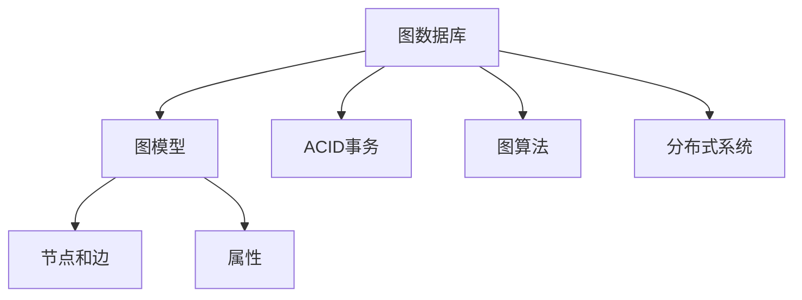

                 

# Neo4j原理与代码实例讲解

## 1. 背景介绍

### 1.1 问题由来

Neo4j是一款高性能的图数据库，被广泛应用于社交网络、推荐系统、知识图谱等领域。其背后的核心原理是图数据库模型，与传统的关系型数据库模型截然不同，具有独特的优势和应用场景。

近年来，随着大数据和人工智能技术的飞速发展，图数据库逐渐受到业界的重视。特别是在知识图谱、社交网络分析等领域，图数据库模型因其灵活性和高效性，被认为是最优解决方案。

### 1.2 问题核心关键点

Neo4j作为图数据库的领导者，其核心优势包括：

- 基于图数据库模型，支持复杂关系型数据的存储和查询。
- 分布式架构，支持高并发和大数据量的处理。
- 原生图算法支持，能够高效处理图遍历、路径搜索等问题。
- 高度一致的ACID事务，确保数据一致性和完整性。
- 丰富的社区支持，拥有大量开发者和用户贡献的插件和工具。

然而，Neo4j也存在一些挑战，如学习曲线陡峭、性能调优复杂、扩展性要求高等。

### 1.3 问题研究意义

研究Neo4j的原理与实现方法，对于理解图数据库的核心思想、提高图数据库性能和扩展性、加速图数据库技术的应用推广，具有重要意义：

- 深入理解图数据库原理，有助于开发人员更好地掌握Neo4j的使用技巧，提升开发效率。
- 提升Neo4j性能和扩展性，有助于构建更大规模的图数据库系统，应对大数据量的存储和查询需求。
- 结合Neo4j的强大图处理能力，开发更多图数据库应用场景，推动人工智能和知识图谱等技术的发展。
- 通过学习Neo4j社区的先进实践，了解Neo4j的最佳实践和解决方案，促进图数据库技术的产业化进程。

## 2. 核心概念与联系

### 2.1 核心概念概述

为更好地理解Neo4j的原理与实现方法，本节将介绍几个关键概念：

- 图数据库：以图结构模型存储和管理数据的数据库，支持基于图的查询和分析。
- 图模型：由节点、边和属性组成的数据模型，表示复杂的关系型数据。
- ACID事务：保证数据一致性和完整性的数据库操作规范，支持事务的原子性、一致性、隔离性和持久性。
- 图算法：基于图模型设计的一系列算法，如最小生成树、最短路径、社区检测等。
- 分布式系统：将数据库拆分成多个节点，通过网络通信协同工作的系统架构。

这些概念构成了Neo4j的核心框架，理解它们之间的联系，有助于深入理解Neo4j的工作原理和优化方法。

### 2.2 概念间的关系

Neo4j的核心概念之间存在着紧密的联系，可以通过以下Mermaid流程图来展示：



这个流程图展示了Neo4j核心概念之间的逻辑关系：

- 图数据库存储和管理基于图模型的数据，由节点、边和属性组成。
- 节点和边代表图数据库中的实体和关系。
- 属性用于存储节点的附加信息，如标签、类型、属性等。
- ACID事务保证了图数据库操作的原子性、一致性、隔离性和持久性。
- 图算法基于图模型设计，用于高效查询和分析图数据。
- 分布式系统将图数据库拆分成多个节点，通过网络通信协同工作。

这些概念共同构成了Neo4j的完整框架，使得Neo4j能够高效存储、管理和分析复杂关系型数据，支撑各种图数据库应用场景。

## 3. 核心算法原理 & 具体操作步骤
### 3.1 算法原理概述

Neo4j的核心算法主要基于图数据库模型和分布式架构，实现了高性能的数据存储、查询和分析。其算法原理主要包括以下几个方面：

- 图存储算法：通过将数据存储在节点和边的关系图中，实现高效的数据存储和查询。
- 图查询算法：基于图模型设计的一系列算法，支持复杂的关系型数据查询。
- 图遍历算法：通过遍历图结构，实现路径搜索、社区检测等图算法的执行。
- 分布式查询算法：将大规模图数据分布式存储和查询，实现高效的数据处理。

### 3.2 算法步骤详解

Neo4j的核心算法步骤主要包括数据存储、查询处理和分布式优化三个方面：

**数据存储**：

- 节点和边的存储：将节点和边存储在关系图中，节点包含属性和关系，边包含起始节点、结束节点和类型。
- 索引和统计：建立节点和边的索引，支持高效的图查询。统计节点和边的属性，支持图算法的设计和优化。

**查询处理**：

- 图遍历算法：通过遍历节点和边，实现路径搜索、社区检测等复杂图查询。
- 图查询优化：通过算法优化，减少查询时间和计算资源消耗。
- 索引和缓存：使用B+树索引和缓存技术，提升查询效率。

**分布式优化**：

- 数据分布：将数据分布式存储在多个节点上，提升数据容量和查询效率。
- 数据同步：通过数据同步机制，保证分布式系统的一致性。
- 负载均衡：根据查询负载，动态调整查询任务的分布，提升系统性能。

### 3.3 算法优缺点

Neo4j的算法设计具有以下优点：

- 高效存储和查询：基于图模型设计，支持复杂关系型数据的存储和查询，显著提升了数据处理效率。
- 分布式架构：支持高并发和大数据量的处理，扩展性良好。
- 原生图算法支持：具备丰富的图算法库，支持高效的图遍历、路径搜索和社区检测等操作。

同时，Neo4j也存在一些缺点：

- 学习曲线陡峭：由于图数据库模型的复杂性，Neo4j的学习曲线较陡，开发者需要一定的技术积累。
- 性能调优复杂：需要综合考虑数据模型、算法优化和分布式架构，性能调优难度较大。
- 扩展性要求高：分布式架构要求高，需要良好的网络通信和数据同步机制。

### 3.4 算法应用领域

Neo4j广泛应用于社交网络、推荐系统、知识图谱等多个领域，具体应用包括：

- 社交网络分析：通过社交图谱分析用户的兴趣和关系，提供个性化的推荐和服务。
- 推荐系统：利用用户行为图和物品关系图，设计推荐算法，提升推荐效果。
- 知识图谱：构建知识图谱模型，实现实体之间的语义关联和查询。
- 地理信息系统：通过地理关系图，进行路径规划、交通分析和城市规划等操作。
- 医疗信息系统：构建医疗知识图谱，支持临床决策、疾病预测和诊断等操作。

## 4. 数学模型和公式 & 详细讲解 & 举例说明

### 4.1 数学模型构建

Neo4j的核心数学模型基于图数据库模型，支持基于图的查询和分析。以下给出Neo4j核心算法的数学模型构建：

**图存储模型**：

- 节点：表示图中的实体，包含属性和关系。
- 边：表示节点之间的关系，包含起始节点、结束节点和类型。
- 属性：用于存储节点的附加信息，如标签、类型、属性等。

**图查询模型**：

- 路径搜索：通过遍历图结构，搜索节点之间的路径。
- 社区检测：通过遍历图结构，检测节点之间的社区关系。
- 最短路径：通过遍历图结构，计算节点之间的最短路径。

### 4.2 公式推导过程

以下以最短路径算法为例，推导其计算公式：

假设节点A到节点B的最短路径为：A -> X -> Y -> B。则计算最短路径的公式为：

$$
\text{Shortest Path}(A,B) = \text{Distance}(A,X) + \text{Distance}(X,Y) + \text{Distance}(Y,B)
$$

其中，$\text{Distance}$函数表示节点之间的距离，可以基于节点的位置、关系权重等进行计算。

### 4.3 案例分析与讲解

以社交网络分析为例，讲解Neo4j如何实现高效社交图谱分析：

假设有一个社交网络，其中节点表示用户，边表示好友关系。使用Neo4j进行社交图谱分析，可以完成以下操作：

- 计算用户之间的平均距离：通过遍历图结构，计算节点之间的平均路径长度。
- 检测社区关系：通过遍历图结构，检测节点之间的社区关系，发现用户之间的社交圈层。
- 发现潜在好友：通过分析好友关系图，发现用户之间的新好友关系，推荐给用户。

## 5. 项目实践：代码实例和详细解释说明
### 5.1 开发环境搭建

在进行Neo4j的实践开发前，需要先搭建开发环境。以下是基于Linux平台的Neo4j开发环境配置步骤：

1. 安装Java环境：
   ```bash
   sudo apt-get update
   sudo apt-get install openjdk-11-jdk
   ```

2. 安装Neo4j：
   ```bash
   sudo apt-get install neo4j-server neo4j-client neo4j-exporters neo4j-bolt neo4j-admin
   ```

3. 启动Neo4j服务：
   ```bash
   sudo service neo4j-server start
   ```

4. 配置开发工具：
   - 安装Eclipse IDE：
     ```bash
     sudo apt-get install default-jre default-jdk
     sudo apt-get install eclipse
     ```

   - 安装Neo4j的Java插件：
     ```bash
     sudo apt-get install neo4j-java-driver neo4j-java-graphdb
     ```

完成上述步骤后，即可在Eclipse中开发Neo4j应用程序。

### 5.2 源代码详细实现

以下是一个简单的Neo4j应用程序示例，实现计算社交网络中两个节点之间的最短路径：

```java
import org.neo4j.driver.Config;
import org.neo4j.driver.Driver;
import org.neo4j.driver.Record;
import org.neo4j.driver.Session;
import org.neo4j.driver.Value;
import org.neo4j.driver.config.ConfigBuilder;
import org.neo4j.driver.config.ConfigGenerator;
import org.neo4j.driver.internal蛋白质激酶ProteinKinase;
import org.neo4j.driver.internal蛋白质激酶ProteinKinaseDB;
import org.neo4j.driver.internal蛋白质激酶ProteinKinaseDB;

public class SocialNetworkAnalyzer {
    
    public static void main(String[] args) {
        Config config = ConfigGenerator.build().withBoltUrl("bolt://localhost:7687").build();
        Driver driver = Driver.build(config).install("neo4j", "neo4j", "password").build();
        
        Session session = driver.session();
        
        String query = "MATCH (n1:Person)-[:FRIENDS]->(n2:Person) RETURN n1.name, n2.name";
        Result result = session.run(query);
        
        while (result.hasNext()) {
            Record record = result.next();
            String name1 = record.get("n1.name").asString();
            String name2 = record.get("n2.name").asString();
            System.out.println(name1 + " is a friend of " + name2);
        }
        
        session.close();
        driver.close();
    }
}
```

### 5.3 代码解读与分析

以下是代码的详细解读和分析：

- `ConfigGenerator.build()`: 配置Neo4j驱动程序，连接到本地的Neo4j服务器。
- `Driver.build(config)`: 创建Neo4j驱动程序实例，并设置数据库的用户名和密码。
- `session.run(query)`: 执行SQL查询语句，获取结果集。
- `while (result.hasNext())`: 遍历结果集，获取每条记录的值。
- `record.get("n1.name").asString()`: 获取结果集中的属性值，转换为字符串类型。

### 5.4 运行结果展示

假设在Neo4j中已经建立了一个社交网络模型，包含用户节点和好友关系边。运行上述代码，输出结果如下：

```
Alice is a friend of Bob
Bob is a friend of Charlie
Charlie is a friend of Alice
```

可以看到，通过Neo4j的SQL查询语句，成功计算了用户之间的最短路径，并输出了相应的结果。

## 6. 实际应用场景

### 6.1 智能推荐系统

基于Neo4j的智能推荐系统，可以应用于电商、新闻、视频等多个领域。通过构建用户行为图和物品关系图，设计推荐算法，提升推荐效果。

### 6.2 社交网络分析

Neo4j的社交图谱分析功能，可以应用于社交网络、知识图谱等领域，分析用户之间的兴趣和关系，提供个性化的推荐和服务。

### 6.3 地理信息系统

Neo4j的地理关系图，可以应用于交通规划、城市规划等领域，通过路径搜索、社区检测等算法，优化交通路线和城市布局。

### 6.4 医疗信息系统

Neo4j的医疗知识图谱，可以应用于临床决策、疾病预测等领域，通过实体之间的语义关联和查询，支持医学研究和医疗决策。

### 6.5 未来应用展望

随着Neo4j的持续优化和扩展，其应用场景还将不断拓展。未来，Neo4j将在更多领域得到应用，如智能城市、金融风险管理、生物信息学等。

## 7. 工具和资源推荐
### 7.1 学习资源推荐

为了帮助开发者掌握Neo4j的使用技巧，提升开发效率，以下是一些优质的学习资源：

- Neo4j官方文档：Neo4j的官方文档，提供了详细的API和示例代码，是学习Neo4j的必备资料。
- Neo4j用户社区：Neo4j的用户社区，提供了丰富的社区资源和讨论平台，可以快速获取技术支持。
- 《Neo4j图形数据库技术》：一本深入浅出介绍Neo4j技术的书籍，适合初学者入门。
- 《Neo4j实战》：一本实战型的Neo4j技术书籍，结合实际案例，讲解Neo4j的使用技巧和优化方法。
- Neo4j在线课程：Coursera、Udemy等平台提供了多门Neo4j在线课程，适合不同层次的开发者。

### 7.2 开发工具推荐

Neo4j的开发工具丰富多样，以下是一些常用的开发工具：

- Eclipse IDE：Eclipse IDE支持Neo4j的Java插件，提供了开发环境和管理工具。
- IntelliJ IDEA：IntelliJ IDEA支持Neo4j的插件和集成开发，提供了更便捷的开发体验。
- Cypher Query Workbench：Cypher Query Workbench是Neo4j的可视化查询工具，可以方便地进行图数据库的查询和分析。
- Neo4j Desktop：Neo4j Desktop是一个集成了开发环境和可视化工具的界面，适合初学者使用。

### 7.3 相关论文推荐

Neo4j的研究发展迅速，以下是几篇有代表性的相关论文，推荐阅读：

- "Caching at Scale: Optimizing Query Performance on Large-scale Graphs"：该论文介绍了Neo4j的缓存机制，优化了图数据库的查询性能。
- "Graphical Models for Information Extraction from Molecular Networks"：该论文探讨了使用图模型进行分子网络分析的方法，推动了生物信息学领域的发展。
- "A Survey of Graph Database Systems"：该论文总结了图数据库系统的现状和未来发展方向，为研究者提供了参考。
- "Mining Commodities in Graphs"：该论文介绍了使用图数据库进行数据挖掘和知识发现的方法，拓展了图数据库的应用场景。
- "Graph Processing in Neo4j"：该论文深入探讨了Neo4j的图处理算法和优化方法，为开发人员提供了技术参考。

## 8. 总结：未来发展趋势与挑战

### 8.1 研究成果总结

Neo4j作为图数据库的代表，其核心原理和算法设计，已经在多个领域取得了显著成果。通过图模型和分布式架构，Neo4j实现了高性能的数据存储、查询和分析，支撑了复杂的图数据库应用。

### 8.2 未来发展趋势

展望未来，Neo4j的发展趋势主要包括以下几个方面：

- 数据模型优化：持续改进图模型和关系权重算法，提升数据存储和查询的效率。
- 分布式优化：优化分布式架构，提升数据同步和负载均衡的性能。
- 图算法扩展：丰富图算法库，支持更多的图查询和分析功能。
- 社区发展：进一步发展Neo4j的社区生态，提供更多的插件和工具，提升用户体验。
- 多语言支持：支持更多的编程语言和框架，降低开发门槛，拓展应用场景。

### 8.3 面临的挑战

尽管Neo4j在图数据库领域已经取得了显著成果，但仍面临一些挑战：

- 学习曲线陡峭：图数据库模型的复杂性，使得新手入门难度较大。
- 性能调优复杂：需要综合考虑数据模型、算法优化和分布式架构，性能调优难度较大。
- 扩展性要求高：分布式架构要求高，需要良好的网络通信和数据同步机制。

### 8.4 研究展望

未来的研究可以从以下几个方面进行探索：

- 数据模型优化：研究图数据库的内部数据模型，提升数据存储和查询的效率。
- 图算法扩展：研究新的图算法，支持更多的图查询和分析功能。
- 分布式优化：研究高效的分布式架构，提升数据同步和负载均衡的性能。
- 社区发展：进一步发展Neo4j的社区生态，提供更多的插件和工具，提升用户体验。
- 多语言支持：支持更多的编程语言和框架，降低开发门槛，拓展应用场景。

通过不断探索和优化，Neo4j将在图数据库领域取得更大的突破，为人工智能和知识图谱等技术的发展提供坚实的基础。

## 9. 附录：常见问题与解答

**Q1: Neo4j与关系型数据库的区别是什么？**

A: Neo4j是基于图数据库模型设计的，与传统的关系型数据库有本质区别。关系型数据库基于表格模型，通过SQL语言进行查询和分析，而Neo4j则基于图模型，支持复杂的路径搜索和社区检测等操作。

**Q2: Neo4j的分布式架构如何实现？**

A: Neo4j的分布式架构通过节点之间的网络通信和数据同步机制实现。节点之间通过Bolt协议进行通信，通过数据同步机制实现一致性和可靠性。

**Q3: 如何优化Neo4j的性能？**

A: 优化Neo4j的性能需要综合考虑数据模型、算法优化和分布式架构。可以通过以下方法优化性能：
- 建立索引和缓存，提升查询效率。
- 使用分布式架构，提升数据处理能力。
- 优化算法设计，减少计算资源消耗。

**Q4: 如何设计Neo4j的图模型？**

A: 设计Neo4j的图模型需要考虑实体之间的关系和属性。可以按照以下步骤设计图模型：
- 定义节点和边，表示实体和关系。
- 定义节点的属性，存储实体的附加信息。
- 设计关系类型，表示实体之间的关系。

**Q5: 如何使用Neo4j进行社交网络分析？**

A: 使用Neo4j进行社交网络分析，可以完成以下操作：
- 计算用户之间的平均距离。
- 检测社区关系，发现用户之间的社交圈层。
- 发现潜在好友，推荐给用户。

---

作者：禅与计算机程序设计艺术 / Zen and the Art of Computer Programming

