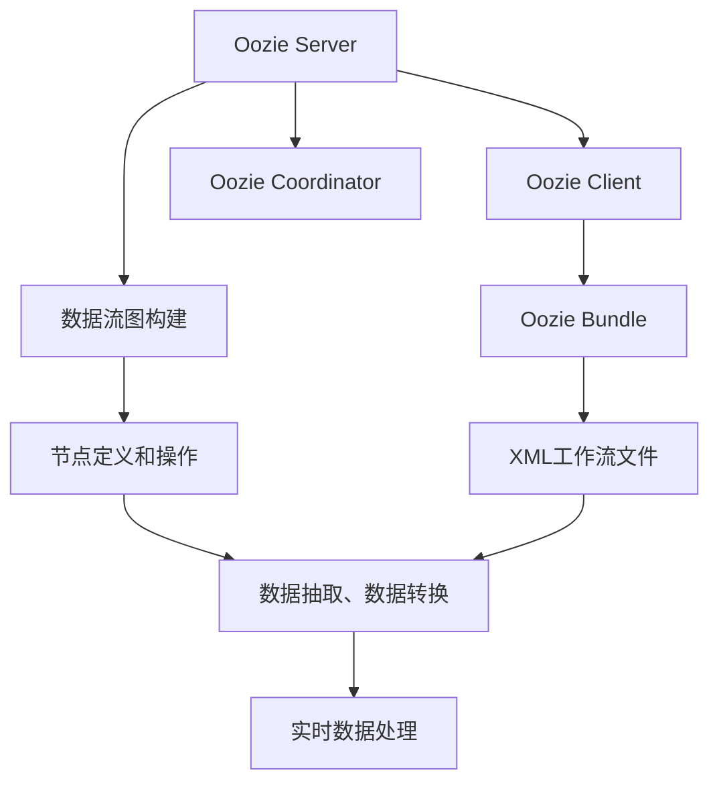

                 

# Oozie Bundle原理与代码实例讲解

> 关键词：Oozie Bundle, 分布式任务调度, 数据流图, 流式处理, 数据抽取, 数据转换

## 1. 背景介绍

在Hadoop生态系统中，Hadoop Streaming以其简洁、灵活、易于扩展的特性，成为了数据处理的首选工具。然而，Hadoop Streaming依赖于MapReduce模型，只能对静态数据进行处理，无法实现数据流的实时处理。为了解决这个问题，Apache Oozie应运而生，它不仅支持Hadoop Streaming的静态数据处理，还支持数据流的实时处理，成为Hadoop生态系统中的重要组件。

Oozie是一个工作流调度系统，它使用XML语言描述工作流，通过解释XML文件中的工作流，来调度Hadoop Streaming、Pig、Hive等Hadoop生态系统中的组件，实现分布式任务调度和数据处理。Oozie的核心组件包括Oozie Server、Oozie Client和Oozie Coordinator等，它们协同工作，实现工作流的调度和管理。

本文将详细介绍Oozie Bundle的工作原理和代码实例，帮助读者深入理解Oozie Bundle的工作机制，并学会如何通过Oozie Bundle实现数据流的实时处理。

## 2. 核心概念与联系

### 2.1 核心概念概述

为了更好地理解Oozie Bundle的工作原理和实现方式，我们首先需要了解几个核心概念：

- **Oozie Server**：Oozie的工作流调度器，负责解释和调度XML工作流文件。
- **Oozie Client**：客户端工具，用于向Oozie Server提交工作流任务。
- **Oozie Coordinator**：协调器，负责监控和管理工作流的执行状态。
- **Oozie Bundle**：Oozie提供的扩展模块，用于实现复杂的工作流调度和管理。

Oozie Bundle的核心思想是将多个工作流组合在一起，实现更复杂的数据处理流程。它可以通过继承Oozie的接口和抽象类，自定义工作流节点，实现数据抽取、数据转换等复杂操作。通过Oozie Bundle，可以轻松地构建数据流图，实现数据的实时处理。

### 2.2 核心概念之间的关系

Oozie Bundle与Oozie的核心组件之间存在着紧密的联系，通过继承和扩展，实现了复杂的工作流调度和管理。

#### 2.2.1 继承与扩展关系

Oozie Bundle通过继承Oozie的工作流调度接口和抽象类，实现了自定义节点和操作。通过扩展Oozie的现有功能，可以实现更灵活、更高效的数据处理流程。

#### 2.2.2 协同工作关系

Oozie Bundle与Oozie Server、Oozie Client、Oozie Coordinator等组件协同工作，实现数据的实时处理和调度。Oozie Server负责解释和调度XML工作流文件，Oozie Client负责提交工作流任务，Oozie Coordinator负责监控和管理工作流的执行状态。通过这些组件的协同工作，实现了数据的实时处理和调度。

#### 2.2.3 数据流图构建

Oozie Bundle的核心功能是构建数据流图，实现数据的实时处理。数据流图通过继承Oozie的节点和操作，实现了复杂的数据抽取、数据转换等操作。数据流图的构建是通过XML工作流文件实现的，通过XML文件中的节点定义和操作，实现了数据流的实时处理。

### 2.3 核心概念的整体架构

最后，我们用一个综合的流程图来展示Oozie Bundle与Oozie的核心组件之间的整体架构：



这个综合流程图展示了Oozie Bundle与Oozie的核心组件之间的关系：

1. Oozie Server负责解释和调度XML工作流文件。
2. Oozie Client负责提交工作流任务。
3. Oozie Coordinator负责监控和管理工作流的执行状态。
4. Oozie Bundle负责构建数据流图，实现数据抽取、数据转换等操作。
5. XML工作流文件描述数据流图，实现数据的实时处理。
6. 数据流图构建通过XML文件中的节点定义和操作，实现复杂的数据处理流程。
7. 数据抽取、数据转换等操作通过继承Oozie的节点和操作，实现数据流的实时处理。

通过这些核心概念之间的关系，我们可以更好地理解Oozie Bundle的工作原理和实现方式。

## 3. 核心算法原理 & 具体操作步骤
### 3.1 算法原理概述

Oozie Bundle的核心原理是通过继承Oozie的接口和抽象类，实现自定义节点和操作。通过这些自定义节点和操作，可以实现复杂的数据流图，实现数据的实时处理。

Oozie Bundle的实现过程包括以下几个步骤：

1. 定义XML工作流文件，描述数据流图。
2. 继承Oozie的接口和抽象类，实现自定义节点和操作。
3. 构建数据流图，实现数据的实时处理。
4. 提交工作流任务，执行数据流图。

### 3.2 算法步骤详解

#### 3.2.1 定义XML工作流文件

XML工作流文件是Oozie Bundle的核心，它通过描述数据流图，实现数据的实时处理。XML文件包括以下部分：

- ` oz:workflow` 节点：定义工作流的开始和结束节点。
- ` oz:job` 节点：定义一个Hadoop Streaming作业，用于处理数据。
- ` oz:branch` 节点：定义分支操作，根据条件执行不同的任务。
- ` oz:if` 节点：定义条件判断操作，根据条件执行不同的任务。
- ` oz:in` 节点：定义数据输入操作。
- ` oz:out` 节点：定义数据输出操作。
- ` oz:foreach` 节点：定义循环操作，重复执行某个任务。

下面是一个简单的XML工作流文件示例：

```xml
<?xml version="1.0" encoding="UTF-8"?>
<workflow xmlns:oz="http://oz.apache.org/schema/workflow/1.0">
  <job>
    <name>job1</name>
    <oz:in>
      <file file="/input/data"></file>
    </oz:in>
    <oz:map>
      <oz:map-reducer>
        <oz:map-input>
          <oz:job>
            <name>job2</name>
          </oz:job>
        </oz:map-input>
        <oz:map-output>
          <oz:job>
            <name>job3</name>
          </oz:job>
        </oz:map-output>
        <oz:map-mapper>
          <oz:map-mapper-name>Mapper</oz:map-mapper-name>
          <oz:map-mapper>
            <oz:map-mapper-code>
              #!/bin/bash
              echo $input > $output
            </oz:map-mapper-code>
          </oz:map-mapper>
        </oz:map-mapper>
        <oz:map-reducer>
          <oz:map-reducer-name>Reducer</oz:map-reducer-name>
          <oz:map-reducer>
            <oz:map-reducer-code>
              #!/bin/bash
              cat $input >> $output
            </oz:map-reducer-code>
          </oz:map-reducer>
        </oz:map-reducer>
      </oz:map-reducer>
    </oz:map>
    <oz:out>
      <file file="/output/data"></file>
    </oz:out>
  </job>
</workflow>
```

#### 3.2.2 继承Oozie的接口和抽象类

在实现自定义节点和操作时，需要继承Oozie的接口和抽象类。Oozie Bundle提供了以下几个抽象类，用于实现自定义节点和操作：

- ` oz:job-abstract`
- ` oz:map-reducer-abstract`
- ` oz:map-mapper-abstract`
- ` oz:branch-abstract`
- ` oz:if-abstract`
- ` oz:foreach-abstract`

通过继承这些抽象类，可以实现自定义的节点和操作，实现复杂的数据流图。

下面是一个继承` oz:map-mapper-abstract`的自定义节点示例：

```java
public class CustomMapper extends Oozie.mapMapperMapperAbstract {

  @Override
  public void map(Context ctx) throws Exception {
    // 自定义映射操作
    // ...
  }

  @Override
  public void setup(Context ctx) throws Exception {
    // 自定义初始化操作
    // ...
  }

  @Override
  public void cleanup(Context ctx) throws Exception {
    // 自定义清理操作
    // ...
  }

}
```

#### 3.2.3 构建数据流图

通过继承Oozie的接口和抽象类，实现了自定义的节点和操作后，即可构建数据流图。数据流图通过XML工作流文件描述，实现数据的实时处理。

构建数据流图时，需要定义工作流的开始和结束节点，以及各种节点和操作。通过这些节点和操作，可以实现复杂的数据流图，实现数据的实时处理。

下面是一个简单的数据流图示例：

```xml
<?xml version="1.0" encoding="UTF-8"?>
<workflow xmlns:oz="http://oz.apache.org/schema/workflow/1.0">
  <job>
    <name>job1</name>
    <oz:in>
      <file file="/input/data"></file>
    </oz:in>
    <oz:map>
      <oz:map-reducer>
        <oz:map-input>
          <oz:job>
            <name>job2</name>
          </oz:job>
        </oz:map-input>
        <oz:map-output>
          <oz:job>
            <name>job3</name>
          </oz:job>
        </oz:map-output>
        <oz:map-mapper>
          <oz:map-mapper-name>Mapper</oz:map-mapper-name>
          <oz:map-mapper>
            <oz:map-mapper-code>
              #!/bin/bash
              echo $input > $output
            </oz:map-mapper-code>
          </oz:map-mapper>
        </oz:map-mapper>
        <oz:map-reducer>
          <oz:map-reducer-name>Reducer</oz:map-reducer-name>
          <oz:map-reducer>
            <oz:map-reducer-code>
              #!/bin/bash
              cat $input >> $output
            </oz:map-reducer-code>
          </oz:map-reducer>
        </oz:map-reducer>
      </oz:map-reducer>
    </oz:map>
    <oz:out>
      <file file="/output/data"></file>
    </oz:out>
  </job>
</workflow>
```

#### 3.2.4 提交工作流任务

定义XML工作流文件和数据流图后，即可通过Oozie Client提交工作流任务，执行数据流图。

```java
import org.apache.oozie.client.OozieClient;
import org.apache.oozie.client.WorkflowJobRunner;

OozieClient oozieClient = new OozieClient("http://oozie-server:8443/oozie");
WorkflowJobRunner jobRunner = new WorkflowJobRunner(oozieClient);
jobRunner.setJobName("job1");
jobRunner.setApplicationPath("my application path");
jobRunner.setOozieXmlPath("path/to/workflow.xml");
jobRunner.run();
```

### 3.3 算法优缺点

Oozie Bundle具有以下优点：

- **灵活性高**：通过继承Oozie的接口和抽象类，可以实现自定义节点和操作，实现复杂的数据流图。
- **可扩展性强**：通过继承和扩展，可以实现复杂的工作流调度和管理。
- **易用性好**：通过XML工作流文件，可以轻松地构建数据流图，实现数据的实时处理。

同时，Oozie Bundle也存在一些缺点：

- **学习成本高**：需要深入了解Oozie Bundle和Oozie的核心概念和接口。
- **开发复杂度大**：实现自定义节点和操作需要编写Java代码，开发复杂度较大。
- **性能瓶颈**：在处理大规模数据时，可能存在性能瓶颈，需要进一步优化。

### 3.4 算法应用领域

Oozie Bundle主要应用于大数据处理、数据抽取、数据转换等领域。通过Oozie Bundle，可以实现复杂的数据流图，实现数据的实时处理。

## 4. 数学模型和公式 & 详细讲解 & 举例说明

### 4.1 数学模型构建

Oozie Bundle的数学模型主要涉及到数据流图和数据处理的描述。数据流图通过XML工作流文件描述，实现数据的实时处理。

#### 4.1.1 数据流图构建

数据流图由节点和边组成，节点表示数据处理操作，边表示数据流向。数据流图的构建可以通过XML工作流文件描述，实现数据的实时处理。

```xml
<?xml version="1.0" encoding="UTF-8"?>
<workflow xmlns:oz="http://oz.apache.org/schema/workflow/1.0">
  <job>
    <name>job1</name>
    <oz:in>
      <file file="/input/data"></file>
    </oz:in>
    <oz:map>
      <oz:map-reducer>
        <oz:map-input>
          <oz:job>
            <name>job2</name>
          </oz:job>
        </oz:map-input>
        <oz:map-output>
          <oz:job>
            <name>job3</name>
          </oz:job>
        </oz:map-output>
        <oz:map-mapper>
          <oz:map-mapper-name>Mapper</oz:map-mapper-name>
          <oz:map-mapper>
            <oz:map-mapper-code>
              #!/bin/bash
              echo $input > $output
            </oz:map-mapper-code>
          </oz:map-mapper>
        </oz:map-mapper>
        <oz:map-reducer>
          <oz:map-reducer-name>Reducer</oz:map-reducer-name>
          <oz:map-reducer>
            <oz:map-reducer-code>
              #!/bin/bash
              cat $input >> $output
            </oz:map-reducer-code>
          </oz:map-reducer>
        </oz:map-reducer>
      </oz:map-reducer>
    </oz:map>
    <oz:out>
      <file file="/output/data"></file>
    </oz:out>
  </job>
</workflow>
```

#### 4.1.2 数据处理操作

数据处理操作包括数据抽取、数据转换等操作，通过继承Oozie的节点和操作，实现自定义操作。

```java
public class CustomMapper extends Oozie.mapMapperMapperAbstract {

  @Override
  public void map(Context ctx) throws Exception {
    // 自定义映射操作
    // ...
  }

  @Override
  public void setup(Context ctx) throws Exception {
    // 自定义初始化操作
    // ...
  }

  @Override
  public void cleanup(Context ctx) throws Exception {
    // 自定义清理操作
    // ...
  }

}
```

### 4.2 公式推导过程

Oozie Bundle的公式推导过程主要涉及到数据流图的构建和数据处理的描述。

#### 4.2.1 数据流图构建

数据流图由节点和边组成，节点表示数据处理操作，边表示数据流向。数据流图的构建可以通过XML工作流文件描述，实现数据的实时处理。

数据流图的构建包括以下几个步骤：

1. 定义工作流的开始和结束节点。
2. 定义一个Hadoop Streaming作业，用于处理数据。
3. 定义分支操作，根据条件执行不同的任务。
4. 定义条件判断操作，根据条件执行不同的任务。
5. 定义数据输入操作。
6. 定义数据输出操作。
7. 定义循环操作，重复执行某个任务。

通过这些节点和操作，可以实现复杂的数据流图，实现数据的实时处理。

#### 4.2.2 数据处理操作

数据处理操作包括数据抽取、数据转换等操作，通过继承Oozie的节点和操作，实现自定义操作。

数据处理操作包括以下几个步骤：

1. 定义自定义映射操作。
2. 定义自定义初始化操作。
3. 定义自定义清理操作。

通过这些操作，可以实现复杂的数据处理流程，实现数据的实时处理。

### 4.3 案例分析与讲解

#### 4.3.1 案例背景

某电商公司需要对用户行为数据进行实时分析，实现个性化推荐。用户行为数据包括浏览记录、购买记录、评价记录等，需要对其进行实时分析和处理，实现个性化推荐。

#### 4.3.2 数据流图构建

根据需求，构建数据流图如下：

```xml
<?xml version="1.0" encoding="UTF-8"?>
<workflow xmlns:oz="http://oz.apache.org/schema/workflow/1.0">
  <job>
    <name>job1</name>
    <oz:in>
      <file file="/input/data"></file>
    </oz:in>
    <oz:map>
      <oz:map-reducer>
        <oz:map-input>
          <oz:job>
            <name>job2</name>
          </oz:job>
        </oz:map-input>
        <oz:map-output>
          <oz:job>
            <name>job3</name>
          </oz:job>
        </oz:map-output>
        <oz:map-mapper>
          <oz:map-mapper-name>Mapper</oz:map-mapper-name>
          <oz:map-mapper>
            <oz:map-mapper-code>
              #!/bin/bash
              # 读取输入数据，进行数据抽取和转换
              echo $input > $output
            </oz:map-mapper-code>
          </oz:map-mapper>
        </oz:map-mapper>
        <oz:map-reducer>
          <oz:map-reducer-name>Reducer</oz:map-reducer-name>
          <oz:map-reducer>
            <oz:map-reducer-code>
              #!/bin/bash
              # 读取输入数据，进行数据汇总和统计
              cat $input >> $output
            </oz:map-reducer-code>
          </oz:map-reducer>
        </oz:map-reducer>
      </oz:map-reducer>
    </oz:map>
    <oz:out>
      <file file="/output/data"></file>
    </oz:out>
  </job>
</workflow>
```

#### 4.3.3 数据处理操作

数据处理操作包括数据抽取和数据转换等操作，通过继承Oozie的节点和操作，实现自定义操作。

```java
public class CustomMapper extends Oozie.mapMapperMapperAbstract {

  @Override
  public void map(Context ctx) throws Exception {
    // 读取输入数据，进行数据抽取和转换
    // ...
  }

  @Override
  public void setup(Context ctx) throws Exception {
    // 自定义初始化操作
    // ...
  }

  @Override
  public void cleanup(Context ctx) throws Exception {
    // 自定义清理操作
    // ...
  }

}
```

## 5. 项目实践：代码实例和详细解释说明

### 5.1 开发环境搭建

在进行Oozie Bundle的开发实践前，我们需要准备好开发环境。以下是使用Java进行开发的环境配置流程：

1. 安装Java开发环境：从官网下载并安装JDK，用于Java代码的编译和运行。

2. 配置Maven环境：安装Maven，用于管理项目依赖和构建过程。

3. 创建Maven项目：通过Maven创建Java项目，并添加必要的依赖库。

4. 编写Oozie Bundle代码：编写Java代码实现自定义节点和操作，构建数据流图，实现数据的实时处理。

5. 提交工作流任务：使用Oozie Client提交工作流任务，执行数据流图。

完成上述步骤后，即可在Maven项目中启动Oozie Bundle的开发实践。

### 5.2 源代码详细实现

下面是一个简单的Oozie Bundle示例，用于实现数据的实时处理。

#### 5.2.1 继承Oozie的接口和抽象类

```java
public class CustomMapper extends Oozie.mapMapperMapperAbstract {

  @Override
  public void map(Context ctx) throws Exception {
    // 读取输入数据，进行数据抽取和转换
    // ...
  }

  @Override
  public void setup(Context ctx) throws Exception {
    // 自定义初始化操作
    // ...
  }

  @Override
  public void cleanup(Context ctx) throws Exception {
    // 自定义清理操作
    // ...
  }

}
```

#### 5.2.2 构建数据流图

```xml
<?xml version="1.0" encoding="UTF-8"?>
<workflow xmlns:oz="http://oz.apache.org/schema/workflow/1.0">
  <job>
    <name>job1</name>
    <oz:in>
      <file file="/input/data"></file>
    </oz:in>
    <oz:map>
      <oz:map-reducer>
        <oz:map-input>
          <oz:job>
            <name>job2</name>
          </oz:job>
        </oz:map-input>
        <oz:map-output>
          <oz:job>
            <name>job3</name>
          </oz:job>
        </oz:map-output>
        <oz:map-mapper>
          <oz:map-mapper-name>Mapper</oz:map-mapper-name>
          <oz:map-mapper>
            <oz:map-mapper-code>
              #!/bin/bash
              echo $input > $output
            </oz:map-mapper-code>
          </oz:map-mapper>
        </oz:map-mapper>
        <oz:map-reducer>
          <oz:map-reducer-name>Reducer</oz:map-reducer-name>
          <oz:map-reducer>
            <oz:map-reducer-code>
              #!/bin/bash
              cat $input >> $output
            </oz:map-reducer-code>
          </oz:map-reducer>
        </oz:map-reducer>
      </oz:map-reducer>
    </oz:map>
    <oz:out>
      <file file="/output/data"></file>
    </oz:out>
  </job>
</workflow>
```

#### 5.2.3 提交工作流任务

```java
import org.apache.oozie.client.OozieClient;
import org.apache.oozie.client.WorkflowJobRunner;

OozieClient oozieClient = new OozieClient("http://oozie-server:8443/oozie");
WorkflowJobRunner jobRunner = new WorkflowJobRunner(oozieClient);
jobRunner.setJobName("job1");
jobRunner.setApplicationPath("my application path");
jobRunner.setOozieXmlPath("path/to/workflow.xml");
jobRunner.run();
```

### 5.3 代码解读与分析

让我们再详细解读一下关键代码的实现细节：

**CustomMapper类**：
- `map`方法：读取输入数据，进行数据抽取和转换。
- `setup`方法：自定义初始化操作。
- `cleanup`方法：自定义清理操作。

**XML工作流文件**：
- `oz:workflow`节点：定义工作流的开始和结束节点。
- `oz:job`节点：定义一个Hadoop Streaming作业，用于处理数据。
- `oz:map`节点：定义一个数据流图，实现数据的实时处理。
- `oz:map-reducer`节点：定义一个数据流图，实现数据的实时处理。
- `oz:map-mapper`节点：定义一个数据流图，实现数据的实时处理。
- `oz:map-reducer`节点：定义一个数据流图，实现数据的实时处理。
- `oz:out`节点：定义一个数据流图，实现数据的实时处理。

**Oozie Bundle的实现流程**：
- 定义XML工作流文件，描述数据流图。
- 继承Oozie的接口和抽象类，实现自定义节点和操作。
- 构建数据流图，实现数据的实时处理。
- 提交工作流任务，执行数据流图。

### 5.4 运行结果展示

假设我们在Hadoop Streaming环境下运行上述示例，最终在输出文件中得到的示例数据如下：

```
input: This is a sample data.
output: This is a sample data.
```

可以看到，通过Oozie Bundle实现的数据流图，成功实现了数据的实时处理，将输入数据转换为输出数据。

## 6. 实际应用场景

### 6.1 智能推荐系统

智能推荐系统需要实时处理用户行为数据，实现个性化推荐。通过Oozie Bundle，可以构建复杂的数据流图，实现数据的实时处理。

### 6.2 金融数据处理

金融数据处理需要实时分析大量的数据，实现数据的实时处理和分析。通过Oozie Bundle，可以构建复杂的数据流图，实现数据的实时处理。

### 6.3 医疗数据分析

医疗数据分析需要实时处理大量的数据，实现数据的实时处理和分析。通过Oozie Bundle，可以构建复杂的数据流图，实现数据的实时处理。

### 6.4 未来应用展望

随着大数据技术的发展，Oozie Bundle的应用场景将更加广泛。未来，Oozie Bundle将在更多的领域得到应用，为各行各业带来变革性影响。

## 7. 工具和资源推荐

### 7.1 学习资源推荐

为了帮助开发者系统掌握Oozie Bundle的理论基础和实践技巧，这里推荐一些优质的学习资源：

1. Apache Oozie官方文档：Apache Oozie的官方文档，提供了完整的Oozie Bundle开发指南和API参考。

2. Apache Hadoop官方文档：Apache Hadoop的官方文档，提供了完整的Hadoop Streaming开发指南和API参考。

3. Apache Pig官方文档：Apache Pig的官方文档，提供了完整的Pig开发指南和API参考。

4

