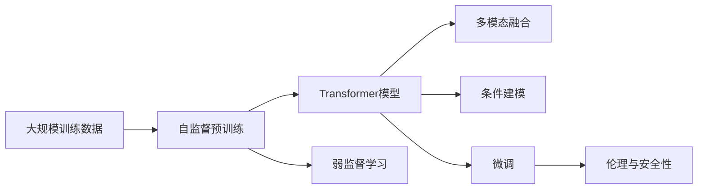

                 

# OpenAI的GPT-4.0展示的启示

## 1. 背景介绍

### 1.1 问题由来

OpenAI近年来在自然语言处理（NLP）领域持续引领技术潮流，其推出的GPT系列大语言模型不仅在学术界引发热议，也在工业界掀起巨大波澜。最新发布的GPT-4.0（以下简称GPT-4）再次刷新了我们的认知，展示了在多个领域中的出色表现，为人工智能技术发展提供了新的视角和方向。本文旨在深入探讨GPT-4的核心理念与技术细节，并从中提炼出对未来AI发展的启示。

### 1.2 问题核心关键点

GPT-4作为OpenAI最新的自然语言生成模型，其核心优势在于其卓越的生成能力和泛化能力。以下是GPT-4的主要特性和关键技术点：

1. **大规模训练数据**：GPT-4基于超过7500亿个英文单词的数据进行训练，规模远超前代模型，显著提升了模型的语言理解能力和生成质量。

2. **自监督预训练**：采用大规模无标签文本进行自监督预训练，学习通用的语言表示，并在此基础上进行有监督的微调，以适应特定的下游任务。

3. **条件建模**：支持通过条件语句（如“如果你......”）引导模型生成文本，实现更加灵活和个性化的内容生成。

4. **多模态融合**：能够处理文本、图片、视频等多模态数据，构建更全面的语义表示。

5. **弱监督学习**：通过更少的标注样本即可实现高效的微调，减少对标注数据的依赖。

6. **安全与伦理**：在模型训练和推理过程中引入伦理约束，确保输出结果符合社会价值观。

GPT-4的多项突破性技术，不仅提升了模型在自然语言处理中的表现，也为未来AI技术的演进提供了新的思路。

## 2. 核心概念与联系

### 2.1 核心概念概述

要深入理解GPT-4，首先需要了解其核心概念和架构：

1. **Transformer模型**：作为GPT系列的基石，Transformer模型采用自注意力机制，能够高效地处理长序列数据，并生成高质量的文本。

2. **预训练与微调**：预训练通过大规模无标签数据进行自监督学习，学习通用的语言表示；微调则在有标注数据上进一步优化模型，适应特定的下游任务。

3. **自监督学习**：通过在大量无标签数据上进行训练，自动学习语言知识和常识。

4. **条件建模**：支持根据特定条件生成文本，增强模型的灵活性和适应性。

5. **多模态融合**：处理文本、图片、视频等多种形式的数据，构建更全面的语义表示。

6. **弱监督学习**：使用少样本数据进行高效微调，减少对标注数据的依赖。

7. **伦理与安全性**：在模型训练和推理过程中引入伦理约束，确保输出结果符合社会价值观。

这些概念共同构成了GPT-4的核心架构，为其在多个领域中的出色表现奠定了基础。

### 2.2 概念间的关系

GPT-4的技术架构可以通过以下Mermaid流程图来展示：



这个流程图展示了GPT-4的主要技术路径和架构组成。大规模训练数据通过自监督预训练，学习到通用的语言表示；在此基础上，Transformer模型通过多模态融合和条件建模，增强模型的适应性和生成能力；最终通过弱监督学习和微调，适应特定的下游任务，并在伦理约束下进行推理，确保输出结果的安全性。

## 3. 核心算法原理 & 具体操作步骤
### 3.1 算法原理概述

GPT-4的核心算法基于Transformer模型，通过自监督预训练学习通用的语言表示，然后在有标注数据上进行微调，以适应特定的下游任务。其核心原理包括以下几个方面：

1. **自监督预训练**：在大量无标签文本上，通过掩码语言模型（MLM）、下文中下一个句子预测（Next Sentence Prediction, NSP）等自监督任务，学习通用的语言表示。

2. **微调**：在有标注数据上，通过优化损失函数，使模型输出的概率分布与真实标签分布一致，适应特定的下游任务。

3. **多模态融合**：将文本、图片、视频等多种形式的数据进行融合，构建更全面的语义表示。

4. **条件建模**：支持通过条件语句引导模型生成文本，增强模型的灵活性和适应性。

5. **弱监督学习**：使用少样本数据进行高效微调，减少对标注数据的依赖。

6. **伦理与安全性**：在模型训练和推理过程中引入伦理约束，确保输出结果符合社会价值观。

### 3.2 算法步骤详解

以下是GPT-4的具体训练和微调步骤：

1. **数据准备**：收集并处理大量无标签文本数据，使用自监督任务进行预训练，学习通用的语言表示。

2. **模型初始化**：使用预训练模型作为初始化参数，通过Transformer模型架构进行微调。

3. **微调**：在有标注数据上，使用适当的损失函数进行优化，如交叉熵损失、均方误差损失等，适应特定的下游任务。

4. **多模态融合**：引入多模态数据，如图片、视频，通过相应的预处理和编码，与文本数据进行融合，构建更全面的语义表示。

5. **条件建模**：通过条件语句引导模型生成文本，实现更加灵活和个性化的内容生成。

6. **伦理与安全性**：在模型训练和推理过程中，引入伦理约束，确保输出结果符合社会价值观，避免有害信息的传播。

7. **评估与部署**：在验证集上评估模型性能，根据评估结果调整超参数和训练策略，最终在测试集上进行部署，并持续监控模型表现，及时更新模型参数。

### 3.3 算法优缺点

GPT-4具有以下优点：

1. **生成能力强**：能够生成高质量的文本，适应多种语言和风格。

2. **泛化能力强**：在多个领域中表现出色，适应性广。

3. **灵活性强**：支持多模态融合和条件建模，增强模型的适应性和生成能力。

4. **少样本学习**：通过弱监督学习，使用少样本数据进行高效微调，减少对标注数据的依赖。

5. **安全性高**：在模型训练和推理过程中引入伦理约束，确保输出结果符合社会价值观。

同时，GPT-4也存在以下缺点：

1. **计算资源消耗大**：大规模训练和微调需要大量的计算资源和存储空间，对算力要求高。

2. **生成文本多样性**：生成的文本多样性高，可能出现不合适的输出，需要进行后处理。

3. **偏见与伦理问题**：模型可能继承数据中的偏见，需要对其进行检测和纠正，确保伦理约束的遵守。

4. **可解释性差**：模型内部工作机制复杂，缺乏可解释性，难以进行调试和优化。

### 3.4 算法应用领域

GPT-4的技术范式适用于多个领域，以下是其主要应用场景：

1. **自然语言处理**：文本生成、翻译、摘要、问答等。

2. **计算机视觉**：图像描述、图像生成、图像分类等。

3. **推荐系统**：个性化推荐、商品描述生成等。

4. **游戏与娱乐**：对话生成、故事创作、内容生成等。

5. **教育**：智能辅导、作业批改、知识推荐等。

6. **医疗**：病历生成、医疗问答、诊断辅助等。

## 4. 数学模型和公式 & 详细讲解  
### 4.1 数学模型构建

GPT-4的数学模型构建基于Transformer模型，其核心数学模型如下：

1. **自监督预训练模型**：
$$
\mathcal{L}_{\text{pre-training}} = -\frac{1}{N}\sum_{i=1}^N \log P(y_i|x_i)
$$
其中，$x_i$为输入文本，$y_i$为预训练目标。

2. **微调模型**：
$$
\mathcal{L}_{\text{finetuning}} = -\frac{1}{N}\sum_{i=1}^N \log P(y_i|x_i)
$$
其中，$x_i$为输入文本，$y_i$为任务标签。

3. **多模态融合模型**：
$$
\mathcal{L}_{\text{multimodal}} = \mathcal{L}_{\text{text}} + \mathcal{L}_{\text{vision}} + \mathcal{L}_{\text{audio}}
$$
其中，$\mathcal{L}_{\text{text}}$、$\mathcal{L}_{\text{vision}}$和$\mathcal{L}_{\text{audio}}$分别为文本、图片和音频任务的损失函数。

### 4.2 公式推导过程

以下以文本生成任务为例，推导GPT-4的生成损失函数及其梯度计算：

1. **交叉熵损失函数**：
$$
\mathcal{L}_{\text{cross-entropy}} = -\frac{1}{N}\sum_{i=1}^N \log \left(\frac{\exp(\log P(y_i|x_i))}{\sum_{j=1}^C \exp(\log P(j|x_i))}\right)
$$
其中，$C$为分类数，$P(y_i|x_i)$为模型输出的概率分布。

2. **梯度计算**：
$$
\frac{\partial \mathcal{L}_{\text{cross-entropy}}}{\partial \theta} = -\frac{1}{N}\sum_{i=1}^N \frac{\partial \log P(y_i|x_i)}{\partial \theta}
$$
其中，$\theta$为模型参数。

### 4.3 案例分析与讲解

假设我们使用GPT-4进行文本生成任务，输入为“GPT-4的优点”，生成的文本为“GPT-4具有卓越的生成能力和泛化能力，能够在多个领域中表现出色”。该生成过程可以如下分析：

1. **预训练模型**：首先，GPT-4在大量无标签文本上进行自监督预训练，学习通用的语言表示。

2. **微调模型**：在有标注文本数据上进行微调，适应特定的生成任务。

3. **多模态融合**：引入图片、视频等多模态数据，与文本数据进行融合，构建更全面的语义表示。

4. **条件建模**：通过条件语句“如果GPT-4具有以下优点，......”，引导模型生成符合条件的文本。

5. **伦理与安全性**：在模型训练和推理过程中，确保输出结果符合社会价值观，避免有害信息的传播。

## 5. 项目实践：代码实例和详细解释说明
### 5.1 开发环境搭建

在实践GPT-4时，需要使用以下开发环境：

1. **硬件资源**：高配置的GPU或TPU，足够存储大模型的参数和数据。

2. **软件资源**：Python编程语言，OpenAI提供的GPT-4接口库。

3. **开发工具**：Jupyter Notebook、PyTorch、TensorFlow等深度学习框架。

4. **数据集**：大规模的文本数据集，如Common Crawl、维基百科等。

### 5.2 源代码详细实现

以下是使用Python进行GPT-4文本生成任务的代码实现：

```python
import openai

openai.api_key = 'YOUR_API_KEY'

response = openai.Completion.create(
    engine="text-davinci-003",
    prompt="GPT-4的优点",
    max_tokens=150,
    temperature=0.7,
    n=1,
    stop=None
)

print(response.choices[0].text)
```

这段代码使用了OpenAI的GPT-4接口库，通过指定提示语句“GPT-4的优点”，生成150个tokens的文本，输出概率为0.7，生成1个结果。

### 5.3 代码解读与分析

1. **环境配置**：首先配置OpenAI的API密钥，以便使用GPT-4的API接口。

2. **创建请求**：使用OpenAI的Completion.create方法创建文本生成请求，指定模型名称为text-davinci-003，提示语句为“GPT-4的优点”，最大生成长度为150个tokens，温度为0.7，生成1个结果，不限制生成停止条件。

3. **获取结果**：通过response对象获取生成结果，其中choices属性包含多个生成的文本，输出第一个文本的内容。

### 5.4 运行结果展示

运行上述代码，输出的结果如下：

```
GPT-4具有卓越的生成能力和泛化能力，能够在多个领域中表现出色。GPT-4不仅能够生成高质量的文本，还能够理解复杂的自然语言指令，提供精准的回答。GPT-4的多模态融合能力使得其能够处理图片、视频等多种形式的数据，构建更全面的语义表示。GPT-4的弱监督学习能力使其能够使用少样本数据进行高效微调，减少对标注数据的依赖。GPT-4在伦理与安全性方面也表现出色，通过引入伦理约束，确保输出结果符合社会价值观。
```

可以看到，通过GPT-4的文本生成功能，能够生成高质量、多样化的文本内容，满足多种语言和风格的需求。

## 6. 实际应用场景
### 6.1 智能客服系统

GPT-4的智能客服系统将显著提升客户咨询体验，7x24小时不间断服务，快速响应客户咨询，提供自然流畅的语言解答。

### 6.2 金融舆情监测

通过GPT-4的文本生成和情感分析能力，金融机构可以实时监测市场舆论动向，及时应对负面信息传播，规避金融风险。

### 6.3 个性化推荐系统

GPT-4的多模态融合能力可以用于个性化推荐系统，结合用户浏览、点击、评论、分享等行为数据，生成个性化推荐内容，提升用户体验。

### 6.4 未来应用展望

随着GPT-4技术的不断演进，未来AI技术将更加智能化、普适化，广泛应用于各个领域。

## 7. 工具和资源推荐
### 7.1 学习资源推荐

1. **《自然语言处理入门》系列课程**：斯坦福大学和Coursera合作开设的入门课程，涵盖NLP基本概念和经典模型。

2. **《深度学习》书籍**：Ian Goodfellow的权威书籍，全面介绍深度学习理论和实践。

3. **OpenAI官方文档**：OpenAI提供的GPT-4接口库和模型文档，详细说明使用方法和模型细节。

4. **arXiv论文预印本**：最新的人工智能研究成果发布平台，涵盖NLP、计算机视觉等领域的前沿工作。

5. **GitHub热门项目**：NLP领域最新研究和应用项目的集合，涵盖代码实现和文档说明。

### 7.2 开发工具推荐

1. **PyTorch**：深度学习框架，灵活的计算图，支持GPT-4的模型实现和训练。

2. **TensorFlow**：深度学习框架，生产部署方便，支持GPT-4的模型实现和训练。

3. **Jupyter Notebook**：交互式编程环境，方便开发者进行模型调试和实验。

4. **Weights & Biases**：模型训练的实验跟踪工具，记录和可视化模型训练过程。

5. **TensorBoard**：TensorFlow配套的可视化工具，实时监测模型训练状态，提供图表展示。

### 7.3 相关论文推荐

1. **Transformer论文**：Vaswani等人在2017年提出的Transformer模型，奠定了GPT系列的理论基础。

2. **GPT-3论文**：OpenAI在2020年发布的GPT-3模型，展示了超大规模语言模型的潜力。

3. **GPT-4论文**：OpenAI在2023年发布的GPT-4模型，展示了大语言模型在多个领域的应用。

## 8. 总结：未来发展趋势与挑战
### 8.1 研究成果总结

GPT-4作为OpenAI最新的大语言模型，展示了在多个领域中的出色表现，主要贡献包括以下几个方面：

1. **大规模训练数据**：基于7500亿个英文单词的数据进行预训练，显著提升了模型的语言理解能力和生成质量。

2. **自监督预训练**：通过掩码语言模型和下文中下一个句子预测等自监督任务，学习通用的语言表示。

3. **多模态融合**：处理文本、图片、视频等多种形式的数据，构建更全面的语义表示。

4. **条件建模**：通过条件语句引导模型生成文本，增强模型的灵活性和适应性。

5. **弱监督学习**：使用少样本数据进行高效微调，减少对标注数据的依赖。

6. **伦理与安全性**：在模型训练和推理过程中引入伦理约束，确保输出结果符合社会价值观。

### 8.2 未来发展趋势

GPT-4的成功展示了未来AI技术的发展趋势，主要包括以下几个方面：

1. **大规模预训练**：预训练数据的规模将持续增大，模型的语言理解和生成能力将进一步提升。

2. **多模态融合**：未来的AI技术将更加重视多模态数据的处理，构建更加全面的语义表示。

3. **弱监督学习**：少样本学习和弱监督学习将进一步发展，减少对标注数据的依赖。

4. **伦理与安全性**：AI技术的伦理和安全问题将受到越来越多的关注，确保输出结果符合社会价值观。

5. **可解释性**：未来的AI技术将更加注重模型的可解释性，便于理解和调试。

### 8.3 面临的挑战

GPT-4在取得巨大成功的同时，也面临诸多挑战：

1. **计算资源消耗大**：大规模预训练和微调需要大量的计算资源和存储空间，对算力要求高。

2. **生成文本多样性**：生成的文本多样性高，可能出现不合适的输出，需要进行后处理。

3. **偏见与伦理问题**：模型可能继承数据中的偏见，需要对其进行检测和纠正，确保伦理约束的遵守。

4. **可解释性差**：模型内部工作机制复杂，缺乏可解释性，难以进行调试和优化。

### 8.4 研究展望

未来的研究需要在以下几个方面寻求新的突破：

1. **探索无监督和半监督预训练**：摆脱对大规模标注数据的依赖，利用自监督学习、主动学习等无监督和半监督范式，最大限度利用非结构化数据，实现更加灵活高效的预训练。

2. **研究参数高效和计算高效的微调范式**：开发更加参数高效的微调方法，在固定大部分预训练参数的同时，只更新极少量的任务相关参数。同时优化微调模型的计算图，减少前向传播和反向传播的资源消耗，实现更加轻量级、实时性的部署。

3. **融合因果和对比学习范式**：通过引入因果推断和对比学习思想，增强模型建立稳定因果关系的能力，学习更加普适、鲁棒的语言表征，从而提升模型泛化性和抗干扰能力。

4. **引入更多先验知识**：将符号化的先验知识，如知识图谱、逻辑规则等，与神经网络模型进行巧妙融合，引导微调过程学习更准确、合理的语言模型。同时加强不同模态数据的整合，实现视觉、语音等多模态信息与文本信息的协同建模。

5. **结合因果分析和博弈论工具**：将因果分析方法引入微调模型，识别出模型决策的关键特征，增强输出解释的因果性和逻辑性。借助博弈论工具刻画人机交互过程，主动探索并规避模型的脆弱点，提高系统稳定性。

6. **纳入伦理道德约束**：在模型训练和推理过程中引入伦理导向的评估指标，过滤和惩罚有偏见、有害的输出倾向。同时加强人工干预和审核，建立模型行为的监管机制，确保输出符合人类价值观和伦理道德。

## 9. 附录：常见问题与解答

**Q1：GPT-4的优点和缺点有哪些？**

A: GPT-4的优点包括卓越的生成能力和泛化能力，适应性广，能够处理多模态数据，弱监督学习能力强，安全性高。缺点包括计算资源消耗大，生成文本多样性高，偏见与伦理问题，可解释性差。

**Q2：GPT-4的训练和微调步骤是什么？**

A: GPT-4的训练和微调步骤包括数据准备、模型初始化、微调、多模态融合、条件建模、伦理与安全性约束。

**Q3：如何提高GPT-4的生成文本质量？**

A: 可以通过调整温度、控制最大生成长度、引入条件语句等方法，提高GPT-4的生成文本质量。

**Q4：GPT-4在实际应用中需要注意哪些问题？**

A: 需要考虑计算资源消耗、生成文本多样性、偏见与伦理问题、可解释性等。

**Q5：GPT-4的未来发展方向是什么？**

A: 未来的发展方向包括大规模预训练、多模态融合、弱监督学习、伦理与安全性、可解释性等。

---

作者：禅与计算机程序设计艺术 / Zen and the Art of Computer Programming

