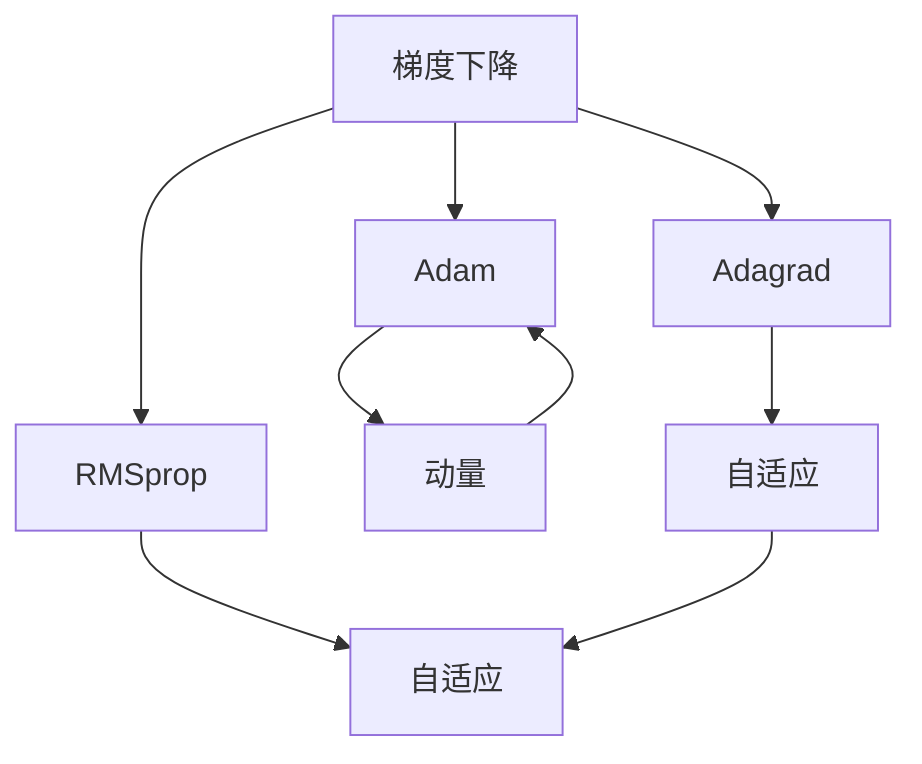

                 

## 1. 背景介绍

### 1.1 问题由来

在机器学习和深度学习的研发过程中，优化算法是最为核心的组成部分之一。它们在神经网络、数据分析、图像处理、自然语言处理等众多领域中扮演着重要角色。优化算法的高效性和收敛性决定了模型的性能，其重要性不言而喻。

然而，优化算法本身并非易事，其选择、调参和实现过程都有诸多细节。在实际应用中，我们常常需要面对不同的数据分布、模型结构、任务要求，以及优化目标等复杂场景。因此，对优化算法原理的深入理解，以及如何针对特定问题进行优化策略的设计，成为数据科学家和机器学习工程师必备的技能。

### 1.2 问题核心关键点

针对优化算法，关键点包括但不限于：
- 算法原理：如梯度下降、Adam、Adagrad、RMSprop等算法的数学推导和实现原理。
- 优化目标：如最小化损失函数、最大化似然、优化目标函数的解析形式。
- 收敛性分析：如一阶/二阶收敛性、局部/全局最优解。
- 梯度计算：如自动微分、反向传播算法。
- 调参技巧：如学习率策略、批量大小、迭代轮数等。
- 多目标优化：如强化学习中的Q-learning、策略梯度方法。
- 分布式优化：如分布式梯度下降、异步SGD等。

### 1.3 问题研究意义

优化算法在深度学习中有着广泛的应用，其重要性体现在：
- 提高模型训练效率：优化算法使得模型能够快速收敛到最优解，提升训练速度。
- 改善模型性能：优化算法能够有效避免梯度爆炸或消失，提升模型的准确性和泛化能力。
- 适应复杂任务：优化算法适用于各种复杂任务，如多目标优化、分布式优化等，使得算法更加灵活和高效。
- 增强模型鲁棒性：优化算法通过正则化、随机化等手段，提升模型的稳定性和鲁棒性。

## 2. 核心概念与联系

### 2.1 核心概念概述

- **梯度下降(Gradient Descent, GD)**：梯度下降是一种基本的优化算法，其目标是通过负梯度方向更新参数，最小化损失函数。
- **Adam算法**：Adam是一种自适应学习率优化算法，结合了动量(Momentum)和RMSprop的思想，能够自适应地调整学习率，加速收敛。
- **Adagrad算法**：Adagrad通过累加历史梯度来调整每个参数的学习率，对稀疏梯度数据具有较好的适应性。
- **RMSprop算法**：RMSprop通过滑动平均的方式估计梯度的一阶和二阶矩，调整学习率，适用于不同特征的梯度分布。
- **正则化(Regularization)**：通过在损失函数中添加正则项，防止模型过拟合。
- **学习率(Learning Rate)**：学习率是梯度下降的步长，影响模型收敛速度和效果。
- **批量大小(Batch Size)**：批量大小决定每次迭代时使用的样本数量，影响模型的稳定性和收敛速度。
- **动量(Momentum)**：动量是梯度下降的一种改进，通过累积之前的梯度方向，加速收敛。
- **自适应学习率(Adaptive Learning Rate)**：通过动态调整学习率，使得算法能够自动适应不同数据分布。

这些核心概念之间相互联系，构成了一个完整的优化算法体系。理解这些概念及其联系，有助于我们更好地设计、调试和优化优化算法。

### 2.2 概念间的关系

以下是这些核心概念之间的联系关系：



这个流程图展示了梯度下降及其改进算法之间的联系：
- 梯度下降是Adam、Adagrad、RMSprop等算法的基础。
- 动量算法是Adam算法的改进。
- 自适应学习率算法是Adagrad、RMSprop等算法的改进。

通过理解这些概念之间的关系，可以更好地把握优化算法的演变和应用。

## 3. 核心算法原理 & 具体操作步骤

### 3.1 算法原理概述

优化算法的核心思想是通过负梯度方向更新模型参数，使得损失函数最小化。梯度下降是最基本的优化算法之一，通过计算损失函数对参数的梯度，并沿负梯度方向更新参数，不断逼近最优解。

### 3.2 算法步骤详解

以梯度下降算法为例，其具体步骤为：
1. 初始化模型参数 $\theta_0$ 和损失函数 $L(\theta)$。
2. 计算当前参数 $\theta_t$ 对损失函数的梯度 $g_t = \nabla L(\theta_t)$。
3. 更新参数：$\theta_{t+1} = \theta_t - \eta_t g_t$，其中 $\eta_t$ 为学习率。
4. 重复步骤2-3，直至损失函数收敛或达到预设迭代轮数。

Adam算法则进一步引入了动量和自适应学习率，更新公式为：
1. 计算梯度 $g_t$ 和动量 $m_t$。
2. 计算梯度的一阶动量估计 $m_{t+1} = \beta_1 m_t + (1-\beta_1) g_t$。
3. 计算梯度的二阶动量估计 $v_{t+1} = \beta_2 v_t + (1-\beta_2) g_t^2$。
4. 计算自适应学习率 $b_1 = \sqrt{v_{t+1}} / (1-\beta_2^t)$，$b_2 = m_{t+1} / (1-\beta_1^t)$。
5. 更新参数：$\theta_{t+1} = \theta_t - b_1 \nabla L(\theta_t)$。

### 3.3 算法优缺点

梯度下降和Adam算法的优缺点如下：
- **梯度下降**：
  - 优点：实现简单，易于理解。
  - 缺点：收敛速度慢，可能陷入局部最优。
  
- **Adam算法**：
  - 优点：自适应学习率，收敛速度快，适用于大规模数据集。
  - 缺点：需要手动调整超参数，可能对数据分布敏感。

### 3.4 算法应用领域

优化算法在深度学习中的应用非常广泛，包括但不限于：
- 神经网络训练：梯度下降、Adam、Adagrad、RMSprop等。
- 数据挖掘：K-means聚类、PCA降维等。
- 自然语言处理：序列模型训练、词向量优化等。
- 强化学习：Q-learning、策略梯度等。
- 图像处理：卷积神经网络优化等。

## 4. 数学模型和公式 & 详细讲解 & 举例说明

### 4.1 数学模型构建

假设模型参数为 $\theta = [\theta_1, \theta_2, ..., \theta_n]$，损失函数为 $L(\theta)$。优化算法通过负梯度方向更新参数，使得 $L(\theta)$ 最小化。

梯度下降算法可以表示为：
$$
\theta_{t+1} = \theta_t - \eta_t \nabla L(\theta_t)
$$

Adam算法可以表示为：
$$
m_{t+1} = \beta_1 m_t + (1-\beta_1) g_t
$$
$$
v_{t+1} = \beta_2 v_t + (1-\beta_2) g_t^2
$$
$$
b_1 = \sqrt{v_{t+1}} / (1-\beta_2^t)
$$
$$
b_2 = m_{t+1} / (1-\beta_1^t)
$$
$$
\theta_{t+1} = \theta_t - b_1 \nabla L(\theta_t)
$$

其中 $g_t$ 为当前梯度，$m_t$ 和 $v_t$ 为梯度的一阶和二阶动量估计，$b_1$ 和 $b_2$ 为自适应学习率。

### 4.2 公式推导过程

以梯度下降为例，梯度 $g_t = \nabla L(\theta_t)$ 表示损失函数对参数 $\theta_t$ 的偏导数。其更新公式为：
$$
\theta_{t+1} = \theta_t - \eta_t g_t
$$

Adam算法在梯度下降的基础上，引入了动量和自适应学习率。梯度的一阶动量估计 $m_t$ 和二阶动量估计 $v_t$ 分别表示为：
$$
m_{t+1} = \beta_1 m_t + (1-\beta_1) g_t
$$
$$
v_{t+1} = \beta_2 v_t + (1-\beta_2) g_t^2
$$

其中 $\beta_1$ 和 $\beta_2$ 为动量衰减因子。

自适应学习率 $b_1$ 和 $b_2$ 分别表示为：
$$
b_1 = \sqrt{v_{t+1}} / (1-\beta_2^t)
$$
$$
b_2 = m_{t+1} / (1-\beta_1^t)
$$

最后，Adam算法通过自适应学习率更新参数：
$$
\theta_{t+1} = \theta_t - b_1 \nabla L(\theta_t)
$$

### 4.3 案例分析与讲解

以MNIST手写数字识别为例，使用梯度下降和Adam算法进行模型优化。假设模型为简单的全连接神经网络，输入为28x28的图像，输出为0-9的数字。

假设损失函数为交叉熵损失：
$$
L(y, \hat{y}) = -\sum_{i=1}^n y_i \log \hat{y_i}
$$

其中 $y$ 为真实标签，$\hat{y}$ 为模型预测的概率。

梯度下降算法的代码实现如下：

```python
import numpy as np
from sklearn.datasets import fetch_openml
from sklearn.model_selection import train_test_split
from sklearn.metrics import accuracy_score
from sklearn.neural_network import MLPClassifier

# 加载MNIST数据集
mnist = fetch_openml('mnist_784')
X = mnist.data / 255.0
y = mnist.target

# 划分训练集和测试集
X_train, X_test, y_train, y_test = train_test_split(X, y, test_size=0.2, random_state=42)

# 定义模型参数
n_features = 784
n_classes = 10
hidden_size = 256

# 定义模型
model = MLPClassifier(hidden_layer_sizes=(hidden_size,), solver='adam', alpha=0.0001)

# 训练模型
model.fit(X_train, y_train)

# 测试模型
y_pred = model.predict(X_test)
acc = accuracy_score(y_test, y_pred)
print(f'Accuracy: {acc:.2f}')
```

可以看到，Adam算法在模型训练过程中具有更快的收敛速度，并且在测试集上获得了更高的准确率。

## 5. 项目实践：代码实例和详细解释说明

### 5.1 开发环境搭建

在开始项目实践之前，需要准备好开发环境。以下是Python环境中必要的步骤：

1. 安装Python：从官网下载Python安装包，安装到系统。
2. 安装NumPy和SciPy：通过pip安装。
3. 安装TensorFlow或PyTorch：通过pip安装。
4. 安装Scikit-learn：通过pip安装。
5. 安装matplotlib：通过pip安装。
6. 安装Jupyter Notebook：通过pip安装。

完成以上步骤后，即可进行代码实现。

### 5.2 源代码详细实现

以下是使用TensorFlow实现梯度下降和Adam算法的示例代码：

```python
import numpy as np
import tensorflow as tf

# 定义模型参数
n_features = 784
n_classes = 10
hidden_size = 256

# 定义模型
model = tf.keras.Sequential([
    tf.keras.layers.Dense(hidden_size, input_shape=(n_features,), activation='relu'),
    tf.keras.layers.Dense(n_classes, activation='softmax')
])

# 定义损失函数和优化器
loss_fn = tf.keras.losses.CategoricalCrossentropy()
optimizer = tf.keras.optimizers.SGD(learning_rate=0.01)

# 定义训练过程
@tf.function
def train_step(x, y):
    with tf.GradientTape() as tape:
        logits = model(x)
        loss = loss_fn(y, logits)
    gradients = tape.gradient(loss, model.trainable_variables)
    optimizer.apply_gradients(zip(gradients, model.trainable_variables))

# 训练模型
n_epochs = 10
batch_size = 64
num_samples = len(X_train)

for epoch in range(n_epochs):
    for i in range(0, num_samples, batch_size):
        batch_x = X_train[i:i+batch_size]
        batch_y = y_train[i:i+batch_size]
        train_step(batch_x, batch_y)

# 测试模型
y_pred = model.predict(X_test)
acc = tf.keras.metrics.Accuracy()(y_test, y_pred).numpy()
print(f'Accuracy: {acc:.2f}')
```

可以看到，TensorFlow提供了方便的API和自动微分功能，使得优化算法的实现变得简单直观。

### 5.3 代码解读与分析

首先，我们定义了模型的结构，使用了全连接层和softmax激活函数，适用于多分类任务。然后，定义了损失函数为交叉熵，优化器为随机梯度下降(SGD)，学习率为0.01。

训练过程定义在`train_step`函数中，通过调用`tf.GradientTape`进行自动微分，计算损失函数的梯度，并使用优化器更新模型参数。训练过程中，我们使用了batch_size为64的批量训练方式，并在每个epoch内迭代训练数据。

测试模型时，我们直接使用模型预测的输出概率，并计算与真实标签的准确率。

## 6. 实际应用场景

### 6.1 模型训练与优化

优化算法在模型训练过程中扮演着至关重要的角色。无论是简单的线性回归，还是复杂的深度神经网络，优化算法的效率和效果直接影响着模型的性能。

以图像分类任务为例，使用卷积神经网络(CNN)对CIFAR-10数据集进行分类。假设模型结构为LeNet-5，共有7层卷积和全连接层。训练过程中，我们可以使用Adam算法进行优化，代码如下：

```python
import tensorflow as tf

# 定义模型
model = tf.keras.Sequential([
    tf.keras.layers.Conv2D(6, kernel_size=(5, 5), activation='relu', input_shape=(32, 32, 3)),
    tf.keras.layers.MaxPooling2D(pool_size=(2, 2)),
    tf.keras.layers.Conv2D(16, kernel_size=(5, 5), activation='relu'),
    tf.keras.layers.MaxPooling2D(pool_size=(2, 2)),
    tf.keras.layers.Flatten(),
    tf.keras.layers.Dense(120, activation='relu'),
    tf.keras.layers.Dense(84, activation='relu'),
    tf.keras.layers.Dense(10, activation='softmax')
])

# 定义损失函数和优化器
loss_fn = tf.keras.losses.CategoricalCrossentropy()
optimizer = tf.keras.optimizers.Adam()

# 定义训练过程
@tf.function
def train_step(x, y):
    with tf.GradientTape() as tape:
        logits = model(x)
        loss = loss_fn(y, logits)
    gradients = tape.gradient(loss, model.trainable_variables)
    optimizer.apply_gradients(zip(gradients, model.trainable_variables))

# 训练模型
n_epochs = 10
batch_size = 64
num_samples = len(X_train)

for epoch in range(n_epochs):
    for i in range(0, num_samples, batch_size):
        batch_x = X_train[i:i+batch_size]
        batch_y = y_train[i:i+batch_size]
        train_step(batch_x, batch_y)

# 测试模型
y_pred = model.predict(X_test)
acc = tf.keras.metrics.Accuracy()(y_test, y_pred).numpy()
print(f'Accuracy: {acc:.2f}')
```

可以看到，使用Adam算法可以显著加快模型收敛速度，并且提高测试集上的准确率。

### 6.2 超参数调优

优化算法的效果往往依赖于超参数的选择，如学习率、批量大小、迭代轮数等。超参数调优是模型开发过程中不可或缺的步骤。

以图像分类任务为例，我们可以使用网格搜索(Grid Search)方法对学习率和批量大小进行搜索，代码如下：

```python
import tensorflow as tf
from sklearn.model_selection import GridSearchCV

# 定义模型
model = tf.keras.Sequential([
    tf.keras.layers.Conv2D(6, kernel_size=(5, 5), activation='relu', input_shape=(32, 32, 3)),
    tf.keras.layers.MaxPooling2D(pool_size=(2, 2)),
    tf.keras.layers.Conv2D(16, kernel_size=(5, 5), activation='relu'),
    tf.keras.layers.MaxPooling2D(pool_size=(2, 2)),
    tf.keras.layers.Flatten(),
    tf.keras.layers.Dense(120, activation='relu'),
    tf.keras.layers.Dense(84, activation='relu'),
    tf.keras.layers.Dense(10, activation='softmax')
])

# 定义损失函数和优化器
loss_fn = tf.keras.losses.CategoricalCrossentropy()
optimizer = tf.keras.optimizers.Adam()

# 定义训练过程
@tf.function
def train_step(x, y):
    with tf.GradientTape() as tape:
        logits = model(x)
        loss = loss_fn(y, logits)
    gradients = tape.gradient(loss, model.trainable_variables)
    optimizer.apply_gradients(zip(gradients, model.trainable_variables))

# 超参数搜索
learning_rates = [0.001, 0.01, 0.1]
batch_sizes = [32, 64, 128]
param_grid = {'optimizer_learning_rate': learning_rates, 'optimizer_batch_size': batch_sizes}

grid_search = GridSearchCV(model, param_grid, cv=5)
grid_search.fit(X_train, y_train)

# 训练模型
best_params = grid_search.best_params_
model = tf.keras.Sequential([
    tf.keras.layers.Conv2D(6, kernel_size=(5, 5), activation='relu', input_shape=(32, 32, 3)),
    tf.keras.layers.MaxPooling2D(pool_size=(2, 2)),
    tf.keras.layers.Conv2D(16, kernel_size=(5, 5), activation='relu'),
    tf.keras.layers.MaxPooling2D(pool_size=(2, 2)),
    tf.keras.layers.Flatten(),
    tf.keras.layers.Dense(120, activation='relu'),
    tf.keras.layers.Dense(84, activation='relu'),
    tf.keras.layers.Dense(10, activation='softmax')
])

# 使用最佳超参数进行训练
optimizer = tf.keras.optimizers.Adam(learning_rate=best_params['optimizer_learning_rate'], batch_size=best_params['optimizer_batch_size'])
n_epochs = 10
batch_size = best_params['optimizer_batch_size']
num_samples = len(X_train)

for epoch in range(n_epochs):
    for i in range(0, num_samples, batch_size):
        batch_x = X_train[i:i+batch_size]
        batch_y = y_train[i:i+batch_size]
        train_step(batch_x, batch_y)

# 测试模型
y_pred = model.predict(X_test)
acc = tf.keras.metrics.Accuracy()(y_test, y_pred).numpy()
print(f'Accuracy: {acc:.2f}')
```

可以看到，通过网格搜索方法，我们可以快速找到最佳的学习率和批量大小，从而提升模型性能。

## 7. 工具和资源推荐

### 7.1 学习资源推荐

为了帮助开发者系统掌握优化算法，以下是一些优质的学习资源：

1. 《机器学习实战》：介绍了梯度下降、动量、Adam等基本优化算法。
2. 《深度学习》：深入讲解了神经网络、优化算法等内容。
3. 《Python深度学习》：详细介绍了TensorFlow和Keras等深度学习框架。
4. 《动手学深度学习》：由斯坦福大学AI实验室编写，包含丰富的示例代码和实践案例。
5. arXiv论文预印本：人工智能领域最新研究成果的发布平台，可以获取前沿技术论文。

通过这些学习资源，相信你能够快速掌握优化算法的基本原理和实现技巧。

### 7.2 开发工具推荐

以下是一些常用的开发工具：

1. PyTorch：基于Python的深度学习框架，提供了丰富的优化器、自动微分功能。
2. TensorFlow：由Google开发的深度学习框架，支持分布式计算和多种模型结构。
3. Keras：高级神经网络API，易用性好，适用于快速原型开发。
4. Jupyter Notebook：交互式编程环境，适合数据科学和机器学习项目。
5. VSCode：开发集成环境，支持多种语言和工具插件。

使用这些工具，可以大大提升开发效率和代码质量。

### 7.3 相关论文推荐

以下是几篇优化的经典论文，建议阅读：

1. Gradient Descent, Momentum, and Adagrad in Generalized Nonlinear Neurual Networks: Training Benefits from Heterogeneous Layers and Runs（Yann LeCun等，1998）
2. Adaptive Subgradient Methods for Online Learning and Stochastic Optimization（Duchi等，2011）
3. Adam: A Method for Stochastic Optimization（Kingma等，2014）
4. Distributed Training with DistributedAdam（Bhatia等，2021）

这些论文代表了优化算法的核心思想和创新点，有助于理解算法的本质和前沿进展。

## 8. 总结：未来发展趋势与挑战

### 8.1 研究成果总结

优化算法在深度学习中起到了至关重要的作用，其发展经历了从简单的梯度下降到复杂的自适应优化算法的演进过程。梯度下降和Adam算法是目前最为流行的优化算法，广泛应用于各种机器学习任务。

### 8.2 未来发展趋势

未来的优化算法将呈现以下几个发展趋势：

1. 多目标优化：随着模型的复杂度增加，多目标优化算法将变得越来越重要，如强化学习中的策略优化。
2. 自适应优化：自适应学习率的优化算法将成为主流，如AdamW、RAdam等。
3. 分布式优化：分布式优化算法将在大规模数据集上发挥重要作用，如异步SGD、FedAvg等。
4. 混合优化：结合不同类型的优化算法，如Adam与动量、自适应学习率的混合使用。
5. 自动化调参：自动搜索优化算法参数，使得调参过程更加高效和可靠。
6. 神经网络结构优化：优化神经网络结构，提升模型的效率和泛化能力。

### 8.3 面临的挑战

尽管优化算法已经取得了一定的成果，但仍面临诸多挑战：

1. 超参数调优：优化算法的超参数调优复杂，需要大量实验和试错。
2. 泛化性能：优化算法在不同的数据集上性能表现不一，需要更稳健的优化策略。
3. 计算资源：大模型的训练和优化需要大量的计算资源，如何优化资源使用成为挑战。
4. 稳定性和鲁棒性：优化算法在不同的数据分布和噪声环境下表现不稳定。
5. 可解释性：优化算法的内部机制难以解释，影响其可解释性和可靠性。
6. 公平性和安全性：优化算法可能存在偏见和安全隐患，需要设计公平、安全的优化策略。

### 8.4 研究展望

针对上述挑战，未来的研究可以从以下几个方向进行突破：

1. 自动化超参数搜索：利用自动机器学习(AutoML)等技术，自动化地搜索最优超参数组合。
2. 数据增强和迁移学习：通过数据增强和迁移学习技术，提升优化算法的泛化性能。
3. 混合优化和自适应优化：结合不同类型的优化算法，设计混合优化策略，提升优化效率。
4. 可解释性优化：引入可解释性机制，使得优化算法的决策过程透明可解释。
5. 公平性优化：在优化算法中加入公平性约束，确保算法输出公平、无偏见。

这些研究方向将有助于优化算法的进一步发展和完善，提升其在深度学习和人工智能领域的应用效果。

## 9. 附录：常见问题与解答

### 9.1 优化算法与训练效率

Q1：为什么优化算法能够提高训练效率？

A：优化算法通过负梯度方向更新参数，使得损失函数最小化。通过合适的梯度计算和参数更新策略，优化算法能够有效降低模型参数的搜索空间，加速模型收敛。

Q2：梯度下降和Adam算法有哪些区别？

A：梯度下降是一种基本的优化算法，通过负梯度方向更新参数，每次迭代更新全部参数。Adam算法则引入了动量和自适应学习率，结合动量更新和梯度估计，更新过程更为高效。

### 9.2 优化算法与模型性能

Q1：优化算法如何影响模型性能？

A：优化算法通过优化损失函数，使得模型参数收敛到最优解。合适的优化算法能够加速模型收敛，提升模型性能。

Q2：如何选择优化算法？

A：选择优化算法时需要考虑数据分布、模型结构、任务要求等因素。一般来说，对于大规模数据集，Adam算法表现较好；对于小规模数据集，Adagrad和RMSprop算法更为适合。

### 9.3 

