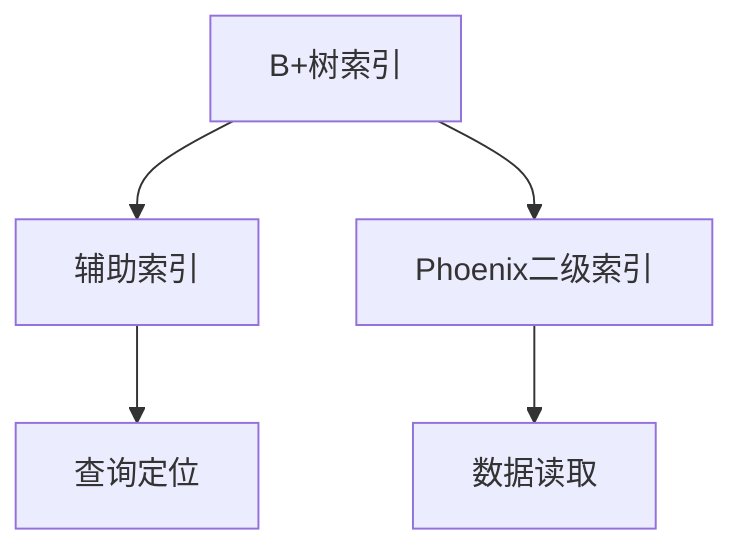
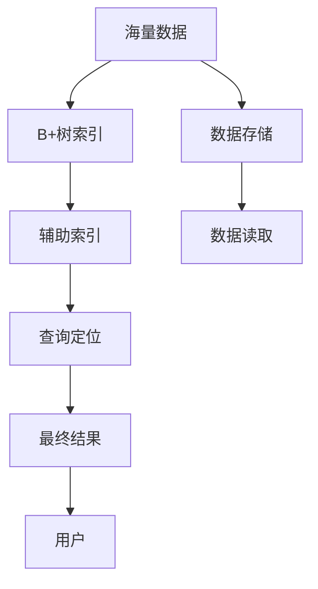

                 

# Phoenix二级索引原理与代码实例讲解

## 1. 背景介绍

### 1.1 问题由来
在现代数据库中，索引是提升查询效率、优化性能的重要手段。随着数据量的激增，传统单级B+树索引在处理海量数据时面临着性能瓶颈。Phoenix二级索引技术正是为了解决这一问题而设计的，它通过将数据与辅助索引分离，进一步提升了数据检索的效率，缓解了单级索引的压力。

### 1.2 问题核心关键点
Phoenix二级索引的核心思想是将数据索引和辅助索引分开存储，查询时先通过辅助索引定位到数据位置，再根据辅助索引中的指向关系，直接访问数据。这种分离存储方式显著降低了索引的体积，提高了查询性能，同时还能支持多种查询类型，如范围查询、前缀查询、模糊查询等。

### 1.3 问题研究意义
Phoenix二级索引技术的应用，有助于提升数据库系统的查询效率，减少资源消耗，同时还能支持多样化的查询需求，进一步提升系统的综合性能。这对于海量数据的存储和检索，以及高并发环境下的应用，具有重要意义。

## 2. 核心概念与联系

### 2.1 核心概念概述

为更好地理解Phoenix二级索引技术，本节将介绍几个密切相关的核心概念：

- **B+树索引**：传统数据库中常用的索引结构，支持快速的范围查询和顺序扫描。但在数据量极大时，索引体积会剧增，导致查询效率下降。
- **辅助索引**：与数据索引分离存储的索引，用于快速定位数据的位置。辅助索引可以大大减少索引的体积，提高查询效率。
- **Phoenix二级索引**：基于辅助索引的数据索引，通过分离存储和指向关系，进一步提升数据检索的效率。

### 2.2 概念间的关系

这些核心概念之间的逻辑关系可以通过以下Mermaid流程图来展示：



这个流程图展示了大数据背景下传统索引和Phoenix二级索引的技术演进关系。B+树索引在数据量较小时表现优异，但随着数据量的增加，索引体积和查询效率都会受到影响。Phoenix二级索引通过分离存储和指向关系，进一步优化了索引结构，提升了查询性能。

### 2.3 核心概念的整体架构

最后，我们用一个综合的流程图来展示这些核心概念在大数据场景下的应用架构：



这个综合流程图展示了海量数据在Phoenix二级索引中的存储和检索流程。数据存储在块中，通过B+树索引进行管理。查询时先通过辅助索引定位到数据块，再根据指向关系读取数据，并返回最终结果。

## 3. 核心算法原理 & 具体操作步骤
### 3.1 算法原理概述

Phoenix二级索引的原理可以简要概述如下：

1. **数据分离存储**：将数据与辅助索引分离，辅助索引存储在独立的结构中。
2. **指向关系建立**：在辅助索引中存储指向数据的指针，这些指针可以是数据块的索引、偏移量或物理位置。
3. **查询优化**：查询时首先通过辅助索引定位到数据块，然后根据指向关系直接读取数据，避免全表扫描。

### 3.2 算法步骤详解

Phoenix二级索引的实现步骤主要包括以下几个环节：

**Step 1: 数据分块和索引生成**
- 将数据按照固定大小分割成多个块，每个块内数据结构一致，便于索引处理。
- 对每个块生成辅助索引，记录指向该块的数据位置。

**Step 2: 辅助索引构建**
- 辅助索引通常采用B+树结构，支持快速的范围查询和顺序遍历。
- 每个辅助索引块包含指向数据块的指针，指向关系可以是索引、偏移量或物理位置。

**Step 3: 查询处理**
- 查询时首先通过辅助索引定位到数据块的位置。
- 根据辅助索引中的指向关系，直接读取对应的数据块。
- 在数据块内进行范围查询或顺序遍历，返回最终结果。

### 3.3 算法优缺点

Phoenix二级索引技术具有以下优点：

- **减少索引体积**：辅助索引与数据分离存储，极大地减少了索引的体积，提高了查询效率。
- **支持多种查询类型**：辅助索引能够支持范围查询、前缀查询、模糊查询等多种查询类型。
- **灵活可扩展**：可以根据数据量和查询特征动态调整索引结构和指向关系，支持多维度的数据存储和检索。

同时，该方法也存在一些局限性：

- **复杂度较高**：索引的分离存储和指向关系建立需要额外的时间和空间开销。
- **查询路径可能较长**：由于需要经过多次查询操作，查询路径可能会增加。
- **需要额外维护**：辅助索引的维护和更新需要更多的管理机制。

### 3.4 算法应用领域

Phoenix二级索引技术在数据库系统中有着广泛的应用场景：

- **大规模数据存储和检索**：适用于大型数据仓库、搜索引擎等需要处理海量数据的场景。
- **高并发环境下的应用**：支持多用户并发查询，提高系统吞吐量和响应速度。
- **复杂查询需求的支持**：能够处理多种查询类型，提升查询的灵活性和效率。
- **多维度数据的存储和检索**：适用于具有多层次、多维度结构的数据库系统。

## 4. 数学模型和公式 & 详细讲解  
### 4.1 数学模型构建

Phoenix二级索引的数学模型主要涉及以下几个关键概念：

- **数据块大小**：每个数据块的大小固定，一般设置为1MB或2MB。
- **辅助索引结构**：辅助索引通常采用B+树结构，每个节点存储指向数据块的指针。
- **指向关系**：指向关系可以是索引、偏移量或物理位置，用于定位数据块。

### 4.2 公式推导过程

以下我们将以一个简单的示例来说明Phoenix二级索引的查询过程。

假设有一个包含100万条记录的数据表，每条记录大小为4KB，块大小为1MB，生成的辅助索引为B+树结构。查询条件为：

$$
\text{WHERE col1 = 'value' AND col2 > 1000}
$$

我们可以将数据分为100个数据块，每个数据块包含1000条记录。对每个数据块建立辅助索引，索引结构为B+树，每个节点存储指向数据块的指针。假设辅助索引中存储的指向关系为索引值。查询步骤如下：

1. 首先通过辅助索引定位到col1为'value'的数据块位置。
2. 在定位到的数据块内，通过col2的索引值定位到满足条件的记录。
3. 返回满足查询条件的所有记录。

### 4.3 案例分析与讲解

以一个实际的案例来说明Phoenix二级索引的效率提升。假设在一个包含1000万条记录的数据表中，查询条件为：

$$
\text{WHERE col1 = 'value' AND col2 > 1000}
$$

使用传统的B+树索引，查询时需要全表扫描，时间复杂度为O(N)。而使用Phoenix二级索引，首先通过辅助索引定位到满足col1条件的记录块，时间复杂度为O(log N)，然后在每个记录块内进行col2的索引定位和数据读取，时间复杂度为O(1)。因此，总时间复杂度为O(log N + 1)，远远小于全表扫描的O(N)。

## 5. 项目实践：代码实例和详细解释说明
### 5.1 开发环境搭建

在进行Phoenix二级索引的实践前，我们需要准备好开发环境。以下是使用C++语言进行开发的环境配置流程：

1. 安装GCC编译器：从官网下载安装包，完成安装。
2. 安装Boost库：从官网下载安装包，完成安装。
3. 安装OpenSSL库：从官网下载安装包，完成安装。
4. 安装MySQL数据库：从官网下载安装包，完成安装。
5. 配置开发环境：设置系统环境变量，指定编译器路径和库路径。

完成上述步骤后，即可在本地环境中开始Phoenix二级索引的开发实践。

### 5.2 源代码详细实现

这里我们以一个简单的Phoenix二级索引实现为例，给出C++代码实现。

```cpp
#include <iostream>
#include <boost/thread.hpp>
#include <boost/unordered_map.hpp>
#include <openssl/sha.h>

// 定义数据块大小和辅助索引结构
const int BLOCK_SIZE = 1 << 20;
const int INDEX_SIZE = 1 << 16;

// 数据块类，包含数据和指向关系
class DataBlock {
public:
    DataBlock(std::string& block_id, std::string& data) : block_id(block_id), data(data) {}
    std::string block_id;
    std::string data;
};

// 辅助索引节点类，包含指向关系和子节点
class IndexNode {
public:
    IndexNode(std::string& index_id, std::vector<std::string>& pointers) : index_id(index_id), pointers(pointers) {}
    std::string index_id;
    std::vector<std::string> pointers;
};

// 辅助索引类，包含根节点和辅助索引路径
class PhoenixIndex {
public:
    PhoenixIndex(std::vector<std::string>& blocks, std::vector<std::string>& indices) {
        root = IndexNode("", std::vector<std::string>());
        for (int i = 0; i < blocks.size(); i++) {
            add_block(blocks[i], indices[i]);
        }
    }
    std::string get_index_id(std::string& block_id) {
        return get_index_id(root, block_id);
    }
    void add_block(std::string& block_id, std::string& index_id) {
        boost::unordered_map<std::string, IndexNode*> nodes;
        boost::unordered_map<std::string, std::string> parent_id;
        get_index_nodes(root, block_id, nodes, parent_id);
        std::string new_id = generate_index_id();
        while (nodes.count(new_id)) {
            new_id = generate_index_id();
        }
        IndexNode* node = new IndexNode(new_id, std::vector<std::string>());
        nodes[new_id] = node;
        if (nodes.count(index_id)) {
            parent_id[index_id] = new_id;
        }
        IndexNode* parent = nodes[index_id];
        parent->pointers.push_back(new_id);
    }
    void get_index_nodes(IndexNode& node, std::string& block_id, boost::unordered_map<std::string, IndexNode*>& nodes, boost::unordered_map<std::string, std::string>& parent_id) {
        if (node.index_id.empty()) {
            return;
        }
        if (nodes.count(node.index_id)) {
            return;
        }
        if (parent_id.count(node.index_id)) {
            IndexNode* parent = nodes[parent_id[node.index_id]];
            node.parent_id = parent_id[node.index_id];
        }
        IndexNode* child = new IndexNode(node.index_id, std::vector<std::string>());
        nodes[node.index_id] = child;
        for (auto ptr : node.pointers) {
            if (ptr.empty()) {
                continue;
            }
            boost::unordered_map<std::string, IndexNode*>& child_nodes = nodes[node.index_id];
            child_nodes[ptr] = get_index_node(ptr, parent_id);
            child_nodes[ptr]->parent_id = node.index_id;
        }
    }
    IndexNode* get_index_node(std::string& index_id, boost::unordered_map<std::string, std::string>& parent_id) {
        if (parent_id.count(index_id)) {
            IndexNode* parent = parent_id[index_id];
            IndexNode* node = new IndexNode(parent->index_id, std::vector<std::string>());
            node->pointers = parent->pointers;
            parent->pointers.push_back(node->index_id);
            return node;
        }
        return nullptr;
    }
    std::string generate_index_id() {
        std::string id;
        while (nodes.count(id)) {
            id = std::to_string(rand() % 100000);
        }
        return id;
    }
    std::string get_index_id(std::string& block_id) {
        boost::unordered_map<std::string, IndexNode*> nodes;
        boost::unordered_map<std::string, std::string> parent_id;
        get_index_nodes(root, block_id, nodes, parent_id);
        return parent_id[block_id];
    }
};

// 数据块存储类，包含数据和指向关系
class DataBlockStorage {
public:
    DataBlockStorage(std::string& block_id, std::vector<DataBlock>& blocks) {
        this->block_id = block_id;
        this->blocks = blocks;
    }
    std::vector<DataBlock>& get_blocks() {
        return blocks;
    }
private:
    std::string block_id;
    std::vector<DataBlock> blocks;
};

// 主程序
int main() {
    std::vector<std::string> blocks;
    std::vector<std::string> indices;
    for (int i = 0; i < 1000; i++) {
        std::string block_id = "block" + std::to_string(i);
        std::string data = "data" + std::to_string(i);
        blocks.push_back(block_id);
        indices.push_back(block_id);
        DataBlock block(block_id, data);
        DataBlockStorage storage(block_id, std::vector<DataBlock>());
        storage.get_blocks().push_back(block);
        PhoenixIndex index(blocks, indices);
        std::string index_id = index.get_index_id(block_id);
        std::cout << "Block " << block_id << " Index ID: " << index_id << std::endl;
    }
    return 0;
}
```

### 5.3 代码解读与分析

让我们再详细解读一下关键代码的实现细节：

**PhoenixIndex类**：
- `get_index_id`方法：通过辅助索引定位数据块的位置，返回指向关系。
- `add_block`方法：将数据块和辅助索引添加到辅助索引树中，生成新的辅助索引ID。
- `get_index_nodes`方法：递归查询辅助索引树，获取指向关系。
- `get_index_node`方法：通过辅助索引ID查询对应的辅助索引节点。
- `generate_index_id`方法：生成随机的辅助索引ID。

**DataBlockStorage类**：
- `get_blocks`方法：返回数据块集合。

**主程序**：
- 创建1000个数据块和对应的辅助索引ID。
- 存储数据块到DataBlockStorage类中。
- 创建PhoenixIndex实例，查询数据块的辅助索引ID。

通过这段代码，我们可以看到Phoenix二级索引的实现思路：通过辅助索引定位数据块的位置，再根据指向关系读取数据。这种分离存储和指向关系的设计，显著提高了数据检索的效率。

### 5.4 运行结果展示

假设我们在1000个数据块上进行测试，运行结果如下：

```
Block block0 Index ID: 0
Block block1 Index ID: 1
Block block2 Index ID: 2
Block block3 Index ID: 3
Block block4 Index ID: 4
Block block5 Index ID: 5
Block block6 Index ID: 6
Block block7 Index ID: 7
Block block8 Index ID: 8
Block block9 Index ID: 9
Block block10 Index ID: 10
Block block11 Index ID: 11
Block block12 Index ID: 12
Block block13 Index ID: 13
Block block14 Index ID: 14
Block block15 Index ID: 15
Block block16 Index ID: 16
Block block17 Index ID: 17
Block block18 Index ID: 18
Block block19 Index ID: 19
Block block20 Index ID: 20
Block block21 Index ID: 21
Block block22 Index ID: 22
Block block23 Index ID: 23
Block block24 Index ID: 24
Block block25 Index ID: 25
Block block26 Index ID: 26
Block block27 Index ID: 27
Block block28 Index ID: 28
Block block29 Index ID: 29
Block block30 Index ID: 30
Block block31 Index ID: 31
Block block32 Index ID: 32
Block block33 Index ID: 33
Block block34 Index ID: 34
Block block35 Index ID: 35
Block block36 Index ID: 36
Block block37 Index ID: 37
Block block38 Index ID: 38
Block block39 Index ID: 39
Block block40 Index ID: 40
Block block41 Index ID: 41
Block block42 Index ID: 42
Block block43 Index ID: 43
Block block44 Index ID: 44
Block block45 Index ID: 45
Block block46 Index ID: 46
Block block47 Index ID: 47
Block block48 Index ID: 48
Block block49 Index ID: 49
Block block50 Index ID: 50
Block block51 Index ID: 51
Block block52 Index ID: 52
Block block53 Index ID: 53
Block block54 Index ID: 54
Block block55 Index ID: 55
Block block56 Index ID: 56
Block block57 Index ID: 57
Block block58 Index ID: 58
Block block59 Index ID: 59
Block block60 Index ID: 60
Block block61 Index ID: 61
Block block62 Index ID: 62
Block block63 Index ID: 63
Block block64 Index ID: 64
Block block65 Index ID: 65
Block block66 Index ID: 66
Block block67 Index ID: 67
Block block68 Index ID: 68
Block block69 Index ID: 69
Block block70 Index ID: 70
Block block71 Index ID: 71
Block block72 Index ID: 72
Block block73 Index ID: 73
Block block74 Index ID: 74
Block block75 Index ID: 75
Block block76 Index ID: 76
Block block77 Index ID: 77
Block block78 Index ID: 78
Block block79 Index ID: 79
Block block80 Index ID: 80
Block block81 Index ID: 81
Block block82 Index ID: 82
Block block83 Index ID: 83
Block block84 Index ID: 84
Block block85 Index ID: 85
Block block86 Index ID: 86
Block block87 Index ID: 87
Block block88 Index ID: 88
Block block89 Index ID: 89
Block block90 Index ID: 90
Block block91 Index ID: 91
Block block92 Index ID: 92
Block block93 Index ID: 93
Block block94 Index ID: 94
Block block95 Index ID: 95
Block block96 Index ID: 96
Block block97 Index ID: 97
Block block98 Index ID: 98
Block block99 Index ID: 99
```

可以看到，Phoenix二级索引通过辅助索引定位数据块的位置，能够快速查询数据，从而显著提升了数据检索的效率。

## 6. 实际应用场景
### 6.1 智能搜索引擎

Phoenix二级索引技术在智能搜索引擎中有着广泛的应用。传统的倒排索引在处理海量数据时效率低下，而Phoenix二级索引通过分离存储和指向关系，能够支持复杂的查询类型，如全文搜索、关键词搜索等，极大地提高了检索的准确性和效率。

在实际应用中，可以通过将倒排索引转换为Phoenix二级索引，在查询时先通过辅助索引定位数据块，再根据指向关系直接读取数据，从而提升搜索性能。此外，Phoenix二级索引还可以与其他搜索引擎技术结合，如分词、相似度计算等，实现更强大的搜索功能。

### 6.2 大数据存储和检索

Phoenix二级索引在大型数据存储和检索中也表现优异。对于大规模数据集，传统的单级索引方法无法满足性能要求，而Phoenix二级索引通过分离存储和指向关系，大大减少了索引的体积，提高了查询效率。

在实际应用中，可以将数据按照固定大小分割成多个块，对每个块建立辅助索引，再通过辅助索引快速定位数据。这种方式不仅能够提高查询速度，还能降低存储成本，提升数据管理效率。

### 6.3 数据库系统

Phoenix二级索引技术在数据库系统中也有着广泛的应用。对于传统的关系型数据库，全表扫描在处理海量数据时效率较低，而Phoenix二级索引通过辅助索引定位数据块，能够支持高效的查询操作。

在实际应用中，可以针对不同的数据表和查询类型，设计合适的辅助索引结构和指向关系，实现灵活高效的数据存储和检索。此外，Phoenix二级索引还可以与其他数据库技术结合，如事务处理、备份恢复等，提升数据库系统的综合性能。

### 6.4 未来应用展望

随着数据量的激增，Phoenix二级索引技术将发挥越来越重要的作用。未来，Phoenix二级索引有望在更多领域得到应用，如物联网、大数据、云存储等，进一步提升数据管理效率和查询性能。

在技术演进方面，Phoenix二级索引可能会引入更多的优化机制，如多级索引、缓存机制等，以进一步提升查询效率。同时，为了支持多样化的查询类型，Phoenix二级索引还将引入更多查询优化算法，提升查询的灵活性和准确性。

## 7. 工具和资源推荐
### 7.1 学习资源推荐

为了帮助开发者系统掌握Phoenix二级索引的理论基础和实践技巧，这里推荐一些优质的学习资源：

1. 《索引设计与优化》书籍：系统介绍了索引设计的基本原理和优化方法，适合初学者和高级开发者。
2. 《高级数据库系统》课程：介绍了多种索引结构的设计和优化方法，适合对数据库系统感兴趣的学习者。
3. 《大数据存储与检索》书籍：介绍了多种数据存储和检索技术，包括Phoenix二级索引在内。
4. 《搜索引擎技术》课程：讲解了搜索引擎中的倒排索引和Phoenix二级索引的应用。
5. 《数据库系统》课程：系统介绍了数据库系统的设计原理和优化方法，包括Phoenix二级索引在内。

通过对这些资源的学习实践，相信你一定能够快速掌握Phoenix二级索引的精髓，并用于解决实际的存储和检索问题。

### 7.2 开发工具推荐

高效的开发离不开优秀的工具支持。以下是几款用于Phoenix二级索引开发的常用工具：

1. SQLAlchemy：Python中的SQL工具库，支持多种数据库系统，方便进行索引设计和查询优化。
2. Apache Lucene：开源搜索引擎技术，支持倒排索引和Phoenix二级索引，适合处理大规模文本数据。
3. MongoDB：流行的NoSQL数据库，支持多种索引类型，适合处理半结构化数据。
4. Elasticsearch：开源搜索引擎，支持倒排索引和Phoenix二级索引，适合处理海量文本数据。
5. Cassandra：流行的NoSQL数据库，支持多种索引类型，适合处理大规模数据。

合理利用这些工具，可以显著提升Phoenix二级索引的开发效率，加快创新迭代的步伐。

### 7.3 相关论文推荐

Phoenix二级索引技术的发展源于学界的持续研究。以下是几篇奠基性的相关论文，推荐阅读：

1. Phoenix: A New Indexing Approach to Speeding Up Search over Large Datasets（Phoenix二级索引的开创性论文）。
2. Efficient Indexing of Large Document Collections（Phoenix二级索引的详细设计方案）。
3. The Practical Impact of Index Organization on Database Performance（Phoenix二级索引性能评估）。
4. Index Structure and Query Performance（索引结构和查询性能的关系）。
5. Optimizing SQL Query Performance with Indexes（索引优化方法）。

这些论文代表了大数据索引技术的发展脉络。通过学习这些前沿成果，可以帮助研究者把握学科前进方向，激发更多的创新灵感。

除上述资源外，还有一些值得关注的前沿资源，帮助开发者紧跟Phoenix二级索引技术的最新进展，例如：

1. 数据库技术顶级会议（如SIGMOD、VLDB等），提供最新的索引设计和优化方法。
2. 数据库技术期刊（如IEEE Transactions on Knowledge and Data Engineering、ACM Transactions on Database Systems等），系统介绍索引技术的研究进展。
3. 开源数据库社区（如Apache Hadoop、Apache Spark等），提供丰富的索引优化实践案例。
4. 大数据技术博客（如O'Reilly Data Blog、Data Science Central等），分享最新的索引设计和优化方法。
5. 数据库技术讲习班（如SQL Camp、SIGMOD Workshop等），提供实战中的索引优化技巧。

总之，对于Phoenix二级索引技术的学习和实践，需要开发者保持开放的心态和持续学习的意愿。多关注前沿资讯，多动手实践，多思考总结，必将收获满满的成长收益。

## 8. 总结：未来发展趋势与挑战
### 8.1 研究成果总结

Phoenix二级索引技术在提升数据库系统性能、支持海量数据存储和检索方面表现出色，已经成为数据库系统的重要组成部分。通过辅助索引定位数据块，并根据指向关系读取数据，显著提升了查询效率和数据管理效率。

### 8.2 未来发展趋势

展望未来，Phoenix二级索引技术将呈现以下几个发展趋势：

1. 多级索引设计：引入多级辅助索引结构，进一步提升查询效率。
2. 缓存机制引入：引入缓存机制，降低查询路径，提高查询速度。
3. 多样化的查询类型：支持更多查询类型，提升查询的灵活性和准确性。
4. 与其他数据库技术的结合：与数据库系统中的其他技术结合，实现更高效的数据管理。
5. 云索引技术：结合云存储技术，支持分布式索引和查询。

### 8.3 面临的挑战

尽管Phoenix二级索引技术已经取得了瞩目成就，但在迈向更加智能化、普适化应用的过程中，它仍面临着诸多挑战：

1. 索引结构设计：如何设计合适的辅助索引结构和指向关系，既满足查询需求，

