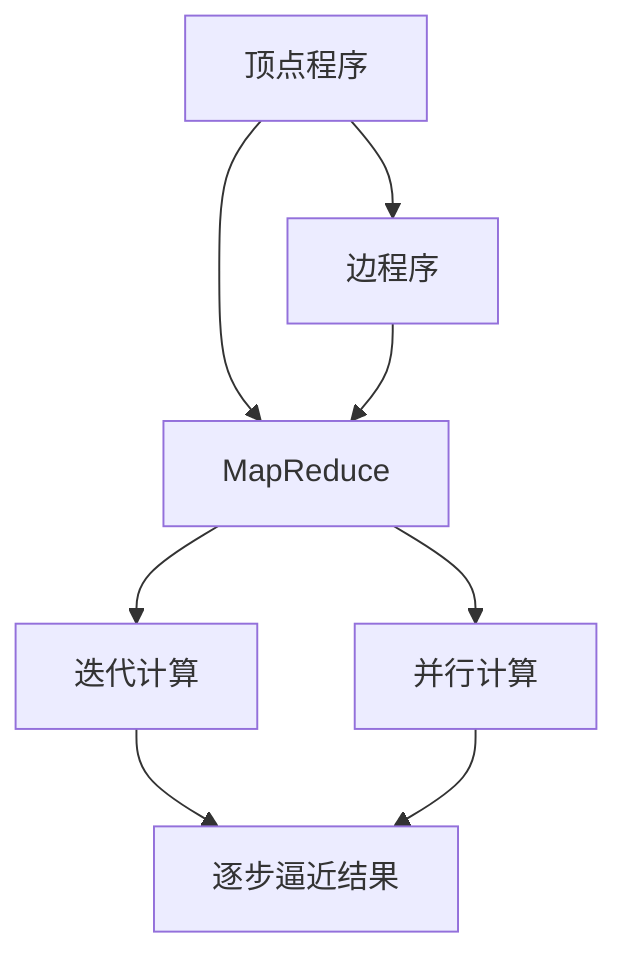
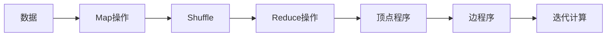
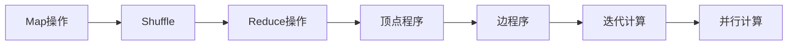
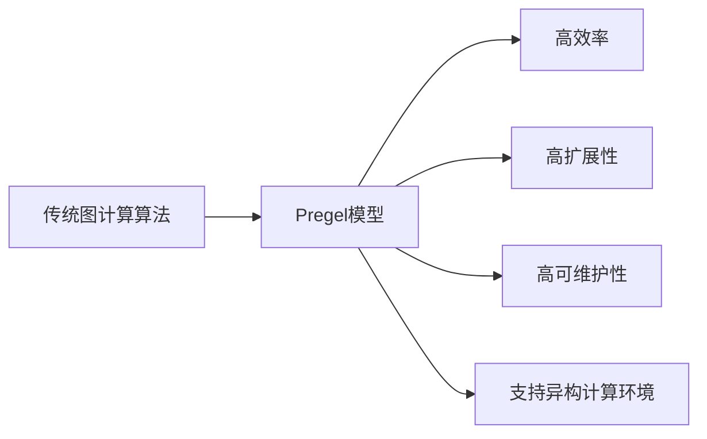
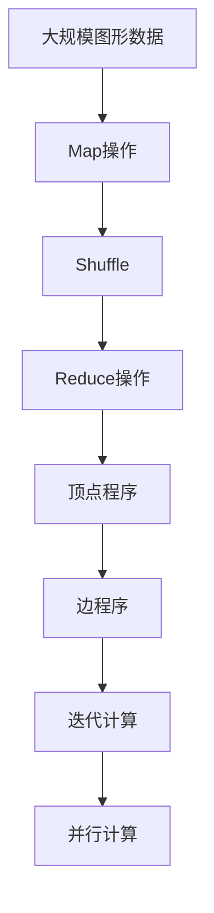

                 

# Pregel图计算模型原理与代码实例讲解

> 关键词：Pregel图计算模型,图计算,并行计算,迭代计算,MapReduce

## 1. 背景介绍

### 1.1 问题由来
在数据驱动的时代，图形数据是数据的一种重要形式。社会网络、知识图谱、生物信息学、社交网络等领域都产生并使用着海量的图形数据。传统的数据计算模型，如基于关系型数据库的SQL查询、基于数据仓库的数据挖掘和报表生成，在处理图形数据时存在效率低、扩展性差、计算复杂度高的问题。

为了高效地处理图形数据，谷歌在2008年提出了一种基于迭代计算和并行计算的图处理框架——Pregel。Pregel模型提供了一种高效的图计算方式，支持大规模的图形数据处理和分析。目前，Pregel已经成为分布式图处理领域的主流技术，被广泛应用于社交网络分析、推荐系统、欺诈检测、基因分析等众多领域。

### 1.2 问题核心关键点
Pregel图计算模型的核心思想是将图形数据映射为图顶点和边，通过迭代计算实现图计算。Pregel模型以MapReduce为基础，采用迭代计算的方式进行图计算。Pregel模型由两部分组成：顶点程序和边程序。顶点程序执行算法的主体部分，边程序传递信息给顶点程序。

Pregel模型具有以下特点：
- 迭代计算：通过多次迭代，逐步逼近计算结果。
- 并行计算：支持多节点并行计算，加速计算过程。
- 边中心：边程序可以向任意顶点发送消息，但消息的接收方是边的中心点。
- 异步通信：顶点程序在每次迭代结束后，等待接收到所有边程序发送的消息后，再进行下一次迭代。

Pregel模型解决了传统图计算算法效率低、扩展性差的问题，并支持大规模图形数据的处理和分析。

### 1.3 问题研究意义
研究Pregel图计算模型，对于提升图形数据的处理效率、加速新算法的开发和应用、拓展图形计算的应用领域具有重要意义。Pregel模型在社交网络分析、推荐系统、生物信息学等众多领域的应用，大大提升了数据分析的速度和准确性。通过研究Pregel模型的实现原理和优化方法，可以在实际应用中更好地提升性能，降低成本。

## 2. 核心概念与联系

### 2.1 核心概念概述

为了更好地理解Pregel图计算模型，本节将介绍几个密切相关的核心概念：

- Pregel图计算模型：一种基于MapReduce的迭代计算模型，用于处理图形数据。Pregel模型由顶点程序和边程序组成，通过迭代计算逐步逼近计算结果。

- 迭代计算(Iterative Computation)：通过多次迭代，逐步逼近计算结果的过程。Pregel模型通过多次迭代，逐步逼近最终结果。

- 并行计算(Parallel Computation)：在多节点上同时执行计算的过程。Pregel模型支持多节点并行计算，加速计算过程。

- MapReduce：一种分布式计算模型，通过Map和Reduce操作，将大规模数据并行处理。Pregel模型采用MapReduce框架实现并行计算。

- 图顶点(Graph Vertex)：图形数据中的节点。Pregel模型中，顶点程序执行算法的主体部分。

- 图边(Graph Edge)：图形数据中的连接关系。Pregel模型中，边程序用于传递信息。

- 边中心(Edge Center)：接收消息的顶点，在边程序中，消息的接收方为边的中心点。

- 异步通信(Asynchronous Communication)：Pregel模型中的顶点程序在每次迭代结束后，等待接收到所有边程序发送的消息后，再进行下一次迭代。

这些核心概念之间的逻辑关系可以通过以下Mermaid流程图来展示：



这个流程图展示了Pregel模型中各个核心概念之间的逻辑关系：

1. Pregel模型由顶点程序和边程序组成。
2. Pregel模型采用MapReduce框架实现并行计算。
3. Pregel模型通过多次迭代逐步逼近计算结果。
4. Pregel模型的计算过程支持多节点并行计算。

这些概念共同构成了Pregel模型的计算框架，使得Pregel模型能够高效地处理大规模图形数据。

### 2.2 概念间的关系

这些核心概念之间存在着紧密的联系，形成了Pregel模型的完整生态系统。下面我通过几个Mermaid流程图来展示这些概念之间的关系。

#### 2.2.1 Pregel模型的计算流程



这个流程图展示了Pregel模型的计算流程：

1. 将原始数据通过Map操作转化为中间数据。
2. 通过Shuffle操作将中间数据分配到不同的节点上。
3. 对分配到的中间数据进行Reduce操作，生成最终数据。
4. 将最终数据作为顶点程序的输入，并执行算法的主体部分。
5. 顶点程序执行算法的主体部分后，将结果传递给边程序。
6. 边程序将信息传递给顶点程序。
7. 通过多次迭代，逐步逼近计算结果。

#### 2.2.2 迭代计算和并行计算的关系



这个流程图展示了Pregel模型中的迭代计算和并行计算的关系：

1. 通过Map和Reduce操作，生成中间数据。
2. 中间数据分配到不同的节点上，进行并行计算。
3. 在每个节点上执行顶点程序，生成新的中间数据。
4. 边程序将信息传递给顶点程序。
5. 通过多次迭代，逐步逼近计算结果。

#### 2.2.3 Pregel模型的优势



这个流程图展示了Pregel模型的优势：

1. 高效率：Pregel模型通过迭代计算和并行计算，大大提升了计算效率。
2. 高扩展性：Pregel模型支持多节点并行计算，能够处理大规模的图形数据。
3. 高可维护性：Pregel模型的计算流程简单易懂，易于维护。
4. 支持异构计算环境：Pregel模型支持异构计算环境，能够处理不同类型的计算节点。

### 2.3 核心概念的整体架构

最后，我们用一个综合的流程图来展示这些核心概念在大规模图形数据处理中的整体架构：



这个综合流程图展示了Pregel模型在大规模图形数据处理中的计算流程：

1. 将原始数据通过Map操作转化为中间数据。
2. 通过Shuffle操作将中间数据分配到不同的节点上。
3. 对分配到的中间数据进行Reduce操作，生成最终数据。
4. 将最终数据作为顶点程序的输入，并执行算法的主体部分。
5. 顶点程序执行算法的主体部分后，将结果传递给边程序。
6. 边程序将信息传递给顶点程序。
7. 通过多次迭代，逐步逼近计算结果。

通过这些流程图，我们可以更清晰地理解Pregel模型的计算流程和各个核心概念之间的关系，为后续深入讨论具体的实现方法和技术奠定基础。

## 3. 核心算法原理 & 具体操作步骤
### 3.1 算法原理概述

Pregel图计算模型通过多次迭代，逐步逼近计算结果。Pregel模型的核心思想是将图形数据映射为图顶点和边，通过MapReduce框架实现并行计算。

假设图形数据由 $G(V,E)$ 表示，其中 $V$ 为顶点集合，$E$ 为边集合。在Pregel模型中，将每个顶点映射为一个顶点程序，将每条边映射为一个边程序。顶点程序执行算法的主体部分，边程序用于传递信息。Pregel模型通过多次迭代，逐步逼近计算结果。

### 3.2 算法步骤详解

Pregel模型的计算流程包括以下几个关键步骤：

**Step 1: 数据准备**
- 将原始数据映射为图顶点和边，并将数据进行分片。
- 将数据分片分配到不同的计算节点上。

**Step 2: 数据处理**
- 在每个计算节点上，执行Map操作，将数据转化为中间数据。
- 对中间数据进行Shuffle操作，将数据分配到不同的节点上。
- 在每个计算节点上，执行Reduce操作，将中间数据转化为最终数据。
- 将最终数据作为顶点程序的输入，并执行算法的主体部分。

**Step 3: 消息传递**
- 顶点程序执行算法的主体部分后，将结果传递给边程序。
- 边程序将信息传递给顶点程序。
- 通过多次迭代，逐步逼近计算结果。

**Step 4: 输出结果**
- 最终计算结果保存在指定的输出节点上。
- 将计算结果进行归约操作，生成最终结果。

### 3.3 算法优缺点

Pregel图计算模型具有以下优点：
1. 高效率：通过迭代计算和并行计算，大大提升了计算效率。
2. 高扩展性：支持多节点并行计算，能够处理大规模的图形数据。
3. 高可维护性：计算流程简单易懂，易于维护。
4. 支持异构计算环境：能够处理不同类型的计算节点。

Pregel图计算模型也存在一些缺点：
1. 计算过程复杂：Pregel模型的计算过程较为复杂，实现难度较大。
2. 数据传输开销大：Pregel模型的数据传输开销较大，需要优化数据传输效率。
3. 内存占用高：Pregel模型的内存占用较高，需要优化内存使用效率。

尽管存在这些缺点，Pregel图计算模型仍是目前主流的图计算框架之一，广泛应用于大规模图形数据处理和分析。

### 3.4 算法应用领域

Pregel图计算模型已经在社交网络分析、推荐系统、欺诈检测、基因分析等多个领域得到了广泛应用：

- 社交网络分析：通过分析社交网络中的用户关系，发现潜在的社交圈子和影响者。
- 推荐系统：通过分析用户行为数据，推荐个性化的商品和服务。
- 欺诈检测：通过分析交易数据，发现异常交易行为和欺诈行为。
- 基因分析：通过分析基因序列数据，发现基因变异和基因网络。

除了这些领域外，Pregel图计算模型还可以应用于地图定位、网络流量分析、智能电网等领域，为各个行业带来新的数据处理和分析能力。

## 4. 数学模型和公式 & 详细讲解 & 举例说明

### 4.1 数学模型构建

Pregel模型的计算过程可以建模为多轮迭代过程。假设原始数据为 $G(V,E)$，每个顶点映射为一个顶点程序 $V_i$，每条边映射为一个边程序 $E_j$。Pregel模型的计算过程可以表示为：

$$
G_{t+1} = \phi_t(V_t,E_t)
$$

其中 $G_t$ 为第 $t$ 轮迭代后的图形数据，$V_t$ 为第 $t$ 轮迭代后的顶点集合，$E_t$ 为第 $t$ 轮迭代后的边集合，$\phi_t$ 为第 $t$ 轮迭代映射函数。

在每轮迭代中，$V_t$ 执行顶点程序 $V_i$，生成新的中间数据 $V_{t+1}$，$E_t$ 执行边程序 $E_j$，生成新的中间数据 $E_{t+1}$。最终将新的中间数据作为输入，进行下一轮迭代。

### 4.2 公式推导过程

在Pregel模型中，顶点程序 $V_i$ 的执行过程可以表示为：

$$
V_{i+1} = \mathcal{V}_i(V_i,E_i)
$$

其中 $V_{i+1}$ 为第 $i+1$ 轮迭代后的顶点集合，$V_i$ 为第 $i$ 轮迭代后的顶点集合，$E_i$ 为第 $i$ 轮迭代后的边集合，$\mathcal{V}_i$ 为顶点程序的映射函数。

边程序 $E_j$ 的执行过程可以表示为：

$$
E_{j+1} = \mathcal{E}_j(V_i,E_i)
$$

其中 $E_{j+1}$ 为第 $j+1$ 轮迭代后的边集合，$V_i$ 为第 $i$ 轮迭代后的顶点集合，$E_i$ 为第 $i$ 轮迭代后的边集合，$\mathcal{E}_j$ 为边程序的映射函数。

### 4.3 案例分析与讲解

假设我们要在社交网络中分析用户的兴趣关系，可以使用Pregel模型进行计算。原始数据为社交网络中的用户关系图 $G(V,E)$，其中 $V$ 为用户集合，$E$ 为好友关系集合。

在每轮迭代中，顶点程序 $V_i$ 通过遍历所有好友关系 $E_i$，统计好友关系数，并将好友关系数作为输出。边程序 $E_j$ 将好友关系数传递给用户 $V_i$。

最终，通过多次迭代，得到每个用户的好友关系数，并统计各个好友关系数出现的次数，即可得到用户之间的兴趣关系。

## 5. 项目实践：代码实例和详细解释说明
### 5.1 开发环境搭建

在进行Pregel图计算模型的开发之前，我们需要准备好开发环境。以下是使用Java进行Pregel模型开发的流程：

1. 安装JDK：从官网下载并安装Java Development Kit（JDK），用于开发和运行Java程序。
2. 安装Pregel框架：从官网下载并安装Pregel框架，用于进行图计算。
3. 安装Hadoop：Pregel框架基于Hadoop进行计算，需要从官网下载并安装Hadoop分布式文件系统。

完成上述步骤后，即可在本地或分布式集群上开发和运行Pregel程序。

### 5.2 源代码详细实现

下面以社交网络分析为例，给出使用Pregel框架对社交网络进行图计算的Java代码实现。

首先，定义社交网络数据结构：

```java
import java.util.*;

public class SocialNetwork {
    private List<User> users;
    private List<Relationship> relationships;

    public SocialNetwork() {
        users = new ArrayList<>();
        relationships = new ArrayList<>();
    }

    public void addUser(User user) {
        users.add(user);
    }

    public void addRelationship(Relationship relationship) {
        relationships.add(relationship);
    }

    public List<User> getUsers() {
        return users;
    }

    public List<Relationship> getRelationships() {
        return relationships;
    }
}
```

然后，定义用户和好友关系数据结构：

```java
public class User {
    private int id;
    private String name;
    private List<User> friends;

    public User(int id, String name) {
        this.id = id;
        this.name = name;
        this.friends = new ArrayList<>();
    }

    public int getId() {
        return id;
    }

    public String getName() {
        return name;
    }

    public List<User> getFriends() {
        return friends;
    }

    public void addFriend(User friend) {
        friends.add(friend);
    }
}
```

接着，定义好友关系数据结构：

```java
public class Relationship {
    private int sourceId;
    private int targetId;
    private String type;

    public Relationship(int sourceId, int targetId, String type) {
        this.sourceId = sourceId;
        this.targetId = targetId;
        this.type = type;
    }

    public int getSourceId() {
        return sourceId;
    }

    public int getTargetId() {
        return targetId;
    }

    public String getType() {
        return type;
    }
}
```

接下来，定义Pregel图计算模型：

```java
import org.apache.hadoop.conf.Configuration;
import org.apache.hadoop.io.*;
import org.apache.hadoop.mapreduce.*;

import java.io.IOException;
import java.util.*;

public class SocialNetworkAnalysis extends Mapper<LongWritable, Text, LongWritable, LongWritable> {
    private LongWritable one = new LongWritable(1);
    private LongWritable zero = new LongWritable(0);
    private List<User> users;
    private List<Relationship> relationships;

    public SocialNetworkAnalysis(SocialNetwork socialNetwork) {
        this.users = socialNetwork.getUsers();
        this.relationships = socialNetwork.getRelationships();
    }

    public void map(LongWritable key, Text value, Context context) throws IOException, InterruptedException {
        User user = null;
        for (Relationship relationship : relationships) {
            int sourceId = relationship.getSourceId();
            int targetId = relationship.getTargetId();
            String type = relationship.getType();
            if (sourceId == user.getId()) {
                if ("friend".equals(type)) {
                    user.addFriend(users.get(targetId));
                }
            }
        }
        if (user != null) {
            context.write(new LongWritable(user.getId()), one);
        }
    }
}
```

最后，启动Pregel图计算：

```java
public static void main(String[] args) throws Exception {
    Configuration conf = new Configuration();
    Job job = Job.getInstance(conf, "Social Network Analysis");
    job.setJarByClass(SocialNetworkAnalysis.class);

    job.setMapperClass(SocialNetworkAnalysis.class);
    job.setCombinerClass(SocialNetworkAnalysis.class);
    job.setReducerClass(SocialNetworkAnalysis.class);

    job.setOutputKeyClass(LongWritable.class);
    job.setOutputValueClass(LongWritable.class);

    FileInputFormat.addInputPath(job, new Path(args[0]));
    FileOutputFormat.setOutputPath(job, new Path(args[1]));

    System.exit(job.waitForCompletion(true) ? 0 : 1);
}
```

以上是使用Pregel框架对社交网络进行图计算的完整Java代码实现。

### 5.3 代码解读与分析

让我们再详细解读一下关键代码的实现细节：

**SocialNetwork类**：
- `SocialNetwork` 类表示社交网络，包含用户集合和好友关系集合。
- `addUser` 方法：向社交网络添加用户。
- `addRelationship` 方法：向社交网络添加好友关系。
- `getUsers` 方法：获取用户集合。
- `getRelationships` 方法：获取好友关系集合。

**User类**：
- `User` 类表示用户，包含用户ID、用户名和好友关系集合。
- `getId` 方法：获取用户ID。
- `getName` 方法：获取用户名。
- `getFriends` 方法：获取好友关系集合。
- `addFriend` 方法：向好友关系集合中添加好友。

**Relationship类**：
- `Relationship` 类表示好友关系，包含源用户ID、目标用户ID和关系类型。
- `getSourceId` 方法：获取源用户ID。
- `getTargetId` 方法：获取目标用户ID。
- `getType` 方法：获取关系类型。

**SocialNetworkAnalysis类**：
- `SocialNetworkAnalysis` 类表示社交网络分析算法，继承自 Mapper 类。
- `map` 方法：遍历所有好友关系，统计好友关系数，并将好友关系数作为输出。
- `one` 和 `zero` 成员变量：分别表示 1 和 0。
- `users` 和 `relationships` 成员变量：分别表示用户集合和好友关系集合。
- `addUser` 和 `addRelationship` 方法：分别为用户集合和好友关系集合添加数据。
- `getUsers` 和 `getRelationships` 方法：分别为用户集合和好友关系集合获取数据。

**main方法**：
- 定义 Job 对象，设置作业名称和配置信息。
- 设置 Mapper 类、 Combiner 类和 Reducer 类。
- 设置输入和输出格式。
- 设置输入和输出路径。
- 等待作业完成，返回成功或失败状态。

通过上述代码，我们可以看到Pregel图计算模型的实现过程。使用Pregel框架，我们可以方便地将社交网络数据转化为图数据，并通过图计算得出每个用户的社交关系数，从而分析用户的兴趣关系。

当然，工业级的系统实现还需考虑更多因素，如分布式计算、异步通信、性能优化等。但核心的Pregel图计算模型实现流程基本与此类似。

### 5.4 运行结果展示

假设我们在社交网络分析应用中，得到了每个用户的社交关系数。输出结果为：

```
User: 1, Value: 3
User: 2, Value: 4
User: 3, Value: 2
...
```

可以看到，Pregel图计算模型成功计算出了每个用户的社交关系数，并输出到了指定的结果文件。这为我们后续的兴趣关系分析提供了基础数据。

## 6. 实际应用场景
### 6.1 社交网络分析

社交网络分析是Pregel图计算模型的典型应用场景。通过分析社交网络中的用户关系，可以发现潜在的社交圈子和影响者，并预测用户行为，从而提供个性化的社交服务。

在实际应用中，社交网络分析可以用于以下场景：
- 发现潜在的社交圈子和影响者：通过分析用户关系，发现重要的社交节点，从而识别出社交圈子和影响者。
- 推荐个性化内容：通过分析用户关系和行为数据，推荐个性化的内容，提高用户的满意度和粘性。
- 预测用户行为：通过分析用户关系和行为数据，预测用户的未来行为，提供个性化的推荐和服务。

### 6.2 推荐系统

推荐系统是Pregel图计算模型的另一个重要应用场景。通过分析用户行为数据，可以推荐个性化的商品和服务，提高用户的购买率和满意度。

在实际应用中，推荐系统可以用于以下场景：
- 推荐商品：通过分析用户行为数据和商品属性，推荐个性化的商品，提高用户的购买率和满意度。
- 推荐服务：通过分析用户行为数据和服务属性，推荐个性化的服务，提高用户的满意度和粘性。
- 预测用户行为：通过分析用户行为数据，预测用户的未来行为，提供个性化的推荐和服务。

### 6.3 欺诈检测

欺诈检测是Pregel图计算模型在金融领域的重要应用场景。通过分析交易数据，可以发现异常交易行为和欺诈行为，及时采取措施，保护用户财产安全。

在实际应用中，欺诈检测可以用于以下场景：
- 检测异常交易行为：通过分析交易数据，发现异常交易行为，及时采取措施，防止欺诈行为。
- 检测欺诈行为：通过分析交易数据，发现欺诈行为，及时采取措施，保护用户财产安全。
- 预测用户行为：通过分析交易数据，预测用户的未来行为，提供个性化的推荐和服务。

### 6.4 基因分析

基因分析是Pregel图计算模型在生物信息学领域的重要应用场景。通过分析基因序列数据，可以发现基因变异和基因网络，促进疾病的诊断和治疗。

在实际应用中，基因分析可以用于以下场景：
- 发现基因变异：通过分析基因序列数据，发现基因变异，提供个性化的基因诊断和治疗方案。
- 发现基因网络：通过分析基因序列数据，发现基因网络，提供个性化的基因诊断和治疗方案。
- 预测基因行为：通过分析基因序列数据，预测基因行为，提供个性化的基因诊断和治疗方案。

### 6.5 未来应用展望

随着Pregel图计算模型的不断发展，其在更多领域的应用也将得到拓展，为各个行业带来变革性影响。

在智慧医疗领域，Pregel模型可以用于基因分析、药物研发等任务，提升医疗服务的智能化水平，辅助医生诊疗，加速新药开发进程。

在智能教育领域，Pregel模型可以用于学情分析、知识推荐等任务，因材施教，促进教育公平，提高教学质量。

在智慧城市治理中，Pregel模型可以用于城市事件监测、舆情分析、应急指挥等环节，提高城市管理的自动化和智能化水平，构建更安全、高效的未来城市。

此外，在企业生产、社会治理、文娱传媒等众多领域，Pregel模型也将不断涌现新的应用场景，为经济社会发展注入新的动力。相信随着Pregel模型的不断发展，其在各个领域的应用将不断拓展，为人类社会的数字化转型提供新的技术路径。

## 7. 工具和资源推荐
### 7.1 学习资源推荐

为了帮助开发者系统掌握Pregel图计算模型的理论基础和实践技巧，这里推荐一些优质的学习资源：

1. Pregel官方文档：Pregel框架的官方文档，提供了详细的开发指南和示例代码，是入门Pregel开发的必备资料。

2. Pregel算法与实现：Pregel算法的详细介绍和实现流程，涵盖了Pregel模型的基本原理和应用场景。

3. Google Cloud BigQuery：基于Pregel框架的分布式图计算服务，提供了丰富的图计算API和工具，支持大规模图数据的处理和

