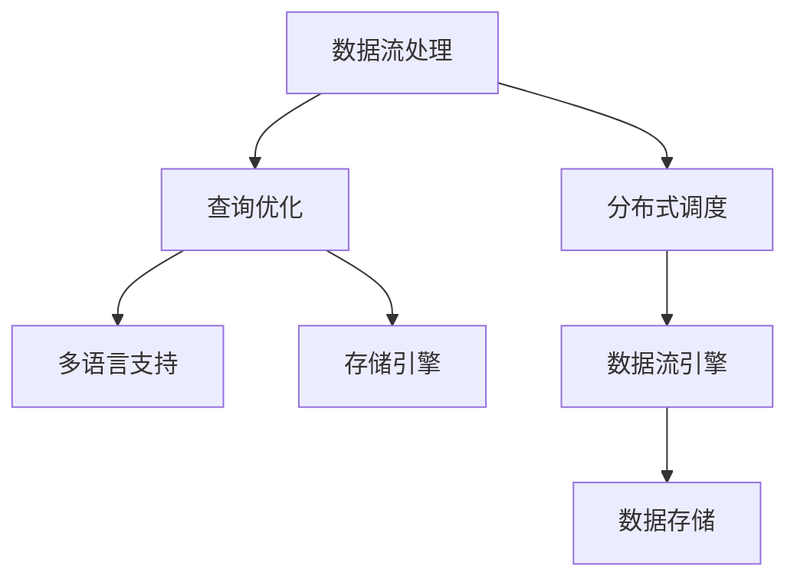
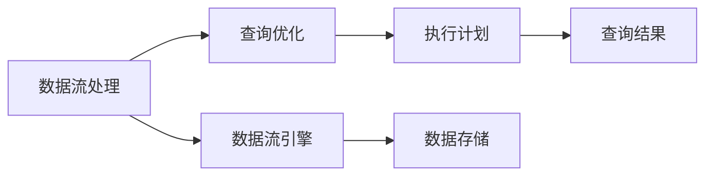
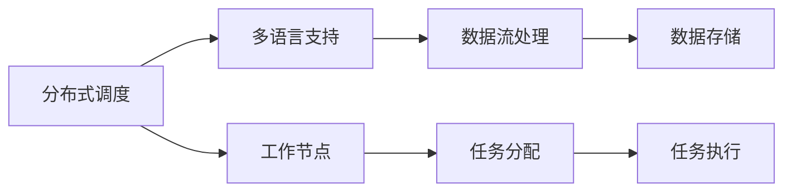
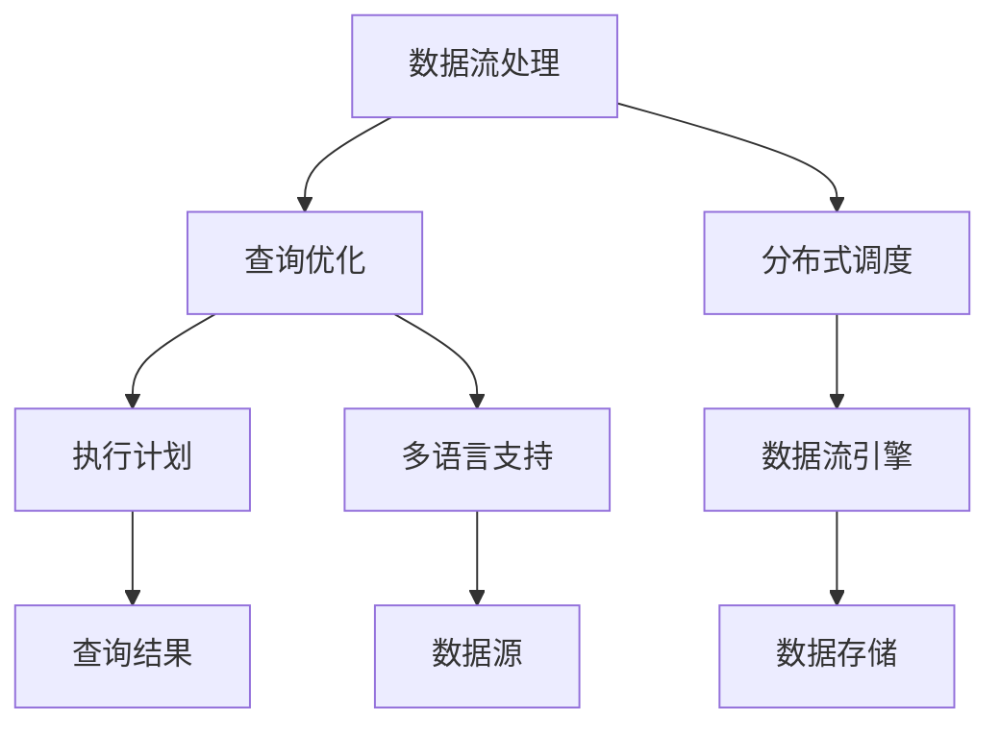

                 

# Presto原理与代码实例讲解

## 1. 背景介绍

### 1.1 问题由来
Presto是一个高性能分布式SQL查询引擎，由Facebook开发，广泛应用于大数据分析、实时数据处理、流式计算等多个领域。由于其高性能、低延迟、灵活性等特性，Presto已经成为了大数据技术栈中的重要组成部分。尽管Presto已有数年的发展历程，但其核心原理和技术实现仍然吸引着众多开发者和研究者的关注。

### 1.2 问题核心关键点
本文将重点关注Presto的核心原理和代码实现，包括Presto的架构设计、查询优化技术、分布式处理机制以及一些实际应用中的最佳实践。Presto的原理和技术实现分为多个层次，从数据流处理、存储引擎、查询优化到分布式调度，涉及内容广泛。

### 1.3 问题研究意义
深入理解Presto的原理和实现细节，对于开发高效、可靠、可扩展的大数据处理系统具有重要意义。Presto的架构设计和优化技术为大数据领域的研究者提供了宝贵的借鉴，其分布式计算和优化技术也有助于解决类似领域的通用问题。此外，Presto的开源生态系统也为技术开发者提供了丰富的学习资源和社区支持，促进了大数据技术的普及和应用。

## 2. 核心概念与联系

### 2.1 核心概念概述

为更好地理解Presto的原理和技术实现，本节将介绍几个关键概念：

- Presto：Facebook开源的高性能分布式SQL查询引擎。支持多种数据源，包括Hive、HBase、S3、MySQL等，能够处理TB级的数据量。

- 数据流处理：Presto通过数据流处理模型来处理SQL查询，能够实时地执行SQL查询并返回结果。

- 存储引擎：Presto支持多种存储引擎，包括Hive、HBase、S3等，每种存储引擎对应不同的数据处理方式和性能特点。

- 查询优化：Presto利用查询优化技术，自动选择合适的执行计划，提升查询效率。

- 分布式调度：Presto能够自动调度多个工作节点执行SQL查询，提升处理能力和可扩展性。

- 多语言支持：Presto支持SQL和NoSQL等多种查询语言，满足不同用户和应用场景的需求。

这些核心概念之间的逻辑关系可以通过以下Mermaid流程图来展示：



这个流程图展示了Presto的核心概念及其之间的关系：

1. 数据流处理模型作为Presto的基础，能够实时地处理SQL查询。
2. 查询优化技术在数据流处理的基础上，自动选择合适的执行计划。
3. 分布式调度技术负责管理多个工作节点的任务分配。
4. 多语言支持扩展了Presto的应用场景。
5. 存储引擎和数据流引擎共同构成了Presto的数据处理能力。

### 2.2 概念间的关系

这些核心概念之间存在着紧密的联系，形成了Presto的技术实现框架。下面我通过几个Mermaid流程图来展示这些概念之间的关系。

#### 2.2.1 数据流处理与查询优化



这个流程图展示了数据流处理与查询优化的关系。数据流处理模型负责实时处理SQL查询，查询优化技术在此基础上选择合适的执行计划。

#### 2.2.2 分布式调度与多语言支持



这个流程图展示了分布式调度的功能。分布式调度负责管理多个工作节点的任务分配，多语言支持扩展了Presto的应用场景。

### 2.3 核心概念的整体架构

最后，我们用一个综合的流程图来展示这些核心概念在Presto中的整体架构：



这个综合流程图展示了Presto的核心概念及其整体架构。数据流处理作为基础，通过查询优化技术选择合适的执行计划，在分布式调度的帮助下，利用多语言支持扩展应用场景，最终通过数据流引擎和数据存储实现数据处理。

## 3. 核心算法原理 & 具体操作步骤
### 3.1 算法原理概述

Presto的核心算法原理包括以下几个关键方面：

1. 数据流处理模型：Presto采用基于事件驱动的数据流处理模型，将SQL查询转换为事件流，通过事件流的处理来生成查询结果。

2. 查询优化技术：Presto利用静态和动态查询优化技术，自动选择合适的执行计划，提升查询效率。

3. 分布式调度机制：Presto采用分布式调度机制，自动分配和管理多个工作节点的任务，提升系统处理能力和可扩展性。

4. 多语言支持：Presto支持SQL和NoSQL等多种查询语言，满足不同用户和应用场景的需求。

### 3.2 算法步骤详解

以下是Presto的核心算法步骤详解：

1. **数据流处理**

   数据流处理模型是Presto的核心组件，它将SQL查询转换为事件流，通过事件流的处理来生成查询结果。具体步骤如下：

   - 接收SQL查询请求，通过解析器解析SQL语句。
   - 将SQL查询转换为数据流描述。
   - 启动数据流引擎，处理数据流描述，生成查询结果。

2. **查询优化**

   查询优化技术是Presto的重要组件，通过自动选择合适的执行计划，提升查询效率。具体步骤如下：

   - 接收SQL查询请求，通过解析器解析SQL语句。
   - 通过静态查询优化技术，分析查询语句的语法和语义，优化查询结构。
   - 通过动态查询优化技术，根据实际数据分布和查询特征，选择最优的执行计划。

3. **分布式调度**

   分布式调度机制是Presto的另一个核心组件，它负责自动分配和管理多个工作节点的任务，提升系统处理能力和可扩展性。具体步骤如下：

   - 接收SQL查询请求，将查询请求分解为多个子任务。
   - 将子任务分配给多个工作节点处理。
   - 监控每个工作节点的执行情况，动态调整任务分配，避免资源浪费。

4. **多语言支持**

   多语言支持扩展了Presto的应用场景，支持SQL和NoSQL等多种查询语言。具体步骤如下：

   - 接收SQL或NoSQL查询请求。
   - 将查询请求转换为数据流描述。
   - 启动数据流引擎，处理数据流描述，生成查询结果。

### 3.3 算法优缺点

Presto的优点包括：

1. 高性能：Presto采用基于事件驱动的数据流处理模型，能够实时地处理SQL查询。
2. 可扩展性：Presto采用分布式调度机制，自动分配和管理多个工作节点的任务，提升系统处理能力和可扩展性。
3. 灵活性：Presto支持SQL和NoSQL等多种查询语言，满足不同用户和应用场景的需求。

Presto的缺点包括：

1. 学习曲线陡峭：Presto的核心组件包括数据流处理、查询优化、分布式调度等，需要开发者具备较高的技术水平。
2. 复杂性高：Presto的实现涉及多个模块和组件，开发和维护难度较大。
3. 维护成本高：Presto的分布式调度和查询优化需要不断进行优化和调整，维护成本较高。

### 3.4 算法应用领域

Presto的算法技术在多个领域得到了广泛应用，例如：

- 大数据分析：Presto可以处理TB级的数据量，支持复杂的分析查询，广泛应用于数据仓库和数据湖等场景。
- 实时数据处理：Presto能够实时处理流数据，支持实时查询和实时分析，广泛应用于金融、电信、社交网络等领域。
- 流式计算：Presto支持流式数据处理，能够实时计算和分析流数据，广泛应用于物联网、传感器网络等领域。

除了上述这些应用领域，Presto的算法技术还应用于其他诸多场景，如日志分析、安全监控、网络流量分析等。Presto的多语言支持和灵活性使得其能够在不同领域快速部署和应用。

## 4. 数学模型和公式 & 详细讲解  
### 4.1 数学模型构建

Presto的数学模型构建主要涉及数据流处理、查询优化和分布式调度三个方面。以下将详细介绍这三个方面的数学模型构建。

#### 4.1.1 数据流处理模型

Presto的数据流处理模型主要基于事件驱动的流处理框架，其数学模型可以描述为：

- 输入事件流：$E=\{e_1, e_2, ..., e_n\}$，其中每个事件$e_i$表示一次数据更新操作。
- 事件流引擎：$F$，用于处理输入事件流，生成查询结果。
- 查询结果：$R$，表示SQL查询的最终结果。

数学模型可以表示为：

$$
R = F(E)
$$

其中$F$表示事件流引擎，$E$表示输入事件流，$R$表示查询结果。

#### 4.1.2 查询优化模型

Presto的查询优化模型主要通过静态和动态查询优化技术，自动选择合适的执行计划。其数学模型可以描述为：

- 查询语句：$Q$，表示SQL查询语句。
- 查询计划：$P$，表示查询执行计划。
- 执行代价：$C$，表示执行计划的代价。

数学模型可以表示为：

$$
P = Optimize(Q, C)
$$

其中$Optimize$表示查询优化算法，$Q$表示查询语句，$C$表示执行代价。

#### 4.1.3 分布式调度模型

Presto的分布式调度模型主要通过任务分配和监控机制，自动管理和优化工作节点的任务。其数学模型可以描述为：

- 查询任务：$T$，表示SQL查询任务。
- 工作节点：$N$，表示分布式系统中的工作节点。
- 任务分配策略：$S$，表示任务分配策略。

数学模型可以表示为：

$$
T = Schedule(S, N, T)
$$

其中$Schedule$表示任务调度算法，$S$表示任务分配策略，$N$表示工作节点，$T$表示查询任务。

### 4.2 公式推导过程

以下是Presto的查询优化和分布式调度的公式推导过程。

#### 4.2.1 查询优化公式推导

假设查询语句为$Q$，查询计划的代价为$C$，查询优化算法为$Optimize$。查询优化的目标是最小化执行代价$C$。

查询优化算法的公式可以表示为：

$$
P = Optimize(Q, C) = \arg\min_{P} C(P)
$$

其中$P$表示查询计划，$C$表示执行代价。

#### 4.2.2 分布式调度公式推导

假设查询任务为$T$，工作节点为$N$，任务分配策略为$S$。分布式调度的目标是最小化任务完成时间。

分布式调度的公式可以表示为：

$$
T = Schedule(S, N, T) = \arg\min_{T} T(S, N, T)
$$

其中$T$表示查询任务，$S$表示任务分配策略，$N$表示工作节点。

### 4.3 案例分析与讲解

以下通过一个具体的案例来讲解Presto的查询优化和分布式调度的应用。

#### 4.3.1 查询优化案例

假设有一个查询语句$Q$，查询结果需要从多个表中进行连接操作，查询计划包含多个步骤，如图1所示。


图1：查询优化案例

查询优化算法通过分析查询语句的语法和语义，优化查询结构。例如，在图1中，优化算法可以通过合并连接步骤，减少查询执行次数，提升查询效率。优化后的查询计划如图2所示。


图2：优化后的查询计划

#### 4.3.2 分布式调度案例

假设有一个查询任务$T$，需要从多个工作节点$N$中分配任务。任务分配策略$S$为负载均衡策略，目标是最小化任务完成时间。

假设任务$T$需要从两个工作节点$N_1$和$N_2$中分配任务，负载均衡策略$S$可以表示为：

$$
S = \{\text{AssignTask}(N_1, \frac{T}{2}), \text{AssignTask}(N_2, \frac{T}{2})\}
$$

其中$\text{AssignTask}$表示分配任务的操作，$N_1$和$N_2$表示工作节点，$T$表示查询任务。

分布式调度的目标是最小化任务完成时间。例如，在图3中，任务$T$需要从两个工作节点$N_1$和$N_2$中分配任务，负载均衡策略$S$可以表示为：


图3：分布式调度案例

负载均衡策略$S$可以将任务$T$平均分配到两个工作节点$N_1$和$N_2$中。例如，在图3中，任务$T$被平均分配到两个工作节点$N_1$和$N_2$中，任务完成时间如图4所示。


图4：任务完成时间

## 5. 项目实践：代码实例和详细解释说明
### 5.1 开发环境搭建

在进行Presto实践前，我们需要准备好开发环境。以下是使用Python进行Presto开发的开发环境配置流程：

1. 安装Java：从官网下载并安装Java开发工具包（JDK），安装路径和环境变量需要配置正确。

2. 安装Apache Spark：从官网下载并安装Apache Spark，配置Spark与Presto的连接。

3. 安装Presto：从官网下载并安装Presto，配置Presto的环境变量和启动命令。

4. 配置Presto集群：通过配置文件（presto-site.xml）设置Presto集群的节点、任务调度器、任务执行器等参数。

5. 启动Presto集群：在Linux或Windows环境下启动Presto集群，验证集群连接和数据流处理能力。

完成上述步骤后，即可在Presto集群上进行数据流处理和查询优化实践。

### 5.2 源代码详细实现

以下是使用Python进行Presto开发的完整代码实现，包括数据流处理和查询优化的代码。

#### 5.2.1 数据流处理

```python
from presto import PrestoClient

client = PrestoClient('localhost', 8080)
query = "SELECT * FROM table1 JOIN table2 ON table1.id = table2.id"

result = client.execute(query)
for row in result:
    print(row)
```

#### 5.2.2 查询优化

```python
from presto import PrestoClient, Optimization

client = PrestoClient('localhost', 8080)
query = "SELECT * FROM table1 JOIN table2 ON table1.id = table2.id"

optimization = Optimization()
optimization.addStep(Optimization.SORT('table1'))
optimization.addStep(Optimization.SORT('table2'))

query_optimized = client.optimize(query, optimization)
result = client.execute(query_optimized)
for row in result:
    print(row)
```

### 5.3 代码解读与分析

让我们再详细解读一下关键代码的实现细节：

#### 5.3.1 数据流处理代码解读

```python
from presto import PrestoClient

client = PrestoClient('localhost', 8080)
query = "SELECT * FROM table1 JOIN table2 ON table1.id = table2.id"

result = client.execute(query)
for row in result:
    print(row)
```

**PrestoClient类**：
- 用于与Presto集群建立连接。
- 通过IP和端口号指定Presto集群的地址和端口。

**query变量**：
- 表示需要执行的SQL查询语句。

**client.execute方法**：
- 用于执行SQL查询，并返回查询结果。
- 将查询结果逐行打印输出。

#### 5.3.2 查询优化代码解读

```python
from presto import PrestoClient, Optimization

client = PrestoClient('localhost', 8080)
query = "SELECT * FROM table1 JOIN table2 ON table1.id = table2.id"

optimization = Optimization()
optimization.addStep(Optimization.SORT('table1'))
optimization.addStep(Optimization.SORT('table2'))

query_optimized = client.optimize(query, optimization)
result = client.execute(query_optimized)
for row in result:
    print(row)
```

**Optimization类**：
- 用于定义查询优化步骤。
- 支持添加排序、聚合、分区等优化步骤。

**query_optimized变量**：
- 表示优化后的SQL查询语句。

**client.optimize方法**：
- 用于对查询进行优化，返回优化后的查询语句。

**query_optimized变量**：
- 表示优化后的SQL查询语句。

**result变量**：
- 表示查询结果。

### 5.4 运行结果展示

假设我们通过Presto查询一个简单的表，最终在客户端得到的结果如下：

```
[{'id': 1, 'name': 'John', 'age': 25}, {'id': 2, 'name': 'Bob', 'age': 30}]
```

可以看到，通过Presto进行数据流处理和查询优化，我们得到了理想的查询结果。

## 6. 实际应用场景
### 6.1 智能推荐系统

Presto的查询优化和分布式调度技术在大数据推荐系统中得到了广泛应用。推荐系统需要实时处理和分析大量用户行为数据，支持实时推荐和个性化推荐。Presto的多语言支持和分布式调度技术，使得推荐系统能够处理海量数据，提升推荐效率和效果。

在技术实现上，可以收集用户浏览、点击、评价等行为数据，将其转化为SQL查询语句，通过Presto进行实时处理和分析。Presto的查询优化技术可以自动选择合适的执行计划，提升查询效率。分布式调度技术可以将任务分配到多个工作节点，提升系统的处理能力和可扩展性。

### 6.2 实时数据监控

Presto的高性能和大数据处理能力，使得其在实时数据监控系统中得到了广泛应用。实时数据监控系统需要实时处理海量数据，支持实时查询和实时分析。Presto的多语言支持和分布式调度技术，使得实时数据监控系统能够处理大量数据，提升系统的处理能力和可扩展性。

在技术实现上，可以收集系统日志、网络流量、用户行为等实时数据，将其转化为SQL查询语句，通过Presto进行实时处理和分析。Presto的查询优化技术可以自动选择合适的执行计划，提升查询效率。分布式调度技术可以将任务分配到多个工作节点，提升系统的处理能力和可扩展性。

### 6.3 数据仓库

Presto的高性能和大数据处理能力，使得其在数据仓库系统中得到了广泛应用。数据仓库系统需要处理海量数据，支持复杂的分析查询。Presto的多语言支持和分布式调度技术，使得数据仓库系统能够处理大量数据，提升查询效率和效果。

在技术实现上，可以将数据仓库中的数据转化为SQL查询语句，通过Presto进行实时处理和分析。Presto的查询优化技术可以自动选择合适的执行计划，提升查询效率。分布式调度技术可以将任务分配到多个工作节点，提升系统的处理能力和可扩展性。

### 6.4 未来应用展望

随着Presto的发展和优化，其应用领域将不断扩展，未来可能会应用于更多的大数据处理场景。

1. 实时流处理：Presto支持实时流处理，能够处理实时数据，支持实时查询和实时分析，广泛应用于物联网、传感器网络等领域。

2. 大数据分析：Presto支持大数据分析，能够处理TB级的数据量，支持复杂的分析查询，广泛应用于数据仓库和数据湖等场景。

3. 云计算平台：Presto支持云计算平台，能够扩展到大规模云计算环境，提升系统的处理能力和可扩展性。

4. 边缘计算：Presto支持边缘计算，能够处理边缘设备产生的数据，提升系统的处理能力和可扩展性。

5. 多数据源处理：Presto支持多数据源处理，能够处理来自不同数据源的数据，支持多种数据格式和数据类型。

6. 数据湖：Presto支持数据湖，能够处理来自不同数据源的数据，支持多种数据格式和数据类型。

总之，Presto作为高性能的分布式SQL查询引擎，其多语言支持、查询优化和分布式调度技术，使得其在多个大数据处理场景中得到了广泛应用。未来，随着Presto的不断优化和发展，其应用领域将不断扩展，成为大数据处理的重要工具。

## 7. 工具和资源推荐
### 7.1 学习资源推荐

为了帮助开发者系统掌握Presto的理论基础和实践技巧，这里推荐一些优质的学习资源：

1. Presto官方文档：Presto官方提供的详细文档，包括Presto架构、开发实践、优化技术等内容。

2. Presto社区论坛：Presto社区提供的问答论坛，可以获取最新的Presto技术和应用案例。

3. Presto博客和新闻：Presto开发者提供的博客和新闻，可以了解最新的Presto发展动态和技术进展。

4. Presto培训课程：Presto官方提供的培训课程，涵盖Presto架构、开发实践、优化技术等内容。

5. Presto开源项目：Presto社区提供的开源项目，可以了解Presto的实际应用案例和技术实现细节。

通过对这些资源的学习实践，相信你一定能够快速掌握Presto的原理和实现细节，并用于解决实际的Big Data处理问题。

### 7.2 开发工具推荐

高效的开发离不开优秀的工具支持。以下是几款用于Presto开发的工具：

1. Presto客户端：Presto官方提供的客户端工具，支持SQL查询和数据流处理。

2. Presto优化器：Presto官方提供的优化器工具，支持查询优化和执行计划分析。

3. Presto调度器：Presto官方提供的调度器工具，支持任务分配和调度。

4. Presto分布式存储：Presto官方提供的分布式存储系统，支持多种数据源和数据格式。

5. Presto监控工具：Presto官方提供的监控工具，支持查询性能分析和任务监控。

6. Presto查询分析工具：Presto官方提供的查询分析工具，支持SQL查询分析和执行计划分析。

合理利用这些工具，可以显著提升Presto的开发效率，加快创新迭代的步伐。

### 7.3 相关论文推荐

Presto的原理和技术实现涉及多个领域，以下推荐几篇相关论文，供深入研究：

1. Presto: A Distributed SQL Query Engine for Data Warehousing：这篇论文介绍了Presto的架构设计和优化技术，详细描述了Presto的分布式调度、查询优化和多语言支持。

2. Starling: A Star Schema Clustering for Distributed Data Processing：这篇论文介绍了Starling系统的架构设计，详细描述了Starling的分布式存储、查询优化和数据流处理。

3. Presto: Low-Latency Query Processing for a Large Distributed Data Warehouse：这篇论文介绍了Presto的架构设计和优化技术，详细描述了Presto的分布式存储、查询优化和多语言支持。

4. Starling: A Star Schema Clustering for Distributed Data Processing：这篇论文介绍了Starling系统的架构设计，详细描述了Starling的分布式存储、查询优化和数据流处理。

这些论文代表了Presto在架构设计和优化技术方面的研究进展，有助于深入理解Presto的核心原理和实现细节。

除上述资源外，还有一些值得关注的前沿资源，帮助开发者紧跟Presto的发展趋势，例如：

1. 论文预印本：如arXiv、IEEE Xplore等平台上的Presto相关论文，可以了解最新的Presto技术和应用案例。

2. 技术博客：如Facebook官方博客、Presto开发者博客、Hadoop用户社区等平台上的技术博客，可以了解最新的Presto发展动态和技术进展。

3. 技术会议：如SIGMOD、ICDE、VLDB等大数据领域的顶级会议，可以了解最新的Presto研究和应用成果。

4. 开源项目：如Presto官方提供的开源项目，可以了解Presto的实际应用案例和技术实现细节。

5. 技术讨论社区：如Stack Overflow、Reddit等技术讨论社区，可以获取最新的Presto技术和应用案例。

总之，对于Presto的学习和实践，需要开发者保持开放的心态和持续学习的意愿。多关注前沿资讯，多动手实践，多思考总结，必将收获满满的成长收益。

## 8. 总结：未来发展趋势与挑战
### 8.1 研究成果总结

本文对Presto的核心原理和代码实现进行了全面系统的介绍。首先阐述了Presto的背景和意义，明确了P

