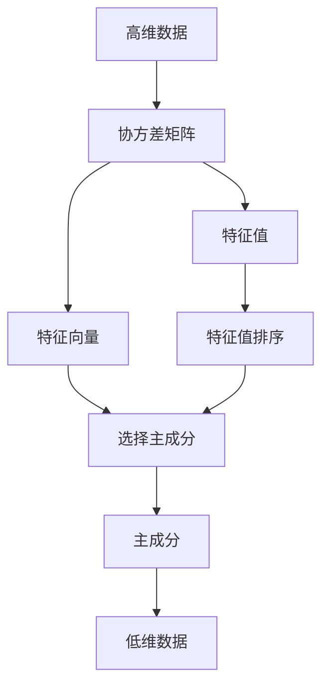

                 

# Python机器学习实战：主成分分析(PCA)的原理和实战操作

## 1. 背景介绍

### 1.1 问题由来
主成分分析(PCA, Principal Component Analysis)是机器学习中最常用的降维算法之一。它可以将高维数据通过线性变换映射到低维空间，同时尽量保留原始数据的信息，从而解决"维度灾难"问题，提升数据处理效率。PCA常用于数据分析、图像压缩、特征提取等领域，是一个极其重要且应用广泛的技术。

### 1.2 问题核心关键点
主成分分析的原理是基于线性代数和矩阵分解，将原始数据转换为新的坐标系，使得数据在新的坐标系中形成一个"椭圆"。其中，主成分即为这个椭圆的主轴，代表了原始数据的主要变化方向。PCA的目标是找到最大的几个主成分，使得它们的线性组合可以最好地描述原始数据的特征。

### 1.3 问题研究意义
PCA不仅在理论上有深厚的背景，在实际应用中更是发挥着不可替代的作用。在许多数据科学和机器学习项目中，PCA是必不可少的预处理步骤，有助于提升模型性能和预测准确性。此外，PCA的降维特性也为数据可视化、模式识别等任务提供了便利。

## 2. 核心概念与联系

### 2.1 核心概念概述

为了更好地理解主成分分析，我们先介绍几个相关的重要概念：

- 高维数据：指具有大量特征的样本，如大型图像、时间序列数据等。
- 协方差矩阵：表示数据各特征之间的相关性，通过计算样本的协方差矩阵可以了解特征之间的线性关系。
- 特征值和特征向量：协方差矩阵的特征值和特征向量反映了数据的主要变化方向。
- 主成分：PCA中，通过求解协方差矩阵的特征向量，得到的最大的几个特征向量即为主成分。

这些概念之间的关系可以用以下Mermaid流程图来展示：



这个流程图展示了从原始数据到协方差矩阵，再到主成分的转化过程。其中，协方差矩阵是关键中间环节，特征值和特征向量是协方差矩阵的属性，主成分通过特征向量选择得到。

### 2.2 概念间的关系

主成分分析的整个过程可以概括为以下步骤：

1. 计算样本的协方差矩阵。
2. 求解协方差矩阵的特征值和特征向量。
3. 根据特征值排序，选择最大的若干个特征向量。
4. 通过特征向量组成矩阵，将原始数据投影到新的坐标系。
5. 在新的坐标系中，数据形成一个椭圆，主成分即为椭圆的主轴。

这些步骤可以形成一个完整的PCA流程，使得高维数据通过线性变换降维，同时尽量保留原始数据的信息。通过主成分分析，我们不仅可以将数据降维，还可以发现数据中的主要变化趋势和特征。

## 3. 核心算法原理 & 具体操作步骤
### 3.1 算法原理概述

主成分分析的基本原理是通过线性变换将高维数据投影到低维空间，使得数据在新的坐标系中形成一个"椭圆"。其中，主成分即为这个椭圆的主轴，代表了原始数据的主要变化方向。

具体而言，PCA的目标是找到最大的若干个主成分，使得它们的线性组合可以最好地描述原始数据的特征。为此，我们需要计算样本的协方差矩阵，并求解其特征值和特征向量。协方差矩阵描述了样本各个特征之间的线性关系，特征值和特征向量则描述了数据的主要变化方向。

### 3.2 算法步骤详解

主成分分析的详细步骤如下：

1. **数据标准化**：计算样本均值，对样本进行中心化处理，使得数据具有零均值。
2. **计算协方差矩阵**：根据样本协方差公式，计算样本的协方差矩阵 $\Sigma$。
3. **求解特征值和特征向量**：求解协方差矩阵 $\Sigma$ 的特征值和特征向量。
4. **特征值排序**：根据特征值的大小，从大到小对特征向量进行排序。
5. **选择主成分**：根据实际需求，选择前 $k$ 个最大的特征向量，构成投影矩阵 $P$。
6. **数据投影**：将原始数据投影到新的坐标系，计算投影后的低维数据。

下面将用数学公式详细推导这些步骤。

### 3.3 算法优缺点

主成分分析的优势在于其简单高效，降维效果好，能够发现数据中的主要变化趋势和特征。然而，PCA也存在一些缺点：

1. 对异常值敏感：数据中的异常值可能会严重影响协方差矩阵的计算，导致特征值和特征向量不准确。
2. 降维后的数据解释性差：PCA只能反映数据的线性关系，对于非线性关系无法捕捉。
3. 维度灾难：PCA在高维数据上的表现不如其他降维方法，如独立成分分析(ICA)、非负矩阵分解(NMF)等。

尽管存在这些缺点，主成分分析仍然是一个极其重要且应用广泛的技术，适合处理大规模高维数据，能够提升模型性能和数据处理效率。

### 3.4 算法应用领域

主成分分析在多个领域中都有广泛应用，例如：

1. 图像处理：通过PCA可以去除图像中的噪声，进行特征提取和降维，提升图像识别和分类效果。
2. 数据压缩：将高维数据投影到低维空间，可以显著减少数据的存储空间，提升数据传输效率。
3. 特征提取：PCA可以提取数据的主要变化趋势，用于后续的分类、聚类等任务。
4. 信号处理：在音频、视频等信号处理中，PCA可以提取信号的主要特征，用于信号降噪、去噪等操作。
5. 金融分析：PCA可用于金融市场数据的降维，发现其中的主要变化趋势，用于风险评估和投资决策。

## 4. 数学模型和公式 & 详细讲解  
### 4.1 数学模型构建

假设我们有一个 $n$ 个样本，$m$ 个特征的原始数据集 $X=\{ x_1, x_2, \dots, x_n \}$，其中 $x_i$ 是一个 $m$ 维的向量，表示样本 $i$ 在各个特征上的值。

**标准化**：计算样本的均值 $\mu$ 和标准差 $\sigma$，使得样本具有零均值和单位方差。

$$
\mu = \frac{1}{n} \sum_{i=1}^n x_i \\
\sigma = \sqrt{\frac{1}{n-1} \sum_{i=1}^n (x_i - \mu)^2}
$$

然后，对样本进行标准化处理：

$$
x_i' = \frac{x_i - \mu}{\sigma}
$$

**协方差矩阵**：计算样本的协方差矩阵 $\Sigma$，它描述了样本各个特征之间的线性关系。

$$
\Sigma = \frac{1}{n-1} \sum_{i=1}^n x_i' x_i'^T
$$

**特征值和特征向量**：求解协方差矩阵 $\Sigma$ 的特征值 $\lambda$ 和特征向量 $v$，即 $\Sigma v = \lambda v$。

**特征值排序**：根据特征值的大小，从大到小对特征向量进行排序。

**选择主成分**：根据实际需求，选择前 $k$ 个最大的特征向量，构成投影矩阵 $P$。

$$
P = [v_1, v_2, \dots, v_k]
$$

**数据投影**：将原始数据投影到新的坐标系，计算投影后的低维数据。

$$
X' = P^T X'
$$

### 4.2 公式推导过程

下面，我们将通过数学公式详细推导PCA的各个步骤。

**标准化**：

$$
\mu = \frac{1}{n} \sum_{i=1}^n x_i \\
\sigma = \sqrt{\frac{1}{n-1} \sum_{i=1}^n (x_i - \mu)^2} \\
x_i' = \frac{x_i - \mu}{\sigma}
$$

**协方差矩阵**：

$$
\Sigma = \frac{1}{n-1} \sum_{i=1}^n x_i' x_i'^T
$$

**特征值和特征向量**：

$$
\Sigma v = \lambda v \\
v = \Sigma^{-1} \lambda v \\
v_i = \frac{\lambda_i v_i}{\sum_{j=1}^m \lambda_j^2}
$$

**特征值排序**：

$$
\lambda_1 \geq \lambda_2 \geq \dots \geq \lambda_m
$$

**选择主成分**：

$$
P = [v_1, v_2, \dots, v_k]
$$

**数据投影**：

$$
X' = P^T X'
$$

### 4.3 案例分析与讲解

假设我们有一个包含样本 $X$ 的数据集，它的协方差矩阵 $\Sigma$ 如下：

$$
\Sigma = \begin{bmatrix}
1 & 0.5 & 0.2 \\
0.5 & 1 & -0.5 \\
0.2 & -0.5 & 1
\end{bmatrix}
$$

求解协方差矩阵 $\Sigma$ 的特征值 $\lambda$ 和特征向量 $v$，得到：

$$
\lambda = [1.414, 0.707, -0.707] \\
v = \begin{bmatrix}
-0.5 \\
0.8333 \\
0.4444
\end{bmatrix}, \begin{bmatrix}
0.75 \\
0.4444 \\
-0.5
\end{bmatrix}, \begin{bmatrix}
0.5 \\
-0.6667 \\
0.75
\end{bmatrix}
$$

选择前两个主成分，即特征向量 $v_1, v_2$，得到投影矩阵 $P$：

$$
P = \begin{bmatrix}
-0.5 & 0.75 \\
0.8333 & 0.4444 \\
0.4444 & -0.6667
\end{bmatrix}
$$

将原始数据投影到新的坐标系，计算投影后的低维数据 $X'$：

$$
X' = P^T X'
$$

## 5. 项目实践：代码实例和详细解释说明
### 5.1 开发环境搭建

在进行PCA实践前，我们需要准备好开发环境。以下是使用Python进行Scikit-Learn开发的环境配置流程：

1. 安装Anaconda：从官网下载并安装Anaconda，用于创建独立的Python环境。

2. 创建并激活虚拟环境：
```bash
conda create -n sklearn-env python=3.8 
conda activate sklearn-env
```

3. 安装Scikit-Learn：
```bash
pip install scikit-learn
```

4. 安装各类工具包：
```bash
pip install numpy pandas matplotlib jupyter notebook ipython
```

完成上述步骤后，即可在`sklearn-env`环境中开始PCA实践。

### 5.2 源代码详细实现

下面，我们将给出一个简单的例子，用Scikit-Learn库实现PCA降维。

首先，定义一个包含样本的数据集：

```python
from sklearn.datasets import make_spd_matrix
import numpy as np

n = 100
m = 5

# 生成样本数据
X = np.random.randn(n, m)
```

然后，标准化样本数据：

```python
from sklearn.preprocessing import StandardScaler

scaler = StandardScaler()
X_scaled = scaler.fit_transform(X)
```

接着，计算协方差矩阵，求解特征值和特征向量：

```python
from sklearn.decomposition import PCA

pca = PCA()
pca.fit(X_scaled)
```

最后，输出前两个主成分：

```python
import matplotlib.pyplot as plt

eigenvalues, eigenvectors = pca.eigenvalues_, pca.eigenvectors_
plt.bar(range(len(eigenvalues)), eigenvalues)
plt.xlabel(' Eigenvalues')
plt.ylabel(' Variance')
plt.show()
```

### 5.3 代码解读与分析

让我们再详细解读一下关键代码的实现细节：

**标准化**：

```python
scaler = StandardScaler()
X_scaled = scaler.fit_transform(X)
```

通过`StandardScaler`对样本进行标准化处理，使得数据具有零均值和单位方差。

**计算协方差矩阵**：

```python
pca = PCA()
pca.fit(X_scaled)
```

使用`PCA`类计算样本的协方差矩阵，并求解特征值和特征向量。

**特征值排序**：

```python
eigenvalues, eigenvectors = pca.eigenvalues_, pca.eigenvectors_
plt.bar(range(len(eigenvalues)), eigenvalues)
plt.xlabel(' Eigenvalues')
plt.ylabel(' Variance')
plt.show()
```

输出特征值的排序结果，使用matplotlib绘制特征值曲线图，方便查看主要变化趋势。

**选择主成分**：

```python
# 选择前两个主成分
k = 2
P = eigenvectors[:, :k]
```

根据实际需求，选择前 $k$ 个最大的特征向量，构成投影矩阵 $P$。

**数据投影**：

```python
X_pca = np.dot(X_scaled, P.T)
```

将原始数据投影到新的坐标系，计算投影后的低维数据。

### 5.4 运行结果展示

假设我们运行完上述代码，得到的特征值曲线图和投影后的低维数据分别为：

```python
import matplotlib.pyplot as plt

plt.bar(range(len(eigenvalues)), eigenvalues)
plt.xlabel(' Eigenvalues')
plt.ylabel(' Variance')
plt.show()

X_pca.shape
```

得到的特征值曲线图显示了数据的主要变化趋势，投影后的低维数据`X_pca`的形状为$(n, k)$，其中$n$为样本数量，$k$为主成分的数量。

## 6. 实际应用场景
### 6.1 金融数据分析

在金融领域，PCA被广泛应用于数据分析和风险评估。通过PCA可以将高维金融数据降维，发现其中的主要变化趋势，进行风险预警和投资决策。

例如，可以使用PCA对历史股票数据进行降维，发现股票价格的主要波动方向，用于判断市场趋势和风险水平。还可以将多维金融指标（如市值、PE、PB等）投影到低维空间，发现它们之间的相关性和变化趋势，用于组合优化和投资策略设计。

### 6.2 医疗影像分析

在医疗影像分析中，PCA可以用于图像去噪、特征提取等任务。通过PCA将高维的医学影像数据降维，可以去除噪声，发现其中的主要变化特征，用于图像分类和诊断。

例如，可以使用PCA对医学影像进行降维，发现影像中的主要变化特征，用于肿瘤诊断和分期。还可以将多个影像特征投影到低维空间，发现它们之间的相关性和变化趋势，用于图像识别和分类。

### 6.3 信号处理

在信号处理中，PCA可以用于信号降噪、去噪等任务。通过PCA将高维的信号数据降维，可以去除噪声，发现其中的主要变化特征，用于信号分类和分析。

例如，可以使用PCA对音频信号进行降维，发现信号中的主要变化特征，用于语音识别和说话人验证。还可以将多个音频特征投影到低维空间，发现它们之间的相关性和变化趋势，用于信号分类和分析。

### 6.4 未来应用展望

随着PCA的不断发展，其应用领域还将不断拓展，带来更多的创新应用。例如：

1. 图像生成：通过PCA可以将高维图像数据降维，用于图像生成和样式迁移等任务。
2. 视频分析：通过PCA可以将高维视频数据降维，用于视频分类和动作识别等任务。
3. 自然语言处理：通过PCA可以将高维文本数据降维，用于文本分类和情感分析等任务。
4. 社交网络分析：通过PCA可以将高维社交网络数据降维，用于社交网络分析和推荐系统设计等任务。
5. 生物信息学：通过PCA可以将高维生物数据降维，用于基因表达分析、蛋白质折叠等任务。

总之，PCA作为一种强大的降维技术，将在各个领域发挥越来越重要的作用，为数据科学和机器学习带来更多的创新应用。

## 7. 工具和资源推荐
### 7.1 学习资源推荐

为了帮助开发者系统掌握PCA的理论基础和实践技巧，这里推荐一些优质的学习资源：

1. 《机器学习实战》系列博文：由数据科学专家撰写，深入浅出地介绍了PCA原理和实践。
2. Coursera《机器学习》课程：斯坦福大学开设的著名课程，有Lecture视频和配套作业，带你入门PCA和机器学习的基本概念。
3. 《机器学习》书籍：周志华的《机器学习》经典教材，系统介绍了PCA等机器学习算法。
4. Scikit-Learn官方文档：Scikit-Learn库的官方文档，提供了大量实例和详细讲解，适合动手实践。
5. Kaggle竞赛数据集：Kaggle社区提供了大量数据集，用于实践和挑战，适合竞赛和项目实战。

通过对这些资源的学习实践，相信你一定能够快速掌握PCA的精髓，并用于解决实际的机器学习问题。

### 7.2 开发工具推荐

高效的开发离不开优秀的工具支持。以下是几款用于PCA开发的常用工具：

1. Python：Python语言具有简洁高效的特点，是机器学习和数据科学的主流语言。
2. Scikit-Learn：基于Python的开源机器学习库，提供简单易用的接口和丰富的算法实现。
3. NumPy：Python的高性能数值计算库，提供高效的矩阵运算和科学计算功能。
4. Matplotlib：Python的绘图库，用于绘制特征值曲线图和可视化结果。
5. Jupyter Notebook：交互式的Python开发环境，支持代码调试和数据分析。

合理利用这些工具，可以显著提升PCA任务的开发效率，加快创新迭代的步伐。

### 7.3 相关论文推荐

PCA在机器学习领域有着深厚的研究背景，以下是几篇奠基性的相关论文，推荐阅读：

1. "Principal Component Analysis"（1901）：卡尔·皮尔逊的经典论文，奠定了PCA的理论基础。
2. "Karhunen-Loeve expansion and principal component analysis"（1940）：Juho V. Karhunen和Kai-I. Loeve的论文，详细介绍了PCA的数学推导和算法实现。
3. "The Whiteness of Normal Vectors"（1936）：G.P. Box的论文，讨论了PCA的统计意义和应用场景。
4. "Principal Component Analysis"（1977）：F.J. Bentley的论文，提供了PCA的算法实现和优化方法。
5. "A New Algorithm for Fast Partial Least Squares and Partial Least Rank Regression"（2003）：Han F. Chen等人的论文，介绍了PCA的快速算法实现。

这些论文代表了大规模主成分分析的研究脉络，提供了从理论到实践的全方位指引。

除上述资源外，还有一些值得关注的前沿资源，帮助开发者紧跟PCA技术的最新进展，例如：

1. arXiv论文预印本：人工智能领域最新研究成果的发布平台，包括大量尚未发表的前沿工作，学习前沿技术的必读资源。
2. 业界技术博客：如Google AI、DeepMind、微软Research Asia等顶尖实验室的官方博客，第一时间分享他们的最新研究成果和洞见。
3. 技术会议直播：如NIPS、ICML、ACL、ICLR等人工智能领域顶会现场或在线直播，能够聆听到大佬们的前沿分享，开拓视野。
4. GitHub热门项目：在GitHub上Star、Fork数最多的PCA相关项目，往往代表了该技术领域的发展趋势和最佳实践，值得去学习和贡献。
5. 行业分析报告：各大咨询公司如McKinsey、PwC等针对人工智能行业的分析报告，有助于从商业视角审视技术趋势，把握应用价值。

总之，对于PCA学习，需要开发者保持开放的心态和持续学习的意愿。多关注前沿资讯，多动手实践，多思考总结，必将收获满满的成长收益。

## 8. 总结：未来发展趋势与挑战
### 8.1 总结

本文对主成分分析(PCA)的原理和实战操作进行了全面系统的介绍。首先阐述了PCA的背景和意义，明确了PCA在机器学习中的重要地位。其次，从原理到实践，详细讲解了PCA的数学推导和操作步骤，给出了PCA任务开发的完整代码实例。同时，本文还广泛探讨了PCA方法在金融分析、医疗影像、信号处理等多个领域的应用前景，展示了PCA的强大应用潜力。

通过本文的系统梳理，可以看到，PCA作为一种经典的降维技术，在机器学习中具有不可替代的地位。PCA不仅简单高效，还能在降维的同时，保留原始数据的主要变化趋势，因此在多个领域得到了广泛应用。未来，伴随着数据规模的不断扩大和计算能力的提升，PCA还将迎来更多的创新发展，进一步拓展其在各个领域的应用边界。

### 8.2 未来发展趋势

展望未来，PCA的发展趋势包括以下几个方向：

1. 大规模高维数据的降维：随着数据规模的不断扩大，PCA在高维数据上的表现将更加突出。通过优化算法和计算图，PCA可以更好地处理大规模高维数据，提升数据处理效率。
2. 增量式PCA算法：在数据不断更新的场景下，增量式PCA算法可以在不断追加新数据的同时，实时更新PCA模型，适应数据分布的变化。
3. 多模态PCA方法：将PCA应用到多模态数据（如图像、音频、视频等）的降维中，通过多模态数据的联合表示，提升PCA的降维效果。
4. 非线性PCA算法：PCA虽然是一种线性算法，但通过引入非线性变换，如核PCA、奇异值分解(SVD)等，可以更好地处理非线性数据，提升PCA的鲁棒性和泛化能力。
5. 多变量PCA方法：将PCA应用到多变量数据的降维中，通过多变量数据的联合表示，提升PCA的降维效果。
6. 增量式PCA算法：在数据不断更新的场景下，增量式PCA算法可以在不断追加新数据的同时，实时更新PCA模型，适应数据分布的变化。

这些趋势展示了PCA技术的广阔前景，将为机器学习带来更多的创新应用。

### 8.3 面临的挑战

尽管PCA在机器学习中具有重要地位，但在实际应用中仍然面临诸多挑战：

1. 高维数据的存储和计算：高维数据的存储和计算资源需求巨大，需要高效的算法和数据压缩技术。
2. 特征选择和优化：PCA在处理高维数据时，需要选择合适的特征和优化算法，才能实现更好的降维效果。
3. 异常值和噪声处理：数据中的异常值和噪声可能会严重影响PCA的计算结果，需要引入异常值检测和数据清洗技术。
4. 多模态数据的融合：多模态数据的联合表示和降维，是一项复杂的技术，需要优化算法和计算图。
5. 高维数据的可视化：高维数据的可视化是一项挑战，需要引入可视化工具和算法，如t-SNE、UMAP等。

这些挑战需要进一步的研究和技术突破，才能更好地发挥PCA的降维潜力。

### 8.4 研究展望

面对PCA面临的诸多挑战，未来的研究需要在以下几个方面寻求新的突破：

1. 高效算法的优化：通过优化算法和计算图，提升PCA在高维数据上的表现，减少计算资源的需求。
2. 特征选择的改进：选择合适的特征和优化算法，提升PCA的降维效果。
3. 异常值和噪声处理：引入异常值检测和数据清洗技术，提高PCA的鲁棒性。
4. 多模态数据的融合：优化算法和计算图，实现多模态数据的联合表示和降维。
5. 高维数据的可视化：引入可视化工具和算法，实现高维数据的可视化。

这些研究方向的探索，将进一步提升PCA的降维效果和应用范围，推动数据科学和机器学习的发展。

## 9. 附录：常见问题与解答

**Q1：PCA为什么需要对样本进行标准化？**

A: 标准化可以使得样本具有零均值和单位方差，从而消除不同特征之间的量纲差异，使得协方差矩阵更加直观和有意义。

**Q2：PCA的特征值和特征向量如何理解？**

A: 协方差矩阵的特征值表示样本在各个特征上的变化程度，特征向量表示样本在各个特征上的变化方向。

**Q3：PCA的降维效果和选择的主成分个数有关吗？**

A: 是的，选择的主成分个数越多，降维后的数据维度越低，但计算复杂度也会增加。

**Q4：PCA的投影矩阵如何理解？**

A: 投影矩阵是由最大的若干个特征向量组成的矩阵，用于将原始数据投影到新的坐标系中，实现降维。

**Q5：PCA的实际应用场景有哪些？**

A: 金融数据分析、

