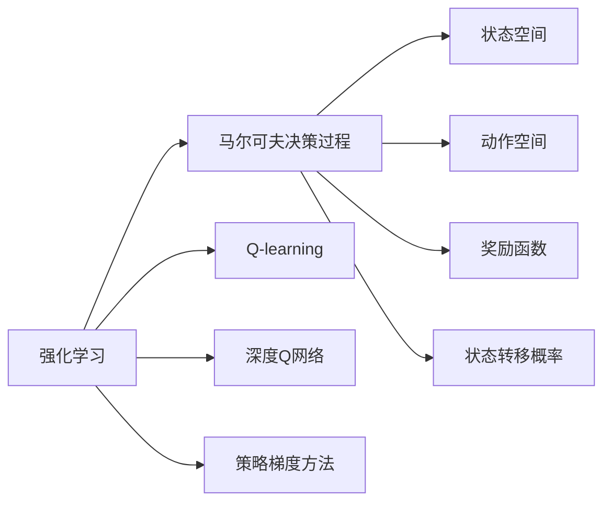
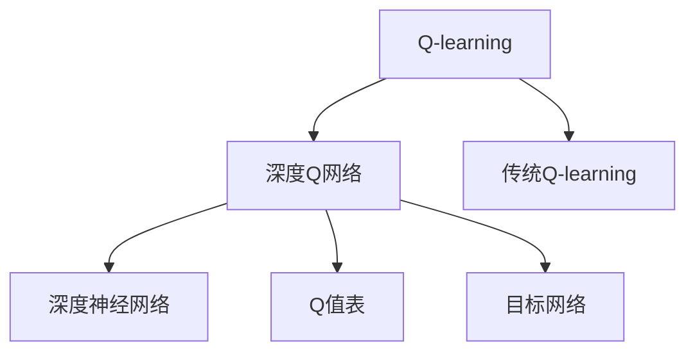
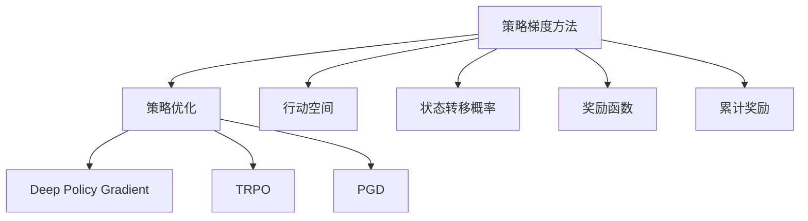
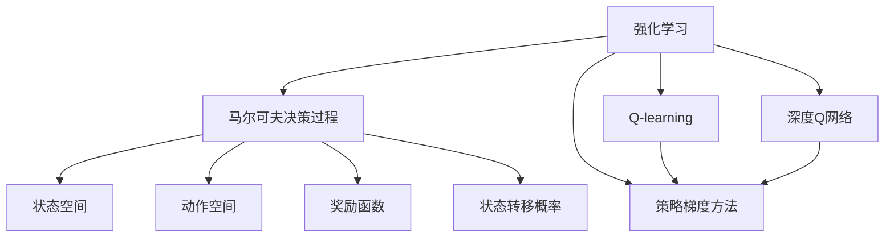

                 

# Python机器学习实战：强化学习(Reinforcement Learning)基础介绍

> 关键词：强化学习,Python,机器学习,模型构建,马尔可夫决策过程,算法原理,代码实现,应用场景,未来展望

## 1. 背景介绍

### 1.1 问题由来
强化学习(Reinforcement Learning, RL)是一种基于奖励和惩罚机制的学习方法，旨在通过与环境的交互，不断调整自身行为策略，以最大化累积奖励。近年来，强化学习在自动驾驶、机器人控制、游戏AI等领域取得了显著进展，展现出强大的应用潜力。

### 1.2 问题核心关键点
强化学习是机器学习的一个重要分支，其核心在于如何通过与环境的交互，构建智能体（agent）的策略，使智能体能够自主地学习最优策略。强化学习的核心问题包括：
- 状态空间（State Space）：智能体所处的环境空间，通常表示为状态集合 $S$。
- 动作空间（Action Space）：智能体能够采取的行动集合，通常表示为动作集合 $A$。
- 奖励函数（Reward Function）：定义智能体采取行动后的奖励值，通常表示为 $R(s,a)$。
- 状态转移概率（State Transition Probability）：描述环境在智能体采取不同行动后，状态的变化概率。

强化学习的目标是通过对策略 $\pi$ 的不断优化，最大化长期累积奖励的期望值 $J(\pi)$。

### 1.3 问题研究意义
强化学习的研究具有重要意义：
- 自动优化策略。通过环境反馈的奖励信息，智能体能够自主学习最优策略，不需要人工干预。
- 应用广泛。强化学习可用于控制机器人、无人驾驶、游戏AI、金融交易等领域，解决复杂决策问题。
- 理论深度。强化学习结合了优化、控制、统计等多个领域的知识，具有深刻的理论基础。
- 巨大价值。强化学习技术的突破，能够显著提升机器人的智能化水平，带来重大的经济效益和社会效益。

## 2. 核心概念与联系

### 2.1 核心概念概述

为了更好地理解强化学习的基本概念和原理，本节将介绍几个密切相关的核心概念：

- 强化学习（Reinforcement Learning, RL）：通过与环境的交互，智能体（agent）学习最大化长期累积奖励的过程。
- 马尔可夫决策过程（Markov Decision Process, MDP）：定义了智能体与环境之间的交互模型，包括状态集合、动作集合、奖励函数和状态转移概率。
- Q-learning：一种基于价值函数的强化学习方法，通过不断更新Q值表，学习最优策略。
- 深度Q网络（Deep Q-Network, DQN）：将深度神经网络引入Q-learning中，提高Q值表的学习效率和精度。
- 策略梯度方法（Policy Gradient Methods）：直接优化策略参数，学习最大化累积奖励的策略。

这些概念之间的逻辑关系可以通过以下Mermaid流程图来展示：



这个流程图展示了这个体系中各个概念之间的关系：

1. 强化学习是基于马尔可夫决策过程的一种学习范式。
2. 马尔可夫决策过程包括状态空间、动作空间、奖励函数和状态转移概率。
3. Q-learning和深度Q网络是强化学习中常见的基于价值函数的方法。
4. 策略梯度方法是强化学习中直接优化策略的方法。

### 2.2 概念间的关系

这些核心概念之间存在着紧密的联系，形成了强化学习的完整生态系统。下面我们通过几个Mermaid流程图来展示这些概念之间的关系。

#### 2.2.1 强化学习的学习范式


这个流程图展示了下述逻辑关系：

1. 强化学习是一种基于马尔可夫决策过程的学习范式。
2. 马尔可夫决策过程包括状态空间、动作空间、奖励函数和状态转移概率。
3. Q-learning和深度Q网络是强化学习中常见的基于价值函数的方法。
4. 策略梯度方法是强化学习中直接优化策略的方法。

#### 2.2.2 Q-learning与深度Q网络的关系



这个流程图展示了Q-learning与深度Q网络的关系：

1. Q-learning是一种基于价值函数的强化学习方法。
2. 深度Q网络将深度神经网络引入Q-learning中，提高了Q值表的学习效率和精度。
3. 传统Q-learning是Q-learning的一种基础形式。
4. 深度Q网络使用深度神经网络来逼近Q值表，优化学习过程。

#### 2.2.3 策略梯度方法的应用场景



这个流程图展示了策略梯度方法的应用场景：

1. 策略梯度方法是一种直接优化策略参数的方法。
2. 策略优化是通过优化策略参数，学习最大化累积奖励的策略。
3. 行动空间、状态转移概率和奖励函数是策略梯度方法中的关键组件。
4. 策略梯度方法包括Deep Policy Gradient、TRPO、PGD等多种算法。

### 2.3 核心概念的整体架构

最后，我们用一个综合的流程图来展示这些核心概念在强化学习中的整体架构：



这个综合流程图展示了从强化学习到具体算法（Q-learning、深度Q网络、策略梯度方法）的完整过程。强化学习通过马尔可夫决策过程定义环境模型，采用Q-learning、深度Q网络和策略梯度方法优化策略，从而最大化长期累积奖励。

## 3. 核心算法原理 & 具体操作步骤

### 3.1 算法原理概述

强化学习的核心在于通过与环境的交互，不断调整策略，以最大化长期累积奖励。强化学习的过程可以总结如下：

1. 初始化智能体策略 $\pi_0$。
2. 在每个时间步 $t$，智能体根据当前状态 $s_t$ 选择动作 $a_t$。
3. 观察环境对动作的响应，更新状态 $s_{t+1}$，并获取奖励 $r_{t+1}$。
4. 根据智能体的动作 $a_t$ 和新的状态 $s_{t+1}$，更新价值函数 $Q_{\pi}(s_t, a_t)$。
5. 根据新的价值函数 $Q_{\pi}(s_t, a_t)$，优化智能体策略 $\pi_t$。
6. 重复步骤2-5，直至智能体达到稳定状态或达到预设的迭代次数。

其中，价值函数 $Q_{\pi}(s_t, a_t)$ 可以表示为智能体在策略 $\pi$ 下，从状态 $s_t$ 出发，采取动作 $a_t$ 的期望累积奖励。具体而言，$Q_{\pi}(s_t, a_t)$ 可以表示为：

$$
Q_{\pi}(s_t, a_t) = \mathbb{E}_{\pi}[R_{t+1} + \gamma \max_{a_{t+1}} Q_{\pi}(s_{t+1}, a_{t+1}) \mid s_t, a_t]
$$

其中，$\gamma$ 为折扣因子，用于平衡当前奖励与未来奖励的重要性。

### 3.2 算法步骤详解

接下来，我们将详细介绍强化学习的核心算法步骤，包括Q-learning、深度Q网络、策略梯度方法的详细步骤。

#### 3.2.1 Q-learning

Q-learning是一种基于价值函数的强化学习方法，其核心思想是通过不断更新Q值表，学习最优策略。Q-learning的步骤如下：

1. 初始化Q值表 $Q(s,a)$，通常使用随机初始值或全零初始值。
2. 在每个时间步 $t$，智能体根据当前状态 $s_t$ 选择动作 $a_t$。
3. 观察环境对动作的响应，更新状态 $s_{t+1}$，并获取奖励 $r_{t+1}$。
4. 根据动作 $a_t$ 和新的状态 $s_{t+1}$，更新Q值表 $Q(s_{t+1}, a_{t+1})$：
   $$
   Q(s_{t+1}, a_{t+1}) = (1-\alpha)Q(s_{t+1}, a_{t+1}) + \alpha(r_{t+1} + \gamma \max Q(s_{t+1}, a))
   $$
5. 重复步骤2-4，直至智能体达到稳定状态或达到预设的迭代次数。

其中，$\alpha$ 为学习率，用于控制Q值表的更新速度。

#### 3.2.2 深度Q网络

深度Q网络（DQN）将深度神经网络引入Q-learning中，提高Q值表的学习效率和精度。DQN的步骤如下：

1. 初始化深度Q网络 $Q(s)$，通常使用随机初始值或预训练模型。
2. 在每个时间步 $t$，智能体根据当前状态 $s_t$ 选择动作 $a_t$。
3. 观察环境对动作的响应，更新状态 $s_{t+1}$，并获取奖励 $r_{t+1}$。
4. 将状态 $s_{t+1}$ 输入深度Q网络，计算Q值 $Q(s_{t+1}, a_{t+1})$。
5. 根据动作 $a_t$ 和新的状态 $s_{t+1}$，更新深度Q网络：
   $$
   Q(s_{t+1}, a_{t+1}) = (1-\alpha)Q(s_{t+1}, a_{t+1}) + \alpha(r_{t+1} + \gamma \max Q(s_{t+1}, a))
   $$
6. 将状态 $s_t$ 和动作 $a_t$ 存储到经验回放缓冲区中。
7. 从缓冲区中随机抽取一组数据 $(s, a, r, s', a')$，更新深度Q网络的权重参数。
8. 重复步骤2-7，直至智能体达到稳定状态或达到预设的迭代次数。

其中，深度Q网络使用神经网络逼近Q值表，通过反向传播算法更新权重参数。经验回放缓冲区用于存储智能体的历史状态、动作和奖励信息，通过随机抽取样本更新网络权重，提高学习效率和稳定性。

#### 3.2.3 策略梯度方法

策略梯度方法（Policy Gradient Methods）是强化学习中直接优化策略的方法。策略梯度方法的步骤如下：

1. 初始化策略 $\pi_0$，通常使用随机初始值或预训练模型。
2. 在每个时间步 $t$，智能体根据当前状态 $s_t$ 选择动作 $a_t$。
3. 观察环境对动作的响应，更新状态 $s_{t+1}$，并获取奖励 $r_{t+1}$。
4. 根据动作 $a_t$ 和新的状态 $s_{t+1}$，计算策略梯度 $\nabla_{\pi}J$：
   $$
   \nabla_{\pi}J = \mathbb{E}_{\pi}[\frac{\partial \log \pi(a_t | s_t)}{\partial \pi(a_t | s_t)} \frac{\partial Q_{\pi}(s_t, a_t)}{\partial \pi(a_t | s_t)}]
   $$
5. 根据策略梯度 $\nabla_{\pi}J$，更新策略参数 $\pi$：
   $$
   \pi_{t+1} = \pi_t - \alpha \nabla_{\pi}J
   $$
6. 重复步骤2-5，直至智能体达到稳定状态或达到预设的迭代次数。

其中，$J$ 为策略的性能指标，通常表示为累积奖励的期望值。策略梯度方法使用梯度上升的方法，直接优化策略参数，学习最大化累积奖励的策略。

### 3.3 算法优缺点

Q-learning和深度Q网络具有以下优点：
- 易于实现：Q-learning和深度Q网络具有清晰的数学定义和稳定的收敛性，易于实现和理解。
- 泛化能力强：深度Q网络通过神经网络逼近Q值表，能够处理高维、非线性的状态空间和动作空间。
- 鲁棒性好：经验回放缓冲区和目标网络机制，提高了深度Q网络的鲁棒性和稳定性。

Q-learning和深度Q网络也存在以下缺点：
- 学习效率低：Q-learning和深度Q网络需要大量的训练数据和计算资源，学习过程较为缓慢。
- 状态转移概率未知：Q-learning和深度Q网络无法直接处理状态转移概率未知的情况，需要通过近似方法或引入模型预测。
- 过拟合风险：深度Q网络容易过拟合，需要额外的正则化技术或数据增强方法。

策略梯度方法具有以下优点：
- 直接优化策略：策略梯度方法直接优化策略参数，避免了模型逼近的误差。
- 学习速度快：策略梯度方法通常比Q-learning和深度Q网络的学习速度快，能够在更短的时间内收敛。

策略梯度方法也存在以下缺点：
- 梯度消失问题：策略梯度方法可能遇到梯度消失的问题，需要引入各种技巧来避免。
- 策略更新不稳定：策略梯度方法的策略更新不稳定，可能存在策略震荡等问题。
- 计算复杂度高：策略梯度方法的计算复杂度较高，需要更多的计算资源和时间。

### 3.4 算法应用领域

强化学习在多个领域具有广泛的应用前景：

- 自动驾驶：通过模拟驾驶环境和训练智能体，学习最优驾驶策略。
- 机器人控制：训练机器人执行各种任务，如搬运、抓取等。
- 游戏AI：训练游戏智能体，使其具备高水平的决策和策略执行能力。
- 金融交易：通过模拟交易环境和训练智能体，学习最优交易策略。
- 自然语言处理：训练机器翻译、语音识别、文本生成等任务的智能体。

此外，强化学习还可以应用于资源调度、供应链管理、推荐系统等众多领域，展示出强大的应用潜力。

## 4. 数学模型和公式 & 详细讲解

### 4.1 数学模型构建

强化学习的数学模型可以表示为一个马尔可夫决策过程 $(S, A, R, P)$，其中：
- $S$ 表示状态集合，$|S|$ 为状态空间大小。
- $A$ 表示动作集合，$|A|$ 为动作空间大小。
- $R$ 表示奖励函数，通常为状态-动作到实数的映射。
- $P$ 表示状态转移概率，通常为状态-动作到状态的概率分布。

强化学习的目标是通过优化策略 $\pi$，最大化长期累积奖励 $J(\pi)$。具体而言，可以通过求解下述优化问题来实现：

$$
\pi^* = \mathop{\arg\max}_{\pi} J(\pi) = \mathop{\arg\max}_{\pi} \sum_{t=0}^{\infty} \gamma^t r_t
$$

其中，$\gamma$ 为折扣因子，用于平衡当前奖励与未来奖励的重要性。

### 4.2 公式推导过程

我们将通过一个简单的马尔可夫决策过程，推导Q-learning的基本公式。假设马尔可夫决策过程的状态集合为 $S = \{s_0, s_1, \dots, s_{|S|}\}$，动作集合为 $A = \{a_0, a_1, \dots, a_{|A|}\}$，奖励函数为 $R: S \times A \rightarrow \mathbb{R}$，状态转移概率为 $P: S \times A \rightarrow S$。

设智能体在时间步 $t$ 的状态为 $s_t$，采取动作 $a_t$，则状态转移概率为 $P(s_{t+1} | s_t, a_t)$，奖励为 $r_{t+1} = R(s_{t+1}, a_t)$。智能体的累积奖励为 $R_{t+1} = \sum_{k=t}^{\infty} \gamma^k r_k$。

根据价值函数的定义，智能体在状态 $s_t$ 采取动作 $a_t$ 的Q值为：

$$
Q(s_t, a_t) = \mathbb{E}[R_{t+1} + \gamma \max_{a_{t+1}} Q(s_{t+1}, a_{t+1}) \mid s_t, a_t]
$$

Q-learning的基本公式可以表示为：

$$
Q_{\pi}(s_t, a_t) = (1-\alpha)Q(s_t, a_t) + \alpha r_{t+1} + \gamma \max_{a_{t+1}} Q_{\pi}(s_{t+1}, a_{t+1})
$$

其中，$\alpha$ 为学习率，$Q_{\pi}$ 为智能体在策略 $\pi$ 下的Q值。

### 4.3 案例分析与讲解

假设有一个简单的迷宫游戏，智能体的目标是从起点 $s_0$ 到达终点 $s_4$，需要避免碰到障碍 $s_1$ 和 $s_3$。迷宫的状态集合为 $S = \{s_0, s_1, s_2, s_3, s_4\}$，动作集合为 $A = \{up, down, left, right\}$，奖励函数为 $R: S \times A \rightarrow \{-1, 0, 1\}$，状态转移概率为 $P: S \times A \rightarrow S$。

智能体在状态 $s_t$ 采取动作 $a_t$ 的累积奖励为：
- 到达终点 $s_4$ 时，累积奖励为 $1$
- 碰到障碍 $s_1$ 或 $s_3$ 时，累积奖励为 $-1$
- 其他状态 $s_t$ 时，累积奖励为 $0$

智能体的状态转移概率为：
- $s_0 \rightarrow s_1$：$P(s_1 | s_0, up) = 1$
- $s_0 \rightarrow s_1$：$P(s_1 | s_0, down) = 1$
- $s_0 \rightarrow s_1$：$P(s_1 | s_0, left) = 1$
- $s_0 \rightarrow s_1$：$P(s_1 | s_0, right) = 1$
- $s_1 \rightarrow s_2$：$P(s_2 | s_1, up) = 1$
- $s_1 \rightarrow s_2$：$P(s_2 | s_1, down) = 1$
- $s_1 \rightarrow s_2$：$P(s_2 | s_1, left) = 1$
- $s_1 \rightarrow s_2$：$P(s_2 | s_1, right) = 1$
- $s_2 \rightarrow s_3$：$P(s_3 | s_2, up) = 1$
- $s_2 \rightarrow s_3$：$P(s_3 | s_2, down) = 1$
- $s_2 \rightarrow s_3$：$P(s_3 | s_2, left) = 1$
- $s_2 \rightarrow s_3$：$P(s_3 | s_2, right) = 1$
- $s_3 \rightarrow s_4$：$P(s_4 | s_3, up) = 1$
- $s_3 \rightarrow s_4$：$P(s_4 | s_3, down) = 1$
- $s_3 \rightarrow s_4$：$P(s_4 | s_3, left) = 1$
- $s_3 \rightarrow s_4$：$P(s_4 | s_3, right) = 1$

智能体的策略 $\pi$ 是一个策略函数 $\pi: S \times A \rightarrow [0, 1]$，表示在状态 $s_t$ 下采取动作 $a_t$ 的概率。智能体的目标是最小化策略 $\pi$ 的期望累积奖励 $J(\pi)$。

### 4.4 数学模型构建

在上述案例中，智能体的状态集合为 $S = \{s_0, s_1, s_2, s_3, s_4\}$，动作集合为 $A = \{up, down, left, right\}$，奖励函数为 $R: S \times A \rightarrow \{-1, 0, 1\}$，状态转移概率为 $P: S \times A \rightarrow S$。

智能体在状态 $s_t$ 采取动作 $a_t$ 的累积奖励为：
- 到达终点 $s_4$ 时，累积奖励为 $1$
- 碰到障碍 $s_1$ 或 $s_3$ 时，累积奖励为 $-1$
- 其他状态 $s_t$ 时，累积奖励为 $0$

智能体的状态转移概率为：
- $s_0 \rightarrow s_1$：$P(s_1 | s_0, up) = 1$
- $s_0 \rightarrow s_1$：$P(s_1 | s_0, down) = 1$
- $s_0 \rightarrow s_1$：$P(s_1 | s_0, left) = 1$
- $s_0 \rightarrow s_1$：$P(s_1 | s_0, right) = 1$
- $s_1 \rightarrow s_2$：$P(s_2 | s_1, up) = 1$
- $s_1 \rightarrow s_2$：$P(s_2 | s_1, down) = 1$
- $s_1 \rightarrow s_2$：$P(s_2 | s_1, left) = 1$
- $s_1 \rightarrow s_2$：$P(s_2 | s_1, right) = 1$
- $s_2 \rightarrow s_3$：$P(s_3 | s_2, up) = 1$
- $s_2 \rightarrow s_3$：$P(s_3 | s_2, down) = 1$
- $s_2 \rightarrow s_3$：$P(s_3 | s_2, left) = 1$
- $s_2 \rightarrow s_3$：$P(s_3 | s_2, right) = 1$
- $s_3 \rightarrow s_4$：$P(s_4 | s_3, up) = 1$
- $s_3 \rightarrow s_4$：$P(s_4 | s_3, down) = 1$
- $s_3 \rightarrow s_4$：$P(s_4 | s_3, left) = 1$
- $s_3 \rightarrow s_4$：$P(s_4 | s_3, right) = 1$

智能体的策略 $\pi$ 是一个策略函数 $\pi: S \times A \rightarrow [0, 1]$，表示在状态 $s_t$ 下采取动作 $a_t$ 的概率。智能体的目标是最小化策略 $\pi$ 的期望累积奖励 $J(\pi)$。

## 5. 项目实践：代码实例和详细解释说明

### 5.1 开发环境搭建

在进行强化学习项目实践前，我们需要准备好开发环境。以下是使用Python进行PyTorch开发的环境配置流程：

1. 安装Anaconda：从官网下载并安装Anaconda，用于创建独立的Python环境。

2. 创建并激活虚拟环境：
```bash
conda create -n reinforcement-env python=3.8 
conda activate reinforcement-env
```

3. 安装PyTorch：根据CUDA版本，从官网获取对应的安装命令。例如：
```bash
conda install pytorch torchvision torchaudio cudatoolkit=11.1 -c pytorch -c con

