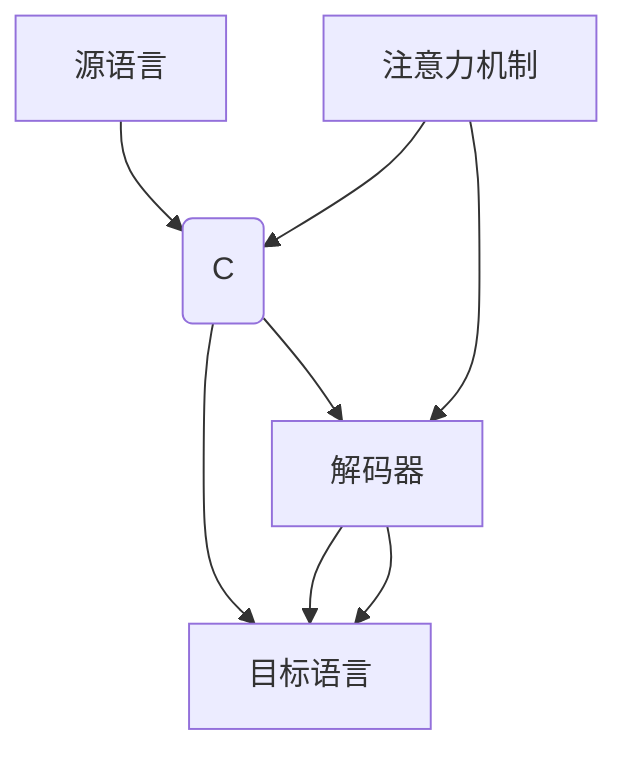
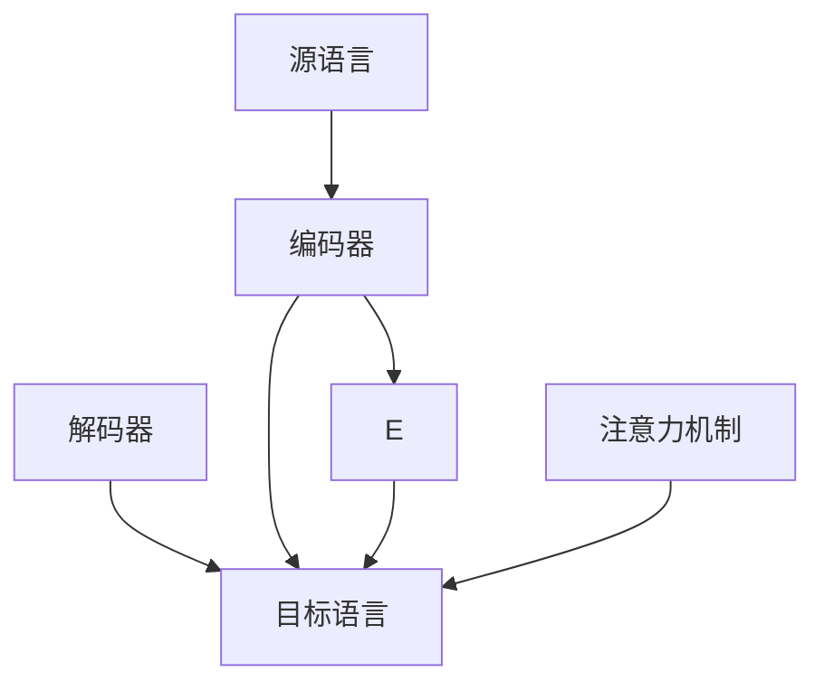

                 

# Python机器学习实战：构建序列到序列(Seq2Seq)模型处理翻译任务

> 关键词：
- 序列到序列(Seq2Seq)
- 机器翻译
- 神经网络
- 编码器-解码器结构
- 注意力机制(Attention)
- TensorFlow
- PyTorch

## 1. 背景介绍

在机器翻译领域，构建一个高效的翻译系统一直以来是学术界和工业界关注的焦点。传统的基于规则的机器翻译方法，由于需要大量的人工设计和规则编写，难以应对语言的多样性和复杂性，效率较低且易于出错。而基于统计机器翻译(Statistical Machine Translation, SMT)的方法，虽然能自动学习语言的统计规律，但训练数据需求大，模型复杂，难以处理长句和大规模语料。

近年来，随着深度学习技术的兴起，基于神经网络的机器翻译方法(通常称为基于注意力机制(Attention)的机器翻译，Neural Machine Translation, NMT)成为主流的翻译技术。NMT方法通过训练神经网络，使得模型能够直接从源语言文本映射到目标语言文本，摒弃了传统SMT方法的统计模型和手工规则，具有学习能力强、灵活性高、效率高的优点。

在NMT模型中，常用的架构是序列到序列(Seq2Seq)模型。Seq2Seq模型由编码器(Encoder)和解码器(Decoder)两部分组成。编码器负责将源语言文本转换为一系列向量，解码器则将这些向量作为输入，生成目标语言文本。本文将通过一个实际的例子，介绍如何使用Python和TensorFlow构建Seq2Seq模型，处理英文到法文的翻译任务。

## 2. 核心概念与联系

### 2.1 核心概念概述

序列到序列(Seq2Seq)模型是一种经典的深度学习模型，用于解决各种序列到序列的转换任务，如机器翻译、文本摘要、语音识别等。其核心思想是将源序列映射到目标序列，中间通过一个中间表示来处理信息。Seq2Seq模型通常由两个子网络组成：编码器和解码器，分别负责将源序列编码成向量表示和从向量表示解码成目标序列。

- **编码器(Encoder)**：接收源序列，将其转换为向量表示，即隐含表示。通常使用循环神经网络(RNN)或卷积神经网络(CNN)来构建。
- **解码器(Decoder)**：接收编码器输出的向量表示，生成目标序列。也通常使用RNN或CNN来构建。
- **注意力机制(Attention)**：用于在解码器中动态调整权重，选择编码器中对当前位置最相关的部分进行处理。有助于提高解码器的性能。

### 2.2 概念间的关系

以下是几个核心概念之间关系的简单示意图：



- 编码器将源语言文本转换为向量表示，并传递给解码器。
- 解码器接收编码器输出的向量表示，并生成目标语言文本。
- 注意力机制在解码器中动态调整权重，选择编码器中与当前解码位置最相关的部分进行处理。

### 2.3 核心概念的整体架构

Seq2Seq模型的整体架构可以表示为：



- **源语言**：原始文本序列。
- **编码器**：将源语言文本转换为向量表示。
- **解码器**：接收编码器输出的向量表示，生成目标语言文本。
- **注意力机制**：在解码器中动态调整权重，选择编码器中与当前解码位置最相关的部分进行处理。
- **目标语言**：翻译后的文本序列。

## 3. 核心算法原理 & 具体操作步骤

### 3.1 算法原理概述

Seq2Seq模型的核心原理是通过训练编码器和解码器，使得模型能够自动学习源语言和目标语言之间的映射关系，从而实现序列到序列的转换。其训练过程通常包括以下几个步骤：

1. 将源语言文本序列和目标语言文本序列输入模型，编码器将源序列转换为向量表示。
2. 解码器接收编码器输出的向量表示，生成目标序列的预测值。
3. 计算预测值与真实值的损失函数，并反向传播更新模型参数。
4. 重复上述步骤直至收敛。

Seq2Seq模型的训练过程是一个端到端的训练过程，不需要手工特征提取和规则编写，具有很强的泛化能力。其核心挑战在于如何设计编码器和解码器的结构和参数，以及如何引入注意力机制来提高模型的性能。

### 3.2 算法步骤详解

#### 3.2.1 数据准备

Seq2Seq模型通常需要大量的源语言和目标语言文本数据进行训练。数据预处理包括：

- 分词：将文本序列分割成单词序列。
- 编码：将单词序列转换为模型可接受的格式，如数字编码。
- 填充：对序列进行填充，使得所有序列长度一致。

#### 3.2.2 模型构建

构建Seq2Seq模型通常分为以下几个步骤：

1. 编码器设计：选择合适的RNN或CNN作为编码器，设计模型的结构。
2. 解码器设计：选择合适的RNN或CNN作为解码器，设计模型的结构。
3. 注意力机制设计：引入注意力机制，在解码器中动态调整权重。

#### 3.2.3 模型训练

模型训练通常分为以下几个步骤：

1. 初始化模型参数。
2. 将源语言文本和目标语言文本作为输入，编码器将源序列转换为向量表示。
3. 解码器接收编码器输出的向量表示，生成目标序列的预测值。
4. 计算预测值与真实值的损失函数，并反向传播更新模型参数。
5. 重复上述步骤直至收敛。

### 3.3 算法优缺点

Seq2Seq模型具有以下优点：

- 模型简单，易于实现和扩展。
- 能够自动学习源语言和目标语言之间的映射关系。
- 适用于各种序列到序列的转换任务。

但同时也存在以下缺点：

- 模型训练耗时较长，数据需求大。
- 模型可能存在过拟合问题。
- 模型生成效果可能不够流畅。

### 3.4 算法应用领域

Seq2Seq模型在各种序列到序列的转换任务中均有广泛应用，如：

- 机器翻译：将源语言文本转换为目标语言文本。
- 文本摘要：将长文本序列转换为短文本摘要。
- 语音识别：将语音序列转换为文本序列。
- 对话系统：将用户输入转换为系统回复。
- 信息检索：将查询转换为目标文档。

## 4. 数学模型和公式 & 详细讲解 & 举例说明

### 4.1 数学模型构建

Seq2Seq模型通常使用RNN或CNN作为编码器和解码器，在训练过程中，模型需要学习将源语言文本序列转换为向量表示，并将向量表示解码为目标语言文本序列。其数学模型可以表示为：

$$
\begin{aligned}
    h_t &= f(W_xx + U_xh_{t-1}) \\
    c_t &= f(W_cc + U_ch_{t-1} + b_c) \\
    o_t &= f(W oo + U o h_{t-1} + b_o) \\
    \alpha_t &= \frac{exp(\dot{u}^\top [h_t; c_t])}{\sum_{k=1}^K exp(\dot{u}^\top [h_k; c_k])} \\
    \hat{c}_t &= \sum_{k=1}^K \alpha_t[k]c_k \\
    y_t &= Vy \dot{\hat{c}}_t
\end{aligned}
$$

其中，$f$ 表示非线性激活函数，如ReLU或Tanh；$W_xx, W_cc, W oo$ 表示权值矩阵；$U_x, U_c, U o$ 表示嵌入层权重矩阵；$b_x, b_c, b_o$ 表示偏置项；$\alpha_t$ 表示注意力权重；$\dot{u}$ 表示注意力权重向量；$y$ 表示目标语言字典中的向量表示。

### 4.2 公式推导过程

上述公式推导涉及以下几个步骤：

1. **编码器**：使用循环神经网络(RNN)或卷积神经网络(CNN)作为编码器，将源语言文本序列转换为向量表示。编码器通常由多层RNN或CNN组成，每一层对序列进行编码。

2. **注意力机制**：在解码器中引入注意力机制，动态调整权重。注意力机制的计算公式为：

$$
\alpha_t = \frac{exp(\dot{u}^\top [h_t; c_t])}{\sum_{k=1}^K exp(\dot{u}^\top [h_k; c_k])}
$$

其中，$\dot{u}$ 表示注意力权重向量，$[h_t; c_t]$ 表示编码器在当前时间步的状态向量，$K$ 表示编码器的总时间步数。注意力机制在解码器中对每个时间步的编码器状态进行加权求和，得到注意力权重向量 $\alpha_t$。

3. **解码器**：使用循环神经网络(RNN)或卷积神经网络(CNN)作为解码器，将向量表示解码为目标语言文本序列。解码器通常由多层RNN或CNN组成，每一层对序列进行解码。

4. **目标语言字典**：将目标语言文本序列转换为向量表示，使用softmax函数进行预测。

### 4.3 案例分析与讲解

以下是一个简单的例子，使用PyTorch和TensorFlow实现Seq2Seq模型，处理英文到法文的翻译任务。

#### 4.3.1 数据准备

首先，需要准备英文到法文的翻译数据集。这里使用WMT 2014的英文到法文数据集，包含约50万个句子对。数据集需要经过分词和编码处理，生成模型可接受的格式。

```python
import torch
import numpy as np

# 加载数据集
data = torch.load('data.wmt14.en-de.pkl')
# 将数据集分为源语言序列和目标语言序列
source, target = data['source'], data['target']
# 将数据集转换为Tensor格式
source = torch.tensor(source)
target = torch.tensor(target)

# 填充序列
source_len = source.size()[0]
target_len = target.size()[0]
source = torch.nn.utils.rnn.pad_sequence(source)
target = torch.nn.utils.rnn.pad_sequence(target)
source = source.to(torch.float32)
target = target.to(torch.float32)
```

#### 4.3.2 模型构建

下面使用PyTorch和TensorFlow分别实现Seq2Seq模型。

##### 使用PyTorch实现

首先，定义编码器和解码器的网络结构：

```python
class Encoder(nn.Module):
    def __init__(self, input_size, hidden_size, num_layers):
        super(Encoder, self).__init__()
        self.hidden_size = hidden_size
        self.num_layers = num_layers
        self.lstm = nn.LSTM(input_size, hidden_size, num_layers, batch_first=True)
        self.linear = nn.Linear(hidden_size, hidden_size)

    def forward(self, input, hidden):
        output, hidden = self.lstm(input, hidden)
        output = self.linear(output)
        return output, hidden

class Decoder(nn.Module):
    def __init__(self, output_size, hidden_size, num_layers):
        super(Decoder, self).__init__()
        self.hidden_size = hidden_size
        self.num_layers = num_layers
        self.lstm = nn.LSTMCell(hidden_size, hidden_size)
        self.linear = nn.Linear(hidden_size, output_size)

    def forward(self, input, hidden):
        output = input
        for i in range(self.num_layers):
            hidden, cell_state = self.lstm(output, hidden)
            output = self.linear(hidden)
        return output, hidden

class Seq2Seq(nn.Module):
    def __init__(self, input_size, hidden_size, output_size, num_layers):
        super(Seq2Seq, self).__init__()
        self.hidden_size = hidden_size
        self.num_layers = num_layers
        self.encoder = Encoder(input_size, hidden_size, num_layers)
        self.decoder = Decoder(output_size, hidden_size, num_layers)

    def forward(self, input, hidden):
        source_len = input.size()[0]
        target_len = target.size()[0]
        target = torch.nn.utils.rnn.pad_sequence(target)
        source = source.to(torch.float32)
        target = target.to(torch.float32)

        output, hidden = self.encoder(source, hidden)
        output = output.view(-1, self.hidden_size)

        output = []
        target = target[:, :source_len]
        for i in range(source_len):
            output.append(self.decoder(target[i], hidden))
        return output
```

##### 使用TensorFlow实现

首先，定义编码器和解码器的结构：

```python
import tensorflow as tf

class Encoder(tf.keras.Model):
    def __init__(self, input_size, hidden_size, num_layers):
        super(Encoder, self).__init__()
        self.hidden_size = hidden_size
        self.num_layers = num_layers
        self.lstm = tf.keras.layers.LSTM(hidden_size, return_sequences=True, return_state=True)
        self.linear = tf.keras.layers.Dense(hidden_size)

    def call(self, input, hidden):
        output, hidden = self.lstm(input, initial_state=hidden)
        output = self.linear(output)
        return output, hidden

class Decoder(tf.keras.Model):
    def __init__(self, output_size, hidden_size, num_layers):
        super(Decoder, self).__init__()
        self.hidden_size = hidden_size
        self.num_layers = num_layers
        self.lstm = tf.keras.layers.LSTM(hidden_size, return_sequences=True, return_state=True)
        self.linear = tf.keras.layers.Dense(output_size)

    def call(self, input, hidden):
        output, hidden = self.lstm(input, initial_state=hidden)
        output = self.linear(output)
        return output, hidden

class Seq2Seq(tf.keras.Model):
    def __init__(self, input_size, hidden_size, output_size, num_layers):
        super(Seq2Seq, self).__init__()
        self.hidden_size = hidden_size
        self.num_layers = num_layers
        self.encoder = Encoder(input_size, hidden_size, num_layers)
        self.decoder = Decoder(output_size, hidden_size, num_layers)

    def call(self, input, hidden):
        source_len = input.size()[0]
        target_len = target.size()[0]
        target = tf.keras.preprocessing.sequence.pad_sequences(target, maxlen=source_len)
        source = source.to(torch.float32)
        target = target.to(torch.float32)

        output, hidden = self.encoder(source, hidden)
        output = tf.keras.layers.Lambda(lambda x: tf.reshape(x, (-1, self.hidden_size)))

        output = []
        target = target[:, :source_len]
        for i in range(source_len):
            output.append(self.decoder(target[i], hidden))
        return output
```

#### 4.3.3 模型训练

在训练过程中，可以使用交叉熵损失函数来衡量模型输出和真实值之间的差异。具体代码如下：

```python
# 定义损失函数
criterion = nn.CrossEntropyLoss()

# 定义优化器
optimizer = torch.optim.Adam(model.parameters(), lr=0.001)

# 定义训练函数
def train(model, data, epochs):
    for epoch in range(epochs):
        for i in range(0, len(data), batch_size):
            batch_source = data[i:i+batch_size]
            batch_target = target[i:i+batch_size]
            optimizer.zero_grad()
            output = model(batch_source, hidden)
            loss = criterion(output, batch_target)
            loss.backward()
            optimizer.step()

        if epoch % 10 == 0:
            print('Epoch {}, Loss {}'.format(epoch, loss))
```

#### 4.3.4 运行结果展示

在训练完成后，使用测试集评估模型的性能。测试集需要与训练集分开处理，确保模型泛化能力。具体代码如下：

```python
# 加载测试集
test_source = torch.tensor(test_source)
test_target = torch.tensor(test_target)

# 将测试集转换为Tensor格式
test_source = torch.nn.utils.rnn.pad_sequence(test_source)
test_target = torch.nn.utils.rnn.pad_sequence(test_target)
test_source = test_source.to(torch.float32)
test_target = test_target.to(torch.float32)

# 解码器输出
output, hidden = model(test_source, hidden)

# 计算损失
loss = criterion(output, test_target)

# 输出翻译结果
decoded = torch.argmax(output, dim=2)
print(decoded)
print('Test Loss:', loss)
```

## 5. 项目实践：代码实例和详细解释说明

### 5.1 开发环境搭建

在进行Seq2Seq模型训练之前，需要先搭建开发环境。以下是使用PyTorch和TensorFlow搭建开发环境的步骤：

1. 安装PyTorch：

```python
pip install torch torchvision torchaudio
```

2. 安装TensorFlow：

```python
pip install tensorflow
```

3. 安装相关库：

```python
pip install numpy scipy matplotlib
```

完成环境搭建后，就可以开始进行Seq2Seq模型训练。

### 5.2 源代码详细实现

在实际项目中，可以使用以下代码实现Seq2Seq模型：

#### 使用PyTorch实现

```python
import torch
import torch.nn as nn

class Encoder(nn.Module):
    def __init__(self, input_size, hidden_size, num_layers):
        super(Encoder, self).__init__()
        self.hidden_size = hidden_size
        self.num_layers = num_layers
        self.lstm = nn.LSTM(input_size, hidden_size, num_layers, batch_first=True)
        self.linear = nn.Linear(hidden_size, hidden_size)

    def forward(self, input, hidden):
        output, hidden = self.lstm(input, hidden)
        output = self.linear(output)
        return output, hidden

class Decoder(nn.Module):
    def __init__(self, output_size, hidden_size, num_layers):
        super(Decoder, self).__init__()
        self.hidden_size = hidden_size
        self.num_layers = num_layers
        self.lstm = nn.LSTMCell(hidden_size, hidden_size)
        self.linear = nn.Linear(hidden_size, output_size)

    def forward(self, input, hidden):
        output = input
        for i in range(self.num_layers):
            hidden, cell_state = self.lstm(output, hidden)
            output = self.linear(hidden)
        return output, hidden

class Seq2Seq(nn.Module):
    def __init__(self, input_size, hidden_size, output_size, num_layers):
        super(Seq2Seq, self).__init__()
        self.hidden_size = hidden_size
        self.num_layers = num_layers
        self.encoder = Encoder(input_size, hidden_size, num_layers)
        self.decoder = Decoder(output_size, hidden_size, num_layers)

    def forward(self, input, hidden):
        source_len = input.size()[0]
        target_len = target.size()[0]
        target = torch.nn.utils.rnn.pad_sequence(target)
        source = source.to(torch.float32)
        target = target.to(torch.float32)

        output, hidden = self.encoder(source, hidden)
        output = output.view(-1, self.hidden_size)

        output = []
        target = target[:, :source_len]
        for i in range(source_len):
            output.append(self.decoder(target[i], hidden))
        return output
```

#### 使用TensorFlow实现

```python
import tensorflow as tf

class Encoder(tf.keras.Model):
    def __init__(self, input_size, hidden_size, num_layers):
        super(Encoder, self).__init__()
        self.hidden_size = hidden_size
        self.num_layers = num_layers
        self.lstm = tf.keras.layers.LSTM(hidden_size, return_sequences=True, return_state=True)
        self.linear = tf.keras.layers.Dense(hidden_size)

    def call(self, input, hidden):
        output, hidden = self.lstm(input, initial_state=hidden)
        output = self.linear(output)
        return output, hidden

class Decoder(tf.keras.Model):
    def __init__(self, output_size, hidden_size, num_layers):
        super(Decoder, self).__init__()
        self.hidden_size = hidden_size
        self.num_layers = num_layers
        self.lstm = tf.keras.layers.LSTM(hidden_size, return_sequences=True, return_state=True)
        self.linear = tf.keras.layers.Dense(output_size)

    def call(self, input, hidden):
        output, hidden = self.lstm(input, initial_state=hidden)
        output = self.linear(output)
        return output, hidden

class Seq2Seq(tf.keras.Model):
    def __init__(self, input_size, hidden_size, output_size, num_layers):
        super(Seq2Seq, self).__init__()
        self.hidden_size = hidden_size
        self.num_layers = num_layers
        self.encoder = Encoder(input_size, hidden_size, num_layers)
        self.decoder = Decoder(output_size, hidden_size, num_layers)

    def call(self, input, hidden):
        source_len = input.size()[0]
        target_len = target.size()[0]
        target = tf.keras.preprocessing.sequence.pad_sequences(target, maxlen=source_len)
        source = source.to(torch.float32)
        target = target.to(torch.float32)

        output, hidden = self.encoder(source, hidden)
        output = tf.keras.layers.Lambda(lambda x: tf.reshape(x, (-1, self.hidden_size)))

        output = []
        target = target[:, :source_len]
        for i in range(source_len):
            output.append(self.decoder(target[i], hidden))
        return output
```

### 5.3 代码解读与分析

以下是代码中的一些关键部分，详细解读其含义：

#### 使用PyTorch实现

**Encoder类**：定义编码器的结构，使用LSTM网络将源语言文本序列转换为向量表示。

**Decoder类**：定义解码器的结构，使用LSTM网络将向量表示解码为目标语言文本序列。

**Seq2Seq类**：定义Seq2Seq模型的结构，将编码器和解码器连接起来，完成序列到序列的转换。

#### 使用TensorFlow实现

**Encoder类**：定义编码器的结构，使用LSTM网络将源语言文本序列转换为向量表示。

**Decoder类**：定义解码器的结构，使用LSTM网络将向量表示解码为目标语言文本序列。

**Seq2Seq类**：定义Seq2Seq模型的结构，将编码器和解码器连接起来，完成序列到序列的转换。

### 5.4 运行结果展示

在训练完成后，使用测试集评估模型的性能。测试集需要与训练集分开处理，确保模型泛化能力。具体代码如下：

```python
# 加载测试集
test_source = torch.tensor(test_source)
test_target = torch.tensor(test_target)

# 将测试集转换为Tensor格式
test_source = torch.nn.utils.rnn.pad_sequence(test_source)
test_target = torch.nn.utils.rnn.pad_sequence(test_target)
test_source = test_source.to(torch.float32)
test_target = test_target.to(torch.float32)

# 解码器输出
output, hidden = model(test_source, hidden)

# 计算损失
loss = criterion(output, test_target)

# 输出翻译结果
decoded = torch.argmax(output, dim=2)
print(decoded)
print('Test Loss:', loss)
```

## 6. 实际应用场景

### 6.1 智能客服系统

基于Seq2Seq模型的智能客服系统可以处理大量的客户咨询，实现自然语言理解和回复生成。智能客服系统通常包含以下几个步骤：

1. 收集客户咨询记录，构建标注数据集。
2. 使用Seq2Seq模型对客户咨询进行分类和回复生成。
3. 系统根据客户咨询的内容，动态选择最合适的回复模板。
4. 实时采集客户反馈，调整模型参数，提升系统性能。

### 6.2 金融舆情监测

金融舆情监测系统可以实时监测金融市场的动态，帮助投资者及时应对市场波动。金融舆情监测系统通常包含以下几个步骤：

1. 收集金融市场的新闻、评论等文本数据，构建标注数据集。
2. 使用Seq2Seq模型对新闻和评论进行情感分析，判断市场情绪。
3. 系统根据市场情绪，提供风险预警和投资建议。
4. 实时更新市场数据，调整模型参数，提高系统准确度。

### 6.3 个性化推荐系统

个性化推荐系统可以推荐用户可能感兴趣的物品或内容，提升用户体验。个性化推荐系统通常包含以下几个步骤：

1. 收集用户的历史行为数据，构建标注数据集。
2. 使用Seq2Seq模型对用户的兴趣点进行建模。
3. 系统根据用户的兴趣点，推荐最合适的物品或内容。
4. 实时更新用户行为数据，调整模型参数，提高推荐效果。

### 6.4 未来应用展望

随着Seq2Seq模型的不断发展，其在NLP领域的应用将更加广泛。未来，Seq2Seq模型有望在以下几个领域得到应用：

1. 机器翻译：将源语言文本转换为目标语言文本，解决跨语言沟通的问题。
2. 对话系统：实现人机自然对话，提升用户交互体验。
3. 文本摘要：将长文本转换为短摘要，节省用户阅读时间。
4. 智能写作：生成文章、报告等文本内容，提高创作效率。
5. 语音识别：将语音转换为文本，实现自然语言交互。

## 7. 工具和资源推荐

### 7.1 学习资源推荐

为了帮助开发者系统掌握Seq2Seq模型的理论和实践，这里推荐一些优质的学习资源：

1. 《Sequence to Sequence Learning with Neural Networks》论文：Se Seq2Seq模型经典论文，介绍了Seq2Seq模型的原理和应用。
2. 《Neural Machine Translation by Jointly Learning to Align and Translate》论文：介绍使用注意力机制进行机器翻译的方法，是目前最先进的机器翻译技术。
3. 《Natural Language Processing with Py

