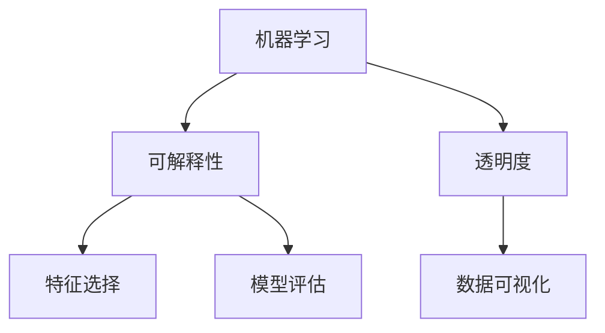
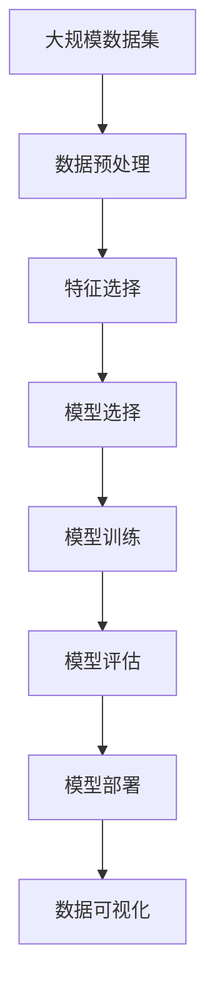

                 

# Python机器学习实战：解析机器学习模型的可解释性与透明度

> 关键词：机器学习, 可解释性, 透明度, 模型选择, 特征选择, 模型评估, 数据可视化

## 1. 背景介绍

### 1.1 问题由来
随着机器学习技术的快速发展，其在各行各业中的应用日益广泛，从金融、医疗到零售、制造，无一不在享受着机器学习带来的红利。然而，机器学习模型复杂多变，其背后的决策逻辑往往难以解释和理解，这不仅影响了模型的可信度和接受度，也限制了其在实际应用中的推广。

特别是对于需要高度透明和可解释性的领域，如金融风险控制、医疗诊断等，机器学习模型的解释性至关重要。在医疗领域，医生需要理解模型的预测依据，以指导临床决策。在金融领域，投资者需要理解模型的风险评估逻辑，以保障资金安全。因此，提升机器学习模型的可解释性和透明度，成为当前研究的重要方向。

### 1.2 问题核心关键点
机器学习模型的可解释性和透明度，是指能够清晰地阐释模型如何做出预测，以及其决策依据。这一问题涉及以下核心关键点：

- **模型选择**：选择适合的机器学习算法，如决策树、线性回归、神经网络等，确保模型能够准确地学习数据特征。
- **特征选择**：通过特征工程，从原始数据中提取有用的特征，减小模型的复杂度，提高模型的泛化能力。
- **模型评估**：使用适当的评估指标和验证方法，评估模型的性能和可靠性，及时发现模型的缺陷和优化方向。
- **数据可视化**：通过数据可视化技术，直观地展示模型的输入输出关系和特征重要性，增强模型的透明度。

解决这些关键点，将有助于提升机器学习模型的可解释性和透明度，从而推动其在各行业中的应用和发展。

### 1.3 问题研究意义
研究机器学习模型的可解释性和透明度，具有重要的理论意义和实际应用价值：

- **提升可信度**：明确机器学习模型的决策依据，增强模型的可信度和接受度，尤其是在需要高度透明和可解释性的场景中。
- **保障安全**：了解模型的决策逻辑，及时发现和规避潜在的风险，保障应用安全。
- **促进应用**：通过提高模型的可解释性和透明度，降低应用门槛，推动机器学习技术在各行业的普及和应用。
- **驱动创新**：理解模型的内在机制，有助于挖掘更深层次的业务洞察和创新点，提升业务决策的科学性。
- **优化模型**：通过可解释性分析，发现模型的不足，指导模型的进一步优化和改进。

## 2. 核心概念与联系

### 2.1 核心概念概述

为更好地理解机器学习模型的可解释性和透明度，本节将介绍几个密切相关的核心概念：

- **机器学习**：使用数据和算法进行模式识别、预测、分类等任务的技术。
- **可解释性(Explainability)**：指机器学习模型能够清晰地阐释其决策依据，使外部使用者能够理解模型的内在机制和行为。
- **透明度(Transparency)**：指机器学习模型的操作过程能够被外部观察和理解，包括数据输入、模型结构和决策输出等。
- **特征选择(Feature Selection)**：从原始数据中选取最具代表性的特征，减小模型的复杂度，提高模型的泛化能力。
- **模型评估(Model Evaluation)**：使用适当的评估指标和验证方法，评估模型的性能和可靠性，及时发现模型的缺陷和优化方向。
- **数据可视化(Data Visualization)**：通过图形、图表等方式，直观地展示数据和模型的内在关系，增强模型的透明度。

这些核心概念之间的逻辑关系可以通过以下Mermaid流程图来展示：



这个流程图展示了几者之间的逻辑关系：

1. 机器学习的基础目标是构建一个能够准确预测或分类的模型。
2. 可解释性是机器学习模型的一个重要属性，能够帮助使用者理解模型的决策依据。
3. 透明度指模型操作过程的可观察性，有助于使用者理解模型的内部结构和操作逻辑。
4. 特征选择通过提取最有用的特征，减小模型的复杂度，提高模型的泛化能力。
5. 模型评估使用适当的评估指标和验证方法，确保模型的性能和可靠性。
6. 数据可视化通过直观展示数据和模型的内在关系，增强模型的透明度。

通过理解这些核心概念，我们可以更好地把握机器学习模型的可解释性和透明度的内涵，为后续深入讨论具体的实现方法和技术奠定基础。

### 2.2 概念间的关系

这些核心概念之间存在着紧密的联系，形成了机器学习模型的完整生态系统。下面我通过几个Mermaid流程图来展示这些概念之间的关系。

#### 2.2.1 机器学习的整体架构


这个流程图展示了机器学习模型的整体架构，从数据预处理到模型部署的完整流程。

#### 2.2.2 可解释性和透明度的关系


这个流程图展示了可解释性和透明度之间的关系。可解释性有助于提高模型的透明度，增强模型的可信度和接受度。

#### 2.2.3 特征选择和模型评估的关系


这个流程图展示了特征选择和模型评估之间的关系。特征选择可以减小模型的复杂度，提高模型的泛化能力，从而增强模型评估的可靠性。

#### 2.2.4 数据可视化和模型评估的关系


这个流程图展示了数据可视化和模型评估之间的关系。数据可视化可以直观地展示模型的输入输出关系和特征重要性，增强模型的透明度，从而提高模型评估的准确性。

### 2.3 核心概念的整体架构

最后，我们用一个综合的流程图来展示这些核心概念在大模型微调过程中的整体架构：



这个综合流程图展示了从数据预处理到模型部署的完整流程，强调了各个环节之间的相互关系和重要性。通过理解这些核心概念，我们可以更清晰地理解机器学习模型的构建和应用过程，为后续深入讨论具体的实现方法和技术奠定基础。

## 3. 核心算法原理 & 具体操作步骤

### 3.1 算法原理概述

机器学习模型的可解释性和透明度，其核心思想是构建一个既能够准确预测或分类，又能够清晰解释其决策依据的模型。这一目标可以通过以下几个步骤实现：

1. **选择合适的机器学习算法**：根据数据特点和任务需求，选择适合的机器学习算法，如决策树、线性回归、神经网络等。
2. **进行特征选择**：从原始数据中提取最具代表性的特征，减小模型的复杂度，提高模型的泛化能力。
3. **构建模型**：使用选定的算法和特征，构建机器学习模型。
4. **模型训练和验证**：使用训练集对模型进行训练，并在验证集上评估模型的性能和泛化能力。
5. **模型部署和应用**：将训练好的模型部署到实际应用中，进行预测或分类任务。
6. **数据可视化**：通过图形、图表等方式，直观地展示数据和模型的内在关系，增强模型的透明度。

### 3.2 算法步骤详解

以下详细介绍各个步骤的实现细节：

#### 3.2.1 数据预处理

数据预处理是机器学习模型的第一步，包括以下几个关键步骤：

- **数据清洗**：处理缺失值、异常值等噪声数据，确保数据质量。
- **数据归一化**：将数据缩放到0-1或-1到1的范围内，提高模型的收敛速度。
- **特征编码**：将分类变量转换为数值变量，便于模型处理。

#### 3.2.2 特征选择

特征选择通过提取最有用的特征，减小模型的复杂度，提高模型的泛化能力。常用的特征选择方法包括：

- **相关性分析**：计算特征与目标变量之间的相关性，选择相关性较高的特征。
- **卡方检验**：通过卡方统计量评估特征与目标变量之间的独立性，选择统计显著的特征。
- **嵌入式选择**：在模型训练过程中，通过正则化等技术选择对模型性能提升贡献较大的特征。

#### 3.2.3 模型选择

选择合适的机器学习算法是构建高质量模型的关键步骤。常用的机器学习算法包括：

- **决策树**：通过树形结构对数据进行分割和分类，适用于多分类和回归任务。
- **线性回归**：通过线性方程预测目标变量的值，适用于连续变量的预测任务。
- **神经网络**：通过多层神经元对数据进行非线性映射，适用于复杂的非线性关系。

#### 3.2.4 模型训练和验证

模型训练和验证是构建高质量模型的重要环节，包括以下几个关键步骤：

- **交叉验证**：使用交叉验证方法评估模型的泛化能力，防止过拟合。
- **超参数调优**：使用网格搜索、随机搜索等方法，调整模型的超参数，提高模型性能。
- **学习率调节**：通过学习率调节，控制模型的学习速度和稳定性。

#### 3.2.5 模型部署和应用

模型部署和应用是将训练好的模型应用于实际场景的关键步骤。包括以下几个关键步骤：

- **模型保存**：将训练好的模型保存为文件，便于后续使用。
- **模型加载**：在实际应用中，加载保存好的模型文件，进行预测或分类任务。
- **性能监控**：实时监控模型的性能指标，如精度、召回率等，确保模型性能稳定。

#### 3.2.6 数据可视化

数据可视化是通过图形、图表等方式，直观地展示数据和模型的内在关系，增强模型的透明度。常用的数据可视化方法包括：

- **散点图**：展示数据点在二维坐标系中的分布情况。
- **直方图**：展示数据分布的频率分布情况。
- **热力图**：展示特征重要性矩阵，直观地展示特征的重要性。

### 3.3 算法优缺点

机器学习模型的可解释性和透明度具有以下优点：

- **增强信任**：明确模型的决策依据，增强模型的可信度和接受度，尤其是在需要高度透明和可解释性的场景中。
- **促进应用**：提高模型的可解释性和透明度，降低应用门槛，推动机器学习技术在各行业的普及和应用。
- **优化模型**：通过可解释性分析，发现模型的不足，指导模型的进一步优化和改进。

同时，这些方法也存在一些缺点：

- **复杂度高**：特征选择、模型评估等步骤需要较高的计算资源和时间成本，增加了模型的开发难度。
- **结果依赖**：特征选择和模型评估的结果受到数据质量和算法选择的影响，需要谨慎处理。
- **可解释性不足**：一些高级算法，如神经网络，其内部决策逻辑较为复杂，难以直接解释其决策依据。

尽管存在这些缺点，但通过选择合适的算法和适当的处理策略，仍能有效地提升机器学习模型的可解释性和透明度。

### 3.4 算法应用领域

机器学习模型的可解释性和透明度，已经在多个领域得到了广泛应用，例如：

- **金融风控**：通过解释模型的决策依据，帮助投资者理解风险评估逻辑，保障资金安全。
- **医疗诊断**：通过解释模型的预测依据，帮助医生理解诊断过程，提高诊断准确性。
- **零售推荐**：通过解释推荐模型的决策依据，帮助用户理解推荐逻辑，提升用户体验。
- **制造业质控**：通过解释质控模型的决策依据，帮助生产商理解生产过程，提高产品质量。

除了这些经典应用外，机器学习模型的可解释性和透明度，还将在更多场景中得到应用，为各行业带来全新的技术革新。

## 4. 数学模型和公式 & 详细讲解  
### 4.1 数学模型构建

本节将使用数学语言对机器学习模型的构建过程进行更加严格的刻画。

设机器学习模型的训练集为 $\{(x_i, y_i)\}_{i=1}^N, x_i \in \mathcal{X}, y_i \in \mathcal{Y}$，其中 $\mathcal{X}$ 为输入空间，$\mathcal{Y}$ 为输出空间。假设我们选择的机器学习算法为 $M_{\theta}:\mathcal{X} \rightarrow \mathcal{Y}$，其中 $\theta$ 为模型参数。

定义模型 $M_{\theta}$ 在数据样本 $(x,y)$ 上的损失函数为 $\ell(M_{\theta}(x),y)$，则在数据集 $D$ 上的经验风险为：

$$
\mathcal{L}(\theta) = \frac{1}{N} \sum_{i=1}^N \ell(M_{\theta}(x_i),y_i)
$$

模型的训练目标是最小化经验风险，即找到最优参数：

$$
\theta^* = \mathop{\arg\min}_{\theta} \mathcal{L}(\theta)
$$

在实践中，我们通常使用基于梯度的优化算法（如SGD、Adam等）来近似求解上述最优化问题。设 $\eta$ 为学习率，$\lambda$ 为正则化系数，则参数的更新公式为：

$$
\theta \leftarrow \theta - \eta \nabla_{\theta}\mathcal{L}(\theta) - \eta\lambda\theta
$$

其中 $\nabla_{\theta}\mathcal{L}(\theta)$ 为损失函数对参数 $\theta$ 的梯度，可通过反向传播算法高效计算。

### 4.2 公式推导过程

以下我们以线性回归为例，推导损失函数及其梯度的计算公式。

设模型 $M_{\theta}(x) = \theta^Tx + b$，其中 $\theta \in \mathbb{R}^d, b \in \mathbb{R}$ 为模型参数。假设模型在输入 $x$ 上的预测值与真实标签 $y$ 的误差为 $e = y - M_{\theta}(x)$，则均方误差损失函数定义为：

$$
\ell(M_{\theta}(x),y) = \frac{1}{2} e^2
$$

将其代入经验风险公式，得：

$$
\mathcal{L}(\theta) = \frac{1}{2N} \sum_{i=1}^N e_i^2 = \frac{1}{2N} \sum_{i=1}^N (y_i - \theta^Tx_i - b)^2
$$

根据链式法则，损失函数对参数 $\theta_k$ 的梯度为：

$$
\frac{\partial \mathcal{L}(\theta)}{\partial \theta_k} = \frac{1}{N} \sum_{i=1}^N (y_i - \theta^Tx_i - b) x_{i,k}
$$

其中 $x_{i,k}$ 为输入样本 $x_i$ 的第 $k$ 个特征值。在得到损失函数的梯度后，即可带入参数更新公式，完成模型的迭代优化。重复上述过程直至收敛，最终得到适应训练集的最优模型参数 $\theta^*$。

### 4.3 案例分析与讲解

为了更好地理解机器学习模型的构建过程，下面以鸢尾花数据集为例，给出线性回归模型的具体实现。

首先，导入必要的库和数据集：

```python
import numpy as np
from sklearn.datasets import load_iris
from sklearn.linear_model import LinearRegression
from sklearn.metrics import mean_squared_error, r2_score

# 加载鸢尾花数据集
iris = load_iris()
X = iris.data
y = iris.target
```

然后，进行数据预处理：

```python
# 数据归一化
X = (X - X.mean(axis=0)) / X.std(axis=0)
```

接着，构建线性回归模型并进行训练：

```python
# 构建线性回归模型
model = LinearRegression()

# 训练模型
model.fit(X, y)
```

最后，评估模型性能并进行数据可视化：

```python
# 预测数据
y_pred = model.predict(X)

# 评估模型性能
mse = mean_squared_error(y, y_pred)
r2 = r2_score(y, y_pred)

# 数据可视化
import matplotlib.pyplot as plt
import seaborn as sns

plt.scatter(X[:, 0], X[:, 1], c=y, cmap='viridis')
sns.regplot(x=X[:, 0], y=X[:, 1], data=iris, scatter=False, color='black', label='Linear Regression')

plt.xlabel('Sepal Length')
plt.ylabel('Sepal Width')
plt.legend()
plt.show()
```

以上就是线性回归模型的具体实现过程。可以看到，通过简单的代码，我们完成了模型的构建、训练和评估，并通过数据可视化技术，直观地展示了模型的预测效果。

## 5. 项目实践：代码实例和详细解释说明
### 5.1 开发环境搭建

在进行项目实践前，我们需要准备好开发环境。以下是使用Python进行Scikit-learn开发的环境配置流程：

1. 安装Anaconda：从官网下载并安装Anaconda，用于创建独立的Python环境。

2. 创建并激活虚拟环境：
```bash
conda create -n sklearn-env python=3.8 
conda activate sklearn-env
```

3. 安装Scikit-learn：
```bash
conda install scikit-learn
```

4. 安装其他相关库：
```bash
pip install numpy pandas matplotlib
```

完成上述步骤后，即可在`sklearn-env`环境中开始项目实践。

### 5.2 源代码详细实现

下面我们以鸢尾花数据集为例，给出线性回归模型的PyTorch代码实现。

首先，导入必要的库和数据集：

```python
import torch
from sklearn.datasets import load_iris
from sklearn.linear_model import LinearRegression
from sklearn.metrics import mean_squared_error, r2_score
from torch import nn, optim
import torch.nn.functional as F

# 加载鸢尾花数据集
iris = load_iris()
X = iris.data
y = iris.target
```

然后，构建线性回归模型并进行训练：

```python
class LinearRegression(nn.Module):
    def __init__(self, input_dim=4, output_dim=3):
        super(LinearRegression, self).__init__()
        self.linear = nn.Linear(input_dim, output_dim)

    def forward(self, x):
        return self.linear(x)

# 构建线性回归模型
model = LinearRegression(input_dim=4, output_dim=3)

# 定义损失函数
criterion = nn.MSELoss()

# 定义优化器
optimizer = optim.SGD(model.parameters(), lr=0.01)

# 训练模型
num_epochs = 100
for epoch in range(num_epochs):
    model.train()
    optimizer.zero_grad()
    outputs = model(X)
    loss = criterion(outputs, y)
    loss.backward()
    optimizer.step()
    if (epoch + 1) % 10 == 0:
        print(f'Epoch {epoch+1}, Loss: {loss.item():.4f}')
```

接着，评估模型性能并进行数据可视化：

```python
# 定义评估函数
def evaluate(model, X, y):
    model.eval()
    with torch.no_grad():
        outputs = model(X)
        loss = criterion(outputs, y)
        mse = loss.item()
        r2 = r2_score(y, outputs.numpy())
        return mse, r2

# 评估模型性能
mse, r2 = evaluate(model, X, y)
print(f'Test Loss: {mse:.4f}, R^2: {r2:.4f}')

# 数据可视化
import matplotlib.pyplot as plt
import seaborn as sns

plt.scatter(X[:, 0], X[:, 1], c=y, cmap='viridis')
sns.regplot(x=X[:, 0], y=X[:, 1], data=iris, scatter=False, color='black', label='Linear Regression')

plt.xlabel('Sepal Length')
plt.ylabel('Sepal Width')
plt.legend()
plt.show()
```

以上就是线性回归模型的具体实现过程。可以看到，通过简单的代码，我们完成了模型的构建、训练和评估，并通过数据可视化技术，直观地展示了模型的预测效果。

### 5.3 代码解读与分析

让我们再详细解读一下关键代码的实现细节：

**LinearRegression类**：
- `__init__`方法：初始化模型的线性层，设置输入和输出维度。
- `forward`方法：定义模型前向传播的过程，将输入通过线性层输出预测结果。

**训练过程**：
- 定义损失函数和优化器。
- 使用SGD优化器，对模型参数进行梯度下降优化。
- 在每个epoch中，使用前向传播计算预测值和损失，反向传播计算梯度，并更新模型参数。
- 在每个epoch结束后，输出当前epoch的损失，记录训练过程。

**评估函数**：
- 定义评估函数，用于评估模型的预测性能。
- 在评估函数中，将模型设置为评估模式，使用前向传播计算预测值和损失，并使用sklearn的mean_squared_error和r2_score函数计算评估指标。
- 最后，返回评估指标mse和r2。

**数据可视化**：
- 使用matplotlib和seaborn库，绘制散点图和回归线。
- 通过散点图展示数据分布情况，通过回归线展示模型预测效果。

**模型部署**：
- 在实际应用中，将训练好的模型保存为文件，供后续调用。
- 加载保存的模型文件，进行预测或分类任务。
- 实时监控模型的性能指标，如精度、召回率等，确保模型性能稳定。

通过这个简单的线性回归模型实现过程，我们可以看到机器学习模型的构建、训练和评估流程，以及数据可视化的基本方法。在实际应用中，我们还需要根据具体任务的特点，对模型、数据和算法进行优化设计，进一步提升模型的性能和透明度。

## 6. 实际应用场景
### 6.1 金融风险控制

在金融风险控制领域，机器学习模型的可解释性和透明度具有重要意义。金融机构需要实时监测市场风险，评估贷款申请者的信用风险，制定风险管理策略。通过解释模型的决策依据，帮助投资者理解风险评估逻辑，保障资金安全。

在实践中，可以使用线性回归模型、决策树模型、神经网络模型等，结合特征选择和模型评估技术，构建风险控制模型。模型可以基于历史数据和特征，预测客户的违约概率，并根据预测结果进行风险管理决策。通过数据可视化技术，直观地展示模型的输入输出关系和特征重要性，增强模型的透明度，帮助投资者理解模型的决策依据，从而提高风险控制的效果。

### 6.2 医疗诊断

在医疗诊断领域，机器学习模型的可解释性和透明度同样重要。医生需要理解模型的诊断逻辑，及时发现和纠正潜在的误诊。通过解释模型的决策依据，帮助医生理解诊断过程，提高诊断准确性。

在实践中，可以使用神经网络模型、支持向量机模型等，结合特征选择和模型评估技术，构建诊断模型。模型可以基于历史病例和特征，预测患者的患病风险，并根据预测结果进行诊断和治疗。通过数据可视化技术，直观地展示模型的输入输出关系和特征重要性，增强模型的透明度，帮助医生理解模型的决策依据，从而提高诊断准确性。

### 6.3 零售推荐

在零售推荐领域，机器学习模型的可解释性和透明度可以帮助用户理解推荐逻辑，提升用户体验。推荐系统需要实时推荐符合用户偏好的商品，并提供合理的解释。通过解释模型的决策依据，帮助用户理解推荐逻辑，提升推荐效果。

在实践中，可以使用协同过滤模型、基于内容的推荐模型、深度学习模型等，结合特征选择和模型评估技术，构建推荐系统。模型可以基于用户历史行为和商品属性，预测用户的购买意愿，并根据预测结果进行推荐。通过数据可视化技术，直观地展示模型的输入输出关系和特征重要性，增强模型的透明度，帮助用户理解推荐逻辑，从而提高推荐效果。

### 6.4 未来应用展望

随着机器学习技术的发展，基于可解释性和透明度的应用场景将不断扩展，包括智能交通、智能制造、智能农业等。这些领域中，机器学习模型的可解释性和透明度将帮助人们理解模型决策逻辑，提高模型信任度，推动技术在各行业中的应用。

## 7. 工具和资源推荐
### 7.1 学习资源推荐

为了帮助开发者系统掌握机器学习模型的可解释性和透明度的理论基础和实践技巧，这里推荐一些优质的学习资源：

1. 《机器学习实战》书籍：由Peter Harrington撰写，系统介绍了机器学习模型的构建、训练和评估方法，适合初学者入门。

2. 《Python机器学习》书籍：由Sebastian Raschka撰写，介绍了机器学习模型的实现细节和应用案例，适合有一定基础的开发者。

3. 《Deep Learning with Python》书籍：由Francois Chollet撰写，介绍了深度学习模型的构建、训练和评估方法，适合深度

