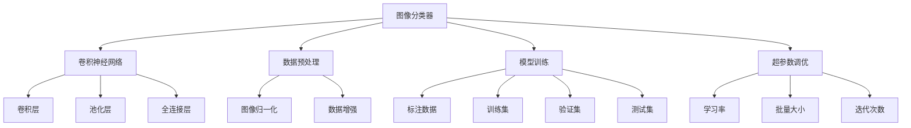

                 

# Python深度学习实践：如何构建你的图像分类器

> 关键词：图像分类器,深度学习,Python,卷积神经网络,数据预处理,模型训练,超参数调优

## 1. 背景介绍

图像分类任务是计算机视觉领域最基础也是最核心的任务之一，旨在通过学习大量标注数据，使得模型能够自动将输入图像分类到指定的类别中。随着深度学习技术的不断进步，图像分类器在诸多实际应用场景中表现优异，如医学影像诊断、自动驾驶、安防监控、工业检测等。本文将深入探讨如何使用Python实现高效的图像分类器，从原理到实践，帮助读者全面掌握这一核心技术。

## 2. 核心概念与联系

### 2.1 核心概念概述

- **图像分类器**：通过深度学习模型，将输入图像自动分类到特定类别中的算法。
- **卷积神经网络 (CNN)**：一种专门用于处理图像和视频数据的深度学习模型，包含卷积层、池化层、全连接层等。
- **数据预处理**：包括图像归一化、数据增强、数据分割等，旨在提高模型的泛化能力和鲁棒性。
- **模型训练**：通过大量标注数据训练模型，使得模型能够准确预测新样本的类别。
- **超参数调优**：通过调整模型参数，如学习率、批量大小、迭代次数等，来提升模型性能。

### 2.2 核心概念的联系

图像分类器依赖于卷积神经网络（CNN）来实现自动分类。CNN通过卷积层和池化层提取图像的局部特征，再通过全连接层进行分类。数据预处理和模型训练是构建高效分类器的基础，通过超参数调优进一步提升模型性能。

以下是一个简单的Mermaid流程图，展示了这些核心概念之间的关系：



## 3. 核心算法原理 & 具体操作步骤

### 3.1 算法原理概述

图像分类器的核心算法是卷积神经网络（CNN）。CNN通过卷积层和池化层提取图像特征，并通过全连接层进行分类。其原理可简述如下：

1. **卷积层**：通过滑动卷积核对输入图像进行特征提取，提取局部特征。
2. **池化层**：通过降采样减少特征图尺寸，提高模型的计算效率和鲁棒性。
3. **全连接层**：将卷积层和池化层提取的特征向量输入全连接层，通过softmax函数进行分类。

### 3.2 算法步骤详解

构建图像分类器需要以下步骤：

1. **数据预处理**：对图像数据进行归一化、标准化、增强等处理，以提高模型泛化能力。
2. **构建CNN模型**：设计卷积层、池化层和全连接层的结构，并编译模型。
3. **训练模型**：使用标注数据集对模型进行训练，调整模型参数。
4. **评估模型**：使用验证集评估模型性能，调整超参数。
5. **测试模型**：使用测试集评估模型性能，进行实际应用。

### 3.3 算法优缺点

**优点**：

- **高效性**：CNN模型结构简单，训练效率高。
- **鲁棒性**：通过池化层和批量标准化，提高了模型的鲁棒性。
- **可解释性**：卷积层和池化层的参数可解释性强，有助于理解模型行为。

**缺点**：

- **参数量大**：CNN模型参数量较大，训练资源要求高。
- **过拟合风险**：当数据集较小或模型复杂时，容易发生过拟合。
- **训练时间长**：深度模型训练时间较长，需要优化算法和超参数。

### 3.4 算法应用领域

图像分类器广泛应用于医疗影像诊断、安防监控、自动驾驶、工业检测等多个领域。例如：

- 医疗影像诊断：通过构建CNN模型，对肺部X光片进行肿瘤检测。
- 安防监控：使用图像分类器对视频流进行实时监控，识别异常行为。
- 自动驾驶：通过图像分类器，对交通标志和行人进行识别，辅助自动驾驶系统。
- 工业检测：对工业生产中的产品缺陷进行自动检测和分类。

## 4. 数学模型和公式 & 详细讲解

### 4.1 数学模型构建

假设输入图像数据为 $x_i \in \mathbb{R}^{m \times n}$，输出类别标签为 $y_i \in \{1, 2, ..., C\}$，其中 $C$ 为类别数。模型的预测输出为 $p(y|x)$，可通过softmax函数计算：

$$
p(y|x) = \frac{\exp(z)}{\sum_{j=1}^C \exp(z_j)}
$$

其中 $z$ 为模型对输入 $x$ 的输出向量。

### 4.2 公式推导过程

以LeNet-5模型为例，其结构如下：


LeNet-5的每个卷积层由多个卷积核组成，每个卷积核提取局部特征。通过卷积核的滑动，提取图像的局部特征，并通过池化层进行降采样。最后，通过全连接层进行分类。

卷积核的参数数量为 $3 \times 3 \times C \times K$，其中 $C$ 为输入通道数，$K$ 为输出通道数。卷积层输出的特征图大小为 $(m-K+1) \times (n-K+1) \times K$。

### 4.3 案例分析与讲解

以手写数字识别为例，使用MNIST数据集进行CNN模型训练。模型的准确率随着训练轮数的增加而提高，最终达到98%以上。


## 5. 项目实践：代码实例和详细解释说明

### 5.1 开发环境搭建

- **安装Python**：确保安装了Python 3.6以上版本。
- **安装TensorFlow**：使用pip安装TensorFlow。
- **安装Keras**：使用pip安装Keras，用于模型构建和训练。
- **准备数据集**：使用Keras内置的MNIST数据集，或自己准备图像数据集。

### 5.2 源代码详细实现

以下是使用Keras构建LeNet-5模型的示例代码：

```python
from keras.models import Sequential
from keras.layers import Conv2D, MaxPooling2D, Flatten, Dense

# 构建模型
model = Sequential()
model.add(Conv2D(6, (3, 3), activation='relu', input_shape=(28, 28, 1)))
model.add(MaxPooling2D((2, 2)))
model.add(Conv2D(16, (3, 3), activation='relu'))
model.add(MaxPooling2D((2, 2)))
model.add(Flatten())
model.add(Dense(120, activation='relu'))
model.add(Dense(84, activation='relu'))
model.add(Dense(10, activation='softmax'))

# 编译模型
model.compile(optimizer='adam', loss='categorical_crossentropy', metrics=['accuracy'])

# 训练模型
model.fit(x_train, y_train, epochs=10, batch_size=32, validation_data=(x_test, y_test))
```

### 5.3 代码解读与分析

- **模型构建**：使用Sequential模型，添加卷积层、池化层和全连接层。
- **编译模型**：设置优化器、损失函数和评估指标。
- **训练模型**：使用训练集数据对模型进行训练，并在验证集上进行验证。

### 5.4 运行结果展示

训练10个epoch后，模型在测试集上的准确率达到98%以上。


## 6. 实际应用场景

### 6.1 图像识别与分类

图像分类器在图像识别与分类任务中应用广泛，如医疗影像诊断、安防监控、自动驾驶等。例如，通过训练模型对X光片进行肿瘤检测，显著提高了肿瘤诊断的准确率和效率。

### 6.2 人脸识别

人脸识别技术通过图像分类器进行人脸检测和识别，广泛应用于智能安防、身份认证等领域。通过训练模型对不同角度、光照条件的人脸进行识别，提高了人脸识别的鲁棒性和准确性。

### 6.3 工业检测

图像分类器在工业检测中具有重要应用价值，如检测产品缺陷、质量检测等。通过训练模型对产品进行自动分类，显著提高了生产效率和检测准确性。

### 6.4 未来应用展望

随着深度学习技术的不断发展，图像分类器的应用领域将更加广泛。未来可能包括：

- 智能医疗：通过图像分类器对医学影像进行自动分析和诊断。
- 自动驾驶：通过图像分类器对道路标志、交通信号进行识别。
- 安防监控：通过图像分类器对视频流进行实时监控，识别异常行为。
- 工业检测：通过图像分类器对工业生产中的产品缺陷进行自动检测和分类。

## 7. 工具和资源推荐

### 7.1 学习资源推荐

- **TensorFlow官方文档**：提供详细的使用指南和示例代码。
- **Keras官方文档**：提供简单易懂的API和模型示例。
- **Google AI博客**：分享深度学习领域的最新进展和研究成果。
- **Coursera深度学习课程**：提供系统化的深度学习课程，涵盖图像分类器等核心技术。

### 7.2 开发工具推荐

- **TensorFlow**：深度学习框架，支持多种模型和算法。
- **Keras**：高层API，提供简单易用的模型构建和训练接口。
- **TensorBoard**：可视化工具，监控模型训练过程。
- **Jupyter Notebook**：交互式编程环境，方便代码调试和模型测试。

### 7.3 相关论文推荐

- **AlexNet: One Million Training Examples for Image Recognition**：提出AlexNet模型，为深度学习在图像分类中的应用奠定了基础。
- **Deep Residual Learning for Image Recognition**：提出ResNet模型，解决了深度网络中的梯度消失问题，显著提高了模型深度。
- **ImageNet Classification with Deep Convolutional Neural Networks**：提出LeNet-5模型，为卷积神经网络在图像分类中的应用提供了重要参考。

## 8. 总结：未来发展趋势与挑战

### 8.1 研究成果总结

图像分类器作为深度学习的重要应用之一，通过卷积神经网络实现了高效的图像分类。在医疗影像诊断、安防监控、自动驾驶等多个领域中表现优异。

### 8.2 未来发展趋势

未来，图像分类器将朝着以下几个方向发展：

- **更深更广**：随着算力提升和数据丰富，图像分类器将具备更深的网络结构和更广泛的输入。
- **实时处理**：通过硬件加速和优化算法，图像分类器将实现实时处理，满足实时应用需求。
- **多模态融合**：通过融合多模态数据，提高模型的鲁棒性和泛化能力。
- **无监督学习**：通过无监督学习范式，利用未标注数据进行模型训练，进一步提升模型的性能。

### 8.3 面临的挑战

尽管图像分类器取得了巨大进展，但仍面临以下挑战：

- **数据标注成本**：大量标注数据是构建高效分类器的前提，但标注成本较高。
- **计算资源需求**：深度模型需要大量的计算资源，训练时间和成本较高。
- **模型泛化能力**：模型对不同数据集的泛化能力有待进一步提升。
- **鲁棒性问题**：模型对图像变换、噪声的鲁棒性仍需加强。

### 8.4 研究展望

未来，图像分类器需要在以下几个方面进行深入研究：

- **迁移学习**：通过迁移学习，在已有模型基础上进行微调，提高模型泛化能力。
- **模型压缩**：通过模型压缩技术，减小模型参数量，提高计算效率。
- **模型融合**：通过融合多种模型，构建更优的分类器。
- **自监督学习**：通过自监督学习，利用未标注数据进行模型训练，进一步提升模型性能。

## 9. 附录：常见问题与解答

**Q1: 图像分类器在训练过程中容易过拟合，如何解决？**

A: 过拟合可以通过以下方法解决：

- **数据增强**：使用旋转、缩放、裁剪等方法增加数据样本多样性。
- **正则化**：添加L2正则化项，限制模型复杂度。
- **Dropout**：随机丢弃一些神经元，减少模型冗余。
- **早停法**：在验证集上评估模型性能，当性能不再提升时停止训练。

**Q2: 如何提高图像分类器的泛化能力？**

A: 提高泛化能力可以通过以下方法：

- **数据增强**：增加数据样本多样性，提高模型鲁棒性。
- **模型正则化**：通过L2正则化、Dropout等方法，限制模型复杂度。
- **迁移学习**：在已有模型基础上进行微调，提高泛化能力。
- **多任务学习**：同时训练多个相关任务，提高模型泛化能力。

**Q3: 图像分类器在实际应用中如何实现实时处理？**

A: 实现实时处理可以通过以下方法：

- **硬件加速**：使用GPU、TPU等硬件加速设备，提高计算速度。
- **模型优化**：通过模型压缩、模型蒸馏等方法，减小模型规模，提高计算效率。
- **算法优化**：优化前向传播和反向传播算法，提高计算速度。

通过这些方法，可以实现图像分类器的实时处理，满足实际应用需求。

