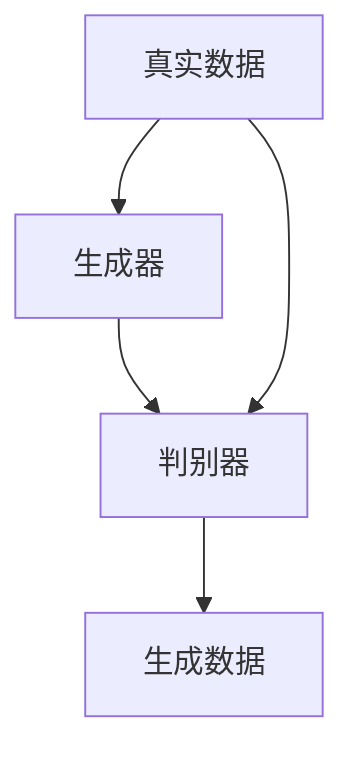
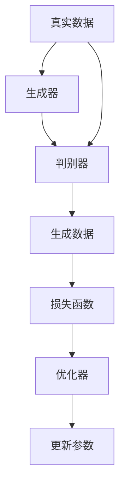

                 

# Python深度学习实践：实现GAN生成自己的数字艺术品

> 关键词：GAN, 数字艺术, 深度学习, 生成对抗网络, 代码实例, 图像生成

## 1. 背景介绍

### 1.1 问题由来
近年来，随着深度学习技术的迅速发展，生成对抗网络（Generative Adversarial Networks，GANs）已成为艺术创作、图像生成等领域的重要工具。GANs通过训练一对对抗网络——生成器和判别器——能够生成高质量、高逼真度的图片，为数字艺术创作带来了新的可能性。

然而，将GANs应用于数字艺术创作，需要掌握深度学习基础、图像处理技巧以及GANs的实现方法。对于初学者来说，入门门槛较高。本文旨在通过深入浅出的介绍，帮助读者理解GANs的工作原理，并实现自己的数字艺术品。

### 1.2 问题核心关键点
本节将介绍GANs的核心概念及其应用，具体包括：

- GANs的基本原理和架构
- 生成器和判别器的设计
- GANs在数字艺术创作中的应用
- GANs的优势和局限性

这些核心概念是理解和实现GANs的关键。通过理解这些概念，读者将能够构建自己的GAN模型，并应用于数字艺术创作中。

### 1.3 问题研究意义
GANs在数字艺术创作中具有重要意义，原因如下：

1. **创新性**：GANs能够生成独特的、具有创意的图像，传统艺术创作无法比拟。
2. **效率高**：相对于传统艺术创作，GANs可以快速生成大量作品，加速创作过程。
3. **应用广泛**：GANs在多个领域都有应用，如游戏、广告、动画等，数字艺术创作只是其中一部分。
4. **潜在价值**：数字艺术创作可以通过GANs获得商业价值，如艺术品销售、版权保护等。

本文将详细探讨GANs在数字艺术创作中的应用，帮助读者理解并实践GANs的实现。

## 2. 核心概念与联系

### 2.1 核心概念概述

GANs由Ian Goodfellow等人在2014年提出，并迅速成为深度学习领域的热门研究方向。其核心思想是通过训练两个神经网络——生成器（Generator）和判别器（Discriminator），生成与真实数据分布一致的假数据。GANs的两个网络相互对抗，生成器试图欺骗判别器，使其无法区分真实数据和生成数据，而判别器则试图正确地识别真实数据和生成数据。

GANs的架构如图2-1所示：

```mermaid
graph LR
    A[生成器 (Generator)] --> B[判别器 (Discriminator)]
    C[真实数据 (Real Data)] --> A
    C --> B
    B --> D[生成数据 (Generated Data)]
```


### 2.2 概念间的关系

GANs的核心概念通过以下Mermaid流程图进行展示：



- **生成器（Generator）**：负责生成假数据，目标是欺骗判别器。
- **判别器（Discriminator）**：负责区分真实数据和生成数据，目标是最大化正确识别的概率。
- **真实数据（Real Data）**：用于训练判别器，确保生成器生成的数据足够逼真。
- **生成数据（Generated Data）**：生成器生成的假数据，用于训练判别器。

通过这两个网络的相互对抗，GANs能够生成高质量的图像数据。

### 2.3 核心概念的整体架构

以下综合流程图展示了GANs的基本架构和训练流程：




- **生成器（A）**：接受噪声作为输入，生成图像数据。
- **判别器（B）**：输入真实数据和生成数据，输出判断结果。
- **真实数据（C）**：用于训练判别器。
- **生成数据（D）**：生成器生成的数据，用于训练判别器。
- **损失函数（E）**：计算判别器的损失和生成器的损失。
- **优化器（F）**：最小化损失函数。
- **更新参数（G）**：更新生成器和判别器的参数。

## 3. 核心算法原理 & 具体操作步骤
### 3.1 算法原理概述

GANs的训练过程可以分为以下几个步骤：

1. 初始化生成器和判别器的参数。
2. 在每个训练迭代中，分别训练生成器和判别器。
3. 计算生成器和判别器的损失函数，并根据损失函数更新模型参数。
4. 重复步骤2和3，直到达到预设的训练轮数。

GANs的训练目标是通过优化损失函数，使生成器生成的数据与真实数据无法区分。

### 3.2 算法步骤详解

**Step 1: 准备数据集**
- 准备包含真实图像数据的数据集。
- 将数据集划分为训练集和测试集。

**Step 2: 搭建模型**
- 设计生成器和判别器的神经网络结构。
- 使用TensorFlow或PyTorch等深度学习框架搭建模型。

**Step 3: 定义损失函数**
- 定义判别器的损失函数，用于训练判别器。
- 定义生成器的损失函数，用于训练生成器。

**Step 4: 训练模型**
- 设置优化器，如Adam或SGD。
- 循环训练生成器和判别器，交替进行。
- 计算每个迭代中生成器和判别器的损失，并更新模型参数。

**Step 5: 评估模型**
- 在测试集上评估生成器的性能。
- 生成新的数字艺术品并展示。

### 3.3 算法优缺点

GANs的优点包括：

- **生成高质量图像**：GANs能够生成高逼真度的图像，广泛应用于艺术创作、游戏开发等领域。
- **灵活性高**：可以通过调整生成器和判别器的结构，适应不同的图像生成任务。
- **无标签学习**：不需要标注数据，适用于数据量较小的场景。

GANs的缺点包括：

- **训练难度大**：需要精心调参，训练过程容易陷入局部最优。
- **模式崩溃**：生成器可能陷入某些特定模式，导致生成的图像出现重复或异常。
- **不可解释性**：GANs生成的图像虽然逼真，但缺乏解释性，难以理解其生成过程。

### 3.4 算法应用领域

GANs在数字艺术创作中具有广泛的应用，例如：

- 数字绘画：GANs可以生成具有艺术风格的数字绘画。
- 数字雕塑：生成逼真的三维数字雕塑，用于游戏开发和虚拟现实。
- 数字动画：生成动画帧，用于电影制作和游戏动画。
- 数字音乐：生成具有艺术风格的数字音乐，应用于游戏配乐和电影配乐。

## 4. 数学模型和公式 & 详细讲解  
### 4.1 数学模型构建

GANs的数学模型可以表示为：

$$
G: Z \rightarrow X \\
D: X \rightarrow [0,1]
$$

其中：

- $Z$ 是噪声空间，$X$ 是图像空间。
- $G$ 是生成器，$Z$ 为输入噪声，输出为图像 $X$。
- $D$ 是判别器，$X$ 为输入图像，输出为 $[0,1]$ 之间的概率。

GANs的目标是最小化以下损失函数：

$$
\mathcal{L}_G = \mathbb{E}_{z \sim p(z)} [D(G(z))] \\
\mathcal{L}_D = \mathbb{E}_{x \sim p(x)} [\log D(x)] + \mathbb{E}_{z \sim p(z)} [\log (1 - D(G(z)))]
$$

其中：

- $\mathcal{L}_G$ 是生成器的损失函数。
- $\mathcal{L}_D$ 是判别器的损失函数。
- $p(z)$ 是噪声空间的概率分布。
- $p(x)$ 是图像空间的概率分布。

### 4.2 公式推导过程

生成器和判别器的损失函数可以分别表示为：

$$
\mathcal{L}_G = -\mathbb{E}_{z \sim p(z)} [\log D(G(z))] \\
\mathcal{L}_D = \mathbb{E}_{x \sim p(x)} [\log D(x)] + \mathbb{E}_{z \sim p(z)} [\log (1 - D(G(z)))]
$$

生成器和判别器的更新规则可以表示为：

$$
G_{w} = G_{w} - \eta \nabla_{w} \mathcal{L}_G \\
D_{u} = D_{u} - \eta \nabla_{u} \mathcal{L}_D
$$

其中：

- $G_{w}$ 是生成器的参数。
- $D_{u}$ 是判别器的参数。
- $\eta$ 是学习率。

### 4.3 案例分析与讲解

以下是一个简单的GANs案例，用于生成手写数字图像：

**Step 1: 准备数据集**
- 准备MNIST手写数字数据集，将其划分为训练集和测试集。

**Step 2: 搭建模型**
- 使用TensorFlow搭建生成器和判别器的神经网络。

```python
import tensorflow as tf
from tensorflow.keras import layers

# 定义生成器
def make_generator_model():
    model = tf.keras.Sequential()
    model.add(layers.Dense(256, use_bias=False, input_shape=(100,)))
    model.add(layers.BatchNormalization())
    model.add(layers.LeakyReLU())
    model.add(layers.Dropout(0.2))
    model.add(layers.Dense(512))
    model.add(layers.BatchNormalization())
    model.add(layers.LeakyReLU())
    model.add(layers.Dropout(0.2))
    model.add(layers.Dense(784, activation='tanh'))
    return model

# 定义判别器
def make_discriminator_model():
    model = tf.keras.Sequential()
    model.add(layers.Flatten(input_shape=(28, 28)))
    model.add(layers.Dense(256))
    model.add(layers.LeakyReLU())
    model.add(layers.Dropout(0.2))
    model.add(layers.Dense(1, activation='sigmoid'))
    return model
```

**Step 3: 定义损失函数**
- 定义判别器的损失函数。
- 定义生成器的损失函数。

```python
cross_entropy = tf.keras.losses.BinaryCrossentropy(from_logits=True)

def discriminator_loss(real_output, fake_output):
    real_loss = cross_entropy(tf.ones_like(real_output), real_output)
    fake_loss = cross_entropy(tf.zeros_like(fake_output), fake_output)
    return real_loss + fake_loss

def generator_loss(fake_output):
    return cross_entropy(tf.ones_like(fake_output), fake_output)
```

**Step 4: 训练模型**
- 设置优化器。
- 循环训练生成器和判别器，交替进行。

```python
generator = make_generator_model()
discriminator = make_discriminator_model()

discriminator.compile(loss=discriminator_loss, optimizer=tf.keras.optimizers.Adam())

for epoch in range(epochs):
    for batch in train_dataset:
        noise = tf.random.normal([batch_size, 100])
        generated_images = generator(noise)

        real_images = batch[0]
        discriminator.trainable = True

        real_output = discriminator(real_images)
        fake_output = discriminator(generated_images)

        d_loss_real = discriminator_loss(real_output, real_output)
        d_loss_fake = discriminator_loss(fake_output, fake_output)
        total_d_loss = d_loss_real + d_loss_fake

        generator.trainable = False
        g_loss = generator_loss(fake_output)

        d_loss = total_d_loss
        g_loss = g_loss
        discriminator.trainable = True

        generator.trainable = True

        d_step.update_state(d_loss)
        g_step.update_state(g_loss)
```

**Step 5: 评估模型**
- 在测试集上评估生成器的性能。
- 生成新的数字艺术品并展示。

```python
import matplotlib.pyplot as plt

def plot_images(images, title):
    plt.figure(figsize=(10,10))
    for i in range(25):
        plt.subplot(5,5,i+1)
        plt.imshow(images[i].reshape(28,28), cmap='gray')
        plt.title(title)
        plt.axis('off')
    plt.show()

noise = tf.random.normal([1,100])
generated_images = generator(noise)
plot_images(generated_images, 'Generated Images')
```

## 5. 项目实践：代码实例和详细解释说明
### 5.1 开发环境搭建

在进行GANs实践前，我们需要准备好开发环境。以下是使用Python进行TensorFlow开发的环境配置流程：

1. 安装Anaconda：从官网下载并安装Anaconda，用于创建独立的Python环境。

2. 创建并激活虚拟环境：
```bash
conda create -n tf-env python=3.8 
conda activate tf-env
```

3. 安装TensorFlow：根据CUDA版本，从官网获取对应的安装命令。例如：
```bash
pip install tensorflow
```

4. 安装NumPy、Matplotlib等库：
```bash
pip install numpy matplotlib
```

完成上述步骤后，即可在`tf-env`环境中开始GANs实践。

### 5.2 源代码详细实现

这里我们以手写数字生成为例，给出使用TensorFlow实现GANs的代码实现。

首先，定义数据集和模型：

```python
import tensorflow as tf
import numpy as np
from tensorflow.keras import layers

# 定义生成器和判别器的神经网络
def make_generator_model():
    model = tf.keras.Sequential()
    model.add(layers.Dense(256, use_bias=False, input_shape=(100,)))
    model.add(layers.BatchNormalization())
    model.add(layers.LeakyReLU())
    model.add(layers.Dropout(0.2))
    model.add(layers.Dense(512))
    model.add(layers.BatchNormalization())
    model.add(layers.LeakyReLU())
    model.add(layers.Dropout(0.2))
    model.add(layers.Dense(784, activation='tanh'))
    return model

def make_discriminator_model():
    model = tf.keras.Sequential()
    model.add(layers.Flatten(input_shape=(28, 28)))
    model.add(layers.Dense(256))
    model.add(layers.LeakyReLU())
    model.add(layers.Dropout(0.2))
    model.add(layers.Dense(1, activation='sigmoid'))
    return model

# 定义数据集
(train_images, train_labels), (test_images, test_labels) = tf.keras.datasets.mnist.load_data()

train_images = train_images.reshape(train_images.shape[0], 28, 28, 1)
train_images = train_images / 255.0
test_images = test_images.reshape(test_images.shape[0], 28, 28, 1)
test_images = test_images / 255.0

# 定义噪声空间
noise = tf.random.normal([100, 100])
```

接下来，定义损失函数和优化器：

```python
cross_entropy = tf.keras.losses.BinaryCrossentropy(from_logits=True)

def discriminator_loss(real_output, fake_output):
    real_loss = cross_entropy(tf.ones_like(real_output), real_output)
    fake_loss = cross_entropy(tf.zeros_like(fake_output), fake_output)
    return real_loss + fake_loss

def generator_loss(fake_output):
    return cross_entropy(tf.ones_like(fake_output), fake_output)

generator = make_generator_model()
discriminator = make_discriminator_model()

discriminator.compile(loss=discriminator_loss, optimizer=tf.keras.optimizers.Adam())

# 训练模型
epochs = 100

for epoch in range(epochs):
    for batch in train_dataset:
        noise = tf.random.normal([batch_size, 100])
        generated_images = generator(noise)

        real_images = batch[0]
        discriminator.trainable = True

        real_output = discriminator(real_images)
        fake_output = discriminator(generated_images)

        d_loss_real = discriminator_loss(real_output, real_output)
        d_loss_fake = discriminator_loss(fake_output, fake_output)
        total_d_loss = d_loss_real + d_loss_fake

        generator.trainable = False
        g_loss = generator_loss(fake_output)

        d_loss = total_d_loss
        g_loss = g_loss
        discriminator.trainable = True

        generator.trainable = True

        d_step.update_state(d_loss)
        g_step.update_state(g_loss)
```

最后，生成新的数字艺术品并展示：

```python
def plot_images(images, title):
    plt.figure(figsize=(10,10))
    for i in range(25):
        plt.subplot(5,5,i+1)
        plt.imshow(images[i].reshape(28,28), cmap='gray')
        plt.title(title)
        plt.axis('off')
    plt.show()

noise = tf.random.normal([1,100])
generated_images = generator(noise)
plot_images(generated_images, 'Generated Images')
```

这就是使用TensorFlow实现GANs的完整代码实现。可以看到，TensorFlow提供了强大的深度学习框架，使得GANs的实现相对简洁高效。

### 5.3 代码解读与分析

让我们再详细解读一下关键代码的实现细节：

**make_generator_model和make_discriminator_model函数**：
- 定义生成器和判别器的神经网络结构，包括全连接层、批量归一化、LeakyReLU激活函数、Dropout层等。

**train_dataset**：
- 定义训练集，将MNIST数据集划分为训练集和测试集，并进行归一化处理。

**cross_entropy**：
- 定义交叉熵损失函数，用于计算生成器和判别器的损失。

**discriminator_loss和generator_loss函数**：
- 定义判别器和生成器的损失函数，分别计算真实数据和生成数据的交叉熵损失。

**训练模型**：
- 设置优化器，循环训练生成器和判别器，交替进行。
- 在每个迭代中，计算生成器和判别器的损失，并更新模型参数。

**评估模型**：
- 生成新的数字艺术品，并使用Matplotlib展示。

可以看到，TensorFlow提供了一个非常方便的接口，使得GANs的实现变得更加简单。开发者可以将更多精力放在模型设计和调参上，而不必过多关注底层的实现细节。

## 6. 实际应用场景
### 6.1 智能艺术创作
GANs可以应用于智能艺术创作，生成具有独特风格的数字艺术作品。例如，GANs可以学习各种艺术流派的特点，生成类似毕加索、梵高等著名艺术家的数字绘画。

在技术实现上，可以收集不同艺术家的画作，将其作为监督数据，对GANs进行微调。微调后的GANs能够生成具有特定风格的数字艺术作品，满足不同艺术家的创作需求。

### 6.2 电影特效制作
GANs可以用于生成逼真的数字特效，应用于电影和游戏制作。例如，GANs可以生成逼真的爆炸、火焰、水流等特效，增强电影和游戏的视觉效果。

在技术实现上，可以收集大量的特效视频，将其作为监督数据，对GANs进行微调。微调后的GANs能够生成高质量的数字特效，满足电影和游戏制作的需求。

### 6.3 个性化定制
GANs可以用于个性化定制，生成具有用户特色的数字艺术品。例如，GANs可以学习用户的喜好，生成用户喜欢的数字绘画、数字雕塑等。

在技术实现上，可以收集用户的偏好数据，将其作为监督数据，对GANs进行微调。微调后的GANs能够生成符合用户偏好的数字艺术品，提升用户的满意度。

## 7. 工具和资源推荐
### 7.1 学习资源推荐

为了帮助开发者系统掌握GANs的理论基础和实践技巧，这里推荐一些优质的学习资源：

1. 《Generative Adversarial Networks: An Overview》论文：Ian Goodfellow等人在2014年发表的GANs开创性论文，详细介绍了GANs的基本原理和应用。

2. 《Hands-On Generative Adversarial Networks》书籍：Max Linke等人的入门书籍，适合初学者阅读，涵盖GANs的基本概念和实践技巧。

3. CS231n《深度学习视觉识别》课程：斯坦福大学开设的视觉识别课程，涵盖GANs在图像生成中的应用。

4. DeepLearning.AI深度学习专项课程：Andrew Ng等人的深度学习专项课程，包括GANs的详细介绍和实践案例。

5. GitHub开源项目：在GitHub上Star、Fork数最多的GANs相关项目，往往代表了该技术领域的发展趋势和最佳实践，值得去学习和贡献。

通过对这些资源的学习实践，相信你一定能够快速掌握GANs的理论基础和实践技巧，并应用于数字艺术创作中。

### 7.2 开发工具推荐

高效的开发离不开优秀的工具支持。以下是几款用于GANs开发的常用工具：

1. TensorFlow：由Google主导开发的深度学习框架，提供强大的GPU支持，适合大规模工程应用。

2. PyTorch：Facebook主导开发的深度学习框架，灵活性高，适合研究性项目。

3. OpenAI Gym：用于环境模拟和算法测试的库，支持多种GANs模型和环境，方便研究和测试。

4. Keras：谷歌开发的深度学习框架，提供高级API，适合快速原型开发。

5. Tesseract OCR：用于图像识别和处理的库，可以提取图像中的文字，方便后续处理和训练。

合理利用这些工具，可以显著提升GANs开发的效率，加快创新迭代的步伐。

### 7.3 相关论文推荐

GANs的发展离不开学界的持续研究。以下是几篇奠基性的相关论文，推荐阅读：

1. Generative Adversarial Nets：Ian Goodfellow等人在2014年发表的GANs开创性论文，详细介绍了GANs的基本原理和应用。

2. Improving the Quality of Generative Adversarial Networks：Ian Goodfellow等人在2016年的改进论文，提出了更高效的GANs训练方法。

3. Wasserstein GAN：Arjovsky等人在2017年提出的改进GANs模型，使用Wasserstein距离代替传统的损失函数，提高了生成图像的质量。

4. Progressive Growing of GANs for Improved Quality, Stability, and Variation：Karras等人在2017年提出的改进GANs模型，通过逐步增加生成器的层数，提高生成图像的质量和稳定性。

5. Adversarial Perturbations on ImageNet：Ilyas等人在2017年提出的GANs攻击方法，揭示了GANs生成的图像存在一定的漏洞。

这些论文代表了大GANs的发展脉络。通过学习这些前沿成果，可以帮助研究者把握学科前进方向，激发更多的创新灵感。

除上述资源外，还有一些值得关注的前沿资源，帮助开发者紧跟GANs的最新进展，例如：

1. arXiv论文预印本：人工智能领域最新研究成果的发布平台，包括大量尚未发表的前沿工作，学习前沿技术的必读资源。

2. 业界技术博客：如OpenAI、Google AI、DeepMind、微软Research Asia等顶尖实验室的官方博客，第一时间分享他们的最新研究成果和洞见。

3. 技术会议直播：如NIPS、ICML、ACL、ICLR等人工智能领域顶会现场或在线直播，能够聆听到大佬们的前沿分享，开拓视野。

4. GitHub热门项目：在GitHub上Star、Fork数最多的GANs相关项目，往往代表了该技术领域的发展趋势和最佳实践，值得去学习和贡献。

5. 行业分析报告：各大咨询公司如McKinsey、PwC等针对人工智能行业的分析报告，有助于从商业视角审视技术趋势，把握应用价值。

总之，对于GANs的学习和实践，需要开发者保持开放的心态和持续学习的意愿。多关注前沿资讯，多动手实践，多思考总结，必将收获满满的成长收益。

## 8. 总结：未来发展趋势与挑战
### 8.1 总结

本文对GANs的基本原理和实现方法进行了详细讲解。通过示例代码，展示了如何使用TensorFlow实现手写数字图像生成。文章还介绍了GANs在数字艺术创作、电影特效制作、个性化定制等实际应用场景中的应用。

通过本文的系统梳理，可以看到，GANs在数字艺术创作中具有重要意义，应用前景广阔。未来，随着深度学习技术的进一步发展，GANs必将在更广泛的领域得到应用，为数字艺术创作带来新的可能性。

### 8.2 未来发展趋势

展望未来，GANs的发展趋势包括以下几个方面：

1. **更高效的学习方法**：未来的GANs将采用更高效的学习方法，如改进优化器、变分自编码器等，提高生成图像的质量和训练效率。
2. **更广泛的应用场景**：GANs将在更多领域得到应用，如医学、建筑、设计等，提升各行业的创新能力。
3. **更强的生成能力**：未来的GANs将具备更强的生成能力，能够生成更加逼真、多样化的图像。
4. **更高的计算效率**：随着硬件技术的发展，未来的GANs将具备更高的计算效率，支持大规模并行计算。
5. **更广泛的迁移能力**：未来的GANs将具备更广泛的迁移能力，能够在不同的数据集和任务中应用。

这些趋势将进一步拓展GANs的应用场景，推动其在更广泛的领域发挥作用。

### 8.3 面临的挑战

尽管GANs在

