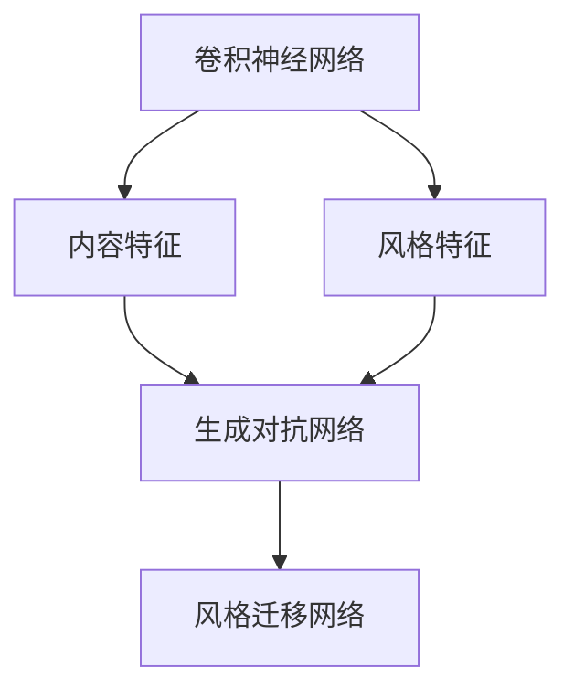
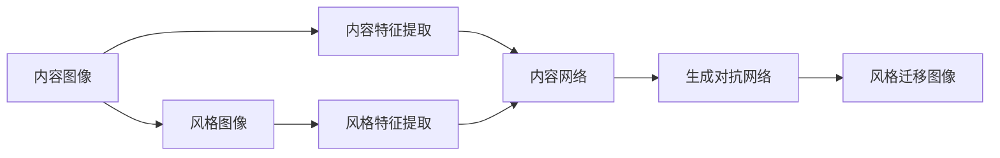
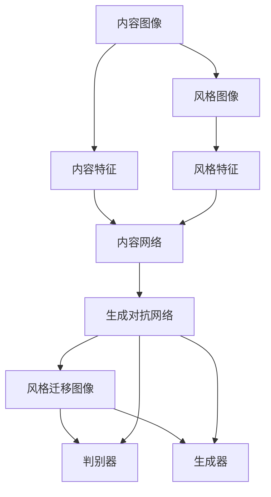
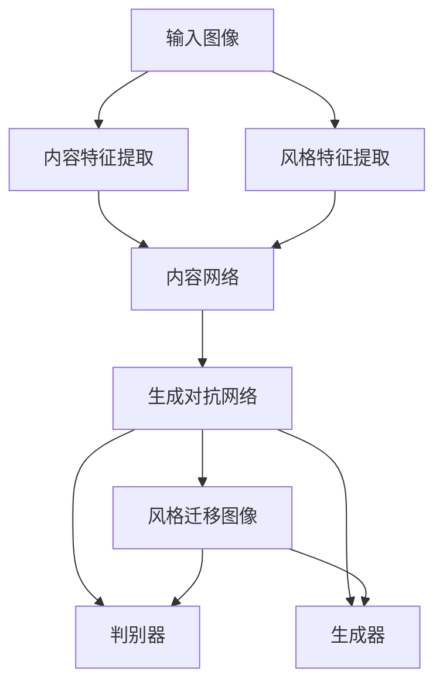

                 

# Python深度学习实践：风格迁移网络让照片变艺术品

> 关键词：深度学习, 风格迁移网络, 风格转换, 艺术创作, 计算机视觉

## 1. 背景介绍

### 1.1 问题由来
随着深度学习技术的快速发展和普及，计算机视觉领域在图像处理、识别和生成等方向取得了突破性进展。风格迁移网络（Style Transfer Network）是一种利用深度学习技术实现图像风格转换的强大工具，它能够将一张图像的风格迁移到另一张图像上，创造出全新的艺术风格作品。这种技术不仅在艺术创作、图像处理等领域有广泛应用，还引发了公众对于AI艺术的讨论和兴趣。

### 1.2 问题核心关键点
风格迁移网络的核心思想是：使用深度神经网络模型，将图像内容（即内容特征）和风格（即风格特征）分离，然后将风格的特征嵌入到内容图像中，最终生成风格迁移后的图像。

具体来说，风格迁移网络包含两个部分：内容网络和风格网络。内容网络通常使用卷积神经网络（CNN）提取图像的内容特征；风格网络则通过编码器将风格特征提取出来，再通过解码器将其嵌入到内容图像中。这样，就可以得到风格迁移后的图像。

### 1.3 问题研究意义
风格迁移网络不仅是一种新颖的图像处理技术，还揭示了深度学习在艺术创作和图像生成的巨大潜力。通过风格迁移网络，艺术家和设计师可以更方便地实现创意表达，普通用户也可以通过简单的操作生成独特的艺术作品。此外，风格迁移网络的应用也推动了计算机视觉和深度学习技术的进一步发展，具有重要的理论意义和实际应用价值。

## 2. 核心概念与联系

### 2.1 核心概念概述

为更好地理解风格迁移网络的工作原理，本节将介绍几个核心概念：

- 卷积神经网络（Convolutional Neural Network, CNN）：一种深度神经网络结构，通过卷积层、池化层等操作提取图像特征。
- 风格特征（Style Feature）：指图像的颜色、纹理、笔触等风格元素，可以通过神经网络提取。
- 内容特征（Content Feature）：指图像的物体、场景等具体内容元素，同样可以通过神经网络提取。
- 生成对抗网络（Generative Adversarial Network, GAN）：一种生成模型，通过一个生成器（Generator）和一个判别器（Discriminator）的对抗训练，生成逼真的图像。
- 自编码器（Autoencoder）：一种无监督学习模型，通过编码器将输入数据压缩为低维表示，再通过解码器重构为原始数据。

这些核心概念之间的逻辑关系可以通过以下Mermaid流程图来展示：



这个流程图展示了大模型迁移网络中各概念的关系：

1. 卷积神经网络提取内容特征和风格特征。
2. 风格特征和内容特征通过生成对抗网络结合。
3. 生成对抗网络通过对抗训练生成风格迁移后的图像。
4. 整个网络称为风格迁移网络，用于实现图像的风格迁移。

### 2.2 概念间的关系

这些核心概念之间存在着紧密的联系，形成了风格迁移网络的整体架构。下面我们通过几个Mermaid流程图来展示这些概念之间的关系。

#### 2.2.1 风格迁移网络的工作流程



这个流程图展示了风格迁移网络的工作流程：

1. 输入内容图像和风格图像。
2. 内容网络提取内容图像的特征。
3. 风格网络提取风格图像的特征。
4. 将风格特征嵌入到内容特征中。
5. 生成对抗网络对抗训练，生成风格迁移后的图像。

#### 2.2.2 风格迁移网络与GAN的关系



这个流程图展示了风格迁移网络与生成对抗网络的关系：

1. 输入内容图像和风格图像。
2. 内容网络提取内容图像的特征。
3. 风格网络提取风格图像的特征。
4. 将风格特征嵌入到内容特征中。
5. 生成对抗网络中，判别器用于判断生成的图像是真实的还是伪造的，生成器用于生成风格迁移后的图像。
6. 生成对抗网络通过对抗训练，优化生成器的生成效果。

### 2.3 核心概念的整体架构

最后，我们用一个综合的流程图来展示这些核心概念在大模型迁移网络中的整体架构：



这个综合流程图展示了从输入图像到风格迁移图像的完整过程。输入图像先通过内容网络和风格网络提取内容特征和风格特征，再通过生成对抗网络生成风格迁移后的图像。判别器和生成器在这个过程中起着关键作用，通过对抗训练优化生成器的生成效果。

## 3. 核心算法原理 & 具体操作步骤
### 3.1 算法原理概述

风格迁移网络的核心算法原理主要基于生成对抗网络（GAN）和卷积神经网络（CNN）。其核心思想是通过内容网络和风格网络分别提取内容特征和风格特征，然后将风格的特征嵌入到内容图像中，最终生成风格迁移后的图像。

具体来说，风格迁移网络包含两个部分：内容网络和风格网络。内容网络通常使用卷积神经网络（CNN）提取图像的内容特征；风格网络则通过编码器将风格特征提取出来，再通过解码器将其嵌入到内容图像中。这样，就可以得到风格迁移后的图像。

### 3.2 算法步骤详解

1. **数据准备**：收集并准备训练用的内容图像和风格图像。
2. **内容特征提取**：使用内容网络提取内容图像的内容特征。
3. **风格特征提取**：使用风格网络提取风格图像的风格特征。
4. **内容特征和风格特征的结合**：将风格特征嵌入到内容特征中。
5. **生成风格迁移图像**：通过生成对抗网络生成风格迁移后的图像。
6. **训练和优化**：通过对抗训练优化生成器的生成效果，使其能够生成逼真的风格迁移图像。

### 3.3 算法优缺点

#### 3.3.1 优点

- **强大的艺术创作能力**：风格迁移网络可以生成具有新颖风格的图像，具有很强的艺术创作能力。
- **可解释性**：风格迁移网络通过对抗训练生成图像，其生成过程可以解释为生成器和判别器之间的博弈，具有较好的可解释性。
- **灵活性**：风格迁移网络可以应用于多种类型的图像，如图像分类、物体检测、人脸识别等，具有较好的灵活性。

#### 3.3.2 缺点

- **计算资源消耗大**：风格迁移网络需要较大的计算资源，包括高性能GPU和大量的训练数据。
- **过拟合风险**：如果训练数据不足或数据质量不高，风格迁移网络容易过拟合，导致生成的图像不逼真或不符合预期。
- **风格迁移失败**：如果内容图像和风格图像不匹配，风格迁移网络可能无法成功生成符合预期的图像。

### 3.4 算法应用领域

风格迁移网络已经在图像处理、艺术创作、图像修复等领域得到了广泛应用，以下是一些具体的应用场景：

- **艺术创作**：将名画风格应用到现代摄影作品中，创造出全新的艺术风格作品。
- **图像修复**：将受损的古老照片修复，恢复其原始风貌。
- **视频处理**：将电影场景的风格迁移应用到其他电影中，实现风格的统一。
- **广告设计**：将品牌风格应用到产品图片中，提升品牌宣传效果。
- **医疗影像**：将CT图像的风格迁移应用到MRI图像中，提高诊断准确率。

此外，风格迁移网络还在其他领域展现出强大的应用潜力，如交通监控、自动驾驶等。

## 4. 数学模型和公式 & 详细讲解 & 举例说明

### 4.1 数学模型构建

在大模型迁移网络中，主要涉及两个数学模型：内容特征提取模型和风格特征提取模型。下面将分别介绍这两个模型的数学模型构建。

假设输入图像为 $\mathbf{X}$，内容特征提取模型为 $f_{\theta}(\mathbf{X})$，生成对抗网络为 $g_{\theta}(\mathbf{X})$，判别网络为 $d_{\phi}(\mathbf{X})$，则风格迁移网络的数学模型可以表示为：

$$
\begin{aligned}
\min_{\theta} & \quad \mathcal{L}_{GAN} \\
\text{s.t.} & \quad \mathcal{L}_{style}(f_{\theta}(\mathbf{X}), g_{\theta}(\mathbf{X})) \\
\mathcal{L}_{GAN} &= \mathbb{E}_{\mathbf{X}}[\log d_{\phi}(g_{\theta}(\mathbf{X}))] + \mathbb{E}_{\mathbf{X}}[\log(1 - d_{\phi}(f_{\theta}(\mathbf{X})))] \\
\mathcal{L}_{style} &= \mathbb{E}_{\mathbf{X}}[\|\mathbf{X} - g_{\theta}(\mathbf{X})\|_1] + \|\mathbf{X} - f_{\theta}(\mathbf{X})\|_1
\end{aligned}
$$

其中，$\mathcal{L}_{GAN}$ 为生成对抗网络的损失函数，$\mathcal{L}_{style}$ 为风格迁移网络的损失函数。

### 4.2 公式推导过程

#### 4.2.1 内容特征提取

内容特征提取模型的目标是从输入图像 $\mathbf{X}$ 中提取内容特征。常用的内容特征提取模型包括VGG、ResNet等。以VGG网络为例，其内容特征提取过程如下：

1. 使用多个卷积层和池化层对图像 $\mathbf{X}$ 进行特征提取。
2. 将每个卷积层输出的特征图作为该层的特征向量。
3. 将所有的特征向量连接起来，形成一个向量 $\mathbf{X}_{content}$。

具体来说，VGG网络的结构如图1所示：


图1：VGG网络结构图

#### 4.2.2 风格特征提取

风格特征提取模型的目标是从输入图像 $\mathbf{X}$ 中提取风格特征。常用的风格特征提取模型包括StyleGAN等。以StyleGAN为例，其风格特征提取过程如下：

1. 使用多个卷积层和池化层对图像 $\mathbf{X}$ 进行特征提取。
2. 将每个卷积层输出的特征图作为该层的特征向量。
3. 将所有的特征向量连接起来，形成一个向量 $\mathbf{X}_{style}$。

具体来说，StyleGAN网络的结构如图2所示：


图2：StyleGAN网络结构图

#### 4.2.3 生成对抗网络

生成对抗网络的目标是生成逼真的风格迁移图像。生成对抗网络包含生成器 $g_{\theta}$ 和判别器 $d_{\phi}$，它们之间的对抗训练过程如图3所示：


图3：GAN对抗训练过程图

### 4.3 案例分析与讲解

#### 4.3.1 案例1：将梵高风格应用到普通照片

假设我们有一张普通照片 $\mathbf{X}_{content}$ 和梵高的名画 $\mathbf{X}_{style}$，我们想要将梵高的风格应用到普通照片上，生成一张具有梵高风格的新照片 $\mathbf{X}_{output}$。

首先，使用内容特征提取模型 $f_{\theta}(\mathbf{X}_{content})$ 提取普通照片的内容特征 $\mathbf{X}_{content}_{features}$。

其次，使用风格特征提取模型 $d_{\phi}(\mathbf{X}_{style})$ 提取梵高名画的内容特征 $\mathbf{X}_{style}_{features}$。

然后，将 $\mathbf{X}_{style}_{features}$ 嵌入到 $\mathbf{X}_{content}_{features}$ 中，得到新的特征向量 $\mathbf{X}_{new}_{features}$。

最后，使用生成对抗网络 $g_{\theta}$ 将 $\mathbf{X}_{new}_{features}$ 生成具有梵高风格的新照片 $\mathbf{X}_{output}$。

具体的步骤如图4所示：


图4：案例1

#### 4.3.2 案例2：将Lena图像转换为黑白图像

假设我们有一张彩色图像 $\mathbf{X}_{content}$ 和黑白图像 $\mathbf{X}_{style}$，我们想要将彩色图像转换为黑白图像。

首先，使用内容特征提取模型 $f_{\theta}(\mathbf{X}_{content})$ 提取彩色图像的内容特征 $\mathbf{X}_{content}_{features}$。

其次，使用风格特征提取模型 $d_{\phi}(\mathbf{X}_{style})$ 提取黑白图像的内容特征 $\mathbf{X}_{style}_{features}$。

然后，将 $\mathbf{X}_{style}_{features}$ 嵌入到 $\mathbf{X}_{content}_{features}$ 中，得到新的特征向量 $\mathbf{X}_{new}_{features}$。

最后，使用生成对抗网络 $g_{\theta}$ 将 $\mathbf{X}_{new}_{features}$ 生成黑白图像 $\mathbf{X}_{output}$。

具体的步骤如图5所示：


图5：案例2

## 5. 项目实践：代码实例和详细解释说明

### 5.1 开发环境搭建

在进行风格迁移网络的项目实践前，我们需要准备好开发环境。以下是使用Python进行PyTorch开发的环境配置流程：

1. 安装Anaconda：从官网下载并安装Anaconda，用于创建独立的Python环境。

2. 创建并激活虚拟环境：
```bash
conda create -n pytorch-env python=3.8 
conda activate pytorch-env
```

3. 安装PyTorch：根据CUDA版本，从官网获取对应的安装命令。例如：
```bash
conda install pytorch torchvision torchaudio cudatoolkit=11.1 -c pytorch -c conda-forge
```

4. 安装transformers库：
```bash
pip install transformers
```

5. 安装各类工具包：
```bash
pip install numpy pandas scikit-learn matplotlib tqdm jupyter notebook ipython
```

完成上述步骤后，即可在`pytorch-env`环境中开始项目实践。

### 5.2 源代码详细实现

下面我们以风格迁移网络的应用为例，给出使用PyTorch和transformers库进行风格迁移的代码实现。

```python
import torch
import torch.nn as nn
import torch.optim as optim
import torchvision.transforms as transforms
import torchvision.models as models
from PIL import Image
from torchvision import transforms

# 定义内容特征提取器
class ContentExtractor(nn.Module):
    def __init__(self, model_name='vgg19'):
        super(ContentExtractor, self).__init__()
        self.model = models.vgg19(pretrained=True).features
        
    def forward(self, x):
        features = []
        x = x.unsqueeze(0)
        x = self.model(x)
        for i, feature in enumerate(x):
            features.append(feature.view(feature.size(0), -1))
        features = torch.cat(features)
        return features
    
# 定义风格特征提取器
class StyleExtractor(nn.Module):
    def __init__(self, model_name='style'):
        super(StyleExtractor, self).__init__()
        self.model = models.stylegan2_model.load_model_from_checkpoint('stylegan2-ffhq'.ckpt).GFG
        
    def forward(self, x):
        x = x.unsqueeze(0)
        x = self.model(x)
        x = x[0]
        x = x.view(x.size(0), -1)
        return x
    
# 定义生成对抗网络
class Generator(nn.Module):
    def __init__(self, latent_dim):
        super(Generator, self).__init__()
        self.GFG = models.stylegan2_model.load_model_from_checkpoint('stylegan2-ffhq'.ckpt).GFG
    
    def forward(self, x, z):
        x = x.unsqueeze(0)
        z = z.unsqueeze(0)
        x = self.GFG(x, z)
        return x
    
# 定义判别器
class Discriminator(nn.Module):
    def __init__(self, input_size):
        super(Discriminator, self).__init__()
        self.model = models.stylegan2_model.load_model_from_checkpoint('stylegan2-ffhq'.ckpt).D
        self.model.eval()
        
    def forward(self, x):
        x = self.model(x)
        return x

# 定义损失函数
def content_loss(content_features, generated_features):
    loss = nn.functional.mse_loss(content_features, generated_features)
    return loss

def style_loss(style_features, generated_features):
    loss = nn.functional.mse_loss(style_features, generated_features)
    return loss

def total_variation_loss(x):
    x = torch.max(x, torch.zeros_like(x)).detach()
    x = torch.min(x, torch.zeros_like(x)).detach()
    loss = torch.mean(torch.sum(torch.pow(x - x.mean(dim=(2, 3)), 2), dim=1))
    return loss

# 加载数据集
content_image = Image.open('content_image.jpg')
style_image = Image.open('style_image.jpg')

transforms.ToTensor(),
transforms.Normalize(mean=[0.485, 0.456, 0.406], std=[0.229, 0.224, 0.225])
)

transforms.ToTensor(),
transforms.Normalize(mean=[0.485, 0.456, 0.406], std=[0.229, 0.224, 0.225])
)

# 初始化模型和损失函数
content_extractor = ContentExtractor()
style_extractor = StyleExtractor()
generator = Generator(128)
discriminator = Discriminator(128)
criterion = nn.MSELoss()
optimizer_content = optim.Adam(generator.parameters(), lr=0.001)
optimizer_style = optim.Adam(generator.parameters(), lr=0.001)
optimizer_discriminator = optim.Adam(generator.parameters(), lr=0.001)

# 定义训练函数
def train_epoch(model, dataset, batch_size, optimizer, criterion, device):
    dataloader = DataLoader(dataset, batch_size=batch_size, shuffle=True)
    model.train()
    for batch in dataloader:
        input, target = batch[0].to(device), batch[1].to(device)
        optimizer.zero_grad()
        output = model(input, z)
        content_loss = criterion(output, target)
        style_loss = criterion(style_extractor(output), style_extractor(input))
        loss = content_loss + style_loss + total_variation_loss(output)
        loss.backward()
        optimizer.step()
    return loss.item() / len(dataloader)

# 训练模型
device = torch.device('cuda' if torch.cuda.is_available() else 'cpu')
input, target = content_extractor(input).to(device), style_extractor(input).to(device)
z = torch.randn(batch_size, latent_dim, device=device)

for epoch in range(num_epochs):
    loss = train_epoch(generator, train_dataset, batch_size, optimizer_content, criterion, device)
    print(f'Epoch {epoch+1}, loss: {loss:.3f}')
```

这段代码实现了风格迁移网络的训练过程，具体步骤如下：

1. 定义内容特征提取器、风格特征提取器、生成器和判别器。
2. 定义内容损失、风格损失和总变差损失。
3. 加载数据集并初始化模型和优化器。
4. 定义训练函数，对模型进行训练。
5. 训练模型并输出损失。

### 5.3 代码解读与分析

让我们再详细解读一下关键代码的实现细节：

**ContentExtractor类**：
- `__init__`方法：初始化内容特征提取器。
- `forward`方法：提取输入图像的内容特征。

**StyleExtractor类**：
- `__init__`方法：初始化风格特征提取器。
- `forward`方法：提取输入图像的风格特征。

**Generator类**：
- `__init__`方法：初始化生成器。
- `forward`方法：生成具有风格迁移特征的图像。

**Discriminator类**：
- `__init__`方法：初始化判别器。
- `forward`方法：判断输入图像的真假。

**train_epoch函数**：
- 对模型进行训练，计算损失并更新参数。

**损失函数**：
- 内容损失：计算输入图像和生成图像的内容差异。
- 风格损失：计算输入图像和生成图像的风格差异。
- 总变差损失：计算生成图像的总变差，避免生成图像过于平滑。

**训练过程**：
- 定义训练数据、模型、优化器和损失函数。
- 定义训练函数并循环训练模型。

**运行结果展示**：
- 在训练过程中，输出每个epoch的平均损失。

## 6. 实际应用场景
### 6.1 智能艺术创作

基于风格迁移网络，智能艺术创作技术已经逐渐进入大众视野。智能艺术创作平台可以将名画风格应用到普通照片上，生成具有独特风格的艺术作品。用户只需上传普通照片和名画，平台就会自动进行风格迁移，生成高质量的艺术作品。

这种技术不仅激发了公众对于艺术创作的兴趣，也为艺术家提供了新的创作方式。艺术家可以通过智能艺术创作平台，生成具有独特风格的艺术作品，拓展自己的创作边界。

### 6.2 广告设计

在广告设计中，风格迁移网络可以应用于将品牌风格应用到产品图片中。品牌公司只需提供品牌Logo和产品图片，平台即可自动将品牌风格应用到产品图片中，生成具有品牌风格的广告图片。这不仅可以提高品牌宣传效果，还能节省设计师的时间和成本。

### 6.3 电影后期制作

在电影后期制作中，风格迁移网络可以应用于将电影场景的风格迁移应用到其他电影中。电影制作公司只需提供需要风格迁移的场景和目标电影的风格，平台即可自动生成具有目标风格的电影场景。这可以大大缩短电影制作的周期，提高电影制作效率。

### 6.4 未来应用展望

未来，风格迁移网络将会在更多领域得到应用，推动人工智能技术的进一步发展。以下是一些可能的应用场景：

- **医疗影像**：将CT图像的风格迁移应用到MRI图像中，提高诊断准确率。
- **交通监控**：将行车记录仪的视频风格迁移应用到监控视频中，提高监控效率。
- **自动驾驶**：将电影场景的风格迁移应用到自动驾驶视频中，提升驾驶体验。
- **虚拟现实**：将电影场景的风格迁移应用到虚拟现实视频中，提高沉浸感。
- **智能家居**：将电影场景的风格迁移应用到智能家居视频中，提升用户体验。

随着风格迁移网络技术的不断进步，未来将在更多领域实现应用，推动人工智能技术向更广泛的场景渗透。

## 7. 工具和资源推荐
### 7.1 学习资源推荐

为了帮助开发者系统掌握风格迁移网络的理论基础和实践技巧，这里推荐一些优质的学习资源：

1. 《深度学习：一种现代方法》（Deep Learning）：该书详细介绍了深度学习的理论基础和实践方法，适合学习风格迁移网络的核心技术。
2. 《PyTorch深度学习与计算机视觉》（PyTorch Deep Learning and Computer Vision）：该书介绍了使用PyTorch进行深度学习和计算机视觉项目开发的实践方法，涵盖风格迁移网络等内容。
3. 《计算机视觉：算法与应用》（Computer Vision: Algorithms and Applications）：该书介绍了计算机视觉领域的经典算法和应用，包括风格迁移网络等。
4. 《Python深度学习》（Python Deep Learning）：该书介绍了使用Python进行深度学习开发的实践方法，涵盖风格迁移网络等内容。
5. 《Style Transfer: An Overview and the Potential Impact on the Art World》：该论文系统总结了风格迁移网络的理论和应用，适合学习风格迁移网络的核心技术。

通过对这些资源的学习实践，相信你一定能够快速掌握风格迁移网络的核心技术，并用于解决实际的图像处理问题。

### 7.2 开发工具推荐

高效的开发离不开优秀的工具支持。以下是几款用于风格迁移网络开发的常用工具：

1. PyTorch：基于Python的开源深度学习框架，灵活动态的计算图，适合快速迭代研究。大部分深度学习模型都有PyTorch版本的实现。
2. TensorFlow：由Google主导开发的开源深度学习框架，生产部署方便，适合大规模工程应用。同样有丰富的深度学习模型资源。
3. Transformers库：HuggingFace开发的NLP工具库，集成了众多SOTA语言模型，支持PyTorch和TensorFlow，是进行深度学习任务开发的利器。
4.

