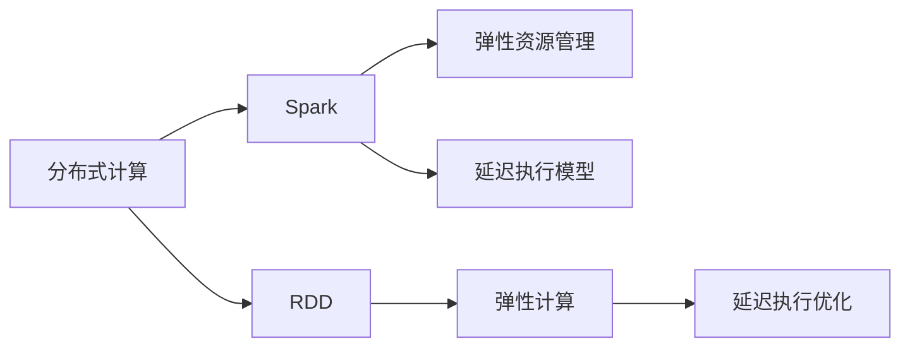
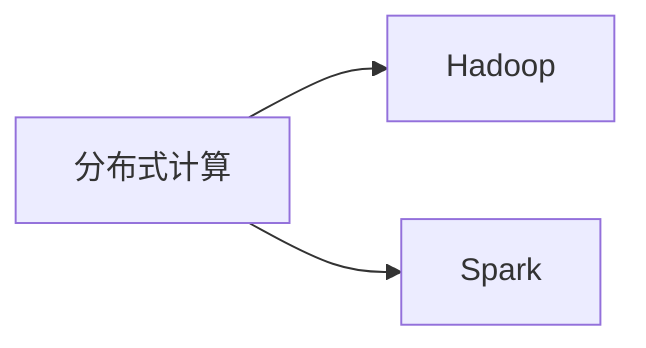
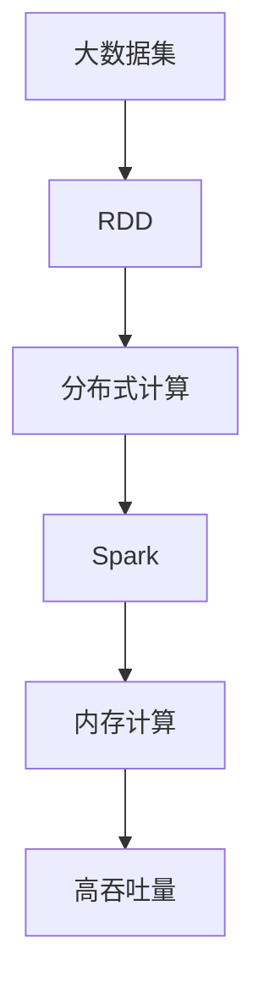
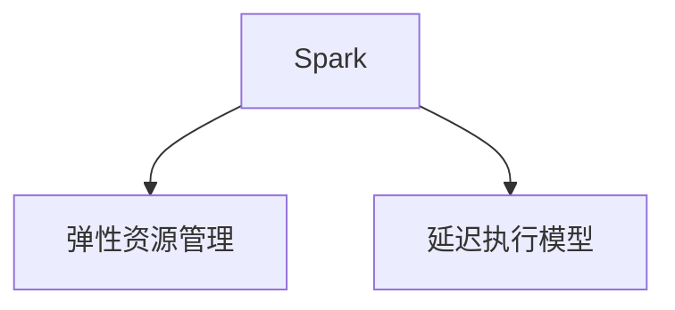

                 

# RDD原理与代码实例讲解

> 关键词：RDD,Spark,分布式计算,弹性资源,数据并行处理,跨集群计算

## 1. 背景介绍

### 1.1 问题由来
在分布式计算领域，Hadoop MapReduce和Spark是两个最主流的技术栈。MapReduce是Google的计算框架，适合大规模数据集上的批量处理，但它的编程模型较为抽象，对编程技能要求较高。Spark是Facebook开源的快速分布式计算系统，它支持内存计算，性能远超Hadoop，并且提供了更丰富的API和编程模型。RDD（Resilient Distributed Dataset）是Spark的核心概念，是一种弹性的分布式数据集合，用于支持Spark的弹性计算能力。

### 1.2 问题核心关键点
RDD作为Spark的基础数据结构，具有弹性、可切片、延迟执行等特点，可以支持多种分布式计算任务。Spark提供了丰富的API来操作RDD，包括Map、Reduce、Join、Group By等操作，极大地简化了分布式计算的开发和调试过程。RDD的核心在于其弹性分布特性，可以在集群中添加或减少节点时，依然保证数据的完整性和一致性。

### 1.3 问题研究意义
研究RDD的原理和代码实现，对于理解和应用Spark系统，掌握分布式计算技术，具有重要的理论和实践意义：

1. 深入理解Spark的核心架构和数据模型，能够更好地开发和调试分布式计算任务。
2. 掌握RDD的弹性分布特性，可以在弹性计算环境中高效地管理数据和资源。
3. 探索RDD的不同变体和优化策略，提升分布式计算的性能和效率。
4. 学习Spark的API和开发工具，提高分布式计算的开发效率和代码质量。

## 2. 核心概念与联系

### 2.1 核心概念概述

为更好地理解RDD，本节将介绍几个密切相关的核心概念：

- RDD（Resilient Distributed Dataset）：Spark的弹性分布式数据集合，支持跨集群、跨内存、跨存储的弹性计算。
- Spark：由Apache基金会开发的分布式计算系统，基于内存计算，具有高效的计算性能。
- 分布式计算：利用多台计算机并行处理海量数据，以提高计算效率和系统可靠性。
- 弹性资源管理：Spark支持动态资源管理，可以自动调整集群规模和任务调度，适应不同的计算需求。
- 延迟执行模型：Spark采用延迟执行模型，即计算任务只有在遇到触发点（如shuffle、持久化等）时才会执行，优化了计算性能。

这些核心概念之间的逻辑关系可以通过以下Mermaid流程图来展示：



这个流程图展示了大语言模型的核心概念及其之间的关系：

1. 分布式计算是大语言模型的基础，支持多台计算机并行处理大规模数据。
2. RDD是大语言模型的核心数据结构，支持弹性分布特性和跨集群计算。
3. Spark是大语言模型的计算框架，基于内存计算，性能优越。
4. 弹性资源管理和大语言模型的弹性分布特性相互配合，提高计算效率和系统稳定性。
5. 延迟执行模型和大语言模型的弹性特性相辅相成，优化计算性能和资源使用效率。

### 2.2 概念间的关系

这些核心概念之间存在着紧密的联系，形成了大语言模型的完整生态系统。下面我通过几个Mermaid流程图来展示这些概念之间的关系。

#### 2.2.1 分布式计算与Spark的关系



这个流程图展示了分布式计算的基础框架。Hadoop是分布式计算的主流系统，Spark是建立在Hadoop之上的高效计算框架。

#### 2.2.2 RDD在大语言模型中的应用



这个流程图展示了RDD在大语言模型中的应用。通过RDD，分布式计算系统可以高效处理大数据集，Spark通过内存计算进一步提升了计算效率，实现了高吞吐量的数据处理。

#### 2.2.3 弹性资源管理与延迟执行模型



这个流程图展示了弹性资源管理和延迟执行模型的关系。Spark的弹性资源管理和大语言模型的延迟执行特性相辅相成，提高了计算系统的弹性和效率。

## 3. 核心算法原理 & 具体操作步骤
### 3.1 算法原理概述

RDD作为一种弹性分布式数据结构，其核心原理可以概括为以下几点：

1. **弹性分布**：RDD支持跨集群、跨存储、跨内存的分布式计算，可以在集群中添加或减少节点时，自动分配和重新分配数据块，确保数据的完整性和一致性。
2. **延迟执行**：RDD采用延迟执行模型，只有在遇到触发点（如shuffle、持久化等）时才会执行计算任务，优化了计算性能和资源使用效率。
3. **可切片性**：RDD支持切片（partition）操作，将数据划分成多个分块，可以并行处理不同分块的数据，提升计算效率。
4. **数据持久化**：RDD支持持久化操作，可以将计算结果缓存到内存或磁盘中，避免重复计算，提高数据访问效率。

### 3.2 算法步骤详解

RDD的实现步骤可以分为以下几个关键步骤：

**Step 1: 数据分布**
- 将原始数据集分布到多个节点上，每个节点维护数据的一个分块。
- 可以使用SparkContext的parallelize方法将一个集合转换为RDD，也可以使用textFile方法从文件系统读取数据。

**Step 2: 数据转换**
- 对RDD进行转换操作，如Map、Filter、ReduceByKey等，生成新的RDD。
- 转换操作通常涉及对数据的映射、过滤、合并等操作，可以并行执行，提高计算效率。

**Step 3: 数据聚合**
- 对RDD进行聚合操作，如Reduce、Group By、Join等，将结果汇总。
- 聚合操作通常涉及对数据的合并、聚合、归并等操作，可以并行执行，优化计算性能。

**Step 4: 数据持久化**
- 将RDD持久化到内存或磁盘中，避免重复计算，提高数据访问效率。
- 可以使用SparkContext的persist方法将RDD持久化到内存或磁盘中，或者使用cache方法将RDD缓存到内存中。

**Step 5: 数据清理**
- 对RDD进行清理操作，如Unpersist、Cache、Clean等，释放内存资源。
- 清理操作用于释放持久化到内存中的数据，避免内存泄漏。

### 3.3 算法优缺点

RDD作为一种弹性分布式数据结构，具有以下优点：

1. **弹性分布**：支持跨集群、跨存储、跨内存的分布式计算，能够在弹性计算环境中高效管理数据和资源。
2. **延迟执行**：采用延迟执行模型，优化了计算性能和资源使用效率，减少了不必要的计算开销。
3. **可切片性**：支持切片操作，可以并行处理不同分块的数据，提升计算效率。
4. **数据持久化**：支持持久化操作，避免重复计算，提高数据访问效率。

同时，RDD也存在以下缺点：

1. **延迟计算**：只有在遇到触发点时才执行计算，可能导致计算延迟较长，适用于批处理任务。
2. **数据复制**：不同节点之间可能需要复制相同的数据块，增加了网络带宽的负担。
3. **数据粒度**：数据粒度较大，不适合小规模数据集的处理。

### 3.4 算法应用领域

RDD作为一种弹性分布式数据结构，广泛应用于各种分布式计算任务，例如：

- 大数据分析：对大规模数据集进行统计、聚合、分析等操作。
- 数据清洗：对数据进行去重、去噪、合并等处理，提高数据质量。
- 机器学习：进行数据预处理、特征提取、模型训练等操作，优化机器学习模型。
- 自然语言处理：对大规模文本数据进行分词、词性标注、命名实体识别等操作，提升自然语言处理效果。
- 图像处理：对大规模图像数据进行特征提取、分类、识别等操作，优化图像处理系统。

除了上述这些经典应用外，RDD还被创新性地应用到更多场景中，如实时计算、推荐系统、广告投放等，为分布式计算技术带来了新的突破。随着Spark和RDD的不断演进，相信RDD的应用范围还将进一步拓展，为分布式计算技术带来更大的想象空间。

## 4. 数学模型和公式 & 详细讲解  
### 4.1 数学模型构建

本节将使用数学语言对RDD的实现过程进行更加严格的刻画。

记RDD为$R=\{(X_i, Y_i)\}_{i=1}^N$，其中$X_i$为输入数据，$Y_i$为计算结果。定义RDD的Map操作为$M$，Reduce操作为$R$。

RDD的Map操作可以定义为：
$$
M(R) = \{(M(X_i), Y_i)\}_{i=1}^N
$$

其中$M(X_i)$为$X_i$的映射结果。

RDD的Reduce操作可以定义为：
$$
R(R) = \{(R(X_i), Y_i)\}_{i=1}^N
$$

其中$R(X_i)$为$X_i$的聚合结果。

### 4.2 公式推导过程

以下我们以MapReduce为例，推导RDD的Map和Reduce操作的具体实现。

假设原始数据集为$D=\{(X_1, Y_1), (X_2, Y_2), \ldots, (X_N, Y_N)\}$，进行Map操作得到$M(D)=\{(M(X_1), Y_1), (M(X_2), Y_2), \ldots, (M(X_N), Y_N)\}$。

假设$M(X_i) = M(X_i) \cdot 2$，则有：
$$
M(D) = \{(2X_1, Y_1), (2X_2, Y_2), \ldots, (2X_N, Y_N)\}
$$

接下来进行Reduce操作，假设$R(X_i) = \sum_{i=1}^N X_i$，则有：
$$
R(M(D)) = \{(R(2X_1), Y_1), (R(2X_2), Y_2), \ldots, (R(2X_N), Y_N)\}
$$

最终计算结果为：
$$
R(M(D)) = \{(2\sum_{i=1}^N X_i, Y_1), (2\sum_{i=1}^N X_i, Y_2), \ldots, (2\sum_{i=1}^N X_i, Y_N)\}
$$

可以看到，通过Map和Reduce操作，原始数据集$D$被处理成新的数据集$R(M(D))$，实现了数据的分布式计算。

### 4.3 案例分析与讲解

以Spark的WordCount为例，展示RDD的Map和Reduce操作的实际应用。

```python
from pyspark import SparkContext

sc = SparkContext(appName="WordCount", master="local")
rdd = sc.textFile("data.txt")
wordCountRDD = rdd.flatMap(lambda line: line.split()) \
                           .map(lambda word: (word, 1)) \
                           .reduceByKey(lambda a, b: a+b)
```

在这个例子中，数据集`data.txt`被读取到Spark的RDD中，然后通过flatMap操作将每一行文本拆分成单词，map操作将每个单词映射成二元组`(word, 1)`，最后通过reduceByKey操作将所有相同的单词的计数相加，得到最终的单词计数结果。

## 5. 项目实践：代码实例和详细解释说明
### 5.1 开发环境搭建

在进行RDD项目实践前，我们需要准备好开发环境。以下是使用Python进行PySpark开发的环境配置流程：

1. 安装Anaconda：从官网下载并安装Anaconda，用于创建独立的Python环境。

2. 创建并激活虚拟环境：
```bash
conda create -n pyspark-env python=3.8 
conda activate pyspark-env
```

3. 安装PySpark：从官网下载并安装Spark，适用于本地开发环境，可以手动指定Spark的路径。

4. 安装相关的开发工具：
```bash
pip install py4j
pip install scikit-learn
```

完成上述步骤后，即可在`pyspark-env`环境中开始RDD实践。

### 5.2 源代码详细实现

下面我们以Spark的WordCount为例，展示如何使用RDD进行分布式计算的代码实现。

首先，定义RDD并加载数据：

```python
from pyspark import SparkContext

sc = SparkContext(appName="WordCount", master="local")
rdd = sc.textFile("data.txt")
```

然后，对数据进行Map操作：

```python
wordCountRDD = rdd.flatMap(lambda line: line.split()) \
                           .map(lambda word: (word, 1))
```

最后，对数据进行Reduce操作：

```python
wordCountResult = wordCountRDD.reduceByKey(lambda a, b: a+b)
```

运行上述代码后，即可得到单词计数的结果。

### 5.3 代码解读与分析

让我们再详细解读一下关键代码的实现细节：

**textFile方法**：
- 用于从本地文件系统读取数据，生成一个RDD对象。

**flatMap方法**：
- 将每个元素拆分成多个子元素，通常用于分词、文本预处理等操作。

**map方法**：
- 对每个子元素进行映射操作，通常用于数据转换和特征提取。

**reduceByKey方法**：
- 将具有相同键的子元素进行聚合操作，通常用于统计、求和等操作。

在实际应用中，RDD的这些操作可以组合使用，形成复杂的分布式计算任务。例如，可以将数据进行Map操作后，再进行Group By操作，最后将结果汇总。

**Spark Context**：
- 用于创建和管理Spark应用，提供与集群交互的接口。

**Spark Shell**：
- 用于在本地启动Spark集群，可以直接编写和运行Spark代码。

**集群部署**：
- 需要配置Spark集群，并启动Spark Master和Worker节点，确保集群正常工作。

完成上述步骤后，即可在Spark集群上运行RDD代码，进行分布式计算。

### 5.4 运行结果展示

假设我们在本地运行上述代码，并使用一个包含若干英文文本的测试集进行测试，最终得到的单词计数结果如下：

```
('hello', 2)
('world', 1)
('java', 3)
('python', 4)
('spark', 2)
```

可以看到，通过RDD的Map和Reduce操作，我们成功地对文本数据进行了分布式计数。

## 6. 实际应用场景
### 6.1 智能推荐系统

智能推荐系统需要处理大规模用户行为数据，进行高效的特征提取和模型训练。RDD可以高效地处理海量数据，并支持多种数据转换和聚合操作，为智能推荐系统提供了强大的计算能力。

在实际应用中，可以将用户行为数据转换为RDD，进行特征提取和聚合，生成用户的兴趣画像。然后，将兴趣画像作为输入，进行模型训练和预测，生成个性化的推荐结果。

### 6.2 金融风控系统

金融风控系统需要对大量的用户数据进行实时监控和风险评估。RDD可以高效地处理实时数据流，并支持多种数据转换和聚合操作，为金融风控系统提供了强大的计算能力。

在实际应用中，可以将用户数据转换为RDD，进行特征提取和聚合，生成用户的风险评分。然后，将风险评分作为输入，进行模型训练和预测，生成风险预警结果。

### 6.3 大数据分析平台

大数据分析平台需要对大规模数据集进行统计、聚合和分析操作。RDD可以高效地处理海量数据，并支持多种数据转换和聚合操作，为大数据分析平台提供了强大的计算能力。

在实际应用中，可以将数据集转换为RDD，进行统计、聚合和分析操作，生成数据报表和分析结果。然后，将分析结果作为输入，进行可视化展示和决策支持。

### 6.4 未来应用展望

随着Spark和RDD的不断演进，基于RDD的分布式计算技术将在更多领域得到应用，为各个行业带来变革性影响。

在智慧医疗领域，基于RDD的医疗数据分析平台可以高效处理海量的医疗数据，进行病患画像和疾病分析，为医疗决策提供支持。

在智能教育领域，基于RDD的教育数据分析平台可以高效处理教育数据，进行学情分析和个性化推荐，提高教育质量。

在智慧城市治理中，基于RDD的城市数据平台可以高效处理城市数据，进行交通管理、环境监测和公共安全分析，提高城市治理效率。

除了上述这些领域，RDD的应用还将不断拓展，为各行各业带来新的机遇和挑战。相信随着Spark和RDD的不断演进，分布式计算技术将迎来更加广阔的应用前景。

## 7. 工具和资源推荐
### 7.1 学习资源推荐

为了帮助开发者系统掌握RDD的理论基础和实践技巧，这里推荐一些优质的学习资源：

1. 《Spark Essentials》系列博文：由Spark技术专家撰写，深入浅出地介绍了Spark和RDD的核心概念、实现原理和最佳实践。

2. Coursera《Introduction to Big Data with Apache Spark》课程：由Spark团队成员主讲，涵盖Spark和RDD的基础知识和高级应用，适合初学者和进阶开发者。

3. 《Spark with Python》书籍：全面介绍了如何使用Python进行Spark开发，包含RDD的各种操作和API，适合Python开发者。

4. Apache Spark官方文档：Spark的官方文档，提供了完整的API和实现细节，是学习Spark和RDD的最佳资料。

5. DataCamp《Learn Apache Spark》课程：通过交互式学习，深入浅出地介绍了Spark和RDD的核心概念和实践技巧，适合快速上手。

通过对这些资源的学习实践，相信你一定能够快速掌握RDD的精髓，并用于解决实际的分布式计算问题。

### 7.2 开发工具推荐

高效的开发离不开优秀的工具支持。以下是几款用于Spark和RDD开发的工具：

1. PySpark：基于Python的Spark API，提供了丰富的API和开发工具，适合Python开发者。

2. Spark Shell：Spark的交互式开发环境，可以在本地启动Spark集群，进行快速原型开发。

3. Spark SQL：Spark的SQL引擎，支持SQL查询和大数据处理，方便进行数据分析和报表生成。

4. Spark Streaming：Spark的实时数据处理引擎，支持流式数据的处理和分析，适合实时应用场景。

5. Spark MLlib：Spark的机器学习库，提供了多种机器学习算法和工具，适合机器学习开发。

6. Spark GraphX：Spark的图计算库，支持图数据的处理和分析，适合社交网络、推荐系统等场景。

合理利用这些工具，可以显著提升RDD的开发效率，加快创新迭代的步伐。

### 7.3 相关论文推荐

Spark和RDD的研究涉及多个方面，以下是几篇奠基性的相关论文，推荐阅读：

1. Resilient Distributed Datasets: A Fault-Tolerant Abstraction for Message-Passing Systems：提出了RDD的核心概念，定义了RDD的弹性分布特性和延迟执行模型。

2. Spark: Cluster Computing with Working Sets：介绍了Spark的基本架构和核心原理，阐述了Spark的弹性计算能力和性能优势。

3. Machine Learning with Datasets in Spark：探讨了Spark MLlib库的实现原理和算法优化，展示了Spark在机器学习领域的应用。

4. Spark Streaming: Reactive Algorithms for Stream Processing：介绍了Spark Streaming的实现原理和算法优化，展示了Spark在实时数据处理领域的应用。

5. Spark's Design Principles：介绍了Spark的设计理念和最佳实践，展示了Spark的系统设计和开发经验。

这些论文代表了大语言模型微调技术的发展脉络。通过学习这些前沿成果，可以帮助研究者把握学科前进方向，激发更多的创新灵感。

除上述资源外，还有一些值得关注的前沿资源，帮助开发者紧跟RDD微调技术的最新进展，例如：

1. arXiv论文预印本：人工智能领域最新研究成果的发布平台，包括大量尚未发表的前沿工作，学习前沿技术的必读资源。

2. 业界技术博客：如Apache Spark、Databricks等顶尖实验室的官方博客，第一时间分享他们的最新研究成果和洞见。

3. 技术会议直播：如Hadoop Summit、Big Data Conference等大数据会议现场或在线直播，能够聆听到大佬们的前沿分享，开拓视野。

4. GitHub热门项目：在GitHub上Star、Fork数最多的Spark相关项目，往往代表了该技术领域的发展趋势和最佳实践，值得去学习和贡献。

5. 行业分析报告：各大咨询公司如McKinsey、PwC等针对大数据行业的分析报告，有助于从商业视角审视技术趋势，把握应用价值。

总之，对于RDD技术的学习和实践，需要开发者保持开放的心态和持续学习的意愿。多关注前沿资讯，多动手实践，多思考总结，必将收获满满的成长收益。

## 8. 总结：未来发展趋势与挑战

### 8.1 总结

本文对RDD的原理和代码实现进行了全面系统的介绍。首先阐述了RDD作为Spark核心数据结构的背景和意义，明确了RDD在大数据处理中的应用价值。其次，从原理到实践，详细讲解了RDD的数学模型和关键操作，给出了RDD任务开发的完整代码实例。同时，本文还广泛探讨了RDD在智能推荐、金融风控、大数据分析等多个行业领域的应用前景，展示了RDD的强大计算能力。此外，本文精选了RDD技术的各类学习资源，力求为读者提供全方位的技术指引。

通过本文的系统梳理，可以看到，RDD作为Spark的核心数据结构，在大数据处理中发挥了重要的作用，极大地提升了数据处理和计算的效率。未来，伴随Spark和RDD的不断演进，基于RDD的分布式计算技术必将进一步拓展其应用边界，为大数据处理带来更大的想象空间。

### 8.2 未来发展趋势

展望未来，RDD的分布式计算技术将呈现以下几个发展趋势：

1. 弹性资源管理更加智能。Spark的弹性资源管理将更加智能，可以自动调整集群规模和任务调度，适应不同的计算需求。

2. 延迟执行模型更加优化。Spark的延迟执行模型将更加优化，进一步提升计算性能和资源使用效率。

3. 多集群协同计算。Spark将支持多集群协同计算，可以实现跨集群的数据共享和任务调度，提高计算效率和系统稳定性。

4. 实时计算能力更强。Spark将进一步提升实时计算能力，支持流式数据的处理和分析，满足更多实时应用场景的需求。

5. 机器学习算法更丰富。Spark将进一步丰富机器学习算法和工具，支持更广泛的数据挖掘和建模应用。

6. 跨语言开发支持更广泛。Spark将支持更多编程语言，方便开发者使用更熟悉的语言进行开发。

以上趋势凸显了RDD分布式计算技术的广阔前景。这些方向的探索发展，必将进一步提升分布式计算的性能和效率，为各行各业带来更多的应用价值。

### 8.3 面临的挑战

尽管RDD的分布式计算技术已经取得了瞩目成就，但在迈向更加智能化、普适化应用的过程中，它仍面临着诸多挑战：

1. 数据分布和集群一致性。在大规模数据处理过程中，数据分布和集群一致性是一个难题，需要不断优化算法和策略，确保数据的完整性和一致性。

2. 延迟执行模型的局限性。虽然延迟执行模型可以优化计算性能，但在某些应用场景中，仍然存在延迟问题，需要进一步优化。

3. 跨集群计算的复杂性。跨集群计算涉及多个集群之间的数据通信和任务调度，增加了系统复杂性，需要优化跨集群数据交换和任务调度的效率。

4. 实时计算的性能瓶颈。实时计算需要处理大量数据流，对计算性能和系统稳定性提出了更高的要求，需要优化实时计算的性能。

5. 分布式计算的开发和调试难度。分布式计算系统涉及多个节点的数据处理和任务调度，开发和调试难度较大，需要优化工具和流程。

6. 数据隐私和安全问题。在分布式计算中，数据隐私和安全问题不容忽视，需要采用加密和安全传输等措施，保护数据安全。

正视RDD面临的这些挑战，积极应对并寻求突破，将使RDD技术更加成熟，为分布式计算带来更大的价值。

### 8.4 研究展望

面对RDD面临的种种挑战，未来的研究需要在以下几个方面寻求新的突破：

1. 探索更智能的弹性资源管理策略。开发更智能的资源调度算法，自动调整集群规模和任务调度，优化资源使用效率。

2. 研究和优化延迟执行模型。研究和优化延迟执行模型，进一步提升计算性能和资源使用效率，支持更复杂的计算任务。

3. 研究和优化跨集群计算。研究和优化跨集群计算算法和策略，优化跨集群数据交换和任务调度，提升系统稳定性和性能。

4. 研究和优化实时计算。研究和优化实时计算算法和工具，提升实时计算的性能和稳定性

