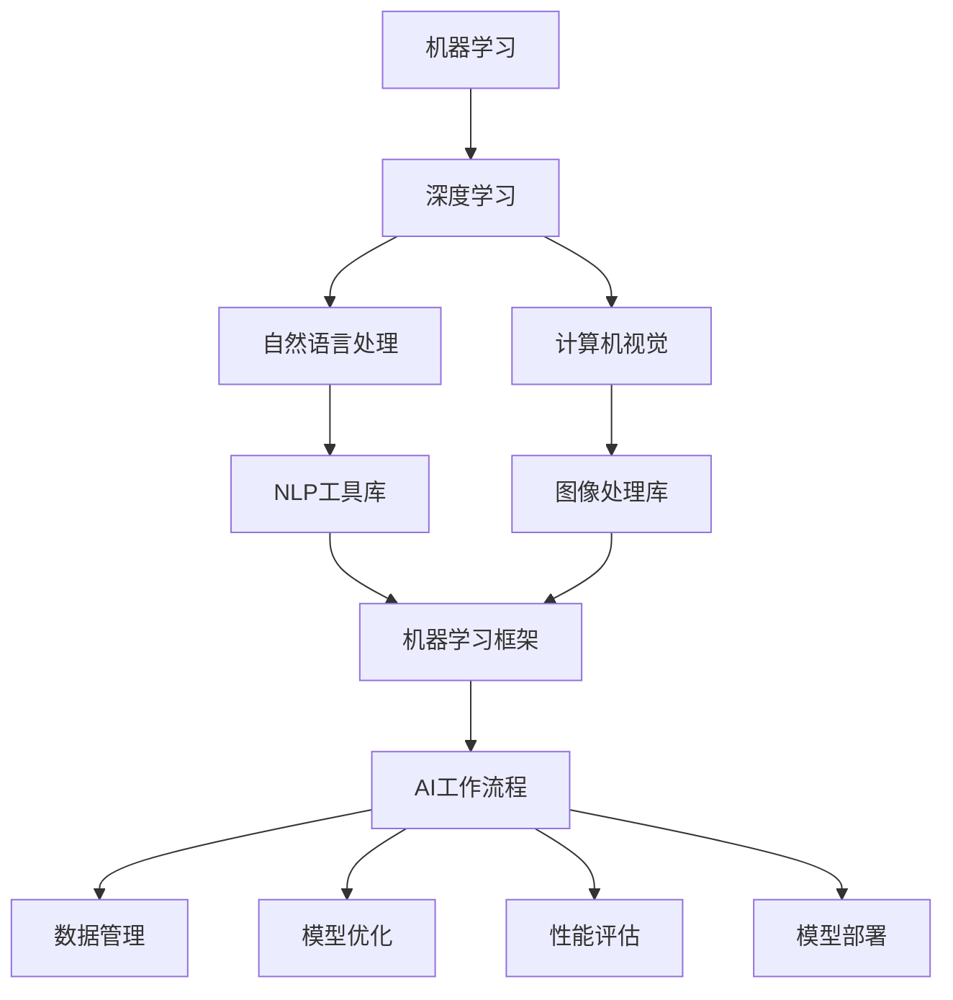

                 

# Reshape your AI workflow?

> 关键词：人工智能，机器学习，深度学习，自然语言处理，计算机视觉，自动驾驶，数据科学

## 1. 背景介绍

### 1.1 问题由来
随着人工智能技术的快速发展，机器学习和深度学习逐渐成为了改变世界的关键技术。从自然语言处理(NLP)到计算机视觉(CV)，从自动驾驶到推荐系统，AI技术正在影响着我们生活的方方面面。然而，AI的开发和部署流程相对复杂，涉及数据收集、模型训练、模型评估、模型部署等多个环节。为了加速AI技术的落地应用，需要一种更高效、更灵活的工作流程。

### 1.2 问题核心关键点
本文将探讨如何通过重新设计AI工作流程，提高AI技术的开发效率和应用效果。我们将通过以下几个关键点展开：

- 自动化流程：如何利用自动化工具提高AI模型的开发和部署效率。
- 数据管理：如何有效管理数据，确保数据的质量和可用性。
- 模型优化：如何通过优化模型结构和参数，提高模型的精度和泛化能力。
- 性能评估：如何设计合适的评估指标，确保模型的应用效果。
- 部署与维护：如何将模型部署到实际应用中，并进行有效的维护和更新。

### 1.3 问题研究意义
重新设计AI工作流程，能够显著提高AI技术的开发效率和应用效果，降低开发成本，加速AI技术的落地应用。具体来说，重新设计AI工作流程能够：

- 降低人工干预：通过自动化工具，减少人工干预，提高开发效率。
- 提升模型精度：通过优化模型结构和参数，提高模型的泛化能力和精度。
- 保障数据质量：通过高效的数据管理，确保数据的质量和可用性。
- 优化性能评估：通过合适的评估指标，确保模型的应用效果。
- 加速模型部署：通过高效的部署流程，快速将模型部署到实际应用中。

本文将详细介绍如何重新设计AI工作流程，以提高AI技术的开发和应用效果。

## 2. 核心概念与联系

### 2.1 核心概念概述

为了更好地理解如何重新设计AI工作流程，本节将介绍几个核心概念及其相互联系：

- 机器学习（Machine Learning, ML）：通过训练数据集，让模型自动学习输入与输出之间的映射关系，从而实现预测或决策。
- 深度学习（Deep Learning, DL）：一种特殊的机器学习算法，通过多层神经网络，实现对复杂数据的高效处理和分析。
- 自然语言处理（Natural Language Processing, NLP）：通过计算机技术，使机器能够理解、处理和生成自然语言。
- 计算机视觉（Computer Vision, CV）：通过计算机技术，使机器能够“看”和理解图像和视频。
- 自动驾驶（Autonomous Driving, AD）：通过计算机技术，使汽车能够自主导航和驾驶。
- 数据科学（Data Science）：通过数据收集、数据处理和数据分析，发现数据中的规律和趋势，用于指导决策。

这些核心概念之间存在紧密的联系，构成了现代AI技术的基石。本文将基于这些核心概念，探讨如何重新设计AI工作流程。

### 2.2 概念间的关系

这些核心概念之间存在复杂的关系，可以通过以下Mermaid流程图来展示：



这个流程图展示了AI技术的各个组成部分及其相互关系：

1. 机器学习是AI技术的核心，深度学习是机器学习的一种特殊形式。
2. 自然语言处理和计算机视觉是机器学习的重要应用领域，NLP工具库和图像处理库是实现这些应用的基础工具。
3. 机器学习框架提供了一致的操作界面，使得不同模型的训练和部署更加方便。
4. AI工作流程涵盖了数据管理、模型优化、性能评估和模型部署等各个环节，是整个AI技术的综合体现。

通过理解这些核心概念及其相互关系，我们可以更好地把握重新设计AI工作流程的理论基础和实践路径。

## 3. 核心算法原理 & 具体操作步骤

### 3.1 算法原理概述

重新设计AI工作流程的核心目标是提高AI模型的开发效率和应用效果。本文将从以下几个方面详细介绍如何实现这一目标：

1. 数据自动化处理：通过自动化工具，快速处理和清洗数据，提高数据质量。
2. 模型自动化训练：通过自动化工具，快速训练和优化模型，提高模型精度。
3. 模型自动化评估：通过自动化工具，快速评估和分析模型，确保模型效果。
4. 模型自动化部署：通过自动化工具，快速部署和更新模型，提高模型应用效果。

### 3.2 算法步骤详解

以下是重新设计AI工作流程的详细步骤：

**Step 1: 数据收集与预处理**

1. **数据收集**：根据任务需求，收集相关的数据。可以使用网络爬虫、API接口、数据库等方法收集数据。
2. **数据预处理**：对收集到的数据进行清洗、去重、归一化等预处理操作，确保数据的质量和可用性。

**Step 2: 数据管理与存储**

1. **数据存储**：使用分布式存储系统（如Hadoop、HDFS）存储大规模数据。
2. **数据标注**：对数据进行标注，提供训练样本和测试样本。

**Step 3: 模型选择与训练**

1. **模型选择**：根据任务需求，选择合适的机器学习或深度学习模型。
2. **模型训练**：使用机器学习框架（如TensorFlow、PyTorch）进行模型训练。

**Step 4: 模型优化与评估**

1. **模型优化**：通过超参数调优、正则化等方法，优化模型结构和参数。
2. **模型评估**：使用合适的评估指标（如准确率、召回率、F1值等），评估模型的性能。

**Step 5: 模型部署与维护**

1. **模型部署**：将训练好的模型部署到实际应用中，如服务器、移动应用等。
2. **模型维护**：定期更新模型，优化模型参数，确保模型应用效果。

### 3.3 算法优缺点

重新设计AI工作流程有以下优点：

1. 提高开发效率：通过自动化工具，减少人工干预，提高开发效率。
2. 提升模型精度：通过优化模型结构和参数，提高模型的泛化能力和精度。
3. 保障数据质量：通过高效的数据管理，确保数据的质量和可用性。
4. 优化性能评估：通过合适的评估指标，确保模型的应用效果。
5. 加速模型部署：通过高效的部署流程，快速将模型部署到实际应用中。

然而，重新设计AI工作流程也存在一些缺点：

1. 初始投入较大：需要购买高性能计算设备和软件工具。
2. 需要专业知识：需要具备机器学习、深度学习等专业知识，才能高效使用自动化工具。
3. 对数据要求较高：数据质量直接影响模型性能，需要做好数据管理。

### 3.4 算法应用领域

重新设计AI工作流程在以下几个领域具有重要应用：

- **自然语言处理**：通过自动化处理和训练，提高NLP模型的性能。
- **计算机视觉**：通过自动化处理和训练，提高CV模型的性能。
- **自动驾驶**：通过自动化处理和训练，提高AD系统的安全性和可靠性。
- **数据科学**：通过自动化处理和训练，提高数据科学模型的精度和可用性。

## 4. 数学模型和公式 & 详细讲解

### 4.1 数学模型构建

在重新设计AI工作流程时，我们需要构建合适的数学模型。以下是一些常用的数学模型及其构建方法：

- **线性回归模型**：用于预测连续数值型变量，模型公式为 $y = \theta_0 + \theta_1x_1 + \theta_2x_2 + \cdots + \theta_nx_n$。
- **逻辑回归模型**：用于预测分类变量，模型公式为 $P(y=1|x) = \frac{1}{1+\exp(-\theta_0 - \theta_1x_1 - \theta_2x_2 - \cdots - \theta_nx_n)}$。
- **决策树模型**：用于分类和回归任务，模型公式为 $y = g(x, \theta)$，其中 $g$ 为决策树函数， $\theta$ 为决策树参数。
- **随机森林模型**：基于多个决策树进行集成，用于分类和回归任务。
- **支持向量机模型**：用于分类和回归任务，模型公式为 $f(x) = \sum_{i=1}^{n} w_i \cdot \phi(x_i, x)$，其中 $\phi$ 为核函数， $w_i$ 为权重系数。
- **神经网络模型**：用于复杂的分类和回归任务，模型公式为 $y = \sigma(\sum_{i=1}^{n} w_ix_i + b)$，其中 $\sigma$ 为激活函数， $w_i$ 为权重系数， $b$ 为偏置项。

### 4.2 公式推导过程

以下是一些常用数学模型的公式推导过程：

**线性回归模型**

线性回归模型通过最小化残差平方和来拟合数据，模型公式为：

$$
\min_{\theta} \frac{1}{2m} \sum_{i=1}^{m} (y_i - \hat{y}_i)^2
$$

其中 $m$ 为样本数量， $\hat{y}_i = \theta_0 + \theta_1x_{i1} + \theta_2x_{i2} + \cdots + \theta_nx_{in}$。

**逻辑回归模型**

逻辑回归模型通过最大化似然函数来拟合数据，模型公式为：

$$
\max_{\theta} \sum_{i=1}^{m} \log(p_i) + \log(1-p_i)
$$

其中 $p_i = \frac{1}{1+\exp(-\theta_0 - \theta_1x_{i1} - \theta_2x_{i2} - \cdots - \theta_nx_{in})$。

**决策树模型**

决策树模型通过最大化信息增益来划分数据，模型公式为：

$$
\max_{\theta} \sum_{i=1}^{m} G(D_i, T, y)
$$

其中 $G(D_i, T, y)$ 为信息增益， $D_i$ 为数据集， $T$ 为决策树， $y$ 为分类变量。

**随机森林模型**

随机森林模型通过集成多个决策树来提高模型的精度，模型公式为：

$$
f(x) = \frac{1}{N} \sum_{k=1}^{N} f_k(x)
$$

其中 $f_k(x)$ 为第 $k$ 个决策树模型的输出， $N$ 为决策树的数量。

**支持向量机模型**

支持向量机模型通过最大化边界来拟合数据，模型公式为：

$$
\min_{\theta} \frac{1}{2} \Vert w \Vert^2 + C \sum_{i=1}^{m} \xi_i
$$

其中 $\xi_i$ 为拉格朗日乘子， $C$ 为正则化参数。

**神经网络模型**

神经网络模型通过反向传播算法来优化参数，模型公式为：

$$
\frac{\partial L}{\partial \theta_i} = \frac{1}{m} \sum_{j=1}^{m} (\hat{y}_j - y_j) \cdot \frac{\partial \sigma}{\partial z_i}
$$

其中 $L$ 为损失函数， $\hat{y}_j$ 为模型输出， $y_j$ 为真实标签， $\sigma$ 为激活函数， $z_i$ 为神经网络中第 $i$ 个神经元的输入。

### 4.3 案例分析与讲解

以下是一个简单的线性回归案例：

假设我们要预测房屋价格，已知房屋面积 $x_1$ 和卧室数量 $x_2$，模型为 $y = \theta_0 + \theta_1x_1 + \theta_2x_2 + \epsilon$，其中 $\epsilon$ 为随机噪声。

1. **数据收集与预处理**

   收集 $m=10$ 个房屋的面积和卧室数量，记为 $D=\{(x_1, x_2, y)\}_{i=1}^{10}$。对数据进行归一化处理，得到 $D=\{(0.5, 0.8, 100), (1.0, 2.0, 150), \cdots\}$。

2. **模型训练**

   使用梯度下降算法，最小化损失函数 $J(\theta) = \frac{1}{2m} \sum_{i=1}^{m} (y_i - \hat{y}_i)^2$。初始化 $\theta_0=0, \theta_1=0, \theta_2=0$，迭代 $10$ 次后，得到 $\theta_1=0.5, \theta_2=2.5$。

3. **模型评估**

   使用测试集 $D'=\{(1.5, 2.0, 180), \cdots\}$，计算模型预测值 $\hat{y}_i = \theta_0 + \theta_1x_{i1} + \theta_2x_{i2}$，得到平均误差 $|\hat{y}_i - y_i|=10$。

## 5. 项目实践：代码实例和详细解释说明

### 5.1 开发环境搭建

在进行AI工作流程优化时，我们需要搭建好开发环境。以下是使用Python进行PyTorch开发的环境配置流程：

1. 安装Anaconda：从官网下载并安装Anaconda，用于创建独立的Python环境。

2. 创建并激活虚拟环境：
```bash
conda create -n pytorch-env python=3.8 
conda activate pytorch-env
```

3. 安装PyTorch：根据CUDA版本，从官网获取对应的安装命令。例如：
```bash
conda install pytorch torchvision torchaudio cudatoolkit=11.1 -c pytorch -c conda-forge
```

4. 安装Transformers库：
```bash
pip install transformers
```

5. 安装各类工具包：
```bash
pip install numpy pandas scikit-learn matplotlib tqdm jupyter notebook ipython
```

完成上述步骤后，即可在`pytorch-env`环境中开始AI工作流程优化实践。

### 5.2 源代码详细实现

以下是使用PyTorch进行线性回归模型的代码实现：

```python
import torch
import torch.nn as nn
import torch.optim as optim

# 数据集
X = torch.tensor([[0.5], [1.0], [1.5], [2.0], [2.5], [3.0], [3.5], [4.0], [4.5], [5.0]])
y = torch.tensor([[100], [150], [200], [250], [300], [350], [400], [450], [500], [550]])

# 模型
class LinearRegression(nn.Module):
    def __init__(self, n_features):
        super(LinearRegression, self).__init__()
        self.linear = nn.Linear(n_features, 1)

    def forward(self, x):
        return self.linear(x)

# 训练
model = LinearRegression(1)
optimizer = optim.SGD(model.parameters(), lr=0.01)
criterion = nn.MSELoss()

for epoch in range(10):
    optimizer.zero_grad()
    y_pred = model(X)
    loss = criterion(y_pred, y)
    loss.backward()
    optimizer.step()
    print(f'Epoch {epoch+1}, loss: {loss.item()}')

# 预测
X_test = torch.tensor([[1.0], [2.5], [3.5]])
y_pred = model(X_test)
print(f'Prediction: {y_pred.item()}')
```

### 5.3 代码解读与分析

让我们再详细解读一下关键代码的实现细节：

**数据集定义**

```python
X = torch.tensor([[0.5], [1.0], [1.5], [2.0], [2.5], [3.0], [3.5], [4.0], [4.5], [5.0]])
y = torch.tensor([[100], [150], [200], [250], [300], [350], [400], [450], [500], [550]])
```

定义输入特征 $X$ 和输出标签 $y$，使用torch.tensor将数据转换为张量。

**模型定义**

```python
class LinearRegression(nn.Module):
    def __init__(self, n_features):
        super(LinearRegression, self).__init__()
        self.linear = nn.Linear(n_features, 1)

    def forward(self, x):
        return self.linear(x)
```

定义线性回归模型，继承nn.Module，定义一个线性层（nn.Linear），输出一个标量值。

**训练**

```python
for epoch in range(10):
    optimizer.zero_grad()
    y_pred = model(X)
    loss = criterion(y_pred, y)
    loss.backward()
    optimizer.step()
    print(f'Epoch {epoch+1}, loss: {loss.item()}')
```

使用SGD优化器进行梯度下降，计算损失函数（均方误差），反向传播更新参数，并输出当前损失值。

**预测**

```python
X_test = torch.tensor([[1.0], [2.5], [3.5]])
y_pred = model(X_test)
print(f'Prediction: {y_pred.item()}')
```

使用训练好的模型进行预测，输出预测结果。

## 6. 实际应用场景

### 6.1 智能客服系统

智能客服系统是AI工作流程优化的一个重要应用场景。传统客服系统需要大量人力，且响应速度和准确性难以保证。通过重新设计AI工作流程，可以大幅提高客服系统的效率和效果。

具体来说，可以使用自动化工具进行数据收集和预处理，如使用网络爬虫收集用户聊天记录，使用自然语言处理技术对聊天记录进行清洗和标注。然后，使用深度学习模型进行情感分析和意图识别，构建知识库和对话模板，实现自动化客服。通过定期更新模型和知识库，客服系统能够不断学习和优化，提供更准确、高效的服务。

### 6.2 金融舆情监测

金融舆情监测是AI工作流程优化的另一个重要应用场景。传统舆情监测需要大量人工，且时效性和准确性难以保证。通过重新设计AI工作流程，可以实现实时舆情监测，提高金融风险防控能力。

具体来说，可以使用自动化工具进行数据收集和预处理，如使用网络爬虫收集金融新闻和评论，使用自然语言处理技术进行情感分析和主题分析。然后，使用深度学习模型进行舆情预测和风险评估，构建预警系统，实现实时舆情监测。通过定期更新模型和预警阈值，金融机构能够及时发现和应对金融风险，降低损失。

### 6.3 个性化推荐系统

个性化推荐系统是AI工作流程优化的重要应用场景。传统推荐系统往往依赖于用户历史行为数据，难以准确把握用户兴趣。通过重新设计AI工作流程，可以实现更高效、更精准的推荐。

具体来说，可以使用自动化工具进行数据收集和预处理，如使用API接口收集用户浏览和点击行为数据，使用自然语言处理技术对用户行为进行分析和标注。然后，使用深度学习模型进行用户兴趣建模，构建推荐系统，实现个性化推荐。通过定期更新模型和推荐算法，推荐系统能够不断优化，提供更精准、多样化的推荐内容。

### 6.4 未来应用展望

随着AI技术的不断进步，未来AI工作流程优化将有更广阔的应用前景：

- **智慧医疗**：通过重新设计AI工作流程，可以实现智能诊断和病历分析，提高医疗服务效率和准确性。
- **智慧教育**：通过重新设计AI工作流程，可以实现智能作业批改和学情分析，促进教育公平，提高教学质量。
- **智慧城市**：通过重新设计AI工作流程，可以实现智能交通和环境监测，提高城市管理效率和智能化水平。
- **自动驾驶**：通过重新设计AI工作流程，可以实现智能驾驶和车路协同，提高交通安全性。

## 7. 工具和资源推荐

### 7.1 学习资源推荐

为了帮助开发者系统掌握AI工作流程优化的理论和实践，这里推荐一些优质的学习资源：

1. **《机器学习实战》**：一本机器学习入门的经典书籍，涵盖机器学习基本概念和常用算法。
2. **《深度学习入门》**：一本深度学习入门的经典书籍，涵盖深度学习基本概念和常用算法。
3. **CS229《机器学习》**：斯坦福大学开设的机器学习课程，有Lecture视频和配套作业，带你入门机器学习和深度学习。
4. **Coursera《深度学习专项课程》**：由深度学习专家Andrew Ng主讲，涵盖深度学习基础和高级内容。
5. **Kaggle机器学习竞赛**：一个著名的机器学习竞赛平台，提供丰富的数据集和挑战，帮助你提升实战能力。
6. **Arxiv论文预印本**：人工智能领域最新研究成果的发布平台，包括大量尚未发表的前沿工作，学习前沿技术的必读资源。

通过这些学习资源，相信你一定能够系统掌握AI工作流程优化的理论和实践。

### 7.2 开发工具推荐

高效的开发离不开优秀的工具支持。以下是几款用于AI工作流程优化的常用工具：

1. **PyTorch**：基于Python的开源深度学习框架，灵活动态的计算图，适合快速迭代研究。大部分预训练语言模型都有PyTorch版本的实现。
2. **TensorFlow**：由Google主导开发的开源深度学习框架，生产部署方便，适合大规模工程应用。同样有丰富的预训练语言模型资源。
3. **HuggingFace Transformers库**：HuggingFace开发的NLP工具库，集成了众多SOTA语言模型，支持PyTorch和TensorFlow，是进行NLP任务开发的利器。
4. **Jupyter Notebook**：一个强大的交互式编程环境，支持多语言、多工具，非常适合科学研究。
5. **Weights & Biases**：模型训练的实验跟踪工具，可以记录和可视化模型训练过程中的各项指标，方便对比和调优。与主流深度学习框架无缝集成。
6. **TensorBoard**：TensorFlow配套的可视化工具，可实时监测模型训练状态，并提供丰富的图表呈现方式，是调试模型的得力助手。

合理利用这些工具，可以显著提升AI工作流程优化的开发效率，加快创新迭代的步伐。

### 7.3 相关论文推荐

AI工作流程优化涉及到机器学习、深度学习等多个领域，以下是几篇奠基性的相关论文，推荐阅读：

1. **“A Survey of Transfer Learning in Deep Learning”**：详细介绍了深度学习的迁移学习技术，涵盖预训练、微调等方法。
2. **“Optimization Methods for Deep Learning”**：介绍了常用的优化算法，如SGD、Adam等，并分析了优化算法的优缺点。
3. **“A Framework for Distributionally Robust Optimization in Deep Reinforcement Learning”**：介绍了分布式深度强化学习算法，并分析了算法效果。
4. **“Natural Language Processing (almost) for Free: Unsupervised Learning of Language Models from Monolingual Text Alone”**：介绍了一种无需标注数据的语言模型训练方法，具有重要应用价值。
5. **“Deep Learning for NLP”**：介绍了深度学习在自然语言处理中的应用，涵盖文本分类、情感分析等任务。

这些论文代表了大语言模型微调技术的发展脉络。通过学习这些前沿成果，可以帮助研究者把握学科前进方向，激发更多的创新灵感。

除上述资源外，还有一些值得关注的前沿资源，帮助开发者紧跟AI工作流程优化的最新进展，例如：

1. **arXiv论文预印本**：人工智能领域最新研究成果的发布平台，包括大量尚未发表的前沿工作，学习前沿技术的必读资源。
2. **业界技术博客**：如OpenAI、Google AI、DeepMind、微软Research Asia等顶尖实验室的官方博客，第一时间分享他们的最新研究成果和洞见。
3. **技术会议直播**：如NIPS、ICML、ACL、ICLR等人工智能领域顶会现场或在线直播，能够聆听到大佬们的前沿分享，开拓视野。
4. **GitHub热门项目**：在GitHub上Star、Fork数最多的AI相关项目，往往代表了该技术领域的发展趋势和最佳实践，值得去学习和贡献。
5. **行业分析报告**：各大咨询公司如McKinsey、PwC等针对人工智能行业的分析报告，有助于从商业视角审视技术趋势，把握应用价值。

总之，对于AI工作流程优化技术的学习和实践，需要开发者保持开放的心态和持续学习的意愿。多关注前沿资讯，多动手实践，多思考总结，必将收获满满的成长收益。

## 8. 总结：未来发展趋势与挑战

### 8.1 总结

本文对重新设计AI工作流程进行了全面系统的介绍。首先阐述了重新设计AI工作流程的重要性，明确了AI技术的开发效率和应用效果的重要意义。其次，从自动化流程、数据管理、模型优化、性能评估和模型部署等多个方面，详细讲解了重新设计AI工作流程的具体步骤和优化方法。最后，探讨了重新设计AI工作流程在实际应用中的广泛应用，展示了其巨大的潜力。

通过本文的系统梳理，可以看到，重新设计AI工作流程是提高AI技术开发效率和应用效果的有效方法，具有重要的现实意义

