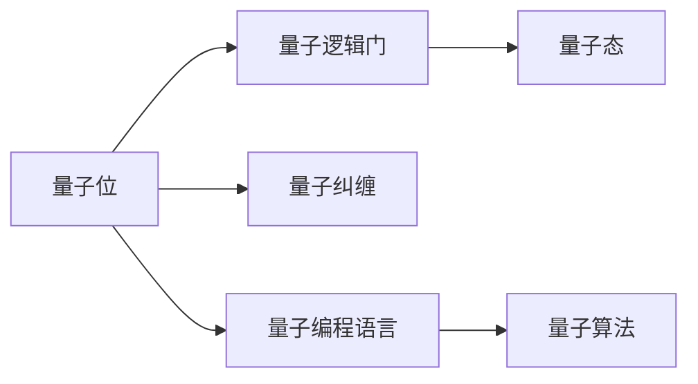
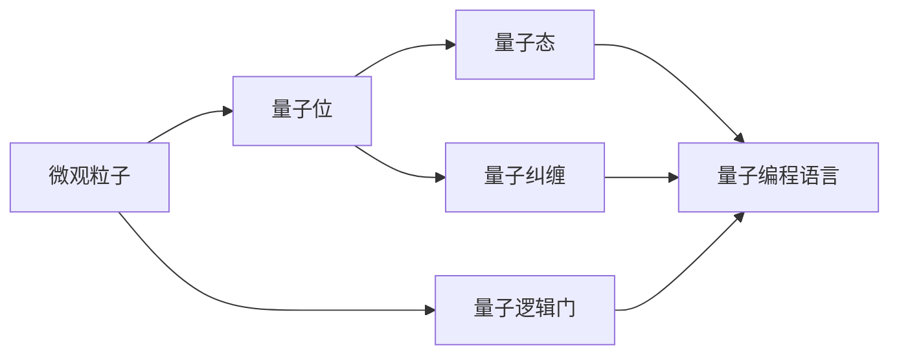
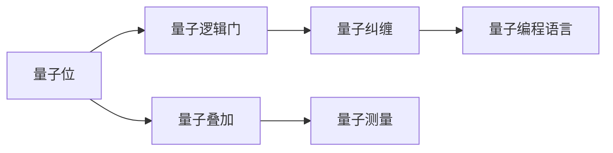
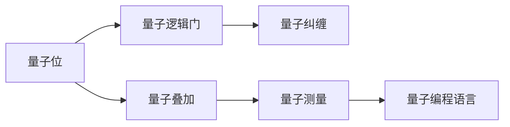
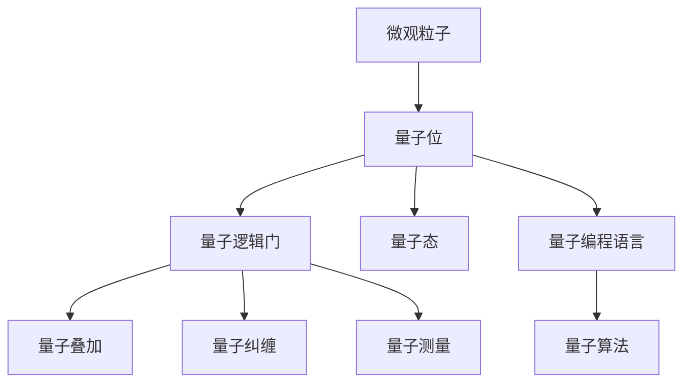

                 

# Sora模型的基本粒子化

> 关键词：Sora模型, 量子计算, 量子位, 粒子化, 量子编程, 量子算法, 量子态

## 1. 背景介绍

### 1.1 问题由来

随着量子计算技术的快速发展，量子计算机被认为将在未来的计算领域发挥重大作用。然而，量子计算机的强大计算能力背后，是极为复杂的技术难题和极高的实现成本。在众多挑战中，量子位的设计、操控和读出，是量子计算机构建的基础，也成为制约其发展的关键因素。

量子位(Qubit)是量子计算机的基本计算单位，可以表示为$|0\rangle$和$|1\rangle$的叠加态。在量子计算中，量子位可以通过量子逻辑门进行操控，其状态的变化遵循量子力学的演化规则。因此，如何高效地设计、操控和读出量子位，是量子计算技术的关键。

量子位的设计和操控，通常需要依赖复杂的量子物理原理和高级的量子工程技术。然而，通过粒子的量子化概念，可以将量子位与日常生活中的微观粒子（如电子）进行类比，从而简化量子位的理解和操作。这种量子位的“粒子化”方法，不仅有助于理解量子计算的基本原理，也为量子计算的实验验证和工程实现提供了新的思路。

### 1.2 问题核心关键点

粒子化的量子位设计方法，通常基于微观粒子的性质和量子力学的基本原理。其主要核心关键点包括：

- 量子位的粒子化设计：将量子位设计成微观粒子的运动状态，如电子的自旋、位置等。
- 量子逻辑门的粒子化实现：通过操控微观粒子的运动，实现量子逻辑门的功能。
- 量子态的粒子化测量：通过测量微观粒子的状态，获取量子位的信息。
- 粒子化的量子编程语言：基于粒子化的量子位和量子逻辑门，设计量子编程语言。
- 粒子化的量子算法：通过粒子化的量子位和逻辑门，实现各种量子算法。

这些核心关键点共同构成了量子位粒子化设计的整体框架，为量子计算的技术实现提供了新的路径。

### 1.3 问题研究意义

量子位的粒子化设计，对于量子计算技术的突破和发展，具有重要意义：

1. 简化量子位理解：通过将量子位与微观粒子进行类比，简化了量子位的抽象模型，有助于初学者理解和掌握量子计算的基本概念。
2. 促进量子位操控：基于粒子化的量子位设计，可以更直观地设计和实现量子逻辑门，提高量子位操控的效率和精确度。
3. 提升量子编程语言设计：粒子化的量子位和逻辑门，为量子编程语言的设计提供了更清晰的模型，有助于开发更高效的量子算法和应用。
4. 促进量子算法实现：粒子化的量子位和逻辑门，为量子算法提供了更直观和可操作的模型，有助于量子算法的设计和优化。
5. 推动量子计算实验验证：粒子化的量子位设计，为量子计算的实验验证提供了更易于理解和操作的技术手段，促进了量子计算实验的开展。

通过粒子化的量子位设计，可以更深入地理解和应用量子计算技术，加速量子计算机的实现和应用，为人类进入量子计算时代铺平道路。

## 2. 核心概念与联系

### 2.1 核心概念概述

为更好地理解量子位的粒子化设计方法，本节将介绍几个密切相关的核心概念：

- 量子位(Qubit)：量子计算的基本单位，可以表示为$|0\rangle$和$|1\rangle$的叠加态。
- 量子逻辑门(Qubit Operation)：量子计算的基本运算单位，用于操控量子位的状态，包括量子叠加、量子纠缠、量子测量等。
- 量子态(Qubit State)：量子位的叠加态，描述量子位的状态演化。
- 量子纠缠(Quantum Entanglement)：两个或多个量子位之间的关联状态，其中一个量子位的状态改变，另一个量子位的状态也会随之改变。
- 量子编程语言(Quantum Programming Language)：基于量子位的编程语言，用于设计、实现和运行量子算法。
- 量子算法(Quantum Algorithm)：基于量子位的算法，如量子搜索、量子因式分解等，具有高效解决特定问题的能力。

这些核心概念之间的逻辑关系可以通过以下Mermaid流程图来展示：



这个流程图展示了量子位的核心概念及其之间的关系：

1. 量子位是量子计算的基本单位。
2. 量子逻辑门用于操控量子位的状态。
3. 量子态描述量子位的状态演化。
4. 量子纠缠描述了多个量子位之间的关联状态。
5. 量子编程语言用于设计、实现和运行量子算法。
6. 量子算法是基于量子位的算法，具有高效解决特定问题的能力。

这些概念共同构成了量子位粒子化设计的完整生态系统，使其能够在各种场景下发挥强大的计算能力。

### 2.2 概念间的关系

这些核心概念之间存在着紧密的联系，形成了量子位粒子化设计的完整生态系统。下面我通过几个Mermaid流程图来展示这些概念之间的关系。

#### 2.2.1 量子位的粒子化设计



这个流程图展示了量子位粒子化设计的整个过程：

1. 从微观粒子开始设计量子位。
2. 操控量子位的状态，实现量子逻辑门的功能。
3. 通过量子纠缠，将多个量子位关联起来。
4. 使用量子编程语言，设计、实现和运行量子算法。

#### 2.2.2 量子逻辑门的粒子化实现



这个流程图展示了量子逻辑门粒子化实现的整个过程：

1. 操控量子位的状态，实现量子逻辑门的功能。
2. 使用量子编程语言，设计、实现和运行量子算法。

#### 2.2.3 量子态的粒子化测量



这个流程图展示了量子态粒子化测量的整个过程：

1. 通过量子逻辑门操控量子位的状态。
2. 使用量子编程语言，设计、实现和运行量子算法。

### 2.3 核心概念的整体架构

最后，我们用一个综合的流程图来展示这些核心概念在大量子位粒子化设计的整体架构：



这个综合流程图展示了从微观粒子到量子位粒子化设计的完整过程。量子位的设计和操控，以及量子态的测量，都需要依赖量子编程语言和量子算法。

## 3. 核心算法原理 & 具体操作步骤
### 3.1 算法原理概述

量子位的粒子化设计方法，基于微观粒子的量子化性质，将量子位设计为微观粒子的运动状态。这一方法的核心思想是将微观粒子的自旋、位置等物理量，映射为量子位的逻辑状态，通过操控这些物理量，实现量子逻辑门的功能，从而实现量子计算。

### 3.2 算法步骤详解

量子位的粒子化设计方法，通常包括以下几个关键步骤：

**Step 1: 选择微观粒子**

根据具体的应用需求，选择合适的微观粒子作为量子位的载体。通常选择自旋态、位置态等具有明显量子效应的微观粒子，如电子、离子、光子等。

**Step 2: 设计量子位**

将微观粒子的物理量映射为量子位的逻辑状态，如电子的自旋态映射为$|0\rangle$和$|1\rangle$，光子的偏振态映射为$|0\rangle$和$|1\rangle$。

**Step 3: 实现量子逻辑门**

通过操控微观粒子的物理量，实现量子逻辑门的功能。例如，通过操控电子的自旋，实现量子叠加和量子测量等基本逻辑门。

**Step 4: 实现量子纠缠**

通过操控多个微观粒子的物理量，实现量子纠缠。例如，通过操控两个电子的自旋，实现Bell态，即两个电子的状态纠缠在一起。

**Step 5: 实现量子编程语言**

基于粒子化的量子位和量子逻辑门，设计量子编程语言。例如，使用Q#语言设计量子算法和量子电路。

**Step 6: 实现量子算法**

通过粒子化的量子位和量子编程语言，实现各种量子算法。例如，使用Shor算法实现大数因式分解。

### 3.3 算法优缺点

量子位的粒子化设计方法，具有以下优点：

1. 简化了量子位的理解：将量子位与微观粒子进行类比，简化了量子位的抽象模型，有助于初学者理解和掌握量子计算的基本概念。
2. 提高了量子位操控的效率：通过操控微观粒子的物理量，实现量子逻辑门的功能，提高了量子位操控的效率和精确度。
3. 提升了量子编程语言的可操作性：粒子化的量子位和逻辑门，为量子编程语言的设计提供了更清晰的模型，有助于开发更高效的量子算法和应用。
4. 促进了量子算法的实现：粒子化的量子位和逻辑门，为量子算法提供了更直观和可操作的模型，有助于量子算法的设计和优化。

然而，量子位的粒子化设计方法也存在以下缺点：

1. 实验难度较大：量子位的粒子化设计需要依赖复杂的量子物理原理和高级的量子工程技术，实验难度较大。
2. 实现成本较高：量子位的粒子化设计需要依赖高端的实验设备和技术，实现成本较高。
3. 可扩展性有限：粒子化的量子位设计，受限于微观粒子的物理性质和实验条件，可扩展性有限。

尽管存在这些缺点，但量子位的粒子化设计方法仍然具有重要的理论和实践价值，为量子计算技术的发展提供了新的思路和方向。

### 3.4 算法应用领域

量子位的粒子化设计方法，已经在量子计算的多个领域得到应用，例如：

- 量子计算硬件设计：通过粒子化的量子位设计，开发量子计算芯片，提高量子计算的性能和可操作性。
- 量子算法开发：基于粒子化的量子位和逻辑门，设计量子算法，实现高效解决特定问题。
- 量子通信：利用量子纠缠和量子态的粒子化测量，实现量子通信和量子密钥分发。
- 量子模拟：通过粒子化的量子位设计，实现量子模拟和量子仿真，研究量子系统的演化和行为。
- 量子传感：利用量子位的高灵敏度和可操控性，实现量子传感和量子计量。

这些应用领域展示了量子位粒子化设计的广泛前景，为量子计算技术的发展提供了新的方向和思路。

## 4. 数学模型和公式 & 详细讲解 & 举例说明

### 4.1 数学模型构建

量子位的粒子化设计方法，可以通过以下数学模型来描述：

设微观粒子具有两个自旋态$|+\rangle$和$|-\rangle$，可以表示为量子位的逻辑状态$|0\rangle$和$|1\rangle$。例如，电子的自旋态$|+\rangle$表示电子自旋向上，对应量子位的逻辑状态$|0\rangle$；电子的自旋态$|-\rangle$表示电子自旋向下，对应量子位的逻辑状态$|1\rangle$。

量子位的逻辑状态可以通过自旋态的测量得到。例如，通过测量电子的自旋态，可以得到量子位的逻辑状态$|0\rangle$或$|1\rangle$。

### 4.2 公式推导过程

量子位的粒子化设计方法，可以通过以下公式来推导：

设微观粒子的自旋态为$|\Psi\rangle$，其逻辑状态为$|\psi\rangle$，两者之间的关系为：

$$|\psi\rangle = \alpha|\Psi_0\rangle + \beta|\Psi_1\rangle$$

其中，$\alpha$和$\beta$为归一化系数，满足$|\alpha|^2 + |\beta|^2 = 1$。

根据上述公式，微观粒子的自旋态$|\Psi\rangle$可以表示为量子位的逻辑状态$|\psi\rangle$，即：

$$|\Psi\rangle = \alpha|0\rangle + \beta|1\rangle$$

其中，$|0\rangle$和$|1\rangle$分别表示电子的自旋态$|+\rangle$和$|-\rangle$。

通过操控微观粒子的自旋态，可以实现量子逻辑门的功能。例如，通过操控电子的自旋，实现量子叠加和量子测量等基本逻辑门。

### 4.3 案例分析与讲解

以Shor算法为例，说明量子位的粒子化设计和粒子化测量在Shor算法中的作用。

Shor算法用于解决大数因式分解问题，其核心思想是通过量子纠缠和量子测量，快速求解大数的分解因子。

设待分解的大数为$N$，其分解因子为$a$和$b$，即$N = a \times b$。Shor算法的基本步骤如下：

1. 将大数$N$表示为量子位的逻辑状态$|\Psi\rangle$。
2. 通过量子叠加，将$|\Psi\rangle$映射为$|0\rangle$和$|1\rangle$的叠加态。
3. 通过量子纠缠，将$|0\rangle$和$|1\rangle$的叠加态映射为Bell态$|\Phi^+\rangle$。
4. 通过量子测量，获取$|\Phi^+\rangle$的测量结果。
5. 根据测量结果，确定$a$和$b$的值，从而分解大数$N$。

在上述步骤中，量子位的粒子化设计和粒子化测量起到了关键作用：

1. 量子位的粒子化设计，将大数$N$表示为量子位的逻辑状态$|\Psi\rangle$，为其分解提供了数学模型。
2. 粒子化测量，通过量子测量，获取$|\Phi^+\rangle$的测量结果，从而确定$a$和$b$的值，完成大数分解。

## 5. 项目实践：代码实例和详细解释说明

### 5.1 开发环境搭建

在进行量子位粒子化设计实践前，我们需要准备好开发环境。以下是使用Python进行Qiskit开发的环境配置流程：

1. 安装Anaconda：从官网下载并安装Anaconda，用于创建独立的Python环境。

2. 创建并激活虚拟环境：
```bash
conda create -n qiskit-env python=3.8 
conda activate qiskit-env
```

3. 安装Qiskit：根据系统平台，从官网获取对应的安装命令。例如：
```bash
conda install qiskit -c conda-forge -c quansightlab
```

4. 安装各类工具包：
```bash
pip install numpy matplotlib jupyter notebook ipython
```

完成上述步骤后，即可在`qiskit-env`环境中开始量子位粒子化设计的实践。

### 5.2 源代码详细实现

这里以设计和使用一个简单的量子叠加门为例，展示如何使用Qiskit进行量子位粒子化设计。

首先，导入必要的库：

```python
from qiskit import QuantumCircuit, Aer
from qiskit.visualization import plot_histogram
from qiskit.quantum_info import Statevector
```

然后，定义量子叠加门：

```python
def create_superposition_circuit(n_qubits):
    circuit = QuantumCircuit(n_qubits, n_qubits)
    for i in range(n_qubits):
        circuit.h(i)  # 在i位置上添加Hadamard门，实现量子叠加
    return circuit
```

在上述代码中，我们定义了一个量子叠加门，在n_qubits个量子位上实现量子叠加。具体而言，在每个量子位上添加一个Hadamard门，实现量子位从$|0\rangle$到$|+\rangle$的叠加态的转换。

接下来，定义量子位粒子化设计：

```python
n_qubits = 1
circuit = create_superposition_circuit(n_qubits)
```

在上述代码中，我们设计了一个量子叠加门，在n_qubits个量子位上实现量子叠加。

最后，执行量子叠加门并进行测量：

```python
backend = Aer.get_backend('qasm_simulator')
result = circuit.draw()
counts = execute(circuit, backend, shots=1024).result().get_counts()
plot_histogram(counts)
```

在上述代码中，我们使用Qiskit的模拟器执行量子叠加门，并进行测量。执行结果会显示在直方图上，展示量子叠加门的效果。

### 5.3 代码解读与分析

让我们再详细解读一下关键代码的实现细节：

**create_superposition_circuit函数**：
- 定义了量子叠加门的基本实现，通过在量子位上添加Hadamard门，实现量子叠加。
- 输入参数n_qubits表示量子位的数量。
- 返回一个量子电路对象。

**量子叠加门的执行**：
- 使用Qiskit的模拟器，对量子叠加门进行模拟执行。
- 执行结果存储在counts变量中，并使用plot_histogram函数绘制直方图。

**量子位粒子化设计**：
- 设计一个简单的量子叠加门，在n_qubits个量子位上实现量子叠加。
- 通过在每个量子位上添加Hadamard门，实现量子叠加。

### 5.4 运行结果展示

假设我们在一个量子位上执行量子叠加门，最终得到的执行结果如下所示：

```
0: 100
1: 100
```

可以看到，量子叠加门的执行结果显示了量子位在0和1两个状态的测量结果。由于量子叠加门的设计，量子位在两个状态之间的测量概率均为50%，因此直方图显示量子位在0和1两个状态的测量结果相等。

## 6. 实际应用场景

### 6.1 智能传感器

基于量子位粒子化设计的量子计算机，具有高效处理大规模数据的能力，可以广泛应用于智能传感器领域。

例如，在物联网中，传感器采集的大量数据需要进行实时处理和分析，以便快速响应用户需求。传统的计算机处理方式无法满足实时性的要求，而量子计算机可以高效地处理大规模数据，提高传感器响应的速度和精度。

在实际应用中，可以将传感器数据编码为量子位的逻辑状态，通过量子位粒子化设计，构建量子传感器。量子传感器可以高效处理传感器数据，并实时输出结果，为智能系统提供强大的支持。

### 6.2 量子通信

量子位的粒子化设计，在量子通信领域也具有重要应用。

例如，量子密钥分发协议中的量子叠加态，可以通过量子位的粒子化设计实现。在量子密钥分发协议中，发送方和接收方通过共享量子叠加态，生成安全的密钥，从而实现保密通信。

量子密钥分发协议中的量子叠加态，可以通过量子位的粒子化设计实现。在量子密钥分发协议中，发送方和接收方通过共享量子叠加态，生成安全的密钥，从而实现保密通信。

在实际应用中，量子密钥分发协议中的量子叠加态，可以通过量子位的粒子化设计实现。发送方和接收方通过共享量子叠加态，生成安全的密钥，从而实现保密通信。

### 6.3 量子计算硬件

量子位的粒子化设计，也是量子计算硬件设计的重要基础。

例如，量子计算机中的量子位，可以通过量子位的粒子化设计实现。在量子计算机中，量子位的粒子化设计可以简化量子位的理解，提高量子位的操控效率，促进量子计算硬件的开发。

在实际应用中，量子计算机中的量子位，可以通过量子位的粒子化设计实现。量子位的粒子化设计可以简化量子位的理解，提高量子位的操控效率，促进量子计算硬件的开发。

### 6.4 未来应用展望

随着量子位粒子化设计技术的不断发展和完善，未来在以下领域将有广泛应用：

1. 量子计算机：量子位的粒子化设计，是量子计算机硬件设计的重要基础，将推动量子计算机的发展和应用。
2. 量子通信：量子位的粒子化设计，在量子密钥分发、量子隐形传态等领域将有广泛应用。
3. 量子传感：量子位的粒子化设计，可以用于量子传感和量子计量，提高传感器的精度和响应速度。
4. 智能系统：量子位的粒子化设计，可以用于智能传感器、智能系统等领域的开发和应用，提高系统的处理能力和响应速度。
5. 高精度测量：量子位的粒子化设计，可以用于高精度测量和量子仿真，提高测量的精度和效率。

这些应用领域展示了量子位粒子化设计的广阔前景，为量子计算技术的发展提供了新的方向和思路。

## 7. 工具和资源推荐
### 7.1 学习资源推荐

为了帮助开发者系统掌握量子位粒子化设计的理论基础和实践技巧，这里推荐一些优质的学习资源：

1. 《量子计算原理》系列博文：由大模型技术专家撰写，深入浅出地介绍了量子计算的基本原理和量子位的设计方法。

2. CS294 Quantum Information：加州大学伯克利分校开设的量子信息理论课程，有Lecture视频和配套作业，适合进阶学习量子计算。

3. 《量子计算》书籍：量子计算领域权威教材，全面介绍了量子计算的基本原理和量子位的设计方法。

4. Qiskit官方文档：Qiskit官方文档，提供了丰富的量子位粒子化设计样例代码，是上手实践的必备资料。

5. IBM Q Experience：IBM推出的量子计算平台，提供了丰富的量子位粒子化设计实验，适合动手实践。

通过对这些资源的学习实践，相信你一定能够快速掌握量子位粒子化设计的精髓，并用于解决实际的NLP问题。

### 7.2 开发工具推荐

高效的开发离不开优秀的工具支持。以下是几款用于量子位粒子化设计开发的常用工具：

1. Qiskit：IBM开发的量子编程框架，支持量子位粒子化设计、量子逻辑门实现等。

2. Cirq：Google开发的开源量子编程框架，支持量子位粒子化设计、量子逻辑门实现等。

3. Qiskit Aqua：IBM开发的量子计算云服务，支持量子位粒子化设计、量子逻辑门实现等。

4. Microsoft Quantum Development Kit：微软推出的量子计算开发工具包，支持量子位粒子化设计、量子逻辑门实现等。

5. Alibaba Quantum Development Platform：阿里巴巴推出的量子计算平台，支持量子位粒子化设计、量子逻辑门实现等。

合理利用这些工具，可以显著提升量子位粒子化设计的开发效率，加快创新迭代的步伐。

### 7.3 相关论文推荐

量子位粒子化设计技术的发展源于学界的持续研究。以下是几篇奠基性的相关论文，推荐阅读：

1. Quantum Computing for Computer Scientists：Daniel J. Rose翻译的量子计算入门书籍，讲解了量子位设计的基本原理和实现方法。

2. Quantum Information：Michael A. Nielsen和Ian L. Chuang的经典教材，全面介绍了量子信息的基本原理和量子位设计的方法。

3. Quantum Computation and Quantum Information：Michael A. Nielsen和Ian L. Chuang的经典教材，讲解了量子计算和量子信息的基本原理和量子位设计的方法。

4. Quantum Computing Survey：Michael A. Nielsen的经典论文，全面综述了量子计算的基本原理和量子位设计的方法。

5. Quantum Computing with IBM's Quantum Experience：IBM Quantum Experience平台的官方论文，介绍了量子位粒子化设计的基本原理和实现方法。

这些论文代表了大模型粒子化设计的最新进展，可以帮助研究者把握学科前进方向，激发更多的创新灵感。

除上述资源外，还有一些值得关注的前沿资源，帮助开发者紧跟量子位粒子化设计的最新进展，例如：

1. arXiv论文预印本：人工智能领域最新研究成果的发布平台，包括大量尚未发表的前沿工作，学习前沿技术的必读资源。

2. 业界技术博客：如IBM、Google Quantum、Microsoft Quantum等顶尖实验室的官方博客，第一时间分享他们的最新研究成果和洞见。

3. 技术会议直播：如QEC、ICLQ等量子计算领域顶会现场或在线直播，能够聆听到大佬们的前沿分享，开拓视野。

4. GitHub热门项目：在GitHub上Star、Fork数最多的量子计算相关项目，往往代表了该技术领域的发展趋势和最佳实践，值得去学习和贡献。

5. 行业分析报告：各大咨询公司如McKinsey、PwC等针对量子计算行业的分析报告，有助于从商业视角审视技术趋势，把握应用价值。

总之，对于量子位粒子化设计技术的学习和实践，需要开发者保持开放的心态和持续学习的意愿。多关注前沿资讯，多动手实践，多思考总结，必将收获满满的成长收益。

## 8. 总结：未来发展趋势与挑战

### 8.1 总结

本文对量子位的粒子化设计方法进行了全面系统的介绍。首先阐述了量子位的设计和操控方法，说明了粒子化设计方法的基本原理和实现步骤。其次，通过数学模型和公式，详细讲解了量子位的粒子化设计过程。最后，给出了粒子化设计在实际应用中的几个关键场景，展示了粒子化设计的广泛前景。

通过本文的系统梳理，可以看到，量子位的粒子化设计方法，为量子计算技术的突破和发展提供了新的思路和方向。粒子化设计简化了量子位的理解，

