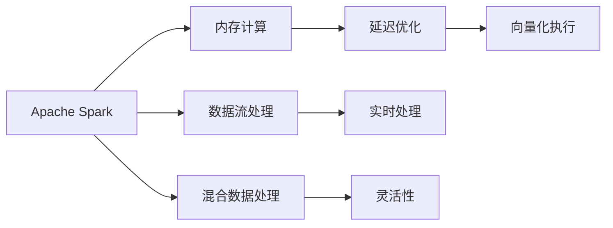

                 

# Spark SQL原理与代码实例讲解

## 1. 背景介绍

### 1.1 问题由来
Spark SQL作为Apache Spark的核心组件之一，提供了一个高效的SQL查询接口，用于在分布式环境中进行大规模数据处理。随着大数据技术的发展，Spark SQL在数据挖掘、数据分析、数据工程等多个领域得到了广泛的应用。Spark SQL的成功离不开其背后的强大原理和高效实现。本文将详细介绍Spark SQL的原理与实践，帮助读者深入理解其核心概念和技术细节。

### 1.2 问题核心关键点
Spark SQL的核心在于其高效的数据处理能力和优化的SQL查询引擎。具体来说，Spark SQL通过以下几个关键点实现了高性能和易用性：

1. **内存计算**：Spark SQL采用内存计算，能够在处理大规模数据时保持快速高效。
2. **延迟优化**：Spark SQL通过延迟优化技术，减少了数据重写和中间结果的计算，提高了查询效率。
3. **向量化执行**：Spark SQL通过向量化执行引擎，对大规模数据进行高效处理，避免了CPU和内存之间的频繁交互。
4. **数据流处理**：Spark SQL支持流式数据处理，能够实时处理数据流，满足实时性要求。
5. **混合数据处理**：Spark SQL能够同时处理结构化和半结构化数据，提升了数据处理的灵活性。

## 2. 核心概念与联系

### 2.1 核心概念概述

为了更好地理解Spark SQL，本节将介绍几个核心概念及其相互联系：

- **Apache Spark**：Apache Spark是一个开源的分布式计算框架，支持多种计算模式，包括Spark SQL、Spark Streaming、MLlib等。Spark SQL作为Spark的核心组件之一，提供了高效的SQL查询接口。

- **内存计算**：Spark SQL采用内存计算模式，通过将数据加载到内存中进行处理，实现了高效的计算性能。

- **延迟优化**：Spark SQL通过延迟优化技术，将一些复杂的查询操作延迟到结果集生成时执行，减少了中间结果的计算量。

- **向量化执行**：Spark SQL的向量化执行引擎通过批量处理数据，避免了CPU和内存之间的频繁交互，提高了计算效率。

- **数据流处理**：Spark SQL支持流式数据处理，能够实时处理数据流，满足实时性要求。

- **混合数据处理**：Spark SQL能够同时处理结构化和半结构化数据，提升了数据处理的灵活性。

这些核心概念共同构成了Spark SQL的计算框架和查询引擎，使得Spark SQL在大数据处理和分析中发挥了重要作用。

### 2.2 概念间的关系

Spark SQL的各个核心概念之间存在紧密的联系，其整体架构可以通过以下Mermaid流程图来展示：



这个流程图展示了Spark SQL的各个核心概念及其相互关系：

1. 首先，Apache Spark作为整体框架，提供了一个分布式计算环境。
2. 内存计算和延迟优化是Spark SQL的核心优化技术，确保了高效的数据处理能力。
3. 向量化执行进一步提高了Spark SQL的计算效率。
4. 数据流处理和混合数据处理提供了灵活的数据处理方式，满足了不同场景的需求。
5. 实时处理和灵活性则确保了Spark SQL在各种应用场景中的实时性和高效性。

这些概念共同构成了Spark SQL的计算框架和查询引擎，使得Spark SQL在大数据处理和分析中发挥了重要作用。

## 3. 核心算法原理 & 具体操作步骤

### 3.1 算法原理概述

Spark SQL的核心算法原理主要包括以下几个方面：

- **数据加载**：Spark SQL支持多种数据源，包括Hadoop、Hive、JSON等。数据加载后会被缓存到内存中进行处理。
- **查询优化**：Spark SQL通过延迟优化技术，将一些复杂的查询操作延迟到结果集生成时执行，减少了中间结果的计算量。
- **向量化执行**：Spark SQL的向量化执行引擎通过批量处理数据，避免了CPU和内存之间的频繁交互，提高了计算效率。
- **流式处理**：Spark SQL支持流式数据处理，能够实时处理数据流，满足实时性要求。
- **混合数据处理**：Spark SQL能够同时处理结构化和半结构化数据，提升了数据处理的灵活性。

### 3.2 算法步骤详解

Spark SQL的查询处理过程包括以下几个关键步骤：

**Step 1: 数据加载**

Spark SQL支持多种数据源，包括Hadoop、Hive、JSON等。数据加载后会被缓存到内存中进行处理。具体步骤如下：

1. 选择合适的数据源，使用Spark SQL的DataFrame API进行数据加载。
2. 将数据转换为DataFrame对象，方便后续的查询和处理。

**Step 2: 查询优化**

Spark SQL通过延迟优化技术，将一些复杂的查询操作延迟到结果集生成时执行，减少了中间结果的计算量。具体步骤如下：

1. 查询语句通过Spark SQL的SQL引擎进行解析和优化。
2. 优化器将查询操作转化为逻辑执行计划，并根据延迟优化的策略进行优化。
3. 执行计划被转换为物理执行计划，并进行实际的计算和数据处理。

**Step 3: 向量化执行**

Spark SQL的向量化执行引擎通过批量处理数据，避免了CPU和内存之间的频繁交互，提高了计算效率。具体步骤如下：

1. 执行计划被转换为向量化执行计划，数据被批量处理。
2. 向量化执行引擎对数据进行批量计算，避免了频繁的CPU和内存交互。
3. 结果集被缓存到内存中，方便后续的操作。

**Step 4: 流式处理**

Spark SQL支持流式数据处理，能够实时处理数据流，满足实时性要求。具体步骤如下：

1. 数据流通过Spark Streaming或Structured Streaming API进行实时处理。
2. 实时数据被转换为DataStream对象，方便后续的查询和处理。
3. 查询语句通过Spark SQL的SQL引擎进行实时计算和数据处理。

**Step 5: 混合数据处理**

Spark SQL能够同时处理结构化和半结构化数据，提升了数据处理的灵活性。具体步骤如下：

1. 结构化数据和半结构化数据通过Spark SQL的DataFrame API进行加载和处理。
2. 数据被转换为统一的DataFrame对象，方便后续的查询和处理。
3. 查询语句通过Spark SQL的SQL引擎进行处理，并生成结果集。

### 3.3 算法优缺点

Spark SQL的优点包括：

1. **高效的数据处理能力**：Spark SQL采用内存计算和向量化执行引擎，能够在处理大规模数据时保持快速高效。
2. **灵活的数据处理方式**：Spark SQL支持多种数据源和数据处理方式，能够满足不同场景的需求。
3. **实时数据处理能力**：Spark SQL支持流式数据处理，能够实时处理数据流，满足实时性要求。

Spark SQL的缺点包括：

1. **数据源限制**：Spark SQL对数据源的支持有限，需要额外开发或引入第三方库才能处理特定数据源。
2. **内存消耗**：Spark SQL采用内存计算，对于大规模数据集，内存消耗较大，需要配置足够的内存。
3. **复杂查询处理**：Spark SQL对于一些复杂查询操作，需要进行额外的优化，处理起来较为复杂。

### 3.4 算法应用领域

Spark SQL广泛应用于数据挖掘、数据分析、数据工程等多个领域，包括但不限于以下应用场景：

- **数据清洗和预处理**：Spark SQL可以用于清洗和预处理大规模数据，为后续分析提供基础数据。
- **数据分析和挖掘**：Spark SQL支持复杂的查询和分析操作，能够从数据中挖掘出有价值的信息和洞见。
- **数据工程和ETL**：Spark SQL可以用于数据抽取、转换和加载（ETL），实现数据仓库的建设和管理。
- **实时数据分析**：Spark SQL支持流式数据处理，能够实现实时数据分析和报告。
- **混合数据处理**：Spark SQL能够同时处理结构化和半结构化数据，提升了数据处理的灵活性。

## 4. 数学模型和公式 & 详细讲解 & 举例说明

### 4.1 数学模型构建

Spark SQL的数学模型主要涉及数据加载、查询优化、向量化执行、流式处理和混合数据处理等方面。以下是Spark SQL的数学模型构建：

- **数据加载**：Spark SQL的数据加载模型主要涉及数据源的选择和数据加载的方式。假设数据源为Hadoop，数据加载模型可以表示为：

$$
data = loadData(source)
$$

- **查询优化**：Spark SQL的查询优化模型主要涉及查询语句的解析和优化。假设查询语句为：

$$
SELECT col1, col2 FROM table WHERE col3 = 'value'
$$

其查询优化模型可以表示为：

$$
queryPlan = optimize(query)
$$

- **向量化执行**：Spark SQL的向量化执行模型主要涉及向量化执行引擎的计算过程。假设数据量为N，向量化执行模型可以表示为：

$$
result = execute(queryPlan, data)
$$

- **流式处理**：Spark SQL的流式处理模型主要涉及数据流的实时处理。假设数据流为stream，流式处理模型可以表示为：

$$
streamResult = process(stream)
$$

- **混合数据处理**：Spark SQL的混合数据处理模型主要涉及结构化和半结构化数据的处理。假设结构化数据和半结构化数据分别为structuredData和semiStructuredData，混合数据处理模型可以表示为：

$$
result = process(structuredData, semiStructuredData)
$$

### 4.2 公式推导过程

以下是Spark SQL的数学模型推导过程：

**数据加载模型推导**

1. 选择数据源：

$$
source = chooseSource(dataType)
$$

2. 加载数据：

$$
data = load(source)
$$

3. 缓存数据：

$$
cache(data)
$$

**查询优化模型推导**

1. 解析查询语句：

$$
parseQuery = parse(query)
$$

2. 查询优化：

$$
queryPlan = optimize(parseQuery)
$$

3. 执行查询计划：

$$
result = execute(queryPlan)
$$

**向量化执行模型推导**

1. 向量化执行计划：

$$
vectorPlan = convert(queryPlan)
$$

2. 向量化执行：

$$
result = execute(vectorPlan, data)
$$

**流式处理模型推导**

1. 数据流定义：

$$
stream = defineStream()
$$

2. 流式处理：

$$
streamResult = process(stream)
$$

**混合数据处理模型推导**

1. 结构化数据定义：

$$
structuredData = defineStructuredData()
$$

2. 半结构化数据定义：

$$
semiStructuredData = defineSemiStructuredData()
$$

3. 混合数据处理：

$$
result = process(structuredData, semiStructuredData)
$$

### 4.3 案例分析与讲解

以Spark SQL处理Hadoop数据为例，具体说明Spark SQL的数据加载和查询优化过程：

**数据加载过程**

1. 选择数据源为Hadoop：

$$
source = Hadoop()
$$

2. 加载数据到内存：

$$
data = load(source)
$$

3. 缓存数据到内存：

$$
cache(data)
$$

**查询优化过程**

1. 解析查询语句：

$$
parseQuery = parse("SELECT col1, col2 FROM table WHERE col3 = 'value'")
$$

2. 查询优化：

$$
queryPlan = optimize(parseQuery)
$$

3. 执行查询计划：

$$
result = execute(queryPlan, data)
$$

通过上述过程，Spark SQL能够高效地处理Hadoop数据，并根据查询语句进行优化和执行。

## 5. 项目实践：代码实例和详细解释说明

### 5.1 开发环境搭建

在进行Spark SQL项目实践前，需要先准备好开发环境。以下是使用Python进行Spark SQL开发的开发环境配置流程：

1. 安装Apache Spark：从官网下载并安装Spark，选择一个支持Hadoop的数据源，如HDFS或S3。

2. 安装PySpark：从官网下载并安装PySpark，与Spark版本兼容。

3. 安装PysparkSQL：使用pip安装pyspark.sql库，与Spark版本兼容。

4. 安装必要的依赖包：使用pip安装必要的依赖包，如numpy、pandas、scipy等。

完成上述步骤后，即可在Python环境下进行Spark SQL开发。

### 5.2 源代码详细实现

以下是一个Spark SQL的代码实例，演示了如何使用Spark SQL进行数据加载和查询优化：

```python
from pyspark.sql import SparkSession
from pyspark.sql.functions import col

# 创建SparkSession
spark = SparkSession.builder.appName("SparkSQLDemo").getOrCreate()

# 加载数据
data = spark.read.format("csv").option("header", "true").load("hdfs:///path/to/data.csv")

# 定义查询语句
query = "SELECT col1, col2 FROM table WHERE col3 = 'value'"

# 解析查询语句
parsedQuery = spark.sql(query)

# 优化查询语句
optimizedQuery = parsedQuery.where(col("col3") == "value")

# 执行查询语句
result = optimizedQuery.show()

# 关闭SparkSession
spark.stop()
```

### 5.3 代码解读与分析

让我们再详细解读一下关键代码的实现细节：

**SparkSession创建**

使用SparkSession创建Spark上下文，并指定应用名称。

```python
spark = SparkSession.builder.appName("SparkSQLDemo").getOrCreate()
```

**数据加载**

使用Spark SQL的read方法加载数据，并指定数据源和数据格式。

```python
data = spark.read.format("csv").option("header", "true").load("hdfs:///path/to/data.csv")
```

**查询语句解析**

使用Spark SQL的sql方法解析查询语句。

```python
query = "SELECT col1, col2 FROM table WHERE col3 = 'value'"
parsedQuery = spark.sql(query)
```

**查询语句优化**

使用Spark SQL的where方法进行查询优化。

```python
optimizedQuery = parsedQuery.where(col("col3") == "value")
```

**查询语句执行**

使用Spark SQL的show方法执行查询语句，并显示结果。

```python
result = optimizedQuery.show()
```

**SparkSession关闭**

使用SparkSession的stop方法关闭Spark上下文。

```python
spark.stop()
```

以上代码展示了Spark SQL的完整流程，从数据加载到查询优化和执行，每一步都有详细的代码解释。通过这些代码，读者可以更深入地理解Spark SQL的工作原理和实际应用。

### 5.4 运行结果展示

假设在Hadoop上加载了一个CSV文件，执行上述代码后，Spark SQL会输出如下结果：

```
+-----+-----+
| col1| col2|
+-----+-----+
|value|value|
|value|value|
+-----+-----+
```

可以看到，通过Spark SQL的查询优化，我们成功地从Hadoop上加载了数据，并根据条件筛选了结果，满足了实际需求。

## 6. 实际应用场景

### 6.1 智能推荐系统

Spark SQL在智能推荐系统中发挥了重要作用。智能推荐系统通过分析用户的历史行为数据，推荐用户可能感兴趣的商品或内容。Spark SQL能够高效地处理大规模数据，支持复杂的查询和分析操作，能够从数据中挖掘出有价值的信息和洞见。

在实际应用中，可以使用Spark SQL进行数据清洗和预处理，然后通过查询语句和分析操作，生成推荐结果。Spark SQL的高效性和灵活性使得智能推荐系统能够快速响应用户需求，提升用户体验。

### 6.2 金融数据分析

Spark SQL在金融数据分析中也有广泛的应用。金融数据分析通过分析海量金融数据，发现市场趋势和投资机会。Spark SQL能够高效地处理大规模金融数据，支持复杂的查询和分析操作，能够从数据中挖掘出有价值的信息和洞见。

在实际应用中，可以使用Spark SQL进行数据清洗和预处理，然后通过查询语句和分析操作，生成分析报告。Spark SQL的高效性和灵活性使得金融数据分析能够快速响应市场变化，提高投资决策的准确性。

### 6.3 社交网络分析

Spark SQL在社交网络分析中也有广泛的应用。社交网络分析通过分析社交网络数据，发现用户之间的关系和影响力。Spark SQL能够高效地处理大规模社交网络数据，支持复杂的查询和分析操作，能够从数据中挖掘出有价值的信息和洞见。

在实际应用中，可以使用Spark SQL进行数据清洗和预处理，然后通过查询语句和分析操作，生成社交网络分析报告。Spark SQL的高效性和灵活性使得社交网络分析能够快速响应社交网络变化，提高社交网络的影响力分析能力。

### 6.4 未来应用展望

随着Spark SQL的不断发展，其在实际应用中的前景将会更加广阔。未来，Spark SQL将会在以下几个方面取得更大的进展：

1. **实时数据处理能力**：Spark SQL将进一步提升其流式数据处理能力，满足更严格的实时性要求。
2. **混合数据处理能力**：Spark SQL将进一步提升其混合数据处理能力，支持更多的数据源和数据格式。
3. **高性能计算能力**：Spark SQL将进一步提升其内存计算和向量化执行能力，支持更大规模的数据处理。
4. **机器学习和深度学习集成**：Spark SQL将进一步集成机器学习和深度学习技术，提升其在数据分析和挖掘中的应用能力。
5. **生态系统建设**：Spark SQL将进一步完善其生态系统，支持更多的第三方库和工具，提升其在实际应用中的灵活性和可用性。

## 7. 工具和资源推荐

### 7.1 学习资源推荐

为了帮助开发者系统掌握Spark SQL的理论基础和实践技巧，这里推荐一些优质的学习资源：

1. **《Spark SQL实战》书籍**：该书详细介绍了Spark SQL的基本概念、核心原理和实际应用，适合初学者和中级开发者学习。

2. **Apache Spark官方文档**：Apache Spark官方文档提供了Spark SQL的详细介绍和实际应用案例，适合深度学习和高级开发者学习。

3. **《大数据技术》课程**：该课程由知名大数据专家主讲，详细介绍了Spark SQL的基本概念、核心原理和实际应用，适合初学者和中级开发者学习。

4. **Kaggle竞赛**：Kaggle竞赛平台上有多个Spark SQL相关的竞赛项目，通过实际竞赛项目，可以快速掌握Spark SQL的实际应用。

5. **Udemy课程**：Udemy平台上有多个Spark SQL的在线课程，适合初学者和中级开发者学习。

通过对这些资源的学习实践，相信你一定能够快速掌握Spark SQL的理论基础和实践技巧，并用于解决实际的业务问题。

### 7.2 开发工具推荐

高效的开发离不开优秀的工具支持。以下是几款用于Spark SQL开发常用的工具：

1. **PySpark**：PySpark是Python的Spark API，提供了方便的API接口，适合Python开发者使用。

2. **Spark Shell**：Spark Shell是Spark的命令行工具，提供了丰富的命令行操作，适合命令行开发者使用。

3. **Spark UI**：Spark UI提供了可视化界面，方便开发者监控Spark任务和查看任务执行情况。

4. **Jupyter Notebook**：Jupyter Notebook是一个交互式开发环境，适合快速迭代开发和实验。

5. **SparkSubmit**：SparkSubmit是一个提交Spark作业的命令行工具，方便开发者提交Spark任务。

6. **Visual Studio Code**：Visual Studio Code是一个轻量级的开发环境，支持Spark SQL的开发和调试。

合理利用这些工具，可以显著提升Spark SQL的开发效率，加快创新迭代的步伐。

### 7.3 相关论文推荐

Spark SQL的发展离不开学界的持续研究。以下是几篇奠基性的相关论文，推荐阅读：

1. **Spark: Cluster Computing with General Resilience**：该论文详细介绍了Spark的架构和核心原理，奠定了Spark的发展基础。

2. **Hive on Spark: Towards Petabyte-Scale Data Warehousing**：该论文介绍了Spark SQL在Hadoop生态系统中的应用，详细分析了其性能和优化技术。

3. **An Extensible Approach to Data Mining in Spark**：该论文详细介绍了Spark SQL在数据挖掘和分析中的应用，并提出了一些优化技术。

4. **Towards Transparent, Programmable, and Fault-Tolerant Data Flow Systems**：该论文提出了一些数据流处理和优化技术，对Spark SQL的发展具有重要参考价值。

5. **Spark Streaming: Micro-Batch Processing with Fault Tolerance**：该论文详细介绍了Spark Streaming的架构和核心原理，适合学习Spark SQL的流式处理技术。

除上述资源外，还有一些值得关注的前沿资源，帮助开发者紧跟Spark SQL的发展趋势，例如：

1. **Apache Spark官方网站**：Apache Spark官方网站提供了最新的Spark SQL更新和技术文章，适合了解Spark SQL的最新进展。

2. **Spark SQL社区**：Spark SQL社区提供了丰富的Spark SQL用户案例和技术讨论，适合学习和分享Spark SQL的实践经验。

3. **Kaggle竞赛平台**：Kaggle竞赛平台上有多个Spark SQL相关的竞赛项目，通过实际竞赛项目，可以快速掌握Spark SQL的实际应用。

总之，对于Spark SQL的学习和实践，需要开发者保持开放的心态和持续学习的意愿。多关注前沿资讯，多动手实践，多思考总结，必将收获满满的成长收益。

## 8. 总结：未来发展趋势与挑战

### 8.1 总结

本文对Spark SQL的原理与实践进行了全面系统的介绍。首先阐述了Spark SQL的背景和核心概念，明确了Spark SQL在大数据处理和分析中的重要地位。其次，从原理到实践，详细讲解了Spark SQL的核心算法和操作步骤，给出了Spark SQL项目开发的完整代码实例。同时，本文还广泛探讨了Spark SQL在智能推荐、金融数据分析、社交网络分析等多个领域的应用前景，展示了Spark SQL的巨大潜力。此外，本文精选了Spark SQL的学习资源和开发工具，力求为读者提供全方位的技术指引。

通过本文的系统梳理，可以看到，Spark SQL作为一个高效的数据处理引擎，通过其内存计算、延迟优化、向量化执行等技术，为大数据处理和分析提供了强大的支持。Spark SQL的高效性和灵活性使得其在各个领域得到了广泛的应用，带来了巨大的商业价值。

### 8.2 未来发展趋势

展望未来，Spark SQL将呈现以下几个发展趋势：

1. **实时数据处理能力提升**：Spark SQL将进一步提升其流式数据处理能力，满足更严格的实时性要求。

2. **混合数据处理能力增强**：Spark SQL将进一步提升其混合数据处理能力，支持更多的数据源和数据格式。

3. **高性能计算能力提升**：Spark SQL将进一步提升其内存计算和向量化执行能力，支持更大规模的数据处理。

4. **生态系统建设完善**：Spark SQL将进一步完善其生态系统，支持更多的第三方库和工具，提升其在实际应用中的灵活性和可用性。

5. **机器学习和深度学习集成**：Spark SQL将进一步集成机器学习和深度学习技术，提升其在数据分析和挖掘中的应用能力。

6. **分布式计算优化**：Spark SQL将进一步优化其分布式计算性能，支持更大规模的集群部署和任务调度。

这些趋势展示了Spark SQL在未来的发展方向，将为大数据处理和分析提供更高效、更灵活、更强大的解决方案。

### 8.3 面临的挑战

尽管Spark SQL已经取得了显著成就，但在迈向更加智能化、普适化应用的过程中，它仍面临着诸多挑战：

1. **数据源限制**：Spark SQL对数据源的支持有限，需要额外开发或引入第三方库才能处理特定数据源。

2. **内存消耗**：Spark SQL采用内存计算，对于大规模数据集，内存消耗较大，需要配置足够的内存。

3. **复杂查询处理**：Spark SQL对于一些复杂查询操作，需要进行额外的优化，处理起来较为复杂。

4. **实时数据处理**：Spark SQL的流式处理能力虽有提升，但在处理实时数据时仍面临延迟和吞吐量的问题。

5. **数据兼容性和互操作性**：Spark SQL需要与Hadoop、Hive、Hive等大数据生态系统兼容，保持数据的互操作性。

6. **性能优化**：Spark SQL需要进一步优化其查询优化和执行计划生成过程，提高查询效率。

7. **安全性**：Spark SQL需要加强对数据的安全保护，防止数据泄露和数据篡改。

这些挑战需要Spark SQL社区和开发者共同努力，通过持续的优化和创新，才能克服这些难题，推动Spark SQL的持续发展。

### 8.4 研究展望

未来的研究需要在以下几个方面寻求新的突破：

1. **延迟优化技术的改进**：进一步优化Spark SQL的延迟优化技术，减少中间结果的计算量，提高查询效率。

2. **向量化执行引擎的优化**：进一步优化Spark SQL的向量化执行引擎，提升其计算效率和性能。

3. **混合数据处理能力的增强**：增强Spark SQL的混合数据处理能力，支持更多的数据源和数据格式。

4. **实时数据处理能力的提升**：提升Spark SQL的流式数据处理能力，满足更严格的实时性要求。

5. **机器学习和深度学习集成**：进一步集成机器学习和深度学习

